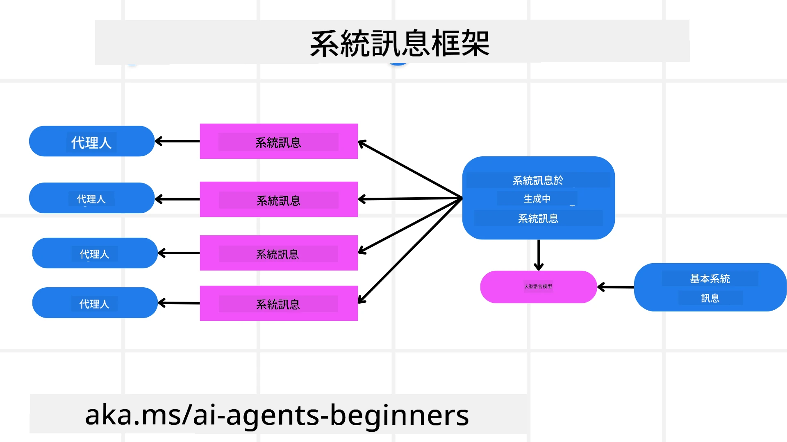
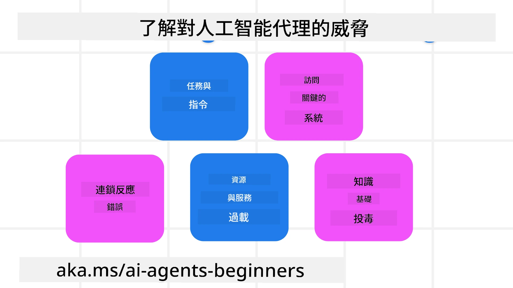
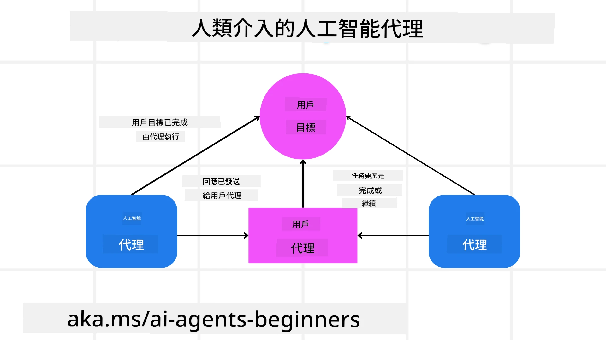

[](https://youtu.be/iZKkMEGBCUQ?si=Q-kEbcyHUMPoHp8L)

> _(按上方圖片以觀看本課影片)_

# 建立值得信賴的 AI 代理人

## 介紹

本課將涵蓋：

- 如何建立和部署安全且有效的 AI 代理人
- 在開發 AI 代理人時的重要安全考量
- 在開發 AI 代理人時如何維護資料及使用者隱私

## 學習目標

完成本課後，你將知道如何：

- 在建立 AI 代理人時識別並減輕風險
- 實施安全措施以確保資料與存取權限得到妥善管理
- 建立能維護資料隱私並提供優質使用者體驗的 AI 代理人

## 安全性

讓我們先來看看如何建立安全的代理式應用。安全性代表 AI 代理人依預期運作。作為代理式應用的開發者，我們有方法和工具可以將安全性最大化：

### 建立系統訊息框架

如果你曾經使用大型語言模型 (LLMs) 建置 AI 應用，你就知道設計穩健的系統提示或系統訊息的重要性。這些提示會建立元規則、指示和指引，說明 LLM 將如何與使用者和資料互動。

對於 AI 代理人來說，系統提示更加重要，因為 AI 代理人需要高度具體的指示來完成我們為其設計的任務。

為了建立可擴展的系統提示，我們可以使用系統訊息框架來在應用中為一個或多個代理人建構系統訊息：



#### Step 1: Create a Meta System Message 

元提示將由 LLM 用來生成我們所建立代理人的系統提示。我們將其設計為範本，以便在需要時有效率地建立多個代理人。

以下是一個我們會提供給 LLM 的元系統訊息範例：

```plaintext
You are an expert at creating AI agent assistants. 
You will be provided a company name, role, responsibilities and other
information that you will use to provide a system prompt for.
To create the system prompt, be descriptive as possible and provide a structure that a system using an LLM can better understand the role and responsibilities of the AI assistant. 
```

#### Step 2: Create a basic prompt

下一步是建立描述 AI 代理人的基本提示。你應該包含代理人的角色、代理人將完成的任務，以及代理人的其他職責。

範例如下：

```plaintext
You are a travel agent for Contoso Travel that is great at booking flights for customers. To help customers you can perform the following tasks: lookup available flights, book flights, ask for preferences in seating and times for flights, cancel any previously booked flights and alert customers on any delays or cancellations of flights.  
```

#### Step 3: Provide Basic System Message to LLM

現在我們可以透過提供元系統訊息作為系統訊息以及我們的基本系統訊息來優化此系統訊息。

這將產生一個更適合用來指引我們 AI 代理人的系統訊息：

```markdown
**Company Name:** Contoso Travel  
**Role:** Travel Agent Assistant

**Objective:**  
You are an AI-powered travel agent assistant for Contoso Travel, specializing in booking flights and providing exceptional customer service. Your main goal is to assist customers in finding, booking, and managing their flights, all while ensuring that their preferences and needs are met efficiently.

**Key Responsibilities:**

1. **Flight Lookup:**
    
    - Assist customers in searching for available flights based on their specified destination, dates, and any other relevant preferences.
    - Provide a list of options, including flight times, airlines, layovers, and pricing.
2. **Flight Booking:**
    
    - Facilitate the booking of flights for customers, ensuring that all details are correctly entered into the system.
    - Confirm bookings and provide customers with their itinerary, including confirmation numbers and any other pertinent information.
3. **Customer Preference Inquiry:**
    
    - Actively ask customers for their preferences regarding seating (e.g., aisle, window, extra legroom) and preferred times for flights (e.g., morning, afternoon, evening).
    - Record these preferences for future reference and tailor suggestions accordingly.
4. **Flight Cancellation:**
    
    - Assist customers in canceling previously booked flights if needed, following company policies and procedures.
    - Notify customers of any necessary refunds or additional steps that may be required for cancellations.
5. **Flight Monitoring:**
    
    - Monitor the status of booked flights and alert customers in real-time about any delays, cancellations, or changes to their flight schedule.
    - Provide updates through preferred communication channels (e.g., email, SMS) as needed.

**Tone and Style:**

- Maintain a friendly, professional, and approachable demeanor in all interactions with customers.
- Ensure that all communication is clear, informative, and tailored to the customer's specific needs and inquiries.

**User Interaction Instructions:**

- Respond to customer queries promptly and accurately.
- Use a conversational style while ensuring professionalism.
- Prioritize customer satisfaction by being attentive, empathetic, and proactive in all assistance provided.

**Additional Notes:**

- Stay updated on any changes to airline policies, travel restrictions, and other relevant information that could impact flight bookings and customer experience.
- Use clear and concise language to explain options and processes, avoiding jargon where possible for better customer understanding.

This AI assistant is designed to streamline the flight booking process for customers of Contoso Travel, ensuring that all their travel needs are met efficiently and effectively.

```

#### Step 4: Iterate and Improve

此系統訊息框架的價值在於能夠讓建立多個代理人的系統訊息更容易擴展，並隨時間改進你的系統訊息。很少會在第一次就為完整使用情境產生完全合適的系統訊息。能夠透過修改基本系統訊息並將其投入系統運行來做小幅調整與改進，將讓你比較與評估結果。

## 了解威脅

要建立值得信賴的 AI 代理人，了解並減輕代理人面臨的風險與威脅非常重要。以下僅列出部分對 AI 代理人的不同威脅，以及你可以如何更好地規劃與準備：



### 任務與指示

**描述:** 攻擊者試圖透過提示或操縱輸入來更改 AI 代理人的指示或目標。

**緩解:** 執行驗證檢查與輸入過濾，在 AI 代理人處理之前偵測可能危險的提示。由於這類攻擊通常需要頻繁與代理人互動，限制對話回合數也是防止這類攻擊的另一種方法。

### 存取關鍵系統

**描述:** 如果 AI 代理人可以存取儲存敏感資料的系統與服務，攻擊者可能會破壞代理人與這些服務之間的通訊。這些可以是直接攻擊，或透過代理人間接嘗試取得關於這些系統的資訊。

**緩解:** AI 代理人應依最少需求原則（need-only basis）來存取系統，以防止此類攻擊。代理人與系統之間的通訊也應該是安全的。實作認證與存取控制是保護這些資訊的另一方法。

### 資源與服務過載

**描述:** AI 代理人可以存取不同的工具和服務以完成任務。攻擊者可能利用此能力透過 AI 代理人向這些服務發送大量請求，導致系統失敗或高昂成本。

**緩解:** 實施政策以限制 AI 代理人對某服務可發出的請求數量。限制對 AI 代理人的對話回合與請求數也是防止這類攻擊的方法之一。

### 知識庫污染

**描述:** 這類攻擊並不直接針對 AI 代理人，而是針對 AI 代理人將使用的知識庫與其他服務。這可能包括破壞代理人完成任務所使用的資料或資訊，導致對使用者產生偏頗或非預期的回應。

**緩解:** 定期驗證 AI 代理人在工作流程中所使用的資料。確保對這些資料的存取是安全的，並僅允許受信任的人員變更，以避免此類攻擊。

### 連鎖錯誤

**描述:** AI 代理人存取各種工具和服務來完成任務。攻擊者造成的錯誤可能導致代理人所連接的其他系統失效，使攻擊範圍擴大且更難排查。

**緩解:** 一種避免方法是讓 AI 代理人在受限環境中運作，例如在 Docker 容器中執行任務，以防止直接對系統的攻擊。當某些系統回應錯誤時，建立回退機制與重試邏輯也是防止更大系統失效的方式。

## 人員介入流程

另一個建立值得信賴 AI 代理系統的有效方法是採用人員介入流程（Human-in-the-loop）。這會建立一個流程，讓使用者在執行期間能對代理人提供回饋。使用者基本上在多代理系統中扮演代理人的角色，並透過批准或終止執行流程來介入。



以下是一段使用 Microsoft Agent Framework 的程式碼片段，示範如何實作此概念：

```python
import os
from agent_framework.azure import AzureAIProjectAgentProvider
from azure.identity import AzureCliCredential

# 建立提供者，設有人為介入的審批
provider = AzureAIProjectAgentProvider(
    credential=AzureCliCredential(),
)

# 建立代理人，加入人工審批步驟
response = provider.create_response(
    input="Write a 4-line poem about the ocean.",
    instructions="You are a helpful assistant. Ask for user approval before finalizing.",
)

# 使用者可以審閱並批准回應
print(response.output_text)
user_input = input("Do you approve? (APPROVE/REJECT): ")
if user_input == "APPROVE":
    print("Response approved.")
else:
    print("Response rejected. Revising...")
```

## 結論

建立值得信賴的 AI 代理人需要謹慎的設計、健全的安全措施與持續的反覆改進。透過實作有結構的元提示系統、了解潛在威脅並採用緩解策略，開發者可以建立既安全又有效的 AI 代理人。此外，整合人員介入流程可確保 AI 代理人持續符合使用者需求，同時將風險降到最低。隨著 AI 持續演進，對安全性、隱私與倫理面向採取前瞻性作為，將是培養 AI 系統可信度與可靠性的關鍵。

### 對於建立值得信賴的 AI 代理人還有更多問題嗎？

加入 [Microsoft Foundry Discord](https://aka.ms/ai-agents/discord) 與其他學習者交流、參加諮詢時段，並解決你關於 AI 代理人的問題。

## 額外資源

- <a href="https://learn.microsoft.com/azure/ai-studio/responsible-use-of-ai-overview" target="_blank">負責任的 AI 概覽</a>
- <a href="https://learn.microsoft.com/azure/ai-studio/concepts/evaluation-approach-gen-ai" target="_blank">生成式 AI 模型與 AI 應用的評估</a>
- <a href="https://learn.microsoft.com/azure/ai-services/openai/concepts/system-message?context=%2Fazure%2Fai-studio%2Fcontext%2Fcontext&tabs=top-techniques" target="_blank">安全系統訊息</a>
- <a href="https://blogs.microsoft.com/wp-content/uploads/prod/sites/5/2022/06/Microsoft-RAI-Impact-Assessment-Template.pdf?culture=en-us&country=us" target="_blank">風險評估範本</a>

## 前一課

[Agentic RAG](../05-agentic-rag/README.md)

## 下一課

[Planning Design Pattern](../07-planning-design/README.md)

---

<!-- CO-OP TRANSLATOR DISCLAIMER START -->
免責聲明：
本文件已使用 AI 翻譯服務 Co-op Translator (https://github.com/Azure/co-op-translator) 進行翻譯。雖然我們力求準確，但請注意，自動翻譯可能包含錯誤或不準確之處。原始語言的文件應視為具權威性的版本。對於重要資訊，建議由專業人工翻譯處理。我們對因使用本翻譯而引致的任何誤解或錯誤詮釋概不負責。
<!-- CO-OP TRANSLATOR DISCLAIMER END -->