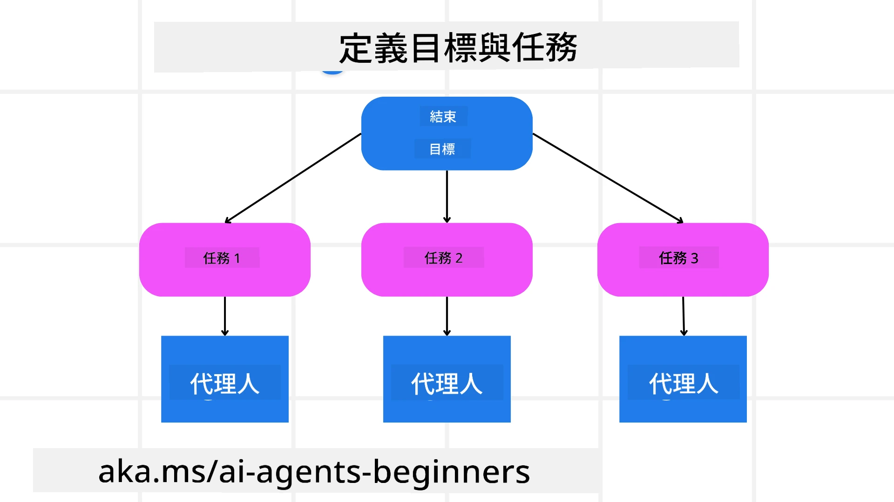

[](https://youtu.be/kPfJ2BrBCMY?si=9pYpPXp0sSbK91Dr)

> _(按上方圖片以觀看此課程的影片)_

# 規劃設計

## 介紹

本課程將涵蓋

* 定義清晰的整體目標並將複雜任務拆解為可管理的子任務。
* 利用結構化輸出以取得較可靠且機器可讀的回應。
* 應用事件驅動的方法來處理動態任務和意外輸入。

## 學習目標

完成本課後，您將了解：

* 為 AI 代理識別並設定整體目標，確保其清楚知道需要達成的事項。
* 將複雜任務分解為可管理的子任務並將其組織成合乎邏輯的順序。
* 為代理配備合適的工具（例如搜尋工具或資料分析工具），決定何時以及如何使用它們，並處理出現的意外情況。
* 評估子任務結果、衡量效能，並透過迭代行動來改進最終輸出。

## 訂定整體目標與拆解任務



大多數現實世界的任務過於複雜，無法在單一步驟中完成。AI 代理需要一個簡潔的目標來引導其規劃與行動。例如，考慮以下目標：

    "生成一個為期三天的旅遊行程。"

雖然這句話很簡單，但仍需要進一步細化。目標越清楚，代理（以及任何人類協作者）就越能專注於達成正確的結果，例如建立包含航班選項、飯店推薦與活動建議的完整行程。

### 任務拆解

大型或複雜的任務在拆分為較小且以目標為導向的子任務後會變得更易管理。
以旅遊行程為例，可以將目標拆解為：

* 機票預訂
* 飯店預訂
* 租車
* 個人化

每個子任務都可以由專責代理或流程來處理。一個代理可能專精於搜尋最佳機票優惠，另一個則專注於飯店預訂，依此類推。一個協調或「下游」代理可以匯整這些結果，並將一個完整的行程呈交給最終使用者。

這種模組化的方法也允許逐步增強。例如，您可以新增專門負責餐飲推薦或在地活動建議的代理，並隨時間微調行程。

### 結構化輸出

大型語言模型（LLM）可以產生結構化輸出（例如 JSON），以便下游代理或服務更容易解析與處理。這在多代理情境中特別有用，因為在收到規劃輸出後我們可以據此執行這些任務。

下面的 Python 範例示範一個簡單的規劃代理將目標拆解為子任務並產生結構化計劃：

```python
from pydantic import BaseModel
from enum import Enum
from typing import List, Optional, Union
import json
import os
from typing import Optional
from pprint import pprint
from agent_framework.azure import AzureAIProjectAgentProvider
from azure.identity import AzureCliCredential

class AgentEnum(str, Enum):
    FlightBooking = "flight_booking"
    HotelBooking = "hotel_booking"
    CarRental = "car_rental"
    ActivitiesBooking = "activities_booking"
    DestinationInfo = "destination_info"
    DefaultAgent = "default_agent"
    GroupChatManager = "group_chat_manager"

# 旅遊子任務模型
class TravelSubTask(BaseModel):
    task_details: str
    assigned_agent: AgentEnum  # 我們想把任務指派給代理人

class TravelPlan(BaseModel):
    main_task: str
    subtasks: List[TravelSubTask]
    is_greeting: bool

provider = AzureAIProjectAgentProvider(credential=AzureCliCredential())

# 定義用戶訊息
system_prompt = """You are a planner agent.
    Your job is to decide which agents to run based on the user's request.
    Provide your response in JSON format with the following structure:
{'main_task': 'Plan a family trip from Singapore to Melbourne.',
 'subtasks': [{'assigned_agent': 'flight_booking',
               'task_details': 'Book round-trip flights from Singapore to '
                               'Melbourne.'}
    Below are the available agents specialised in different tasks:
    - FlightBooking: For booking flights and providing flight information
    - HotelBooking: For booking hotels and providing hotel information
    - CarRental: For booking cars and providing car rental information
    - ActivitiesBooking: For booking activities and providing activity information
    - DestinationInfo: For providing information about destinations
    - DefaultAgent: For handling general requests"""

user_message = "Create a travel plan for a family of 2 kids from Singapore to Melbourne"

response = client.create_response(input=user_message, instructions=system_prompt)

response_content = response.output_text
pprint(json.loads(response_content))
```

### 具有多代理編排的規劃代理

在此範例中，一個語意路由器代理會接收使用者請求（例如：「我需要一份旅程的酒店計劃。」）。

接著規劃者會：

* 接收飯店計劃：規劃者會根據系統提示（包括可用代理詳細資訊）處理使用者訊息，並產生結構化的旅遊計劃。
* 列出代理與其工具：代理註冊表包含代理清單（例如針對航班、飯店、租車與活動的代理）以及它們提供的功能或工具。
* 將計劃路由到相應代理：視子任務數量而定，規劃者要麼直接將訊息發送給專責代理（單一任務情況），要麼透過群組聊天室管理員協調多代理間的協作。
* 彙總結果：最後，規劃者會彙整所產生的計劃以便於理解。
以下 Python 範例程式碼說明了這些步驟：

```python

from pydantic import BaseModel

from enum import Enum
from typing import List, Optional, Union

class AgentEnum(str, Enum):
    FlightBooking = "flight_booking"
    HotelBooking = "hotel_booking"
    CarRental = "car_rental"
    ActivitiesBooking = "activities_booking"
    DestinationInfo = "destination_info"
    DefaultAgent = "default_agent"
    GroupChatManager = "group_chat_manager"

# 旅行子任務模型

class TravelSubTask(BaseModel):
    task_details: str
    assigned_agent: AgentEnum # 我們想把任務分配給代理人

class TravelPlan(BaseModel):
    main_task: str
    subtasks: List[TravelSubTask]
    is_greeting: bool
import json
import os
from typing import Optional

from agent_framework.azure import AzureAIProjectAgentProvider
from azure.identity import AzureCliCredential

# 建立客戶端

provider = AzureAIProjectAgentProvider(credential=AzureCliCredential())

from pprint import pprint

# 定義使用者訊息

system_prompt = """You are a planner agent.
    Your job is to decide which agents to run based on the user's request.
    Below are the available agents specialized in different tasks:
    - FlightBooking: For booking flights and providing flight information
    - HotelBooking: For booking hotels and providing hotel information
    - CarRental: For booking cars and providing car rental information
    - ActivitiesBooking: For booking activities and providing activity information
    - DestinationInfo: For providing information about destinations
    - DefaultAgent: For handling general requests"""

user_message = "Create a travel plan for a family of 2 kids from Singapore to Melbourne"

response = client.create_response(input=user_message, instructions=system_prompt)

response_content = response.output_text

# 把回應內容載入為 JSON 後列印出來

pprint(json.loads(response_content))
```

以下為前述程式的輸出，您可以使用此結構化輸出將任務路由到 `assigned_agent` 並向最終使用者彙整旅遊計劃。

```json
{
    "is_greeting": "False",
    "main_task": "Plan a family trip from Singapore to Melbourne.",
    "subtasks": [
        {
            "assigned_agent": "flight_booking",
            "task_details": "Book round-trip flights from Singapore to Melbourne."
        },
        {
            "assigned_agent": "hotel_booking",
            "task_details": "Find family-friendly hotels in Melbourne."
        },
        {
            "assigned_agent": "car_rental",
            "task_details": "Arrange a car rental suitable for a family of four in Melbourne."
        },
        {
            "assigned_agent": "activities_booking",
            "task_details": "List family-friendly activities in Melbourne."
        },
        {
            "assigned_agent": "destination_info",
            "task_details": "Provide information about Melbourne as a travel destination."
        }
    ]
}
```

包含前述程式範例的示例筆記本可於 [這裡](07-python-agent-framework.ipynb) 取得。

### 迭代規劃

有些任務需要來回或重新規劃，其中一個子任務的結果會影響下一個子任務。例如，如果代理在訂票時發現意外的資料格式，可能需要在繼續進行飯店預訂之前調整策略。

此外，使用者回饋（例如有人決定他們偏好較早的航班）也會觸發部分重新規劃。這種動態、迭代的方法可確保最終解決方案符合現實限制與不斷演變的使用者偏好。

例如：範例程式碼

```python
from agent_framework.azure import AzureAIProjectAgentProvider
from azure.identity import AzureCliCredential
#.. 同之前嘅程式碼一樣，並傳送用戶歷史記錄及當前計劃

system_prompt = """You are a planner agent to optimize the
    Your job is to decide which agents to run based on the user's request.
    Below are the available agents specialized in different tasks:
    - FlightBooking: For booking flights and providing flight information
    - HotelBooking: For booking hotels and providing hotel information
    - CarRental: For booking cars and providing car rental information
    - ActivitiesBooking: For booking activities and providing activity information
    - DestinationInfo: For providing information about destinations
    - DefaultAgent: For handling general requests"""

user_message = "Create a travel plan for a family of 2 kids from Singapore to Melbourne"

response = client.create_response(
    input=user_message,
    instructions=system_prompt,
    context=f"Previous travel plan - {TravelPlan}",
)
# .. 重新規劃，並將任務分派畀相應嘅代理
```

如需更全面的規劃，請參閱 Magnetic One <a href="https://www.microsoft.com/research/articles/magentic-one-a-generalist-multi-agent-system-for-solving-complex-tasks" target="_blank">博客文章</a>，以解決複雜任務。

## 總結

在本文中，我們檢視了一個範例，說明如何建立一個能動態選擇已定義可用代理的規劃器。規劃器的輸出會將任務拆解並指派代理以便執行。假設這些代理能存取執行任務所需的函數/工具。除了代理之外，您還可以加入其他模式，例如反思、總結器與輪流聊天，以進一步自訂。

## 其他資源

Magentic One - 一個用於解決複雜任務的通用多代理系統，在多項具挑戰性的代理基準測試中取得了令人印象深刻的成果。參考：<a href="https://www.microsoft.com/research/articles/magentic-one-a-generalist-multi-agent-system-for-solving-complex-tasks" target="_blank">Magentic One</a>。在此實作中，協調者會建立任務特定的計劃並將這些任務委派給可用的代理。除了規劃之外，協調者也會採用追蹤機制來監控任務進度，並在需要時重新規劃。

### 對規劃設計模式有更多問題嗎？

加入 [Microsoft Foundry Discord](https://aka.ms/ai-agents/discord) 與其他學習者交流、參加諮詢時間，並獲得關於 AI 代理的問題解答。

## 上一課

[建立可信賴的 AI 代理](../06-building-trustworthy-agents/README.md)

## 下一課

[多代理設計模式](../08-multi-agent/README.md)

---

<!-- CO-OP TRANSLATOR DISCLAIMER START -->
免責聲明：
本文件已使用 AI 翻譯服務 [Co-op Translator](https://github.com/Azure/co-op-translator) 進行翻譯。雖然我們力求準確，但敬請注意，自動翻譯可能包含錯誤或不準確之處。原始語言的文件應視為具權威性的版本。對於重要資訊，建議委託專業人工翻譯。對於因使用本翻譯而導致的任何誤解或誤譯，我們概不負責。
<!-- CO-OP TRANSLATOR DISCLAIMER END -->