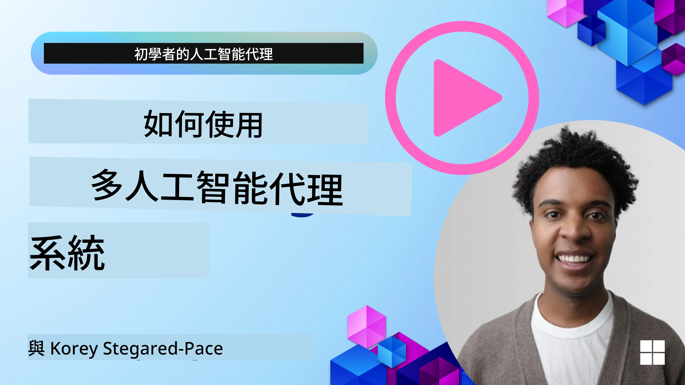
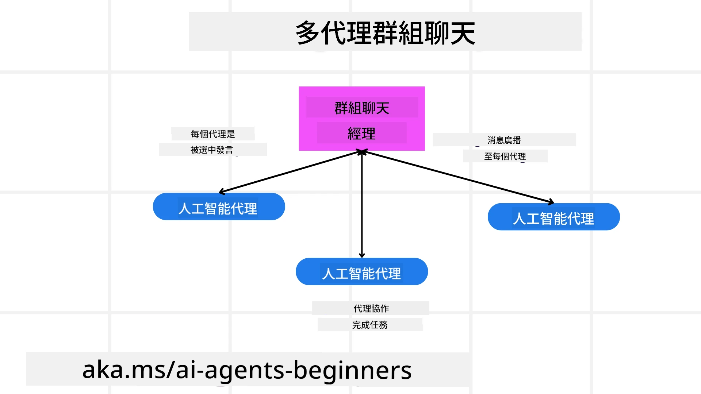
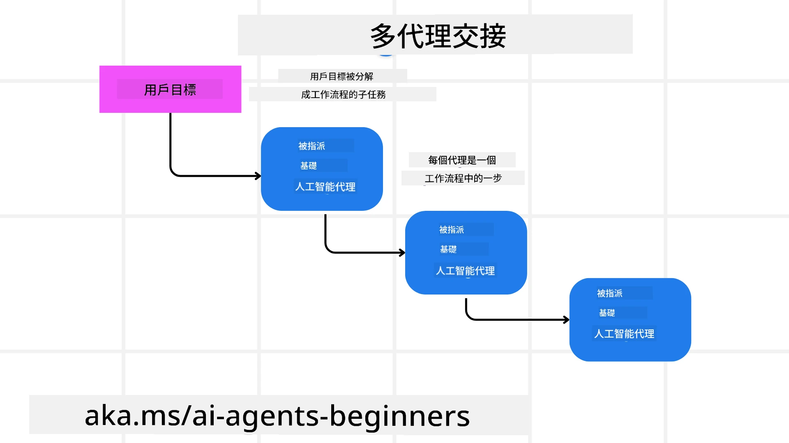
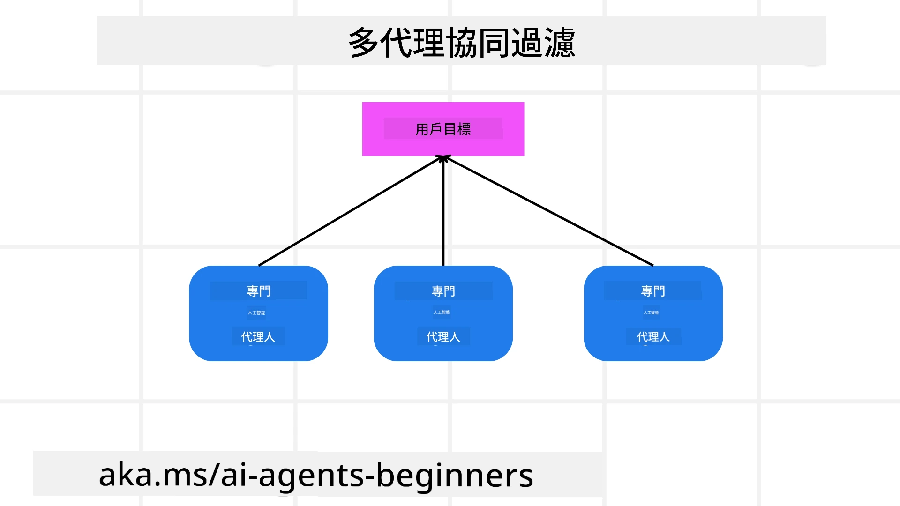

> _(點擊上方圖片觀看此課堂的影片)_

# 多智能體設計模式

一旦你開始在一個涉及多個智能體的專案工作，你就需要考慮多智能體設計模式。不過，可能不會立即清楚何時要切換到多智能體，以及其優勢為何。

## 介紹

在本課程中，我們會嘗試回答以下問題：

- 哪些情境適合使用多智能體？
- 與單一智能體處理多項任務相比，使用多智能體有哪些優勢？
- 實作多智能體設計模式的構成要素有哪些？
- 如何能觀察到多個智能體之間的互動？

## 學習目標

完成本課程後，你應該能夠：

- 識別適合使用多智能體的情境
- 了解使用多智能體相對於單一智能體的優勢。
- 理解實作多智能體設計模式的構成要素。

整體來看：

*多智能體是一種設計模式，允許多個智能體共同合作以達成共同目標*。

這種模式廣泛應用於各個領域，包括機器人技術、自主系統和分散式運算。

## 適合使用多智能體的情境

哪些情境適合使用多智能體？答案是有很多情境特別適合採用多智能體，尤其是以下情況：

- **大型工作量**: 大型工作量可以拆分成較小的任務並分配給不同的智能體，允許並行處理並更快完成。舉例來說，大型資料處理任務就是一個例子。
- **複雜任務**: 像大型工作量一樣，複雜任務可以被拆解成更小的子任務並分配給不同智能體，每個智能體專精於任務的特定面向。舉例是自駕車，當中不同智能體分別管理導航、障礙偵測以及與其他車輛的通訊。
- **多元專長**: 不同智能體可以擁有多元專長，使它們能比單一智能體更有效地處理任務的不同面向。舉例是醫療保健領域，智能體可分別負責診斷、治療計畫和病人監測。

## 使用多智能體相較於單一智能體的優勢

單一智能體系統對於簡單任務可能運作良好，但對於更複雜的任務，使用多個智能體可以提供數項優勢：

- **專業化**: 每個智能體可以專精於特定任務。單一智能體缺乏專業化，代表你會有一個能做所有事卻可能在面對複雜任務時不知所措的智能體。它可能最終做出不適合自己的任務。
- **可擴展性**: 透過增加更多智能體比起讓單一智能體超負荷更容易擴展系統。
- **容錯性**: 若其中一個智能體失效，其他智能體仍可繼續運作，確保系統可靠性。

舉例來說，為使用者預訂行程。單一智能體系統必須處理行程預訂流程的所有面向，從尋找航班到預訂飯店和租車。要用單一智能體達成這些，該智能體需要有處理所有這些任務的工具。這可能導致系統複雜且單一化，難以維護和擴展。多智能體系統則可以有不同智能體專門負責尋找航班、預訂飯店和租車。這會使系統更模組化、更易維護並具可擴展性。

把這比作一間由夫妻小店經營的旅行社與一間特許經營的旅行社。夫妻小店會由單一智能體處理行程預訂的所有面向，而特許經營則會由不同智能體處理行程預訂的不同面向。

## 實作多智能體設計模式的構成要素

在實作多智能體設計模式之前，你需要理解構成該模式的要素。

讓這個概念更具體，我們再次以為使用者預訂行程為例。在這個案例中，構成要素會包括：

- **智能體通訊**: 負責尋找航班、預訂飯店和租車的智能體需要溝通並分享有關使用者偏好和限制的資訊。你需要決定此通訊的協議和方法。具體來說，尋找航班的智能體需要與預訂飯店的智能體溝通，確保飯店的預訂日期與航班相同。那表示這些智能體需要共享使用者的旅行日期，意味著你必須決定 *哪些智能體在分享資訊以及如何分享資訊*。
- **協調機制**: 智能體需要協調它們的行動以確保滿足使用者的偏好和限制。使用者偏好可能是想住靠近機場的飯店，而限制可能是租車僅在機場可取車。這代表預訂飯店的智能體需要與預訂租車的智能體協調以確保符合使用者的偏好和限制。這意味著你需要決定 *智能體如何協調它們的行動*。
- **智能體架構**: 智能體需要有內部結構以做決策並從與使用者的互動中學習。這表示尋找航班的智能體需要有內部結構來決定要向使用者推薦哪些航班。這意味著你需要決定 *智能體如何做決策並從與使用者的互動中學習*。舉例智能體學習與改進的方法可以是，尋找航班的智能體可以使用機器學習模型根據使用者過去的偏好來推薦航班。
- **多智能體互動的可視性**: 你需要能夠查看多個智能體如何互相互動。這表示你需要具備追蹤智能體活動和互動的工具與技術。這可以是日誌和監控工具、視覺化工具以及效能指標等形式。
- **多智能體模式**: 實作多智能體系統有不同模式，例如集中式、去中心化和混合式架構。你需要決定最符合你使用情境的模式。
- **人類介入**: 在大多數情況下，你會有介入的人類，且你需要指示智能體何時尋求人類介入。這可以是使用者要求特定飯店或航班，智能體未建議該選項，或在預訂航班或飯店前要求確認。

## 多智能體互動的可視性

檢視多個智能體之間的互動很重要。這種可視性對於除錯、優化以及確保整體系統效能至關重要。為達成此目標，你需要追蹤智能體活動和互動的工具與技術。這可以是日誌與監控工具、視覺化工具，以及績效指標等形式。

舉例來說，在為使用者預訂行程的情境中，你可以有一個儀表板顯示每個智能體的狀態、使用者的偏好與限制，以及智能體之間的互動。這個儀表板可以顯示使用者的旅行日期、航班智能體推薦的航班、飯店智能體推薦的飯店，以及租車智能體推薦的租車。這會讓你清楚看到智能體之間如何互動，以及使用者的偏好與限制是否被滿足。

讓我們更詳細地看看這些面向。

- **日誌與監控工具**: 你要為每個智能體所採取的每項動作進行日誌記錄。日誌條目可以儲存採取動作的智能體、所採取的動作、動作發生的時間，以及動作的結果。這些資訊可以用來除錯、優化等。
- **視覺化工具**: 視覺化工具可以幫助你以更直觀的方式看見智能體之間的互動。例如，你可以有一個圖表顯示智能體之間資訊流動。這可以幫助你識別系統中的瓶頸、低效率與其他問題。
- **效能指標**: 效能指標可以幫助追蹤多智能體系統的效用。例如，你可以追蹤完成一項任務所需的時間、每單位時間完成的任務數量，以及智能體所做推薦的準確率。這些資訊可以幫助你找出改進空間並優化系統。

## 多智能體模式

接下來深入一些可用於建立多智能體應用的具體模式。以下是一些值得考慮的有趣模式：

### 群組聊天

當你想建立一個群組聊天應用，讓多個智能體可以互相通訊時，此模式非常有用。此模式的典型使用情境包括團隊協作、客服支援與社交網路。

在此模式中，每個智能體代表群組聊天中的一個使用者，訊息透過一個通訊協議在智能體之間交換。智能體可以向群組發送訊息、從群組接收訊息，並回應其他智能體的訊息。

此模式可以用集中式架構實作，所有訊息都經由中央伺服器轉發，或用去中心化架構，訊息在智能體之間直接交換。

### 交接

當你想建立一個應用，讓多個智能體可以彼此交接任務時，此模式非常有用。

此模式的典型使用情境包括客服支援、任務管理與工作流程自動化。

在此模式中，每個智能體代表一個任務或工作流程中的一步，智能體可根據預先定義的規則將任務交接給其他智能體。

### 協同過濾

當你想建立一個應用，讓多個智能體能夠合作為使用者提供推薦時，此模式非常有用。

之所以需要多個智能體合作，是因為每個智能體可以擁有不同的專長，並以不同方式為推薦流程貢獻。

舉例來說，當使用者想要在股市上獲得最佳買股建議時：

- **產業專家**:. 一個智能體可以是特定產業的專家。
- **技術分析**: 另一個智能體可以是技術分析方面的專家。
- **基本面分析**: 還有一個智能體可以是基本面分析方面的專家。透過合作，這些智能體可以為使用者提供更全面的建議。

## 情境：退款流程

考慮一個顧客嘗試為產品取得退款的情境，這個流程可能涉及相當多的智能體，但我們將其分為專屬於此流程的智能體與可在其他流程中使用的通用智能體。

**特定於退款流程的智能體**:

以下是一些可能參與退款流程的智能體：

- **顧客智能體**: 此智能體代表顧客，負責發起退款流程。
- **賣家智能體**: 此智能體代表賣家，負責處理退款。
- **付款智能體**: 此智能體代表付款流程，負責退還顧客的款項。
- **調解智能體**: 此智能體代表調解流程，負責解決退款流程中出現的任何問題。
- **合規智能體**: 此智能體代表合規流程，負責確保退款流程符合法規與政策。

**通用智能體**:

這些智能體可以被業務的其他部分重複使用。

- **運輸智能體**: 此智能體代表運輸流程，負責將產品運回給賣家。此智能體既可用於退款流程，也可用於例如購買後的一般運送。
- **回饋智能體**: 此智能體代表回饋流程，負責蒐集顧客的回饋。回饋可以在任何時間發生，而不只在退款期間。
- **升級智能體**: 此智能體代表升級流程，負責將問題升級到更高級別的支援。你可以在任何需要升級問題的流程中使用此類智能體。
- **通知智能體**: 此智能體代表通知流程，負責在退款流程的各個階段向顧客發送通知。
- **分析智能體**: 此智能體代表分析流程，負責分析與退款流程相關的資料。
- **稽核智能體**: 此智能體代表稽核流程，負責稽核退款流程以確保其正確執行。
- **報告智能體**: 此智能體代表報告流程，負責產生退款流程的報告。
- **知識智能體**: 此智能體代表知識流程，負責維護與退款流程相關的知識庫。此智能體可以同時對退款和業務其他部分有所了解。
- **安全智能體**: 此智能體代表安全流程，負責確保退款流程的安全性。
- **品質智能體**: 此智能體代表品質流程，負責確保退款流程的品質。

先前列出了相當多的智能體，既有特定於退款流程的，也有可用於業務其他部分的通用智能體。希望這能讓你了解如何決定在多智能體系統中使用哪些智能體。

## 作業

為客服流程設計一個多智能體系統。識別參與該流程的智能體、它們的角色與責任，以及它們如何互相互動。請同時考慮特定於客服流程的智能體與可用於業務其他部分的通用智能體。
> 在閱讀以下解決方案前請先思考，你可能需要比想像中更多的代理。
>
> 提示：考慮客戶支援流程的不同階段，並且考慮任何系統所需的代理。

## Solution

[解決方案](./solution/solution.md)

## Knowledge checks

Question: When should you consider using multi-agents?

- [ ] A1: 當你有少量工作負載和簡單任務時。
- [ ] A2: 當你有大量工作負載時
- [ ] A3: 當你有一個簡單任務時。

[解答測驗](./solution/solution-quiz.md)

## Summary

在本課中，我們已檢視多代理設計模式，包括適用多代理的情境、使用多代理相對於單一代理的優勢、實作多代理設計模式的構成要素，以及如何可視化多個代理之間的互動。

### Got More Questions about the Multi-Agent Design Pattern?

加入 [Microsoft Foundry Discord](https://aka.ms/ai-agents/discord) 與其他學習者見面、參加辦公時間，並解答你對 AI 代理的問題。

## Additional resources

- <a href="https://learn.microsoft.com/azure/ai-services/agents/overview" target="_blank">Microsoft Agent Framework 文件</a>
- <a href="https://www.analyticsvidhya.com/blog/2024/10/agentic-design-patterns/" target="_blank">代理式設計模式</a>

## Previous Lesson

[規劃設計](../07-planning-design/README.md)

## Next Lesson

[AI 代理中的後設認知](../09-metacognition/README.md)

---

<!-- CO-OP TRANSLATOR DISCLAIMER START -->
免責聲明：
本文件透過 AI 翻譯服務 [Co-op Translator](https://github.com/Azure/co-op-translator) 進行翻譯。儘管我們力求準確，請注意自動翻譯可能包含錯誤或不準確之處。原始語言的原文應被視為具權威性的版本。對於重要資訊，建議採用專業人工翻譯。我們不會就因使用本翻譯而導致的任何誤解或錯誤詮釋承擔責任。
<!-- CO-OP TRANSLATOR DISCLAIMER END -->