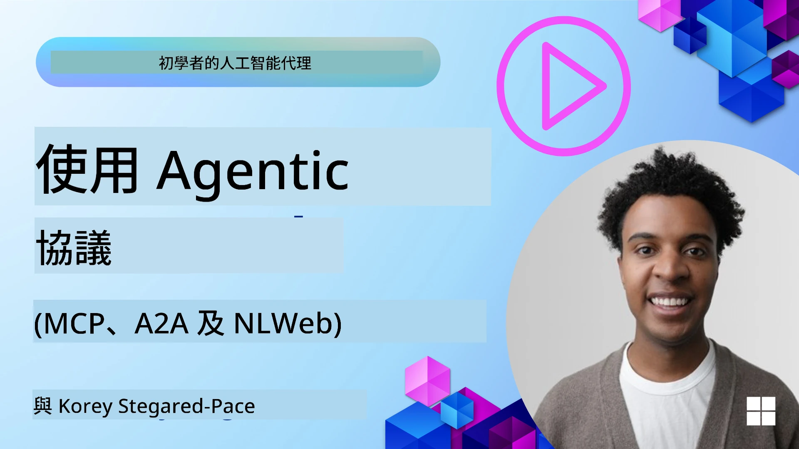
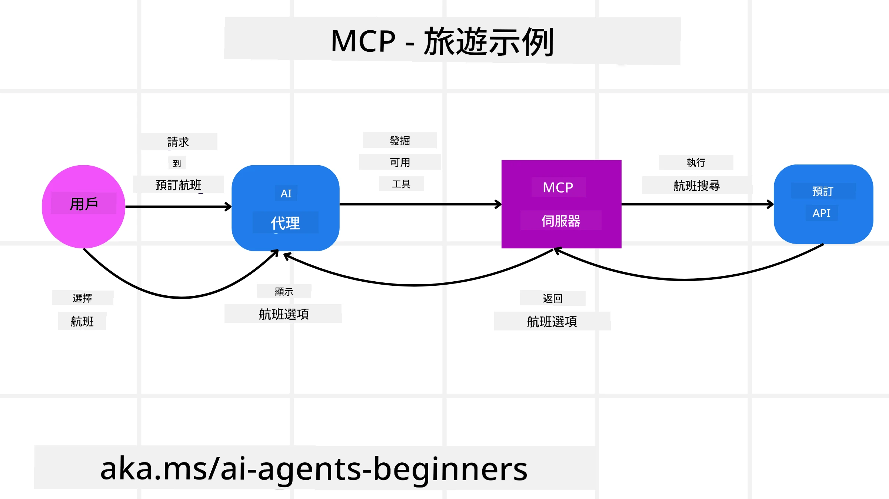
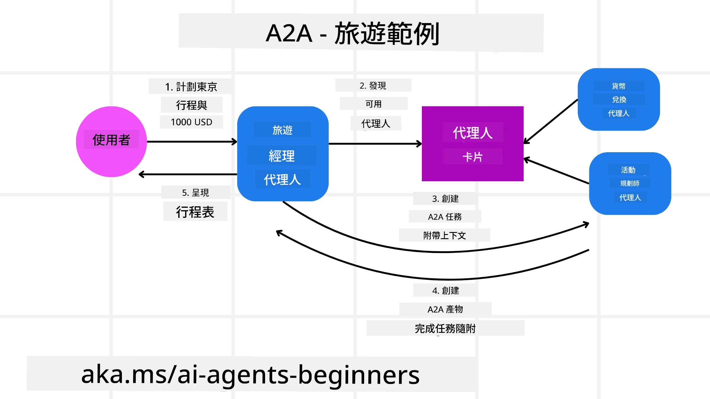
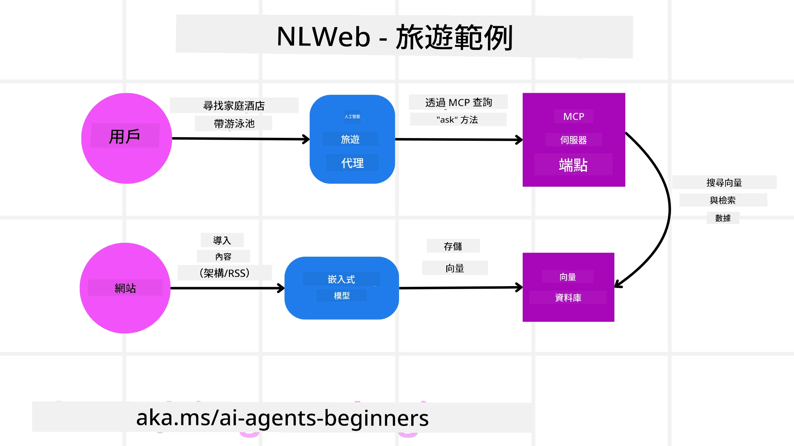

# 使用代理協議（MCP、A2A 和 NLWeb）

> _(點擊上方圖片查看本課程影片)_

隨著 AI 代理使用量的增加，對確保標準化、安全性並支持開放創新的協議需求也日益增長。在本課程中，我們將介紹三個旨在滿足這些需求的協議——模型上下文協議（MCP）、代理對代理（A2A）和自然語言網絡（NLWeb）。

## 介紹

在本課程中，我們將涵蓋：

• 如何透過 **MCP** 允許 AI 代理存取外部工具和數據以完成用戶任務。

• 如何透過 **A2A** 促進不同 AI 代理之間的溝通與協作。

• 如何透過 **NLWeb** 為任何網站帶來自然語言介面，使 AI 代理能夠發現並互動網站內容。

## 學習目標

• **識別** MCP、A2A 和 NLWeb 在 AI 代理情境中的核心目的與益處。

• **解釋** 每個協議如何促進大型語言模型（LLMs）、工具與其他代理之間的溝通與互動。

• **認識** 每個協議在構建複雜代理系統中所扮演的不同角色。

## 模型上下文協議

**模型上下文協議（MCP）** 是一個開放標準，提供了標準化方式，讓應用程式能向大型語言模型提供上下文和工具。這使得 AI 代理可以透過一致的方式連接到不同的數據來源和工具，就像一個“通用接頭”。

讓我們來看看 MCP 的組成部分、相較於直接使用 API 的優勢，以及 AI 代理如何運用 MCP 伺服器的示例。

### MCP 核心組件

MCP 採用**客戶端-伺服器架構**，核心組件包括：

• **Hosts（主機）** 是大型語言模型應用（例如 VSCode 這類程式碼編輯器），它們啟動與 MCP 伺服器的連線。

• **Clients（客戶端）** 是主機應用中的組件，與伺服器維持一對一連線。

• **Servers（伺服器）** 是輕量型程式，負責曝光特定功能。

協議中包含三個核心原語，即 MCP 伺服器提供的功能：

• **Tools（工具）**：這些是 AI 代理可呼叫的獨立動作或功能。例如，天氣服務可能提供「取得天氣」工具，或電商伺服器可能提供「購買商品」工具。MCP 伺服器會在功能列表中公布每個工具的名稱、說明及輸入/輸出格式。

• **Resources（資源）**：這些是 MCP 伺服器能提供的唯讀資料項目或文件，客戶端可以按需取用。例子包括檔案內容、資料庫記錄或日誌檔案。資源可以是文字（如程式碼或 JSON）或二進位檔案（如圖片或 PDF）。

• **Prompts（提示）**：這些是預定義的範本，提供建議的提示詞，支援更複雜的工作流程。

### MCP 優點

MCP 為 AI 代理帶來顯著優勢：

• **動態工具發現**：代理能動態獲得伺服器可用工具清單及其描述，與傳統 API 需靜態編碼整合不同，API 變更需更新程式碼，MCP 則實現一次整合、多處使用，適應力更強。

• **跨 LLM 互操作性**：MCP 支援不同大型語言模型，靈活切換核心模型以尋求更佳表現。

• **標準化安全性**：MCP 包含標準認證方法，當新增多個 MCP 伺服器時更易擴展，較傳統 API 管理不同金鑰和認證形式來得簡單。

### MCP 範例

假設用戶想使用由 MCP 支援的 AI 助理訂購機票。

1. **連線**：AI 助理（MCP 客戶端）連接到航空公司提供的 MCP 伺服器。

2. **工具發現**：客戶端詢問航空公司的 MCP 伺服器：「你們有哪些工具？」伺服器回覆具有「搜尋航班」及「訂票」等工具。

3. **工具呼叫**：用戶請求 AI 助理「幫我搜尋從波特蘭到檀香山的航班」，AI 助理透過其 LLM 判斷需呼叫「搜尋航班」工具並傳遞相應參數（起點、終點）給 MCP 伺服器。

4. **執行與回應**：作為包裝器的 MCP 伺服器呼叫航空公司內部訂票 API，接收航班資訊（如 JSON 資料），並回傳給 AI 助理。

5. **進一步互動**：AI 助理呈現航班選項，用戶選擇後，助理可能呼叫同一 MCP 伺服器上的「訂票」工具完成訂票流程。

## 代理間協議（A2A）

MCP 著重於連接 LLM 和工具，**代理對代理（A2A）協議** 則更進一步，促進不同 AI 代理之間的溝通和協作。A2A 連接跨組織、環境及技術堆疊的 AI 代理，共同完成用戶分配的任務。

我們會探討 A2A 的組成與優勢，並以旅遊應用為例說明其應用方式。

### A2A 核心組件

A2A 注重代理間溝通與合作完成用戶子任務，協議每個組件皆為此目標作貢獻：

#### 代理卡（Agent Card）

類似 MCP 伺服器共享工具清單，代理卡具備：
- 代理名稱。
- 完成的**一般任務說明**。
- **具體技能清單**及說明，讓其他代理甚至人類使用者了解何時何故應呼叫該代理。
- 代理的**當前端點 URL**。
- 代理的**版本**和**功能**（如串流回應及推送通知）。

#### 代理執行器（Agent Executor）

代理執行器負責**將用戶聊天上下文傳給遠端代理**，該遠端代理需要此上下文以理解需完成的任務。在 A2A 伺服器中，代理使用自身大型語言模型解析來請求並利用自身內部工具執行任務。

#### 藝術品（Artifact）

當遠端代理完成任務後，產出作品即為藝術品。藝術品**包含代理工作的結果**、**任務描述**以及透過協議傳送的**文字上下文**。藝術品送出後，與遠端代理的連線關閉，直到再次需要時重新建立。

#### 事件隊列（Event Queue）

此組件用於**處理更新與傳遞訊息**，在生產環境中對代理系統尤其重要，因為它避免任務未完成時代理間連線被關閉，尤其當任務完成需要較長時間時。

### A2A 優點

• **強化協作**：允許不同廠商與平台的代理互動、共享上下文並共同作業，促進原本分離系統間的無縫自動化。

• **模型選擇彈性**：每個 A2A 代理可自由決定使用何種 LLM 服務請求，支援針對代理優化或微調模型，與某些 MCP 單一 LLM 連接模式不同。

• **內建認證機制**：A2A 協議直接整合認證，為代理交互提供堅實安全框架。

### A2A 範例

讓我們擴展旅遊訂票情境，這次用 A2A 來實現。

1. **用戶向多代理下單**：用戶與「旅遊代理」A2A 用戶端/代理互動，說「幫我訂下週去檀香山的全程旅遊，包含機票、飯店及租車」。

2. **旅遊代理調度**：旅遊代理收到複雜請求，運用其 LLM 理解任務並判斷須與其他專門代理互動。

3. **代理間通訊**：旅遊代理使用 A2A 協議連結下游代理，如由不同公司建立的「航空公司代理」、「飯店代理」及「租車代理」。

4. **任務委派執行**：旅遊代理向這些專門代理發送具體任務（例如「找檀香山航班」、「訂飯店」、「租車」）。每個專門代理運作其自身 LLM，並利用自己的工具（可視為 MCP 伺服器）完成特定訂票任務。

5. **整合回應**：所有下游代理任務完成後，旅遊代理彙整結果（航班資訊、飯店確認、租車訂單），以聊天形式回覆用戶。

## 自然語言網絡（NLWeb）

網站一直是用戶存取網際網路資訊與資料的主要方式。

讓我們探討 NLWeb 的不同組件、其優勢，以及以旅遊應用說明 NLWeb 的運作。

### NLWeb 組件

- **NLWeb 應用程式（核心服務程式碼）**：處理自然語言問題的系統，連結平台各部分以產生回應。它是**提供網站自然語言功能的引擎**。

- **NLWeb 協議**：一組用於與網站自然語言互動的**基本規則**。採用 JSON 格式回應（通常使用 Schema.org），旨在像 HTML 讓文件線上共享一樣，建立「AI 網路」的簡易基礎。

- **MCP 伺服器（模型上下文協議端點）**：每個 NLWeb 配置同時作為**MCP 伺服器**。意味著它可以與其他 AI 系統共享工具（如「ask」方法）和資料。實務上使網站的內容與功能可被 AI 代理使用，使網站成為更大「代理生態系」的一部分。

- **嵌入模型**：用以將網站內容轉換成稱為向量（embedding）的數值表示，這些向量內含語意以供電腦比較和搜尋。向量儲存在特殊資料庫中，使用者可選擇想使用的嵌入模型。

- **向量資料庫（檢索機制）**：儲存網站內容嵌入的資料庫。有人問問題時，NLWeb 查找向量資料庫以迅速找到最相關資訊，並依相似度排序回傳可能答案清單。NLWeb 支援包括 Qdrant、Snowflake、Milvus、Azure AI Search 和 Elasticsearch 等向量儲存系統。

### NLWeb 範例

再以旅遊訂票網站為例，這次網站由 NLWeb 驅動。

1. **資料引入**：旅遊網站現有產品目錄（如航班列表、飯店描述、旅遊套裝）以 Schema.org 格式或 RSS 讀取進入。NLWeb 工具索引此結構化資料，建立嵌入並存到本地或遠端向量資料庫。

2. **自然語言查詢（人類）**：用戶造訪網站，不用點選繁複選單，直接在聊天介面輸入「下週找檀香山有游泳池的親子飯店」。

3. **NLWeb 處理**：NLWeb 應用接收此查詢，發送給大型語言模型理解，並同時檢索向量資料庫尋找相關飯店列表。

4. **準確結果**：LLM 幫助解讀資料庫搜尋結果，根據「親子友善」、「游泳池」、「檀香山」條件找到最佳匹配，並生成自然語言回應。重要的是，回應依據網站目錄真實飯店，避免虛構資訊。

5. **AI 代理互動**：因 NLWeb 同時作為 MCP 伺服器，外部 AI 旅遊代理亦可連線此網站的 NLWeb 實例，呼叫 `ask` MCP 方法直接查詢網站：`ask("飯店推薦的檀香山地區有純素友善餐廳嗎？")`。NLWeb 會利用（若有導入）餐廳資料庫處理請求，並回傳結構化 JSON 回應。

### 想知道更多關於 MCP / A2A / NLWeb 嗎？

加入 [Microsoft Foundry Discord](https://aka.ms/ai-agents/discord)，與其他學習者交流、參加諮詢時間並獲得 AI 代理問題解答。

## 資源

- [MCP 入門](https://aka.ms/mcp-for-beginners)  
- [MCP 文件](https://learn.microsoft.com/python/api/overview/azure/ai-projects-readme)
- [NLWeb 倉庫](https://github.com/nlweb-ai/NLWeb)
- [Microsoft 代理框架](https://aka.ms/ai-agents-beginners/agent-framewrok)

---

<!-- CO-OP TRANSLATOR DISCLAIMER START -->
**免責聲明**：  
本文件乃使用 AI 翻譯服務 [Co-op Translator](https://github.com/Azure/co-op-translator) 進行翻譯。雖然我們致力於確保準確性，但敬請注意，自動翻譯可能包含錯誤或不準確之處。請將原始文件之母語版本視為權威來源。對於重要資訊，建議採用專業人工翻譯。我們不對因使用本翻譯而引致之任何誤解或誤釋承擔責任。
<!-- CO-OP TRANSLATOR DISCLAIMER END -->