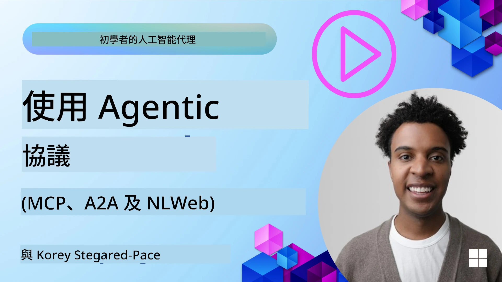
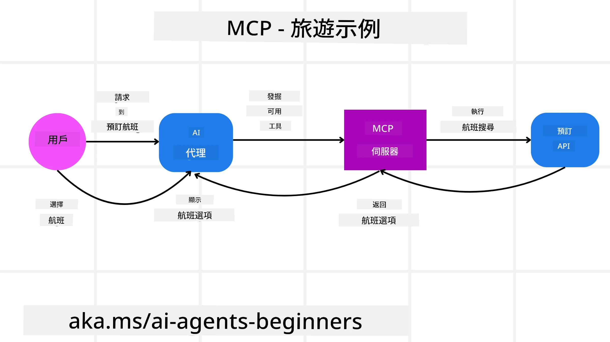
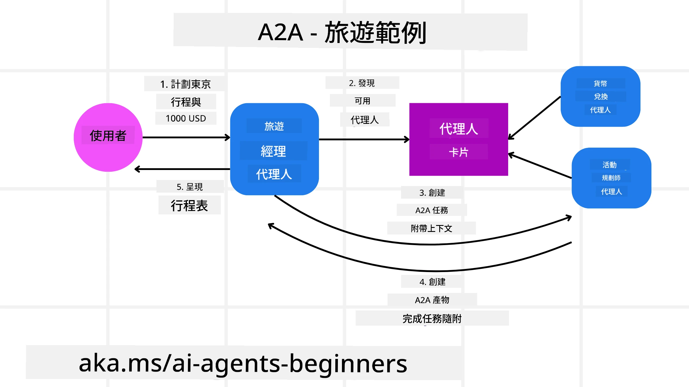
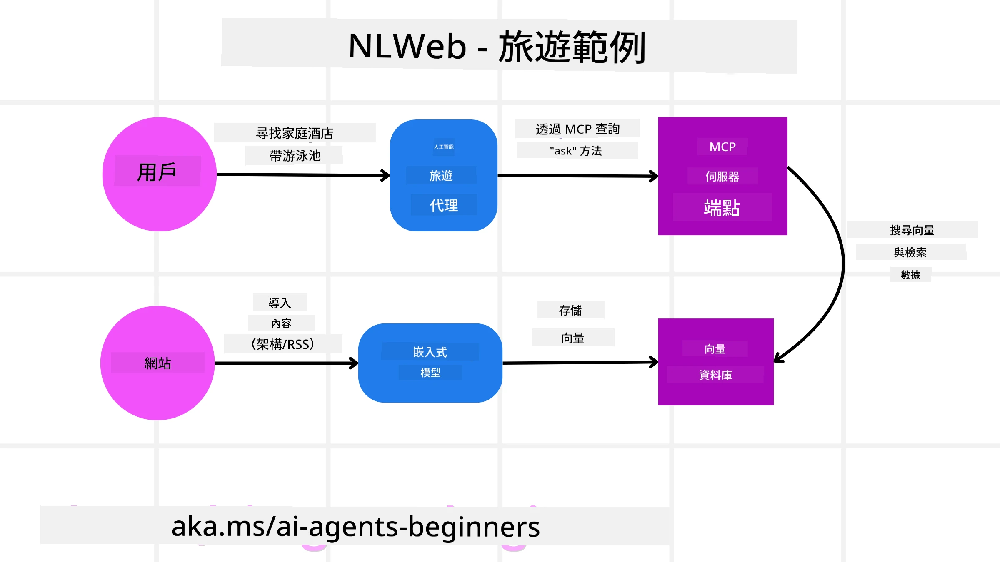

# 使用代理協議（MCP、A2A 和 NLWeb）

> _(點擊上方圖片以觀看本課程影片)_

隨著 AI 代理的使用日增，確保標準化、安全性及支持開放創新的協議需求也隨之增加。在本課程中，我們將介紹三個旨在滿足這些需求的協議——模型上下文協議（MCP）、代理對代理（A2A）以及自然語言網（NLWeb）。

## 介紹

在本課程中，我們將探討：

• **MCP** 如何允許 AI 代理存取外部工具和數據以完成用戶任務。

• **A2A** 如何使不同的 AI 代理之間能夠溝通與協作。

• **NLWeb** 如何為任一網站帶來自然語言介面，使 AI 代理能夠發現並互動網站內容。

## 學習目標

• <strong>識別</strong> MCP、A2A 和 NLWeb 在 AI 代理語境中的核心目的與優勢。

• <strong>解釋</strong> 各協議如何促進大型語言模型（LLM）、工具與其他代理之間的溝通與互動。

• <strong>認識</strong> 每項協議在構建複雜代理系統中所扮演的不同角色。

## 模型上下文協議

**模型上下文協議（Model Context Protocol，MCP）** 是一個開放標準，提供應用程式以標準化方式向大型語言模型提供上下文和工具。這使得 AI 代理能以一致方式連接到不同的數據源和工具，猶如一個「通用轉接器」。

讓我們來看看 MCP 的組成部分、相較於直接使用 API 的優點，以及 AI 代理如何使用 MCP 伺服器的範例。

### MCP 核心組件

MCP 採用<strong>用戶端-伺服器架構</strong>，核心組件包括：

• **主機（Hosts）**：大型語言模型應用程式（例如代碼編輯器 VSCode），啟動與 MCP 伺服器的連線。

• **用戶端（Clients）**：主機應用中維護與伺服器一對一連線的組件。

• **伺服器（Servers）**：輕量級程式，提供特定功能。

協議中包含三個核心原語，亦即 MCP 伺服器的能力：

• **工具（Tools）**：AI 代理可調用以執行動作的獨立操作或功能。例如，氣象服務可能提供「取得天氣」工具，或電子商務伺服器提供「購買產品」工具。MCP 伺服器會在能力列表中公布每個工具的名稱、描述及輸入／輸出格式。

• **資源（Resources）**：MCP 伺服器可提供的唯讀資料項目或文件，用戶端可按需擷取。範例包含檔案內容、資料庫記錄或日誌檔案。資源可為文字（如代碼或 JSON）或二進制（如圖像或 PDF）。

• **提示（Prompts）**：預定義範本，提供建議提示，以支持更複雜的工作流程。

### MCP 優勢

MCP 為 AI 代理帶來顯著優勢：

• <strong>動態工具發現</strong>：代理能動態接收伺服器提供的可用工具列表及功能說明，與傳統 API 需靜態程式碼整合、API 變更需更新代碼不同，MCP 採「一次整合」方案，更具適應性。

• **跨 LLM 互通性**：MCP 可跨不同大型語言模型工作，靈活切換核心模型以提升效能。

• <strong>標準化安全性</strong>：MCP 包含標準認證方法，便於擴充 MCP 伺服器接入，比起管理多種傳統 API 的金鑰與認證更簡易。

### MCP 範例

假設用戶想使用由 MCP 支援的 AI 助理預訂機票。

1. <strong>連線</strong>：AI 助理（MCP 用戶端）連接航空公司提供的 MCP 伺服器。

2. <strong>工具發現</strong>：用戶端詢問航空公司的 MCP 伺服器：「你有什麼工具？」伺服器回應有「搜尋航班」和「訂票」等工具。

3. <strong>呼叫工具</strong>：你要求 AI 助理「幫我搜尋從 Portland 到 Honolulu 的航班」，AI 助理透過其 LLM 分析需要調用「搜尋航班」工具並將參數（出發地、目的地）傳給 MCP 伺服器。

4. <strong>執行與回應</strong>：MCP 伺服器作為包裝器，實際呼叫航空公司內部訂票 API，收到航班資訊（如 JSON 資料）後回傳給 AI 助理。

5. <strong>後續互動</strong>：AI 助理展示航班選項。當你選定航班後，助理會調用同一 MCP 伺服器的「訂票」工具完成訂票流程。

## 代理對代理協議（A2A）

MCP 著重於將 LLM 連接至工具，而<strong>代理對代理協議（Agent-to-Agent，A2A）</strong>更進一步，促進不同 AI 代理間的通訊與協作。A2A 連接跨組織、環境和技術棧的 AI 代理，共同完成共享任務。

我們將檢視 A2A 的組件與優勢，並舉例其在旅行應用中的應用方式。

### A2A 核心組件

A2A 著重實現代理間溝通及協同完成用戶子任務。協議的每個組件都支持這一點：

#### 代理卡（Agent Card）

如同 MCP 伺服器共享工具列表，代理卡包含：
- 代理名稱。
- 一段描述其完成的<strong>一般性任務</strong>。
- 一份帶說明的<strong>具體技能清單</strong>，幫助其他代理（甚至人類用戶）理解何時及為何調用該代理。
- 代理的<strong>當前終端 URL</strong>。
- 代理的<strong>版本</strong>和<strong>能力</strong>，例如串流回應和推送通知。

#### 代理執行器（Agent Executor）

代理執行器負責<strong>傳遞用戶聊天上下文給遠端代理</strong>，遠端代理需要這些資訊理解待完成的任務。在 A2A 伺服器中，代理運用自身大型語言模型（LLM）解析收到的請求，並使用內部工具執行任務。

#### 藝品（Artifact）

遠端代理完成任務後，會產生一個藝品。藝品<strong>包含代理工作的結果</strong>、<strong>所完成內容的描述</strong>以及透過協議傳送的<strong>文本上下文</strong>。藝品送出後，與遠端代理的連線關閉，直到再次需要時才重新連接。

#### 事件佇列（Event Queue）

用於<strong>處理更新和傳遞訊息</strong>。在生產環境中，對代理系統尤其重要，可防止代理間連線在任務完成前被中斷，特別是當任務耗時較長時。

### A2A 優勢

• <strong>增強協作</strong>：促進不同廠商和平台的代理互動、共享上下文、協同工作，實現跨通常割裂系統的無縫自動化。

• <strong>模型選擇靈活性</strong>：每個 A2A 代理可自行決定使用哪款 LLM 服務請求，支持為不同代理優化或微調模型，不同於 MCP 有時候僅連接單一 LLM。

• <strong>內建認證</strong>：認證機制直接整合於 A2A 協議中，提供穩固的代理間互動安全框架。

### A2A 範例

讓我們在旅行訂票情境中，以 A2A 為例詳細說明。

1. <strong>用戶向多代理請求</strong>：用戶與「旅行代理」A2A 用戶端／代理互動，可能說：「請幫我訂下星期去 Honolulu 的整個行程，包括機票、飯店和租車」。

2. <strong>旅行代理統籌</strong>：旅行代理收到複雜請求，運用其 LLM 推理該任務，判定需要與其他專門代理互動。

3. <strong>代理間溝通</strong>：旅行代理透過 A2A 協議連接下游代理，如由不同公司建立的「航空代理」、「飯店代理」及「租車代理」。

4. <strong>任務委派執行</strong>：旅行代理分派具體任務給這些專門代理（例如「查詢到 Honolulu 的航班」、 「訂飯店」、「租車」）。這些代理各自執行其部分訂票工作，運行自己的 LLM 並使用自身工具（可能也是 MCP 伺服器）。

5. <strong>綜合回應</strong>：下游代理完成任務後，旅行代理彙整結果（航班詳情、飯店確認、租車訂單），並以對話式形式回覆用戶。

## 自然語言網 (NLWeb)

網站長久以來一直是用戶在網際網路上存取資訊與數據的主要方式。

讓我們來看 NLWeb 的不同組件、NLWeb 的優勢，以及藉由旅行應用範例了解 NLWeb 如何運作。

### NLWeb 組件

- **NLWeb 應用程式（核心服務代碼）**：處理自然語言問題的系統。它連接平臺不同部分以生成回應。你可以將它視為驅動網站自然語言功能的<strong>引擎</strong>。

- **NLWeb 協議**：一套針對網站自然語言交互的<strong>基本規則</strong>。以 JSON 格式回傳回應（常用 Schema.org）。其目的是為「AI 網路」創建簡單基礎，就像 HTML 讓文件在線分享成為可能。

- **MCP 伺服器（模型上下文協議端點）**：每個 NLWeb 配置同時作為<strong>MCP 伺服器</strong>。這意味著它可以與其他 AI 系統<strong>共享工具（如「ask」方法）與數據</strong>。實務上，這使網站內容和功能可被 AI 代理使用，使網站成為更大「代理生態系」的一部分。

- <strong>嵌入模型</strong>：用於<strong>將網站內容轉換成稱為向量（嵌入）的數值表示</strong>。這些向量以電腦可比較和搜尋的方式捕捉語意。向量存儲於特別資料庫，使用者可以選擇所用的嵌入模型。

- **向量資料庫（檢索機制）**：儲存網站內容嵌入的資料庫。有人提問時，NLWeb 會檢查向量資料庫以快速尋找最相關資訊，回傳根據相似度排序的候選答案。NLWeb 支援多種向量存儲系統，如 Qdrant、Snowflake、Milvus、Azure AI Search 和 Elasticsearch。

### NLWeb 範例

再次以我們的旅行訂票網站為例，不過這次由 NLWeb 提供動力。

1. <strong>資料導入</strong>：旅行網站現有的產品目錄（如航班清單、飯店描述、旅遊行程）以 Schema.org 格式整理或藉 RSS 餵入。NLWeb 的工具負責導入這些結構化數據，建立嵌入並存入本地或遠端向量資料庫。

2. **自然語言查詢（人類）**：用戶造訪網站，非透過導航選單，而是在對話介面輸入：「幫我找下星期有游泳池、適合家庭入住的 Honolulu 飯店」。

3. **NLWeb 處理**：NLWeb 應用接收此查詢。它將查詢發送至 LLM 進行理解，同時在向量資料庫搜尋相關飯店資訊。

4. <strong>精確結果</strong>：LLM 協助解讀資料庫搜尋結果，根據「適合家庭」、「游泳池」、「Honolulu」條件挑選最佳匹配，並格式化為自然語言回應。關鍵在於回應擷取自網站目錄的真實飯店資訊，避免虛構資料。

5. **AI 代理互動**：由於 NLWeb 作為 MCP 伺服器，外部 AI 旅行代理也能連接該網站的 NLWeb 實例。AI 代理可使用 `ask` MCP 方法直接查詢網站：`ask("Honolulu 區域內，酒店推薦的純素餐廳有哪些？")`。NLWeb 實例會利用其餐廳資訊資料庫（若已載入）處理並回傳結構化 JSON 回應。

### 對 MCP/A2A/NLWeb 有更多疑問？

加入 [Microsoft Foundry Discord](https://discord.com/invite/ATgtXmAS5D) 與其他學習者交流，參加開放時間，並獲得 AI 代理相關疑問解答。

## 資源

- [MCP 入門指南](https://aka.ms/mcp-for-beginners)  
- [MCP 文件](https://learn.microsoft.com/python/api/overview/azure/ai-projects-readme)
- [NLWeb 儲存庫](https://github.com/nlweb-ai/NLWeb)
- [Microsoft Agent Framework](https://learn.microsoft.com/en-us/agent-framework/overview/?wt.mc_id=youtube_26688_organicsocial_reactor&pivots=programming-language-python)

## 上一課

[生產環境中的 AI 代理](../10-ai-agents-production/README.md)

## 下一課

[AI 代理的上下文工程](../12-context-engineering/README.md)

---

<!-- CO-OP TRANSLATOR DISCLAIMER START -->
**免責聲明**：
本文件由 AI 翻譯服務 [Co-op Translator](https://github.com/Azure/co-op-translator) 翻譯而成。雖然我們致力於確保準確性，但請注意，機器自動翻譯可能包含錯誤或不準確之處。原始文件的母語版本應被視為權威來源。對於重要資訊，建議進行專業人工翻譯。我們不對因使用本翻譯而產生的任何誤解或誤釋承擔責任。
<!-- CO-OP TRANSLATOR DISCLAIMER END -->