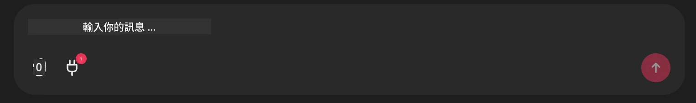

# Github MCP 伺服器範例

## 描述

這是一個為 Microsoft Reactor 主辦的 AI Agents Hackathon 所製作的示範。

此工具用來根據用戶的 Github 倉庫推薦黑客松專案。
實現方式如下：

1. **Github Agent** - 使用 Github MCP 伺服器來擷取倉庫及其相關資訊。
2. **Hackathon Agent** - 利用 Github Agent 提供的資料，根據用戶的專案、使用的程式語言以及 AI Agents 黑客松的專案主題，構思有創意的黑客松專案點子。
3. **Events Agent** - 根據 Hackathon Agent 的建議，Events Agent 會推薦 AI Agent Hackathon 系列的相關活動。

## 執行程式碼

### 環境變數

此示範使用 Microsoft Agent Framework、Azure OpenAI 服務、Github MCP 伺服器及 Azure AI 搜尋。

請確保您已設定好使用這些工具所需的環境變數：

```python
AZURE_AI_PROJECT_ENDPOINT=""
AZURE_AI_MODEL_DEPLOYMENT_NAME=""
AZURE_SEARCH_SERVICE_ENDPOINT=""
AZURE_SEARCH_API_KEY=""
``` 


## 執行 Chainlit 伺服器

為了連接 MCP 伺服器，此示範使用 Chainlit 作為聊天介面。

要啟動伺服器，請在終端機中輸入以下指令：

```bash
chainlit run app.py -w
```


這將啟動位於 `localhost:8000` 的 Chainlit 伺服器，並將 `event-descriptions.md` 的內容填入您的 Azure AI 搜尋索引。

## 連接 MCP 伺服器

要連接 Github MCP 伺服器，請點選「Type your message here..」聊天框下方的「插頭」圖示：



接著點擊「Connect an MCP」以加入命令，連接到 Github MCP 伺服器：

```bash
npx -y @modelcontextprotocol/server-github --env GITHUB_PERSONAL_ACCESS_TOKEN=[YOUR PERSONAL ACCESS TOKEN]
```


請將 "[YOUR PERSONAL ACCESS TOKEN]" 替換成您真實的 Personal Access Token。

完成連接後，您應該會在插頭圖示旁看到 (1) 訊號以確認已連接。如果沒有，請嘗試使用 `chainlit run app.py -w` 重啟 chainlit 伺服器。

## 使用示範

要啟動推薦黑客松專案的代理流程，您可以輸入如下訊息：

"Recommend hackathon projects for the Github user koreyspace"

Router Agent 將分析您的請求並判斷最適合處理您查詢的代理組合（GitHub、Hackathon 與 Events）。這些代理會協同合作，基於 GitHub 倉庫分析、專案構想與相關科技活動，提供全面的推薦。

---

<!-- CO-OP TRANSLATOR DISCLAIMER START -->
**免責聲明**：  
本文件係使用 AI 翻譯服務 [Co-op Translator](https://github.com/Azure/co-op-translator) 進行翻譯。雖然我們努力確保準確性，但請注意自動翻譯可能存在錯誤或不準確之處。原始文件的原文版本應被視為權威來源。對於重要資訊，建議採用專業人工翻譯。我們對因使用此翻譯而引起的任何誤解或誤釋概不負責。
<!-- CO-OP TRANSLATOR DISCLAIMER END -->