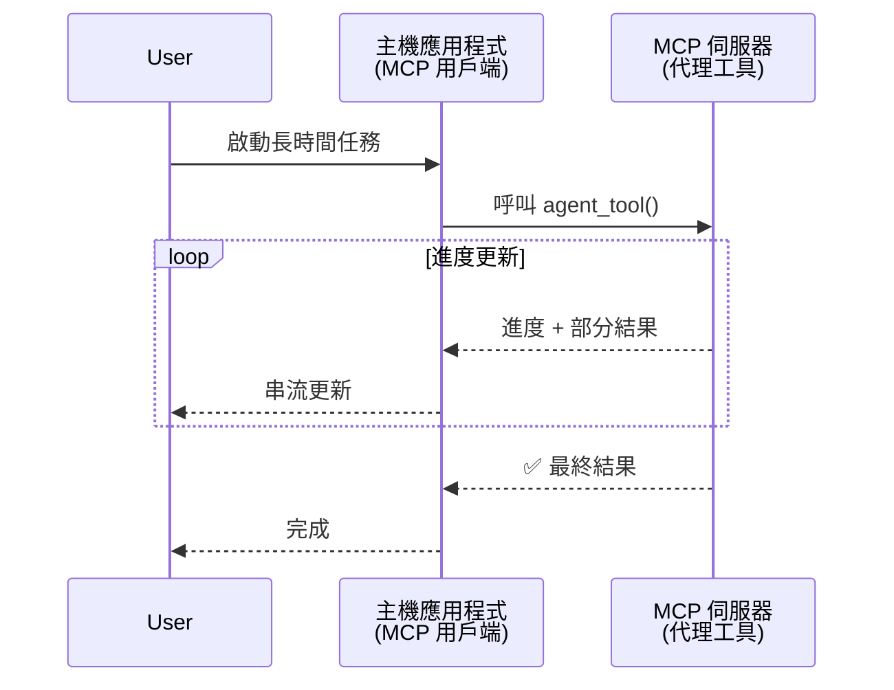
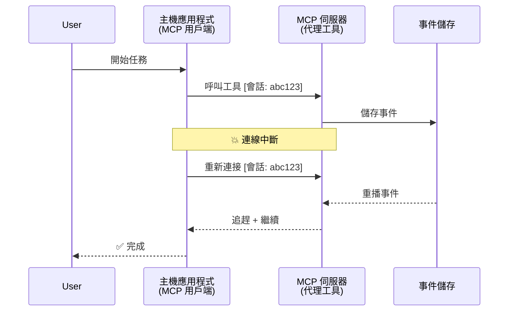
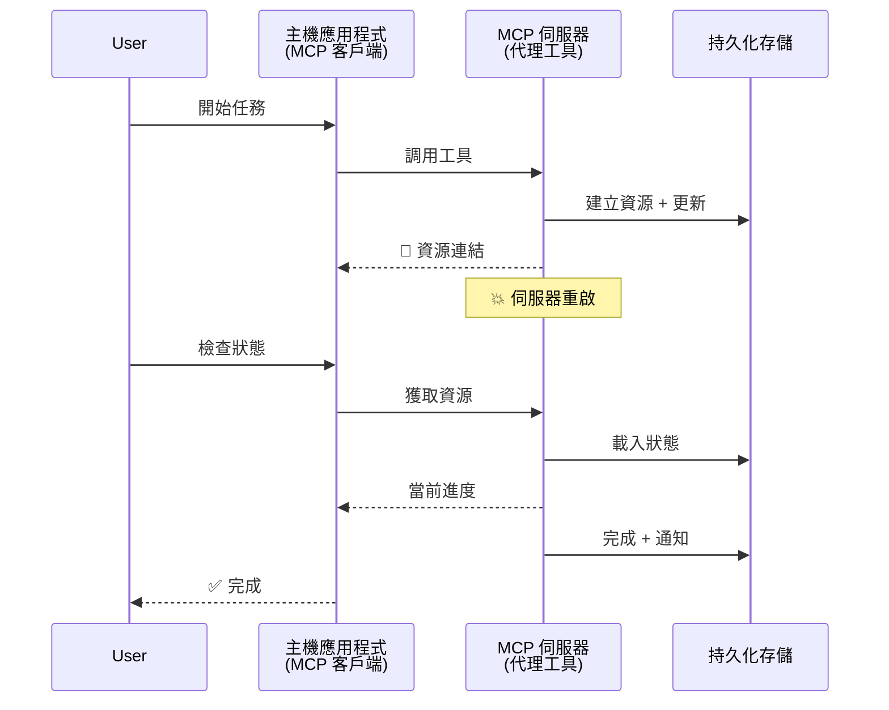
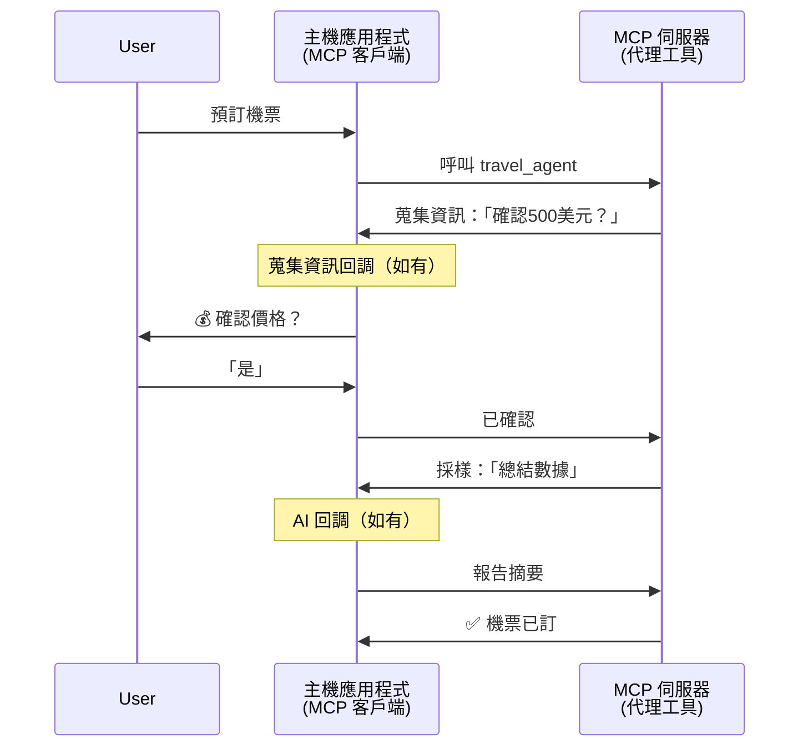
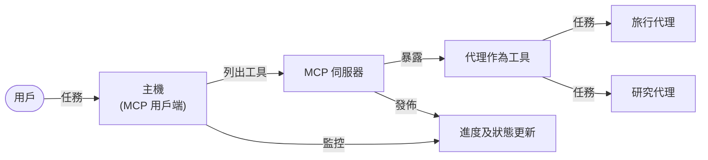

# 使用 MCP 建立代理到代理的通訊系統

> 簡短摘要 - 你能在 MCP 上構建 Agent2Agent 通訊嗎？能！

MCP 已遠遠超越其「為 LLM 提供上下文」的最初目標。隨著最近增強功能包括 [可恢復串流](https://modelcontextprotocol.io/docs/concepts/transports#resumability-and-redelivery)、[引導](https://modelcontextprotocol.io/specification/2025-06-18/client/elicitation)、[抽樣](https://modelcontextprotocol.io/specification/2025-06-18/client/sampling) 以及通知（[進度](https://modelcontextprotocol.io/specification/2025-06-18/basic/utilities/progress) 和 [資源](https://modelcontextprotocol.io/specification/2025-06-18/schema#resourceupdatednotification)），MCP 現在為構建複雜的代理間通訊系統提供了堅實的基礎。

## 代理／工具誤解

隨著越來越多的開發者探索具有代理行為的工具（長時間運行、可能需要執行過程中額外輸入等），一個常見的誤解是 MCP 不適合，主要因為早期其工具示例集中於簡單的請求-回應模式。

這種觀念已過時。MCP 規範在過去幾個月中大幅增強，具備了縮小構建長期運行代理行為差距的能力：

- <strong>串流與部分結果</strong>：執行中實時進度更新
- <strong>可恢復性</strong>：客戶端斷線後可重新連接並繼續
- <strong>持久性</strong>：結果可在伺服器重啟後依然保留（例如透過資源連結）
- <strong>多回合</strong>：透過引導和抽樣在執行中互動輸入

這些功能可組合以啟用複雜的代理及多代理應用，全部部署在 MCP 協議上。

為方便起見，我們將代理稱為 MCP 伺服器上可使用的「工具」。這意味著有一個主機應用實現了與 MCP 伺服器建立會話且能呼叫代理的 MCP 客戶端。

## 什麼讓 MCP 工具「具代理性」？

在深入實作之前，讓我們建立支援長期運行代理所需的基礎設施能力定義。

> 我們將代理定義為能自主運作長時間，能處理複雜任務，並可能需多次交互或根據實時反饋調整的實體。

### 1. 串流與部分結果

傳統請求-回應模式不適用於長期任務。代理需提供：

- 實時進度更新
- 中間結果

**MCP 支援**：資源更新通知能實現部分結果串流，但需要仔細設計，避免與 JSON-RPC 1:1 請求/回應模型產生衝突。

| 功能                     | 使用案例                                                                                                                                                      | MCP 支援                                                                               |
| ------------------------ | ------------------------------------------------------------------------------------------------------------------------------------------------------------- | ------------------------------------------------------------------------------------- |
| 實時進度更新             | 使用者請求代碼庫遷移任務。代理串流進度：「10% - 分析依賴... 25% - 轉換 TypeScript 檔案... 50% - 更新匯入...」                                               | ✅ 進度通知                                                                            |
| 部分結果                | 「產生一本書」任務串流部分結果，例如：1) 故事弧大綱，2) 章節清單，3) 每章完成時。主機可任何階段檢視、取消或重新指派。                                  | ✅ 通知可「擴展」包含部分結果，參見 PR 383，776 的提案                                  |

<div align="center" style="font-style: italic; font-size: 0.95em; margin-bottom: 0.5em;">
<strong>圖 1：</strong> 本圖示說明 MCP 代理在長期任務中如何串流實時進度更新與部分結果給主機應用，讓使用者能即時監控執行狀況。
</div>



### 2. 可恢復性

代理必須優雅處理網路中斷：

- （客戶端）斷線後重新連接
- 從斷點繼續（訊息重新傳送）

**MCP 支援**：MCP StreamableHTTP 傳輸目前支援使用會話 ID 和最後事件 ID 做會話恢復與訊息重送。重點是伺服器必須實作事件存儲（EventStore）以在客戶端重連時能重播事件。
社群有一項提案（PR #975）探討通用傳輸的可恢復串流功能。

| 功能       | 使用案例                                                                                                                                            | MCP 支援                                                                |
| ---------- | --------------------------------------------------------------------------------------------------------------------------------------------------- | ---------------------------------------------------------------------- |
| 可恢復性    | 客戶端於長時間任務中斷線。重連後，會話恢復並重播遺漏事件，從斷點無縫繼續。                                                                         | ✅ StreamableHTTP 傳輸 支援會話 ID、事件重播及 EventStore            |

<div align="center" style="font-style: italic; font-size: 0.95em; margin-bottom: 0.5em;">
<strong>圖 2：</strong> 此圖展示 MCP 的 StreamableHTTP 傳輸與事件存儲如何實現無縫的會話恢復：若客戶端斷線，可重新連線並重播遺漏事件，任務不中斷持續進行。
</div>



### 3. 持久性

長期運行代理需持久狀態：

- 結果在伺服器重啟後依然存在
- 狀態可離線檢索
- 跨會話進度追蹤

**MCP 支援**：MCP 現支援工具調用返回類型為資源連結。常見模式為設計工具先建立資源並立即回傳資源連結，工具背景處理任務並更新資源。客戶端可選擇輪詢該資源狀態以獲取部分或完整結果（依伺服器提供的資源更新而定）或訂閱該資源收取更新通知。

不過輪詢資源或訂閱更新會消耗資源，對大規模有影響。社群有開放提案（如 #992）探索加入 Webhook 或觸發器，讓伺服器能調用通知客戶端／主機應用有更新。

| 功能       | 使用案例                                                                                                                        | MCP 支援                                                      |
| ---------- | ------------------------------------------------------------------------------------------------------------------------------- | ------------------------------------------------------------- |
| 持久性     | 伺服器在資料遷移任務中崩潰。結果與進度在重啟後存活，客戶端可查狀態並從持久資源繼續。                                          | ✅ 資源連結具有持久存儲和狀態通知                              |

常見模式為設計一個工具先創建資源並立即返回資源連結。工具在背景繼續處理任務，發送資源通知作為進度更新或包含部分結果，並根據需要更新資源內容。

<div align="center" style="font-style: italic; font-size: 0.95em; margin-bottom: 0.5em;">
<strong>圖 3：</strong> 本圖示證明 MCP 代理如何使用持久資源與狀態通知確保長期任務在伺服器重啟後依然存活，允許客戶端查看進度和檢索結果。
</div>



### 4. 多回合交互

代理經常需在執行中途取得額外輸入：

- 人工澄清或批准
- AI 輔助複雜決策
- 動態參數調節

**MCP 支援**：透過抽樣（AI 輸入）與引導（人工輸入）全面支援。

| 功能                  | 使用案例                                                                                                                          | MCP 支援                                                |
| --------------------- | ------------------------------------------------------------------------------------------------------------------------------- | ------------------------------------------------------ |
| 多回合交互            | 旅遊預訂代理向使用者請求價格確認，接著要求 AI 針對旅遊資料作摘要，最後完成預訂交易。                                           | ✅ 人工輸入採用引導，AI 輸入採用抽樣                      |

<div align="center" style="font-style: italic; font-size: 0.95em; margin-bottom: 0.5em;">
<strong>圖 4：</strong> 本圖展示 MCP 代理如何在執行中互動引導人工輸入或請求 AI 協助，支援如確認和動態決策等複雜多回合工作流程。
</div>



## 在 MCP 上實作長期運行代理 - 程式碼概覽

本文提供一個 [程式碼倉庫](https://github.com/victordibia/ai-tutorials/tree/main/MCP%20Agents)，該倉庫完整示範利用 MCP Python SDK 與 StreamableHTTP 傳輸實現長期運行代理，支援會話恢復和訊息重送。此實作展示 MCP 能力如何組合成複雜代理行為。

具體來說，我們實作一個伺服器，包含兩個主要代理工具：

- <strong>旅遊代理</strong> - 模擬旅行預訂服務，透過引導進行價格確認
- <strong>研究代理</strong> - 執行研究任務，利用抽樣提供 AI 輔助摘要

這兩個代理均展現實時進度更新、互動確認和完整會話恢復功能。

### 主要實作概念

下列章節展示每項功能的伺服器端代理實作與客戶端主機端處理：

#### 串流與進度更新 - 任務狀態實時反映

串流允許代理在長期任務期間提供實時進度更新，讓使用者保持任務狀態和中間結果資訊。

**伺服器實作（代理傳送進度通知）：**

```python
# 從 server/server.py - 旅遊代理發送進度更新
for i, step in enumerate(steps):
    await ctx.session.send_progress_notification(
        progress_token=ctx.request_id,
        progress=i * 25,
        total=100,
        message=step,
        related_request_id=str(ctx.request_id)
    )
    await anyio.sleep(2)  # 模擬工作

# 替代方案：記錄消息以獲取詳細的逐步更新
await ctx.session.send_log_message(
    level="info",
    data=f"Processing step {current_step}/{steps} ({progress_percent}%)",
    logger="long_running_agent",
    related_request_id=ctx.request_id,
)
```

**客戶端實作（主機接收進度更新）：**

```python
# 從 client/client.py - 處理實時通知的客戶端
async def message_handler(message) -> None:
    if isinstance(message, types.ServerNotification):
        if isinstance(message.root, types.LoggingMessageNotification):
            console.print(f"📡 [dim]{message.root.params.data}[/dim]")
        elif isinstance(message.root, types.ProgressNotification):
            progress = message.root.params
            console.print(f"🔄 [yellow]{progress.message} ({progress.progress}/{progress.total})[/yellow]")

# 建立會話時登記訊息處理器
async with ClientSession(
    read_stream, write_stream,
    message_handler=message_handler
) as session:
```

#### 引導 - 請求使用者輸入

引導使代理能在執行過程中請求使用者輸入，對長期任務中確認、澄清或批准至關重要。

**伺服器實作（代理請求確認）：**

```python
# 來自 server/server.py - 旅行代理要求確認價格
elicit_result = await ctx.session.elicit(
    message=f"Please confirm the estimated price of $1200 for your trip to {destination}",
    requestedSchema=PriceConfirmationSchema.model_json_schema(),
    related_request_id=ctx.request_id,
)

if elicit_result and elicit_result.action == "accept":
    # 繼續預訂
    logger.info(f"User confirmed price: {elicit_result.content}")
elif elicit_result and elicit_result.action == "decline":
    # 取消預訂
    booking_cancelled = True
```

**客戶端實作（主機提供引導回調）：**

```python
# 來自 client/client.py - 處理引導請求的客戶端
async def elicitation_callback(context, params):
    console.print(f"💬 Server is asking for confirmation:")
    console.print(f"   {params.message}")

    response = console.input("Do you accept? (y/n): ").strip().lower()

    if response in ['y', 'yes']:
        return types.ElicitResult(
            action="accept",
            content={"confirm": True, "notes": "Confirmed by user"}
        )
    else:
        return types.ElicitResult(
            action="decline",
            content={"confirm": False, "notes": "Declined by user"}
        )

# 創建會話時註冊回調函數
async with ClientSession(
    read_stream, write_stream,
    elicitation_callback=elicitation_callback
) as session:
```

#### 抽樣 - 請求 AI 輔助

抽樣允許代理在執行中請求 LLM 協助處理複雜決策或內容產生，促進人機混合工作流程。

**伺服器實作（代理請求 AI 協助）：**

```python
# 來自 server/server.py - 研究代理請求 AI 摘要
sampling_result = await ctx.session.create_message(
    messages=[
        SamplingMessage(
            role="user",
            content=TextContent(type="text", text=f"Please summarize the key findings for research on: {topic}")
        )
    ],
    max_tokens=100,
    related_request_id=ctx.request_id,
)

if sampling_result and sampling_result.content:
    if sampling_result.content.type == "text":
        sampling_summary = sampling_result.content.text
        logger.info(f"Received sampling summary: {sampling_summary}")
```

**客戶端實作（主機提供抽樣回調）：**

```python
# 來自 client/client.py - 客戶端處理抽樣請求
async def sampling_callback(context, params):
    message_text = params.messages[0].content.text if params.messages else 'No message'
    console.print(f"🧠 Server requested sampling: {message_text}")

    # 在真實應用中，這可以呼叫一個大型語言模型 API
    # 為了演示目的，我們提供一個模擬回應
    mock_response = "Based on current research, MCP has evolved significantly..."

    return types.CreateMessageResult(
        role="assistant",
        content=types.TextContent(type="text", text=mock_response),
        model="interactive-client",
        stopReason="endTurn"
    )

# 在建立會話時註冊回調函數
async with ClientSession(
    read_stream, write_stream,
    sampling_callback=sampling_callback,
    elicitation_callback=elicitation_callback
) as session:
```

#### 可恢復性 - 跨斷線維持會話連續性

可恢復性確保長期運行代理任務能在客戶端斷線後連續進行，透過事件存儲和恢復令牌實現。

**事件存儲實作（伺服器持有會話狀態）：**

```python
# 來自 server/event_store.py - 簡單的記憶體中事件存儲
class SimpleEventStore(EventStore):
    def __init__(self):
        self._events: list[tuple[StreamId, EventId, JSONRPCMessage]] = []
        self._event_id_counter = 0

    async def store_event(self, stream_id: StreamId, message: JSONRPCMessage) -> EventId:
        """Store an event and return its ID."""
        self._event_id_counter += 1
        event_id = str(self._event_id_counter)
        self._events.append((stream_id, event_id, message))
        return event_id

    async def replay_events_after(self, last_event_id: EventId, send_callback: EventCallback) -> StreamId | None:
        """Replay events after the specified ID for resumption."""
        start_index = None
        stream_id = None
        for index, (event_stream_id, event_id, _) in enumerate(self._events):
            if event_id == last_event_id:
                start_index = index + 1
                stream_id = event_stream_id
                break

        if start_index is None:
            return None

        # 只重播來自會話原始串流之後的事件。
        for event_stream_id, event_id, message in self._events[start_index:]:
            if event_stream_id != stream_id:
                continue
            await send_callback(EventMessage(message, event_id))

        return stream_id

# 來自 server/server.py - 將事件存儲傳遞給會話管理員
def create_server_app(event_store: Optional[EventStore] = None) -> Starlette:
    server = ResumableServer()

    # 使用事件存儲建立會話管理員以供恢復
    session_manager = StreamableHTTPSessionManager(
        app=server,
        event_store=event_store,  # 事件存儲啟用會話恢復
        json_response=False,
        security_settings=security_settings,
    )

    return Starlette(routes=[Mount("/mcp", app=session_manager.handle_request)])

# 使用方法：以事件存儲初始化
event_store = SimpleEventStore()
app = create_server_app(event_store)
```

**客戶端元資料附帶恢復令牌（客戶端利用儲存狀態重連）：**

```python
# 從 client/client.py - 帶有元數據的客戶端恢復
if existing_tokens and existing_tokens.get("resumption_token"):
    # 使用現有恢復令牌繼續之前的進度
    metadata = ClientMessageMetadata(
        resumption_token=existing_tokens["resumption_token"],
    )
else:
    # 創建回調函數以在接收時保存恢復令牌
    def enhanced_callback(token: str):
        protocol_version = getattr(session, 'protocol_version', None)
        token_manager.save_tokens(session_id, token, protocol_version, command, args)

    metadata = ClientMessageMetadata(
        on_resumption_token_update=enhanced_callback,
    )

# 发送带有恢复元数据的请求
result = await session.send_request(
    types.ClientRequest(
        types.CallToolRequest(
            method="tools/call",
            params=types.CallToolRequestParams(name=command, arguments=args)
        )
    ),
    types.CallToolResult,
    metadata=metadata,
)
```

主機應用在本地維護會話 ID 和恢復令牌，使其在重連現有會話時不丟失進度或狀態。

### 程式碼組織

<div align="center" style="font-style: italic; font-size: 0.95em; margin-bottom: 0.5em;">
<strong>圖 5：</strong> 基於 MCP 的代理系統架構
</div>



**主要檔案：**

- **`server/server.py`** - 支援會話恢復的 MCP 伺服器，包含示範引導、抽樣與進度更新的旅遊及研究代理
- **`client/client.py`** - 具有會話恢復支持、回調處理和令牌管理的互動主機應用
- **`server/event_store.py`** - 事件存儲實作，讓會話恢復和訊息重送成為可能

## 擴展至 MCP 上的多代理通訊

上述實作可通過加強主機應用的智慧性與範圍，擴展成多代理系統：

- <strong>智能任務分解</strong>：主機分析複雜使用者請求，拆解為分配給不同專精代理的子任務
- <strong>多伺服器協調</strong>：主機維持與多個 MCP 伺服器的連接，每台伺服器暴露不同代理能力
- <strong>任務狀態管理</strong>：主機追蹤多個並行代理任務進度，處理依賴關係及順序
- <strong>韌性與重試</strong>：主機管理故障，實施重試邏輯，代理不可用時重新路由任務
- <strong>結果綜合</strong>：主機整合多個代理輸出成一致的最終結果

主機從簡單客戶端演變成智慧協調者，協調分散的代理能力，仍以 MCP 協議為基礎。

## 結論

MCP 的增強功能 —— 資源通知、引導／抽樣、可恢復串流和持久資源 —— 讓複雜的代理間交互成為可能，且維持協議的簡潔性。

## 開始動手

準備好構建你自己的 agent2agent 系統了嗎？按照以下步驟：

### 1. 運行示範

```bash
# 使用事件存儲啟動伺服器以便恢復
python -m server.server --port 8006

# 在另一個終端機執行互動客戶端
python -m client.client --url http://127.0.0.1:8006/mcp
```

**互動模式下可用指令：**

- `travel_agent` - 透過引導進行價格確認的旅行預訂
- `research_agent` - 利用抽樣進行 AI 輔助研究摘要
- `list` - 顯示所有可用工具
- `clean-tokens` - 清除恢復令牌
- `help` - 顯示詳細指令說明
- `quit` - 退出客戶端

### 2. 測試恢復能力

- 啟動一個長期代理（如 `travel_agent`）
- 執行中中斷客戶端 (Ctrl+C)
- 重新啟動客戶端，它會自動從中斷點繼續

### 3. 探索與擴展

- <strong>探索示例</strong>：查看此 [mcp-agents](https://github.com/victordibia/ai-tutorials/tree/main/MCP%20Agents)
- <strong>加入社群</strong>：參與 GitHub 上的 MCP 討論
- <strong>實驗</strong>：從簡單長期任務開始，逐步加入串流、可恢復性與多代理協調

此示範證明 MCP 如何在保持工具基礎簡易性的同時，支持智慧代理行為。

整體而言，MCP 協議規範正迅速演進；建議讀者查看官方文件網站獲取最新資訊 - https://modelcontextprotocol.io/introduction

---

<!-- CO-OP TRANSLATOR DISCLAIMER START -->
**免責聲明**：
本文件由 AI 翻譯服務 [Co-op Translator](https://github.com/Azure/co-op-translator) 翻譯而成。雖然我們致力於確保準確性，但請注意，機器自動翻譯可能包含錯誤或不準確之處。原始文件的母語版本應被視為權威來源。對於重要資訊，建議進行專業人工翻譯。我們不對因使用本翻譯而產生的任何誤解或誤釋承擔責任。
<!-- CO-OP TRANSLATOR DISCLAIMER END -->