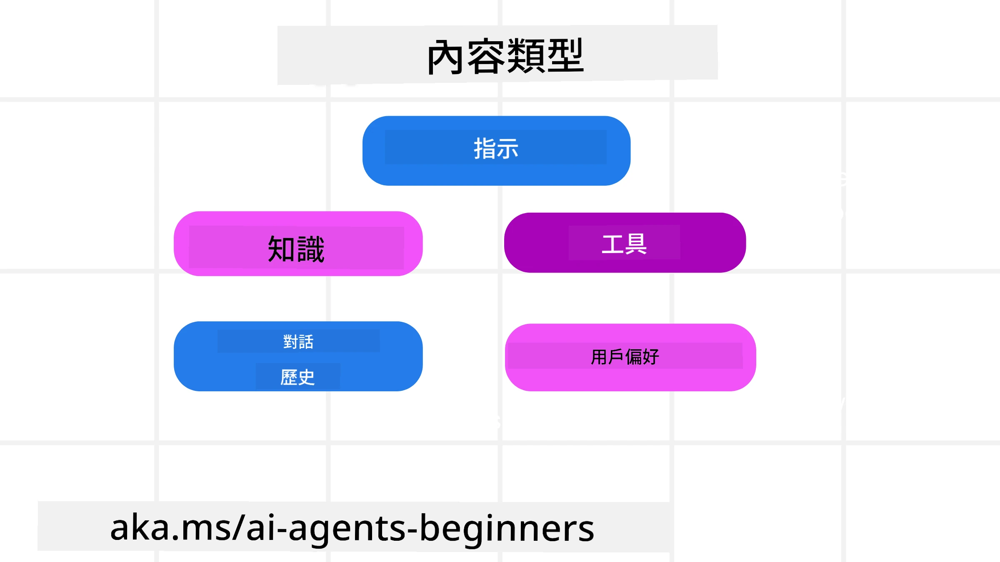
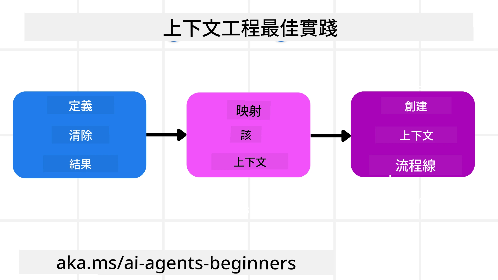

# AI 代理的上下文工程

> _(點擊上方圖片觀看本課程影片)_

了解你正在為其構建 AI 代理的應用複雜度，對打造可靠的代理至關重要。我們需要建立能有效管理資訊的 AI 代理，以滿足超越提示工程的複雜需求。

本課程將探討什麼是上下文工程以及它在打造 AI 代理中的作用。

## 介紹

本課程將涵蓋：

• <strong>什麼是上下文工程</strong>，以及它與提示工程的不同之處。

• <strong>有效的上下文工程策略</strong>，包括如何撰寫、選擇、壓縮和隔離資訊。

• <strong>常見的上下文失敗</strong>，可能導致 AI 代理失效及如何修復。

## 學習目標

完成本課程後，你將能理解並掌握：

• <strong>定義上下文工程</strong>，並能將其與提示工程區分。

• **識別大型語言模型（LLM）應用中上下文的主要組成部分**。

• **應用撰寫、選擇、壓縮和隔離上下文的策略**，以提升代理效能。

• <strong>辨識常見上下文失敗</strong>，如中毒、分散注意力、混淆及衝突，並實施緩解技巧。

## 什麼是上下文工程？

對 AI 代理而言，上下文決定了 AI 代理規劃採取特定行動的依據。上下文工程是確保 AI 代理擁有完成任務下一步所需適當資訊的實踐。上下文視窗的大小有限，因此作為代理開發者，我們必須構建系統和流程來管理上下文視窗中資訊的添加、移除與濃縮。

### 提示工程 vs 上下文工程

提示工程專注於單一組靜態指令，以一套規則有效指導 AI 代理。上下文工程則是管理包含初始提示在內的動態資訊集，以確保 AI 代理長期擁有所需資訊。上下文工程的核心理念是使此流程可重複且可靠。

### 上下文類型

重要的是要記住，上下文不僅僅是一件事。AI 代理所需的資訊可以來自多種不同來源，我們必須確保代理能獲取這些來源：

AI 代理可能需要管理的上下文類型包括：

• **指令：** 就像代理的「規則」— 提示、系統訊息、少量示例（向 AI 展示如何做某事）、以及它可使用工具的描述。這裡是提示工程和上下文工程結合之處。

• **知識：** 包含事實、從資料庫檢索的資訊，或代理累積的長期記憶。若代理需要訪問不同的知識庫和資料庫，則包括整合檢索增強生成（RAG）系統。

• **工具：** 定義代理可調用的外部函數、API 和 MCP 伺服器，以及使用這些工具後獲得的反饋（結果）。

• **對話歷史：** 與使用者的持續對話。隨著時間推移，對話變得更長更複雜，佔用上下文視窗空間。

• **使用者偏好：** 隨時間學習到的使用者喜好或反感。這些可儲存並在做關鍵決策時調用，協助使用者。

## 有效上下文工程的策略

### 規劃策略

良好的上下文工程始於良好的規劃。以下方法可幫助你開始思考如何應用上下文工程概念：

1. <strong>定義明確結果</strong> — AI 代理將執行的任務結果應明確定義。回答問題：「AI 代理完成其任務後，世界會是什麼樣子？」換言之，使用者與 AI 代理互動後，應該得到什麼變化、資訊或回應。

2. <strong>繪製上下文地圖</strong> — 在定義了 AI 代理的結果後，需回答：「AI 代理完成任務需要哪些資訊？」這樣你可以開始繪製該資訊可能所在的上下文地圖。

3. <strong>建立上下文管線</strong> — 知道資訊位置後，需回答：「代理如何獲取這些資訊？」這可通過多種方式完成，包括 RAG、使用 MCP 伺服器及其他工具。

### 實用策略

規劃很重要，但當資訊開始流入代理的上下文視窗時，我們需要實用策略來管理它：

#### 管理上下文

部分資訊會自動加入上下文視窗，但上下文工程強調對此資訊採取更積極的管理角色，可採用以下幾種策略：

 1. <strong>代理便條本</strong>
 允許 AI 代理在單一會話中記錄與當前任務及使用者互動相關的筆記。這應該存在於上下文視窗之外，以檔案或運行時物件形式保存，代理稍後可在本次會話中檢索。
 
 2. <strong>記憶</strong>
 便條本適合管理單次會話上下文視窗外的資訊。記憶則讓代理能跨多場會話儲存並檢索相關資訊，包括摘要、使用者偏好及未來改進的反饋。
 
 3. <strong>上下文壓縮</strong>
  當上下文視窗變大並接近容量限制時，可使用摘要與裁剪等技術，包括僅保留最相關資訊或刪除較舊訊息。
  
 4. <strong>多代理系統</strong>
  開發多代理系統也是一種上下文工程，因為每個代理都有自己的上下文視窗。如何分享與傳遞上下文給不同代理，是建構此類系統時需要規劃的。
  
 5. <strong>沙盒環境</strong>
  若代理需執行某些程式碼或處理大量文件資訊，這可能消耗大量 Tokens 以處理結果。代理可使用沙盒環境執行程式碼，僅讀取結果和其他相關資訊，而非全部存於上下文視窗。
  
 6. <strong>運行時狀態物件</strong>
   透過建立資訊容器，管理代理需要訪問特定資訊的情況。對於複雜任務，此方法允許代理逐步儲存各子任務結果，使上下文僅與該特定子任務相關聯。

#### 檢查上下文

採用策略後，值得檢查下一次模型呼叫實際收到的內容。一個有用的除錯問題是：

> 代理是載入過多的上下文、錯誤的上下文，還是漏載了需要的上下文？

無需記錄原始提示、工具輸出或記憶內容即可回答該問題。生產環境中，宜偏好簡短的上下文檢查記錄，包含計數、ID、雜湊和策略標籤：

- **選擇：** 追蹤考慮了多少候選區塊、工具或記憶、選中了多少，以及哪些規則或分數過濾掉其他。

- **壓縮：** 記錄來源範圍或追蹤 ID、摘要 ID、壓縮前後預估 Token 數量，及是否將原始內容排除於下一次呼叫。

- **隔離：** 註明哪個子任務在獨立代理、會話或沙盒中執行，返回了何種有限摘要，以及大型工具輸出是否保留在父代理上下文之外。

- **記憶與 RAG：** 儲存檢索文檔 ID、記憶 ID、分數、選中 ID 及修訂狀態，而非完整檢索文本。

- **安全與隱私：** 偏好使用雜湊、ID、Token 桶與策略標籤，避免敏感提示文字、工具參數、工具結果或使用者記憶內容。

目標非一定保留更多上下文，而是留下足夠證據，讓開發者能辨識使用了何種上下文策略，以及其是否照預期改變下一次模型呼叫。

### 上下文工程示例

假設我們想要一個 AI 代理協助<strong>「幫我訂一趟巴黎行。」</strong>

• 僅使用提示工程的簡單代理可能只會回應：**「好的，你想何時去巴黎？」**。它只處理當時使用者直接提出的問題。

• 使用上述上下文工程策略的代理會做更多事。回應前，其系統可能會：

  ◦ <strong>檢查你的行事曆</strong>，確認可用日期（檢索即時資料）。

 ◦ <strong>回憶過去旅遊偏好</strong>（來自長期記憶），例如你偏好的航空公司、預算或是否偏好直飛。

 ◦ <strong>識別可用的訂票與飯店工具</strong>。

- 然後，範例回應可能是：「嗨 [你的名字]！我看到你十月第一週有空。要不要幫你找在你預算範圍內、搭乘 [偏好航空] 的巴黎直飛航班？」這種更豐富、具上下文感知的回應展現了上下文工程的威力。

## 常見上下文失敗

### 上下文中毒

**定義：** 當錯覺（LLM 產生的虛假資訊）或錯誤進入上下文並被反覆引用，導致代理追求不可能的目標或發展出荒謬策略。

**解決：** 執行<strong>上下文驗證</strong>與<strong>隔離</strong>。在將資訊加入長期記憶前先行驗證。若偵測到潛在中毒，則從新上下文線程開始，以防壞資訊擴散。

**旅遊訂票示例：** 代理幻覺「從小型地方機場有飛往遙遠國際城市的直飛航班」，但該機場實際不提供國際航班。該不存在的航班細節被儲存至上下文，後續當你要求代理訂票時，代理持續嘗試尋找不可能的航線，導致反覆錯誤。

**解決方案：** 在將航班細節加入代理工作上下文前，使用即時 API <strong>驗證航班是否存在及航線</strong>。驗證失敗則將錯誤資訊「隔離」，不再使用。

### 上下文分散注意力

**定義：** 當上下文過大時，模型過度關注累積的歷史對話，而非訓練時習得知識，導致重複或無用行為。模型甚至可能在上下文視窗未滿時即開始犯錯。

**解決：** 採用<strong>上下文摘要</strong>。定期將累積資訊壓縮為更短摘要，保留重要細節並去除冗餘歷史，有助於「重置」模型焦點。

**旅遊訂票示例：** 長時間討論多個夢想旅遊目的地，並細述兩年前背包旅遊經歷。當你最終要求「找我下月廉價航班」時，代理被舊有無關細節牽制，持續詢問背包裝備或舊行程，忽略當前需求。

**解決方案：** 在對話輪數達一定數量或上下文過大時，代理應<strong>摘要最近且相關的對話部分</strong>—專注於你的當前出行日期與目的地—並用該濃縮摘要做為下一次 LLM 呼叫的依據，捨棄較不相關的歷史對話。

### 上下文混淆

**定義：** 不必要的上下文，通常是過多可用工具導致模型產生錯誤回應或呼叫不相關工具。較小模型尤易發生。

**解決：** 執行<strong>工具負載管理</strong>，以 RAG 技術為輔。將工具描述存於向量資料庫，並僅選擇最相關工具供特定任務使用。研究顯示，工具數量限制於少於 30 效果最佳。

**旅遊訂票示例：** 代理能使用數十款工具：`book_flight`、`book_hotel`、`rent_car`、`find_tours`、`currency_converter`、`weather_forecast`、`restaurant_reservations` 等。你問：「在巴黎如何最好地移動？」工具過多導致代理混淆，嘗試在巴黎區域調用 `book_flight`，或選擇了你不偏好的 `rent_car`，因工具描述重疊或模型無法判別最佳選擇。

**解決方案：** 針對工具描述採用<strong>RAG 檢索</strong>。當你詢問巴黎交通，系統動態檢索並只出示最相關工具，如 `rent_car` 或 `public_transport_info`，為 LLM 呈現聚焦的工具「負載清單」。

### 上下文衝突

**定義：** 當上下文中存在矛盾資訊，導致推理不一致或回答錯誤。常發生在資訊分階段到達，早期錯誤假設持續留存上下文中。

**解決：** 採用<strong>上下文修剪</strong>與<strong>卸載</strong>。修剪即刪除過時或矛盾資訊，新資訊到達時即更新。卸載則提供模型一個獨立「便條本」工作區，處理資訊而不讓主要上下文混亂。
**旅遊預訂示例：** 您最初告訴您的代理人，**「我想搭經濟艙。」** 後來在對話中，您改變了主意，說 **「其實，這次旅行，我們搭商務艙吧。」** 如果這兩個指示都保留在上下文中，代理人可能會收到相互矛盾的搜尋結果，或不清楚應優先考慮哪個偏好。

**解決方法：** 實作<strong>上下文修剪</strong>。當新的指示與舊的指示相矛盾時，較舊的指示會從上下文中移除或被明確覆蓋。或者，代理人可以使用<strong>草稿區</strong>來調和矛盾的偏好，再作決定，確保只有最終、一致的指示指導其行動。

## 對上下文工程有更多疑問嗎？

加入 [Microsoft Foundry Discord](https://aka.ms/ai-agents/discord) 與其他學習者會面，參加辦公時間並獲得您的 AI 代理人問題的解答。

---

<!-- CO-OP TRANSLATOR DISCLAIMER START -->
**免責聲明**：
本文件由 AI 翻譯服務 [Co-op Translator](https://github.com/Azure/co-op-translator) 翻譯而成。雖然我們致力於確保準確性，但請注意，機器自動翻譯可能包含錯誤或不準確之處。原始文件的母語版本應被視為權威來源。對於重要資訊，建議進行專業人工翻譯。我們不對因使用本翻譯而產生的任何誤解或誤釋承擔責任。
<!-- CO-OP TRANSLATOR DISCLAIMER END -->