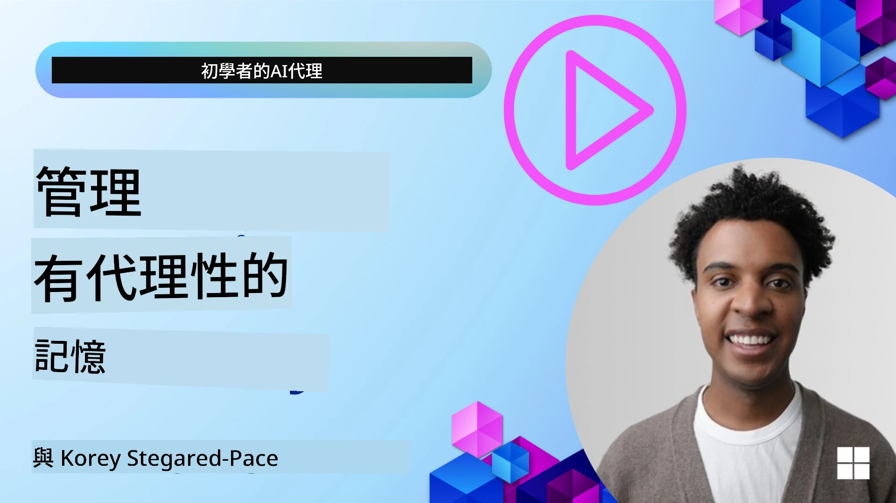

# AI 代理的記憶  

在討論建立 AI 代理的獨特優勢時，主要討論兩件事：調用工具完成任務的能力，以及隨時間改進的能力。記憶是創建自我進步代理的基礎，這些代理可以為我們的用戶創造更佳的體驗。

在本課程中，我們將探討 AI 代理的記憶是什麼，以及如何管理和利用它來造福我們的應用。

## 介紹

本課程將涵蓋：

• **了解 AI 代理的記憶**：什麼是記憶，為何對代理至關重要。

• **實作與儲存記憶**：為 AI 代理添加記憶功能的實際方法，聚焦於短期與長期記憶。

• **讓 AI 代理自我改進**：記憶如何讓代理從過去互動中學習並隨時間改進。

## 可用實作

本課程包含兩個完整的筆記本教學：

• **[13-agent-memory.ipynb](./13-agent-memory.ipynb)**：使用 Mem0 和 Azure AI Search 結合 Microsoft Agent Framework 實作記憶

• **[13-agent-memory-cognee.ipynb](./13-agent-memory-cognee.ipynb)**：使用 Cognee 實作結構化記憶，自動建立由嵌入支持的知識圖，並視覺化圖形及智能檢索

## 學習目標

完成本課程後，您將能夠：

• **區分各類 AI 代理記憶**，包括工作記憶、短期記憶、長期記憶，以及專門形式如角色記憶與情節記憶。

• **使用 Microsoft Agent Framework 實作和管理 AI 代理的短期與長期記憶**，善用 Mem0、Cognee、白板記憶等工具，並整合 Azure AI Search。

• **理解自我改進 AI 代理背後的原理**，以及強大記憶管理系統如何促進持續學習和適應。

## 了解 AI 代理記憶

本質上，**AI 代理的記憶指的是使其能夠保留並回憶資訊的機制**。這些資訊可能是對話的具體細節、用戶偏好、過去的動作，甚至是學習到的模式。

沒有記憶的 AI 應用通常是無狀態的，也就是每次交互都從零開始。這會導致重複且令人沮喪的用戶體驗，代理「忘記」了之前的上下文或偏好。

### 為何記憶重要？

代理的智能深深依賴於其回憶和利用過去資訊的能力。記憶使代理能夠：

• **反思**：從過去行為和結果學習。

• **互動**：在持續對話中保持上下文。

• **主動與被動反應**：根據歷史資料預測需求或適當回應。

• **自主**：透過引用儲存知識更獨立地運作。

實作記憶的目標是讓代理更**可靠且有能力**。

### 記憶類型

#### 工作記憶

可將其視為代理在單一持續任務或思考過程中使用的草稿紙。它保存計算下一步所需的即時資訊。

對 AI 代理而言，工作記憶通常捕捉對話中最相關的資訊，即使完整聊天歷史冗長或被截斷。它著重提取關鍵元素，如需求、提案、決策和行動。

**工作記憶範例**

在旅遊訂票代理中，工作記憶可能捕捉用戶當前的需求，例如「我想預訂一趟巴黎旅行」。此特定需求保留在代理的即時上下文中，以引導目前的交互。

#### 短期記憶

此種記憶在單次對話或會話期間保留資訊。它是當前聊天的上下文，使代理能回溯之前的對話輪次。

**短期記憶範例**

若用戶問：「飛往巴黎的機票多少錢？」接著再問：「那住宿呢？」短期記憶確保代理瞭解對話中「那裡」指的是「巴黎」。

#### 長期記憶

這些資訊跨多次對話或會話持續保留。它讓代理能記住用戶偏好、歷史互動或長期常識，這對個人化非常重要。

**長期記憶範例**

長期記憶可能記錄「Ben 喜歡滑雪和戶外活動，喜歡山景咖啡，過去曾受傷因此想避免高難度滑雪坡」。從先前互動中學習的此資訊會影響未來的旅遊規劃推薦，使推薦高度個人化。

#### 角色記憶

這種專門記憶幫助代理打造一貫的「個性」或「角色」。它允許代理記住自身或其設定角色的細節，使互動更自然且聚焦。

**角色記憶範例**

若旅遊代理被設計成「滑雪專家」，角色記憶會強化這角色，影響其回應，以符合專家的語氣和知識。

#### 工作流程／情節記憶

此記憶儲存代理在複雜任務中採取的步驟序列，包括成功與失敗。就像記住特定「片段」或過去經驗，從中學習。

**情節記憶範例**

若代理嘗試訂一班機票失敗（因無空位），情節記憶可記錄此失敗，使代理能在後續嘗試時嘗試其它航班或更明智地告知用戶問題。

#### 實體記憶

涉及從對話中提取並記憶特定實體（如人物、地點、事物）和事件。使代理建立關鍵元素的結構化理解。

**實體記憶範例**

從關於過去旅程的對話中，代理可能提取「巴黎」、「艾菲爾鐵塔」和「Le Chat Noir 餐廳的晚餐」作為實體。未來互動時，代理可回憶「Le Chat Noir」並主動提供協助預訂。

#### 結構化 RAG（檢索增強生成）

RAG 是一種較廣義的技術，而「結構化 RAG」則被強調為強大的記憶技術。它從多種來源（對話、電子郵件、圖片）抽取密集且結構化的資訊，用以增強回應的精確度、召回率與速度。相比於經典純語義相似度的 RAG，結構化 RAG 利用資訊固有結構。

**結構化 RAG 範例**

不僅匹配關鍵字，結構化 RAG 可以從電子郵件解析航班詳情（目的地、日期、時間、航空公司），並以結構化方式儲存。這使得像「我星期二預訂了飛往巴黎的哪班機？」這類精確查詢變得可能。

## 實作與儲存記憶

為 AI 代理實作記憶包含系統化的**記憶管理**流程，包括產生、儲存、檢索、整合、更新，甚至「遺忘」（或刪除）資訊。檢索尤為關鍵。

### 專門記憶工具

#### Mem0

管理代理記憶的一種方式是使用像 Mem0 這類專用工具。Mem0 作為持久記憶層，允許代理回憶相關互動、儲存用戶偏好與事實背景，並從成功與失敗中學習。概念是使無狀態的代理轉為有狀態。

它通過**兩階段記憶流程：抽取與更新**運作。首先，加入代理對話線程的訊息送至 Mem0 服務，透過大型語言模型（LLM）摘要對話歷史與抽取新記憶。隨後由 LLM 驅動的更新階段決定是否新增、修改或刪除這些記憶，並存入混合型資料庫，包括向量庫、圖庫及鍵值資料庫。此系統支持多種記憶類型，並可整合圖形記憶以管理實體間關係。

#### Cognee

另一強大方案是使用 **Cognee**，一款開源語義記憶系統，能將結構化與非結構化資料轉換成基於嵌入的可查詢知識圖。Cognee 採用**雙存儲架構**，結合向量相似度搜索與圖結構關係，使代理不只了解資訊相似性，更明白概念間如何相互關聯。

它在**混合檢索**上表現出色，融合向量相似、圖結構和 LLM 推理，涵蓋從原始片段查找到具圖結構的問答。系統維持**活躍記憶**，不斷演進成長，同時作為一個連結整體可查詢的圖，支持短期會話上下文與長期持久記憶。

Cognee 筆記本教學（[13-agent-memory-cognee.ipynb](./13-agent-memory-cognee.ipynb)）示範構建此統一記憶層，並包含多源資料導入、知識圖視覺化與針對特定代理需求的不同檢索策略查詢範例。

### 使用 RAG 儲存記憶

除受限於專用記憶工具如 Mem0 外，您也能利用強大搜索服務，如 **Azure AI Search 作為記憶的存取後端**，特別適用於結構化 RAG。

此方案可將代理回應紮根於自身資料，以確保更相關與準確的答案。Azure AI Search 可用於儲存用戶專屬旅遊記憶、產品目錄或任何其他領域知識。

Azure AI Search 支援包括**結構化 RAG**等功能，在從大型資料集（對話歷史、電子郵件、甚至圖片）抽取和檢索密集結構化資訊方面十分出色。相較傳統文本切片和嵌入方法，提供「超越人類的精確度與召回率」。

## 讓 AI 代理自我改進

自我改進代理的常見模式是引入一個**「知識代理」**。此獨立代理觀察用戶與主代理間的主要對話。其角色是：

1. **識別有價值資訊**：判斷對話中是否有任何內容值得作為一般知識或特定用戶偏好保存。

2. **抽取與摘要**：提煉對話中關鍵的學習或偏好。

3. **存入知識庫**：將提取資訊持久化，通常在向量數據庫中，以便後續檢索。

4. **強化未來查詢**：用戶發起新查詢時，知識代理檢索相關儲存資訊，並附加至用戶提示，為主代理提供關鍵上下文（類似 RAG）。

### 記憶優化

• **延遲管理**：為避免降低用戶互動速度，可先使用較便宜快速的模型來檢查資訊是否有儲存或檢索價值，僅在必要時呼叫較複雜的抽取／檢索流程。

• **知識庫維護**：隨著知識庫擴張，較少使用的資訊可移至「冷存儲」以管控成本。

## 想了解更多代理記憶？

加入 [Microsoft Foundry Discord](https://aka.ms/ai-agents/discord) 與其他學習者交流，參加辦公時間並獲得您的 AI 代理問題解答。

---

<!-- CO-OP TRANSLATOR DISCLAIMER START -->
**免責聲明**：
本文件由 AI 翻譯服務 [Co-op Translator](https://github.com/Azure/co-op-translator) 所翻譯。雖然我們力求準確，但請注意自動翻譯可能包含錯誤或不準確之處。原始文件的母語版本應視為權威來源。對於重要資訊，建議尋求專業人工翻譯。我們不對因使用本翻譯而引起的任何誤解或誤釋負責。
<!-- CO-OP TRANSLATOR DISCLAIMER END -->