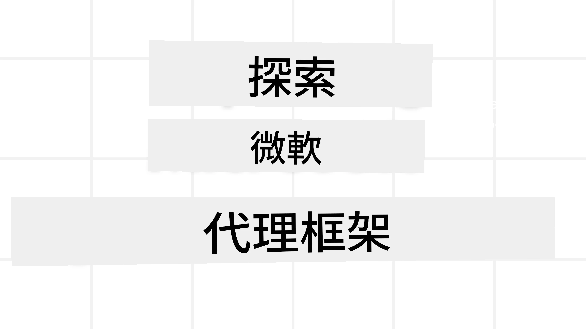
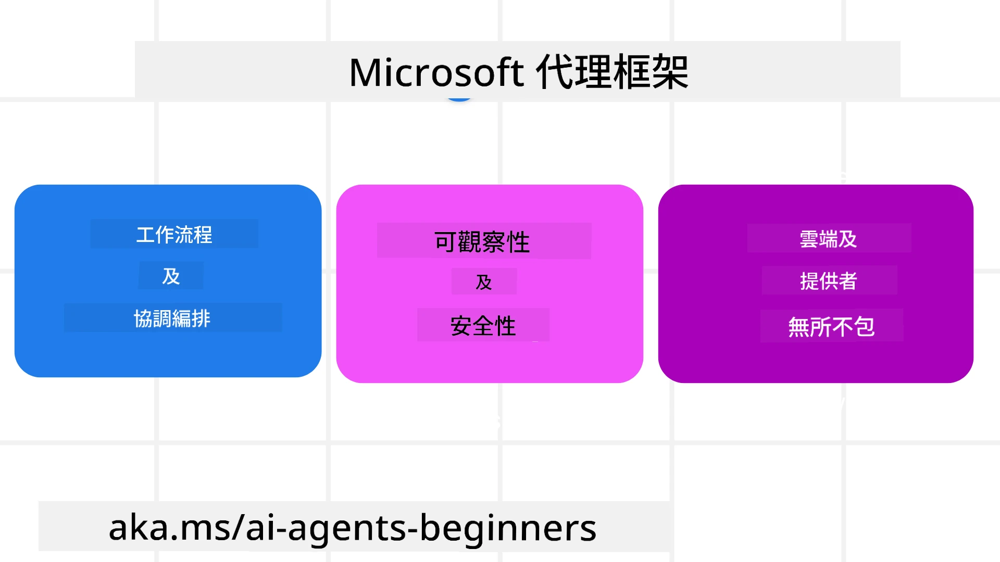
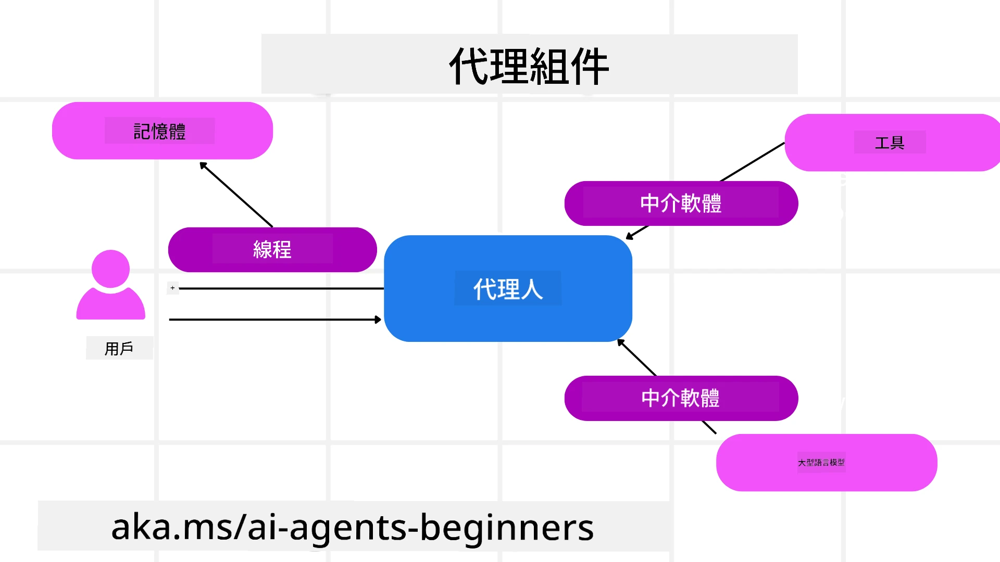

# 探索 Microsoft Agent Framework



### 介紹

本課程將涵蓋：

- 了解 Microsoft Agent Framework：主要功能與價值  
- 探索 Microsoft Agent Framework 的關鍵概念
- 進階 MAF 模式：工作流程、中介軟體與記憶體

## 學習目標

完成本課程後，您將會知道如何：

- 建立生產就緒的 AI 代理程式，使用 Microsoft Agent Framework
- 將 Microsoft Agent Framework 的核心功能應用於您的代理任務用例
- 使用進階模式，包括工作流程、中介軟體及可觀測性

## 程式碼範例

[Microsoft Agent Framework (MAF)](https://learn.microsoft.com/en-us/agent-framework/overview/?wt.mc_id=youtube_26688_organicsocial_reactor&pivots=programming-language-python) 的程式碼範例可在本資源庫 `xx-python-agent-framework` 與 `xx-dotnet-agent-framework` 檔案內找到。

## 了解 Microsoft Agent Framework



[Microsoft Agent Framework (MAF)](https://learn.microsoft.com/en-us/agent-framework/overview/?wt.mc_id=youtube_26688_organicsocial_reactor&pivots=programming-language-python) 是微軟統一的 AI 代理建構框架。它提供彈性以解決在生產與研究環境中各種代理任務用例，包括：

- <strong>序列代理編排</strong>，用於需要逐步工作流程的場景。
- <strong>並行編排</strong>，用於代理需同時完成任務的場景。
- <strong>群組聊天編排</strong>，用於代理可共同合作完成任務的場景。
- <strong>交接編排</strong>，用於代理在子任務完成後相互交接任務的場景。
- <strong>磁性編排</strong>，用於管理代理建立並修改任務清單，並處理子代理協調完成任務的場景。

為在生產環境交付 AI 代理，MAF 亦包含以下功能：

- <strong>可觀測性</strong>，透過 OpenTelemetry 追蹤 AI 代理的每項操作，包括工具調用、編排步驟、推理流程及透過 Microsoft Foundry 儀表板的效能監控。
- <strong>安全性</strong>，代理原生托管於 Microsoft Foundry，包含角色存取控制、私有資料處理與內建內容安全功能。
- <strong>持久性</strong>，代理執行緒與工作流程可暫停、恢復並錯誤復原，支援長時間運作。
- <strong>控制權</strong>，支援人工審核的工作流程，標示任務需人工核准。

Microsoft Agent Framework 亦著重互操作性，透過：

- <strong>雲端無關性</strong> — 代理可運行於容器、本地及多種不同雲端。
- <strong>供應商無關性</strong> — 可透過您偏好的 SDK 建立代理，包括 Azure OpenAI 與 OpenAI。
- <strong>整合開放標準</strong> — 代理可使用代理間通訊 A2A 及模型上下文協議 MCP 等協議，發現並使用其他代理及工具。
- <strong>外掛與連接器</strong> — 可連接至 Microsoft Fabric、SharePoint、Pinecone 及 Qdrant 等資料與記憶服務。

現在讓我們看看這些功能如何應用於 Microsoft Agent Framework 的核心概念。

## Microsoft Agent Framework 核心概念

### 代理 (Agents)



<strong>創建代理</strong>

代理創建透過定義推理服務（LLM 提供者）、
一套供 AI 代理遵循的指示，以及指派一個 `name` 來完成：

```python
agent = AzureOpenAIChatClient(credential=AzureCliCredential()).create_agent( instructions="You are good at recommending trips to customers based on their preferences.", name="TripRecommender" )
```

上述範例使用的是 `Azure OpenAI`，但代理可使用多種服務來創建，包括 `Microsoft Foundry Agent Service`：

```python
AzureAIAgentClient(async_credential=credential).create_agent( name="HelperAgent", instructions="You are a helpful assistant." ) as agent
```

OpenAI 的 `Responses` 與 `ChatCompletion` API

```python
agent = OpenAIResponsesClient().create_agent( name="WeatherBot", instructions="You are a helpful weather assistant.", )
```

```python
agent = OpenAIChatClient().create_agent( name="HelpfulAssistant", instructions="You are a helpful assistant.", )
```

或 [MiniMax](https://platform.minimaxi.com/)，其提供兼容 OpenAI 的 API 及大上下文窗口（最高 204K 代幣）：

```python
agent = OpenAIChatClient(base_url="https://api.minimax.io/v1", api_key=os.environ["MINIMAX_API_KEY"], model_id="MiniMax-M3").create_agent( name="HelpfulAssistant", instructions="You are a helpful assistant.", )
```

亦可使用 A2A 通訊協議的遠端代理：

```python
agent = A2AAgent( name=agent_card.name, description=agent_card.description, agent_card=agent_card, url="https://your-a2a-agent-host" )
```

<strong>運行代理</strong>

代理可使用 `.run` 或 `.run_stream` 方法運行，分別支援非串流和串流回應。

```python
result = await agent.run("What are good places to visit in Amsterdam?")
print(result.text)
```

```python
async for update in agent.run_stream("What are the good places to visit in Amsterdam?"):
    if update.text:
        print(update.text, end="", flush=True)

```

每次運行代理時亦可傳入選項，客製化例如代理所用的 `max_tokens`、代理可調用的 `tools` 及代理本身所用的 `model`。

這在需要特定模型或工具來完成使用者任務時非常有用。

<strong>工具</strong>

工具可在定義代理時設定：

```python
def get_attractions( location: Annotated[str, Field(description="The location to get the top tourist attractions for")], ) -> str: """Get the top tourist attractions for a given location.""" return f"The top attractions for {location} are." 


# 當直接創建一個 ChatAgent 時

agent = ChatAgent( chat_client=OpenAIChatClient(), instructions="You are a helpful assistant", tools=[get_attractions]

```

亦可在運行代理時設定：

```python

result1 = await agent.run( "What's the best place to visit in Seattle?", tools=[get_attractions] # 此工具僅供此運行使用 )
```

<strong>代理執行緒</strong>

代理執行緒用於處理多輪對話。執行緒可以：

- 使用 `get_new_thread()`，讓執行緒可持續保存。
- 在每次執行代理時自動建立執行緒，該執行緒只在當前運行中存在。

創建執行緒的程式碼如下：

```python
# 創建一個新執行緒。
thread = agent.get_new_thread() # 使用該執行緒運行代理。
response = await agent.run("Hello, I am here to help you book travel. Where would you like to go?", thread=thread)

```

之後可將執行緒序列化以便儲存以供稍後使用：

```python
# 建立一個新執行緒。
thread = agent.get_new_thread() 

# 使用該執行緒運行代理。

response = await agent.run("Hello, how are you?", thread=thread) 

# 將執行緒序列化以便儲存。

serialized_thread = await thread.serialize() 

# 從儲存中載入後反序列化執行緒狀態。

resumed_thread = await agent.deserialize_thread(serialized_thread)
```

<strong>代理中介軟體</strong>

代理在完成使用者任務時，會與工具和 LLM 互動。有時我們希望在這些互動過程中執行或追蹤某些操作。代理中介軟體讓我們可以透過以下方式做到這點：

<em>功能中介軟體</em>

此中介軟體允許我們在代理與其調用的功能／工具間執行操作。例如可以在功能呼叫時做記錄。

下列程式碼中 `next` 表示是否呼叫下一個中介軟體或實際功能。

```python
async def logging_function_middleware(
    context: FunctionInvocationContext,
    next: Callable[[FunctionInvocationContext], Awaitable[None]],
) -> None:
    """Function middleware that logs function execution."""
    # 預處理：函數執行前記錄日誌
    print(f"[Function] Calling {context.function.name}")

    # 繼續到下一個中介軟件或函數執行
    await next(context)

    # 後處理：函數執行後記錄日誌
    print(f"[Function] {context.function.name} completed")
```

<em>聊天中介軟體</em>

此中介軟體允許我們在代理與 LLM 之間的請求過程中執行或記錄操作。

其中包含了重要資訊，如傳送至 AI 服務的 `messages` 等。

```python
async def logging_chat_middleware(
    context: ChatContext,
    next: Callable[[ChatContext], Awaitable[None]],
) -> None:
    """Chat middleware that logs AI interactions."""
    # 預處理：在呼叫 AI 之前記錄日誌
    print(f"[Chat] Sending {len(context.messages)} messages to AI")

    # 繼續下一個中介軟件或 AI 服務
    await next(context)

    # 後處理：在 AI 回應後記錄日誌
    print("[Chat] AI response received")

```

<strong>代理記憶體</strong>

如在「Agentic Memory」課程中所述，記憶是讓代理能在不同上下文中運作的重要元素。MAF 提供數種記憶型態：

<em>記憶體內部存儲</em>

這是應用執行期間執行緒內部的記憶。

```python
# 建立一個新執行緒。
thread = agent.get_new_thread() # 使用該執行緒執行代理。
response = await agent.run("Hello, I am here to help you book travel. Where would you like to go?", thread=thread)
```

<em>持久訊息</em>

用於跨不同會話存儲對話歷史。透過 `chat_message_store_factory` 定義：

```python
from agent_framework import ChatMessageStore

# 創建自訂消息存儲
def create_message_store():
    return ChatMessageStore()

agent = ChatAgent(
    chat_client=OpenAIChatClient(),
    instructions="You are a Travel assistant.",
    chat_message_store_factory=create_message_store
)

```

<em>動態記憶</em>


這些記憶會在代理運行之前加入到上下文中。這些記憶可以存儲在像 mem0 這樣的外部服務中：

```python
from agent_framework.mem0 import Mem0Provider

# 使用 Mem0 以獲取進階記憶功能
memory_provider = Mem0Provider(
    api_key="your-mem0-api-key",
    user_id="user_123",
    application_id="my_app"
)

agent = ChatAgent(
    chat_client=OpenAIChatClient(),
    instructions="You are a helpful assistant with memory.",
    context_providers=memory_provider
)

```

<strong>代理可觀察性</strong>

可觀察性對於構建可靠且可維護的代理系統非常重要。MAF 集成了 OpenTelemetry，提供追蹤和計量器以增強可觀察性。

```python
from agent_framework.observability import get_tracer, get_meter

tracer = get_tracer()
meter = get_meter()
with tracer.start_as_current_span("my_custom_span"):
    # 做某事
    pass
counter = meter.create_counter("my_custom_counter")
counter.add(1, {"key": "value"})
```

### 工作流

MAF 提供了預定義步驟的工作流，用於完成任務，且在這些步驟中包含 AI 代理作為組件。

工作流由不同的組件組成，允許更好的控制流程。工作流還支援<strong>多代理協調</strong>和<strong>檢查點</strong>，以保存工作流狀態。

工作流的核心組件是：

<strong>執行器</strong>

執行器接收輸入訊息，執行其指定的任務，然後生成輸出訊息。這推動工作流程向完成更大的任務前進。執行器可以是 AI 代理或自定義邏輯。

<strong>邊緣</strong>

邊緣用於定義工作流中訊息的流動。這些可以是：

<em>直接邊緣</em> - 執行器之間的簡單一對一連接：

```python
from agent_framework import WorkflowBuilder

builder = WorkflowBuilder()
builder.add_edge(source_executor, target_executor)
builder.set_start_executor(source_executor)
workflow = builder.build()
```

<em>條件邊緣</em> - 在某些條件滿足後啟動。例如，當飯店房間無法預訂時，執行器可以建議其他選項。

*切換-案例邊緣* - 根據定義的條件將訊息路由到不同的執行器。例如，若旅客擁有優先權，則其任務將透過另一個工作流程處理。

<em>多重發送邊緣</em> - 將一條訊息發送給多個目標。

<em>多重接收邊緣</em> - 收集來自不同執行器的多條訊息並發送給一個目標。

<strong>事件</strong>

為了提供對工作流更好的可觀察性，MAF 提供了內置的執行事件，包括：

- `WorkflowStartedEvent`  - 工作流執行開始
- `WorkflowOutputEvent` - 工作流產生輸出
- `WorkflowErrorEvent` - 工作流遇到錯誤
- `ExecutorInvokeEvent`  - 執行器開始處理
- `ExecutorCompleteEvent`  -  執行器完成處理
- `RequestInfoEvent` - 發出一個請求

## 進階 MAF 模式

上面章節涵蓋了 Microsoft Agent Framework 的關鍵概念。在您建構更複雜的代理時，這裡有一些值得考慮的進階模式：

- <strong>中介軟件組合</strong>：鏈接多個中介軟件處理器（記錄、認證、限流），使用函數和聊天中介軟件，對代理行為進行細粒度控制。
- <strong>工作流檢查點</strong>：使用工作流事件和序列化功能來保存和恢復長時間運行的代理流程。
- <strong>動態工具選擇</strong>：結合工具描述的 RAG 與 MAF 的工具註冊，針對每個查詢只展示相關工具。
- <strong>多代理交接</strong>：使用工作流邊緣和條件路由來協調專門代理之間的交接。

## 在 Microsoft Foundry 上承載 LangChain / LangGraph 代理

Microsoft Agent Framework 是<strong>框架互操作</strong>的 — 您並不受限於只能使用 MAF 寫的代理。若您已經有使用<strong>LangChain</strong>或<strong>LangGraph</strong>建構的代理，可以將其作為<strong>Microsoft Foundry 托管代理</strong>運行，讓 Foundry 管理執行環境、會話、擴展、自身識別及協定端點，而您的代理邏輯仍保留於 LangGraph。

這是透過 `langchain_azure_ai.agents.hosting` 套件完成的，該套件透過 Foundry 托管代理使用的協定，暴露編譯後的 LangGraph 圖表。

**1. 安裝 hosting 額外功能：**

```bash
pip install -U "langchain-azure-ai[hosting]>=1.2.4" azure-identity
```

`hosting` 額外功能會安裝 Foundry 協定庫：`azure-ai-agentserver-responses`（兼容 OpenAI 的 `/responses` 端點）和 `azure-ai-agentserver-invocations`（通用 `/invocations` 端點）。

**2. 選擇承載協定：**

| 協定 | 主機類別 | 端點 | 使用情況 |
|----------|-----------|----------|----------|
| **Responses** | `ResponsesHostServer` | `/responses` | 需要 OpenAI 兼容的聊天、串流、回應歷史與對話串連 — 推薦的對話型代理預設。 |
| **Invocations** | `InvocationsHostServer` | `/invocations` | 需要自定義 JSON 格式、Webhook 式端點或非對話性處理。 |

因為 **Responses API 是 Foundry 對代理型開發的主要 API**，大多數代理建議先用 `ResponsesHostServer`。

**3. 配置環境變數**（先執行 `az login`，使 `DefaultAzureCredential` 可認證）：

```bash
export FOUNDRY_PROJECT_ENDPOINT="https://<resource>.services.ai.azure.com/api/projects/<project>"
export FOUNDRY_MODEL_NAME="gpt-5-mini"
```

當代理後續作為托管代理運行於 Foundry 時，平台會自動注入 `FOUNDRY_PROJECT_ENDPOINT`。

**4. 透過 Responses 協定公開 LangGraph 代理：**

```python
import os

from azure.ai.projects import AIProjectClient
from azure.identity import DefaultAzureCredential, get_bearer_token_provider
from langchain.agents import create_agent
from langchain_openai import ChatOpenAI
from langchain_azure_ai.agents.hosting import ResponsesHostServer

_AZURE_AI_SCOPE = "https://ai.azure.com/.default"


def build_chat_model() -> ChatOpenAI:
    project_endpoint = os.environ["FOUNDRY_PROJECT_ENDPOINT"].rstrip("/")
    deployment = os.environ.get("FOUNDRY_MODEL_NAME", "gpt-5-mini")
    credential = DefaultAzureCredential()
    project = AIProjectClient(endpoint=project_endpoint, credential=credential)
    openai_client = project.get_openai_client()
    token_provider = get_bearer_token_provider(credential, _AZURE_AI_SCOPE)

    # ChatOpenAI 這裡針對 Foundry 項目的 OpenAI 相容（Responses）端點。
    return ChatOpenAI(
        model=deployment,
        base_url=str(openai_client.base_url),
        api_key=token_provider,
    )


def main() -> None:
    graph = create_agent(build_chat_model(), tools=[])
    port = int(os.environ.get("PORT", "8088"))
    ResponsesHostServer(graph).run(port=port)


if __name__ == "__main__":
    main()
```

本機運行指令為 `python main.py`，然後可向 `http://localhost:8088/responses` 發送 Responses 請求。

**主要行為：**

- <strong>對話</strong>：用戶端透過傳送 `previous_response_id` 或 `conversation` 編號來繼續對話。若您的圖表編譯時含有 LangGraph 檢查點器，Foundry 會將對話狀態關聯到該檢查點（生產環境使用持久性檢查點器；本地測試可用 `MemorySaver`）。 
- <strong>人機協作</strong>：若您的圖表使用 LangGraph `interrupt()`，`ResponsesHostServer` 會將待處理的中斷作為 Responses 的 `function_call` / `mcp_approval_request` 專案展示，用戶端同時透過相應 `function_call_output` / `mcp_approval_response` 繼續流程。
- **部署至 Foundry**：利用 Azure 開發者命令列工具 — `azd ext install azure.ai.agents`，`azd ai agent init -m <manifest>`，`azd ai agent run`（本地，需要 Docker），再執行 `azd provision` 和 `azd deploy`。托管代理的部署需要 **Foundry 專案管理員** 角色。

此範例可執行版本位於 [code-samples/14-langchain-hosted-agent.py](../../../14-microsoft-agent-framework/code-samples/14-langchain-hosted-agent.py)。如需完整教程（Invocations 協定、自訂請求結構與故障排除），請參閱 [Host LangGraph agents as Foundry hosted agents](https://learn.microsoft.com/azure/foundry/how-to/develop/langchain-hosted-agents)。

## 程式碼範例

Microsoft Agent Framework 的程式碼範例可在此儲存庫的 `xx-python-agent-framework` 和 `xx-dotnet-agent-framework` 檔案中找到。

## 對 Microsoft Agent Framework 有更多問題？

加入 [Microsoft Foundry Discord](https://discord.com/invite/ATgtXmAS5D) ，與其他學習者交流，參加諮詢時間並獲得 AI 代理相關問題的解答。
## 上一課

[代理記憶](../13-agent-memory/README.md)

## 下一課


[建立電腦使用代理 (CUA)](../15-browser-use/README.md)

---

<!-- CO-OP TRANSLATOR DISCLAIMER START -->
**免責聲明**：
本文件由 AI 翻譯服務 [Co-op Translator](https://github.com/Azure/co-op-translator) 翻譯而成。雖然我們致力於確保準確性，但請注意，機器自動翻譯可能包含錯誤或不準確之處。原始文件的母語版本應被視為權威來源。對於重要資訊，建議進行專業人工翻譯。我們不對因使用本翻譯而產生的任何誤解或誤釋承擔責任。
<!-- CO-OP TRANSLATOR DISCLAIMER END -->