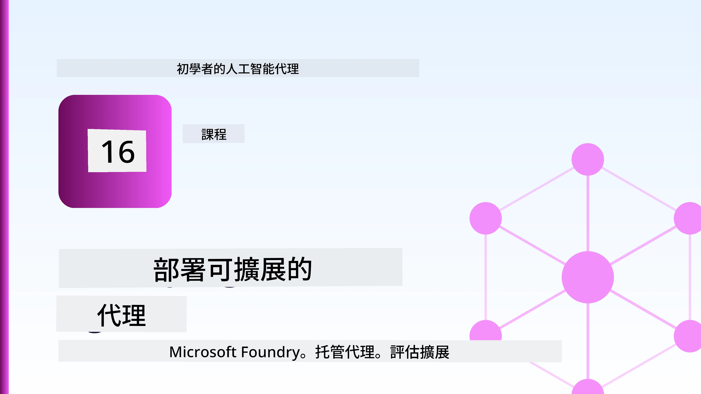
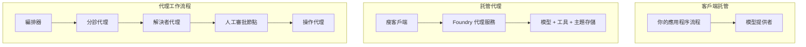
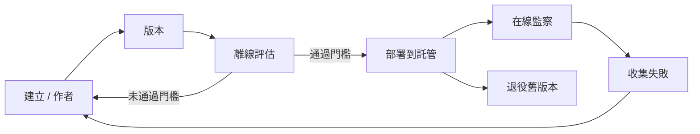
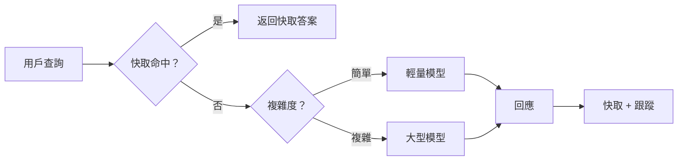
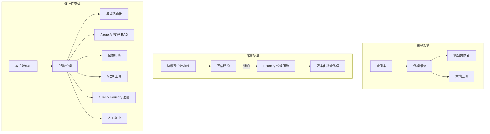

# 使用 Microsoft Foundry 部署可擴展智能代理



到目前為止，您已經建立了在筆記本內運行、由 `az login` 和一些環境變數驅動的代理。這正是學習的正確方式。但這並非成千上萬客戶在凌晨三點依賴的代理的正確運行方式。

本課程討論「在我的機器上可運行」與「在生產環境中可靠且經濟實惠地運行」之間的差距。我們通過使用 **Microsoft Foundry** 和 **Microsoft Foundry Agent Service** 來縮小這個差距，並透過構建一個真正的客戶支持代理來實現，該代理具備工具、檢索、記憶、評估和監控功能。

## 簡介

本課程將涵蓋：

- <strong>原型代理</strong> 與 <strong>部署代理</strong> 的差異，以及為何轉換主要圍繞模型之外的其他一切。
- 代理的 <strong>部署模式</strong>：客戶端託管、服務端託管（託管代理）、及工作流程協調。
- Microsoft Foundry 上的 <strong>代理生命週期</strong> — 創建、版本控制、部署、評估、觀察、退役。
- <strong>擴展策略</strong>：模型路由、快取、併發及無狀態設計。
- 透過 OpenTelemetry 和 Foundry 跟踪的 <strong>可觀察性</strong>。
- 通過模型選擇、路由與評估門進行的 <strong>成本優化</strong>。
- <strong>企業考量</strong>：治理、人類審核，以及在生產環境安全執行 MCP 伺服器。

## 學習目標

完成本課程後，您將能：

- 為特定代理工作負載選擇合適的部署模式。
- 將代理部署到 Microsoft Foundry Agent Service，使其具備版本控制、治理與可觀察性。
- 為代理加裝追蹤，並接入每次發佈前執行的評估管線。
- 應用模型路由與快取，在擴展時控制延遲和成本。
- 為高風險操作添加人工審核門，並以生產安全的方式整合 MCP 伺服器。

## 前置條件

本課程假設您已完成先前課程，並熟悉：

- 使用 [Microsoft Agent Framework](../14-microsoft-agent-framework/README.md) 構建代理（課程14）。
- [工具使用](../04-tool-use/README.md)（課程4）及 [Agentic RAG](../05-agentic-rag/README.md)（課程5）。
- [代理記憶](../13-agent-memory/README.md)（課程13）及 [Agentic 協定 / MCP](../11-agentic-protocols/README.md)（課程11）。
- [可觀察性與評估](../10-ai-agents-production/README.md)（課程10）— 本課程直接基於此。

您還需要：

- 一個 **Azure 訂閱** 和一個擁有至少一個部署聊天模型的 **Microsoft Foundry 專案**。
- 已認證的 **Azure CLI**（`az login`）。
- Python 3.12+ 及本倉庫的 [`requirements.txt`](../../../requirements.txt) 中的套件。

## 從原型到生產：實際變化

原型代理和生產代理共享同一核心循環 — 推理、調用工具、回應。變化在於包裹此循環的所有周邊。模型可能只佔生產代理的 20%；其餘 80% 是運行框架。

| 關注點 | 原型 | 生產環境 |
| --- | --- | --- |
| <strong>託管形式</strong> | 在你的筆記本運行 | 以託管服務形式運行，版本化並發布 |
| <strong>身份認證</strong> | 您的 `az login` 令牌 | 具有限定權限的受管理身份 |
| <strong>狀態管理</strong> | 內存中，重啟即失 | 外部化（線程存儲、記憶服務） |
| <strong>故障處理</strong> | 看到錯誤回溯 | 重試、降級、死信隊列、警報 |
| <strong>成本</strong> | 「幾分錢」 | 每請求追蹤，路由，快取，預算化 |
| <strong>品質</strong> | 你目測輸出 | 每次發佈前自動評估 |
| <strong>信任度</strong> | 你批准每個行動 | 政策+人類審核高風險操作 |

請記住這張表格。以下每節對應其中一項。

## 代理部署模式

您會使用三種模式，且常搭配使用。

### 1. 客戶端託管代理

代理物件存活在<em>您的</em>應用程序進程內。您的程式碼直接調用模型提供者；推理循環在您的服務中運行。這是前面課程中使用的方法。

- <strong>適合使用場景</strong>：需要全面控制循環、自訂中介軟體，或將代理嵌入現有後端。
- <strong>取捨</strong>：須自行負責擴展、狀態和韌性。

### 2. 託管代理（Foundry Agent Service）

代理會作為資源<em>註冊到</em> Microsoft Foundry。Foundry 托管推理循環、存儲線程、執行內容安全和 RBAC，並讓代理在 Foundry 門戶中可見。您的應用成為輕量客戶端，創建線程並讀取回應。

- <strong>適合使用場景</strong>：需要耐用性、內建可觀察性、治理及較少運維負擔。
- <strong>取捨</strong>：以管理運行時換取較少的底層控制。

### 3. 代理工作流程

多個代理（和工具）組成具有明確控制流程的圖譜 — 順序步驟、分支、人類審核節點，及可暫停和續行的耐久檢查點。這是 Microsoft Agent Framework <strong>工作流程</strong> 功能在部署規模上的應用。

- <strong>適合使用場景</strong>：單一任務涵蓋多個專業代理或需中途審核步驟時。
- <strong>取捨</strong>：更多活動元件；需協調層級的可觀察性。



## Microsoft Foundry 上的代理生命週期

部署代理不是一次性的 `push`。它是一個循環，非常類似軟體發佈週期，因為它本質就是如此。



這一關鍵理念來自 [課程10](../10-ai-agents-production/README.md)：**離線評估是門檻，不是附帶考量。** 新版本代理未通過評估門檻不會發布。線上可觀察性會將真實故障反饋入離線測試集。這就是整個循環。

## 擴展策略

擴展代理有別於擴展無狀態 Web API，因為每個請求可能觸發多次昂貴的模型和工具調用。四種技術承載大部分負載。

**無狀態請求處理。** 不在進程記憶中保留每用戶狀態。將對話線程保持在 Foundry 線程存儲或記憶服務中，讓任何實例都能處理任何請求。這是橫向擴展的基礎——新增實例，無黏性會話。

**模型路由。** 不是所有請求都需使用最強大（且最昂貴）的模型。將簡單請求（意圖分類、簡短事實回答）路由至小型快速模型，將大型模型留給真正需要推理的請求。Foundry 的<strong>模型路由器</strong>可協助您，或者您也可自行實現輕量分類器。您將在實驗中構建 DIY 版本。

**回應快取。** 許多支援查詢是近似重複（「如何重設密碼？」）。快取常見問題的答案，直接提供，不用每次調用模型。即便是適度的快取命中率，也能顯著降低成本和延遲。

**併發與背壓。** 模型供應商有速率限制。限制併發數、使用指數退避重試，並優雅降級（排隊顯示「我們正在處理」回應勝過 500 錯誤）。



## 生產環境的可觀察性

不可見者不可操作。如課程10所述，Microsoft Agent Framework 原生發出 **OpenTelemetry** 跟踪——每個模型調用、工具使用和協調步驟均成為「跨度」。在生產中您將這些跨度導出至 Microsoft Foundry（或任何 OTel 兼容後端），以便：

- 端到端追蹤單一客戶投訴，涵蓋所有模型和工具調用。
- 長期觀察每請求的 p50/p95 延遲和成本。
- 在用戶（或財務團隊）察覺前警報錯誤率激增及成本異常。

```python
from agent_framework.observability import get_tracer

tracer = get_tracer()

with tracer.start_as_current_span("support_request") as span:
    span.set_attribute("customer.tier", "enterprise")
    span.set_attribute("routed.model", "gpt-5-nano")
    # 在此範圍內，代理執行會自動被追蹤
```

類似 `customer.tier` 和 `routed.model` 的屬性讓大量追蹤轉為可解答的問題（「企業客戶是否過度被路由到小模型？」）。

## 成本優化

生產代理的成本主要由代幣決定。有三個調節杆，影響力依次遞減：

1. **選擇合適大小的模型。** 通過評估門檻的小模型幾乎總是比通過門檻的大模型更便宜。用評估證明小模型足夠好，而非基於謹慎選最大模型。
2. **依複雜度路由。** 如前，以大模型價格只支付真正需要大模型推理的請求。
3. **積極快取。** 最便宜的模型調用是從不調用的那次。

評估門與成本控制是從不同角度看待同一紀律：評估決定<em>質量底線</em>，路由與快取讓你盡量靠近該底線的<em>成本</em>。

## 企業部署考慮

**治理。** 託管代理繼承 Foundry 的 RBAC、內容安全及審計日誌。給每個代理授予需要的最低權限受管理身份——只讀知識庫、針對工單 API 的限定存取，絕無額外。

**人類介入。** 某些操作後果重大，不宜自動化——退款、刪除帳號、升級至法務團隊。Microsoft Agent Framework 支持 <strong>需審核的工具</strong>：代理提出動作，執行暫停，人工審批或駁回，工作流程恢復。您在 [課程6](../06-building-trustworthy-agents/README.md) 見過原始模組；此處部署它。

**生產環境 MCP。** [MCP](../11-agentic-protocols/README.md) 允許您的代理通過標準接口使用外部工具。生產時，將 MCP 伺服器視為不可信邊界：固定伺服器版本、以限定身份運行、驗證輸出，絕不暴露秘密給它。MCP 伺服器是依賴且依賴需打補丁、審計及速率限制。



這三張圖 — 開發、部署、運行時 — 是同一個代理在其生命週期的三個階段。隨後的實驗帶您一步步構建它。

## 實作實驗：生產級客戶支持代理

開啟 [`code_samples/16-python-agent-framework.ipynb`](./code_samples/16-python-agent-framework.ipynb) 並完整演練。您將組裝一個<strong>Contoso 客戶支持代理</strong>，涵蓋所有生產關切：

1. <strong>工具調用</strong> — 查詢訂單狀態及開啟支援工單。
2. **RAG** — 從知識庫（Azure AI Search，並設有記憶內備援使筆記本無審索引用）回答政策問題。
3. <strong>記憶</strong> — 在對話輪次間記住客戶。
4. <strong>模型路由</strong> — 複雜度分類器將請求路由至小或大型模型。
5. <strong>回應快取</strong> — 重複問題從快取提供答案。
6. <strong>人工審核</strong> — 超過門檻的退款需要人工確認。
7. <strong>評估管線</strong> — 小型離線測試集評分代理並充當發佈門檻。
8. <strong>可觀察性</strong> — 每次請求都繞有 OpenTelemetry 跟蹤。

### 操作引導

筆記本組織為每個生產關切為自含可執行的區段。核心是路由加快取的請求處理程式：

```python
async def handle_support_request(query: str, customer_id: str) -> str:
    # 1. 盡量從快取提供服務。
    cached = response_cache.get(normalize(query))
    if cached:
        return cached

    # 2. 根據複雜度進行路由以控制成本。
    model = "gpt-5-nano" if is_simple(query) else "gpt-5-mini"

    # 3. 在追蹤範圍內運行代理以便觀察。
    with tracer.start_as_current_span("support_request") as span:
        span.set_attribute("routed.model", model)
        span.set_attribute("customer.id", customer_id)
        response = await support_agent.run(query, model=model)

    # 4. 快取並返回。
    response_cache.set(normalize(query), response.text)
    return response.text
```

釋放評估門看起來像這樣：

```python
async def evaluation_gate(agent, test_cases, threshold: float = 0.8) -> bool:
    passed = 0
    for case in test_cases:
        result = await agent.run(case["input"])
        if score_response(result.text, case["expected"]) >= 0.8:
            passed += 1
    pass_rate = passed / len(test_cases)
    print(f"Evaluation pass rate: {pass_rate:.0%} (gate: {threshold:.0%})")
    return pass_rate >= threshold  # 只有通過閘門時才部署
```

閱讀每行程式碼——筆記本故意保持基元小而清楚，沒有框架調用隱藏細節。

## 使用冒煙測試驗證部署代理

上述評估門是<em>離線</em>對代理物件進行。當代理以託管代理身份部署後，您還需要一個更便宜的檢查：**部署的端點是否確實回應？**

所謂「成功部署」僅證明控制平面接受定義，但不保證代理會回應。缺失依賴、錯誤模型路由或過期連線都可能導致表面綠燈但無回應的部署。<strong>冒煙測試</strong>可在幾秒內發現此問題，每次部署執行，開銷遠低於完整評估。

本倉庫附帶基於 [AI Smoke Test](https://github.com/marketplace/actions/ai-smoke-test) GitHub Action 的即用型冒煙測試管線：

- <strong>目錄</strong> — [`tests/lesson-16-smoke-tests.json`](../../../tests/lesson-16-smoke-tests.json) 含 Contoso 支援代理的提示詞及斷言（依政策回答、訂單查詢、話題維持、多輪連貫）。其他課程代理的目錄也與其並存——見 [`tests/README.md`](../tests/README.md)。
- <strong>工作流程</strong> — [`.github/workflows/smoke-test.yml`](../../../.github/workflows/smoke-test.yml) 以 Azure OIDC 登錄，向代理的回應端點 POST 每個提示詞，斷言失敗則工作失敗。

```yaml
- name: Smoke-test hosted agent
  uses: JFolberth/ai-smoketest@v1
  with:
    project_endpoint: ${{ inputs.project_endpoint }}
    agent_name: ContosoSupportAgent
    tests_file: tests/lesson-16-smoke-tests.json
```


在您的代理部署後，從 **Actions** 分頁執行它，並提供您的 Foundry 專案端點和代理名稱。聯邦身份需要在 Foundry 專案範圍擁有 **Azure AI User** 角色。可以將這些層次想像成金字塔結構：冒煙測試（是否可到達且有反應？）在每次部署時執行，離線評估（夠好可以發布嗎？）在推廣前執行，線上評估（實際狀況如何？）則持續執行。

## 知識檢測

在進入作業前先測試您的理解。

**1. 一個生產代理的大約有多少是「模型」本身，其餘的是什麼？**

<details>
<summary>答案</summary>

模型只是系統中的少數部分——通常約佔 20%。其餘部分是運營骨架：主機及版本控制、身份與 RBAC、外部狀態、故障處理、成本追蹤、評估，以及人機介入控管。轉入生產主要是圍繞推理迴圈的每個環節進行建置。
</details>

**2. 何時會選擇 Hosted Agent 而非客戶端主機代理？**

<details>
<summary>答案</summary>

當您需要具有內建持久性的管理執行環境（可持續且可恢復的執行緒）、可觀察性、內容安全與 RBAC，且願意為了減少運營複雜度而放棄部分推理迴圈的低階控制時會使用 Hosted Agent。若需對迴圈有完全控制權，或將代理嵌入現有後端，則較適合使用客戶端主機代理。
</details>

**3. 為什麼可擴展的代理必須在其自身的進程記憶體中是無狀態的？**

<details>
<summary>答案</summary>

這樣任何實例都能處理任何請求，這允許在沒有黏性會話的情況下進行水平擴展。每個使用者的對話狀態會外部化到執行緒存儲或記憶體服務。如果狀態存在進程記憶體中，重啟時就會遺失，也無法自由分配負載。
</details>

**4. 模型路由解決了什麼問題，其與評估的關係為何？**

<details>
<summary>答案</summary>

路由將簡單請求送往小型、便宜且快速的模型，並保留大型模型用於真正的推理，以控制延遲和成本。它與評估相關，因為評估證明了小型模型對某類請求是足夠好的——沒有評估的路由只是猜測。
</details>

**5. 什麼是「評估門檻」，它存在於生命週期的哪裡？**

<details>
<summary>答案</summary>

評估門檻會用離線測試集測試新代理版本，除非通過率達到門檻，否則阻擋部署。它位於生命週期中的「版本」與「部署」之間，使品質成為發佈的前提，而非出貨後才檢查。
</details>

**6. 為什麼 MCP 伺服器在生產環境中應視為不受信任的邊界？**

<details>
<summary>答案</summary>

因為它是您的代理所呼叫的外部依賴。您應固定其版本、以範圍限定的身份執行、驗證輸出、設率限制，且絕不向其透露任何秘密——這是您對任何第三方依賴的一致紀律。它的輸出流入您的代理推理，故未經驗證的信任是資安風險。
</details>

**7. 通常哪個單一變更對生產代理成本影響最大，為什麼？**

<details>
<summary>答案</summary>

調整模型大小——使用能通過評估門檻的最小模型。成本主要由代幣量主導，而符合品質標準的較小模型幾乎總是比大型模型便宜。快取和路由進一步降低成本，但選對基底模型是第一要點。
</details>

**8. 欄位屬性如 `customer.tier` 和 `routed.model` 在可觀察性中扮演什麼角色？**

<details>
<summary>答案</summary>

它們將原始追蹤轉變為可解答的商業問題。沒有屬性時只有一堆追蹤記錄；有了屬性，您就可以問「企業客戶是否過度經常被路由到小模型？」或「哪個模型處理最慢的請求？」屬性是您依營運重要維度切分遙測的方式。
</details>

## 作業

以實驗室中的客戶支援代理為基礎，強化它以符合特定情境：**SaaS 公司之訂閱帳單支援代理。**

您的提交應包含：

1. <strong>替換工具</strong>為跟帳單相關的：`get_subscription_status`、`get_invoice` 和 `issue_credit`（超過 $50 的信用額度需要人工批准）。
2. **新增三個 RAG 文件**，涵蓋公司退款政策、帳單週期與取消政策。
3. <strong>擴充評估集</strong>至少至八個案例，且至少包含兩個應觸發人工審核路徑的案例，並確認您的評估門檻正確通過或失敗。
4. <strong>新增一份成本報告</strong>：在透過代理執行十個混合查詢後，列印出多少發送到小模型，多少送到大型模型，以及多少由快取回應。

寫一小段（在一個 markdown 儲存格中）說明您選擇了哪個模型路由規則，以及您如何用實際流量驗證它。這裡沒有唯一正確答案——評估重點在於您是否將生產考量合理結合。

## 總結

在本課程中，您使用 Microsoft Foundry 將代理從原型移轉到生產：

- 跳入生產主要是圍繞模型的 <strong>運營骨架</strong> —— 主機、身份、狀態、故障處理、成本、品質與信任。
- 您學會了三種 <strong>部署模式</strong> —— 客戶端主機、Hosted Agents 與 Agent Workflows —— 及其適用場合。
- 您走過了 <strong>代理生命週期</strong>，離線 <strong>評估作為發佈門檻</strong>，線上可觀察性將故障回饋至測試集。
- 您應用了 <strong>擴展策略</strong> —— 無狀態設計、模型路由、快取與有限併發 —— 並將其連結到 <strong>成本優化</strong>。
- 您串接了 <strong>企業控管</strong>：RBAC、人工介入審核及安全的 MCP 整合。
- 您建立了一個 <strong>生產就緒的客戶支援代理</strong>，將上述考量全部融合於可運行的程式碼中。

下一課程將走相反路線：您將把代理從雲端擴展收回，放到單一開發者機器，完全在本地執行。

## 附加資源

- <a href="https://learn.microsoft.com/azure/ai-foundry/what-is-azure-ai-foundry" target="_blank">Microsoft Foundry 文件</a>
- <a href="https://learn.microsoft.com/azure/ai-foundry/agents/overview" target="_blank">Microsoft Foundry 代理服務概覽</a>
- <a href="https://learn.microsoft.com/en-us/agent-framework/overview/?wt.mc_id=youtube_26688_organicsocial_reactor&pivots=programming-language-python" target="_blank">Microsoft Agent Framework</a>
- <a href="https://learn.microsoft.com/azure/ai-foundry/concepts/model-router" target="_blank">Microsoft Foundry 中的模型路由器</a>
- <a href="https://learn.microsoft.com/azure/search/search-what-is-azure-search" target="_blank">Azure AI 搜尋</a>
- <a href="https://opentelemetry.io/" target="_blank">OpenTelemetry</a>
- <a href="https://github.com/marketplace/actions/ai-smoke-test" target="_blank">AI Smoke Test GitHub Action</a>
- <a href="https://modelcontextprotocol.io/" target="_blank">Model Context Protocol (MCP)</a>

## 上一課

[建立電腦操作代理（CUA）](../15-browser-use/README.md)

## 下一課

[建立本地 AI 代理](../17-creating-local-ai-agents/README.md)

---

<!-- CO-OP TRANSLATOR DISCLAIMER START -->
**免責聲明**：
本文件由 AI 翻譯服務 [Co-op Translator](https://github.com/Azure/co-op-translator) 翻譯而成。雖然我們致力於確保準確性，但請注意，機器自動翻譯可能包含錯誤或不準確之處。原始文件的母語版本應被視為權威來源。對於重要資訊，建議進行專業人工翻譯。我們不對因使用本翻譯而產生的任何誤解或誤釋承擔責任。
<!-- CO-OP TRANSLATOR DISCLAIMER END -->