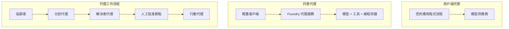
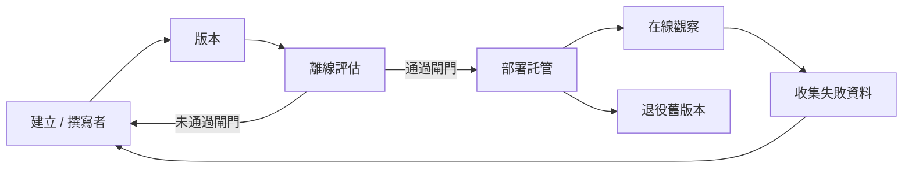
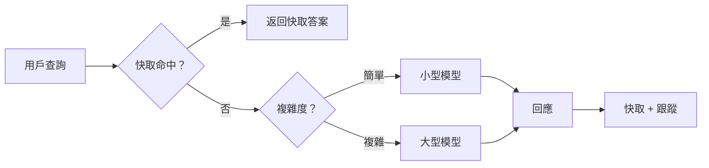
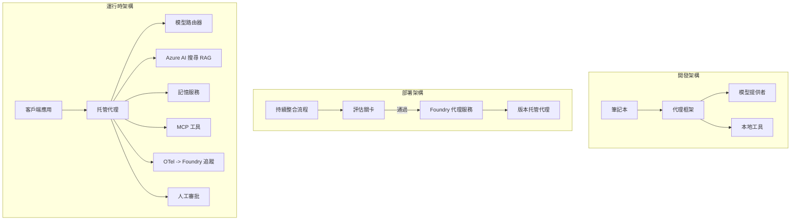

# 使用 Microsoft Foundry 部署可擴展的代理程式


到目前為止，您已經構建了在筆記本內、透過 `az login` 和少數環境變數驅動並運行於筆記本電腦上的代理程式。這確實是學習的正確方式。但這並不是數千名客戶依賴且在凌晨三點仍需運行的代理程式的正確執行方式。

本課程討論「在我的機器上可運行」與「在生產環境中可靠且經濟地運行」之間的差距。我們使用 **Microsoft Foundry** 和 **Microsoft Foundry Agent Service** 來彌補這個差距，並且通過建構一個具備工具、檢索、記憶、評估和監控的真實客戶支援代理程式。

## 簡介

本課程將涵蓋：

- <strong>原型代理</strong> 與 <strong>部署代理</strong> 之間的差異，以及為何轉換主要涉及模型<em>周邊</em>所有內容。
- 代理的 <strong>部署模式</strong>：客戶端承載、服務端承載（托管代理）與工作流程協調。
- Microsoft Foundry 上的 <strong>代理生命週期</strong> — 創建、版本管理、部署、評估、觀察、淘汰。
- <strong>擴展策略</strong>：模型路由、快取、併發與無狀態設計。
- 使用 OpenTelemetry 與 Foundry 追蹤的 <strong>可觀察性</strong>。
- 透過模型選擇、路由與評估門檻進行的 <strong>成本優化</strong>。
- <strong>企業考量</strong>：治理、人類審核及安全執行 MCP 伺服器於生產環境。

## 學習目標

完成本課程後，您將能：

- 為特定代理工作負載選擇適當的部署模式。
- 將代理部署到 Microsoft Foundry Agent Service，使其具備版本管理、治理和可觀察性。
- 為代理加入追蹤並連接一套在每次釋出前執行的評估管線。
- 應用模型路由與快取，以控制大規模的延遲和成本。
- 為高風險操作加入人工審核門檻，並以生產安全方式整合 MCP 伺服器。

## 前置條件

本課程假設您已完成先前課程並熟悉：

- 使用 [Microsoft Agent Framework](../14-microsoft-agent-framework/README.md)（課程 14）構建代理。
- [工具使用](../04-tool-use/README.md)（課程 4）及 [Agentic RAG](../05-agentic-rag/README.md)（課程 5）。
- [代理記憶](../13-agent-memory/README.md)（課程 13）和 [Agentic Protocols / MCP](../11-agentic-protocols/README.md)（課程 11）。
- [可觀察性與評估](../10-ai-agents-production/README.md)（課程 10）— 本課程直接建立於此之上。

您還需要：

- 一個 **Azure 訂閱** 及至少部署一個聊天模型的 **Microsoft Foundry 專案**。
- 已認證的 **Azure CLI** (`az login`)。
- Python 3.12+ 及倉庫中的套件，見 [`requirements.txt`](../../../requirements.txt)。

## 從原型到生產：真正改變的是什麼

原型代理和生產代理共享相同的核心迴圈 — 推理、呼叫工具、回應。變動的是包裹該迴圈的所有周邊。模型可能只占生產代理 20%，其餘 80% 是運營骨架。

| 關注點 | 原型 | 生產 |
| --- | --- | --- |
| <strong>承載</strong> | 在您的筆記本中執行 | 作為托管服務運行，具版本管理和分階段釋出 |
| <strong>身分識別</strong> | 您的 `az login` 令牌 | 具範圍 RBAC 的管理身分識別 |
| <strong>狀態</strong> | 內存中，重啟即失 | 外部化（線程存儲、記憶服務） |
| <strong>故障</strong> | 顯示追蹤回溯 | 重試、備援、死信、警報 |
| <strong>成本</strong> | 「幾分錢」 | 每請求追蹤、路由、快取、預算控制 |
| <strong>品質</strong> | 主觀審視輸出 | 每次釋出前自動評估 |
| <strong>信任</strong> | 您審核每個操作 | 透過政策 + 人工審核高風險操作 |

請記住此表格，下列各節皆對應表中一行內容。

## 代理部署模式

有三種常用模式，通常會組合使用。

### 1. 客戶端承載代理

代理物件存在於<em>您的</em>應用程式進程內。程式碼直接呼叫模型提供者，推理迴圈在您的服務中執行。這是前面課程的常見作法。

- <strong>使用時機</strong> 您需完全掌控迴圈、自訂中介軟體，或把代理嵌入現有後端。
- <strong>取捨</strong>：縮放、狀態與韌性需要自己管理。

### 2. 托管代理（Foundry Agent Service）

代理作為資源<em>註冊於 Microsoft Foundry</em>。Foundry 托管推理迴圈，保存線程，執行內容安全與 RBAC，並在 Foundry 入口網站中展示代理。您的應用程式成為輕量客戶端，負責建立線程與讀取回應。

- <strong>使用時機</strong> 您需要耐久性、內建可觀察性、治理與減少運營面積。
- <strong>取捨</strong>：以托管運行時換取較少底層控制。

### 3. 代理工作流程

多個代理（及工具）合成圖形，具明確控制流程 — 順序步驟、分支、人類審核節點及可暫停恢復的耐久檢查點。這是 Microsoft Agent Framework <strong>工作流程</strong> 功能於部署規模的應用。

- <strong>使用時機</strong> 單一任務涵蓋多個專門代理或中間需要審核步驟。
- <strong>取捨</strong>：更多組件移動；需要編排級別的可觀察性。



## Microsoft Foundry 的代理生命週期

部署代理不是一次性的 `push`，它是個迴圈，看起來很像軟體發行週期，因為它確實就是。



關鍵想法，承自 [課程10](../10-ai-agents-production/README.md)：**離線評估是一道門檻，而非事後補充。** 新代理版本只有通過評估門檻後才會釋出。線上可觀察性將實際故障反饋至離線測試集，形成閉環。

## 擴展策略

擴展代理與擴展無狀態 Web API 不同，因為每個請求可能觸發多個昂貴模型與工具呼叫。四種技術承擔主要負載。

**無狀態請求處理。** 不在進程內存存任何用戶狀態。將對話線程保存於 Foundry 線程庫或記憶服務，讓任一實例都能處理任何請求。此法可水平擴展 — 新增實例，且無需粘性會話。

**模型路由。** 並非每個請求都需使用最強大（也是最昂貴）的模型。將簡單請求（意圖分類、簡短事實答覆）路由至小型快速模型，保留大型模型給真正推理用。Foundry 的 <strong>模型路由器</strong> 可為您完成此事，或您可自建輕量分類器。在實驗中您將構建 DIY 版。

**回應快取。** 許多支援查詢近似重複（「我如何重設密碼？」）。快取常見問題回覆，避免呼叫模型。即使適度快取命中率也能顯著降低成本和延遲。

**併發與背壓。** 模型提供者有限流。限制併發使用，搭配指數退避重試，並優雅失敗（排隊回覆「我們在處理」優於 500 錯誤）。



## 生產環境中的可觀察性

不可見則無法運營。如同課程 10，Microsoft Agent Framework 原生產生 **OpenTelemetry** 追蹤 — 每個模型呼叫、工具調用與編排步驟都是一個跨度。在生產中您輸出這些跨度至 Microsoft Foundry（或任何 OTel 相容後端），以便：

- 端對端追蹤單一客戶投訴橫跨所有模型與工具呼叫。
- 監控 p50/p95 的延遲與每請求成本隨時間變化。
- 在用戶（或財務團隊）察覺前，警示錯誤率激增與成本異常。

```python
from agent_framework.observability import get_tracer

tracer = get_tracer()

with tracer.start_as_current_span("support_request") as span:
    span.set_attribute("customer.tier", "enterprise")
    span.set_attribute("routed.model", "gpt-5-nano")
    # 代理執行會自動在此區間內追蹤
```

屬性如 `customer.tier` 與 `routed.model` 將大量追蹤轉為可答問題的數據（「企業客戶是否過度被分配至小模型？」）。

## 成本優化

產品代理中成本以代幣為主。三大槓桿，依次影響巨大：

1. **合適模型大小。** 通過您的評估門檻的小模型幾乎總比同樣通過的大家伙更便宜。用評估來<em>證明</em>小模型足夠，而非因謹慎就直接選最大模型。
2. **依複雜度路由。** 如上 — 只有需要大型模型推理的請求才使用大型模型。
3. **積極快取。** 最便宜的模型呼叫是您根本不執行的那次。

評估門檻和成本控制是同一紀律的兩面：評估告訴您<em>品質底線</em>，路由和快取讓成本靠近那道底線。

## 企業部署考量

**治理。** 托管代理繼承 Foundry 的 RBAC、內容安全和審計記錄。為每個代理配置最小權限的管理身分識別 — 對知識庫只讀、對工單 API 限定範圍存取，不多一分。

**人類介入。** 部分操作後果過大，不能全自動化 — 發退款、刪除帳號、升級至法務團隊。Microsoft Agent Framework 支援 <strong>需審核</strong> 工具：代理提出動作，執行暫停，人工批准或拒絕，流程恢復。您在 [課程 6](../06-building-trustworthy-agents/README.md) 見過原始實作，本課程部署它。

**生產環境中 MCP。** [MCP](../11-agentic-protocols/README.md) 讓代理透過標準介面使用外部工具。生產環境中，將每個 MCP 伺服器視為不信任邊界：固定伺服器版本、使用範圍限定身分執行、驗證輸出，切勿透露秘密。MCP 伺服器是依賴項，依賴需打補丁、稽核與限流。



這三張圖 — 開發、部署、運行時 — 是同一代理在三個生命階段。隨後的實驗引導您一步步構建。

## 實作實驗：生產級客戶支援代理

開啟 [`code_samples/16-python-agent-framework.ipynb`](./code_samples/16-python-agent-framework.ipynb) 並全程練習。您將組裝一個 **Contoso 客戶支援代理**，涵蓋所有生產議題：

1. <strong>工具呼叫</strong> — 查詢訂單狀態與開啟支援單。
2. **RAG** — 從知識庫（Azure AI Search，另有內存備援以便筆記本在無 Search 資源下執行）回答政策問題。
3. <strong>記憶</strong> — 跨對話輪次記住客戶。
4. <strong>模型路由</strong> — 複雜度分類器將請求路由至小型或大型模型。
5. <strong>回應快取</strong> — 重複問題直接從快取提供答案。
6. <strong>人工審核</strong> — 超出門檻的退款需人工簽核。
7. <strong>評估管線</strong> — 小型離線測試集為代理打分並作為釋出門檻。
8. <strong>可觀察性</strong> — 每個請求搭配 OpenTelemetry 追蹤。

### 操作說明

筆記本組織成每個生產關切點自包含且可執行章節。核心是路由加快取的請求處理器：

```python
async def handle_support_request(query: str, customer_id: str) -> str:
    # 1. 盡可能從緩存提供服務。
    cached = response_cache.get(normalize(query))
    if cached:
        return cached

    # 2. 按複雜度路由以控制成本。
    model = "gpt-5-nano" if is_simple(query) else "gpt-5-mini"

    # 3. 在跟蹤跨度內運行代理以便可觀察性。
    with tracer.start_as_current_span("support_request") as span:
        span.set_attribute("routed.model", model)
        span.set_attribute("customer.id", customer_id)
        response = await support_agent.run(query, model=model)

    # 4. 緩存並返回。
    response_cache.set(normalize(query), response.text)
    return response.text
```

保護發佈門檻的評估看起來如是：

```python
async def evaluation_gate(agent, test_cases, threshold: float = 0.8) -> bool:
    passed = 0
    for case in test_cases:
        result = await agent.run(case["input"])
        if score_response(result.text, case["expected"]) >= 0.8:
            passed += 1
    pass_rate = passed / len(test_cases)
    print(f"Evaluation pass rate: {pass_rate:.0%} (gate: {threshold:.0%})")
    return pass_rate >= threshold  # 只有當閘門通過時才部署
```

仔細閱讀每行 — 筆記本故意將原始構件保持簡單，框架呼叫背後沒有隱藏東西。

## 以冒煙測試驗證已部署代理

上述評估門檻在<em>離線</em>針對代理物件運行。代理一旦部署為托管代理，還需要一個更簡便的檢查：**部署的端點是否真在回應？**

「部署成功」只證明控制平面接受定義，未必證明代理能回應。缺少依賴、模型路由錯誤或連線過期，都可能造成綠燈部署卻不回應。<strong>冒煙測試</strong>能在幾秒內捕捉問題，在每次部署時執行，成本遠低於完整評估。

本倉庫內建了一套可用的冒煙測試管線，基於 [AI Smoke Test](https://github.com/marketplace/actions/ai-smoke-test) GitHub Action：

- <strong>測試庫</strong> — [`tests/lesson-16-smoke-tests.json`](../../../tests/lesson-16-smoke-tests.json) 包含 Contoso 支援代理的提示與斷言（有根據的政策答覆、訂單查詢、保持主題和多輪對話連續性）。其他課程代理的測試庫伴隨其旁 — 請參見 [`tests/README.md`](../tests/README.md)。
- <strong>工作流程</strong> — [`.github/workflows/smoke-test.yml`](../../../.github/workflows/smoke-test.yml) 使用 Azure OIDC 登入並將每個提示 POST 給代理的 Responses 端點，若任何斷言失敗則使作業失敗。

```yaml
- name: Smoke-test hosted agent
  uses: JFolberth/ai-smoketest@v1
  with:
    project_endpoint: ${{ inputs.project_endpoint }}
    agent_name: ContosoSupportAgent
    tests_file: tests/lesson-16-smoke-tests.json
```


在代理部署後，從 **Actions** 標籤執行它，並提供您的 Foundry 專案端點和代理名稱。聯邦身份需在 Foundry 專案範圍內擁有 **Azure AI 用戶** 角色。可以把這些層次想像成金字塔：每次部署時執行煙霧測試（是否可達且有回應？），促銷前執行離線評估（是否足夠好可發布？），持續執行線上評估（實際狀況如何？）。

## 知識測驗

在進入作業前，先測試你的理解程度。

**1. 大致來說，生產代理中「模型」佔多少比例，剩下的是什麼？**

<details>
<summary>答案</summary>

模型是系統中的少數部分 —— 通常約佔 20%。其餘是操作骨架：主機與版本管理、身份與 RBAC、外部化狀態、故障處理、成本追蹤、評估，以及人機迴路控制。上線生產主要是圍繞推理迴路<em>構建</em>所有其它部分。
</details>

**2. 何時會選擇 Hosted Agent 而非客戶端主機代理？**

<details>
<summary>答案</summary>

當你想要有管理式運行時且具備內建耐久性（持續且可恢復的執行緒）、可觀察性、內容安全及 RBAC，並願意犧牲一些推理迴路的低階控制以減少操作範圍時。若你需要完全控制推理迴路或將代理嵌入現有後端，客戶端主機較佳。
</details>

**3. 為何可擴展代理必須在自己的進程記憶體中無狀態？**

<details>
<summary>答案</summary>

如此任何實例都能處理任何請求，這樣才能實現無黏性會話的水平擴展。每個用戶的對話狀態被外部化到執行緒存儲或記憶體服務。如果狀態保存在進程記憶體，重啟時會丟失，且負載無法自由分配。
</details>

**4. 模型路由解決了什麼問題？它與評估有何關聯？**

<details>
<summary>答案</summary>

路由將簡單請求發送到小型、便宜且快速的模型，將大型模型保留給真正的推理，以控制延遲和成本。它與評估相關，因為評估證明了小模型對某類請求足夠好 —— 沒有評估的路由只是猜測。
</details>

**5. 什麼是「評估閘」，它在生命週期中處於何處？**

<details>
<summary>答案</summary>

評估閘會針對新代理版本執行離線測試集，除非通過率達標，否則會阻止部署。它位於生命週期的「版本」與「部署」之間，使品質成為釋出前的先決條件，而不是發布後才檢查。
</details>

**6. 為何 MCP 伺服器在生產環境中需視為不受信任邊界？**

<details>
<summary>答案</summary>

因為它是代理呼叫的外部依賴。你應該鎖定版本，使用範圍限定的身份執行，驗證其輸出，限速，且絕不能將秘密暴露給它 —— 這與你對待任何第三方依賴的態度相同。它的輸出進入代理推理，無驗證的信任會帶來安全風險。
</details>

**7. 哪一個改變通常對生產代理成本影響最大，為何？**

<details>
<summary>答案</summary>

合理大小的模型配置 —— 使用仍能通過評估閘的最小模型。成本主要由 token 數決定，且符合品質標準的小模型幾乎總是比大型模型便宜。快取與路由可以進一步降低成本，但選對底層模型是第一階段最重要的效果。
</details>

**8. 像是 `customer.tier` 及 `routed.model` 這些 span 屬性在可觀察性中扮演什麼角色？**

<details>
<summary>答案</summary>

它們將原始追蹤轉換為可回答的商業問題。沒有屬性時，只是一堆 span；有了屬性，你可以詢問「企業客戶被路由到小模型的機率是否過高？」或「哪個模型處理我們最慢的請求？」。屬性讓你能依重要維度切分遙測數據。
</details>

## 作業

利用實驗室中的客戶支援代理，為特定情境強化它：**訂閱計費支持代理，針對 SaaS 公司。**

你的提交需包含：

1. <strong>將工具</strong>更換為計費相關的：`get_subscription_status`、`get_invoice` 和 `issue_credit`（金額超過 $50 的信用需人工批准）。
2. **加入三份 RAG 文件**，涵蓋公司退費政策、計費週期及取消政策。
3. <strong>擴充評估集</strong> 至至少八個案例，其中至少二個<em>應</em>觸發人工批准路徑，並確認評估閘能正確通過或失敗。
4. <strong>加入一份成本報告</strong>：在代理經過十次混合查詢後，列印多少次發送到小模型，多少次發送到大模型，以及多少次用快取回應。

寫一短段落（markdown 單元），說明你選擇的模型路由規則，以及如何用真實流量驗證。這沒有唯一正確答案 —— 評分重點在於你是否能將生產面向合理結合。

## 小結

本課程中，你實作將代理從原型提升至 Microsoft Foundry 的生產：

- 生產飛躍主要是模型周圍的<strong>操作骨架</strong> —— 主機、身份、狀態、故障處理、成本、品質和信任。
- 你學會三種<strong>部署模式</strong> —— 客戶端主機、Hosted Agents 及 Agent 工作流程，並了解何時適用。
- 你走過了<strong>代理生命週期</strong>，線下<strong>評估扮演釋出閘</strong>，線上可觀察性將失敗反饋進測試集中。
- 你應用了<strong>擴展策略</strong> —— 無狀態設計、模型路由、快取和有界並發，並連結至<strong>成本優化</strong>。
- 你接入了<strong>企業控管</strong>：RBAC、人機迴路批准和生產安全的 MCP 整合。
- 你打造了<strong>量產級客戶支援代理</strong>，將這些關注點整合成可執行程式碼。

下一課將走相反路徑：不是將代理擴展到雲端，而是帶回<em>單一開發者機器</em>，完全本地執行。

## 其他資源

- <a href="https://learn.microsoft.com/azure/ai-foundry/what-is-azure-ai-foundry" target="_blank">Microsoft Foundry 文件</a>
- <a href="https://learn.microsoft.com/azure/ai-foundry/agents/overview" target="_blank">Microsoft Foundry 代理服務概覽</a>
- <a href="https://learn.microsoft.com/en-us/agent-framework/overview/?wt.mc_id=youtube_26688_organicsocial_reactor&pivots=programming-language-python" target="_blank">Microsoft 代理框架</a>
- <a href="https://learn.microsoft.com/azure/ai-foundry/concepts/model-router" target="_blank">Microsoft Foundry 中的模型路由器</a>
- <a href="https://learn.microsoft.com/azure/search/search-what-is-azure-search" target="_blank">Azure AI 搜尋</a>
- <a href="https://opentelemetry.io/" target="_blank">OpenTelemetry</a>
- <a href="https://github.com/marketplace/actions/ai-smoke-test" target="_blank">AI 煙霧測試 GitHub Action</a>
- <a href="https://modelcontextprotocol.io/" target="_blank">模型上下文協定 (MCP)</a>

## 上一課

[建構電腦使用代理 (CUA)](../15-browser-use/README.md)

## 下一課

[創建本地 AI 代理](../17-creating-local-ai-agents/README.md)

---

<!-- CO-OP TRANSLATOR DISCLAIMER START -->
**免責聲明**：
本文件由 AI 翻譯服務 [Co-op Translator](https://github.com/Azure/co-op-translator) 翻譯而成。雖然我們致力於確保準確性，但請注意，機器自動翻譯可能包含錯誤或不準確之處。原始文件的母語版本應被視為權威來源。對於重要資訊，建議進行專業人工翻譯。我們不對因使用本翻譯而產生的任何誤解或誤釋承擔責任。
<!-- CO-OP TRANSLATOR DISCLAIMER END -->