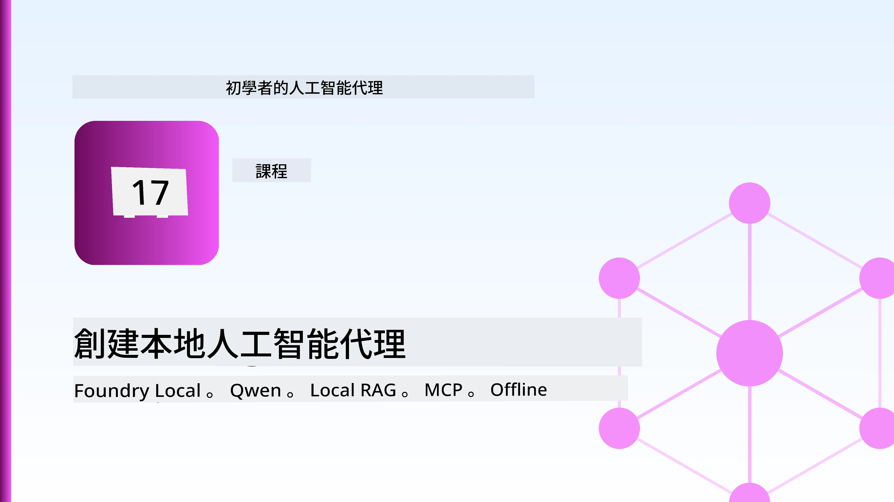
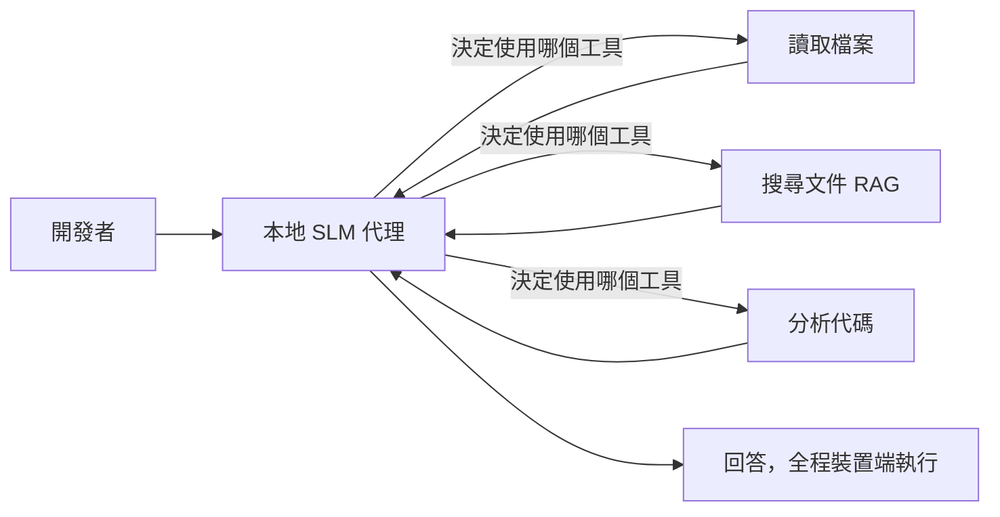
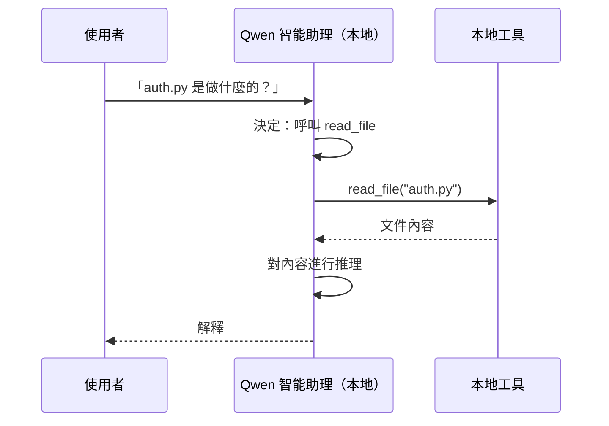
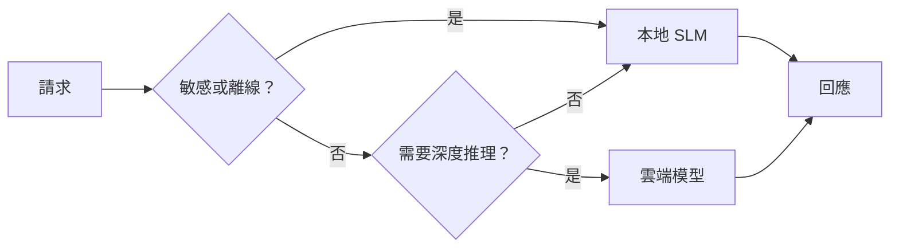

# 使用 Microsoft Foundry Local 和 Qwen 建立本地 AI 代理



上一課將代理擴展到雲端。這一課則是將它們拉回到單一機器上。到最後你將擁有一個能推理、調用工具、讀取文件並搜尋你的文件庫的工程助理——**完全不依賴任何雲端推理呼叫。**

為什麼你會想要這樣做？有三個在實際工程工作中經常遇到的理由：

- **隱私。** 程式碼和文件永遠不會離開機器。沒有提示詞、片段或客戶資料會穿越網絡邊界。
- **成本。** 本地推理不會有每個字元的計費。你可以全天迭代，只需負擔電費。
- **離線。** 在飛機上、在安全設施中或停電時，代理仍能運作。

其中的挑戰是你用一個前沿雲端模型換成了運行在 CPU、GPU 或 NPU 上的<strong>小型語言模型（SLM，Small Language Model）</strong>。本課將專注於在這種限制條件下建造「表現良好」的代理，而不是假裝這限制不存在。

## 介紹

本課涵蓋內容：

- **小型語言模型 (SLMs)**：它們是什麼、適合用在哪裡、不適合在哪裡。
- **Microsoft Foundry Local**：一款在設備上下載並服務模型，透過<strong>OpenAI 兼容 API</strong>的運行時框架。
- **Qwen 函數調用模型**：支援穩定生成工具調用的小型語言模型，使本地代理（不只是本地聊天）成為可能。
- **本地工具、本地 RAG 和本地 MCP**：在無雲端的條件下賦能代理。
- <strong>混合模式</strong>：何時保持本地、何時接入雲端。

## 學習目標

完成本課後，你將能：

- 解釋 SLM 的權衡並選擇合適的本地代理使用案例。
- 使用 Foundry Local 在本地部署 Qwen 模型，並透過 OpenAI 兼容端點連接。
- 建立一個完全運行於你工作站的工具調用代理。
- 利用本地向量資料庫（Chroma）為你的文件加本地 RAG。
- 連接代理到本地 MCP 伺服器，並思考本地/雲端混合設計。

## 前置條件

本課假設你已完成以往課程並熟悉以下內容：

- [工具使用](../04-tool-use/README.md)（第 4 課）和 [Agentic RAG](../05-agentic-rag/README.md)（第 5 課）。
- [Agentic 協議 / MCP](../11-agentic-protocols/README.md)（第 11 課）。
- [Microsoft Agent Framework](../14-microsoft-agent-framework/README.md)（第 14 課）。

你還需要：

- 一台開發工作站。**8GB RAM 是現實最低需求**；16GB 以上更舒適。GPU 或 NPU 幫助加速，但非必需。
- 安裝 **Microsoft Foundry Local**（見以下安裝章節）。
- Python 3.12 以上版本與本倉庫 [`requirements.txt`](../../../requirements.txt) 中的套件，以及本課所用的 `foundry-local-sdk`、`openai` 和 `chromadb`。

## 小型語言模型：本地工作的合適工具

前沿雲端模型有數千億參數且後方有大型資料中心。SLM 有幾十億參數，需要放入你的筆記型電腦的 RAM。這一差異設定了明確的期望。

**SLMs 擅長：**

- 結構化、有界任務——分類、抽取、已知文件的摘要。
- <strong>工具調用</strong>——決定呼叫哪個函數及其參數。
- 對自己的數據進行快速、廉價且私密的迭代。

**SLMs 較弱：**

- 開放式、多跳推理且跨越大範圍上下文。
- 廣泛的世界知識（看到的資料較少，且更容易忘記）。

因此，本地代理的贏家策略是：**讓 SLM 來協調，讓工具來做繁重工作。** 模型不需要<em>知道</em>你的程式碼庫，它只需知道何時呼叫 `read_file` 和 `search_docs`。這正符合 SLM 的強項。



## Microsoft Foundry Local

**Microsoft Foundry Local** 是一個輕量級運行時，能在你的機器上下載、管理和服務模型。我們最重視的功能是它暴露了<strong>OpenAI 兼容的 HTTP 端點</strong>——這意味著 OpenAI SDK 和 Microsoft Agent Framework 的 OpenAI 用戶端只需改變 `base_url`，即可對它工作。你在建立代理時所學的一切直接遷移；唯一變動是端點從雲端轉到 `localhost`。

Foundry Local 也會自動根據你的硬體選擇模型的最佳版本——CPU 版本、CUDA/GPU 版本或 NPU 版本——因此你不必為每台機器手動優化。

### 安裝設定

安裝 Foundry Local（參考你的作業系統的[文件](https://learn.microsoft.com/azure/ai-foundry/foundry-local/)），然後確認其正常運行：

```bash
# 安裝（例如；請參考你平台的文件）
winget install Microsoft.FoundryLocal      # Windows
# brew install microsoft/foundrylocal/foundrylocal   # macOS

# 下載並運行 Qwen 模型，然後啟動本地服務
foundry model run qwen2.5-7b-instruct
foundry service status
```

服務啟動後，你便有了一個本地的 OpenAI 兼容端點（通常是 `http://localhost:PORT/v1`）。筆記本用 `foundry-local-sdk` 自動發現端點，無需你手動寫死端口號。

## Qwen 函數調用：為何重要

代理之所以是代理，是因為它能呼叫工具。許多 SLM 可聊天但生產不可靠、格式錯誤的工具調用。**Qwen** 模型針對函數調用做過訓練，能穩定地產生格式良好的工具調用結構——這正是把本地聊天模型轉為本地<em>代理</em>的關鍵。

流程是你熟悉的標準工具調用迴圈，只是都在設備上運行：



## 本地 RAG

文件搜尋是本地代理展現價值的地方。不是靠 SLM 記憶你的框架文件，而是把文件嵌入成<strong>本地向量資料庫</strong>，讓代理按需檢索相關片段。

我們使用 **Chroma**，這是個嵌入式向量庫，與主程式同進程執行，無伺服器管理。整個流程全在本地：本地嵌入模型 → 本地向量 → 本地檢索 → 本地 SLM。


這是第 5 課的 Agentic RAG 模式——改變是每個元件都運行於你的機器上。

## 本地 MCP 伺服器

[MCP](../11-agentic-protocols/README.md) 是一種傳輸協議，而非雲服務。MCP 伺服器可以作為本地進程運行於 `stdio`，透過標準協議將工具暴露給代理。這讓你能離線重用不斷成長的 MCP 伺服器生態系——如檔案系統存取、git 操作、資料庫查詢。

安全架構與雲端不同，但並非不存在：本地 MCP 伺服器仍以用戶權限執行，因此要限制其可存取範圍（例如針對一個專案目錄，不是整個主目錄）並將其輸出視為輸入進行驗證。

## 混合雲端與本地模式

本地優先不代表只能本地。成熟系統根據敏感度與難度作路由：

| 狀況 | 執行地點 |
| --- | --- |
| 敏感程式碼/數據，或離線時 | **本地 SLM** |
| 簡單且有界的任務 | **本地 SLM**（便宜且快速） |
| 在非敏感數據上的複雜多跳推理 | <strong>雲端模型</strong> |
| 任何情況，停電期間 | **本地 SLM**（優雅降級） |

這與第 16 課的<strong>模型路由</strong>概念相符——差別在於現在「模型」之一是你自己的機器。穩健設計是在雲端不可用時回退至本地，令代理表現降級而非完全失效。



## 實作練習：本地工程助理

打開 [`code_samples/17-local-agent-foundry-local.ipynb`](./code_samples/17-local-agent-foundry-local.ipynb) 並跟著做。你將建立一個完全在工作站上運行的<strong>本地工程助理</strong>，能：

1. <strong>調用工具</strong>——通過 Foundry Local 中的 Qwen 函數調用。
2. <strong>執行本地文件操作</strong>——列出及讀取專案目錄的文件。
3. <strong>分析程式碼</strong>——報告源文件的基本指標。
4. <strong>搜尋文件</strong>——利用 Chroma 對文檔目錄執行本地 RAG。
5. **使用 MCP**——連接到本地 MCP 伺服器（如未設定則優雅跳過）。

任何時候都不使用雲端推理。

### 示範解說

助理通過 OpenAI 兼容端點連接 Foundry Local，因此代理程式碼與雲端課程幾乎一模一樣——唯有用戶端改變：

```python
from foundry_local import FoundryLocalManager
from openai import OpenAI

# Foundry Local 會發現/下載模型，並提供本地端點。
manager = FoundryLocalManager(\"qwen2.5-7b-instruct\")
client = OpenAI(base_url=manager.endpoint, api_key=manager.api_key)  # api_key 是本地佔位符
```

工具是作用於專案目錄的普通 Python 函數：

```python
def read_file(path: str) -> str:
    \"\"\"Read a file, but only inside the sandboxed project directory.\"\"\"
    full = (PROJECT_ROOT / path).resolve()
    if PROJECT_ROOT not in full.parents and full != PROJECT_ROOT:
        return \"Access denied: path is outside the project directory.\"
    return full.read_text(encoding=\"utf-8\")
```

注意沙箱檢查——即使是本地，能讀取任意路徑的工具仍是不安全的。筆記本將每個工具限制於單一專案根目錄。

## 知識測驗

在進入作業前測試你的理解。

**1. 舉出兩個將代理運行於本地而非雲端的具體理由。**

<details>
<summary>答案</summary>

任選兩項：<strong>隱私</strong>（程式碼與數據不離機）、<strong>成本</strong>（無每字元推理費用）、<strong>離線能力</strong>（無網絡也能工作——飛機上、安全設施或停電時）。監管/合規限制禁止將資料發送出設備是推動隱私理由的常見因素。
</details>

**2. 本地代理中 SLM 與工具的推薦分工是什麼？為什麼？**

<details>
<summary>答案</summary>

讓 SLM <strong>協調</strong>（決定調用哪個工具及參數），讓<strong>工具完成繁重部分</strong>（讀取文件、檢索文檔、計算結果）。SLM 擅長做有界的決策如工具選擇，但在廣泛知識與長多跳推理上較弱，依賴工具能發揮其強項。
</details>

**3. 是什麼讓我們能用 Foundry Local 重用雲端代理程式碼？**

<details>
<summary>答案</summary>

Foundry Local 暴露一個<strong>OpenAI 兼容的 HTTP 端點</strong>。OpenAI SDK 和 Agent Framework 的 OpenAI 用戶端只需改變 `base_url`（並使用本地假 API key）即可，因此代理程式碼的其他部分保持不變。
</details>

**4. 為何我們特別使用 Qwen 函數調用模型而非任意 SLM？**

<details>
<summary>答案</summary>

因為代理必須產生可靠且格式良好的<strong>工具調用</strong>。許多 SLM 能聊天卻生成格式錯誤或不一致的工具調用結構。Qwen 模型為函數調用訓練，產生穩定的一致工具調用，這使本地聊天模型成為有效的代理。
</details>

**5. 本地 RAG 流程中，哪些元件在機器上運行？**

<details>
<summary>答案</summary>

全部：嵌入模型、向量資料庫（Chroma，存在磁碟上）、檢索步驟與 SLM。文件在本地嵌入、儲存、檢索，且由本地模型推理——無任何元件觸及雲端。
</details>

**6. 本地 MCP 伺服器運行於你的機器上。這是否自動代表它安全？你應該採取什麼預防？**

<details>
<summary>答案</summary>

不代表。因為它以你的用戶權限執行，能存取你能存取的任何東西。應限制其存取範圍（如只針對單一專案目錄，而非整個主目錄），且將其輸出視為輸入驗證後再行動。
</details>

**7. 描述包含本地模型的合理混合路由規則。**

<details>
<summary>答案</summary>

將敏感或離線請求路由至本地 SLM；將簡單有界任務路由到本地 SLM 以節省成本並加速；將對非敏感數據的困難多跳推理路由到雲端模型；在雲端不可用時回退至本地 SLM，以讓代理優雅降級而非失效。這是模型路由（第 16 課）概念，機器作為其中一個模型。
</details>

**8. 執行本課本地代理的現實最低 RAM 數值是多少？多 RAM 有何優勢？**

<details>
<summary>答案</summary>

約 **8 GB** 是現實最低需求；16 GB 以上更舒適。更多 RAM 讓你能執行更大更強的模型並保留更多上下文於記憶體中。GPU 或 NPU 加速推理，但非必需——當無加速器可用時，Foundry Local會自動選擇 CPU 版本。
</details>

## 作業

把本地工程助理擴充成一個<strong>本地文件審查員</strong>，用於你選擇的小型專案（如果想，可以用本倉庫的課程資料夾）。

你的提交內容應包含：

1. 對真實的文件/程式碼資料夾建立 Chroma 索引（至少五個文件）。
2. 新增一個 `find_todos` 工具，用於掃描專案中的 `TODO`/`FIXME` 註解，回傳包含文件名與行號——並保持與 `read_file` 同樣的沙箱限制。

3. <strong>問代理人三個問題</strong>，迫使它結合工具：一個純 RAG 問題、一個需要閱讀特定文件的問題，以及一個需要尋找 TODO 的問題。
4. <strong>測量它</strong>：計時這三個回應的時間，並在 markdown 儲存格中記錄。評論延遲是否符合您預期的工作流程。

然後寫一小段說明<strong>您會將哪些部分移到雲端，哪些會保留在本地</strong>給這個審閱者，並說明原因。評估標準是本地組件是否正確接線以及混合推理是否合理—不是模型品質。

## 摘要

在這堂課中，您建立了一個完全在自己機器上運行的代理人：

- **SLMs** 在隱私、成本和離線操作上以廣度交換—當它們<strong>協調工具</strong>而非自身承載全部知識時發揮優勢。
- **Foundry Local** 在裝置上提供模型服務，支援<strong>OpenAI 相容端點</strong>，使您的雲端代理程式碼只需一行修改即可轉移。
- **Qwen 函數調用模型** 使本地穩定呼叫工具以及本地<em>代理人</em>成為可能。
- **本地 RAG** （Chroma）和<strong>本地 MCP</strong> 在機器內為代理人提供能力。
- <strong>混合模式</strong> 讓您根據敏感度和難度路由，使用本地作優雅的備援方案。

這完成了部署弧線：第 16 課將代理人擴展至 Microsoft Foundry，本課則縮減至單一工作站。下一課將探討如何保持部署後代理人的安全。

## 附加資源

- <a href="https://learn.microsoft.com/azure/ai-foundry/foundry-local/" target="_blank">Microsoft Foundry Local 文件</a>
- <a href="https://learn.microsoft.com/azure/ai-foundry/what-is-azure-ai-foundry" target="_blank">Microsoft Foundry 文件</a>
- <a href="https://learn.microsoft.com/en-us/agent-framework/overview/?wt.mc_id=youtube_26688_organicsocial_reactor&pivots=programming-language-python" target="_blank">Microsoft Agent Framework</a>
- <a href="https://qwen.readthedocs.io/en/latest/framework/function_call.html" target="_blank">Qwen 函數調用文件</a>
- <a href="https://modelcontextprotocol.io/" target="_blank">模型上下文協定 (MCP)</a>
- <a href="https://docs.trychroma.com/" target="_blank">Chroma 向量資料庫</a>

## 上一課

[部署可擴展代理人](../16-deploying-scalable-agents/README.md)

## 下一課

[保障 AI 代理人安全](../18-securing-ai-agents/README.md)

---

<!-- CO-OP TRANSLATOR DISCLAIMER START -->
**免責聲明**：
本文件由 AI 翻譯服務 [Co-op Translator](https://github.com/Azure/co-op-translator) 翻譯而成。雖然我們致力於確保準確性，但請注意，機器自動翻譯可能包含錯誤或不準確之處。原始文件的母語版本應被視為權威來源。對於重要資訊，建議進行專業人工翻譯。我們不對因使用本翻譯而產生的任何誤解或誤釋承擔責任。
<!-- CO-OP TRANSLATOR DISCLAIMER END -->