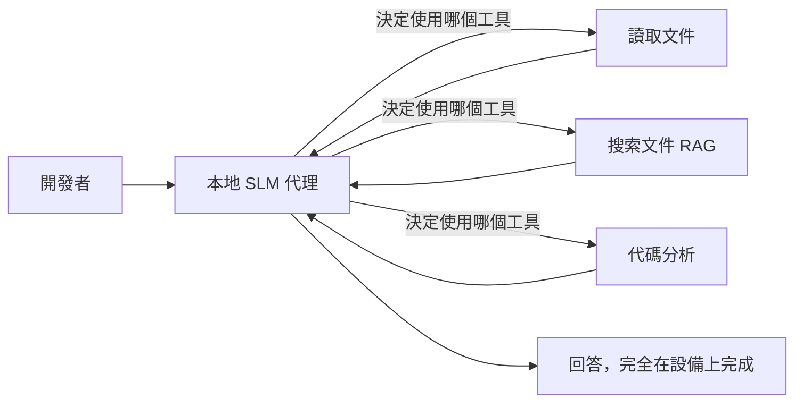
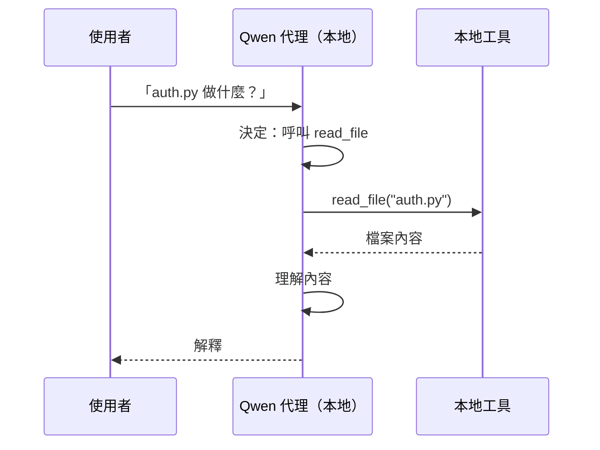
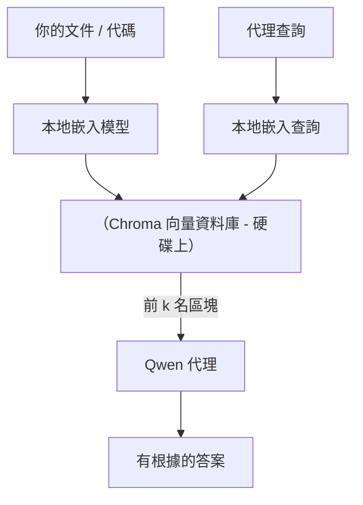
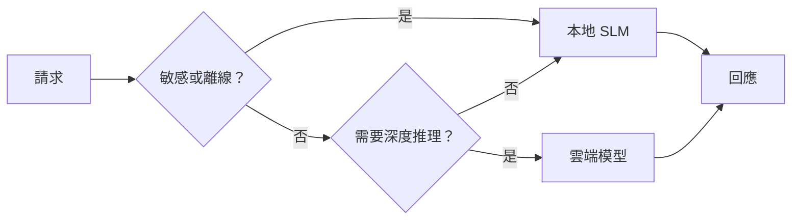

# 使用 Microsoft Foundry Local 及 Qwen 建立本地 AI 代理


上一課將代理擴展到雲端。本課將它們帶回單一機器。完成後，你將擁有一個可運作的工程助理，它能推理、呼叫工具、讀取你的檔案以及搜尋你的文件 — **完全不須任何雲端推論呼叫。**

為甚麼你會需要這樣？在真實工程工作中，經常會遇上三個原因：

- **隱私。** 代碼和文件永遠不會離開這台機器。沒有提示、沒有代碼段、沒有客戶資料會跨越網絡邊界。
- **成本。** 本地推論沒有每個字元的計費。你可以無限次迭代，只需支付電費。
- **離線。** 在飛機上、在安全設施內或停電期間，代理依然可運作。

限制是你將最先進的雲端模型換成在 CPU、GPU 或 NPU 上執行的<strong>小型語言模型 (SLM)</strong>。本課聚焦於在此限制內建立<em>良好</em>的代理，而非假裝這限制不存在。

## 介紹

本課將涵蓋：

- **小型語言模型 (SLMs)** — 它們是什麼、擅長在哪裡、不擅長在哪裡。
- **Microsoft Foundry Local** — 一個在設備上下載並執行模型的輕量運行時，透過<strong>OpenAI相容 API</strong>提供服務。
- **Qwen 函數呼叫模型** — 可靠產生工具呼叫的 SLM，使得本地 <em>代理</em>（不只是本地聊天）成為可能。
- **本地工具、本地 RAG 以及本地 MCP** — 賦予代理無需雲端的功能。
- <strong>混合模式</strong> — 何時保持本地，何時連至雲端。

## 學習目標

完成本課後，你將知道如何：

- 解釋 SLM 的權衡，並選擇適合本地代理的使用案例。
- 利用 Foundry Local 在本地提供 Qwen 模型，並透過 OpenAI 相容的端點連接。
- 建立一個完全在你工作站上執行的工具呼叫代理。
- 使用本地向量資料庫 (Chroma) 在你的文件上添加本地 RAG。
- 連接代理到本地 MCP 伺服器，並理解混合本地/雲端設計。

## 先決條件

本課假設你已完成先前課程，並熟悉：

- [工具使用](../04-tool-use/README.md)（第4課）和 [Agentic RAG](../05-agentic-rag/README.md)（第5課）。
- [Agentic 協議 / MCP](../11-agentic-protocols/README.md)（第11課）。
- [Microsoft 代理框架](../14-microsoft-agent-framework/README.md)（第14課）。

你還需要：

- 一台開發工作站。**8 GB RAM 是現實的最低要求**；16 GB 以上更為舒適。有 GPU 或 NPU 會有幫助，但非必須。
- 已安裝 **Microsoft Foundry Local**（請參閱以下設定部分）。
- Python 3.12+ 以及本倉庫 [`requirements.txt`](../../../requirements.txt) 中的套件，加上本課需要的 `foundry-local-sdk`、`openai` 和 `chromadb`。

## 小型語言模型：本地工作的合適工具

最先進的雲端模型擁有數千億參數和資料中心支撐。SLM 則有數十億參數，且必須能裝載在筆電 RAM 中。此差異設定了明確預期。

**SLM 擅長：**

- 結構化、有界任務 — 分類、抽取、已知文件的摘要。
- <strong>工具呼叫</strong> — 決定呼叫哪個函數及其參數。
- 針對自己的資料快速、便宜、私密反覆迭代。

**SLM 較弱：**

- 開放式、多跳推理於大型上下文。
- 廣泛的世界知識（見識較少且容易遺忘）。

所以，對本地代理的成功策略是：**讓 SLM 負責協調，讓工具執行繁重工作。** 模型不需<em>知道</em>你的程式碼庫 — 它只需知道何時呼叫 `read_file` 及 `search_docs`。這正好發揮 SLM 的強項。



## Microsoft Foundry Local

**Microsoft Foundry Local** 是一個輕量級運行時，完全在你的機器上下載、管理、服務模型。它最重要的功能是提供<strong>OpenAI相容 HTTP 端點</strong> — 意味著 OpenAI SDK 和 Microsoft 代理框架的 OpenAI 用戶端僅需更改 `base_url` 即可使用。你學過的所有代理開發知識直接遷移；唯一不同是端點從雲端換成了 `localhost`。

Foundry Local 還會自動選擇最佳的模型建置版本，符合你的硬體 — CPU 版、CUDA/GPU 版或 NPU 版 — 無需你針對每台機器手動優化。

### 安裝設定

安裝 Foundry Local（請參閱你的作業系統的[文件](https://learn.microsoft.com/azure/ai-foundry/foundry-local/)），然後確認其運作：

```bash
# 安裝（例子；請依照你平台的文件操作）
winget install Microsoft.FoundryLocal      # Windows（視窗系統）
# brew install microsoft/foundrylocal/foundrylocal   # macOS（蘋果作業系統）

# 下載並執行 Qwen 模型，然後啟動本地服務
foundry model run qwen2.5-7b-instruct
foundry service status
```

服務運行後，你就擁有一個本地 OpenAI 相容端點（通常是 `http://localhost:PORT/v1`）。此 notebook 使用 `foundry-local-sdk` 自動發現端點，無需硬編碼端口。

## Qwen 函數呼叫：重要性分析

一個代理只有能呼叫工具才是真正的代理。許多 SLM 能聊天，但產生不穩定、格式錯誤的工具呼叫。**Qwen** 模型專門訓練函數呼叫，能穩定產生格式正確的工具呼叫結構 — 這正是讓本地聊天模型變成本地<em>代理</em>的關鍵。

流程是你已熟悉的標準工具呼叫迴圈，只是現在在設備上執行：



## 本地 RAG

文件搜尋是本地代理發揮價值的關鍵。你不必指望 SLM 記住你的框架文件，而是將文件嵌入到<strong>本地向量資料庫</strong>，讓代理按需檢索相關片段。

我們使用 **Chroma**，一個嵌入式向量存儲，不需伺服器管理且在同一進程運行。流程完全本地：本地嵌入模型 → 本地向量 → 本地檢索 → 本地 SLM。



這是第5課 Agentic RAG 的相同模式 — 唯一改變的是所有元件都運行在你的機器上。

## 本地 MCP 伺服器

[MCP](../11-agentic-protocols/README.md) 是一種通訊協定，不是雲端服務。MCP 伺服器可以作為本地進程在 `stdio` 上運行，透過標準協定向你的代理暴露工具。這讓你可以離線重用越來越多的 MCP 伺服器生態系統 — 檔案系統存取、git 操作、資料庫查詢。

安全狀況與雲端不同，但不表示無風險：本地 MCP 伺服器仍以你的用戶權限運行，所以範圍需限制在它能接觸的內容（專案目錄，而非整個家目錄），且其輸出應視為輸入加以驗證。

## 混合雲端與本地模式

本地優先不表示僅限本地。成熟系統會依敏感度和難度導向：

| 情況 | 執行位置 |
| --- | --- |
| 敏感代碼/資料，或離線狀態 | **本地 SLM** |
| 簡單、有界任務 | **本地 SLM**（便宜、快速） |
| 非敏感資料的複雜多跳推理 | <strong>雲端模型</strong> |
| 任何情況，停機時 | **本地 SLM**（平滑降級） |

這與第16課的<strong>模型路由</strong>概念相呼應 — 差別在於“模型”之一是你的本機。一個健壯設計在雲端不可用時回退至本地，使代理品質下降而非完全失效。



## 實作練習：本地工程助理

開啟 [`code_samples/17-local-agent-foundry-local.ipynb`](./code_samples/17-local-agent-foundry-local.ipynb) 並實作。你將建立一個<strong>完全在你的工作站運行的本地工程助理</strong>，它可以：

1. <strong>呼叫工具</strong> — 透過 Foundry Local 的 Qwen 函數呼叫。
2. <strong>執行本地檔案操作</strong> — 列表並讀取專案目錄中的檔案。
3. <strong>分析代碼</strong> — 報告原始碼檔案的基本指標。
4. <strong>搜尋文件</strong> — 利用 Chroma 在本地文件夾上做 RAG。
5. **使用 MCP** — 連接本地 MCP 伺服器（若未設定則優雅跳過）。

整個過程不使用任何雲端推論。

### 詳細步驟解析

助理透過 OpenAI 相容端點連接 Foundry Local，所以代理程式碼幾乎與雲端課程相同 — 唯一變動是客戶端：

```python
from foundry_local import FoundryLocalManager
from openai import OpenAI

# Foundry Local 發現/下載模型，並提供本地端點給我們。
manager = FoundryLocalManager(\"qwen2.5-7b-instruct\")
client = OpenAI(base_url=manager.endpoint, api_key=manager.api_key)  # api_key 是本地佔位符
```

工具是普通的 Python 函數，限制在專案目錄：

```python
def read_file(path: str) -> str:
    \"\"\"Read a file, but only inside the sandboxed project directory.\"\"\"
    full = (PROJECT_ROOT / path).resolve()
    if PROJECT_ROOT not in full.parents and full != PROJECT_ROOT:
        return \"Access denied: path is outside the project directory.\"
    return full.read_text(encoding=\"utf-8\")
```

注意沙盒檢查 — 即使是本地，一個可讀取任意路徑的工具也是風險。此 notebook 將所有工具限制在單一專案根目錄範圍內。

## 知識檢測

在進入作業前測試你的理解。

**1. 舉出兩個將代理部署於本地而非雲端的具體理由。**

<details>
<summary>答案</summary>

任兩項：<strong>隱私</strong>（代碼和數據不離開機器）、<strong>成本</strong>（無字元推論計費），及<strong>離線功能</strong>（無網絡時仍能運作 — 如飛機上、安檢區或停電期間）。監管/合規限制禁止將資料送出是隱私理由的常見驅動。
</details>

**2. 在本地代理中，建議 SLM 與工具間的勞動分配是什麼？為什麼？**

<details>
<summary>答案</summary>

讓 SLM <strong>協調</strong>（決定呼叫哪個工具及參數），讓<strong>工具負責繁重工作</strong>（讀檔案、檢索文件、計算結果）。SLM 擅長有界決策如工具選擇，但對廣泛知識和多跳推理較弱，因而依賴工具發揮其優勢。
</details>

**3. 是什麼使你能用 Foundry Local 重用雲端代理程式碼？**

<details>
<summary>答案</summary>

Foundry Local 暴露<strong>OpenAI相容 HTTP 端點</strong>。OpenAI SDK 和代理框架的 OpenAI 用戶端只需更改 `base_url`（並使用本地占位 API 金鑰）即可對其操作。代理程式碼其他部分不需變動。
</details>

**4. 為何我們特地用 Qwen 函數呼叫模型，而非任一 SLM？**

<details>
<summary>答案</summary>

因為代理必須產生可靠且格式正確的<strong>工具呼叫</strong>。許多 SLM 能聊天，但產生的工具呼叫結構格式錯誤或不一致。Qwen 模型經函數呼叫訓練，能穩定產生工具呼叫，這是使本地聊天模型成為可用代理的關鍵。
</details>

**5. 在本地 RAG 流程中，哪些元件在本機執行？**

<details>
<summary>答案</summary>

全部：嵌入模型、向量資料庫（Chroma，持久於磁碟）、檢索步驟及 SLM。文件本地嵌入、儲存、檢索及本地模型推理 — 沒有任何元件接觸雲端。
</details>

**6. 本地 MCP 伺服器在你的機器上運行，是否即代表安全？你應該採取甚麼預防措施？**

<details>
<summary>答案</summary>

不是。本地 MCP 伺服器以你的用戶權限運行，能存取你可及的所有資源。應限制其範圍（如僅單一專案目錄而非整個家目錄），並將其輸出視為輸入加以驗證後再使用。
</details>

**7. 請描述包含本地模型的合理混合路由規則。**

<details>
<summary>答案</summary>

將敏感或離線請求導向本地 SLM；簡單有界任務導向本地 SLM，因速度與成本考量；複雜多跳推理（非敏感資料）導向雲端模型；雲端不可用時回退本地 SLM，讓代理優雅降級而非失敗。這是第16課模型路由的概念，本地機器即為其中一個模型。
</details>

**8. 執行本課本地代理的現實最低 RAM 需求是？增加 RAM 有何用處？**

<details>
<summary>答案</summary>

約 **8 GB** 是現實最低要求；16 GB 以上更舒適。更多 RAM 讓你能運行更大、更強的模型，並在記憶體中維持更多上下文。GPU 或 NPU 會加速推論，但非必須 — Foundry Local 會在無加速器時選用 CPU 版本。
</details>

## 作業

將本地工程助理擴展成一個<strong>本地文件審查助理</strong>，針對你選擇的小型專案（也可使用本倉庫任一 lesson 資料夾）。

你需要提交：

1. **將真實文件/代碼資料夾編入 Chroma（至少五個檔案）。**
2. **新增一個 `find_todos` 工具，掃描專案中的 `TODO`/`FIXME` 註解，並回傳檔案與行號，且同樣進行沙盒檢查如同 `read_file`。**

3. <strong>問代理三個問題</strong>，迫使它結合工具：一個純 RAG 問題、一個需要閱讀特定檔案的問題，以及一個需要尋找 TODO 的問題。
4. <strong>測量它</strong>：對這三個回答分別計時並記錄在 markdown 儲存格中。評論延遲是否符合你預期的工作流程。

然後寫一個簡短段落說明你會將什麼移至雲端、什麼保留在本地以供此審查員使用，以及原因。評估重點在於本地元件是否正確串接，以及混合推理是否合理 — 而非模型品質。

## 總結

在本課中，你建立了一個完全在你自己的機器上運行的代理：

- **SLM** 以隱私、成本和離線運作換取廣度 — 並在它們 <strong>協調工具</strong> 而非自帶所有知識時表現出色。
- **Foundry Local** 於設備上以 **與 OpenAI 相容的端點** 提供模型，因此你的雲端代理代碼只需一行變更即可轉移。
- **Qwen 函數呼叫模型** 使得可靠的本地工具呼叫—因而本地 <em>代理</em> — 成為可能。
- **本地 RAG**（Chroma）和 **本地 MCP** 賦予代理在不離開機器的情況下的能力。
- <strong>混合模式</strong> 讓你可依敏感度和難易度進行路由，並以本地作優雅的後備。

這完成了部署弧線：第16課將代理規模擴展至 Microsoft Foundry，本課則將其縮小至單一工作站。下一課將轉向保持部署代理的安全。

## 額外資源

- <a href="https://learn.microsoft.com/azure/ai-foundry/foundry-local/" target="_blank">Microsoft Foundry Local 文件</a>
- <a href="https://learn.microsoft.com/azure/ai-foundry/what-is-azure-ai-foundry" target="_blank">Microsoft Foundry 文件</a>
- <a href="https://learn.microsoft.com/en-us/agent-framework/overview/?wt.mc_id=youtube_26688_organicsocial_reactor&pivots=programming-language-python" target="_blank">Microsoft 代理框架</a>
- <a href="https://qwen.readthedocs.io/en/latest/framework/function_call.html" target="_blank">Qwen 函數呼叫文件</a>
- <a href="https://modelcontextprotocol.io/" target="_blank">模型上下文協議 (MCP)</a>
- <a href="https://docs.trychroma.com/" target="_blank">Chroma 向量資料庫</a>

## 前一課

[部署可擴展代理](../16-deploying-scalable-agents/README.md)

## 下一課

[保護 AI 代理](../18-securing-ai-agents/README.md)

---

<!-- CO-OP TRANSLATOR DISCLAIMER START -->
**免責聲明**：
本文件由 AI 翻譯服務 [Co-op Translator](https://github.com/Azure/co-op-translator) 翻譯而成。雖然我們致力於確保準確性，但請注意，機器自動翻譯可能包含錯誤或不準確之處。原始文件的母語版本應被視為權威來源。對於重要資訊，建議進行專業人工翻譯。我們不對因使用本翻譯而產生的任何誤解或誤釋承擔責任。
<!-- CO-OP TRANSLATOR DISCLAIMER END -->