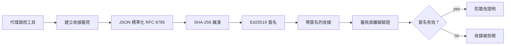
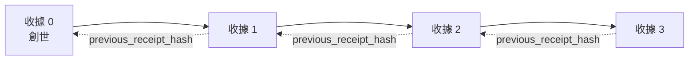

[觀看課程影片：使用加密收據保護 AI 代理人](https://youtu.be/PLACEHOLDER_VIDEO_ID)

> _(課程影片和縮圖將由微軟內容團隊於合併後新增，符合第 14 / 15 課的模式。)_

# 使用加密收據保護 AI 代理人

## 介紹

本課程將涵蓋：

- 為什麼 AI 代理人的稽核軌跡對合規、除錯及信任很重要。
- 什麼是加密收據，以及它與未簽名日誌行的差異。
- 如何用純 Python 產生代理人工具呼叫的簽名收據。
- 如何離線驗證收據並偵測篡改。
- 如何串連收據，使移除或重新排序其中一項會破壞整個鏈條。
- 收據能證明什麼，以及它明確無法證明什麼。

## 學習目標

完成本課程後，你將能夠：

- 辨識驅動代理人行為需要加密溯源的失效模式。
- 對標準化 JSON 輸出產生 Ed25519 簽名的收據。
- 使用唯有簽署者公鑰即可獨立驗證收據。
- 透過重新驗證修改過的收據檔案來偵測篡改。
- 建立雜湊鍊結的收據序列並解釋該鏈的重要性。
- 了解收據能證明（歸屬、完整性、排序）與無法證明（行動正確性、政策合理性）之間的界限。

## 問題：你的代理人稽核軌跡

想像你已為 Contoso Travel 部署了一個 AI 代理人。該代理人閱讀客戶請求，呼叫航班 API 查詢選項，並代表客戶訂位。上一季度，如此代理人處理了 50,000 筆訂位。

今天，一名稽核員來訪。他們問了一個簡單問題：「請展示你的代理人做了什麼。」

你交出你的日誌檔案。稽核員查看後問更難的問題：「我怎麼知道這些日誌沒有被修改過？」

這就是稽核軌跡問題。現今多數代理人部署依賴：

- <strong>應用程式日誌</strong>：由代理人自行撰寫，任何有檔案系統權限的人都能編輯。
- <strong>雲端日誌服務</strong>：在平台層級有篡改證據，但只有稽核員信任平台運營商時成立。
- <strong>資料庫交易日誌</strong>：適合資料庫變更，卻不適合任意工具呼叫。

這些都無法在不要求稽核員信任你、你的雲端提供商或資料庫廠商的情況下回答問題。對內部而言，這種信任通常可接受。對受到管制的工作負載（金融、醫療、受歐盟 AI 法規約束）則不然。

加密收據透過使每個代理人行動獨立可驗證解決此問題。稽核員不必信任你，他們只需你的公鑰和收據本身。

## 什麼是加密收據？

收據是一個 JSON 物件，記錄代理人做了什麼，並以數位簽章簽署。



一個最小收據長這樣：

```json
{
  "type": "agent.tool_call.v1",
  "agent_id": "contoso-travel-bot",
  "tool_name": "lookup_flights",
  "tool_args_hash": "sha256:a3f9c1...",
  "result_hash": "sha256:7b2e1d...",
  "policy_id": "contoso-travel-policy-v3",
  "timestamp": "2026-04-25T14:30:00Z",
  "sequence": 47,
  "previous_receipt_hash": "sha256:9d4e6a...",
  "signature": {
    "alg": "EdDSA",
    "sig": "c5af83...",
    "public_key": "8f3b2c..."
  }
}
```

三個屬性發揮關鍵作用：

1. <strong>簽名</strong>。收據由代理人閘道使用 Ed25519 私鑰簽署。擁有相對應公鑰的任何人皆能離線驗證簽章。任何欄位修改都使簽名失效。

2. <strong>標準化編碼</strong>。簽署前，收據以 JSON Canonicalization Scheme (JCS, RFC 8785) 序列化。此法保證兩個實作產生相同邏輯收據會有位元組完全相同的輸出。若不標準化，不同 JSON 序列器會造成同內容有不同簽名。

3. <strong>雜湊鏈結</strong>。`previous_receipt_hash` 欄位將每個收據串聯到前一個。移除或重新排序收據會破壞其後所有收據。即使單一簽名被繞過，篡改仍在鏈階層顯現。

這些屬性共同提供三項保證：

- <strong>歸屬</strong>：特定金鑰簽署此內容。
- <strong>完整性</strong>：內容自簽署起未被修改。
- <strong>排序</strong>：此收據在鏈中位於該收據之後。

## 在 Python 中產生收據

你不需要特殊函式庫來產生收據。加密原語廣泛可用，邏輯只有數十行 Python。

`code_samples/18-signed-receipts.ipynb` 的實作練習演示完整流程。總結版如下：

```python
import json
import hashlib
import base64
from nacl import signing
from jcs import canonicalize  # RFC 8785 規範 JSON

def b64url_nopad(data: bytes) -> str:
    return base64.urlsafe_b64encode(data).decode("ascii").rstrip("=")

def sha256_canonical(obj) -> str:
    """SHA-256 of a Python object's JCS-canonical JSON form."""
    return f"sha256:{hashlib.sha256(canonicalize(obj)).hexdigest()}"

# 產生或載入簽署金鑰（生產環境中，存放在金鑰保管庫）
signing_key = signing.SigningKey.generate()
verify_key = signing_key.verify_key

# 建立收據負載（尚未簽名）
tool_args = {"origin": "SYD", "destination": "LAX"}
tool_result = [{"flight": "QF11", "price": 1850, "stops": 0}]

payload = {
    "type": "agent.tool_call.v1",
    "agent_id": "contoso-travel-bot",
    "tool_name": "lookup_flights",
    "tool_args_hash": sha256_canonical(tool_args),
    "result_hash": sha256_canonical(tool_result),
    "policy_id": "contoso-travel-policy-v3",
    "timestamp": "2026-04-25T14:30:00Z",
    "sequence": 0,
    "previous_receipt_hash": None,
}

# 規範化、雜湊、簽署。
canonical_bytes = canonicalize(payload)
message_hash = hashlib.sha256(canonical_bytes).digest()
signature_bytes = signing_key.sign(message_hash).signature

# 附加結構化簽名物件。
receipt = {
    **payload,
    "signature": {
        "alg": "EdDSA",
        "sig": b64url_nopad(signature_bytes),
        "public_key": b64url_nopad(bytes(verify_key)),
    },
}
```

這就是整個簽署流程。筆記本中的練習會引導你逐步執行。

## 驗證收據與偵測篡改

驗證是反向操作：

```python
import base64
import hashlib
from nacl import signing
from nacl.exceptions import BadSignatureError
from jcs import canonicalize

def b64url_decode(s: str) -> bytes:
    padding = "=" * ((4 - len(s) % 4) % 4)
    return base64.urlsafe_b64decode(s + padding)

def verify_receipt(receipt: dict) -> bool:
    # 簽名是一個結構化對象：{"alg", "sig", "public_key"}。
    sig_obj = receipt.get("signature")
    if not sig_obj or sig_obj.get("alg") != "EdDSA":
        return False

    # 重建實際簽署的有效負載（除簽名外的所有部分）。
    payload = {k: v for k, v in receipt.items() if k != "signature"}

    canonical_bytes = canonicalize(payload)
    message_hash = hashlib.sha256(canonical_bytes).digest()

    try:
        verify_key = signing.VerifyKey(b64url_decode(sig_obj["public_key"]))
        verify_key.verify(message_hash, b64url_decode(sig_obj["sig"]))
        return True
    except BadSignatureError:
        return False
```

此函式接收一個收據，若簽名有效則返回 `True`，否則回傳 `False`。無需網路呼叫，無服務依賴，不需信任第三方。

若要實際見識篡改偵測，筆記本演示：

1. 產生有效收據並確認驗證通過。
2. 修改 `tool_args_hash` 欄位的其中一個位元組。
3. 重新驗證，看到驗證失敗。

這是收據能夠篡改證明的實際示範：任何微小修改都會破壞簽名。

## 為多步驟代理人串連收據鏈

單一簽署收據保護一次行動。收據鏈保護一連串行動。



每個收據記錄前一筆收據的雜湊。若攻擊者想悄悄刪除收據 2，他必須：

- 修改收據 3 的 `previous_receipt_hash` 欄位（會破壞收據 3 的簽名），或者
- 對修改過的收據 3 偽造新簽章（需要代理人的私鑰）。

若私鑰存於硬體金鑰保管庫，而你且隨每筆收據公布公鑰，兩種攻擊皆無法不被偵測。

筆記本示範：

1. 建立包含三筆收據的鏈。
2. 驗證每筆收據的 `previous_receipt_hash` 與前一筆實際雜湊比對正確。
3. 篡改中間一筆收據並觀察鏈條於該點破裂。

如此你就能產生一條讓外部稽核員在不信任你的前提下仍可驗證的稽核軌跡。

## 收據能證明什麼（與不能證明什麼）

這是本課最重要的章節。收據功能強大，但其能耐有限。

**收據證明三項：**

1. <strong>歸屬</strong>：特定金鑰簽署了特定負載。
2. <strong>完整性</strong>：負載自簽名後未被更動。
3. <strong>排序</strong>：此收據在雜湊鏈中位於該收據之後。

**收據不證明：**

1. <strong>正確性</strong>：代理人行為是否正確。收據同樣能乾淨地簽署錯誤回應。
2. <strong>政策合規</strong>：`policy_id` 中的政策是否真正被評估，或若檢查將允許此動作。收據紀錄的是聲明，不是執行結果。
3. <strong>金鑰以外的身份</strong>：收據表明「此金鑰簽署此內容」，不意味「此人授權」。將金鑰對應人或組織需另行身份基礎設施（目錄、公開金鑰登錄等）。
4. <strong>輸入真實性</strong>：若代理人接收造假的提示並據此行動，收據忠實記錄行為。收據是輸入驗證的下游，不是其替代。

此界線有兩個重要原因：

- 告訴你收據實用於何：使代理人行為可稽核並有篡改證據，甚至跨機構。
- 告訴你需哪些額外層次：輸入驗證（第 6 課）、政策執行（下述略提）、身份基礎設施（本課不涵蓋）。

常見誤解是以為「有收據」等同「被治理」，並非如此。收據是基礎，治理是建造在其上的系統。

## 生產環境參考

本課 Python 程式碼刻意精簡，方便你逐行閱讀完全理解。生產環境可有兩種選擇：

1. **直接在加密原語上打造。** 如上約 50 行程式碼已符合多數需求。PyNaCl (Ed25519) 與 `jcs` 套件（標準化 JSON）為維護良好且經過稽核的函式庫。

2. **使用生產用收據函式庫。** 多個開源案例如下，實作同模式附加額外功能（金鑰輪替、批次驗證、JWK 集分發、政策引擎整合）：
   - 本課所用收據格式遵循一項 IETF 網際網路草案（`draft-farley-acta-signed-receipts`）且正進入標準流程。
   - Microsoft Agent Governance Toolkit 與基於 Cedar 的政策決策合成收據；參見該庫中 Tutorial 33，內含端對端範例。
   - `protect-mcp`（npm）與 `@veritasacta/verify`（npm）套件實作 Node 環境下收據簽署與離線驗證，適合為任何 MCP 伺服器加裝有篡改證據稽核軌跡。

自行開發或採用函式庫的決策，類似於你選擇自寫 JWT 函式庫或使用經過驗證的函式庫：兩者合理；使用函式庫節省時間並降低稽核面；自行編寫則強迫你學會每種原語。此課教授自寫路徑，讓你有能力選擇任一方式。

## 知識測驗

開始練習前，先自我測試理解程度。

**1. 收據以代理人私鑰 Ed25519 簽署；稽核員只有公鑰。稽核員能離線驗證收據嗎？**

<details>
<summary>答案</summary>

能。Ed25519 驗證只需公鑰與被簽資料。不須網路呼叫或第三方服務。此特性使收據適用於網路隔離、多組織或低信任稽核環境。
</details>

**2. 攻擊者修改收據的 `policy_id` 欄位，聲稱適用更寬鬆政策。簽名是原始負載所簽。驗證時會怎樣？**

<details>
<summary>答案</summary>

驗證失敗。簽署是在原始負載的標準化字節上計算；修改任意欄位會改變字節，導致 SHA-256 雜湊與簽名均不符。攻擊者需私鑰製造新的有效簽名，但他們無此私鑰。
</details>

**3. 為什麼收據包含 `tool_args_hash` 與 `result_hash` 而非未加工的參數和結果？**

<details>
<summary>答案</summary>

有兩點原因。首先，收據可能需在不容許洩漏原始內容（個人資料、商業機密）的狀況被存檔或傳送。雜湊使收據保持精簡且保密，稽核員檢查雜湊是否匹配另行儲存的真實內容。其次，雜湊有固定大小，無論輸入輸出多大，加雜湊收據大小均受限。
</details>

**4. `previous_receipt_hash` 欄位將每筆收據鏈結到前一筆。若攻擊者悄悄刪除鏈中一筆收據，會導致什麼失效？**

<details>
<summary>答案</summary>

所有刪除點之後的收據均失效。它們的 `previous_receipt_hash` 已不符真實鏈結（因為被參考的收據已不存在，或鏈指向了不同前序）。要隱藏刪除，攻擊者須對後續所有收據重新簽署，這需私鑰。
</details>

**5. 收據驗證通過代表什麼？是否證明代理人行為正確、合理或符合法規？**

<details>
<summary>答案</summary>

不代表。有效收據證明三件事：歸屬（此金鑰簽署此內容）、完整性（內容未修改）以及排序（此收據在該收據之後）。它不證明行為正確、`policy_id` 所標示政策是否評估過，或代理人是否遵守所有規則。收據讓代理人行為可被稽核，但不必然正確。這是課程最重要的界線。
</details>

## 練習任務

開啟 `code_samples/18-signed-receipts.ipynb`，完成全部四節：

1. **第 1 節**：簽署第一張收據並驗證。
2. **第 2 節**：竄改收據並觀察驗證失敗。
3. **第 3 節**：建立三筆收據鏈並驗證鏈的完整性。
4. **第 4 節**：將此模式應用於基於 Microsoft Agent Framework 的代理人：在工具呼叫中加入收據簽署，再獨立驗證該收據。

<strong>挑戰加碼 1：</strong>新增自己選擇的欄位（例如，用於追蹤的請求 ID）到收據結構，更新標準簽署邏輯將其納入，並確認收據能完整通過簽署與驗證流程。簽署完成後再修改此欄位，並驗證會失敗。此挑戰促使你理解標準編碼中每一字節如何影響簽名。
**挑戰任務 2：** 將兩張收據的 SHA-256 雜湊值結合（以確定性順序串連它們的標準字節）並將結果的摘要嵌入第三張收據作為新字段，再對其進行簽名。驗證三張收據仍可雙向轉換。你剛建立了一步包含證明：持有第三張收據的任何人都能證明前兩張收據於簽署時存在，無需揭露其內容。這就是選擇性披露收據在大規模使用的模式（Merkle 承諾，RFC 6962）。

## 結論

加密收據為 AI 代理提供了以下的審計蹤跡：

- <strong>獨立可驗證</strong>：任何持有公鑰的方均可驗證，無需依賴服務。
- <strong>防篡改</strong>：任何修改皆會使簽名失效。
- <strong>可攜帶</strong>：收據為小型 JSON 文件，可存檔、傳輸及隨處驗證。
- <strong>符合標準</strong>：基於 Ed25519（RFC 8032）、JCS（RFC 8785）及 SHA-256，皆為廣泛部署的基元。

它們並非輸入驗證、政策執行或身份架構的替代品，而是這些層級的基礎。當你將代理部署於受監管的工作負載、多組織流程或任何無法假定未來稽核者信任你的環境時，收據是讓審計蹤跡誠實可靠的方式。

最重要的重點是：收據證明誰於何時說了什麼。它們不證明所說內容的真實性或正確性。牢牢區分這一點，這是誠實來源系統與誤導性系統的差異。

## 生產應用檢查清單

當你準備從本課程畢業並部署簽收收據的代理於實際環境時：

- [ ] **將簽名金鑰移出開發者筆電。** 使用 Azure Key Vault、AWS KMS 或硬體安全模組。簽署收據的私鑰絕不可存於原始碼控制或應用機器的明文中。
- [ ] **發布驗證公鑰。** 稽核者需離線驗證。標準模式是於知名 URL 發布 JWK 集（RFC 7517），例如 `https://your-org.example.com/.well-known/agent-keys.json`。
- [ ] **外部錨定鏈條。** 定期將最新鏈頭雜湊寫入透明日誌（Sigstore Rekor、RFC 3161 時戳機構或第二套內部系統），讓外部方能確認「該鏈條於此時存在」。
- [ ] **不可變存儲收據。** 附加式 Blob 存儲（Azure 儲存搭配不可變性政策，AWS S3 物件鎖定）防止內部人員在存儲層改寫歷史。
- [ ] **決定保留期限。** 許多合規要求多年度保留。規劃收據成長（每張收據約 500 字節；代理每日 1 萬次呼叫約產生每年 1.8 GB）。
- [ ] **記錄收據未涵蓋範圍。** 收據證明歸屬、完整性及排序。你的運行手冊應明確列出收據治理機制以外的額外控管（輸入驗證、政策執行、速率限制、身份基礎設施）。

### 想知道更多如何保障 AI 代理？

加入 [Microsoft Foundry Discord](https://aka.ms/ai-agents/discord) 與其他學習者交流，參加問答時間，獲取 AI 代理相關疑問解答。

## 超越本課程

本課程涵蓋單收據簽署及雜湊鏈序列。相同基元可構建出你在治理成熟時可能遇到的進階模式：

- **選擇性披露。** 當收據字段獨立承諾（RFC 6962 風格 Merkle 樹）時，你可以向特定稽核者揭露特定字段，並證明其餘未被修改，且不暴露內容。適用於同一收據須滿足完整審核（需完整性）與如 GDPR 之數據最小化規範（二者稽核者需閱覽最少）場景。
- **收據撤銷。** 若簽名金鑰外洩，你需能標示該金鑰簽署的所有收據自某時點起不再可信。標準模式為：短期簽名金鑰加已發布撤銷清單，或帶撤銷條目的透明日誌。
- **雙方/分割簽名收據。** 部分實作將簽名負載分成執行前（`authorization_*`）及執行後（`result_*`）兩部分獨立簽名，適用於授權決策與觀察結果由不同角色或不同時間產生。此方式可累加於本課程教授的收據格式上。
- **負載組合。** 收據封印你放入 `result_hash` 的任何字節。實務負載通常比單純工具呼叫結果更豐富：事前決策推理（模型預測、考慮選項、證據及其完備性、風險狀況、責任鏈、門控結果）均可包含其中，由單一收據封印。此方式保持收據格式簡潔，且讓負載架構可隨領域演進。
- **跨實作相容性。** 多個實作（Python、TypeScript、Rust、Go）互相驗證同一收據格式的測試向量。若你自行實作，與公開向量比對確認線路相容性。
- **後量子遷移。** Ed25519 廣泛部署但非量子抗性。收據格式具算法靈活性：`signature.alg` 欄位可攜帶 `ML-DSA-65`（NIST 後量子簽名標準），便於未來遷移。需規劃雙簽時期。

## 額外資源

- <a href="https://datatracker.ietf.org/doc/draft-farley-acta-signed-receipts/" target="_blank">IETF Internet-Draft：用於機器對機器存取控制的簽名決策收據</a>
- <a href="https://learn.microsoft.com/azure/ai-studio/responsible-use-of-ai-overview" target="_blank">負責任 AI 概述（Azure AI）</a>
- <a href="https://datatracker.ietf.org/doc/html/rfc8032" target="_blank">RFC 8032：愛德華曲線數位簽章算法（EdDSA）</a>
- <a href="https://datatracker.ietf.org/doc/html/rfc8785" target="_blank">RFC 8785：JSON 標準化方案（JCS）</a>
- <a href="https://datatracker.ietf.org/doc/html/rfc6962" target="_blank">RFC 6962：證書透明度</a>（選擇性披露收據所用的 Merkle 樹結構）
- <a href="https://github.com/microsoft/agent-governance-toolkit/blob/main/docs/tutorials/33-offline-verifiable-receipts.md" target="_blank">Microsoft 代理治理工具包，教學 33：離線可驗證決策收據</a>
- <a href="https://github.com/ScopeBlind/agent-governance-testvectors" target="_blank">本課程所用收據格式跨實作相容測試向量（Apache-2.0）</a>
- <a href="https://pynacl.readthedocs.io/" target="_blank">PyNaCl 文件（Python 中的 Ed25519）</a>

## 前一課程

[建構電腦使用代理（CUA）](../15-browser-use/README.md)

## 下一課程

_(由課程維護者決定)_

---

<!-- CO-OP TRANSLATOR DISCLAIMER START -->
**免責聲明**：
本文件由 AI 翻譯服務 [Co-op Translator](https://github.com/Azure/co-op-translator) 翻譯而成。雖然我們致力於確保準確性，但請注意，機器自動翻譯可能包含錯誤或不準確之處。原始文件的母語版本應被視為權威來源。對於重要資訊，建議進行專業人工翻譯。我們不對因使用本翻譯而產生的任何誤解或誤釋承擔責任。
<!-- CO-OP TRANSLATOR DISCLAIMER END -->