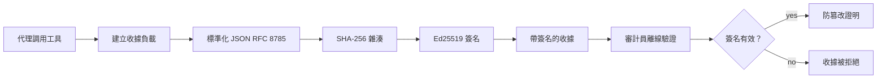
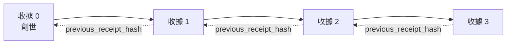

[觀看課程影片：使用加密收據保障 AI 代理的安全](https://youtu.be/PLACEHOLDER_VIDEO_ID)

> _(課程影片及縮圖將由 Microsoft 內容團隊於合併後依照課程 14 / 15 樣式新增。)_

# 使用加密收據保障 AI 代理的安全

## 介紹

本課程將涵蓋：

- 為甚麼 AI 代理的審計追蹤對合規、除錯和信任很重要。
- 什麼是加密收據，以及它與未簽署的日誌行有何不同。
- 如何使用純 Python 為代理的工具呼叫製作簽署收據。
- 如何離線驗證收據並偵測竄改。
- 如何鏈接收據，使刪除或重新排序其中一個收到會破壞整個鏈條。
- 收據能證明什麼，以及它明確不證明什麼。

## 學習目標

完成本課程後，您將知道如何：

- 確認促使代理動作加密來源的失效模式。
- 生成對典範 JSON 負載進行 Ed25519 簽署的收據。
- 僅使用簽署者的公開金鑰獨立驗證收據。
- 透過重新驗證已修改的收據，偵測竄改。
- 建立雜湊鏈式的收據序列並說明該鏈的意義。
- 辨識收據能證明（歸屬、完整性、排序）與不能證明（行為正確性、政策合理性）之間的界線。

## 問題：您的代理審計追蹤

想像您已部署一個 Contoso Travel 的 AI 代理。該代理讀取客戶請求，呼叫航班 API 查詢選項，並替客戶訂位。上季度，代理處理了 50,000 筆訂位。

今天，一位稽核員來到。他們問一個簡單的問題：「請展示代理做了什麼。」

您交出日誌檔案。稽核員查看後問更難的問題：「我如何知道這些日誌沒有被編輯過？」

這就是審計追蹤的問題。大多數代理部署目前依賴：

- <strong>應用程式日誌</strong>：由代理本身寫入，任何有檔案系統存取權的人都能編輯。
- <strong>雲端日誌服務</strong>：在平台層面防竄改，但前提是稽核員信任平台營運者。
- <strong>資料庫交易日誌</strong>：適合記錄資料庫變更，但不適用於任意工具呼叫。

這些方法都無法在不要求稽核員信任特定對象（您、您的雲端服務商、資料庫供應商）的前提下回答稽核員的問題。對內部使用，這種信任通常可接受，但對受管制工作負載（金融、醫療，或受 EU AI Act 管制），則不可。

加密收據透過令每個代理動作可獨立驗證來解決此問題。稽核員不必信任您，只需要您的公開金鑰和收據本身。

## 什麼是加密收據？

收據是一個 JSON 物件，記錄代理執行的動作，並使用數位簽章簽署。



一個最簡收據長這樣：

```json
{
  "type": "agent.tool_call.v1",
  "agent_id": "contoso-travel-bot",
  "tool_name": "lookup_flights",
  "tool_args_hash": "sha256:a3f9c1...",
  "result_hash": "sha256:7b2e1d...",
  "policy_id": "contoso-travel-policy-v3",
  "timestamp": "2026-04-25T14:30:00Z",
  "sequence": 47,
  "previous_receipt_hash": "sha256:9d4e6a...",
  "signature": {
    "alg": "EdDSA",
    "sig": "c5af83...",
    "public_key": "8f3b2c..."
  }
}
```

三個屬性在發揮作用：

1. <strong>簽章</strong>。收據由代理閘道使用 Ed25519 私鑰簽署。持有相對應公開金鑰者可以離線驗證簽章。竄改任一欄位會使簽章失效。

2. <strong>典範編碼</strong>。簽署前，收據使用 JSON 典範化規範（JCS，RFC 8785）序列化。這確保兩個執行相同邏輯的實作產生位元組完全相同的輸出。沒有典範化，使用不同 JSON 編碼器會對相同內容產生不同簽章。

3. <strong>雜湊鏈式連結</strong>。`previous_receipt_hash` 欄位將每個收據與之前一個鏈接。刪除或重新排序收據會破壞之後所有收據。即使個別簽章被繞過，鏈條層級也能檢測竄改。

這三者共構三項保證：

- <strong>歸屬</strong>：此金鑰簽署了此內容。
- <strong>完整性</strong>：內容自簽署後未被更動。
- <strong>排序</strong>：此收據在鏈中位於那筆收據之後。

## 在 Python 中製作收據

製作收據不需特別函式庫。加密基元廣泛可用，程式邏輯只有幾十行 Python。

`code_samples/18-signed-receipts.ipynb` 筆記本有詳細操作步驟。摘要版本：

```python
import json
import hashlib
import base64
from nacl import signing
from jcs import canonicalize  # RFC 8785 標準 JSON

def b64url_nopad(data: bytes) -> str:
    return base64.urlsafe_b64encode(data).decode("ascii").rstrip("=")

def sha256_canonical(obj) -> str:
    """SHA-256 of a Python object's JCS-canonical JSON form."""
    return f"sha256:{hashlib.sha256(canonicalize(obj)).hexdigest()}"

# 產生或載入簽名密鑰（生產環境中，存放於金鑰保管庫）
signing_key = signing.SigningKey.generate()
verify_key = signing_key.verify_key

# 建立收據資料（尚未簽名）
tool_args = {"origin": "SYD", "destination": "LAX"}
tool_result = [{"flight": "QF11", "price": 1850, "stops": 0}]

payload = {
    "type": "agent.tool_call.v1",
    "agent_id": "contoso-travel-bot",
    "tool_name": "lookup_flights",
    "tool_args_hash": sha256_canonical(tool_args),
    "result_hash": sha256_canonical(tool_result),
    "policy_id": "contoso-travel-policy-v3",
    "timestamp": "2026-04-25T14:30:00Z",
    "sequence": 0,
    "previous_receipt_hash": None,
}

# 標準化、雜湊、簽名。
canonical_bytes = canonicalize(payload)
message_hash = hashlib.sha256(canonical_bytes).digest()
signature_bytes = signing_key.sign(message_hash).signature

# 附加結構化簽名物件。
receipt = {
    **payload,
    "signature": {
        "alg": "EdDSA",
        "sig": b64url_nopad(signature_bytes),
        "public_key": b64url_nopad(bytes(verify_key)),
    },
}
```

這就是整個簽署流程。筆記本中有逐步說明。

## 驗證收據與偵測竄改

驗證為相反作業：

```python
import base64
import hashlib
from nacl import signing
from nacl.exceptions import BadSignatureError
from jcs import canonicalize

def b64url_decode(s: str) -> bytes:
    padding = "=" * ((4 - len(s) % 4) % 4)
    return base64.urlsafe_b64decode(s + padding)

def verify_receipt(receipt: dict) -> bool:
    # 簽名是一個結構化物件：{"alg", "sig", "public_key"}。
    sig_obj = receipt.get("signature")
    if not sig_obj or sig_obj.get("alg") != "EdDSA":
        return False

    # 重建實際被簽署的有效負載（除了簽名之外的所有內容）。
    payload = {k: v for k, v in receipt.items() if k != "signature"}

    canonical_bytes = canonicalize(payload)
    message_hash = hashlib.sha256(canonical_bytes).digest()

    try:
        verify_key = signing.VerifyKey(b64url_decode(sig_obj["public_key"]))
        verify_key.verify(message_hash, b64url_decode(sig_obj["sig"]))
        return True
    except BadSignatureError:
        return False
```

此函數接收收據，若簽章有效回傳 `True`，否則 `False`。不需連網，無服務依賴，不用信任第三方。

演示竄改偵測，筆記本示範：

1. 製作有效收據並確認可驗證。
2. 修改 `tool_args_hash` 欄位一個位元組。
3. 重新驗證並出錯。

這就是收據防竄改的實務證明：任何細微修改都會使簽章失效。

## 為多步驟代理鏈接收據

單一簽署收據保障一個動作，一串收據保障一系列動作。



每張收據記錄前一收據的雜湊。若攻擊者靜默刪除第 2 張收據，必需：

- 修改第 3 張收據的 `previous_receipt_hash` 欄位（導致第 3 張簽章失效），或
- 偽造修改後第 3 張收據的新簽章（需代理私鑰）。

若私鑰存於硬體金鑰保管庫並且隨收據公開公鑰，這兩種攻擊都無法不被察覺。

筆記本示範：

1. 建立三張收據的鏈。
2. 驗證每張收據的 `previous_receipt_hash` 是否與先前收據的實際雜湊相符。
3. 竄改中間一張收據，觀察鏈條在該點斷裂。

這就是如何產生讓外部稽核員無須信任您即可驗證的審計追蹤。

## 收據能證明什麼（不能證明什麼）

這是本課程最重要的部分。收據強大，但其能力有限度。

**收據證明三件事：**

1. <strong>歸屬</strong>：特定金鑰簽署特定負載。
2. <strong>完整性</strong>：負載自簽署後未改變。
3. <strong>排序</strong>：此收據在雜湊鏈中位於另一收據之後。

**收據不證明：**

1. <strong>正確性</strong>：代理動作是否正確。收據可簽署錯誤結果，與正確結果同等乾淨。
2. <strong>政策合規</strong>：`policy_id` 指涉的政策是否有實際評估，或若評估會否允許此動作。收據記錄聲明內容，不代表執行結果。
3. <strong>超越金鑰的身份</strong>：收據說「此金鑰簽署此內容」，不代表「此人授權」。連結金鑰與個人或組織須另有身份基礎建設（例如目錄、公鑰註冊等）。
4. <strong>輸入真實性</strong>：代理若收到被操作的提示後行動，收據忠實記錄動作。收據在輸入驗證之外，非替代。

此界線重要，因為：

- 它告訴你收據有何用途：使代理行為可審計、防竄改，跨組織也行。
- 它讓你知道還需什麼額外層級：輸入驗證（第 6 課）、政策執行（以下簡述）、身份基礎建設（本課無涉）。

常見錯誤是假設「有收據」等於「有治理」。非也。收據是基礎。治理是你建置的系統。

## 產業參考

本課程 Python 程式碼刻意精簡，讓您可逐行理解流程。上線時，有兩個選擇：

1. **直接建立於加密基元上。** 上述 50 行程式碼足以支持許多用例。PyNaCl（Ed25519）和 `jcs` 套件（典範 JSON）是維護良好且經審核的函式庫。

2. **使用生產收據函式庫。** 多個開源專案實作相同模式，且提供額外功能（密鑰輪替、批次驗證、JWK 集分發、政策引擎整合）：
   - 本課使用的收據格式遵循 IETF 草案 (`draft-farley-acta-signed-receipts`)，正走向標準化。
   - Microsoft Agent Governance Toolkit 將收據與基於 Cedar 的政策決策合成；請參閱該庫中的教程 33 取得端對端範例。
   - `protect-mcp` (npm) 與 `@veritasacta/verify` (npm) 提供 Node 實作，針對 MCP 伺服器包裝防竄改審計追蹤。
   - **[nobulex](https://github.com/arian-gogani/nobulex)** Python SDK (`pip install nobulex`) 在 Python 中實現相同 Ed25519 + JCS 簽署模式，並整合 LangChain、CrewAI，含跨驗證測試向量與透過 [OWASP PR #2210](https://github.com/OWASP/CheatSheetSeries/pull/2210) 的合規映射。

自行實作與使用函式庫的抉擇，類似撰寫自家 JWT 函式庫或用經過測試的函式庫：兩者皆可；函式庫省時且減少審查風險；自行實作強迫你理解每個基元。本課教從零開始的方法，為您的雙向選擇打下基礎。

## 知識小測

在進入練習題前，測試您的理解。

**1. 收據由代理的 Ed25519 私鑰簽署。稽核員只有公開金鑰。稽核員能離線驗證收據嗎？**

<details>
<summary>答案</summary>

能。Ed25519 驗證只需公開金鑰和簽署後的位元組資料。無需網路呼叫，也無服務依賴。這使得收據在隔離、跨組織或低信任稽核場景中非常有用。
</details>

**2. 攻擊者修改收據的 `policy_id` 欄位，宣稱由更寬鬆政策治理。簽章是原始有效負載的。驗證會怎樣？**

<details>
<summary>答案</summary>

驗證失敗。簽章是針對負載的典範化位元組計算；修改任一欄位改變典範位元組，繼而改變 SHA-256 雜湊，使簽章無效。攻擊者須有私鑰才能重新簽署有效收據，然而並無此密鑰。
</details>

**3. 為何收據包含 `tool_args_hash` 和 `result_hash`，而非原始參數與結果？**

<details>
<summary>答案</summary>

有兩個原因。首先，收據可能需在不允許洩漏原始內容（PII、商業資料）的環境中存檔或傳送。雜湊保持收據尺寸小且隱藏內容；稽核員可驗證雜湊與另存的實際資料吻合。其次，雜湊有固定大小，不論輸入輸出多大，收據大小有界。
</details>

**4. `previous_receipt_hash` 連結每張收據與前一張。若攻擊者靜默刪除鏈中間某張收據，何者變無效？**

<details>
<summary>答案</summary>

刪除後所有後續收據的連結都無效。它們的 `previous_receipt_hash` 不再符合實際鏈（因為被引用的收據不存在、或鏈指向不同前一節點）。若要隱藏刪除，攻擊者必須重新簽署所有後續收據，需有私鑰。
</details>

**5. 收據驗證通過，是否證明代理動作正確、合理或遵守政策？**

<details>
<summary>答案</summary>

不。有效收據證明三件事：歸屬（此金鑰簽此內容）、完整性（內容不變）、排序（此收據在另一收據之後）。它不證明動作正確，或 `policy_id` 指定之政策有被評估，或代理遵守所有規則。收據使代理行為可審計，未必代表正確。這是課程中最重要的界線。
</details>

## 練習題

開啟 `code_samples/18-signed-receipts.ipynb`，完成以下四個部分：

1. <strong>第一部分</strong>：簽署第一張收據並驗證。
2. <strong>第二部分</strong>：竄改收據並觀察驗證失敗。
3. <strong>第三部分</strong>：建立三張收據的鏈並驗證鏈完整性。
4. <strong>第四部分</strong>：將此模式應用於使用 Microsoft Agent Framework 建立的代理：將工具呼叫包裹在收據簽署，然後獨立驗證收據。
**延伸挑戰 1：** 在收據結構中擴展一個你自訂的欄位（例如，用於追蹤的請求 ID），更新規範簽章邏輯以包含此欄位，並確認收據仍可透過驗證完整往返。接著在簽名後修改該欄位，並確認驗證失敗。這迫使你理解規範編碼的每個位元如何影響簽章。

**延伸挑戰 2：** 對你的兩份收據做 SHA-256 雜湊（將它們的規範位元串串接，順序必須確定性），將所得的摘要嵌入第三份收據的新欄位中後再簽名。驗證三份收據均仍可完整往返。你剛建立一個單步包含證明：任何持有第三份收據的人都能證明前兩份收據在簽名時存在，無需透露其內容。這是選擇性揭露收據大量應用的模式（Merkle 承諾，RFC 6962）。

## 結論

密碼學收據為 AI 代理提供了一條審計線索，其特點是：

- <strong>獨立驗證</strong>：任何擁有公鑰的一方都可驗證，無需依賴服務。
- <strong>防篡改可見</strong>：任何修改都會使簽章失效。
- <strong>可攜式</strong>：收據是小型 JSON 檔案；可被存檔、傳輸及於任何地方驗證。
- <strong>符合標準</strong>：基於 Ed25519 (RFC 8032)、JCS (RFC 8785) 和 SHA-256，均為廣泛部署的原語。

它們並非輸入驗證、政策執行或身份基礎設施的替代品，而是這些層級的基礎。在你將代理部署於受規管工作負載、多組織工作流，或任何無法預設未來稽核者信任你的環境中時，收據是讓審計線索誠實存在的方式。

最重要的重點：收據證明誰說了什麼、何時說的，但不證明說的內容是否正確或真實。請深刻區分。這是誠實溯源系統和誤導系統的關鍵差異。

## 生產環境檢查表

當你準備從本課程晉級到在實務環境中部署帶簽章的代理時：

- [ ] **將簽章密鑰移出開發者筆電。** 使用 Azure Key Vault、AWS KMS 或硬體安全模組。簽署收據的私鑰絕不可存放於原始碼控管或以明文形式存在於應用程式主機。
- [ ] **發布驗證公鑰。** 稽核者需要離線驗證。標準做法是將 JWK 集合放在知名 URL (RFC 7517)，例如 `https://your-org.example.com/.well-known/agent-keys.json`。
- [ ] **將鏈錨定於外部。** 定期將最新鏈頭雜湊寫入透明度日誌（Sigstore Rekor、RFC 3161 時間戳授權機構，或第二個內部系統），以便外部方確認「該鏈於該時間存在」。
- [ ] **不可變儲存收據。** 追加式 Blob 儲存（Azure Storage 帶不可變性政策、AWS S3 物件鎖）防止內部人員在儲存層重寫歷史。
- [ ] **決定保留期限。** 許多合規規範要求多年保留。規劃收據成長（每份收據約 500 字節；代理每天執行 10K 呼叫約產生 1.8 GB/年）。
- [ ] **說明收據覆蓋不到的事項。** 收據證明歸屬、完整性和排序。你的運維手冊應明確列出哪些額外控管（輸入驗證、政策執行、頻率限制、身份基礎設施）與收據共同構成你的治理態勢。

### 想詢問更多關於保護 AI 代理的問題？

加入 [Microsoft Foundry Discord](https://aka.ms/ai-agents/discord)，與其他學習者會面，參加開放時間，獲得 AI 代理問題解答。

## 課程外延

本課程涵蓋單一收據簽章與雜湊鏈序列。相同原語可組合成多項更進階模式，隨著你的治理態勢成熟，你可能會遇見：

- **選擇性揭露。** 當收據的欄位獨立承諾（RFC 6962 樣式 Merkle 樹）時，你可向特定稽核者揭露特定欄位，證明其餘欄位不變且不暴露內容。適用於同一份收據須同時滿足全面稽核（要求完整性）與 GDPR 等資料最小化規範（要求稽核者看到最少資訊）。
- **收據撤銷。** 若簽章金鑰被妥協，你需要方法標記該金鑰簽署的所有收據自某時點起失信。標準做法：短期簽章金鑰搭配已發布撤銷清單，或有撤銷紀錄的透明度日誌。
- **雙邊／拆分簽章收據。** 某些實作將簽章有效載荷拆成執行前（`authorization_*`）與執行後（`result_*`）兩半，各自獨立簽章，有助於當授權決策與觀察結果由不同角色或時間產生時。可疊加於本課教的收據格式。
- **有效載荷組合。** 收據封存放入 `result_hash` 的位元序列。實務中有效載荷常包含不只單次工具呼叫結果：決策前推理（模型預測、考慮選項、證據及完整性、風險態勢、問責鏈、閘門結果）皆可置入有效載荷，由單一收據封存。這保持收據格式簡潔，同時允許各領域的有效載荷架構獨立演化。
- **跨實作一致性。** 多個獨立實作（Python、TypeScript、Rust、Go）使用共享測試向量互相驗證。如果你自行開發實作，比對已發布向量確保通訊規格相容。
- **後量子遷移。** Ed25519 今日已廣泛部署，但非抗量子。收據格式具演算法敏捷性：當需轉移時，`signature.alg` 欄位可載入 `ML-DSA-65`（NIST 後量子簽章標準）。請規劃遷移期內雙重簽章機制。

## 額外資源

- <a href="https://datatracker.ietf.org/doc/draft-farley-acta-signed-receipts/" target="_blank">IETF Internet-Draft：機器對機器存取管控的簽章決策收據</a>
- <a href="https://learn.microsoft.com/azure/ai-studio/responsible-use-of-ai-overview" target="_blank">負責任 AI 概觀 (Azure AI)</a>
- <a href="https://datatracker.ietf.org/doc/html/rfc8032" target="_blank">RFC 8032：Edwards 曲線數位簽章演算法 (EdDSA)</a>
- <a href="https://datatracker.ietf.org/doc/html/rfc8785" target="_blank">RFC 8785：JSON 規範化方案 (JCS)</a>
- <a href="https://datatracker.ietf.org/doc/html/rfc6962" target="_blank">RFC 6962：憑證透明度</a>（選擇性揭露收據使用的 Merkle 樹建構）
- <a href="https://github.com/microsoft/agent-governance-toolkit/blob/main/docs/tutorials/33-offline-verifiable-receipts.md" target="_blank">Microsoft Agent Governance Toolkit，教學 33：離線驗證決策收據</a>
- <a href="https://github.com/ScopeBlind/agent-governance-testvectors" target="_blank">本課收據格式的跨實作一致性測試向量</a>（Apache-2.0）
- <a href="https://pynacl.readthedocs.io/" target="_blank">PyNaCl 文件</a>（Python 中的 Ed25519）

## 上一課

[建置電腦使用代理 (CUA)](../15-browser-use/README.md)

## 下一課

_(由課程維護人員決定)_

---

<!-- CO-OP TRANSLATOR DISCLAIMER START -->
**免責聲明**：
本文件由 AI 翻譯服務 [Co-op Translator](https://github.com/Azure/co-op-translator) 翻譯而成。雖然我們致力於確保準確性，但請注意，機器自動翻譯可能包含錯誤或不準確之處。原始文件的母語版本應被視為權威來源。對於重要資訊，建議進行專業人工翻譯。我們不對因使用本翻譯而產生的任何誤解或誤釋承擔責任。
<!-- CO-OP TRANSLATOR DISCLAIMER END -->