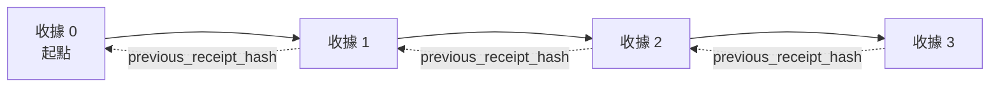

[觀看課程影片：使用密碼學憑證保障 AI 代理安全](https://youtu.be/PLACEHOLDER_VIDEO_ID)

> _(課程影片與縮圖將由 Microsoft 內容團隊於合併後新增，符合第 14 / 15 課模式。)_

# 以密碼學憑證保障 AI 代理安全

## 介紹

本課將涵蓋：

- 為何 AI 代理的稽核軌跡對合規、除錯及信任至關重要。
- 什麼是密碼學憑證，以及它與未簽名日誌行的不同。
- 如何用純 Python 產生代理工具呼叫的簽署憑證。
- 如何離線驗證憑證並偵測竄改。
- 如何串接憑證鏈，使刪除或重排任一憑證會破壞整條鏈。
- 憑證能證明什麼，以及明確無法證明什麼。

## 學習目標

完成本課後，您將能夠：

- 辨識促使代理行為須使用密碼學可追溯性之失效模式。
- 產生使用 Ed25519 簽名的憑證，對一個標準的 JSON 載荷。
- 僅憑簽署者的公開鑰匙，獨立驗證憑證。
- 透過於變更後憑證重驗，偵測竄改。
- 建立串接的哈希憑證序列，並解釋為何此串連關鍵。
- 辨識憑證能證明（歸屬、完整性、排序）與無法證明（行為正確性、政策健全性）之界限。

## 問題：您的代理稽核軌跡

想像您在 Contoso Travel 部署了 AI 代理。該代理閱讀客戶請求，呼叫航班 API 查詢方案，並代客訂票。上一季，該代理處理了 5 萬筆訂位。

今日一位稽核人員來到，問了一個簡單的問題：「請給我看你的代理做了什麼。」

您交出日誌檔案。稽核人員看過後問了更難的問題：「我怎麼知道這些日誌沒有被篡改？」

這就是稽核軌跡問題。當前多數代理部署依賴：

- <strong>應用日誌</strong>：代理自寫，擁有檔案系統存取權的人均可修改。
- <strong>雲端日誌服務</strong>：平台層檢測竄改但前提是稽核人信任平台營運者。
- <strong>資料庫交易日誌</strong>：適合資料庫變更，卻不適合任意工具呼叫。

若不信任任何人（您、雲端提供者、資料庫商），以上都無法回答稽核人問題。內部使用此信任常可接受，但對受管制工作負載（金融、醫療、受 EU AI 法規）則不可。

密碼學憑證透過使每項代理行為可獨立驗證解決此問題。稽核人不需信任您；只需您的公開鑰匙與憑證本身。

## 什麼是密碼學憑證？

憑證是一個記錄代理行為的 JSON 物件，並以數位簽章簽署。


```mermaid
flowchart LR
    A[代理調用工具] --> B[建立收據負載]
    B --> C[JSON RFC 8785 規範化]
    C --> E[Ed25519 簽署規範化字節]
    E --> F[附帶簽名的收據]
    F --> G[審核員離線驗證]
    G --> H{簽名有效？}
    H -- yes --> I[防篡改證明]
    H -- no --> J[收據被拒絕]
```

最基本的憑證看起來像這樣：

```json
{
  "type": "agent.tool_call.v1",
  "agent_id": "contoso-travel-bot",
  "tool_name": "lookup_flights",
  "tool_args_hash": "sha256:a3f9c1...",
  "result_hash": "sha256:7b2e1d...",
  "policy_id": "contoso-travel-policy-v3",
  "timestamp": "2026-04-25T14:30:00Z",
  "sequence": 47,
  "previous_receipt_hash": "sha256:9d4e6a...",
  "signature": {
    "alg": "EdDSA",
    "sig": "c5af83...",
    "public_key": "8f3b2c..."
  }
}
```

有三個特性在發揮效用：

1. <strong>簽章</strong>。憑證由代理閘道以 Ed25519 私鑰簽署。擁有對應公開鑰匙的人可離線驗證。任一欄位被竄改都會使簽章失效。

2. <strong>標準編碼</strong>。簽署前先用 JSON 標準化方案（JCS, RFC 8785）序列化。此確保兩個產生相同邏輯憑證的實作產生位元組一致輸出。若無標準化，不同 JSON 序列化器會對相同內容產生不同簽章。

3. <strong>哈希串接</strong>。`previous_receipt_hash` 欄位將每憑證連結至前一憑證。刪除或重排會破壞後續所有憑證。即使個別簽章被侵蝕，串鏈層級依然可發現竄改。

這些特性合力提供三項保證：

- <strong>歸屬</strong>：此鑰匙簽署了該內容。
- <strong>完整性</strong>：內容自簽署後未被改變。
- <strong>排序</strong>：此憑證在鏈中位於該憑證之後。

## 在 Python 中產生憑證

您不需要特殊函式庫就能產生憑證。密碼學基元廣泛可用，邏輯只有數十行 Python 代碼。

實作練習已放在 `code_samples/18-signed-receipts.ipynb`，全程帶您走過流程。以下為摘要：

```python
import json
import hashlib
import base64
from nacl import signing
from jcs import canonicalize  # RFC 8785 標準 JSON

def b64url_nopad(data: bytes) -> str:
    return base64.urlsafe_b64encode(data).decode("ascii").rstrip("=")

def sha256_canonical(obj) -> str:
    """SHA-256 of a Python object's JCS-canonical JSON form."""
    return f"sha256:{hashlib.sha256(canonicalize(obj)).hexdigest()}"

# 生成或載入簽署金鑰（生產環境中應存放於金鑰保管庫）
signing_key = signing.SigningKey.generate()
verify_key = signing_key.verify_key

# 建立收據有效載荷（尚未簽署）
tool_args = {"origin": "SYD", "destination": "LAX"}
tool_result = [{"flight": "QF11", "price": 1850, "stops": 0}]

payload = {
    "type": "agent.tool_call.v1",
    "agent_id": "contoso-travel-bot",
    "tool_name": "lookup_flights",
    "tool_args_hash": sha256_canonical(tool_args),
    "result_hash": sha256_canonical(tool_result),
    "policy_id": "contoso-travel-policy-v3",
    "timestamp": "2026-04-25T14:30:00Z",
    "sequence": 0,
    "previous_receipt_hash": None,
}

# 直接對 JCS 位元組進行標準化並簽署。PureEdDSA 內部會做雜湊處理。
canonical_bytes = canonicalize(payload)
signature_bytes = signing_key.sign(canonical_bytes).signature

# 附加結構化簽名物件。
receipt = {
    **payload,
    "signature": {
        "alg": "EdDSA",
        "sig": b64url_nopad(signature_bytes),
        "public_key": b64url_nopad(bytes(verify_key)),
    },
}
```

這就是完整的簽署流程。筆記本練習逐步演示。

## 驗證憑證與偵測竄改

驗證是逆運算：

```python
import base64
import hashlib
from nacl import signing
from nacl.exceptions import BadSignatureError
from jcs import canonicalize

def b64url_decode(s: str) -> bytes:
    padding = "=" * ((4 - len(s) % 4) % 4)
    return base64.urlsafe_b64decode(s + padding)

def verify_receipt(receipt: dict) -> bool:
    # 簽名是一個結構化物件：{"alg", "sig", "public_key"}。
    sig_obj = receipt.get("signature")
    if not sig_obj or sig_obj.get("alg") != "EdDSA":
        return False

    # 重建實際被簽署的有效負載（除簽名外的所有內容）。
    payload = {k: v for k, v in receipt.items() if k != "signature"}

    canonical_bytes = canonicalize(payload)

    try:
        verify_key = signing.VerifyKey(b64url_decode(sig_obj["public_key"]))
        verify_key.verify(canonical_bytes, b64url_decode(sig_obj["sig"]))
        return True
    except BadSignatureError:
        return False
```

此函式接收憑證，若簽章合法回傳 `True`，否則 `False`。不需網路、不依賴服務、亦無需信任第三方。

欲展示偵測竄改實況，筆記本將示範：

1. 建立有效憑證並確認驗證成功。
2. 修改 `tool_args_hash` 欄位一個位元組。
3. 重新驗證並看到失敗。

實際演示憑證具偵測竄改能力：任何微小變更皆破壞簽章。

## 多步代理的憑證串接

單一簽署憑證保護一項行動；憑證鏈保護多項序列行動。


```mermaid
flowchart LR
    R0[收據 0<br/>起點] --> R1[收據 1]
    R1 --> R2[收據 2]
    R2 --> R3[收據 3]
    R1 -. previous_receipt_hash .-> R0
    R2 -. previous_receipt_hash .-> R1
    R3 -. previous_receipt_hash .-> R2
```

每個憑證記錄了前一憑證的哈希。若攻擊者想偷偷刪除第 2 個憑證，必須：

- 修改第 3 個憑證的 `previous_receipt_hash` 欄位（會破壞第 3 個憑證的簽章），或
- 偽造修改後第 3 個憑證的新簽章（需要代理的私鑰）。

若私鑰存於硬體金鑰庫且您隨每張憑證發佈公開鑰匙，則兩種攻擊皆難以成功且無法逃避偵測。

筆記本示範：

1. 建立三個憑證的鏈。
2. 驗證每張憑證的 `previous_receipt_hash` 與前一憑證的實際哈希符不符。
3. 竄改鏈中憑證之一，看到鏈在該點斷裂。

這是您產生外部稽核可驗證且無須信任您的稽核軌跡的方式。

## 憑證能證明什麼（和不能證明什麼）

這是本課最重要的一節。憑證很強大，但能力有限。

**憑證證明三件事：**

1. <strong>歸屬</strong>：特定鑰匙簽署了特定載荷。
2. <strong>完整性</strong>：載荷自簽署後未被改動。
3. <strong>排序</strong>：此憑證在哈希鏈中排列晚於該憑證。

**憑證不能證明：**

1. <strong>正確性</strong>：代理行為是否正確。錯誤與正確答案均可清晰簽署。
2. <strong>政策合規</strong>：`policy_id` 所指政策是否真的被評估，或若檢查過是否允許此行為。憑證記錄的是聲稱而非強制。
3. <strong>身份超越鑰匙</strong>：憑證說「此鑰匙簽了此內容」，不說「此人授權此事」。連結鑰匙與人或組織需另有身份基礎設施（目錄、公開鑰匙登記等）。
4. <strong>輸入真實性</strong>：若代理收到被操控的提示並依此行動，憑證忠實記錄該行動。憑證站位於輸入驗證之後，非替代品。

此界限重要有兩原因：

- 它告訴您憑證的用途：使代理行為可稽核且具竄改證據性，即使跨組織。
- 它告訴您還需哪些額外層面：輸入驗證（第 6 課）、政策執行（稍後簡述）、身份基礎設施（本課未涵蓋）。

常見錯誤是以為「有憑證」即「被治理」。非也。憑證是基礎，治理是您疊加構建的系統。

## 證明人類核准了該精確行動

上述第 3 點值得專設一節：行動憑證說「此鑰匙簽署該內容」，不說「人類授權此事」。對高風險行動（退款、刪除、匯款），治理框架越來越要求缺失的敘述，且可藉由本課已建置基元產生。

續筆記本 `code_samples/human-authorization-receipts.ipynb` 新增第二種憑證類別 `human.approval.v1`，採本課同包裝格式（以 Ed25519 對其標準化 JCS 位元組簽署的帶型載荷，`signature` 物件位於簽署內容外）。命名核准者簽署<strong>完整標準化行動及其摘要</strong>於執行前；代理的行動憑證攜帶<strong>相同行動摘要</strong>與 `parent_approval_ref`（核准憑證的 `receipt_hash`，與先前憑證鏈中 `previous_receipt_hash` 類似慣例）。單一 `verify_chain` 在<strong>分別鎖定的鑰匙登錄表</strong>中驗證兩者（核准者鑰匙對比代理鑰匙），敘述邏輯共用但權威互不相通。

此機制嚴謹敘述的特性是：*此人類核准了此精確行動，代理確實執行該核准行動。* 筆記本的拒絕條件使此特性能得以具體呈現而非空談：

- 經典狀況：竄改、困惑代理、重放、兩側偽造鑰匙、格式錯誤輸入；
- <strong>權威過期</strong>：簽章仍驗證通過，但因政策版本更新、核准者鑰匙旋轉出登錄表，或執行前核准已過期而拒絕；
- <strong>摘要替換</strong>：一有效簽署的行動憑證指向<em>不同</em>標準化行動的<em>真實</em>核准。

每個失效條件均附有明確拒絕原因，稽核者可判別權威是否過期或執行行動變更。筆記本教導的規則是：簽署核准本身不等於權威。權威存在的條件是兩憑證在執行時仍約束於相同標準行動。人類核准憑證是本課定義的教學複合產物，非 `draft-farley-acta-signed-receipts` 所定義憑證類型。

## 產業參考

本課 Python 程式碼特意極簡，方便您閱讀每行並清楚理解。如用於生產，您有兩個選擇：

1. **直接基於密碼學基元建構。** 您看到的 50 行足以應付多數情境。PyNaCl（Ed25519）與 `jcs` 套件（標準化 JSON）均為健全且受審計的函式庫。

2. **使用生產憑證函式庫。** 數個開源專案實作相同模式，附加額外功能（密鑰輪替、批次驗證、JWK 集合分發、整合政策引擎）：
   - 簽署流程採用 IETF 草案（[`draft-farley-acta-signed-receipts`](https://datatracker.ietf.org/doc/draft-farley-acta-signed-receipts/)，修訂版 02）中 JCS 與簽章範圍慣例。本課教育性平面憑證不同於草案的 `{payload, signature}` 包裝格式，非合規實作。該草案公開了針對其通訊格式的共通符合性測試套件（[agent-governance-testvectors](https://github.com/ScopeBlind/agent-governance-testvectors)）。
   - Microsoft Agent Governance Toolkit 以 Cedar 政策決策組合憑證；該套件中第 33 教學示範端對端案例。
   - `protect-mcp`（npm）與 `@veritasacta/verify`（npm）套件提供 Node.js 版的憑證簽署與離線驗證實作，用於將任何 MCP 伺服器包裝成具竄改證據的審計軌跡，包括保留共簽流程，其中暫停的行動會發出綁定動作摘要的核准憑證（桌面流程借助 WebAuthn），就是前述人類授權筆記本的同一核准憑證模式。
   - **[nobulex](https://github.com/arian-gogani/nobulex)** Python SDK（`pip install nobulex`）在 Python 中提供相同 Ed25519 + JCS 簽署模式，搭配 LangChain 與 CrewAI 整合，含公開的跨驗證測試向量及由 [OWASP PR #2210](https://github.com/OWASP/CheatSheetSeries/pull/2210) 貢獻的合規對映表。

自行開發與使用函式庫的抉擇如同自行撰寫 JWT 函式庫或用經考驗函式庫之選擇：兩者皆合理；函式庫節省時間並減少審計面積；從零實作逼迫你拆解每個基元。本課著重零基礎路徑，為兩種選項奠定基礎。

## 知識檢測

在進入實作練習前，先測驗您的理解。

**1. 憑證以代理的私鑰 Ed25519 簽署。稽核人僅有公開鑰匙。稽核人能否離線驗證憑證？**

<details>
<summary>答案</summary>

能。Ed25519 驗證只需公開鑰匙與簽署位元組。無須網路呼叫，無服務依賴。此特性讓憑證適用於氣隙、多組織或低信任審核環境。
</details>

**2. 攻擊者修改憑證的 `policy_id` 欄位以聲稱採用更寬鬆的政策。原始載荷被簽署。驗證時會發生什麼事？**

<details>
<summary>答案</summary>


驗證失敗。簽名是基於原始載荷的標準位元組計算的；修改任何欄位都會改變這些位元組，因此簽名就會失效。攻擊者需要擁有私鑰才能產生新的有效簽名，但他們並沒有私鑰。
</details>

**3. 為何收據會包含 `tool_args_hash` 和 `result_hash`，而不是原始的參數和結果？**

<details>
<summary>答案</summary>

有兩個原因。首先，收據可能需要在不便洩露原始內容（如個人識別信息、商業資料）的環境中被存檔或傳輸。使用雜湊可以保持收據小巧且內容私密；審計員會驗證雜湊是否與另存的實際內容相符。其次，雜湊大小是固定的；不論輸入和輸出的大小如何，帶雜湊的收據尺寸都有限制。
</details>

**4. `previous_receipt_hash` 欄位將每個收據與前一個收據連結。如果攻擊者悄悄刪除鏈中間的一個收據，什麼會變得無效？**

<details>
<summary>答案</summary>

之後所有的收據都會無效。它們的 `previous_receipt_hash` 欄位不再與實際鏈條相符（因為它們參考的收據已不存在，或者鏈條現在指向不同的前置者）。為了掩蓋刪除，攻擊者必須重新對所有後續收據簽名，這需要私鑰。
</details>

**5. 收據驗證通過了。這是否證明代理的行動是正確、合理或符合法規？**

<details>
<summary>答案</summary>

不。有效的收據證明三件事：歸屬（此金鑰簽署了此內容）、完整性（內容沒有變動）和順序（此收據在前一收據之後）。它不證明行動的正確性，不證明在 `policy_id` 中指定的政策被實際評估，也不證明代理遵守了所有規則。收據使代理行為可審計，但未必正確。這是本課程中最重要的界限。
</details>

## 練習題

開啟 `code_samples/18-signed-receipts.ipynb` 並完成全部四個部分：

1. <strong>第一部分</strong>：簽署你的第一張收據並驗證它。
2. <strong>第二部分</strong>：篡改收據並觀察驗證失敗。
3. <strong>第三部分</strong>：建立一個三個收據的鏈條並驗證鏈條完整性。
4. <strong>第四部分</strong>：將模式應用於使用 Microsoft Agent Framework 建立的代理：將工具調用包裹在收據簽署中，然後獨立驗證收據。

**擴展挑戰 1：** 用你自選的額外欄位擴展收據結構（例如用於追蹤的請求 ID），更新簽署的標準邏輯以包含該欄位，並確認收據仍可通過驗證。然後在簽署後修改此欄位，並確認驗證失敗。這會迫使你理解標準編碼中每個位元組如何影響簽名。

**擴展挑戰 2：** 將兩張收據的標準位元組透過 SHA-256 雜湊合併（以確定性的順序串接），並將所得摘要嵌入第三張收據的一個新欄位後簽名。驗證三張收據仍可相互通過驗證。你剛完成了一階包含證明：持有第三張收據的人可以證明前兩張收據在簽名時存在，無需揭露其內容。這是選擇性披露收據在大規模使用的模式（梅克爾承諾，RFC 6962）。

## 結論

密碼學收據為 AI 代理提供以下審計軌跡：

- <strong>獨立可驗證</strong>：任何擁有公鑰的方都能驗證，無需依賴服務。
- <strong>篡改即顯示</strong>：任何更動都會使簽名失效。
- <strong>可攜帶</strong>：收據是一個小型 JSON 檔案，可於任何地方存檔、傳輸與驗證。
- <strong>符合標準</strong>：基於 Ed25519 (RFC 8032)、JCS (RFC 8785) 與 SHA-256，全是廣泛部署的原語。

它們並非輸入驗證、政策強制或身份基礎結構的替代品，而是這些層級的基石。當你將代理部署於受管控的工作負載、多組織工作流或任何不可以預期未來審計員會信任你的環境時，收據是你確保審計軌跡真實的方式。

最重要的收穫：收據證明是誰在什麼時間說了什麼，但並不保證所說內容的真實性或正確性。請牢牢把握這點。這是誠實的出處系統與誤導性系統的分水嶺。

## 生產檢查清單

當你準備從本課程畢業並在真實環境部署收據簽署代理時：

- [ ] **將簽署金鑰移出開發人員筆記型電腦。** 使用 Azure Key Vault、AWS KMS 或硬體安全模組。簽署收據的私鑰絕不可存於原始碼控制或應用機器的明文中。
- [ ] **發布驗證用公鑰。** 審計員離線驗證所需。標準模式為於知名 URL 處公開 JWK 集合（RFC 7517），例如 `https://your-org.example.com/.well-known/agent-keys.json`。
- [ ] **向外部錨定鏈條。** 定期將最新鏈頭的雜湊寫入透明度日誌（Sigstore Rekor、RFC 3161 時戳授權中心或第二套內部系統），以供外部方確認「此鏈在此時存在」。
- [ ] **不變式存儲收據。** 追加式 Blob 存儲（Azure Storage 設不可變性策略、AWS S3 物件鎖定）防止內部人於存儲層改寫歷史。
- [ ] **決定保留期限。** 多數合規規範要求多年保留。計劃收據膨脹（每張收據約 500 字節；代理每日調用 1 萬次每年產約 1.8 GB）。
- [ ] **紀錄收據未涵蓋範圍。** 收據證明歸屬、完整性和排序。你的運行手冊應明列額外控管（輸入驗證、政策強制、速率限制、身份基礎建設）如何與收據共存於治理架構中。

### 想了解更多 AI 代理安全問題？

加入 [Microsoft Foundry Discord](https://aka.ms/ai-agents/discord)，與其他學習者會面，參加辦公時間，並獲取你的 AI 代理問題回答。

## 課程延伸

本課程涵蓋單張收據簽署與雜湊鏈序列。相同原語可構成若干高階模式，隨著你的治理態勢成熟，你可能會遇到：

- **選擇性披露。** 當收據欄位獨立承諾（RFC 6962 式梅克爾樹）時，可向特定審計員揭露特定欄位，並證明其餘欄位未變而不揭露它們。適用於同一收據需同時滿足全面審計（要求完整性）與資料最小化規範如 GDPR（讓審計員只見必要資訊）。
- **收據撤銷。** 若簽署金鑰遭洩，需要一套機制標記該金鑰簽署的所有收據自某時起不再信任。標準模式：短期簽署金鑰加上公開撤銷名單，或帶有撤銷條目的透明度日誌。
- **雙邊／分裂簽名收據。** 有些實作將簽署載荷拆為執行前（`authorization_*`）與執行後（`result_*`）兩半，各自簽名，適用於授權決策與實際結果由不同角色或時間點產生的狀況。此架構可加成於本課程教授的格式。
- **載荷組合。** 收據封存你放入 `result_hash` 的任何位元組。實務載荷往往比單一工具調用結果更豐富：預決策推理（模型預測、考慮選項、證據及其完整性、風險態勢、問責鏈、門控結果）皆可納入載荷，由單一收據封存。保持收據格式精簡，同時讓載荷結構可依領域發展。
- **跨實作一致性。** 不同獨立實作（Python、TypeScript、Rust、Go）針對共享測試向量互相驗證。若自行打造實作，驗證公開向量可確保兼容。
- **後量子遷移。** Ed25519 廣泛部署但非量子安全。收據格式為可變演算法設計：需遷移時，`signature.alg` 欄位可帶 `ML-DSA-65`（NIST 後量子簽名標準）。規劃過渡時期雙重簽名收據。

## 附加資源

- <a href="https://datatracker.ietf.org/doc/draft-farley-acta-signed-receipts/" target="_blank">IETF Internet-Draft：機器對機器存取控制的簽名決策收據</a>
- <a href="https://learn.microsoft.com/azure/ai-studio/responsible-use-of-ai-overview" target="_blank">負責任的 AI 概覽（Azure AI）</a>
- <a href="https://datatracker.ietf.org/doc/html/rfc8032" target="_blank">RFC 8032：愛德華曲線數位簽名演算法 (EdDSA)</a>
- <a href="https://datatracker.ietf.org/doc/html/rfc8785" target="_blank">RFC 8785：JSON 標準格式化方案 (JCS)</a>
- <a href="https://datatracker.ietf.org/doc/html/rfc6962" target="_blank">RFC 6962：憑證透明度</a>（選擇性披露收據使用的梅克爾樹結構）
- <a href="https://github.com/microsoft/agent-governance-toolkit/blob/main/docs/tutorials/33-offline-verifiable-receipts.md" target="_blank">Microsoft Agent Governance Toolkit，教學 33：離線驗證決策收據</a>
- <a href="https://github.com/ScopeBlind/agent-governance-testvectors" target="_blank">本課程使用的收據格式跨實作測試向量</a>（Apache-2.0）
- <a href="https://pynacl.readthedocs.io/" target="_blank">PyNaCl 文件</a>（Python 中的 Ed25519）

## 前一課

[建立本地 AI 代理](../17-creating-local-ai-agents/README.md)

---

<!-- CO-OP TRANSLATOR DISCLAIMER START -->
**免責聲明**：
本文件由 AI 翻譯服務 [Co-op Translator](https://github.com/Azure/co-op-translator) 翻譯而成。雖然我們致力於確保準確性，但請注意，機器自動翻譯可能包含錯誤或不準確之處。原始文件的母語版本應被視為權威來源。對於重要資訊，建議進行專業人工翻譯。我們不對因使用本翻譯而產生的任何誤解或誤釋承擔責任。
<!-- CO-OP TRANSLATOR DISCLAIMER END -->