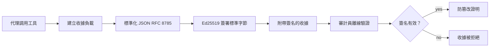
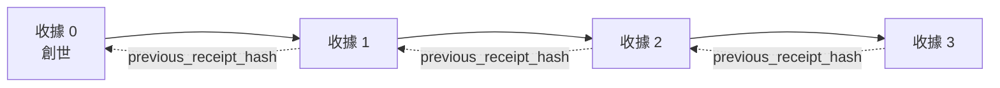

[觀看課程影片：使用加密收據保護 AI 代理](https://youtu.be/PLACEHOLDER_VIDEO_ID)

> _(課程影片與縮圖將由 Microsoft 內容團隊於合併後添加，符合第14/15課模式。)_

# 使用加密收據保護 AI 代理

## 介紹

本課程將涵蓋：

- 為什麼 AI 代理的審計追蹤對合規、除錯和信任很重要。
- 什麼是加密收據，以及它與未簽名日誌條目的不同之處。
- 如何用純 Python 產生代理工具呼叫的簽名收據。
- 如何離線驗證收據並偵測篡改。
- 如何將收據串鏈，讓刪除或重新排序其中一個會破壞整個鏈條。
- 收據證明了什麼，以及它們明確不證明什麼。

## 學習目標

完成本課程後，您將能夠：

- 識別促使代理行動使用加密可溯源的失效模式。
- 對規範 JSON 負載產生 Ed25519 簽名的收據。
- 只使用簽名者的公鑰獨立驗證收據。
- 通過重新驗證修改後的收據來偵測篡改。
- 建立收據的雜湊鏈序列並解釋鏈條的重要性。
- 辨識收據證明（歸屬、完整性、順序）與不證明的界線（行動正確性、政策健全性）。

## 問題：您的代理的審計追蹤

想像您已為 Contoso Travel 部署了一個 AI 代理。該代理讀取客戶請求，呼叫航班 API 查詢選項，並代表客戶訂位。上一季該代理處理了 50,000 筆訂位。

今天，審計員來了。他們提出一個簡單問題：「請展示您的代理做了什麼。」

您交出日誌檔案。審計員查看後提出更難的問題：「我怎麼知道這些日誌沒有被修改過？」

這就是審計追蹤問題。目前多數代理部署依賴：

- <strong>應用程式日誌</strong>：由代理自身寫入，任何有檔案系統存取權限者都能編輯。
- <strong>雲端日誌服務</strong>：平台層面可偵測篡改，但前提是審計員信任平台營運商。
- <strong>資料庫交易日誌</strong>：適合記錄資料庫變更，但不適合記錄任意工具呼叫。

這些方式都無法在不要求審計員信任某方（您、您的雲端服務商或資料庫供應商）的情況下，回答審計員的問題。內部使用時這種信任通常可以接受，但對於受監管的工作負載（金融、醫療、任何受 EU AI 法案規範者）則不行。

加密收據透過讓每個代理行動能獨立驗證來解決此問題。審計員不需信任您，只需您的公鑰與收據本身。

## 什麼是加密收據？

收據是一個記錄代理所做之事的 JSON 物件，並經數位簽章簽名。


```mermaid
flowchart LR
    A[代理調用工具] --> B[建立收據負載]
    B --> C[標準化 JSON RFC 8785]
    C --> E[Ed25519 簽署標準字節]
    E --> F[附帶簽名的收據]
    F --> G[審計員離線驗證]
    G --> H{簽名有效？}
    H -- yes --> I[防篡改證明]
    H -- no --> J[收據被拒絕]
```

一個最小收據看起來像這樣：

```json
{
  "type": "agent.tool_call.v1",
  "agent_id": "contoso-travel-bot",
  "tool_name": "lookup_flights",
  "tool_args_hash": "sha256:a3f9c1...",
  "result_hash": "sha256:7b2e1d...",
  "policy_id": "contoso-travel-policy-v3",
  "timestamp": "2026-04-25T14:30:00Z",
  "sequence": 47,
  "previous_receipt_hash": "sha256:9d4e6a...",
  "signature": {
    "alg": "EdDSA",
    "sig": "c5af83...",
    "public_key": "8f3b2c..."
  }
}
```

三個屬性在運作：

1. <strong>簽名</strong>。收據由代理閘道使用 Ed25519 私鑰簽署。任何持有對應公鑰者都可離線驗證此簽名。篡改任何欄位會使簽名失效。

2. <strong>規範編碼</strong>。簽署前，收據使用 JSON 規範化方案（JCS, RFC 8785）序列化。這確保不同實作對相同邏輯收據產生位元組相同的輸出。未規範化時，不同 JSON 序列器會對相同內容產生不同簽名。

3. <strong>雜湊鏈結</strong>。`previous_receipt_hash` 欄位將每個收據串接到前一筆。刪除或重新排序會破壞往後所有收據，即使個別簽名被繞過，鏈條層級仍能看到篡改。

這些屬性合起來提供三項保證：

- <strong>歸屬</strong>：此金鑰簽署了此內容。
- <strong>完整性</strong>：內容自簽署後未改變。
- <strong>順序</strong>：此收據在鏈中位於該收據之後。

## 用 Python 產生收據

產生收據不需特別函式庫。加密原語廣泛可用，邏輯只需幾十行 Python。

`code_samples/18-signed-receipts.ipynb` 中的實作練習一步步帶過完整流程。摘要版：

```python
import json
import hashlib
import base64
from nacl import signing
from jcs import canonicalize  # RFC 8785 標準 JSON

def b64url_nopad(data: bytes) -> str:
    return base64.urlsafe_b64encode(data).decode("ascii").rstrip("=")

def sha256_canonical(obj) -> str:
    """SHA-256 of a Python object's JCS-canonical JSON form."""
    return f"sha256:{hashlib.sha256(canonicalize(obj)).hexdigest()}"

# 生成或載入簽名金鑰（生產環境中，請儲存在金鑰庫中）
signing_key = signing.SigningKey.generate()
verify_key = signing_key.verify_key

# 建立收據負載（尚未簽名）
tool_args = {"origin": "SYD", "destination": "LAX"}
tool_result = [{"flight": "QF11", "price": 1850, "stops": 0}]

payload = {
    "type": "agent.tool_call.v1",
    "agent_id": "contoso-travel-bot",
    "tool_name": "lookup_flights",
    "tool_args_hash": sha256_canonical(tool_args),
    "result_hash": sha256_canonical(tool_result),
    "policy_id": "contoso-travel-policy-v3",
    "timestamp": "2026-04-25T14:30:00Z",
    "sequence": 0,
    "previous_receipt_hash": None,
}

# 對 JCS 位元組直接進行標準化和簽名。PureEdDSA 內部執行雜湊。
canonical_bytes = canonicalize(payload)
signature_bytes = signing_key.sign(canonical_bytes).signature

# 附加結構化簽名物件。
receipt = {
    **payload,
    "signature": {
        "alg": "EdDSA",
        "sig": b64url_nopad(signature_bytes),
        "public_key": b64url_nopad(bytes(verify_key)),
    },
}
```

這就是完整簽署流程。筆記本中的練習會詳細介紹每一步。

## 驗證收據與偵測篡改

驗證是相反過程：

```python
import base64
import hashlib
from nacl import signing
from nacl.exceptions import BadSignatureError
from jcs import canonicalize

def b64url_decode(s: str) -> bytes:
    padding = "=" * ((4 - len(s) % 4) % 4)
    return base64.urlsafe_b64decode(s + padding)

def verify_receipt(receipt: dict) -> bool:
    # 簽名是一個結構化對象：{"alg", "sig", "public_key"}。
    sig_obj = receipt.get("signature")
    if not sig_obj or sig_obj.get("alg") != "EdDSA":
        return False

    # 重建實際被簽署的載荷（除簽名外的所有內容）。
    payload = {k: v for k, v in receipt.items() if k != "signature"}

    canonical_bytes = canonicalize(payload)

    try:
        verify_key = signing.VerifyKey(b64url_decode(sig_obj["public_key"]))
        verify_key.verify(canonical_bytes, b64url_decode(sig_obj["sig"]))
        return True
    except BadSignatureError:
        return False
```

此函式接受收據，若簽名有效回傳 `True`，否則回傳 `False`。不需網路呼叫，無服務依賴，也不必信任第三方。

為展示偵測篡改，筆記本演示：

1. 產生有效收據並確認驗證通過。
2. 修改 `tool_args_hash` 欄位一個位元組。
3. 重新驗證並看到失敗。

這實證明收據具篡改可察覺性：任何修改，即使極小，都會破壞簽名。

## 多步驟代理的串鏈收據

單一簽名收據保障單次行動。收據鏈保障一連串行動。


```mermaid
flowchart LR
    R0[收據 0<br/>創世] --> R1[收據 1]
    R1 --> R2[收據 2]
    R2 --> R3[收據 3]
    R1 -. previous_receipt_hash .-> R0
    R2 -. previous_receipt_hash .-> R1
    R3 -. previous_receipt_hash .-> R2
```

每個收據記錄前一收據的雜湊。若攻擊者想悄悄移除收據2，須：

- 修改收據3的 `previous_receipt_hash` 欄位（破壞收據3簽名），或
- 對修改後的收據3偽造新的簽名（需代理私鑰）。

若私鑰保存在硬體金鑰庫並且每筆收據均發佈公鑰，兩種攻擊皆無法成功且不被察覺。

筆記本示範：

1. 建立三筆收據鏈。
2. 驗證每筆收據的 `previous_receipt_hash` 與前一收據實際雜湊相符。
3. 中間某收據被篡改，鏈條即在該點折斷。

這就是如何產生外部審計員可在不信任您的情況下驗證的審計追蹤。

## 收據能證明什麼（及不能證明什麼）

這是本課最重要的部分。收據強大但有限制。

**收據能證明三件事：**

1. <strong>歸屬</strong>：特定金鑰簽署了特定負載。
2. <strong>完整性</strong>：負載自簽署後未被更改。
3. <strong>順序</strong>：此收據在雜湊鏈中在那筆收據之後。

**收據不證明：**

1. <strong>正確性</strong>：代理的行動是否正確。收據可同樣乾淨地簽署錯誤回答與正確回答。
2. <strong>政策遵循</strong>：`policy_id` 中的政策是否被實際評估，或如果檢查是否會允許該行動。收據記錄的是聲稱的內容，而非實際執行的規則。
3. <strong>超越金鑰的身份</strong>：收據說「此金鑰簽署此內容」，不表示「此人授權」。將金鑰連結到人或組織需另有身份基礎設施（例如目錄、公鑰註冊等）。
4. <strong>輸入的真實性</strong>：如果代理收到被操控的提示並基於此行動，收據忠實記錄該行動。收據在輸入驗證之後，並非替代品。

這界線重要有兩個原因：

- 告訴您收據的實用範圍：讓代理行為可審計且可篡改可察覺，甚至跨組織界線。
- 告訴您仍需哪些額外層次：輸入驗證（第6課）、政策執行（稍後略述）與身份基礎設施（本課不涵蓋）。

常見錯誤是以為「有收據」就等於「受管控」。事實非然。收據是基礎。治理是您在此基礎上建立的系統。

## 證明人類批准該精確行動

上述第3點值得獨立章節：行動收據表示「此金鑰簽署此內容」，未說「人類授權」。對於高風險行動（退款、刪除、電匯），治理架構越來越要求這項缺失聲明，且本課已有原語可產生此聲明。

後續筆記本 `code_samples/human-authorization-receipts.ipynb` 增加第二種收據類型 `human.approval.v1`，與本課收據使用相同信封格式（以 Ed25519 對其規範 JCS 位元組簽名的具類型負載，`signature` 物件在簽名位元組之外）。具名批准者在執行前簽署<strong>完整規範行動及其摘要</strong>；代理的行動收據攜帶<strong>相同的行動摘要</strong>與 `parent_approval_ref`，即批准的 `receipt_hash`，與上述鏈中 `previous_receipt_hash` 同理。一次 `verify_chain` 同時驗證兩個工件，分別使用<strong>分離固定金鑰註冊表</strong>（批准者金鑰 vs 代理金鑰），故共用程式碼路徑但權威分開。

其產生的屬性慎重說明為：*人類批准了此精確行動，代理嚴格執行了該批准行動。* 筆記本中否決條件令此屬性成為現實而非僅口頭宣告：

- 經典組合：篡改、困惑代理、重放、雙方偽造金鑰、格式錯誤輸入；
- <strong>過期權限</strong>：簽名仍驗證通過，但因政策版本更新、批准者金鑰自固定註冊表中移除，或批准在執行前過期而被拒絕；
- <strong>摘要替代</strong>：有效簽名的行動收據指向一個<em>真實</em>批准，但綁定<em>不同</em>規範行動。

每個失敗原因均有明確拒絕訊息，使審計員能分辨權限是否過期或執行行動是否變更。筆記本教導的規則是：簽署的批准本身不代表權限。只有兩個收據在執行時仍綁定同一規範行動時，權限才成立。人類批准收據是本課定義的教育性組合，而非 `draft-farley-acta-signed-receipts` 定義的收據類型。

## 生產參考

本課的 Python 程式碼刻意簡潔，方便您閱讀每行且準確了解操作。生產環境有兩種選擇：

1. **直接基於加密原語構建。** 上述 50 行程式碼足以應付多數用例。PyNaCl（Ed25519）和 `jcs` 套件（規範 JSON）為維護良好且受審計的函式庫。

2. **使用生產收據函式庫。** 多個開源專案提供相同模式及額外功能（密鑰輪替、批次驗證、JWK 集分發、與政策引擎整合）：
   - 簽名流程使用獨立的 IETF 網際網路草案中之 JCS 與簽章範圍規約（[`draft-farley-acta-signed-receipts`](https://datatracker.ietf.org/doc/draft-farley-acta-signed-receipts/)，修訂版02）。本課的平面教學收據與草案的 `{payload, signature}` 信封不同，且非符合性實作。草案發布針對其線格式的共通符合性測試套件 ([agent-governance-testvectors](https://github.com/ScopeBlind/agent-governance-testvectors))。
   - Microsoft Agent Governance Toolkit 結合 Cedar 為基礎的政策決策；該程式庫第33課教程展示端對端範例。
   - `protect-mcp` (npm) 與 `@veritasacta/verify` (npm) 函式庫提供 Node.js 實作收據簽署與離線驗證，適用於封裝任意 MCP 服務器的篡改證明審計追蹤，其中包含暫停行動釋出綁定行動摘要批准收據的共同簽署流程（桌面流程 WebAuthn 支援），即上述人類授權筆記本的批准收據模式。
   - **[nobulex](https://github.com/arian-gogani/nobulex)** Python SDK (`pip install nobulex`) 提供相同 Ed25519 + JCS 簽署模式，結合 LangChain 與 CrewAI 並包含已發佈的交叉驗證測試向量及由 [OWASP PR #2210](https://github.com/OWASP/CheatSheetSeries/pull/2210) 貢獻的合規映射。

自行開發與使用函式庫的抉擇，類似於自行撰寫 JWT 函式庫與使用現成函式庫的差異：兩者皆合理；函式庫節省時間並降低審計範圍；自行開發強迫您理解每個原語。本課教授自行開發路徑，為您打好基礎，方便未來選擇。

## 知識檢測

在進入實作練習前，測試您的理解。

**1. 收據由代理的 Ed25519 私鑰簽署，審計員僅持有公鑰。審計員能否離線驗證收據？**

<details>
<summary>答案</summary>

能。Ed25519 驗證只需公鑰和簽署位元組。無需網路呼叫，無須服務依賴。此特性讓收據適用於隔離網路、多組織或低信任審計環境。
</details>

**2. 攻擊者修改收據的 `policy_id` 欄位，聲稱受更寬鬆政策治理。簽名是基於原始負載。驗證時會發生什麼？**

<details>
<summary>答案</summary>


驗證失敗。簽名是根據原始有效負載的標準字節計算的；修改任何欄位都會更改這些字節，使簽名無效。攻擊者需要私鑰才能生成新的有效簽名，但他們並沒有。
</details>

**3. 為什麼收據包含 `tool_args_hash` 和 `result_hash` 而不是原始參數和結果？**

<details>
<summary>答案</summary>

兩個原因。首先，收據可能需要在洩露原始內容（PII、商業數據）會有問題的環境中存檔或傳輸。雜湊保持收據大小小且內容保密；審核員驗證雜湊是否與單獨儲存的實際內容副本匹配。其次，雜湊有固定大小；無論輸入和輸出有多大，包含雜湊的收據大小都是有上限的。
</details>

**4. `previous_receipt_hash` 欄位將每個收據連結到其前一個。如果攻擊者悄悄刪除鏈中間的一個收據，什麼會變得無效？**

<details>
<summary>答案</summary>

刪除之後的每個收據都無效。它們的 `previous_receipt_hash` 欄位不再匹配實際鏈（因為它們所參考的收據已不存在，或鏈現在指向不同的前任收據）。為了隱藏刪除，攻擊者必須重新簽署每個後續收據，這需要私鑰。
</details>

**5. 一張收據驗證成功，是否證明代理的行為是正確、合理或符合政策？**

<details>
<summary>答案</summary>

不。有效收據證明三件事：歸屬（該密鑰簽署了此內容）、完整性（內容未被更改）和順序（此收據發生在那個收據之後）。它不證明行為是正確的、`policy_id` 所指定的政策確實被評估過，或代理遵循了所有規則。收據使代理行為可審核，但不一定是正確的。這是本課程中最重要的界線。
</details>

## 練習題

打開 `code_samples/18-signed-receipts.ipynb`，完成以下四個部分：

1. **第1部分**：簽署您的第一份收據並驗證它。
2. **第2部分**：篡改收據並觀察驗證失敗。
3. **第3部分**：建立三個收據的鏈並驗證鏈的完整性。
4. **第4部分**：將本課程的模式應用於使用 Microsoft Agent Framework 建立的代理：將工具調用包裹於收據簽署中，然後獨立驗證收據。

**挑戰額外1：** 擴展收據架構，添加您自選的欄位（例如用於追踪的請求 ID），更新標準簽署邏輯以包含該欄位，並確認收據仍可通過驗證來回轉換。然後在簽署後修改該欄位，並確認驗證失敗。這迫使您理解標準編碼的每個字節如何影響簽名。

**挑戰額外2：** 將您的兩個收據的標準字節以確定性順序串接後做 SHA-256 雜湊，並將結果摘要嵌入第三個收據的新欄位中再簽署。驗證三份收據仍可來回轉換。您剛剛建立了一步包含證明：持有第三份收據的任何人都能證明第一和第二份收據在簽署時確實存在，且不需要揭露它們內容。這是選擇性披露收據在大規模使用的模式（Merkle 承諾，RFC 6962）。

## 結論

密碼學收據為 AI 代理提供了以下審計軌跡：

- <strong>可獨立驗證</strong>：任何持有公鑰的一方均可驗證，無需服務依賴。
- <strong>防篡改</strong>：任何修改都使簽名無效。
- <strong>可攜帶</strong>：收據為小型 JSON 檔案；可存檔、傳輸且可在任何地點驗證。
- <strong>標準化對齊</strong>：基於 Ed25519 （RFC 8032）、JCS（RFC 8785）及 SHA-256，皆為廣泛部署的原語。

它們不是輸入驗證、政策執行或身份架構的替代品，而是這些層的基礎。當您將代理部署於受監管工作負載、多組織工作流或任何未來審計者無法保證信任您的情況，收據即是讓審計軌跡誠實的方式。

最重要的重點：收據證明了誰在什麼時候說了什麼。它不證明所說的話是正確或正當的。務必牢記此區別。這是誠實來源系統與誤導性系統的差異。

## 生產檢查清單

當您準備好從本課程畢業並在真實環境部署收據簽署代理時：

- [ ] **將簽署密鑰從開發者筆記本移出。** 使用 Azure Key Vault、AWS KMS 或硬體安全模組。簽署收據的私鑰絕不可存在原始碼控制或應用機器上以明文形式儲存。
- [ ] **發布驗證公鑰。** 審核者需要離線驗證。標準模式是在已知 URL 下發布 JWK 集（RFC 7517），例如 `https://your-org.example.com/.well-known/agent-keys.json`。
- [ ] **將鏈外部錨定。** 定期將最新鏈首雜湊寫入透明度日誌（Sigstore Rekor、RFC 3161 時戳授權或第二個內部系統），讓外部機構能確認「此鏈在此時間點存在」。
- [ ] **不可變存儲收據。** 附加式 blob 存儲（ Azure Storage 設定不可變性政策、AWS S3 棄用鎖定）防止內部人員在存儲層篡改歷史。
- [ ] **決定保留期限。** 許多合規規範要求多年保留。規劃收據成長（每份收據約 500 字節；每天 10,000 次呼叫的代理每年產生約 1.8 GB）。
- [ ] **記錄收據不涵蓋的範圍。** 收據證明歸屬、完整性及順序。您的運作手冊中應明確列出哪些額外控管（輸入驗證、政策執行、速率限制、身份架構）是與收據並行的治理措置。

### 想了解更多關於保障 AI 代理嗎？

加入 [Microsoft Foundry Discord](https://aka.ms/ai-agents/discord)，與其他學習者交流，參加開放時間，獲得 AI 代理的問題解答。

## 課程之外

本課程涵蓋單筆收據簽署及雜湊鏈序列。這些原語組合後形成隨著治理成熟可能遇到的幾種更先進模式：

- **選擇性披露。** 當收據欄位可獨立承諾（RFC 6962 式 Merkle 樹），您可向特定審核者揭露特定欄位，證明其他欄位未改動而不暴露內容。當同份收據需同時滿足綜合審核（需要完整性）及資料最小化規範如 GDPR（審核者只見必要資訊）時十分有用。
- **收據撤銷。** 若簽署密鑰遭洩露，您需要方法標記該密鑰簽署的所有收據自某時間點起不可信。標準模式：短存活期簽署密鑰配合公告撤銷列表，或使用帶有撤銷條目的透明度日誌。
- **雙方/分割簽名收據。** 有些實作將簽署有效負載拆分成前執行（`authorization_*`）及後執行（`result_*`）兩半，分別簽署，有助於授權決策與觀察結果由不同角色或時間產生。此模式可累加應用於本課程所示收據格式之上。
- **有效負載組合。** 收據封印您放入 `result_hash` 的任何字節。實務中有效負載往往比單一工具調用結果更豐富：決策前推理（模型預測、考慮選項、證據及其完整性、風險狀態、責任鏈、門檻結果）皆可封存在有效負載內，統一由收據封印。這保持收據格式簡潔同時允許各領域有效負載架構演進。
- **跨實作一致性。** 同收據格式有多個獨立實作（Python、TypeScript、Rust、Go）可相互驗證共用測試向量。若您自行實作，驗證公開向量確認與其它實作的線路兼容性。
- **後量子遷移。** Ed25519 是目前廣泛部署但不具量子抗性。收據格式具演算法靈活性：當需要遷移時，`signature.alg` 欄位可以攜帶 `ML-DSA-65`（NIST 後量子簽名標準）。規劃過渡期，收據雙簽名。

## 額外資源

- <a href="https://datatracker.ietf.org/doc/draft-farley-acta-signed-receipts/" target="_blank">IETF Internet-Draft：機器對機器存取控制的簽署決策收據</a>
- <a href="https://learn.microsoft.com/azure/ai-studio/responsible-use-of-ai-overview" target="_blank">負責任 AI 概述（Azure AI）</a>
- <a href="https://datatracker.ietf.org/doc/html/rfc8032" target="_blank">RFC 8032：Edwards 曲線數位簽名演算法 (EdDSA)</a>
- <a href="https://datatracker.ietf.org/doc/html/rfc8785" target="_blank">RFC 8785：JSON 標準化方案 (JCS)</a>
- <a href="https://datatracker.ietf.org/doc/html/rfc6962" target="_blank">RFC 6962：證書透明度</a>（選擇性披露收據使用的 Merkle 樹建構）
- <a href="https://github.com/microsoft/agent-governance-toolkit/blob/main/docs/tutorials/33-offline-verifiable-receipts.md" target="_blank">Microsoft Agent Governance Toolkit，教程33：離線可驗證的決策收據</a>
- <a href="https://github.com/ScopeBlind/agent-governance-testvectors" target="_blank">本課程所用收據格式的跨實作一致性測試向量（Apache-2.0）</a>
- <a href="https://pynacl.readthedocs.io/" target="_blank">PyNaCl 文件（Python 中的 Ed25519）</a>

## 前一課程

[建立本地 AI 代理](../17-creating-local-ai-agents/README.md)

---

<!-- CO-OP TRANSLATOR DISCLAIMER START -->
**免責聲明**：
本文件由 AI 翻譯服務 [Co-op Translator](https://github.com/Azure/co-op-translator) 翻譯而成。雖然我們致力於確保準確性，但請注意，機器自動翻譯可能包含錯誤或不準確之處。原始文件的母語版本應被視為權威來源。對於重要資訊，建議進行專業人工翻譯。我們不對因使用本翻譯而產生的任何誤解或誤釋承擔責任。
<!-- CO-OP TRANSLATOR DISCLAIMER END -->