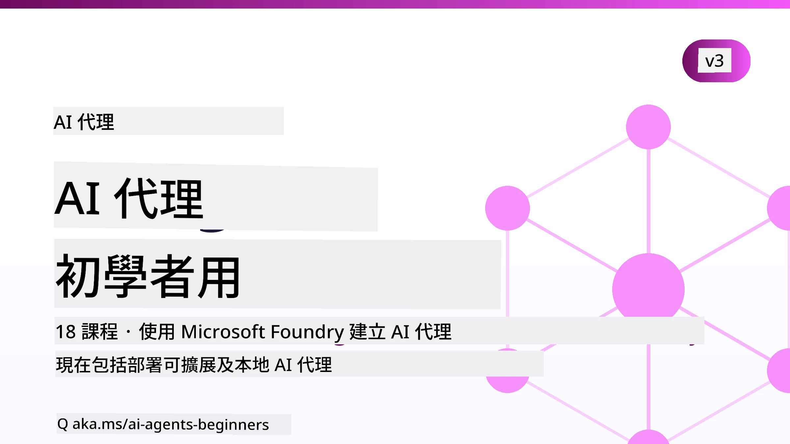

# AI Agents 初學者課程



## 教授你建立 AI Agents 所需知識的課程

[](https://github.com/microsoft/ai-agents-for-beginners/blob/master/LICENSE?WT.mc_id=academic-105485-koreyst)
[](https://GitHub.com/microsoft/ai-agents-for-beginners/graphs/contributors/?WT.mc_id=academic-105485-koreyst)
[](https://GitHub.com/microsoft/ai-agents-for-beginners/issues/?WT.mc_id=academic-105485-koreyst)
[](https://GitHub.com/microsoft/ai-agents-for-beginners/pulls/?WT.mc_id=academic-105485-koreyst)
[](http://makeapullrequest.com?WT.mc_id=academic-105485-koreyst)

### 🌐 多語言支援

#### 透過 GitHub Action 支援（自動且持續更新）

<!-- CO-OP TRANSLATOR LANGUAGES TABLE START -->
[Arabic](../ar/README.md) | [Bengali](../bn/README.md) | [Bulgarian](../bg/README.md) | [Burmese (Myanmar)](../my/README.md) | [Chinese (Simplified)](../zh-CN/README.md) | [Chinese (Traditional, Hong Kong)](./README.md) | [Chinese (Traditional, Macau)](../zh-MO/README.md) | [Chinese (Traditional, Taiwan)](../zh-TW/README.md) | [Croatian](../hr/README.md) | [Czech](../cs/README.md) | [Danish](../da/README.md) | [Dutch](../nl/README.md) | [Estonian](../et/README.md) | [Finnish](../fi/README.md) | [French](../fr/README.md) | [German](../de/README.md) | [Greek](../el/README.md) | [Hebrew](../he/README.md) | [Hindi](../hi/README.md) | [Hungarian](../hu/README.md) | [Indonesian](../id/README.md) | [Italian](../it/README.md) | [Japanese](../ja/README.md) | [Kannada](../kn/README.md) | [Khmer](../km/README.md) | [Korean](../ko/README.md) | [Lithuanian](../lt/README.md) | [Malay](../ms/README.md) | [Malayalam](../ml/README.md) | [Marathi](../mr/README.md) | [Nepali](../ne/README.md) | [Nigerian Pidgin](../pcm/README.md) | [Norwegian](../no/README.md) | [Persian (Farsi)](../fa/README.md) | [Polish](../pl/README.md) | [Portuguese (Brazil)](../pt-BR/README.md) | [Portuguese (Portugal)](../pt-PT/README.md) | [Punjabi (Gurmukhi)](../pa/README.md) | [Romanian](../ro/README.md) | [Russian](../ru/README.md) | [Serbian (Cyrillic)](../sr/README.md) | [Slovak](../sk/README.md) | [Slovenian](../sl/README.md) | [Spanish](../es/README.md) | [Swahili](../sw/README.md) | [Swedish](../sv/README.md) | [Tagalog (Filipino)](../tl/README.md) | [Tamil](../ta/README.md) | [Telugu](../te/README.md) | [Thai](../th/README.md) | [Turkish](../tr/README.md) | [Ukrainian](../uk/README.md) | [Urdu](../ur/README.md) | [Vietnamese](../vi/README.md)

> **想要本地克隆？**
>
> 本倉庫含有 50 多種語言翻譯，會顯著增加下載大小。若只想克隆無翻譯版本，請使用稀疏檢出：
>
> **Bash / macOS / Linux：**
> ```bash
> git clone --filter=blob:none --sparse https://github.com/microsoft/ai-agents-for-beginners.git
> cd ai-agents-for-beginners
> git sparse-checkout set --no-cone '/*' '!translations' '!translated_images'
> ```
>
> **CMD (Windows)：**
> ```cmd
> git clone --filter=blob:none --sparse https://github.com/microsoft/ai-agents-for-beginners.git
> cd ai-agents-for-beginners
> git sparse-checkout set --no-cone "/*" "!translations" "!translated_images"
> ```
>
> 這會讓你以更快下載速度取得完成課程所需的一切。
<!-- CO-OP TRANSLATOR LANGUAGES TABLE END -->

**若你希望支援更多翻譯語言，請參考[此處](https://github.com/Azure/co-op-translator/blob/main/getting_started/supported-languages.md)。**

[](https://GitHub.com/microsoft/ai-agents-for-beginners/watchers/?WT.mc_id=academic-105485-koreyst)
[](https://GitHub.com/microsoft/ai-agents-for-beginners/network/?WT.mc_id=academic-105485-koreyst)
[](https://GitHub.com/microsoft/ai-agents-for-beginners/stargazers/?WT.mc_id=academic-105485-koreyst)

[](https://discord.com/invite/ATgtXmAS5D)


## 🌱 入門指南

本課程包含有關建立 AI Agents 基礎知識的課程內容。每個單元涵蓋不同主題，你可以從任何一課開始學習！

本課程支持多種語言。請參閱我們的[可用語言列表](#-multi-language-support)。

若你是首次使用生成式 AI 模型，請參考我們的[生成式 AI 初學者課程](https://aka.ms/genai-beginners)，內含 21 個教學單元，專注於運用 GenAI 建置。

別忘了[給此倉庫點亮星星 (🌟)](https://docs.github.com/en/get-started/exploring-projects-on-github/saving-repositories-with-stars?WT.mc_id=academic-105485-koreyst)，並[派生此倉庫](https://github.com/microsoft/ai-agents-for-beginners/fork)以運行程式碼。

### 與其他學習者交流，獲得問題解答

若你在建立 AI Agents 過程中遇到問題，歡迎加入我們專門的 Discord 頻道，位置在 [Microsoft Foundry Discord](https://aka.ms/ai-agents/discord)。

### 你所需準備

本課程的每個單元均包含程式碼範例，這些範例位於 code_samples 資料夾。你可[派生此倉庫](https://github.com/microsoft/ai-agents-for-beginners/fork)以建立自己的副本。

這些練習的程式碼範例使用 Microsoft Agent Framework 與 Microsoft Foundry Agent Service V2。

- [Microsoft Foundry](https://aka.ms/ai-agents-beginners/ai-foundry) - 需要 Azure 帳號

本課程使用以下 Microsoft AI Agent 框架與服務：

- [Microsoft Agent Framework (MAF)](https://learn.microsoft.com/agent-framework/overview/)
- [Microsoft Foundry Agent Service V2](https://aka.ms/ai-agents-beginners/ai-agent-service)

部分程式碼範例還支援其他符合 OpenAI 規範的服務商，例如提供大上下文模型（可達 204K 令牌）的 [MiniMax](https://platform.minimaxi.com/)，詳情請參考[課程設置](./00-course-setup/README.md)。

欲了解本課程程式碼操作詳情，請見[課程設置](./00-course-setup/README.md)。

## 🙏 想幫忙嗎？

若你有建議，或發現拼字或程式碼錯誤，請[提出問題](https://github.com/microsoft/ai-agents-for-beginners/issues?WT.mc_id=academic-105485-koreyst)或[建立拉取請求](https://github.com/microsoft/ai-agents-for-beginners/pulls?WT.mc_id=academic-105485-koreyst)


## 📂 每課包含

- 置於 README 的文字教學與簡短影片
- 使用 Microsoft Agent Framework 及 Microsoft Foundry 的 Python 程式碼範例
- 連結更多資源，持續學習


## 🗃️ 課程列表

| <strong>課程</strong>                                  | <strong>文字與程式碼</strong>                                   | <strong>影片</strong>                                                  | <strong>額外學習資源</strong>                                                                       |
|------------------------------------------|----------------------------------------------------|------------------------------------------------------------|----------------------------------------------------------------------------------------|
| AI Agents 介紹及應用場景                  | [連結](./01-intro-to-ai-agents/README.md)          | [影片](https://youtu.be/3zgm60bXmQk?si=z8QygFvYQv-9WtO1)  | [連結](https://aka.ms/ai-agents-beginners/collection?WT.mc_id=academic-105485-koreyst)  |
| 探索 AI Agent 框架                        | [連結](./02-explore-agentic-frameworks/README.md)  | [影片](https://youtu.be/ODwF-EZo_O8?si=Vawth4hzVaHv-u0H)  | [連結](https://aka.ms/ai-agents-beginners/collection?WT.mc_id=academic-105485-koreyst)  |
| 了解 AI Agent 設計模式                    | [連結](./03-agentic-design-patterns/README.md)     | [影片](https://youtu.be/m9lM8qqoOEA?si=BIzHwzstTPL8o9GF)  | [連結](https://aka.ms/ai-agents-beginners/collection?WT.mc_id=academic-105485-koreyst)  |
| 工具使用設計模式                         | [連結](./04-tool-use/README.md)                    | [影片](https://youtu.be/vieRiPRx-gI?si=2z6O2Xu2cu_Jz46N)  | [連結](https://aka.ms/ai-agents-beginners/collection?WT.mc_id=academic-105485-koreyst)  |
| Agentic RAG                              | [連結](./05-agentic-rag/README.md)                 | [影片](https://youtu.be/WcjAARvdL7I?si=gKPWsQpKiIlDH9A3)  | [連結](https://aka.ms/ai-agents-beginners/collection?WT.mc_id=academic-105485-koreyst)  |
| 建立值得信賴的 AI Agents                 | [連結](./06-building-trustworthy-agents/README.md) | [影片](https://youtu.be/iZKkMEGBCUQ?si=jZjpiMnGFOE9L8OK ) | [連結](https://aka.ms/ai-agents-beginners/collection?WT.mc_id=academic-105485-koreyst)  |
| 規劃設計模式                            | [連結](./07-planning-design/README.md)             | [影片](https://youtu.be/kPfJ2BrBCMY?si=6SC_iv_E5-mzucnC)  | [連結](https://aka.ms/ai-agents-beginners/collection?WT.mc_id=academic-105485-koreyst)  |
| 多 Agent 設計模式                       | [連結](./08-multi-agent/README.md)                 | [影片](https://youtu.be/V6HpE9hZEx0?si=rMgDhEu7wXo2uo6g)  | [連結](https://aka.ms/ai-agents-beginners/collection?WT.mc_id=academic-105485-koreyst)  |

| 元認知設計模式                             | [Link](./09-metacognition/README.md)               | [Video](https://youtu.be/His9R6gw6Ec?si=8gck6vvdSNCt6OcF)  | [Link](https://aka.ms/ai-agents-beginners/collection?WT.mc_id=academic-105485-koreyst) |
| 生產環境中的 AI 代理                      | [Link](./10-ai-agents-production/README.md)        | [Video](https://youtu.be/l4TP6IyJxmQ?si=31dnhexRo6yLRJDl)  | [Link](https://aka.ms/ai-agents-beginners/collection?WT.mc_id=academic-105485-koreyst) |
| 使用代理協議（MCP、A2A 和 NLWeb）         | [Link](./11-agentic-protocols/README.md)           | [Video](https://youtu.be/X-Dh9R3Opn8)                                 | [Link](https://aka.ms/ai-agents-beginners/collection?WT.mc_id=academic-105485-koreyst) |
| AI 代理的上下文工程                      | [Link](./12-context-engineering/README.md)         | [Video](https://youtu.be/F5zqRV7gEag)                                 | [Link](https://aka.ms/ai-agents-beginners/collection?WT.mc_id=academic-105485-koreyst) |
| 管理代理記憶體                            | [Link](./13-agent-memory/README.md)     |      [Video](https://youtu.be/QrYbHesIxpw?si=vZkVwKrQ4ieCcIPx)                                                      |                                                                                        |
| 探索 Microsoft Agent Framework            | [Link](./14-microsoft-agent-framework/README.md)                            |                                                            |                                                                                        |
| 建立電腦使用代理（CUA）                   | [Link](./15-browser-use/README.md)     |                                                            | [Link](https://docs.browser-use.com/examples/templates/playwright-integration)         |
| 部署可擴充式代理                        | [Link](./16-deploying-scalable-agents/README.md) |                                                    | [Link](https://learn.microsoft.com/azure/ai-foundry/agents/overview)                   |
| 建立本地 AI 代理                         | [Link](./17-creating-local-ai-agents/README.md)  |                                                    | [Link](https://learn.microsoft.com/azure/ai-foundry/foundry-local/)                    |
| 確保 AI 代理安全                        | [Link](./18-securing-ai-agents/README.md)  |                                                            | [Link](https://aka.ms/ai-agents-beginners/collection?WT.mc_id=academic-105485-koreyst) |

## 🎒 其他課程

我們團隊還製作了其他課程！快來看看：

<!-- CO-OP TRANSLATOR OTHER COURSES START -->
### LangChain
[](https://aka.ms/langchain4j-for-beginners)
[](https://aka.ms/langchainjs-for-beginners?WT.mc_id=m365-94501-dwahlin)
[](https://github.com/microsoft/langchain-for-beginners?WT.mc_id=m365-94501-dwahlin)
---

### Azure / Edge / MCP / 代理
[](https://github.com/microsoft/AZD-for-beginners?WT.mc_id=academic-105485-koreyst)
[](https://github.com/microsoft/edgeai-for-beginners?WT.mc_id=academic-105485-koreyst)
[](https://github.com/microsoft/mcp-for-beginners?WT.mc_id=academic-105485-koreyst)
[](https://github.com/microsoft/ai-agents-for-beginners?WT.mc_id=academic-105485-koreyst)

---
 
### 生成式 AI 系列
[](https://github.com/microsoft/generative-ai-for-beginners?WT.mc_id=academic-105485-koreyst)
[-9333EA?style=for-the-badge&labelColor=E5E7EB&color=9333EA)](https://github.com/microsoft/Generative-AI-for-beginners-dotnet?WT.mc_id=academic-105485-koreyst)
[-C084FC?style=for-the-badge&labelColor=E5E7EB&color=C084FC)](https://github.com/microsoft/generative-ai-for-beginners-java?WT.mc_id=academic-105485-koreyst)
[-E879F9?style=for-the-badge&labelColor=E5E7EB&color=E879F9)](https://github.com/microsoft/generative-ai-with-javascript?WT.mc_id=academic-105485-koreyst)

---
 
### 核心學習
[](https://aka.ms/ml-beginners?WT.mc_id=academic-105485-koreyst)
[](https://aka.ms/datascience-beginners?WT.mc_id=academic-105485-koreyst)
[](https://aka.ms/ai-beginners?WT.mc_id=academic-105485-koreyst)
[](https://github.com/microsoft/Security-101?WT.mc_id=academic-96948-sayoung)
[](https://aka.ms/webdev-beginners?WT.mc_id=academic-105485-koreyst)
[](https://aka.ms/iot-beginners?WT.mc_id=academic-105485-koreyst)
[](https://github.com/microsoft/xr-development-for-beginners?WT.mc_id=academic-105485-koreyst)

---
 
### Copilot 系列
[](https://aka.ms/GitHubCopilotAI?WT.mc_id=academic-105485-koreyst)
[](https://github.com/microsoft/mastering-github-copilot-for-dotnet-csharp-developers?WT.mc_id=academic-105485-koreyst)
[](https://github.com/microsoft/CopilotAdventures?WT.mc_id=academic-105485-koreyst)
<!-- CO-OP TRANSLATOR OTHER COURSES END -->

## 🌟 社群感謝

感謝 [Shivam Goyal](https://www.linkedin.com/in/shivam2003/) 貢獻展示代理式 RAG 的重要程式碼範例。

## 貢獻

本專案歡迎各種貢獻與建議。 大多數貢獻需要你同意一份
貢獻者授權協議（CLA），聲明你有權利，且確實將授權給我們
使用你的貢獻。詳情請參閱 <https://cla.opensource.microsoft.com>。

當你提交拉取請求時，CLA 機器人會自動判斷你是否需要提供
CLA 並適當標記 PR（例如狀態檢查、評論）。只需依指示操作即可。
使用我們的 CLA，只需在所有倉庫中完成一次。

本專案已採用 [Microsoft Open Source Code of Conduct](https://opensource.microsoft.com/codeofconduct/)。
詳情請參閱 [行為準則常見問題](https://opensource.microsoft.com/codeofconduct/faq/) 或
聯絡 [opencode@microsoft.com](mailto:opencode@microsoft.com) 提出更多問題或建議。

## 商標

本專案可能包含專案、產品或服務的商標或標誌。授權使用 Microsoft
商標或標誌須遵守
[Microsoft 的商標與品牌指導原則](https://www.microsoft.com/legal/intellectualproperty/trademarks/usage/general)。
在修改版本中使用 Microsoft 商標或標誌不得引起混淆或暗示 Microsoft 的贊助。
使用第三方商標或標誌須遵守該第三方的相關政策。

## 獲取協助


若遇到困難或對建構 AI 應用有疑問，歡迎加入：

[](https://aka.ms/foundry/discord)

若對產品有意見或遇到錯誤，請造訪：

[](https://aka.ms/foundry/forum)

---

<!-- CO-OP TRANSLATOR DISCLAIMER START -->
**免責聲明**：
本文件由 AI 翻譯服務 [Co-op Translator](https://github.com/Azure/co-op-translator) 翻譯而成。雖然我們致力於確保準確性，但請注意，機器自動翻譯可能包含錯誤或不準確之處。原始文件的母語版本應被視為權威來源。對於重要資訊，建議進行專業人工翻譯。我們不對因使用本翻譯而產生的任何誤解或誤釋承擔責任。
<!-- CO-OP TRANSLATOR DISCLAIMER END -->