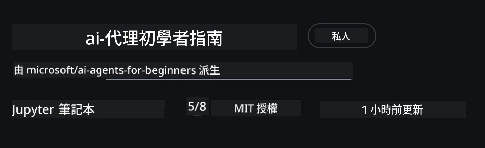
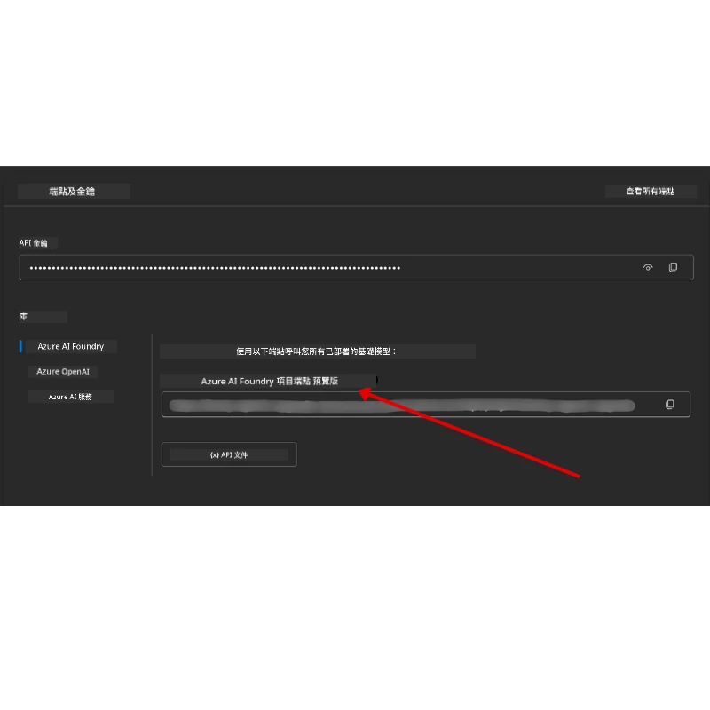

# 課程設定

## 介紹

本課將說明如何執行本課程的程式碼範例。

## 加入其他學習者並取得協助

在開始複製你的儲存庫之前，請加入 [初學者 AI Agents Discord 頻道](https://aka.ms/ai-agents/discord) 以取得設定協助、詢問課程相關問題或與其他學習者聯繫。

## 複製或派生（Fork）此儲存庫

首先，請複製或派生（fork）此 GitHub 儲存庫。這會建立你自己的課程教材版本，讓你可以執行、測試及調整程式碼！

這可以透過點擊連結到 <a href="https://github.com/microsoft/ai-agents-for-beginners/fork" target="_blank">派生此儲存庫</a> 來完成

你現在應該在以下連結看到你已派生的課程儲存庫：



### 淺層複製（建議用於工作坊 / Codespaces）

  >整個儲存庫在下載完整歷史記錄與所有檔案時可能很大（約 ~3 GB）。如果你只是參加工作坊或只需要幾個課程資料夾，淺層複製（或稀疏複製）透過截斷歷史或跳過 blob 可避免大部分下載。

#### 快速淺層複製 — 最少歷史，所有檔案

請將下列指令中的 `<your-username>` 替換為你的 fork URL（或上游 URL，如你偏好）。

若只複製最近的提交歷史（下載量較小）：

```bash|powershell
git clone --depth 1 https://github.com/<your-username>/ai-agents-for-beginners.git
```

要複製特定分支：

```bash|powershell
git clone --depth 1 --branch <branch-name> https://github.com/<your-username>/ai-agents-for-beginners.git
```

#### 部分（稀疏）複製 — 最少 blob 並僅選取特定資料夾

這使用 partial clone 與 sparse-checkout（需要 Git 2.25+，建議使用具 partial clone 支援的現代 Git）：

```bash|powershell
git clone --depth 1 --filter=blob:none --sparse https://github.com/<your-username>/ai-agents-for-beginners.git
```

進入儲存庫資料夾：

```bash|powershell
cd ai-agents-for-beginners
```

然後指定你想要的資料夾（下例顯示兩個資料夾）：

```bash|powershell
git sparse-checkout set 00-course-setup 01-intro-to-ai-agents
```

完成複製並確認檔案後，如果你只需要檔案並想釋放空間（不保留 git 歷史），請刪除儲存庫的 metadata（💀無法復原 — 你將失去所有 Git 功能：無法提交、pull、push 或存取歷史）。

```bash
# zsh/bash
rm -rf .git
```

```powershell
# PowerShell
Remove-Item -Recurse -Force .git
```

#### 使用 GitHub Codespaces（建議以避免本機大量下載）

- 透過 [GitHub 使用者介面](https://github.com/codespaces) 為此儲存庫建立新的 Codespace。  

- 在新建立的 Codespace 終端機中，執行上面任一淺層/稀疏複製指令，只把你需要的課程資料夾帶入 Codespace 工作區。
- 選用：在 Codespaces 內複製完成後，移除 .git 以回收額外空間（參見上方的移除指令）。
- 注意：如果你偏好直接在 Codespaces 開啟此儲存庫（不額外複製），請注意 Codespaces 會構建 devcontainer 環境，可能仍會配置比你需要更多的資源。在新的 Codespace 內複製淺層副本可讓你更能控制磁碟使用量。

#### 小提示

- 如果想編輯/提交，務必將複製 URL 換成你的 fork。
- 如果之後需要更多歷史或檔案，你可以 fetch 它們或調整 sparse-checkout 以包含其他資料夾。

## 執行程式碼

本課程提供一系列 Jupyter Notebook，可供你執行以獲得建立 AI Agents 的實作經驗。

程式碼範例使用 **Microsoft Agent Framework (MAF)** 與 `AzureAIProjectAgentProvider`，它透過 **Microsoft Foundry** 連接到 **Azure AI Agent Service V2**（Responses API）。

所有 Python notebook 標示為 `*-python-agent-framework.ipynb`。

## 系統需求

- Python 3.12+
  - 注意：如果你沒有安裝 Python3.12，請務必安裝。接著使用 python3.12 建立你的 venv，以確保從 requirements.txt 安裝到正確版本的套件。
  
    >範例

    建立 Python venv 資料夾：

    ```bash|powershell
    python -m venv venv
    ```

    接著為以下環境啟用 venv：

    ```bash
    # zsh/bash
    source venv/bin/activate
    ```
  
    ```dos
    # Command Prompt for Windows
    venv\Scripts\activate
    ```

- .NET 10+: 對於使用 .NET 的範例程式碼，請確保你已安裝 [.NET 10 SDK](https://dotnet.microsoft.com/download/dotnet/10.0) 或更新版本。然後，檢查你已安裝的 .NET SDK 版本：

    ```bash|powershell
    dotnet --list-sdks
    ```

- **Azure CLI** — 驗證登入所需。請從 [aka.ms/installazurecli](https://aka.ms/installazurecli) 安裝。
- **Azure Subscription** — 以存取 Microsoft Foundry 與 Azure AI Agent Service。
- **Microsoft Foundry Project** — 一個已部署模型的專案（例如：`gpt-4o`）。請參閱下方的 [Step 1](../../../00-course-setup)。

我們已在此儲存庫根目錄包含 `requirements.txt` 檔案，內含執行程式碼範例所需的所有 Python 套件。

你可以在儲存庫根目錄的終端機執行下列指令來安裝它們：

```bash|powershell
pip install -r requirements.txt
```

我們建議建立 Python 虛擬環境以避免任何衝突或問題。

## 設定 VSCode

請確認在 VSCode 中使用的是正確版本的 Python。


## 設定 Microsoft Foundry 與 Azure AI Agent Service

### 第一步：建立 Microsoft Foundry 專案

你需要一個 Azure AI Foundry 的 **hub** 與 **project**，並部署好模型，才能執行這些 notebook。

1. 前往 [ai.azure.com](https://ai.azure.com) 並使用你的 Azure 帳戶登入。
2. 建立一個 **hub**（或使用現有的）。參考： [Hub 資源總覽](https://learn.microsoft.com/azure/ai-foundry/concepts/ai-resources)。
3. 在 hub 裡建立一個 **project**。
4. 從 **Models + Endpoints** → **Deploy model** 部署一個模型（例如 `gpt-4o`）。

### 第二步：取得你的專案端點與模型部署名稱

在 Microsoft Foundry 入口的你的專案中：

- **專案端點（Project Endpoint）** — 前往 **概覽（Overview）** 頁面並複製端點 URL。



- **模型部署名稱（Model Deployment Name）** — 前往 **Models + Endpoints**，選取你已部署的模型，並記下 **Deployment name**（例如：`gpt-4o`）。

### 第三步：使用 `az login` 登入 Azure

所有 notebook 使用 **`AzureCliCredential`** 來進行驗證 — 無需管理 API 金鑰。這需要你透過 Azure CLI 登入。

1. 如果尚未安裝，請**安裝 Azure CLI**： [aka.ms/installazurecli](https://aka.ms/installazurecli)

2. **登入**，執行：

    ```bash|powershell
    az login
    ```

    或者如果你身處沒有瀏覽器的遠端/Codespace 環境：

    ```bash|powershell
    az login --use-device-code
    ```

3. 如果出現提示，**選擇你的訂閱** — 選擇包含你 Foundry 專案的訂閱。

4. **驗證**你已登入：

    ```bash|powershell
    az account show
    ```

> **為什麼要使用 `az login`？** 這些 notebook 使用來自 `azure-identity` 套件的 `AzureCliCredential` 進行驗證。這表示你的 Azure CLI 工作階段會提供憑證 — 無需在 `.env` 檔案中管理 API 金鑰或秘密。這是一項 [安全性最佳實務](https://learn.microsoft.com/azure/developer/ai/keyless-connections)。

### 第四步：建立你的 `.env` 檔案

複製範例檔案：

```bash
# zsh/bash
cp .env.example .env
```

```powershell
# PowerShell
Copy-Item .env.example .env
```

開啟 `.env` 並填入下列兩個數值：

```env
AZURE_AI_PROJECT_ENDPOINT=https://<your-project>.services.ai.azure.com/api/projects/<your-project-id>
AZURE_AI_MODEL_DEPLOYMENT_NAME=gpt-4o
```

| 變數 | 在哪裡找到 |
|------|------------|
| `AZURE_AI_PROJECT_ENDPOINT` | Foundry portal → 你的專案 → **概覽** 頁面 |
| `AZURE_AI_MODEL_DEPLOYMENT_NAME` | Foundry portal → **Models + Endpoints** → 你部署模型的名稱 |

大多數課程就到這裡！notebook 將會透過你的 `az login` 工作階段自動完成驗證。

### 第五步：安裝 Python 相依套件

```bash|powershell
pip install -r requirements.txt
```

我們建議在先前建立的虛擬環境中執行此步驟。

## 第五課額外設定（Agentic RAG）

第 5 課使用 **Azure AI Search** 進行 retrieval-augmented generation。如果你打算執行該課程，請將這些變數加入你的 `.env` 檔案：

| 變數 | 在哪裡找到 |
|------|------------|
| `AZURE_SEARCH_SERVICE_ENDPOINT` | Azure 入口 → 你的 **Azure AI Search** 資源 → **概覽** → URL |
| `AZURE_SEARCH_API_KEY` | Azure 入口 → 你的 **Azure AI Search** 資源 → **Settings** → **Keys** → 主要管理金鑰 |

## 第六課與第八課額外設定（GitHub Models）

第 6 與第 8 課的一些 notebook 使用 **GitHub Models** 而非 Azure AI Foundry。如果你打算執行那些範例，請將這些變數加入你的 `.env` 檔案：

| 變數 | 在哪裡找到 |
|------|------------|
| `GITHUB_TOKEN` | GitHub → **設定（Settings）** → **開發人員設定（Developer settings）** → **個人存取權杖（Personal access tokens）** |
| `GITHUB_ENDPOINT` | 使用 `https://models.inference.ai.azure.com`（預設值） |
| `GITHUB_MODEL_ID` | 要使用的模型名稱（例如 `gpt-4o-mini`） |

## 第八課額外設定（Bing Grounding Workflow）

第 8 課中的條件式工作流程 notebook 使用透過 Azure AI Foundry 的 **Bing grounding**。如果你打算執行該範例，請在你的 `.env` 檔案中加入此變數：

| 變數 | 在哪裡找到 |
|------|------------|
| `BING_CONNECTION_ID` | Azure AI Foundry 入口 → 你的專案 → **管理（Management）** → **已連線資源（Connected resources）** → 你的 Bing 連線 → 複製連線 ID |

## 疑難排解

### macOS 的 SSL 憑證驗證錯誤

如果你在 macOS 遇到類似錯誤：

```plaintext
ssl.SSLCertVerificationError: [SSL: CERTIFICATE_VERIFY_FAILED] certificate verify failed: self-signed certificate in certificate chain
```

這是 macOS 上 Python 的已知問題，系統的 SSL 憑證未自動被信任。請依序嘗試下列解決方案：

**選項 1：執行 Python 的 Install Certificates 腳本（建議）**

```bash
# 將 3.XX 換成您已安裝的 Python 版本（例如：3.12 或 3.13）：
/Applications/Python\ 3.XX/Install\ Certificates.command
```

**選項 2：在 notebook 中使用 `connection_verify=False`（僅限 GitHub Models 的 notebook）**

在 Lesson 6 的 notebook（`06-building-trustworthy-agents/code_samples/06-system-message-framework.ipynb`）中，已包含一個被註解掉的替代做法。當建立 client 時，取消註解 `connection_verify=False`：

```python
client = ChatCompletionsClient(
    endpoint=endpoint,
    credential=AzureKeyCredential(token),
    connection_verify=False,  # 如果遇到憑證錯誤，請停用 SSL 驗證
)
```

> **⚠️ 警告：** 停用 SSL 驗證（`connection_verify=False`）會降低安全性，因為這會跳過憑證驗證。僅在開發環境中作為臨時權宜方法使用，切勿在生產環境使用。

**選項 3：安裝並使用 `truststore`**

```bash
pip install truststore
```

然後在 notebook 或腳本頂端、發出任何網路呼叫之前加入下列程式碼：

```python
import truststore
truststore.inject_into_ssl()
```

## 卡住了嗎？

如果你在執行此設定時遇到任何問題，請加入我們的 <a href="https://discord.gg/kzRShWzttr" target="_blank">Azure AI 社群 Discord</a> 或 <a href="https://github.com/microsoft/ai-agents-for-beginners/issues?WT.mc_id=academic-105485-koreyst" target="_blank">建立一個議題</a>。

## 下一課

你現在已準備好執行本課程的程式碼。祝你在 AI Agents 的世界中學習愉快！ 

[AI Agents 簡介與使用案例](../01-intro-to-ai-agents/README.md)

---

<!-- CO-OP TRANSLATOR DISCLAIMER START -->
**免責聲明**：
本文件已使用 AI 翻譯服務 [Co-op Translator](https://github.com/Azure/co-op-translator) 進行翻譯。儘管我們力求準確，但請注意，自動翻譯可能包含錯誤或不準確之處。原文（以原始語言撰寫之文件）應被視為權威版本。若涉及重要資訊，建議採用專業人工翻譯。我們對因使用本翻譯而引致的任何誤解或誤譯概不負責。
<!-- CO-OP TRANSLATOR DISCLAIMER END -->