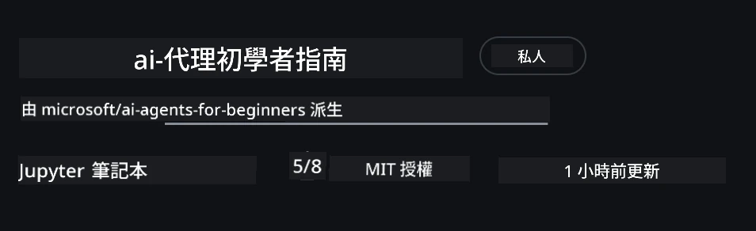
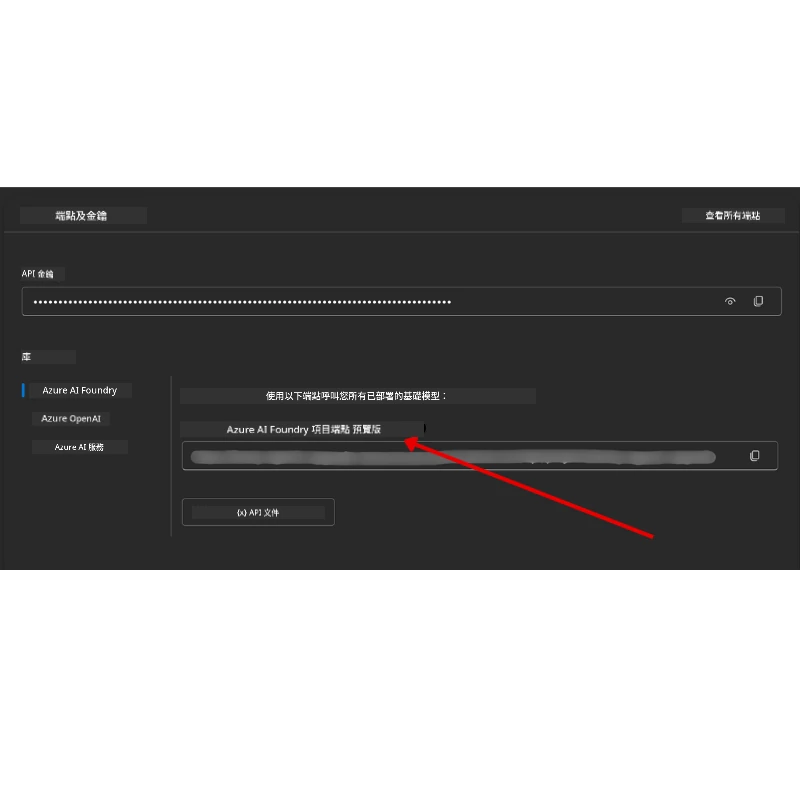

# 課程設置

## 介紹

本課程將介紹如何運行本課程的程式碼範例。

## 加入其他學習者並獲取幫助

在開始克隆您的庫之前，請加入[AI Agents For Beginners Discord 頻道](https://aka.ms/ai-agents/discord)以獲取任何有關設置的幫助、課程相關問題，或與其他學習者交流。

## 克隆或 Fork 本庫

開始之前，請克隆或 Fork GitHub 儲存庫。這將讓您擁有課程材料的自己的版本，可以運行、測試和調整程式碼！

您可以通過點擊此連結 <a href="https://github.com/microsoft/ai-agents-for-beginners/fork" target="_blank">fork the repo</a> 來完成此操作

您現在應該擁有自己 fork 出來的本課程版本，連結如下：



### 簡易克隆（推薦用於工作坊 / Codespaces）

  >完整存儲庫包含的歷史和所有檔案下載時可能很大（約3 GB）。如果您只是參加工作坊或只需要一些課程資料夾，簡易克隆（或稀疏克隆）會下載更少的資料。

#### 快速簡易克隆 — 最小歷史，所有檔案

將下列命令中的 `<your-username>` 替換為您的 fork URL（或您偏好的上游 URL）。

只克隆最新的提交歷史（下載量小）：

```bash
git clone --depth 1 https://github.com/<your-username>/ai-agents-for-beginners.git
```

克隆指定分支：

```bash
git clone --depth 1 --branch <branch-name> https://github.com/<your-username>/ai-agents-for-beginners.git
```

#### 部分（稀疏）克隆 — 最小 Blob + 只克隆選擇的資料夾

此方法使用部分克隆和 sparse-checkout（需要 Git 2.25+，建議使用支持部分克隆的現代 Git）：

```bash
git clone --depth 1 --filter=blob:none --sparse https://github.com/<your-username>/ai-agents-for-beginners.git
```

進入儲存庫資料夾：

```bash
cd ai-agents-for-beginners
```

然後指定您需要的資料夾（下面範例中示範兩個資料夾）：

```bash
git sparse-checkout set 00-course-setup 01-intro-to-ai-agents
```

克隆並驗證檔案後，如果您只需要檔案且想釋放空間（沒有 git 歷史），請刪除儲存庫的元資料（💀不可逆 — 您將失去所有 Git 功能）：

```bash
# zsh/bash
rm -rf .git
```

```powershell
# PowerShell
Remove-Item -Recurse -Force .git
```

#### 使用 GitHub Codespaces（推薦以避免本地大容量下載）

- 透過[GitHub UI](https://github.com/codespaces)為此儲存庫創建新的 Codespace。  

- 在新創建的 Codespace 終端機中，執行上述簡易/稀疏克隆指令，只帶入需要的課程資料夾到 Codespace 工作區。
- 選擇性：在 Codespaces 裡克隆後，可刪除 .git 釋放額外空間（見上方刪除指令）。
- 注意：若您偏好直接於 Codespaces 開啟儲存庫（無需額外克隆），請注意 Codespaces 會構建 devcontainer 環境，且可能仍配置超過您所需的檔案。

#### 小提示

- 若要編輯/提交，請務必用您的 fork URL 替換克隆 URL。
- 若之後需要更多歷史或檔案，可以抓取或調整 sparse-checkout 加入其他資料夾。

## 運行程式碼

本課程提供一系列可運行的 Jupyter 筆記本，讓您能實際體驗建構 AI 代理。

程式碼範例使用 **Microsoft Agent Framework (MAF)** 與 `FoundryChatClient`，透過 **Microsoft Foundry** 連接至 **Microsoft Foundry Agent Service V2**（Responses API）。

所有 Python 筆記本檔名均以 `*-python-agent-framework.ipynb` 命名。

## 環境需求

- Python 3.12+
  - <strong>注意</strong>：若您尚未安裝 Python3.12，請務必先安裝。然後用 python3.12 創建虛擬環境，確保從 requirements.txt 裝上正確版本。
  
    >範例

    創建 Python 虛擬環境資料夾：

    ```bash
    python -m venv venv
    ```

    然後啟動虛擬環境：

    ```bash
    # zsh/bash
    source venv/bin/activate
    ```
  
    ```dos
    # Command Prompt for Windows
    venv\Scripts\activate
    ```

- .NET 10+：若程式碼使用 .NET，請安裝 [.NET 10 SDK](https://dotnet.microsoft.com/download/dotnet/10.0) 或以上版本。再檢查 .NET SDK 版本：

    ```bash
    dotnet --list-sdks
    ```

- **Azure CLI** — 用於身份驗證。安裝請見 [aka.ms/installazurecli](https://aka.ms/installazurecli)。
- **Azure 訂閱** — 用於存取 Microsoft Foundry 和 Microsoft Foundry Agent Service。
- **Microsoft Foundry 專案** — 需有已部署模型的專案（例如 `gpt-5-mini`）。詳見下方 [步驟1](#步驟1：創建-microsoft-foundry-專案)。

本儲存庫根目錄含有 `requirements.txt` 檔案，內含運行程式碼範例所需所有 Python 套件。

您可以在儲存庫根目錄的終端機運行以下命令安裝：

```bash
pip install -r requirements.txt
```

建議創建 Python 虛擬環境，避免衝突和問題。

## 設定 VSCode

請確認 VSCode 工具中使用的是正確版本的 Python。


## 設定 Microsoft Foundry 與 Microsoft Foundry Agent Service

### 步驟1：創建 Microsoft Foundry 專案

您需要有一個 Microsoft Foundry <strong>集線器</strong> 和 <strong>專案</strong>，且該專案已部署模型，才能運行筆記本。

1. 前往 [ai.azure.com](https://ai.azure.com) 並使用您的 Azure 帳戶登入。
2. 創建一個 <strong>集線器</strong>（或使用現有的）。參考：[Hub 資源概覽](https://learn.microsoft.com/azure/ai-foundry/concepts/ai-resources)。
3. 在集線器內創建一個 <strong>專案</strong>。
4. 從 **Models + Endpoints** → **Deploy model** 部署一個模型（如 `gpt-5-mini`）。

### 步驟2：取得您的專案端點及模型部署名稱

在 Microsoft Foundry 入口網站中您的專案：

- <strong>專案端點</strong> — 前往 **Overview** 頁面並複製端點 URL。



- <strong>模型部署名稱</strong> — 前往 **Models + Endpoints**，選擇已部署模型，並記下 **Deployment name**（如 `gpt-5-mini`）。

### 步驟3：登入 Azure 使用 `az login`

多數筆記本使用您的 **Azure CLI 登入** 進行驗證 — 透過 `azure-identity` 套件的 `AzureCliCredential` 或 `DefaultAzureCredential`（兩者都會使用您的 `az login` 會話）— 不需 API 金鑰。少數課程和選擇性集成使用 API 金鑰；請檢查各課程先決條件以獲取額外環境變數。此步需要您使用 Azure CLI 登入。

1. 若尚未安裝，請安裝 Azure CLI：[aka.ms/installazurecli](https://aka.ms/installazurecli)

2. 執行登入：

    ```bash
    az login
    ```

    若身處無瀏覽器的遠端或 Codespace 環境：

    ```bash
    az login --use-device-code
    ```

3. 若有提示，<strong>選擇您的訂閱</strong> — 選擇含有您的 Foundry 專案的訂閱。

4. <strong>確認</strong>您已登入：

    ```bash
    az account show
    ```

> **為何要用 `az login`？** 筆記本透過 `azure-identity` 套件的 `AzureCliCredential`（或 `DefaultAzureCredential`，也會取得您的 Azure CLI 登入）進行認證。因此您的 Azure CLI 會話提供憑證 — 無需將 API 金鑰或秘密存放於 `.env` 檔案。這是[安全最佳實務](https://learn.microsoft.com/azure/developer/ai/keyless-connections)。

### 步驟4：創建 `.env` 檔案

複製範例檔案：

```bash
# zsh/bash
cp .env.example .env
```

```powershell
# PowerShell
Copy-Item .env.example .env
```

開啟 `.env` 並填入以下兩個值：

```env
AZURE_AI_PROJECT_ENDPOINT=https://<your-project>.services.ai.azure.com/api/projects/<your-project-id>
AZURE_AI_MODEL_DEPLOYMENT_NAME=gpt-5-mini
```

| 變數 | 取得位置 |
|----------|-----------------|
| `AZURE_AI_PROJECT_ENDPOINT` | Foundry 入口網站 → 您的專案 → **Overview** 頁面 |
| `AZURE_AI_MODEL_DEPLOYMENT_NAME` | Foundry 入口網站 → **Models + Endpoints** → 您部署的模型名稱 |

大多數課程就到此為止！筆記本將自動透過您的 `az login` 會話驗證。

### 步驟5：安裝 Python 依賴

```bash
pip install -r requirements.txt
```

建議在之前創建的虛擬環境中執行此命令。

## 選用設置：Azure AI Search（第5及第16課）

第5課（Agentic RAG）與第16課筆記本預設使用<strong>記憶體中知識庫</strong> — 無需額外 Azure 資源。若您想搭配真實<strong>Azure AI Search</strong>索引，需注意第16課筆記本目前採用基於金鑰的身份驗證：當且僅當同時設定 `AZURE_SEARCH_SERVICE_ENDPOINT` 與 `AZURE_SEARCH_API_KEY` 時，才從記憶體搜索切換至 Azure AI Search，否則仍使用記憶體搜索 — 因此若要在真實索引上運行，必須設定管理金鑰。課程其他部分和示範均使用 Azure Entra ID 的無金鑰身份驗證（RBAC），這是推薦的生產代碼方式，與全課程使用的 `az login` 流程一致。

下述 RBAC 設置步驟適用於本設置指南示範和您自己的程式碼。它們不會令第16課筆記本支持無金鑰身份驗證；第16課仍需同時設定端點和管理金鑰才能使用 Azure AI Search。

1. **啟用角色型存取控制（RBAC）** 在您的搜索服務上：

    ```bash
    az search service update --name <service-name> --resource-group <resource-group> --auth-options aadOrApiKey
    ```

2. <strong>指派自己所需角色</strong>（建立/載入索引及查詢）：

    ```bash
    az role assignment create --assignee <your-user-or-principal-id> --role "Search Service Contributor" --scope $(az search service show -g <resource-group> -n <service-name> --query id -o tsv)
    az role assignment create --assignee <your-user-or-principal-id> --role "Search Index Data Contributor" --scope $(az search service show -g <resource-group> -n <service-name> --query id -o tsv)
    ```

3. **將端點加入您的 `.env` 檔案：**

| 變數 | 取得位置 |
|----------|-----------------|
| `AZURE_SEARCH_SERVICE_ENDPOINT` | Azure 入口網站 → 您的 **Azure AI Search** 資源 → **Overview** → URL |
| `AZURE_SEARCH_API_KEY` | 必須與端點一起設定才能使第16課筆記本啟用 Azure AI Search，該筆記本是基於金鑰認證。Azure 入口網站 → <strong>設定</strong> → <strong>金鑰</strong> → 主要管理金鑰 |

> **為何使用無金鑰？** 管理金鑰賦予您搜索服務的完整寫入權限，且有可能透過 `.env` 檔案洩漏。使用 RBAC，您的 `az login` 身份將替代金鑰 — 這也就是課程筆記本利用的無金鑰 Entra ID 模式（透過 `AzureCliCredential` / `DefaultAzureCredential`），詳見[使用角色連接 Azure AI Search](https://learn.microsoft.com/azure/search/search-security-rbac)。

請參考 [Azure AI Search 設定指南](./AzureSearch.md) 以取得 Python 和 .NET 的完整索引建立範例。

## 面向直接呼叫 Azure OpenAI 的額外設置（第6及第8課）

第6及第8課的一些筆記本直接呼叫 **Azure OpenAI**（使用 **Responses API**），未經 Microsoft Foundry 專案。本範例之前使用 GitHub Models，該服務已棄用且不支援 Responses API。請將以下變數加到 `.env` 檔案：

| 變數 | 取得位置 |
|----------|-----------------|
| `AZURE_OPENAI_ENDPOINT` | Azure入口網站 → 您的 **Azure OpenAI** 資源 → **Keys and Endpoint** → Endpoint（例如 `https://<your-resource>.openai.azure.com`） |
| `AZURE_OPENAI_DEPLOYMENT` | 您所部署支持 Responses API 的模型名稱（例如 `gpt-5-mini`） |
| `AZURE_OPENAI_API_KEY` | 選用 — 若您使用基於金鑰的身份驗證而非 `az login` / Entra ID |

> Responses API 使用穩定的 `/openai/v1/` 端點，無需 `api-version`。請使用 `az login` 以支持無金鑰 Entra ID 認證。

## 替代提供者：MiniMax（兼容 OpenAI）

[MiniMax](https://platform.minimaxi.com/) 提供大上下文模型（最高204K字元）透過兼容 OpenAI 的 API，由於 Microsoft Agent Framework 的 `OpenAIChatClient` 可連接任何兼容 OpenAI 端點，您可以將 MiniMax 作為使用 `OpenAIChatClient` 的課程範例的替代方案。

把這些變數加入 `.env` 檔案：

| 變數 | 取得位置 |
|----------|-----------------|
| `MINIMAX_API_KEY` | [MiniMax 平台](https://platform.minimaxi.com/) → API 金鑰 |
| `MINIMAX_BASE_URL` | 使用 `https://api.minimax.io/v1`（預設值） |
| `MINIMAX_MODEL_ID` | 使用之模型名稱（如 `MiniMax-M3`） |

<strong>示例模型</strong>：`MiniMax-M3`（推薦）、`MiniMax-M2.7`、`MiniMax-M2.7-highspeed`（回應較快）。模型名稱和可用項目可能隨時間變動，且存取可能依帳戶而異。

使用 `OpenAIChatClient` 的程式碼範例（例如第14課的飯店預訂工作流程）會在設定了 `MINIMAX_API_KEY` 時自動偵測並使用您的 MiniMax 設定。


## 替代供應商：Foundry Local（於本機運行模型）

[Foundry Local](https://foundrylocal.ai) 是一個輕量級運行時，能夠透過與 OpenAI 相容的 API，<strong>完全在你的電腦上</strong>下載、管理及提供語言模型，無需雲端。

因為 Microsoft Agent Framework 的 `OpenAIChatClient` 支援任何與 OpenAI 相容的端點，Foundry Local 是 Azure OpenAI 的本地替代方案。

**1. 安裝 Foundry Local**

```bash
# Windows（視窗作業系統）
winget install Microsoft.FoundryLocal

# macOS（蘋果作業系統）
brew install foundrylocal
```

**2. 下載並啟動模型**（同時啟動本地服務）：

```bash
foundry model list          # 查看可用模型
foundry model run phi-4-mini
```

**3. 安裝用於發現本地端點的 Python SDK：**

```bash
pip install foundry-local-sdk
```

**4. 指向 Microsoft Agent Framework 至你的本地模型：**

```python
from foundry_local import FoundryLocalManager
from agent_framework.openai import OpenAIChatClient

# 下載（如有需要）並本地提供模型，然後發現端點/端口。
manager = FoundryLocalManager("phi-4-mini")

chat_client = OpenAIChatClient(
    base_url=manager.endpoint,      # 例如 http://localhost:<port>/v1
    api_key=manager.api_key,        # Foundry Local 始終為「不需要」
    model_id=manager.get_model_info("phi-4-mini").id,
)

agent = chat_client.as_agent(
    name="LocalAgent",
    instructions="You are a helpful assistant running fully on-device.",
)
```

> **注意：** Foundry Local 提供一個與 OpenAI 相容的 <strong>聊天完成</strong> 端點。用於本地開發與離線場景。若需要完整的 **回應 API** 功能（狀態對話等），請使用 Azure OpenAI 或 Microsoft Foundry 專案。

## 第 8 課的額外設定（Bing 引導工作流程）

第 8 課的條件工作流程筆記本使用透過 Microsoft Foundry 的 **Bing 引導**。若打算執行該示例，請將此變數加入 `.env` 檔案：

| 變數 | 位置 |
|----------|-----------------|
| `BING_CONNECTION_ID` | Microsoft Foundry 入口網站 → 你的專案 → <strong>管理</strong> → <strong>已連接的資源</strong> → 你的 Bing 連線 → 複製連線 ID |

## 疑難排解

### macOS 上的 SSL 證書驗證錯誤

若你在 macOS 上遇到類似以下錯誤：

```plaintext
ssl.SSLCertVerificationError: [SSL: CERTIFICATE_VERIFY_FAILED] certificate verify failed: self-signed certificate in certificate chain
```

這是 macOS 上 Python 已知問題，系統的 SSL 證書不會自動被信任。請依序嘗試以下方案：

**方案 1：執行 Python 的 Install Certificates 腳本（推薦）**

```bash
# 將3.XX替換成你已安裝的Python版本（例如，3.12或3.13）：
/Applications/Python\ 3.XX/Install\ Certificates.command
```

**方案 2：在筆記本中使用 `connection_verify=False`（僅限 GitHub Models 筆記本）**

在第 6 課筆記本 (`06-building-trustworthy-agents/code_samples/06-system-message-framework.ipynb`) 已包含註解掉的解決方案。遇到證書錯誤時，取消註解 `connection_verify=False`：

```python
client = ChatCompletionsClient(
    endpoint=endpoint,
    credential=AzureKeyCredential(token),
    connection_verify=False,  # 如果您遇到證書錯誤，請禁用 SSL 驗證
)
```

> **⚠️ 警告：** 關閉 SSL 驗證（`connection_verify=False`）會跳過證書驗證，降低安全性。僅在開發環境中作為臨時解決方案。絕不可在生產環境使用。

**方案 3：安裝並使用 `truststore`**

```bash
pip install truststore
```

接著，在筆記本或腳本開頭於執行任何網絡呼叫前新增：

```python
import truststore
truststore.inject_into_ssl()
```

## 卡關了？

若執行這個設定時有任何問題，歡迎加入我們的 <a href="https://discord.gg/kzRShWzttr" target="_blank">Azure AI Community Discord</a> 或 <a href="https://github.com/microsoft/ai-agents-for-beginners/issues?WT.mc_id=academic-105485-koreyst" target="_blank">建立議題</a>。

## 下一課

你已準備好執行本課程的程式碼。祝你學習 AI 代理世界愉快！

[AI 代理介紹及代理應用案例](../01-intro-to-ai-agents/README.md)

---

<!-- CO-OP TRANSLATOR DISCLAIMER START -->
**免責聲明**：
本文件使用 AI 翻譯服務 [Co-op Translator](https://github.com/Azure/co-op-translator) 進行翻譯。雖然我們力求準確，但請注意，自動翻譯可能包含錯誤或不準確之處。原始文件的母語版本應被視為權威來源。對於重要資訊，建議尋求專業人工翻譯。我們不對因使用本翻譯而引起的任何誤解或曲解承擔責任。
<!-- CO-OP TRANSLATOR DISCLAIMER END -->