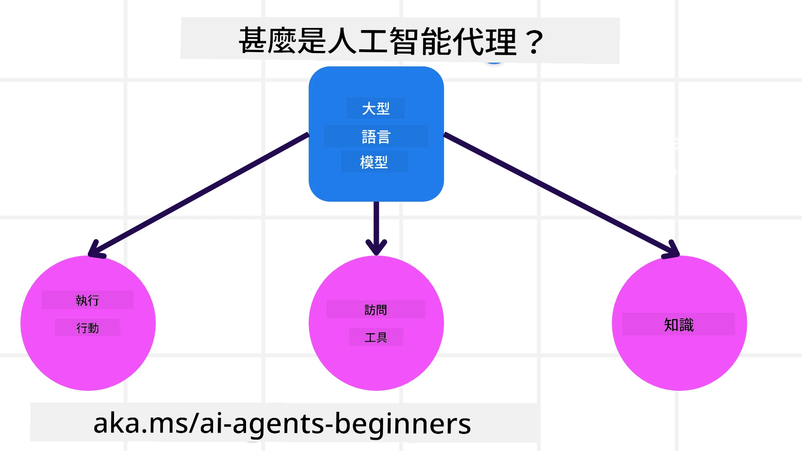
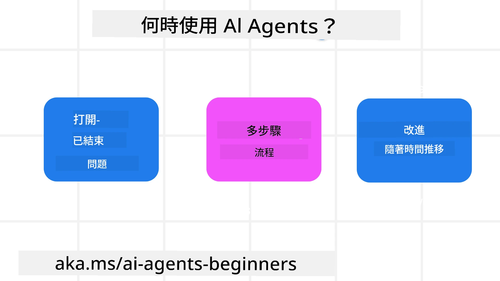

> _(點擊上方圖片以觀看本節課的影片)_

# AI 代理與代理使用案例簡介

歡迎來到「AI 代理初學者」課程！本課程提供建立 AI 代理的基礎知識與實作範例。

加入 <a href="https://discord.gg/kzRShWzttr" target="_blank">Azure AI Discord 社群</a>，與其他學習者和 AI 代理開發者交流，並就本課程提出您有的任何問題。

在開始本課程時，我們會先更深入了解什麼是 AI 代理，以及如何在我們所建構的應用程式與工作流程中使用它們。

## 介紹

本課涵蓋：

- 什麼是 AI 代理，以及不同類型的代理有哪些？
- 哪些使用案例最適合 AI 代理，以及它們如何協助我們？
- 在設計具代理特性的解決方案時，有哪些基本構件？

## 學習目標
完成本課後，您應該能夠：

- 了解 AI 代理的概念及其與其他 AI 解決方案的差異。
- 有效地應用 AI 代理。
- 針對使用者與客戶設計具生產力的代理解決方案。

## 定義 AI 代理與 AI 代理的類型

### 什麼是 AI 代理？

AI 代理是 **系統**，透過擴展 **大型語言模型(LLMs)** 的能力，賦予 LLMs **存取工具**與**知識**，從而能夠 **執行動作**。

讓我們把這個定義拆解成較小的部分：

- **系統** - 對代理人來說，不應只把它當作單一元件，而應視為由多個元件組成的系統。基本層級上，AI 代理的元件包括：
  - **環境** - AI 代理運作的定義空間。例如，若我們有一個旅遊訂票 AI 代理，環境可能是該代理用來完成任務的旅遊訂票系統。
  - **感測器** - 環境具有資訊並提供回饋。AI 代理使用感測器收集並解讀關於環境當前狀態的資訊。在旅遊訂票代理範例中，訂票系統可以提供諸如飯店可用性或機票價格等資訊。
  - **執行器** - 一旦 AI 代理收到環境的當前狀態，代理會根據當前任務決定要執行何種動作以改變環境。對於旅遊訂票代理而言，可能的動作是為使用者預訂可用房間。

**大型語言模型** - 代理的概念在 LLMs 出現之前就已存在。使用 LLMs 建置 AI 代理的優勢在於它們能夠理解人類語言與資料。這種能力使 LLMs 能夠解讀環境資訊並擬定改變環境的計畫。

**執行動作** - 在 AI 代理系統之外，LLMs 的能力通常限於根據使用者的提示產生內容或資訊。在 AI 代理系統內，LLMs 可以透過解讀使用者的請求並使用其環境可取得的工具來完成任務。

**存取工具** - LLM 可存取的工具由 1) 它所運作的環境以及 2) AI 代理的開發者來決定。就我們的旅遊代理範例，代理可使用的工具受限於訂票系統中可用的操作，或是開發者可能會限制代理僅能存取航班相關工具。

**記憶與知識** - 記憶在使用者與代理的對話上下文中可以是短期的。長期而言，除了環境提供的資訊之外，AI 代理也能從其他系統、服務、工具，甚至其他代理檢索知識。在旅遊代理範例中，這些知識可能是存放在客戶資料庫中的使用者旅遊偏好資訊。

### 不同類型的代理

現在我們已有 AI 代理的一般定義，讓我們看看一些特定的代理類型，以及它們如何應用在旅遊訂票 AI 代理上。

| **代理類型**                | **說明**                                                                                                                       | **範例**                                                                                                                                                                                                                   |
| ----------------------------- | ------------------------------------------------------------------------------------------------------------------------------------- | ----------------------------------------------------------------------------------------------------------------------------------------------------------------------------------------------------------------------------- |
| **簡單反射代理**      | 根據預先定義的規則執行即時動作。                                                                                  | 旅遊代理根據電子郵件的內容判斷並將旅遊相關的投訴轉給客服。                                                                                                                          |
| **基於模型的反射代理** | 根據世界模型及該模型的變化執行動作。                                                              | 旅遊代理根據可取得的歷史價格資料，優先處理那些價格變動顯著的路線。                                                                                                             |
| **目標導向代理**         | 透過解讀目標並決定達成目標所需的動作來制定計畫。                                  | 旅遊代理會根據從目前位置到目的地所需的交通安排（汽車、公共交通、航班等）來訂定並預訂完整旅程。                                                                                |
| **效用導向代理**      | 考量偏好並以數值方式權衡取捨以決定如何達成目標。                                               | 旅遊代理在訂票時會在便利性與成本之間權衡，以最大化整體效用。                                                                                                                                          |
| **學習型代理**           | 透過回應回饋並相應調整行為，隨時間改進。                                                        | 旅遊代理會使用旅後調查的顧客回饋來改善並調整未來的訂位策略。                                                                                                               |
| **階層式代理**       | 在分層系統中包含多個代理，高階代理將工作拆成子任務交由低階代理完成。 | 旅遊代理取消行程時，會將任務拆成子任務（例如取消特定預訂），由低階代理完成並回報給高階代理。                                     |
| **多代理系統 (MAS)** | 代理可獨立完成任務，彼此可能是合作或競爭關係。                                                           | 合作：多個代理分別負責預訂特定旅遊服務，如飯店、航班與娛樂活動。競爭：多個代理在共享的飯店預訂日曆上管理並競相為顧客訂房。 |

## 何時使用 AI 代理

在前述章節中，我們以旅遊代理的使用案例來說明不同類型的代理如何應用於旅遊訂票的不同情境。本課程中我們將持續使用此應用作為示例。

讓我們看看 AI 代理最適用的使用案例類型：

- **開放式問題** - 允許 LLM 決定完成任務所需的步驟，因為這些步驟未必能以工作流程硬編碼。
- **多步驟流程** - 需要較複雜處理的任務，其中 AI 代理需在多個回合中使用工具或資訊，而非一次性檢索。  
- **隨時間改進** - 代理能透過從環境或使用者那裡接收回饋來隨時間改進，以提供更高的效用。

我們會在「建立值得信賴的 AI 代理」課程中探討更多使用 AI 代理的考量。

## 具代理特性解決方案基礎

### 代理開發

設計 AI 代理系統的第一步是定義工具、動作與行為。本課程著重使用 **Azure AI Agent Service** 來定義我們的代理。它提供的功能包括：

- 可選擇的開放模型，例如 OpenAI、Mistral 與 Llama
- 透過像 Tripadvisor 這類供應商使用授權資料
- 使用標準化的 OpenAPI 3.0 工具

### 代理式模式

與 LLM 的溝通是透過提示。鑑於 AI 代理的半自主性質，在環境發生變化後並不總是能或需要手動重新提示 LLM。我們使用 **代理式模式** 讓我們能以更具擴充性的方式在多個步驟中提示 LLM。

本課程分成若干當前流行的代理式模式。

### 代理框架

代理框架讓開發者透過程式碼實現代理式模式。這些框架提供範本、外掛與工具以提升 AI 代理之間協作的能力。這些優勢還能提供更好的可觀察性與故障排除功能。

在本課程中，我們將探索 Microsoft Agent Framework (MAF)，以建構可投入生產的 AI 代理。

## 範例程式碼

- Python: [代理框架](./code_samples/01-python-agent-framework.ipynb)
- .NET: [代理框架](./code_samples/01-dotnet-agent-framework.md)

## 對 AI 代理還有更多問題嗎？

加入 [Microsoft Foundry Discord](https://aka.ms/ai-agents/discord) ，與其他學習者會面、參加辦公時間並獲得有關 AI 代理的問題解答。

## 前一課

[課程設定](../00-course-setup/README.md)

## 下一課

[探索代理框架](../02-explore-agentic-frameworks/README.md)

---

<!-- CO-OP TRANSLATOR DISCLAIMER START -->
免責聲明：
本文件由人工智能翻譯服務 Co‑op Translator（https://github.com/Azure/co-op-translator）自動翻譯。雖然我們力求準確，但請注意，自動翻譯可能包含錯誤或不準確之處。原始語言版本的文件應視為具權威性的來源。若涉及關鍵資訊，建議採用專業人工翻譯。對於因使用本翻譯而引致的任何誤解或曲解，我們概不負責。
<!-- CO-OP TRANSLATOR DISCLAIMER END -->