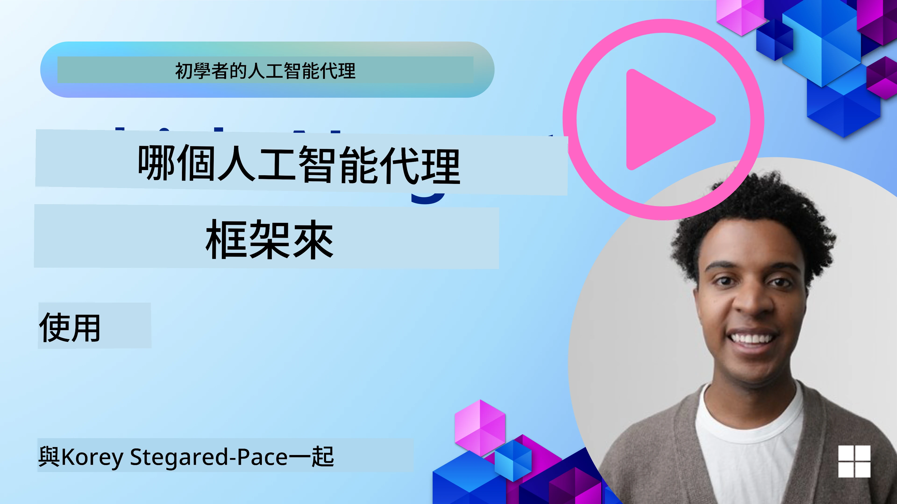

[](https://youtu.be/ODwF-EZo_O8?si=1xoy_B9RNQfrYdF7)

> _(點擊上方圖片以觀看本課程影片)_

# 探索 AI 代理人框架

AI 代理人框架是設計用來簡化 AI 代理人建立、部署與管理的軟體平台。這些框架為開發者提供預建的元件、抽象層和工具，以精簡複雜 AI 系統的開發流程。

這些框架透過提供針對 AI 代理人開發常見挑戰的標準化方法，協助開發者專注於應用程式的獨特面向。它們提升了在建立 AI 系統時的可擴充性、可及性與效率。

## 介紹 

本課程將涵蓋：

- AI 代理人框架是什麼，以及它們能讓開發者達成什麼？
- 團隊如何利用這些框架快速原型設計、反覆改善並提升代理人的能力？
- 由 Microsoft 所建立的框架與工具之間有何差異（<a href="https://aka.ms/ai-agents-beginners/ai-agent-service" target="_blank">Azure AI 代理人服務</a> 與 <a href="https://learn.microsoft.com/azure/ai-services/openai/how-to/responses" target="_blank">Microsoft 代理人框架</a>）？
- 我可以直接整合現有的 Azure 生態系工具，還是需要獨立的解決方案？
- 什麼是 Azure AI Agents 服務，它如何幫助我？

## 學習目標

本課程的目標是協助你理解：

- AI 代理人框架在 AI 開發中的角色。
- 如何利用 AI 代理人框架來建立智慧代理人。
- AI 代理人框架啟用的關鍵能力。
- Microsoft 代理人框架與 Azure AI 代理人服務之間的差異。

## 什麼是 AI 代理人框架？它們讓開發者能做什麼？

傳統的 AI 框架可以幫助你將 AI 整合到應用程式中，並在下列方面提升應用程式：

- **個人化**：AI 能分析使用者行為與偏好，提供個人化的推薦、內容與體驗。範例：像 Netflix 這類串流服務使用 AI 根據觀看記錄推薦電影與節目，提升使用者參與度與滿意度。
- **自動化與效率**：AI 可以自動化重複性任務、精簡工作流程，並改善營運效率。範例：客服應用程式使用 AI 驅動的聊天機器人處理常見詢問，減少回應時間，讓人工客服得以處理較複雜的問題。
- **提升使用者體驗**：AI 能透過語音辨識、自然語言處理與預測文字等智慧功能改善整體使用者體驗。範例：像 Siri 與 Google Assistant 的虛擬助理使用 AI 理解並回應語音指令，使使用者更容易與裝置互動。

### 聽起來都很棒，為什麼還需要 AI 代理人框架？

AI 代理人框架不僅僅是 AI 框架，它們的設計目的是讓開發者建立能與使用者、其他代理人以及環境互動以達成特定目標的智慧代理人。這些代理人可以展現自主行為、做出決策並適應不斷變化的情境。以下是 AI 代理人框架啟用的一些關鍵能力：

- **代理人協作與協調**：讓多個 AI 代理人能共同工作、彼此溝通並協調以解決複雜任務。
- **任務自動化與管理**：提供自動化多步驟工作流程、任務分派與代理人之間的動態任務管理機制。
- **情境理解與適應**：賦予代理人理解情境、適應變化環境並根據即時資訊做出決策的能力。

總結來說，代理人讓你能做更多事，把自動化提升到更高層次，建立能從環境中適應與學習的更智慧系統。

## 如何快速原型設計、反覆實作並提升代理人的能力？

這是一個快速演進的領域，但大多數 AI 代理人框架都有一些共通點，可以幫助你快速原型和反覆開發，主要包括模組化元件、協作工具與即時學習。以下深入說明這些項目：

- **使用模組化元件**：AI SDK 提供預建元件，例如 AI 與記憶體連接器、使用自然語言或程式碼外掛的函式呼叫、提示範本等。
- **利用協作工具**：設計具有特定角色與任務的代理人，讓它們測試並精練協作工作流程。
- **即時學習**：實作反饋回路，讓代理人從互動中學習並動態調整行為。

### 使用模組化元件

像 Microsoft 代理人框架 這類 SDK 提供預建元件，例如 AI 連接器、工具定義與代理人管理。

**團隊如何使用這些元件**：團隊可以快速組裝這些元件來建立功能原型，而不用從零開始，從而加速實驗與反覆開發。

**實務上如何運作**：你可以使用預建的解析器從使用者輸入中擷取資訊、使用記憶模組來儲存與檢索資料，並使用提示產生器與使用者互動，而無需從頭建構這些元件。

**範例程式碼**。讓我們看看如何使用 Microsoft 代理人框架 搭配 `AzureAIProjectAgentProvider`，使模型透過工具呼叫回應使用者輸入：

``` python
# Microsoft Agent 框架 Python 範例

import asyncio
import os
from typing import Annotated

from agent_framework.azure import AzureAIProjectAgentProvider
from azure.identity import AzureCliCredential


# 定義一個範例工具功能來預訂旅行
def book_flight(date: str, location: str) -> str:
    """Book travel given location and date."""
    return f"Travel was booked to {location} on {date}"


async def main():
    provider = AzureAIProjectAgentProvider(credential=AzureCliCredential())
    agent = await provider.create_agent(
        name="travel_agent",
        instructions="Help the user book travel. Use the book_flight tool when ready.",
        tools=[book_flight],
    )

    response = await agent.run("I'd like to go to New York on January 1, 2025")
    print(response)
    # 範例輸出：您於 2025 年 1 月 1 日飛往紐約的航班已成功預訂。祝旅途愉快！✈️🗽


if __name__ == "__main__":
    asyncio.run(main())
```

從此範例可以看出，如何利用預建的解析器從使用者輸入中擷取關鍵資訊，例如航班預訂請求的出發地、目的地與日期。這種模組化方法讓你能專注於高階邏輯。

### 利用協作工具

像 Microsoft 代理人框架 這類框架促進建立可共同工作的多個代理人。

**團隊如何使用這些**：團隊可以設計具有特定角色與任務的代理人，使其測試並精練協作工作流程，提升整體系統效率。

**實務上如何運作**：你可以建立一個代理人團隊，每個代理人都有專門功能，例如資料擷取、分析或決策。這些代理人可以互相溝通並分享資訊，以達成共同目標，例如回答使用者查詢或完成任務。

**範例程式碼（Microsoft 代理人框架）**：

```python
# 使用 Microsoft Agent Framework 建立多個協同工作的代理程式

import os
from agent_framework.azure import AzureAIProjectAgentProvider
from azure.identity import AzureCliCredential

provider = AzureAIProjectAgentProvider(credential=AzureCliCredential())

# 數據擷取代理
agent_retrieve = await provider.create_agent(
    name="dataretrieval",
    instructions="Retrieve relevant data using available tools.",
    tools=[retrieve_tool],
)

# 數據分析代理
agent_analyze = await provider.create_agent(
    name="dataanalysis",
    instructions="Analyze the retrieved data and provide insights.",
    tools=[analyze_tool],
)

# 按序執行代理來完成任務
retrieval_result = await agent_retrieve.run("Retrieve sales data for Q4")
analysis_result = await agent_analyze.run(f"Analyze this data: {retrieval_result}")
print(analysis_result)
```

在先前的程式碼中，你可以看到如何建立一個涉及多個代理人共同分析資料的任務。每個代理人執行特定功能，並透過協調來達成期望的結果。透過建立具專門角色的指定代理人，你可以提升任務的效率與效能。

### 即時學習

進階框架提供即時情境理解與適應的能力。

**團隊如何使用這些**：團隊可以實作反饋回路，讓代理人從互動中學習並動態調整行為，促進功能的持續改進與精練。

**實務上如何運作**：代理人可以分析使用者回饋、環境資料與任務結果，以更新其知識庫、調整決策演算法並隨時間提升效能。這種迭代學習過程讓代理人能適應變化的條件與使用者偏好，強化整體系統的有效性。

## Microsoft 代理人框架 與 Azure AI 代理人服務 有何不同？

有很多方式可以比較這些方法，以下針對設計、功能與目標使用情境來檢視一些關鍵差異：

## Microsoft 代理人框架 (MAF)

Microsoft 代理人框架 提供一套精簡的 SDK，使用 `AzureAIProjectAgentProvider` 來建立 AI 代理人。它讓開發者建立能利用 Azure OpenAI 模型、具備內建工具呼叫、會話管理與透過 Azure 身分驗證提供企業級安全性的代理人。

**使用情境**：建立可投入生產的 AI 代理人，支援工具使用、多步驟工作流程與企業整合場景。

以下是 Microsoft 代理人框架 的一些重要核心概念：

- **代理人**。代理人透過 `AzureAIProjectAgentProvider` 建立，並以名稱、指示與工具進行配置。代理人可以：
  - **處理使用者訊息** 並使用 Azure OpenAI 模型產生回應。
  - **自動呼叫工具**，依據會話情境決定何時呼叫。
  - **維護會話狀態**，跨多次互動保持上下文。

  這裡有一段示範如何建立代理人的程式碼片段：

    ```python
    import os
    from agent_framework.azure import AzureAIProjectAgentProvider
    from azure.identity import AzureCliCredential

    provider = AzureAIProjectAgentProvider(credential=AzureCliCredential())
    agent = await provider.create_agent(
        name="my_agent",
        instructions="You are a helpful assistant.",
    )

    response = await agent.run("Hello, World!")
    print(response)
    ```

- **工具**。框架支援將工具定義為代理人可自動調用的 Python 函式。工具會在建立代理人時註冊：

    ```python
    def get_weather(location: str) -> str:
        """Get the current weather for a location."""
        return f"The weather in {location} is sunny, 72\u00b0F."

    agent = await provider.create_agent(
        name="weather_agent",
        instructions="Help users check the weather.",
        tools=[get_weather],
    )
    ```

- **多代理人協調**。你可以建立多個具有不同專長的代理人並協調它們的工作：

    ```python
    planner = await provider.create_agent(
        name="planner",
        instructions="Break down complex tasks into steps.",
    )

    executor = await provider.create_agent(
        name="executor",
        instructions="Execute the planned steps using available tools.",
        tools=[execute_tool],
    )

    plan = await planner.run("Plan a trip to Paris")
    result = await executor.run(f"Execute this plan: {plan}")
    ```

- **Azure 身分整合**。框架使用 `AzureCliCredential`（或 `DefaultAzureCredential`）來進行安全、無金鑰的驗證，免去直接管理 API 金鑰的需要。

## Azure AI 代理人服務

Azure AI 代理人服務 是較近期的新增服務，在 Microsoft Ignite 2024 推出。它允許使用更彈性的模型來開發與部署 AI 代理人，例如可直接呼叫像 Llama 3、Mistral 與 Cohere 這類開源 LLM。

Azure AI 代理人服務 提供更強的企業安全機制與資料儲存方式，使其適合用於企業應用。

它與 Microsoft 代理人框架 在建立與部署代理人方面可以開箱即用地整合。

此服務目前為公開預覽，並支援使用 Python 與 C# 來建立代理人。

使用 Azure AI 代理人服務 的 Python SDK，我們可以建立一個帶有使用者定義工具的代理人：

```python
import asyncio
from azure.identity import DefaultAzureCredential
from azure.ai.projects import AIProjectClient

# 定義工具功能
def get_specials() -> str:
    """Provides a list of specials from the menu."""
    return """
    Special Soup: Clam Chowder
    Special Salad: Cobb Salad
    Special Drink: Chai Tea
    """

def get_item_price(menu_item: str) -> str:
    """Provides the price of the requested menu item."""
    return "$9.99"


async def main() -> None:
    credential = DefaultAzureCredential()
    project_client = AIProjectClient.from_connection_string(
        credential=credential,
        conn_str="your-connection-string",
    )

    agent = project_client.agents.create_agent(
        model="gpt-4o-mini",
        name="Host",
        instructions="Answer questions about the menu.",
        tools=[get_specials, get_item_price],
    )

    thread = project_client.agents.create_thread()

    user_inputs = [
        "Hello",
        "What is the special soup?",
        "How much does that cost?",
        "Thank you",
    ]

    for user_input in user_inputs:
        print(f"# User: '{user_input}'")
        message = project_client.agents.create_message(
            thread_id=thread.id,
            role="user",
            content=user_input,
        )
        run = project_client.agents.create_and_process_run(
            thread_id=thread.id, agent_id=agent.id
        )
        messages = project_client.agents.list_messages(thread_id=thread.id)
        print(f"# Agent: {messages.data[0].content[0].text.value}")


if __name__ == "__main__":
    asyncio.run(main())
```

### 核心概念

Azure AI 代理人服務 有以下核心概念：

- **代理人**。Azure AI 代理人服務 與 Microsoft Foundry 整合。在 AI Foundry 中，AI 代理人充當一個「智慧」微服務，可用於回答問題（RAG）、執行動作或完全自動化工作流程。它透過結合生成式 AI 模型的能力與可讓其存取並與真實世界資料來源互動的工具來達成目的。以下是一個代理人的範例：

    ```python
    agent = project_client.agents.create_agent(
        model="gpt-4o-mini",
        name="my-agent",
        instructions="You are helpful agent",
        tools=code_interpreter.definitions,
        tool_resources=code_interpreter.resources,
    )
    ```

    在此範例中，代理人是使用模型 `gpt-4o-mini` 建立，名稱為 `my-agent`，指示為 `You are helpful agent`。該代理人配備工具與資源以執行程式碼解析相關任務。

- **執行緒與訊息**。執行緒（thread）是另一個重要概念。它代表代理人與使用者之間的對話或互動。執行緒可用來追蹤對話進展、儲存上下文資訊並管理互動狀態。以下是一個執行緒的範例：

    ```python
    thread = project_client.agents.create_thread()
    message = project_client.agents.create_message(
        thread_id=thread.id,
        role="user",
        content="Could you please create a bar chart for the operating profit using the following data and provide the file to me? Company A: $1.2 million, Company B: $2.5 million, Company C: $3.0 million, Company D: $1.8 million",
    )
    
    # Ask the agent to perform work on the thread
    run = project_client.agents.create_and_process_run(thread_id=thread.id, agent_id=agent.id)
    
    # Fetch and log all messages to see the agent's response
    messages = project_client.agents.list_messages(thread_id=thread.id)
    print(f"Messages: {messages}")
    ```

    在先前的程式碼中，建立了一個執行緒。之後，向該執行緒發送了一則訊息。透過呼叫 `create_and_process_run`，請代理人在該執行緒上執行工作。最後，抓取並記錄訊息以查看代理人的回應。這些訊息顯示使用者與代理人之間對話的進展。也很重要的一點是，訊息可以有不同類型，例如文字、圖像或檔案，表示代理人的工作可能產生例如圖像或文字回應。作為開發者，你可以使用這些資訊進一步處理回應或將其呈現給使用者。

- **與 Microsoft 代理人框架 整合**。Azure AI 代理人服務 可無縫搭配 Microsoft 代理人框架 使用，這表示你可以使用 `AzureAIProjectAgentProvider` 建立代理人，並透過代理人服務將其部署到生產環境。

**使用情境**：Azure AI 代理人服務 為需要安全、可擴充且彈性代理人部署的企業應用而設計。

## 這些方法之間有何差異？
 
看起來確實有重疊，但在設計、功能與目標使用情境方面有一些關鍵差異：
 
- **Microsoft 代理人框架 (MAF)**：是一個可投入生產的代理人 SDK。它提供一個精簡的 API 用於建立具工具呼叫、會話管理與 Azure 身分整合的代理人。
- **Azure AI 代理人服務**：是一個在 Azure Foundry 中的代理人平台與部署服務。它提供內建連接到 Azure OpenAI、Azure AI Search、Bing Search 與程式碼執行等服務的能力。
 
還是不確定該選哪一個？

### 使用情境
 
讓我們透過一些常見使用情境來幫助你決定：
 
> Q: I'm building production AI agent applications and want to get started quickly
>

>A: The Microsoft Agent Framework is a great choice. It provides a simple, Pythonic API via `AzureAIProjectAgentProvider` that lets you define agents with tools and instructions in just a few lines of code.

>Q: I need enterprise-grade deployment with Azure integrations like Search and code execution
>
> A: Azure AI Agent Service is the best fit. It's a platform service that provides built-in capabilities for multiple models, Azure AI Search, Bing Search and Azure Functions. It makes it easy to build your agents in the Foundry Portal and deploy them at scale.
 
> Q: I'm still confused, just give me one option
>
> A: Start with the Microsoft Agent Framework to build your agents, and then use Azure AI Agent Service when you need to deploy and scale them in production. This approach lets you iterate quickly on your agent logic while having a clear path to enterprise deployment.
 
讓我們用表格總結主要差異：

| Framework | Focus | Core Concepts | Use Cases |
| --- | --- | --- | --- |
| Microsoft Agent Framework | 精簡的代理人 SDK，支援工具呼叫 | 代理人、工具、Azure 身分驗證 | 建立 AI 代理人、工具使用、多步驟工作流程 |
| Azure AI Agent Service | 彈性模型、企業安全、程式碼產生、工具呼叫 | 模組化、協作、流程編排 | 安全、可擴充且彈性的 AI 代理人部署 |

## 我可以直接整合現有的 Azure 生態系工具，還是需要獨立的解決方案？
答案是肯定的，你可以直接將現有的 Azure 生態系統工具整合到 Azure AI Agent Service，尤其是它已被建構為能與其他 Azure 服務無縫運作。例如，你可以整合 Bing、Azure AI Search 和 Azure Functions。此外，與 Microsoft Foundry 也有深度整合。

Microsoft Agent Framework 也透過 `AzureAIProjectAgentProvider` 和 Azure 身分識別與 Azure 服務整合，讓你能從代理工具直接呼叫 Azure 服務。

## 範例程式碼

- Python: [代理框架](./code_samples/02-python-agent-framework.ipynb)
- .NET: [代理框架](./code_samples/02-dotnet-agent-framework.md)

## 還有關於 AI 代理框架的其他問題嗎？

加入 [Microsoft Foundry Discord](https://aka.ms/ai-agents/discord) 與其他學習者交流、參加辦公時間並獲得 AI 代理相關問題的解答。

## 參考資料

- <a href="https://techcommunity.microsoft.com/blog/azure-ai-services-blog/introducing-azure-ai-agent-service/4298357" target="_blank">Azure 代理服務</a>
- <a href="https://learn.microsoft.com/azure/ai-services/openai/how-to/responses" target="_blank">Microsoft Agent Framework - Azure OpenAI 回應</a>
- <a href="https://learn.microsoft.com/azure/ai-services/agents/overview" target="_blank">Azure AI 代理服務</a>

## 上一課

[AI 代理與使用案例簡介](../01-intro-to-ai-agents/README.md)

## 下一課

[理解代理式設計模式](../03-agentic-design-patterns/README.md)

---

<!-- CO-OP TRANSLATOR DISCLAIMER START -->
**免責聲明**：
本文件已使用 AI 翻譯服務 [Co-op Translator](https://github.com/Azure/co-op-translator) 進行翻譯。儘管我們力求準確，請注意自動翻譯可能包含錯誤或不準確之處。原始語言的文件應視為具權威性的來源。若涉及關鍵資訊，建議採用專業人工翻譯。我們不對因使用本翻譯而引致的任何誤解或曲解承擔責任。
<!-- CO-OP TRANSLATOR DISCLAIMER END -->