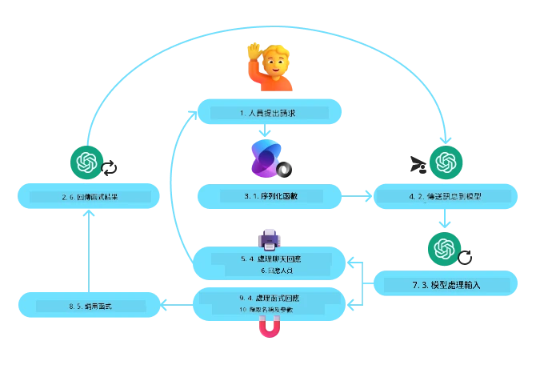
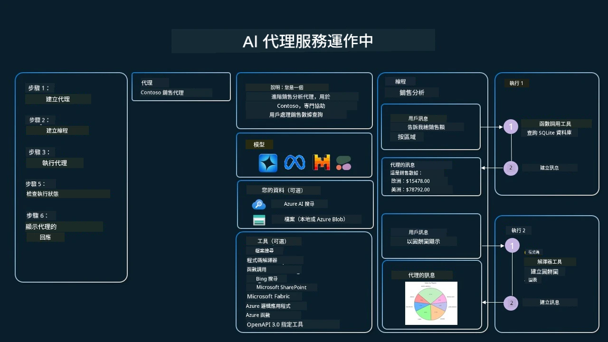

[](https://youtu.be/vieRiPRx-gI?si=cEZ8ApnT6Sus9rhn)

> _(點擊上方圖片觀看本課程影片)_

# 工具使用設計模式

工具很有趣，因為它們允許 AI 代理具備更廣泛的能力。代理不再僅限於執行有限的行動，透過新增工具，代理現在可以執行各種不同的動作。在本章中，我們將探討工具使用設計模式，該模式描述了 AI 代理如何使用特定工具以達成其目標。

## 介紹

在本課程中，我們將回答以下問題：

- 什麼是工具使用設計模式？
- 它適用於哪些使用案例？
- 實現該設計模式需要哪些元素／組件？
- 使用工具使用設計模式建立值得信賴的 AI 代理需考慮哪些特別事項？

## 學習目標

完成本課程後，你將能夠：

- 定義工具使用設計模式及其目的。
- 識別適用工具使用設計模式的使用案例。
- 了解實現該設計模式所需的關鍵元素。
- 認識使用此設計模式確保 AI 代理可信度的考量。

## 什麼是工具使用設計模式？

**工具使用設計模式**著重於賦予大型語言模型（LLM）與外部工具互動的能力，以達成特定目標。工具是代理可以執行的程式碼來完成動作。工具可以是簡單的函式（例如計算機），也可以是第三方服務的 API 呼叫（例如股票價格查詢或天氣預報）。在 AI 代理的情境中，工具被設計用於響應**模型生成的函式呼叫**由代理執行。

## 它適用於哪些使用案例？

AI 代理能夠利用工具來完成複雜任務、檢索資訊或做出決策。工具使用設計模式通常應用於需要與外部系統（如資料庫、網路服務或程式碼解譯器）進行動態互動的場景。這項能力在多種不同的使用案例中非常有用，包括：

- **動態資訊檢索：**代理可以查詢外部 API 或資料庫以獲取最新資料（例如查詢 SQLite 資料庫進行數據分析、查詢股票價格或天氣資訊）。
- **程式碼執行與解譯：**代理可以執行程式碼或腳本來解決數學問題、產生報告或做模擬。
- **工作流程自動化：**透過整合任務排程器、電子郵件服務或資料管線，自動化重複性或多步驟工作流程。
- **客戶支援：**代理可以與 CRM 系統、工單平台或知識庫互動以解決使用者提問。
- **內容生成與編輯：**代理可以使用文法檢查器、文字摘要工具或內容安全評估器等工具協助內容創作任務。

## 實現工具使用設計模式需要哪些元素／組件？

這些組件讓 AI 代理能執行多種任務。以下是實作工具使用設計模式的關鍵元素：

- **函式／工具結構定義：**詳細定義可用工具，包括函式名稱、用途、所需參數以及預期輸出。這些結構定義幫助 LLM 理解有哪些工具可用，及如何構造有效請求。

- **函式執行邏輯：**決定何時以及如何根據用戶意圖與對話上下文調用工具。可能包含規劃模組、路由機制或條件流程以動態決定工具使用。

- **訊息處理系統：**管理使用者輸入、LLM 回應、工具呼叫與工具回傳之間的對話流。

- **工具整合架構：**連結代理與各種工具的基礎設施，無論是簡單函式或複雜外部服務。

- **錯誤處理與驗證：**處理工具執行失敗、驗證參數及管理非預期回應的機制。

- **狀態管理：**追蹤對話上下文、先前工具互動及持久資料，確保多輪交互的一致性。

接下來，我們將更詳細了解函式／工具呼叫。

### 函式／工具呼叫

函式呼叫是讓大型語言模型（LLM）與工具互動的主要方式。你會經常看到「函式」與「工具」互換使用，因為「函式」（可重用程式碼區塊）就是代理用來執行任務的「工具」。為了調用函式程式碼，LLM 必須將用戶請求與函式描述比較。為此，將包含所有可用函式描述的結構定義傳給 LLM，LLM 再選擇最適合任務的函式，並回傳其名稱與參數。所選函式被呼叫，函式回應送回 LLM，LLM 利用該資訊回應用戶需求。

開發者要實作代理函式呼叫，需具備：

1. 支援函式呼叫的 LLM 模型
2. 包含函式描述的結構定義
3. 每個函式描述所需的程式碼

以取得某城市當前時間的範例說明：

1. **初始化支援函式呼叫的 LLM：**

    並非所有模型都支援函式呼叫，需確認你所用的 LLM 支援此功能。<a href="https://learn.microsoft.com/azure/ai-services/openai/how-to/function-calling" target="_blank">Azure OpenAI</a> 支援函式呼叫。我們可以開始初始化 Azure OpenAI 用戶端。

    ```python
    # 初始化 Azure OpenAI 客戶端
    client = AzureOpenAI(
        azure_endpoint = os.getenv("AZURE_AI_PROJECT_ENDPOINT"), 
        api_key=os.getenv("AZURE_OPENAI_API_KEY"),  
        api_version="2024-05-01-preview"
    )
    ```

1. **建立函式結構定義：**

    接著定義 JSON 結構，包含函式名稱、函式功能描述，以及函式參數名稱與描述。
    然後將此結構與用戶請求一併傳給先前建立的用戶端，要求取得舊金山時間。重要的是，**返回的是工具呼叫，而非問題最終答案**。如先前所述，LLM 回傳挑選的函式名稱及將傳遞的引數。

    ```python
    # 模型閱讀用的功能描述
    tools = [
        {
            "type": "function",
            "function": {
                "name": "get_current_time",
                "description": "Get the current time in a given location",
                "parameters": {
                    "type": "object",
                    "properties": {
                        "location": {
                            "type": "string",
                            "description": "The city name, e.g. San Francisco",
                        },
                    },
                    "required": ["location"],
                },
            }
        }
    ]
    ```
   
    ```python
  
    # 初始用戶訊息
    messages = [{"role": "user", "content": "What's the current time in San Francisco"}] 
  
    # 第一次 API 調用：請模型使用該功能
      response = client.chat.completions.create(
          model=deployment_name,
          messages=messages,
          tools=tools,
          tool_choice="auto",
      )
  
      # 處理模型的回應
      response_message = response.choices[0].message
      messages.append(response_message)
  
      print("Model's response:")  

      print(response_message)
  
    ```

    ```bash
    Model's response:
    ChatCompletionMessage(content=None, role='assistant', function_call=None, tool_calls=[ChatCompletionMessageToolCall(id='call_pOsKdUlqvdyttYB67MOj434b', function=Function(arguments='{"location":"San Francisco"}', name='get_current_time'), type='function')])
    ```
  
1. **執行任務所需的函式程式碼：**

    現在 LLM 選定要執行的函式，需實作並執行該函式程式碼。
    我們可用 Python 實作取得當前時間的程式碼，並需編寫程式碼從 response_message 解析函式名稱與引數以取得最終結果。

    ```python
      def get_current_time(location):
        """Get the current time for a given location"""
        print(f"get_current_time called with location: {location}")  
        location_lower = location.lower()
        
        for key, timezone in TIMEZONE_DATA.items():
            if key in location_lower:
                print(f"Timezone found for {key}")  
                current_time = datetime.now(ZoneInfo(timezone)).strftime("%I:%M %p")
                return json.dumps({
                    "location": location,
                    "current_time": current_time
                })
      
        print(f"No timezone data found for {location_lower}")  
        return json.dumps({"location": location, "current_time": "unknown"})
    ```

     ```python
     # 處理函數呼叫
      if response_message.tool_calls:
          for tool_call in response_message.tool_calls:
              if tool_call.function.name == "get_current_time":
     
                  function_args = json.loads(tool_call.function.arguments)
     
                  time_response = get_current_time(
                      location=function_args.get("location")
                  )
     
                  messages.append({
                      "tool_call_id": tool_call.id,
                      "role": "tool",
                      "name": "get_current_time",
                      "content": time_response,
                  })
      else:
          print("No tool calls were made by the model.")  
  
      # 第二次 API 呼叫：從模型獲取最終回應
      final_response = client.chat.completions.create(
          model=deployment_name,
          messages=messages,
      )
  
      return final_response.choices[0].message.content
     ```

     ```bash
      get_current_time called with location: San Francisco
      Timezone found for san francisco
      The current time in San Francisco is 09:24 AM.
     ```

函式呼叫是大多數（若非所有）代理工具使用設計的核心，然而從零開始實作有時具挑戰性。
如我們在[課程 2](../../../02-explore-agentic-frameworks)所學，代理框架提供現成的建構模組以實現工具使用。

## 使用代理框架的工具使用示例

以下展示如何使用不同代理框架實現工具使用設計模式：

### Microsoft 代理框架

<a href="https://learn.microsoft.com/azure/ai-services/agents/overview" target="_blank">Microsoft 代理框架</a>是開源 AI 框架，用於構建 AI 代理。它簡化函式呼叫過程，允許你用 `@tool` 裝飾器定義工具為 Python 函式。該框架處理模型與程式碼間的雙向通信。也提供透過 `AzureAIProjectAgentProvider` 使用的內建工具，如檔案搜尋和程式碼解譯器。

下圖說明 Microsoft 代理框架中函式呼叫的流程：



在 Microsoft 代理框架中，工具定義為被裝飾的函式。我們可以將先前看到的 `get_current_time` 函式透過 `@tool` 裝飾器轉換成工具。框架會自動序列化該函式及其參數，生成結構定義傳送給 LLM。

```python
from agent_framework import tool
from agent_framework.azure import AzureAIProjectAgentProvider
from azure.identity import AzureCliCredential

@tool
def get_current_time(location: str) -> str:
    """Get the current time for a given location"""
    ...

# 創建客戶端
provider = AzureAIProjectAgentProvider(credential=AzureCliCredential())

# 創建一個代理並使用工具運行
agent = await provider.create_agent(name="TimeAgent", instructions="Use available tools to answer questions.", tools=get_current_time)
response = await agent.run("What time is it?")
```
  
### Azure AI 代理服務

<a href="https://learn.microsoft.com/azure/ai-services/agents/overview" target="_blank">Azure AI 代理服務</a>為較新的代理框架，旨在讓開發者能安全地建立、部署及擴充高品質且可擴展的 AI 代理，且無需管理底層計算與存儲資源。對企業應用尤為有用，因為它是全託管服務，具企業級安全性。

與直接使用 LLM API 開發相比，Azure AI 代理服務提供以下優勢：

- 自動工具呼叫 — 無需解析工具呼叫、調用工具及處理回應；所有這些均由伺服器端完成
- 安全管理資料 — 無需自行管理對話狀態，可依靠線程存儲所有所需資訊
- 現成工具 — 可用工具包括能與資料源互動的 Bing、Azure AI Search 及 Azure Functions

Azure AI 代理服務提供的工具可分為兩類：

1. 知識工具：
    - <a href="https://learn.microsoft.com/azure/ai-services/agents/how-to/tools/bing-grounding?tabs=python&pivots=overview" target="_blank">Bing 搜尋接地</a>
    - <a href="https://learn.microsoft.com/azure/ai-services/agents/how-to/tools/file-search?tabs=python&pivots=overview" target="_blank">檔案搜尋</a>
    - <a href="https://learn.microsoft.com/azure/ai-services/agents/how-to/tools/azure-ai-search?tabs=azurecli%2Cpython&pivots=overview-azure-ai-search" target="_blank">Azure AI 搜尋</a>

2. 動作工具：
    - <a href="https://learn.microsoft.com/azure/ai-services/agents/how-to/tools/function-calling?tabs=python&pivots=overview" target="_blank">函式呼叫</a>
    - <a href="https://learn.microsoft.com/azure/ai-services/agents/how-to/tools/code-interpreter?tabs=python&pivots=overview" target="_blank">程式碼解譯器</a>
    - <a href="https://learn.microsoft.com/azure/ai-services/agents/how-to/tools/openapi-spec?tabs=python&pivots=overview" target="_blank">OpenAPI 定義工具</a>
    - <a href="https://learn.microsoft.com/azure/ai-services/agents/how-to/tools/azure-functions?pivots=overview" target="_blank">Azure Functions</a>

代理服務允許我們將這些工具整合成一個 `toolset`。它也使用 `threads` 追蹤特定對話的訊息歷史。

想像你是 Contoso 公司的一名銷售代理。你想開發一個會話代理，能回答銷售數據相關的問題。

下圖展示如何使用 Azure AI 代理服務分析你的銷售數據：



要使用上述任何工具，我們可以建立用戶端並定義工具或工具集。實作時可使用以下 Python 程式碼。LLM 將查看工具集，根據用戶請求決定使用用戶自訂函式 `fetch_sales_data_using_sqlite_query` 或預建的程式碼解譯器。

```python 
import os
from azure.ai.projects import AIProjectClient
from azure.identity import DefaultAzureCredential
from fetch_sales_data_functions import fetch_sales_data_using_sqlite_query # fetch_sales_data_using_sqlite_query 函數，可以在 fetch_sales_data_functions.py 檔案中找到。
from azure.ai.projects.models import ToolSet, FunctionTool, CodeInterpreterTool

project_client = AIProjectClient.from_connection_string(
    credential=DefaultAzureCredential(),
    conn_str=os.environ["PROJECT_CONNECTION_STRING"],
)

# 初始化工具集
toolset = ToolSet()

# 使用 fetch_sales_data_using_sqlite_query 函數初始化函數呼叫代理，並加入工具集
fetch_data_function = FunctionTool(fetch_sales_data_using_sqlite_query)
toolset.add(fetch_data_function)

# 初始化代碼解釋器工具並加入工具集。
code_interpreter = code_interpreter = CodeInterpreterTool()
toolset.add(code_interpreter)

agent = project_client.agents.create_agent(
    model="gpt-4o-mini", name="my-agent", instructions="You are helpful agent", 
    toolset=toolset
)
```

## 使用工具使用設計模式打造值得信賴 AI 代理的特別考量？

LLM 動態生成 SQL 時，一個常見疑慮是安全性，尤其是 SQL 注入風險或惡意行為，如刪除或修改資料庫。這些疑慮雖然合理，但可透過恰當設定資料庫存取權限有效緩解。對大多數資料庫而言，將資料庫設定為唯讀即可。對像 PostgreSQL 或 Azure SQL 的資料庫服務，應給應用程式指派唯讀（SELECT）角色。

在安全環境中運行應用程式能進一步強化防護。企業場景通常會從營運系統中抽取與轉換資料至唯讀資料庫或資料倉儲，並設計易於使用的架構。此作法確保資料安全、效能與可存取性優化，且應用程式僅有受限唯讀權限。

## 範例程式碼

- Python：[Agent Framework](./code_samples/04-python-agent-framework.ipynb)
- .NET：[Agent Framework](./code_samples/04-dotnet-agent-framework.md)

## 想了解更多關於工具使用設計模式的問題？

加入 [Microsoft Foundry Discord](https://aka.ms/ai-agents/discord) 與其他學習者交流，參加辦公時間並獲得 AI 代理問題解答。

## 其他資源

- <a href="https://microsoft.github.io/build-your-first-agent-with-azure-ai-agent-service-workshop/" target="_blank">Azure AI 代理服務研討會</a>
- <a href="https://github.com/Azure-Samples/contoso-creative-writer/tree/main/docs/workshop" target="_blank">Contoso 創意作家多代理研討會</a>
- <a href="https://learn.microsoft.com/azure/ai-services/agents/overview" target="_blank">Microsoft 代理框架總覽</a>

## 上一課程

[理解代理設計模式](../03-agentic-design-patterns/README.md)

## 下一課程
[Agentic RAG](../05-agentic-rag/README.md)

---

<!-- CO-OP TRANSLATOR DISCLAIMER START -->
**免責聲明**：  
本文件由 AI 翻譯服務 [Co-op Translator](https://github.com/Azure/co-op-translator) 翻譯而成。雖然我們致力於確保準確性，但請注意，自動翻譯可能包含錯誤或不準確之處。原始語言文件應視為具權威性的資料來源。對於重要資訊，建議採用專業人工翻譯。我們對因使用本翻譯而引起的任何誤解或誤譯概不負責。
<!-- CO-OP TRANSLATOR DISCLAIMER END -->