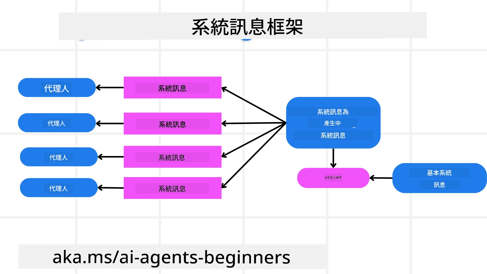
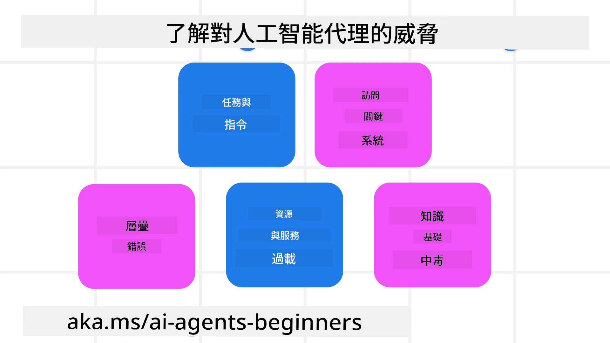
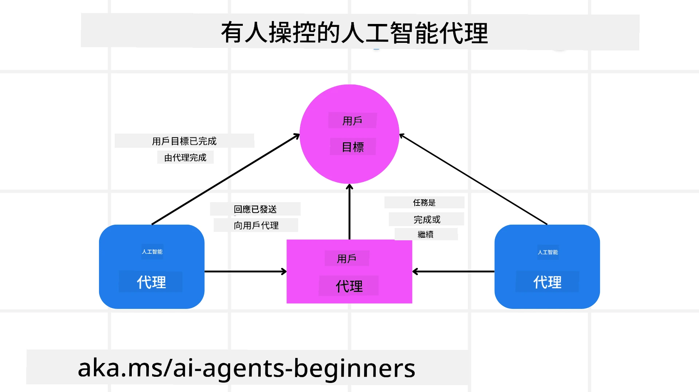

[](https://youtu.be/iZKkMEGBCUQ?si=Q-kEbcyHUMPoHp8L)

> _(點擊上方圖片觀看本課程影片)_

# 建立可信賴的 AI 代理

## 介紹

本課程將涵蓋：

- 如何建立與部署安全且有效的 AI 代理
- 開發 AI 代理時的重要安全考量
- 開發 AI 代理時如何維護數據與用戶隱私

## 學習目標

完成本課程後，您將能夠：

- 識別並減輕建立 AI 代理時的風險
- 實施安全措施以確保對數據和訪問的妥善管理
- 建立維護數據隱私並提供優質用戶體驗的 AI 代理

## 安全性

首先讓我們來看看建立安全的代理式應用程式。安全性意指 AI 代理能如設計般執行。作為代理式應用程式的開發者，我們擁有最大化安全性的 方法與工具：

### 建立系統訊息架構

如果您曾使用大型語言模型（LLM）建立 AI 應用，便會知道設計強健系統提示或系統訊息的重要性。這些提示確定 LLM 與用戶及數據互動的元規則、指令與準則。

對 AI 代理而言，系統提示更加重要，因為 AI 代理需要非常具體的指令以完成我們為其設計的任務。

為了建立可擴充的系統提示，我們可以為應用中的一個或多個代理使用系統訊息架構：



#### 步驟 1：建立元系統訊息

元提示會被 LLM 用來產生我們建立的代理的系統提示。我們將其設計為範本，以便必要時有效率地建立多個代理。

以下為我們會給 LLM 的元系統訊息範例：

```plaintext
You are an expert at creating AI agent assistants. 
You will be provided a company name, role, responsibilities and other
information that you will use to provide a system prompt for.
To create the system prompt, be descriptive as possible and provide a structure that a system using an LLM can better understand the role and responsibilities of the AI assistant. 
```

#### 步驟 2：建立基本提示

下一步是建立描述 AI 代理的基本提示。您應包含代理的角色、代理將完成的任務以及代理的其他職責。

範例如下：

```plaintext
You are a travel agent for Contoso Travel that is great at booking flights for customers. To help customers you can perform the following tasks: lookup available flights, book flights, ask for preferences in seating and times for flights, cancel any previously booked flights and alert customers on any delays or cancellations of flights.  
```

#### 步驟 3：向 LLM 提供基本系統訊息

現在我們可以透過提供元系統訊息作為系統訊息，以及我們的基本系統訊息來優化此系統訊息。

這將產生更適合引導 AI 代理的系統訊息：

```markdown
**Company Name:** Contoso Travel  
**Role:** Travel Agent Assistant

**Objective:**  
You are an AI-powered travel agent assistant for Contoso Travel, specializing in booking flights and providing exceptional customer service. Your main goal is to assist customers in finding, booking, and managing their flights, all while ensuring that their preferences and needs are met efficiently.

**Key Responsibilities:**

1. **Flight Lookup:**
    
    - Assist customers in searching for available flights based on their specified destination, dates, and any other relevant preferences.
    - Provide a list of options, including flight times, airlines, layovers, and pricing.
2. **Flight Booking:**
    
    - Facilitate the booking of flights for customers, ensuring that all details are correctly entered into the system.
    - Confirm bookings and provide customers with their itinerary, including confirmation numbers and any other pertinent information.
3. **Customer Preference Inquiry:**
    
    - Actively ask customers for their preferences regarding seating (e.g., aisle, window, extra legroom) and preferred times for flights (e.g., morning, afternoon, evening).
    - Record these preferences for future reference and tailor suggestions accordingly.
4. **Flight Cancellation:**
    
    - Assist customers in canceling previously booked flights if needed, following company policies and procedures.
    - Notify customers of any necessary refunds or additional steps that may be required for cancellations.
5. **Flight Monitoring:**
    
    - Monitor the status of booked flights and alert customers in real-time about any delays, cancellations, or changes to their flight schedule.
    - Provide updates through preferred communication channels (e.g., email, SMS) as needed.

**Tone and Style:**

- Maintain a friendly, professional, and approachable demeanor in all interactions with customers.
- Ensure that all communication is clear, informative, and tailored to the customer's specific needs and inquiries.

**User Interaction Instructions:**

- Respond to customer queries promptly and accurately.
- Use a conversational style while ensuring professionalism.
- Prioritize customer satisfaction by being attentive, empathetic, and proactive in all assistance provided.

**Additional Notes:**

- Stay updated on any changes to airline policies, travel restrictions, and other relevant information that could impact flight bookings and customer experience.
- Use clear and concise language to explain options and processes, avoiding jargon where possible for better customer understanding.

This AI assistant is designed to streamline the flight booking process for customers of Contoso Travel, ensuring that all their travel needs are met efficiently and effectively.

```

#### 步驟 4：反覆調整與改進

這個系統訊息架構的價值在於能夠更輕鬆擴充多個代理的系統訊息建立，並隨時間改進系統訊息。完成用例時，很少能一次就創建出完美的系統訊息。能夠藉由更改基本系統訊息並將其輸入系統中，進行小幅調整與改進，將允許您比較與評估結果。

## 理解威脅

建立可信賴的 AI 代理時，了解並減輕對您的 AI 代理的風險與威脅非常重要。讓我們只看部分針對 AI 代理的不同威脅，以及您如何更好地規劃與準備。



### 任務與指令

**說明：** 攻擊者試圖透過提示或操縱輸入來更改 AI 代理的指令或目標。

**減緩方式：** 執行驗證檢查和輸入過濾，偵測可能危險的提示，避免被 AI 代理處理。由於這類攻擊通常需頻繁與代理交互，限制對話輪數也是防止此類攻擊的方式之一。

### 存取關鍵系統

**說明：** 若 AI 代理能存取儲存敏感資料的系統與服務，攻擊者可能會破壞代理與該等服務的通訊。這些攻擊可直接或間接透過代理獲取系統資訊。

**減緩方式：** AI 代理應以必要為限存取系統，以防止此類攻擊。代理與系統間的通訊也須安全。實施驗證與存取控制是另一種保護資訊方式。

### 資源與服務負載過高

**說明：** AI 代理可使用不同工具與服務來完成任務。攻擊者可利用此能力透過 AI 代理大量發送請求攻擊服務，可能導致系統失效或成本高昂。

**減緩方式：** 對 AI 代理對服務的請求數量實施限制政策。限制與 AI 代理的對話輪數與請求次數也是防範此類攻擊的方式。

### 知識庫毒害

**說明：** 此類攻擊不直接針對 AI 代理，而是針對 AI 代理將使用的知識庫及其他服務。攻擊可能導致資料或資訊遭破壞，使 AI 代理產生偏頗或非預期的回應。

**減緩方式：** 定期驗證 AI 代理運作中所使用的資料。確保此資料存取安全且僅由受信任的人員變更，以避免此類攻擊。

### 連鎖錯誤

**說明：** AI 代理存取多種工具與服務以完成任務。攻擊者造成的錯誤可能導致 AI 代理連接的其他系統失效，使攻擊範圍擴散且更難排除故障。

**減緩方式：** 一個方法是讓 AI 代理在受限環境中運作，例如在 Docker 容器內執行任務，以避免直接攻擊系統。建立當特定系統回應錯誤時的後備機制與重試邏輯，是防止更大系統失效的另一種方法。

## 人工審核介入

另一個建立可信賴 AI 代理系統的有效方式是使用人工審核介入。此流程讓用戶能在代理運作過程中提供反饋。用戶本質上是多代理系統中的代理，能對運作程序進行批准或終止。



以下為使用 Microsoft Agent Framework 展示此概念實作的程式碼範例：

```python
import os
from agent_framework.azure import AzureAIProjectAgentProvider
from azure.identity import AzureCliCredential

# 建立需人手審批的服務提供者
provider = AzureAIProjectAgentProvider(
    credential=AzureCliCredential(),
)

# 建立帶有人手審批步驟的代理
response = provider.create_response(
    input="Write a 4-line poem about the ocean.",
    instructions="You are a helpful assistant. Ask for user approval before finalizing.",
)

# 用戶可以審查及批准回應
print(response.output_text)
user_input = input("Do you approve? (APPROVE/REJECT): ")
if user_input == "APPROVE":
    print("Response approved.")
else:
    print("Response rejected. Revising...")
```

## 結論

建立可信賴的 AI 代理需要謹慎的設計、健全的安全措施以及持續的迭代。透過實施結構化的元提示系統、了解潛在威脅並採取緩解策略，開發者能打造安全且有效的 AI 代理。此外，整合人工審核介入的方法確保 AI 代理與用戶需求保持一致，同時減少風險。隨著 AI 持續演進，積極維護安全、隱私與倫理考量，將是促成 AI 驅動系統可信賴性與可靠性的關鍵。

### 想深入了解建立可信賴 AI 代理嗎？

加入 [Microsoft Foundry Discord](https://aka.ms/ai-agents/discord) 與其他學習者交流，參加諮詢時段，並獲得 AI 代理相關問題的解答。

## 其他資源

- <a href="https://learn.microsoft.com/azure/ai-studio/responsible-use-of-ai-overview" target="_blank">負責任 AI 概述</a>
- <a href="https://learn.microsoft.com/azure/ai-studio/concepts/evaluation-approach-gen-ai" target="_blank">生成式 AI 模型與 AI 應用的評估</a>
- <a href="https://learn.microsoft.com/azure/ai-services/openai/concepts/system-message?context=%2Fazure%2Fai-studio%2Fcontext%2Fcontext&tabs=top-techniques" target="_blank">安全系統訊息</a>
- <a href="https://blogs.microsoft.com/wp-content/uploads/prod/sites/5/2022/06/Microsoft-RAI-Impact-Assessment-Template.pdf?culture=en-us&country=us" target="_blank">風險評估範本</a>

## 前一課

[Agentic RAG](../05-agentic-rag/README.md)

## 下一課

[規劃設計模式](../07-planning-design/README.md)

---

<!-- CO-OP TRANSLATOR DISCLAIMER START -->
**免責聲明**：
本文件是使用 AI 翻譯服務 [Co-op Translator](https://github.com/Azure/co-op-translator) 翻譯而成。儘管我們努力確保準確性，但請注意，自動翻譯可能包含錯誤或不準確之處。原始文件以其原語言版本為權威版本。對於重要資訊，建議採用專業人工翻譯。我們對因使用本翻譯而引致的任何誤解或誤釋不承擔任何責任。
<!-- CO-OP TRANSLATOR DISCLAIMER END -->