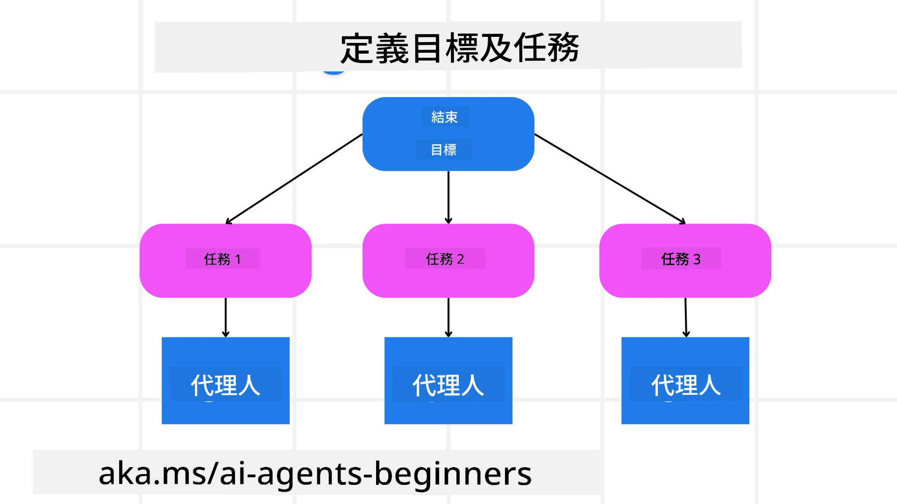

[](https://youtu.be/kPfJ2BrBCMY?si=9pYpPXp0sSbK91Dr)

> _(點擊上方圖片觀看本課程視頻)_

# 規劃設計

## 簡介

本課程將涵蓋

* 定義明確的整體目標，並將複雜任務拆解成可管理的任務。
* 利用結構化輸出實現更可靠及機器可讀的回應。
* 採用事件驅動方法處理動態任務及意外輸入。

## 學習目標

完成本課程後，您將了解：

* 識別並設定人工智能代理的整體目標，確保其清楚知道需達成的目的。
* 將複雜任務拆解成可管理的子任務，並將其組織成合乎邏輯的序列。
* 配備代理合適的工具（如搜尋工具或數據分析工具），決定何時及如何使用，並應對發生的意外情況。
* 評估子任務結果，衡量效能，反覆行動以改進最終輸出。

## 定義整體目標與拆解任務



大多數現實任務過於複雜，無法一步完成。人工智能代理需有明確目標來引導規劃與行動。例如，目標為：

    「生成一個三天行程安排。」

雖然表述簡單，但仍需細化。目標越清晰，代理（及任何人類協作者）越能專注於達成正確結果，如製作含航班選項、酒店推薦與活動建議的完善行程。

### 任務拆解

大型或複雜任務拆分為較小、具目標的子任務時更易管理。
以旅行行程為例，可將目標拆解為：

* 航班預訂
* 酒店預訂
* 汽車租賃
* 個人化設定

各子任務可由專責代理或流程執行。某代理專注搜尋最佳航班優惠，另一位著重酒店訂房，依此類推。協調或「下游」代理能將結果整合成整體行程交付用戶。

此模組化方法亦允許逐步增強。舉例，可增加專門的美食推薦代理或本地活動建議代理，並隨時間調整行程。

### 結構化輸出

大型語言模型（LLMs）可產生結構化輸出（例如 JSON），方便下游代理或服務解析及處理。在多代理環境中特別有用，我們可在收到規劃結果後執行這些任務。

下列 Python 範例展示一個簡單規劃代理如何拆解目標為子任務並生成結構化計劃：

```python
from pydantic import BaseModel
from enum import Enum
from typing import List, Optional, Union
import json
import os
from typing import Optional
from pprint import pprint
from agent_framework.azure import AzureAIProjectAgentProvider
from azure.identity import AzureCliCredential

class AgentEnum(str, Enum):
    FlightBooking = "flight_booking"
    HotelBooking = "hotel_booking"
    CarRental = "car_rental"
    ActivitiesBooking = "activities_booking"
    DestinationInfo = "destination_info"
    DefaultAgent = "default_agent"
    GroupChatManager = "group_chat_manager"

# 旅遊子任務模型
class TravelSubTask(BaseModel):
    task_details: str
    assigned_agent: AgentEnum  # 我哋想將任務分配畀代理

class TravelPlan(BaseModel):
    main_task: str
    subtasks: List[TravelSubTask]
    is_greeting: bool

provider = AzureAIProjectAgentProvider(credential=AzureCliCredential())

# 定義用戶信息
system_prompt = """You are a planner agent.
    Your job is to decide which agents to run based on the user's request.
    Provide your response in JSON format with the following structure:
{'main_task': 'Plan a family trip from Singapore to Melbourne.',
 'subtasks': [{'assigned_agent': 'flight_booking',
               'task_details': 'Book round-trip flights from Singapore to '
                               'Melbourne.'}
    Below are the available agents specialised in different tasks:
    - FlightBooking: For booking flights and providing flight information
    - HotelBooking: For booking hotels and providing hotel information
    - CarRental: For booking cars and providing car rental information
    - ActivitiesBooking: For booking activities and providing activity information
    - DestinationInfo: For providing information about destinations
    - DefaultAgent: For handling general requests"""

user_message = "Create a travel plan for a family of 2 kids from Singapore to Melbourne"

response = client.create_response(input=user_message, instructions=system_prompt)

response_content = response.output_text
pprint(json.loads(response_content))
```

### 具多代理調度的規劃代理

此例中，一個語意路由代理接收用戶請求（例如「我需要一個旅行的酒店計劃。」）。

規劃者接著：

* 接收酒店計劃：根據系統提示（包含可用代理詳情），將用戶訊息生成功能化的旅行計劃。
* 列出代理及其工具：代理註冊表包含代理清單（如航班、酒店、汽車租賃與活動）及它們提供的功能或工具。
* 將計劃路由至相應代理：根據子任務數量，規劃者直接傳訊至專屬代理（單一任務情況下），或透過群聊管理器協調多代理合作。
* 彙總結果：最終，規劃者將生成的計劃做摘要整理以增清晰。
以下 Python 程式碼示範此流程：

```python

from pydantic import BaseModel

from enum import Enum
from typing import List, Optional, Union

class AgentEnum(str, Enum):
    FlightBooking = "flight_booking"
    HotelBooking = "hotel_booking"
    CarRental = "car_rental"
    ActivitiesBooking = "activities_booking"
    DestinationInfo = "destination_info"
    DefaultAgent = "default_agent"
    GroupChatManager = "group_chat_manager"

# 旅遊子任務模型

class TravelSubTask(BaseModel):
    task_details: str
    assigned_agent: AgentEnum # 我們想要指定任務給代理

class TravelPlan(BaseModel):
    main_task: str
    subtasks: List[TravelSubTask]
    is_greeting: bool
import json
import os
from typing import Optional

from agent_framework.azure import AzureAIProjectAgentProvider
from azure.identity import AzureCliCredential

# 建立用戶端

provider = AzureAIProjectAgentProvider(credential=AzureCliCredential())

from pprint import pprint

# 定義用戶訊息

system_prompt = """You are a planner agent.
    Your job is to decide which agents to run based on the user's request.
    Below are the available agents specialized in different tasks:
    - FlightBooking: For booking flights and providing flight information
    - HotelBooking: For booking hotels and providing hotel information
    - CarRental: For booking cars and providing car rental information
    - ActivitiesBooking: For booking activities and providing activity information
    - DestinationInfo: For providing information about destinations
    - DefaultAgent: For handling general requests"""

user_message = "Create a travel plan for a family of 2 kids from Singapore to Melbourne"

response = client.create_response(input=user_message, instructions=system_prompt)

response_content = response.output_text

# 加載回應為 JSON 後列印內容

pprint(json.loads(response_content))
```

以下是前述程式碼的輸出，您可利用這結構化輸出將任務分配給 `assigned_agent` 並向最終用戶彙總旅行計劃。

```json
{
    "is_greeting": "False",
    "main_task": "Plan a family trip from Singapore to Melbourne.",
    "subtasks": [
        {
            "assigned_agent": "flight_booking",
            "task_details": "Book round-trip flights from Singapore to Melbourne."
        },
        {
            "assigned_agent": "hotel_booking",
            "task_details": "Find family-friendly hotels in Melbourne."
        },
        {
            "assigned_agent": "car_rental",
            "task_details": "Arrange a car rental suitable for a family of four in Melbourne."
        },
        {
            "assigned_agent": "activities_booking",
            "task_details": "List family-friendly activities in Melbourne."
        },
        {
            "assigned_agent": "destination_info",
            "task_details": "Provide information about Melbourne as a travel destination."
        }
    ]
}
```

包含前述程式碼範例的示範筆記本可於此取得 [here](07-python-agent-framework.ipynb)。

### 迭代規劃

某些任務需反覆互動或重新規劃，一子任務結果會影響下一子任務。例如代理在預訂航班時遇到意外數據格式，可能需調整策略再進行酒店預訂。

此外，用戶反饋（例如人工決定偏好較早班機）可觸發部分重新規劃。此動態迭代方法確保最終方案符合現實限制及不斷變化的用戶偏好。

例如程式碼

```python
from agent_framework.azure import AzureAIProjectAgentProvider
from azure.identity import AzureCliCredential
#.. 與之前的代碼相同並傳遞用戶歷史記錄，當前計劃

system_prompt = """You are a planner agent to optimize the
    Your job is to decide which agents to run based on the user's request.
    Below are the available agents specialized in different tasks:
    - FlightBooking: For booking flights and providing flight information
    - HotelBooking: For booking hotels and providing hotel information
    - CarRental: For booking cars and providing car rental information
    - ActivitiesBooking: For booking activities and providing activity information
    - DestinationInfo: For providing information about destinations
    - DefaultAgent: For handling general requests"""

user_message = "Create a travel plan for a family of 2 kids from Singapore to Melbourne"

response = client.create_response(
    input=user_message,
    instructions=system_prompt,
    context=f"Previous travel plan - {TravelPlan}",
)
# .. 重新計劃並將任務發送給相應的代理
```

更全面的規劃可參考 Magnetic One <a href="https://www.microsoft.com/research/articles/magentic-one-a-generalist-multi-agent-system-for-solving-complex-tasks" target="_blank">部落格文章</a>，用於解決複雜任務。

## 總結

本文示範如何建立一個能動態選擇定義中可用代理的規劃器。規劃器輸出將任務拆解並指派代理執行，前提是假設代理能接觸到所需功能/工具。除了代理外，您還可結合其他模式如反思、摘要器和輪值聊天以進一步客製化。

## 其他資源

Magentic One—一個通用多代理系統，用於解決複雜任務，在多項困難代理基準中取得優異成果。參考：<a href="https://www.microsoft.com/research/articles/magentic-one-a-generalist-multi-agent-system-for-solving-complex-tasks" target="_blank">Magentic One</a>。該系統中的協調者建立任務特定計劃，並將任務委派給可用代理。除了規劃外，協調者還運用追蹤機制監控任務進展，並依需要進行重新規劃。

### 想了解更多關於規劃設計模式嗎？

加入 [Microsoft Foundry Discord](https://aka.ms/ai-agents/discord)，與其他學習者會面，參加線上辦公時間，並解答您的 AI 代理問題。

## 上一課

[建立可信賴的 AI 代理](../06-building-trustworthy-agents/README.md)

## 下一課

[多代理設計模式](../08-multi-agent/README.md)

---

<!-- CO-OP TRANSLATOR DISCLAIMER START -->
**免責聲明**：
本文件由 AI 翻譯服務 [Co-op Translator](https://github.com/Azure/co-op-translator) 自動翻譯而成。雖然我們致力於確保翻譯準確性，但請注意，自動翻譯可能包含錯誤或不準確之處。原始文件的母語版本應視為權威來源。對於重要資訊，建議採用專業人工翻譯。本公司對因使用本翻譯而引起的任何誤解或誤譯概不負責。
<!-- CO-OP TRANSLATOR DISCLAIMER END -->