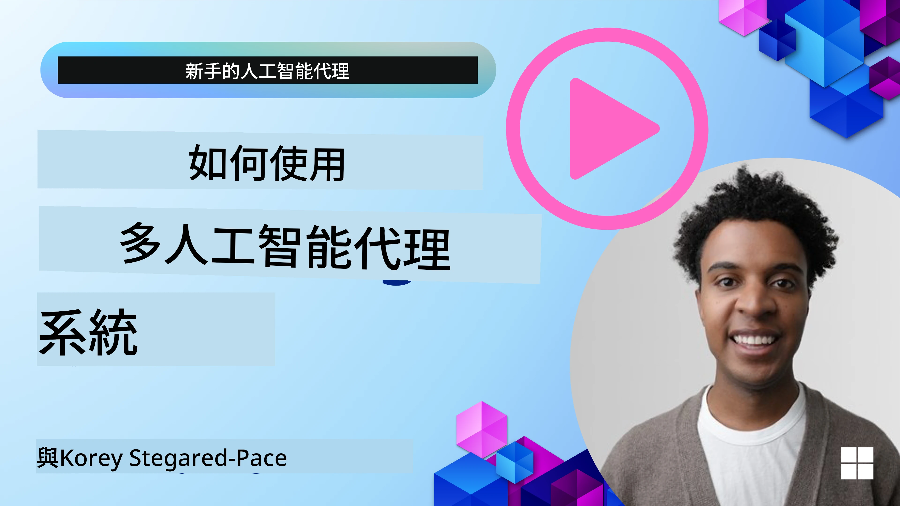
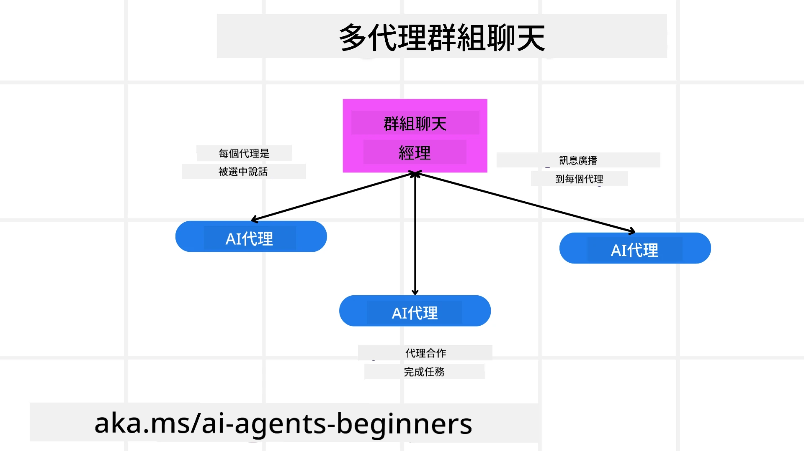
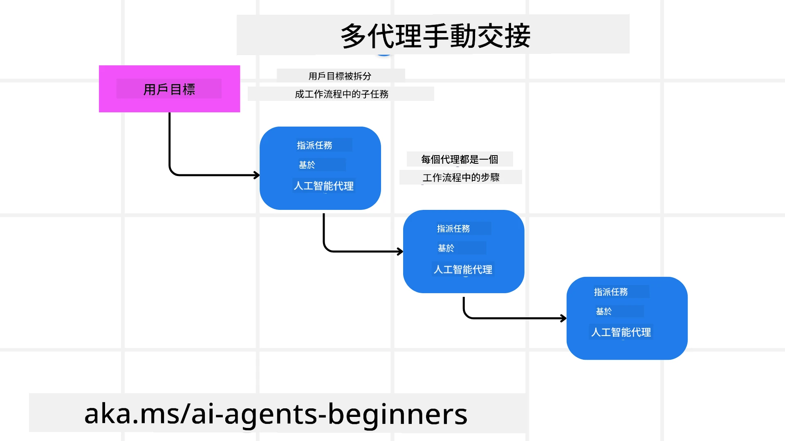
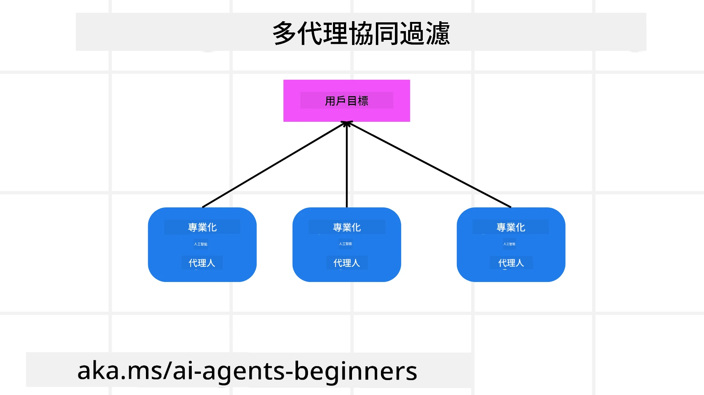

> _(點擊上方圖片觀看本課程影片)_

# 多智能體設計模式

當你開始著手於涉及多智能體的專案時，你將需要考慮多智能體設計模式。然而，何時切換到多智能體系統以及其優勢可能並不立即明確。

## 介紹

在本課程中，我們將尋求回答以下問題：

- 多智能體適用的場景有哪些？
- 使用多智能體比單一智能體執行多項任務有何優點？
- 實作多智能體設計模式的組成元件有哪些？
- 我們如何能夠監控多個智能體之間的互動？

## 學習目標

完成本課程後，你應該能夠：

- 辨識多智能體適用的場景
- 認知使用多智能體系統相較單一智能體的優勢
- 理解實作多智能體設計模式的組成元件

更宏觀的概念是？

*多智能體是一種設計模式，允許多個智能體協同工作以達成共同目標*。

這種模式廣泛應用於多個領域，包括機器人技術、自主系統以及分布式運算。

## 多智能體適用的場景

哪些場景適合使用多智能體？答案是有許多場景適合多智能體，特別是在以下情況：

- **大量工作負載**：大量工作任務可拆分成較小的任務分派給不同的智能體，允許平行處理，加速完成。例如大型資料處理任務。
- **複雜任務**：複雜任務同樣可以拆解成多個子任務並分派給不同智能體，各自專注於任務的特定面向。舉例來說，自動駕駛車輛中，分別有智能體負責導航、障礙物偵測及與其他車輛通訊。
- **多樣化專業知識**：不同智能體可具備不同專業技能，使其能較單一智能體更有效處理任務的不同方面。舉例來說，醫療領域中可分別有智能體負責診斷、治療計畫與病患監測。

## 使用多智能體比單一智能體的優勢

單一智能體系統可能適合簡單任務，但對於較複雜的任務，使用多智能體有以下優點：

- **專長分工**：每個智能體能專門化於特定任務。單一智能體缺乏專長可能對複雜任務感到困惑，例如執行非最適任的任務。
- **擴充性**：透過增加更多智能體，系統更容易擴充，而非將負載壓在單一智能體身上。
- **容錯性**：若一個智能體故障，其他智能體仍能持續運作，確保系統穩定。

舉例來說，為用戶訂購旅遊行程。單一智能體需處理所有訂機票、訂飯店及租車等環節，該智能體必須擁有相應的工具，使系統複雜且難以維護與擴充。而多智能體系統可分別由專精找航班、訂飯店與租車的智能體負責，系統更具模組化、易維護及擴充性。

可將此比擬為由家族經營的旅行社與加盟連鎖旅行社。家族旅行社由單一代理人處理所有任務，加盟連鎖則由多位智能體分別負責不同面向。

## 實作多智能體設計模式的組成元件

在實作多智能體設計模式之前，你需要理解該模式的組成元件。

以為用戶訂購旅遊行程為例，組成元件將包括：

- **智能體通訊**：負責找航班、訂飯店與租車的智能體需彼此通訊，共享用戶偏好與限制資訊。你需要選定通訊協定及方法。實際上，例如找航班的智能體必須與訂飯店的智能體通訊，確保飯店訂於與航班相同日期。代表智能體需共享用戶旅遊日期資訊，因此你需決定*哪些智能體共享資訊及如何共享*。
- **協調機制**：智能體需協調其行動，確保符合用戶偏好與限制。用戶可能偏好住靠近機場的飯店，但限制是租車僅能於機場取得，訂飯店的智能體需與訂租車智能體協調以符合這些條件，代表你需決定*智能體如何協調其行動*。
- **智能體架構**：智能體需有內部結構以基於與用戶互動做決策與學習，例如找航班智能體需決策推薦哪些航班給用戶，你需決定*智能體如何做決策與學習*。舉例來說，找航班智能體可用機器學習模型根據用戶過往偏好推薦航班。
- **多智能體互動可視性**：你需能看到多智能體彼此間的互動狀態，需有工具與技術追蹤智能體活動與互動，可能包含日誌與監控工具、視覺化工具與效能指標。
- **多智能體模式**：多智能體系統可用不同架構模式，如集中式、去中心化與混合架構，你需選擇最符合使用案例的模式。
- **人類介入**：大多數情況會有人類介入，你需指示智能體何時尋求人類干預，例如用戶要求未被智能體推薦的特定飯店或航班，或訂購前要求確認。

## 多智能體互動的可視性

瞭解多個智能體間如何互動非常重要，此可視性對除錯、優化與確保系統整體效能必不可少。為此，你需要有工具與技術來追蹤智能體活動與互動，形式可能是日誌與監控工具、視覺化工具及效能指標。

以為用戶訂購旅遊行程為例，你可以建置一個儀表板顯示各智能體狀態、用戶偏好與限制，以及智能體間的互動。此儀表板可呈現用戶旅行日期、航班智能體推薦的航班、飯店智能體推薦的飯店及租車智能體推薦的租車，讓你清楚了解智能體間互動是否符合用戶條件。

我們來更細看這些面向：

- **日誌與監控工具**：你應該對每項智能體執行的動作記錄日誌，包含執行該動作的智能體、動作內容、時間與結果，該資訊可用於除錯與優化。
- **視覺化工具**：視覺化協助直觀觀察智能體間互動，例如用圖形展示智能體間資訊流，幫助找出瓶頸、低效率等問題。
- **效能指標**：可追蹤多智能體系統的效能，例如完成任務所需時間、單位時間完成任務的數量及智能體建議的準確度，有助於辨識改進區域並優化系統。

## 多智能體模式

以下介紹一些可用於建構多智能體應用的具體模式，值得參考：

### 群組聊天

此模式適用於建立多智能體能彼此溝通的群組聊天應用。典型用途包含團隊協作、客戶支援及社交網絡。

每個智能體代表群組聊天中的一名使用者，訊息透過消息協定在智能體間交換。智能體可發送訊息至群組、接收群組訊息，以及回應其他智能體發的訊息。

此模式可用集中式架構實作（所有訊息通過中央伺服器轉發）或去中心化架構（智能體間直接交換訊息）。

### 任務交接

此模式適用於要讓多智能體間互相交接任務的應用。

典型用途包括客戶支援、任務管理及工作流程自動化。

每個智能體代表一項任務或工作流程中的一個步驟，可根據預先定義規則將任務交接給其他智能體。

### 協同過濾

此模式適用於要讓多智能體協同為用戶提供推薦的應用。

多智能體協同是因為每個智能體具備不同專長，能以多種角度貢獻推薦過程。

舉例用戶想獲得股票市場最佳買股推薦：

- **產業專家**：其中一個智能體是特定產業專家。
- **技術分析**：另一個智能體擅長技術分析。
- **基本面分析**：還有一個智能體專精基本面分析。透過協同，這些智能體能提供給用戶更完整的推薦。

## 範例：退款流程

考慮用戶想對產品申請退款，過程中可能涉及許多智能體。我們將這些智能體分為退款流程專用與可用於其他流程的一般智能體。

**退款流程專用智能體**：

以下是可能參與退款流程的智能體：

- **客戶智能體**：代表客戶，負責啟動退款程序。
- **賣方智能體**：代表賣方，負責處理退款。
- **付款智能體**：代表付款程序，負責退還客戶款項。
- **解決智能體**：負責解決退款過程中出現的問題。
- **合規智能體**：確保退款程序符合相關規定與政策。

**一般智能體**：

這些智能體可被其他業務流程重複利用。

- **運送智能體**：代表運送程序，負責將產品寄回賣方，可用於退款流程及一般產品配送。
- **反饋智能體**：負責蒐集客戶反饋，反饋不限定於退款期間。
- **升級智能體**：負責將問題升級至更高層級支援，適用於任何需升級問題的流程。
- **通知智能體**：負責於退款過程各階段向客戶發送通知。
- **分析智能體**：負責分析與退款流程相關的數據。
- **審核智能體**：負責審核退款流程確保正確執行。
- **報告智能體**：負責產生退款流程的報告。
- **知識智能體**：維護與退款流程相關的知識庫，也可熟悉企業其他業務。
- **安全智能體**：負責保障退款流程的安全。
- **品質智能體**：確保退款流程的品質。

前述提及相當多智能體，包含退款專用及可用於其它業務的一般智能體，希望這能讓你理解如何決定在多智能體系統中使用哪些智能體。

## 作業

設計一個用於客戶支援流程的多智能體系統。辨識參與流程的智能體、他們的角色與責任，以及彼此間的互動方式。請同時考慮專用於客戶支援流程的智能體及可用於其他業務的通用智能體。
> 在閱讀以下解決方案之前先思考一下，你可能需要的代理人比你想像中還要多。

> TIP：思考客戶支援流程的不同階段，並且考慮系統所需要的代理人數量。

## 解決方案

[Solution](./solution/solution.md)

## 知識檢核

問題：何時應該考慮使用多代理人？

- [ ] A1：當你有少量工作負載和簡單任務時。
- [ ] A2：當你有大量工作負載時。
- [ ] A3：當你有簡單任務時。

[Solution quiz](./solution/solution-quiz.md)

## 總結

在本課程中，我們探討了多代理人設計模式，包括多代理人適用的情境、使用多代理人相較於單一代理人的優勢、多代理人設計模式的實作基礎，以及如何監控多個代理人之間的互動情況。

### 對多代理人設計模式還有更多疑問嗎？

加入 [Microsoft Foundry Discord](https://aka.ms/ai-agents/discord)，與其他學習者交流，參加辦公時間，並獲得你的 AI 代理人相關問題的解答。

## 額外資源

- <a href="https://learn.microsoft.com/azure/ai-services/agents/overview" target="_blank">Microsoft 代理人框架文件</a>
- <a href="https://www.analyticsvidhya.com/blog/2024/10/agentic-design-patterns/" target="_blank">Agentic 設計模式</a>

## 上一課

[規劃設計](../07-planning-design/README.md)

## 下一課

[AI 代理人的元認知](../09-metacognition/README.md)

---

<!-- CO-OP TRANSLATOR DISCLAIMER START -->
**免責聲明**：  
本文件乃使用 AI 翻譯服務 [Co-op Translator](https://github.com/Azure/co-op-translator) 所翻譯。儘管我們致力於確保準確性，但請注意，自動翻譯可能包含錯誤或不準確之處。原始文件之母語版本應視為權威版本。對於關鍵資訊，建議採用專業人工翻譯。對於因使用本翻譯而產生之任何誤解或誤釋，我們概不負責。
<!-- CO-OP TRANSLATOR DISCLAIMER END -->