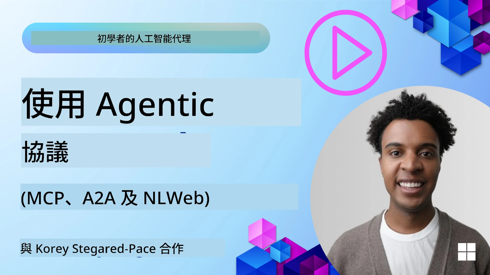
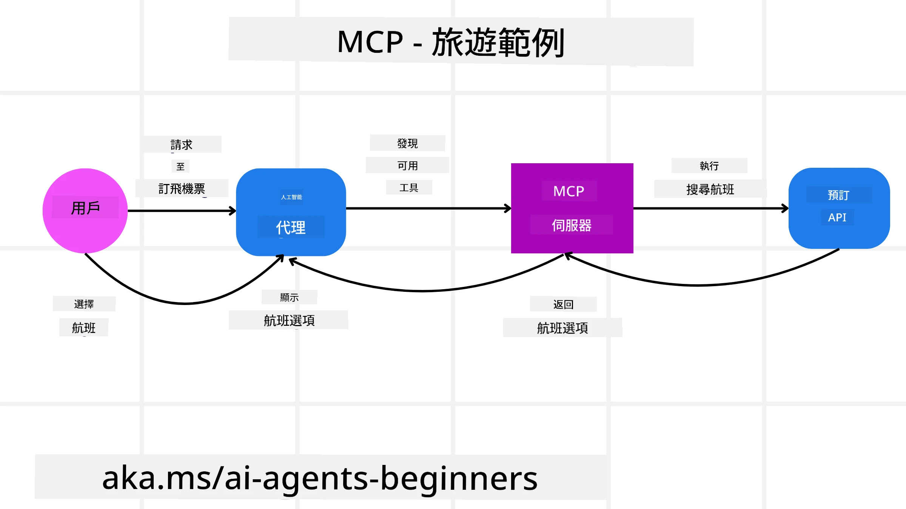
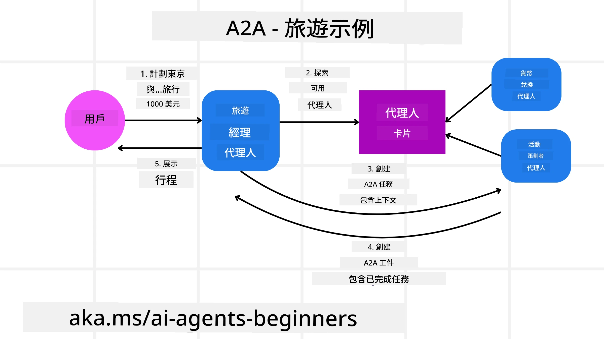
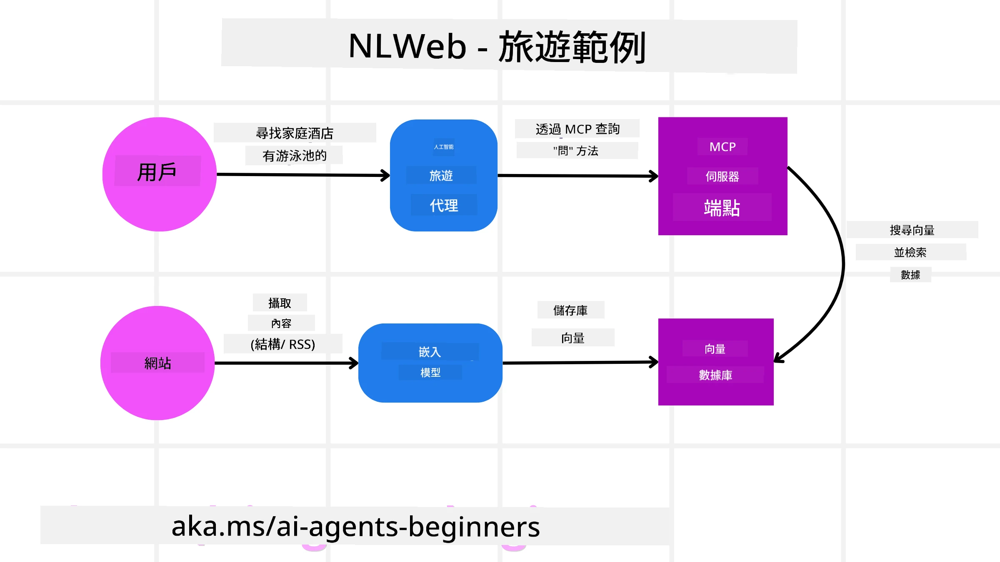

# 使用具代理性的協定 (MCP、A2A 與 NLWeb)

> _(按一下上方圖片以觀看本課程的影片)_

隨著 AI 代理的使用增加，也越來越需要確保標準化、安全性並支援開放創新的協定。在本課程中，我們將介紹三種旨在滿足此需求的協定 — Model Context Protocol (MCP)、Agent to Agent (A2A) 與 Natural Language Web (NLWeb)。

## 介紹

在本課程中，我們將涵蓋：

• **MCP** 如何允許 AI 代理存取外部工具和資料以完成使用者任務。

• **A2A** 如何讓不同的 AI 代理之間進行通訊與協作。

• **NLWeb** 如何把自然語言介面帶到任何網站，使 AI 代理能發現並與內容互動。

## 學習目標

• **辨識** MCP、A2A 與 NLWeb 在 AI 代理情境中的核心目的與好處。

• **說明** 每個協定如何促進 LLM、工具與其他代理之間的通訊與互動。

• **認識** 每個協定在建構複雜代理系統時所扮演的不同角色。

## Model Context Protocol

**Model Context Protocol (MCP)** 是一個開放標準，提供應用程式向 LLM 提供上下文與工具的標準化方式。這讓 AI 代理可以以一致的方式連接到不同的資料來源與工具，成為一個「通用介面」。

讓我們來看看 MCP 的組成部分、相較於直接使用 API 的好處，以及 AI 代理如何使用 MCP 伺服器的範例。

### MCP 核心組件

MCP 以**客戶端-伺服器架構**運作，核心組件包括：

• **Hosts** 是啟動與 MCP 伺服器連線的 LLM 應用程式（例如像 VSCode 這樣的程式碼編輯器）。

• **Clients** 是主機應用程式內的元件，與伺服器維持一對一的連線。

• **Servers** 是暴露特定功能的輕量程式。

協定中包含三個核心原語，這些就是 MCP 伺服器的能力：

• **Tools**：這些是 AI 代理可以呼叫以執行動作的離散操作或功能。例如，天氣服務可能會暴露「取得天氣」工具，或電商伺服器可能會暴露「購買商品」工具。MCP 伺服器會在其能力清單中宣告每個工具的名稱、描述與輸入/輸出模式。

• **Resources**：這些是 MCP 伺服器可提供的唯讀資料項或文件，客戶端可以按需擷取。範例包括檔案內容、資料庫紀錄或日誌檔。Resources 可以是文字（如程式碼或 JSON）或二進位（如圖片或 PDF）。

• **Prompts**：這些是預先定義的範本，提供建議的提示，允許更複雜的工作流程。

### MCP 的好處

MCP 為 AI 代理提供顯著優勢：

• **動態工具發現**：代理可以動態從伺服器接收可用工具清單以及它們的說明。這與傳統 API 不同，後者通常需要靜態編碼來整合，任何 API 變更都需要更新程式碼。MCP 提供「一次整合」的方法，帶來更高的適應性。

• **跨 LLM 的互通性**：MCP 可在不同 LLM 間運作，提供靈活性以切換核心模型來評估更佳效能。

• **標準化的安全性**：MCP 包含標準的驗證方法，在新增對更多 MCP 伺服器的存取時提升可擴充性。這比管理各種傳統 API 的不同金鑰與驗證類型更簡單。

### MCP 範例

假設使用者想使用由 MCP 提供支援的 AI 助手來訂機票。

1. **連線**：AI 助手（MCP 客戶端）連線到航空公司提供的 MCP 伺服器。

2. **工具發現**：客戶端詢問航空公司的 MCP 伺服器：「你有什麼可用的工具？」伺服器回應像是「搜尋航班」與「訂票」等工具。

3. **工具呼叫**：接著你請 AI 助手「請幫我搜尋從 Portland 到 Honolulu 的航班。」AI 助手使用其 LLM 判斷需要呼叫「搜尋航班」工具，並將相關參數（出發地、目的地）傳給 MCP 伺服器。

4. **執行與回應**：MCP 伺服器作為包裝層，實際呼叫航空公司的內部訂票 API，然後接收航班資訊（例如 JSON 資料）並回傳給 AI 助手。

5. **進一步互動**：AI 助手呈現航班選項。當你選擇一個航班時，助理可能會在相同的 MCP 伺服器上呼叫「訂票」工具，完成訂票程序。

## 代理對代理協定 (A2A)

當 MCP 著重於連接 LLM 與工具時，**Agent-to-Agent (A2A) 協定** 更進一步，允許不同 AI 代理之間進行通訊與協作。A2A 將不同組織、環境與技術堆疊中的 AI 代理連接起來，以完成共同任務。

我們將檢視 A2A 的組件與好處，並以我們的旅遊應用為例說明如何應用。

### A2A 核心組件

A2A 著重於讓代理之間進行通訊，並共同完成使用者的子任務。協定的每個組件都有助於此目標：

#### Agent Card

類似 MCP 伺服器分享工具清單的方式，Agent Card 包含：
- 代理的名稱 .
- 一個**關於其可完成一般任務的描述**。
- 一份**具體技能清單**與描述，幫助其他代理（或甚至人類使用者）了解何時以及為何會想要呼叫該代理。
- 代理的**目前 Endpoint URL**
- 代理的**版本**與**能力**，例如串流回應與推播通知。

#### Agent Executor

Agent Executor 負責**將使用者聊天的上下文傳遞給遠端代理**，遠端代理需要這些資訊以理解需要完成的任務。在 A2A 伺服器中，一個代理使用其自己的大型語言模型 (LLM) 解析傳入請求並使用其內部工具執行任務。

#### Artifact

當遠端代理完成請求的任務後，其工作產物會被建立為 artifact。artifact **包含代理工作的結果**、**所完成工作的描述**，以及透過協定傳遞的**文字上下文**。artifact 傳送後，與遠端代理的連線會關閉，直到再次需要時才重新建立。

#### Event Queue

此元件用於**處理更新與傳遞訊息**。在生產環境中對代理系統特別重要，可防止在任務尚未完成前代理之間的連線被關閉，尤其當任務完成時間可能較長時。

### A2A 的好處

• **強化協作**：它使不同供應商與平台的代理能互動、分享上下文並共同作業，促進跨越傳統孤立系統的無縫自動化。

• **模型選擇彈性**：每個 A2A 代理可以決定其用於處理請求的 LLM，允許為每個代理選擇最佳化或微調的模型，與某些 MCP 情境中單一 LLM 連線不同。

• **內建驗證機制**：驗證直接整合於 A2A 協定中，為代理互動提供健全的安全框架。

### A2A 範例

讓我們以旅遊訂票情境為擴展，但這次使用 A2A。

1. **使用者對多代理的請求**：使用者與一個「旅遊代理」A2A 客戶端/代理互動，可能會說：「請幫我為下週到 Honolulu 安排整個行程，包括航班、飯店和租車」。

2. **旅遊代理的協調**：旅遊代理收到這個複雜請求。它使用其 LLM 推理任務並判斷需要與其他專門代理互動。

3. **代理間通訊**：旅遊代理接著使用 A2A 協定連接到下游代理，例如由不同公司建立的「航空代理」、「飯店代理」和「租車代理」。

4. **委派任務執行**：旅遊代理將具體任務傳送給這些專門代理（例如：「查找到 Honolulu 的航班」、「訂飯店」、「租車」）。每個專門代理運行自己的 LLM 並使用自己的工具（這些工具本身也可能是 MCP 伺服器），執行其特定的訂票部分。

5. **整合回應**：當所有下游代理完成其任務後，旅遊代理彙整結果（航班細節、飯店確認、租車訂單），並以綜合的聊天式回應發回給使用者。

## 自然語言網路 (NLWeb)

網站長久以來一直是使用者存取網際網路上資訊與資料的主要方式。

讓我們檢視 NLWeb 的不同組件、NLWeb 的好處，並透過我們的旅遊應用範例來說明 NLWeb 的運作方式。

### NLWeb 的組件

- **NLWeb 應用程式（核心服務程式碼）**：處理自然語言問題的系統。它連接平台的不同部分以產生回應。你可以把它視為網站自然語言功能的**引擎**。

- **NLWeb 協定**：這是一套**用於與網站進行自然語言互動的基本規則**。它以 JSON 格式回傳回應（常使用 Schema.org）。其目的是為「AI 網路」建立一個簡單的基礎，就像 HTML 使線上分享文件成為可能一樣。

- **MCP 伺服器（Model Context Protocol 端點）**：每個 NLWeb 設定也可作為一個 **MCP 伺服器**。這表示它可以**與其他 AI 系統分享工具（例如「ask」方法）與資料**。實務上，這使網站的內容與功能可被 AI 代理使用，讓網站成為更廣泛「代理生態系」的一部分。

- **Embedding Models**：這些模型用於**將網站內容轉換成稱為向量（embeddings）的數值表示**。這些向量以能讓電腦比較與搜尋的方式捕捉意義。它們儲存在特殊的資料庫中，使用者可以選擇想使用的 embedding 模型。

- **向量資料庫（檢索機制）**：此資料庫**儲存網站內容的 embeddings**。當有人提出問題時，NLWeb 會檢查向量資料庫以快速找到最相關的資訊。它會依相似性給出快速的可能答案清單。NLWeb 可與不同的向量儲存系統合作，例如 Qdrant、Snowflake、Milvus、Azure AI Search 及 Elasticsearch。

### NLWeb 範例

再以我們的旅遊訂票網站為例，但這次由 NLWeb 提供支援。

1. **資料擷取**：旅遊網站現有的產品目錄（例如航班清單、飯店描述、旅遊套裝）使用 Schema.org 格式化或透過 RSS 提供。NLWeb 的工具擷取這些結構化資料，建立 embeddings，並儲存在本地或遠端的向量資料庫中。

2. **自然語言查詢（人類）**：使用者瀏覽網站，並非透過選單導覽，而是在聊天介面輸入：「幫我找下週在 Honolulu 有游泳池且適合家庭入住的飯店」。

3. **NLWeb 處理**：NLWeb 應用程式接收此查詢。它將查詢傳給 LLM 以理解意圖，並同時在其向量資料庫中搜尋相關的飯店清單。

4. **精準結果**：LLM 協助解析資料庫的搜尋結果，依據「適合家庭」、「游泳池」與「Honolulu」等條件辨識最佳匹配，然後格式化為自然語言回應。關鍵是，回應會參考網站目錄中的實際飯店，避免捏造資訊。

5. **AI 代理互動**：由於 NLWeb 同時作為 MCP 伺服器，外部的 AI 旅遊代理也可以連接到該網站的 NLWeb 實例。AI 代理便可使用 `ask("Are there any vegan-friendly restaurants in the Honolulu area recommended by the hotel?")` MCP 方法直接查詢該網站。NLWeb 實例會處理此請求，利用其餐廳資訊資料庫（如果已載入），並回傳結構化的 JSON 回應。

### 對 MCP/A2A/NLWeb 有更多問題嗎？

加入 [Microsoft Foundry Discord](https://aka.ms/ai-agents/discord) 與其他學習者交流，參加辦公時間並讓你的 AI 代理問題獲得解答。

## 資源

- [MCP 入門](https://aka.ms/mcp-for-beginners)  
- [MCP 文件](https://learn.microsoft.com/python/api/overview/azure/ai-projects-readme)
- [NLWeb 倉庫](https://github.com/nlweb-ai/NLWeb)
- [Microsoft 代理框架](https://aka.ms/ai-agents-beginners/agent-framewrok)

---

<!-- CO-OP TRANSLATOR DISCLAIMER START -->
免責聲明：
本文件經由人工智能翻譯服務 Co-op Translator (https://github.com/Azure/co-op-translator) 進行翻譯。雖然我們力求準確，但請注意，自動翻譯可能包含錯誤或不準確之處。原文（以文件原始語言為準）應被視為具權威性的來源。對於關鍵資訊，建議採用專業人工翻譯。對於因使用本翻譯而引致的任何誤解或錯誤詮釋，我們概不負責任。
<!-- CO-OP TRANSLATOR DISCLAIMER END -->