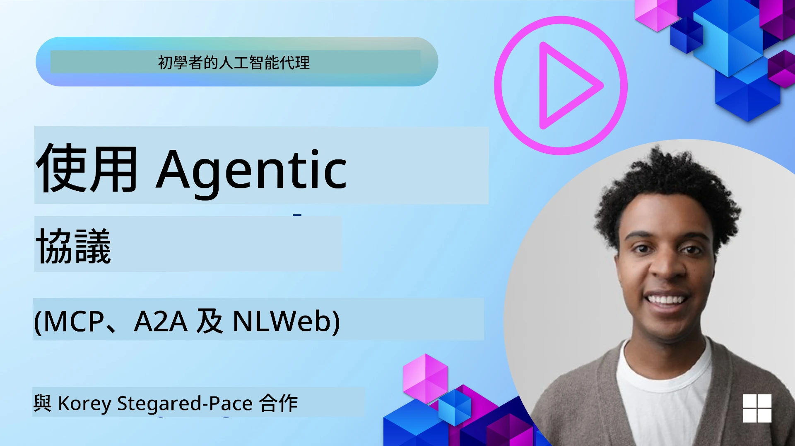
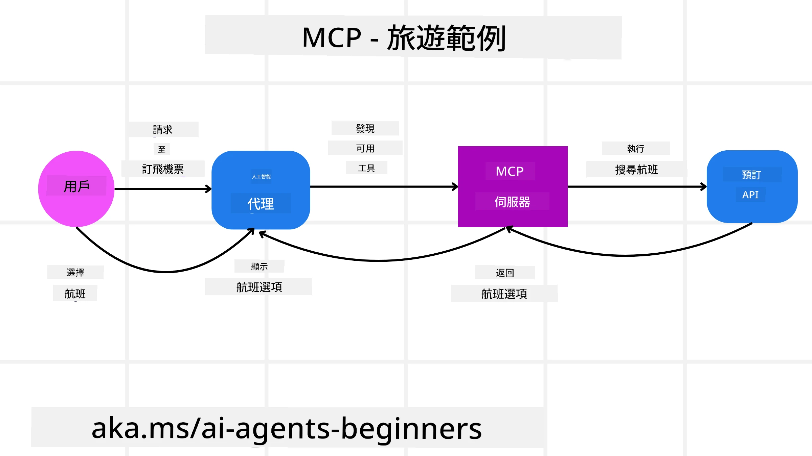
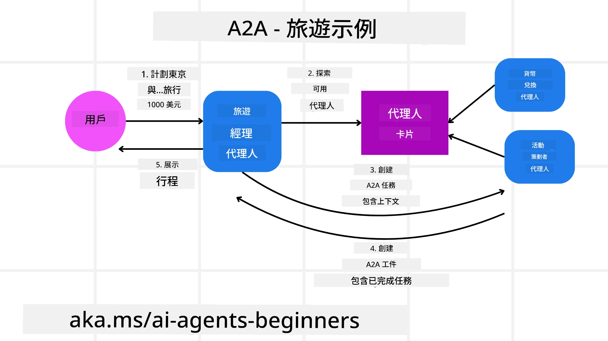
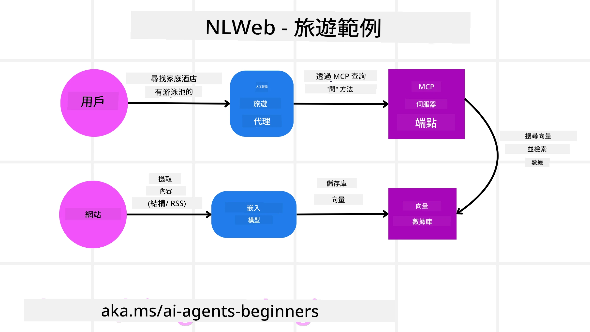

# 使用代理協議 (MCP, A2A 和 NLWeb)

> _(點擊上方圖片觀看本課程影片)_

隨著 AI 代理的使用日益增長，對於確保標準化、安全性並支持開放創新的協議需求也同步增加。本課將介紹三種旨在滿足這些需求的協議 —— 模型上下文協定 (MCP)、代理對代理 (A2A) 以及自然語言網絡 (NLWeb)。

## 介紹

在本課中，我們將討論：

• MCP 如何讓 AI 代理存取外部工具與資料以完成使用者任務。

• A2A 如何促進不同 AI 代理之間的通訊與協作。

• NLWeb 如何為任何網站帶來自然語言介面，讓 AI 代理能夠發現並與網站內容互動。

## 學習目標

• <strong>了解</strong> MCP、A2A 與 NLWeb 在 AI 代理背景下的核心目的與優勢。

• <strong>說明</strong> 每個協議如何促進 LLM、工具與其他代理間的溝通與互動。

• <strong>認識</strong> 各協議在構建複雜代理系統中的不同角色。

## 模型上下文協定

**模型上下文協定 (Model Context Protocol, MCP)** 是一種開放標準，為應用程式向大型語言模型 (LLM) 提供上下文和工具提供標準化方式。這讓 AI 代理可以透過一個「通用轉接器」一致地連接不同的資料來源和工具。

我們將探討 MCP 的組成部分、與直接使用 API 相比的優勢，以及 AI 代理如何利用 MCP 伺服器的一個範例。

### MCP 核心組件

MCP 採用<strong>客戶端-伺服器架構</strong>，核心組件包括：

• <strong>主機</strong> 是大型語言模型應用程式（例如代碼編輯器 VSCode），負責啟動與 MCP 伺服器的連接。

• <strong>客戶端</strong> 是主機應用程式中的組件，負責與伺服器維持一對一的連接。

• <strong>伺服器</strong> 是輕量程式，負責提供特定能力。

協定中包含三種核心元素，這些是 MCP 伺服器的能力：

• <strong>工具</strong>：AI 代理可以調用的獨立動作或函數。例如，一個天氣服務可能會提供「取得天氣」工具，電子商務伺服器可能提供「購買商品」工具。MCP 伺服器會在其能力列表中公布每個工具的名稱、描述和輸入/輸出結構。

• <strong>資源</strong>：MCP 伺服器可提供的只讀資料項或文件，客戶端可按需檢索。範例包括檔案內容、資料庫記錄或日誌文件。資源可為文字（如程式碼或 JSON）或二進位（如圖片或 PDF）。

• <strong>提示</strong>：預先定義的模板，提供建議提示，允許更複雜的工作流程。

### MCP 優勢

MCP 為 AI 代理帶來重要優勢：

• <strong>動態工具發現</strong>：代理能夠動態獲取伺服器上可用工具清單及其功能描述。這與傳統 API 不同，後者通常需要靜態編碼整合，任何 API 變更都需要更新程式碼。MCP 採用「一次整合」的方式，更具適應性。

• **跨 LLM 的互通性**：MCP 可與不同的 LLM 一起使用，提供更換核心模型以提升表現的彈性。

• <strong>標準化安全性</strong>：MCP 包含標準認證方法，提升新增 MCP 伺服器存取的擴展性，比起管理多樣的 API 金鑰及認證方式更簡單。

### MCP 範例

想像一位使用者想用由 MCP 支援的 AI 助手預訂機票。

1. <strong>連接</strong>：AI 助手（作為 MCP 客戶端）連接到航空公司提供的 MCP 伺服器。

2. <strong>工具發現</strong>：客戶端詢問航空公司的 MCP 伺服器：「你有什麼工具可以用？」伺服器回應有「搜尋航班」和「訂票」等工具。

3. <strong>工具調用</strong>：使用者請 AI 助手「請幫我搜尋從波特蘭飛到檀香山的航班。」AI 助手透過其 LLM 辨識需呼叫「搜尋航班」工具，並傳送相關參數（出發地、目的地）給 MCP 伺服器。

4. <strong>執行與回應</strong>：MCP 伺服器作為包裝器，實際呼叫航空公司的內部訂票 API，然後接收航班資訊（例如 JSON 資料）並回傳給 AI 助手。

5. <strong>進一步互動</strong>：AI 助手展示航班選項，當使用者選定航班後，助手會調用同一 MCP 伺服器上的「訂票」工具以完成訂票。

## 代理對代理協定 (A2A)

MCP 著重於連接 LLM 與工具，而 **代理對代理協定 (Agent-to-Agent, A2A)** 更進一步，允許不同 AI 代理彼此通訊與協作。A2A 連接跨組織、環境及技術堆疊的 AI 代理，共同完成任務。

我們將探討 A2A 的組件與優勢，並通過旅遊應用示範它的應用。

### A2A 核心組件

A2A 聚焦於使代理通訊並互相合作完成使用者子任務，每個組件皆對此有貢獻：

#### 代理卡片

類似 MCP 伺服器分享工具清單，代理卡片包含：
- 代理名稱。
- <strong>其完成的一般任務描述</strong>。
- <strong>具體技能清單</strong>，並附說明幫助其它代理（或人類使用者）瞭解何時何故調用該代理。
- 代理當前的<strong>端點 URL</strong>。
- 代理<strong>版本</strong>及<strong>功能</strong>，例如串流回應及推送通知。

#### 代理執行者

代理執行者負責<strong>將使用者聊天上下文傳遞給遠端代理</strong>，因遠端代理需此上下文來理解任務。在 A2A 伺服器中，代理使用自己的大型語言模型解析請求並調用內部工具來執行任務。

#### 成果物

遠端代理完成任務後，會創建一個成果物。該成果物<strong>包含代理的工作結果</strong>、<strong>完成內容的描述</strong>，以及透過協定傳送的<strong>文字上下文</strong>。成果物傳送完成後，與遠端代理的連線關閉，直至再次需要。

#### 事件隊列

此組件用於<strong>處理更新和傳遞訊息</strong>。在代理系統生產環境中特別重要，可防止任務尚未完成就斷開代理間連線，尤其當任務可能耗時較長。

### A2A 優勢

• <strong>增強協作</strong>：它促進不同廠商及平台的代理相互作用、共享上下文與合作，促成原本割裂系統間的無縫自動化。

• <strong>模型選擇彈性</strong>：每個 A2A 代理可自行決定所使用的 LLM，允許每個代理採用最佳化或微調模型，不同於某些 MCP 場景下僅有單一 LLM 連接。

• <strong>內建認證機制</strong>：認證直接整合在 A2A 協議中，為代理互動提供堅實的安全框架。

### A2A 範例

延伸我們的旅遊訂票情境，這次使用 A2A。

1. <strong>使用者向多代理請求</strong>：使用者與「旅遊代理」A2A 客戶端/代理互動，可能說：「請幫我預訂下週到檀香山的整趟旅程，包括機票、飯店和租車」。

2. <strong>旅遊代理協調</strong>：旅遊代理收到複雜請求，利用其 LLM 理解任務，決定需要與其他專門代理互動。

3. <strong>代理間通訊</strong>：旅遊代理採用 A2A 協議連接下游代理，例如由不同公司建立的「航空公司代理」、「飯店代理」和「租車代理」。

4. <strong>委派任務執行</strong>：旅遊代理分配具體任務給這些專門代理（例如「尋找飛往檀香山航班」、「預訂飯店」、「租車」）。各專門代理運行自己的 LLM 並透過自己的工具（可能也為 MCP 伺服器）完成各自的訂票任務。

5. <strong>整合回應</strong>：下游代理任務完成後，旅遊代理彙整結果（航班明細、飯店確認、租車訂單），以對話風格回覆使用者。

## 自然語言網絡 (NLWeb)

網站長期以來是使用者存取網路資訊與資料的主要方式。

讓我們看看 NLWeb 的不同組成部分、其優勢和透過旅遊應用說明其運作方式。

### NLWeb 的組成部分

- **NLWeb 應用程式（核心服務代碼）**：處理自然語言問題的系統。它連結平台各部分以生成回應。可以將其視為<strong>推動網站自然語言功能的引擎</strong>。

- **NLWeb 協議**：針對網站自然語言互動的<strong>基本規則集</strong>。以 JSON 格式（常用 Schema.org）回傳回應。其目標是為「AI 網路」創造簡單基礎，正如 HTML 促成文件線上分享。

- **MCP 伺服器（模型上下文協定端點）**：每個 NLWeb 部署同時也是一個<strong>MCP 伺服器</strong>。這意味著它能<strong>與其他 AI 系統共享工具（如「詢問」方法）及資料</strong>。實際上，這使得網站內容與功能可被 AI 代理使用，讓該網站成為更廣泛「代理生態系統」的一部分。

- <strong>嵌入模型</strong>：用來<strong>將網站內容轉換成稱為向量（embeddings）的數值表示</strong>。這些向量以可以比較和搜尋的方式捕捉意義。它們存儲於特殊資料庫，用戶可選擇想使用的嵌入模型。

- **向量資料庫（檢索機制）**：此資料庫<strong>儲存網站內容的嵌入向量</strong>。當有人提出問題時，NLWeb 會查詢向量資料庫以迅速找到最相關資訊。它提供依相似度排名的快速答案列表。NLWeb 支援多種向量存儲系統，如 Qdrant、Snowflake、Milvus、Azure AI Search 及 Elasticsearch。

### NLWeb 範例

再次以我們的旅遊訂票網站為例，但這次由 NLWeb 提供動力。

1. <strong>資料攝取</strong>：旅遊網站現有產品目錄（如航班列表、飯店說明、旅遊套裝）以 Schema.org 格式化或透過 RSS 載入。NLWeb 的工具攝取此結構化資料，產生嵌入，並存入本地或遠端向量資料庫。

2. **自然語言查詢（使用者）**：用戶訪問網站，不是透過選單導航，而是在對話界面輸入：「幫我找下週在檀香山，有游泳池且適合家庭的飯店」。

3. **NLWeb 處理**：NLWeb 應用程式接收查詢，將其發送給 LLM 理解，同時搜尋向量資料庫中相關的飯店列表。

4. <strong>精確結果</strong>：LLM 協助詮釋資料庫搜尋結果，依據「適合家庭」、「游泳池」及「檀香山」條件找出最佳匹配，然後格式化為自然語言回覆。關鍵在於回應引用網站目錄的實際飯店資料，避免虛構資訊。

5. **AI 代理互動**：因為 NLWeb 同時作為 MCP 伺服器，外部 AI 旅遊代理也可連線此網站的 NLWeb 範例。AI 代理可使用 `ask` MCP 方法直接查詢網站：`ask("有沒有飯店推薦的檀香山素食友善餐廳？")`。NLWeb 範例會處理此查詢，利用餐廳資料庫（若已載入）回傳結構化的 JSON 回應。

### 對 MCP/A2A/NLWeb 還有更多問題？

加入 [Microsoft Foundry Discord](https://discord.com/invite/ATgtXmAS5D)，與其他學員交流，參加辦公時間並獲得 AI 代理相關問題的解答。

## 資源

- [MCP 入門](https://aka.ms/mcp-for-beginners)  
- [MCP 文件](https://learn.microsoft.com/python/api/overview/azure/ai-projects-readme)
- [NLWeb 倉庫](https://github.com/nlweb-ai/NLWeb)
- [Microsoft 代理框架](https://learn.microsoft.com/en-us/agent-framework/overview/?wt.mc_id=youtube_26688_organicsocial_reactor&pivots=programming-language-python)

## 上一課

[產品化中的 AI 代理](../10-ai-agents-production/README.md)

## 下一課

[AI 代理的上下文工程](../12-context-engineering/README.md)

---

<!-- CO-OP TRANSLATOR DISCLAIMER START -->
**免責聲明**：
本文件使用 AI 翻譯服務 [Co-op Translator](https://github.com/Azure/co-op-translator) 進行翻譯。雖然我們力求準確，但請注意，自動翻譯可能包含錯誤或不準確之處。原始文件的母語版本應被視為權威來源。對於重要資訊，建議尋求專業人工翻譯。我們不對因使用本翻譯而引起的任何誤解或曲解承擔責任。
<!-- CO-OP TRANSLATOR DISCLAIMER END -->