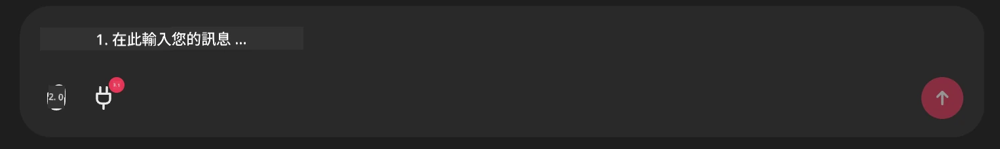

# Github MCP Server 範例

## 說明

這是為 Microsoft Reactor 主辦的 AI Agents Hackathon 所製作的示範。

此工具用於根據使用者的 Github 倉庫推薦 hackathon 專案。這是透過下列方式完成：

1. **Github Agent** - 使用 Github MCP Server 擷取倉庫及其相關資訊。
2. **Hackathon Agent** - 取用來自 Github Agent 的資料，根據專案、使用者使用的程式語言以及 AI Agents hackathon 的專案類別，構思創意的 hackathon 專案點子。
3. **Events Agent** - 根據 Hackathon Agent 的建議，Events Agent 會從 AI Agent Hackathon 系列中推薦相關活動。

## Running the code 

### Environment Variables

此示範使用 Microsoft Agent Framework、Azure OpenAI Service、Github MCP Server 與 Azure AI Search。

請確保已設定正確的環境變數以使用這些工具：

```python
AZURE_AI_PROJECT_ENDPOINT=""
AZURE_AI_MODEL_DEPLOYMENT_NAME=""
AZURE_SEARCH_SERVICE_ENDPOINT=""
AZURE_SEARCH_API_KEY=""
``` 

## Running the Chainlit Server

為了連接 MCP 伺服器，此示範使用 Chainlit 作為聊天介面。 

要啟動伺服器，請在終端機中使用下列指令：

```bash
chainlit run app.py -w
```

這會在 `localhost:8000` 啟動你的 Chainlit 伺服器，並使用 `event-descriptions.md` 的內容填充你的 Azure AI Search Index。 

## Connecting to the MCP Server

要連接 Github MCP Server，請在 "Type your message here.." 聊天方塊下方選擇 "plug" 圖示：



然後你可以點選 "Connect an MCP" 以加入連接到 Github MCP Server 的指令：

```bash
npx -y @modelcontextprotocol/server-github --env GITHUB_PERSONAL_ACCESS_TOKEN=[YOUR PERSONAL ACCESS TOKEN]
```

將 "[YOUR PERSONAL ACCESS TOKEN]" 替換成你實際的 Personal Access Token。 

連線成功後，你應該會在 plug 圖示旁看到 (1) 以確認已連接。如未顯示，請嘗試使用 `chainlit run app.py -w` 重新啟動 chainlit 伺服器。

## Using the Demo 

若要啟動推薦 hackathon 專案的 agent 工作流程，你可以輸入類似的訊息： 

"為 Github 使用者 koreyspace 推薦 hackathon 專案"

Router Agent 會分析你的請求，並判斷哪種 agent 組合（GitHub、Hackathon、和 Events）最適合處理你的查詢。這些 agents 會協同作業，根據 GitHub 倉庫分析、專案概念發想以及相關技術活動，提供完整的推薦。

---

<!-- CO-OP TRANSLATOR DISCLAIMER START -->
免責聲明：
本文件已透過 AI 翻譯服務 [Co-op Translator](https://github.com/Azure/co-op-translator) 進行翻譯。雖然我們力求準確，但請注意自動翻譯可能包含錯誤或不準確之處。原始語言的文件應視為具權威性的版本。對於關鍵資訊，建議採用專業人工翻譯。我們不對因使用本翻譯所引起的任何誤解或錯誤詮釋負責。
<!-- CO-OP TRANSLATOR DISCLAIMER END -->