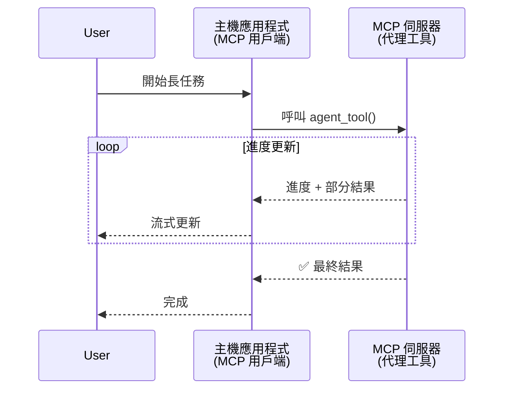
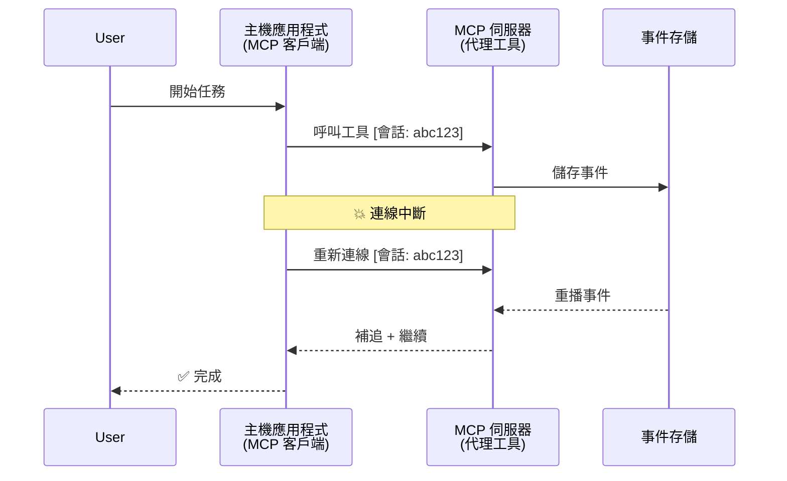
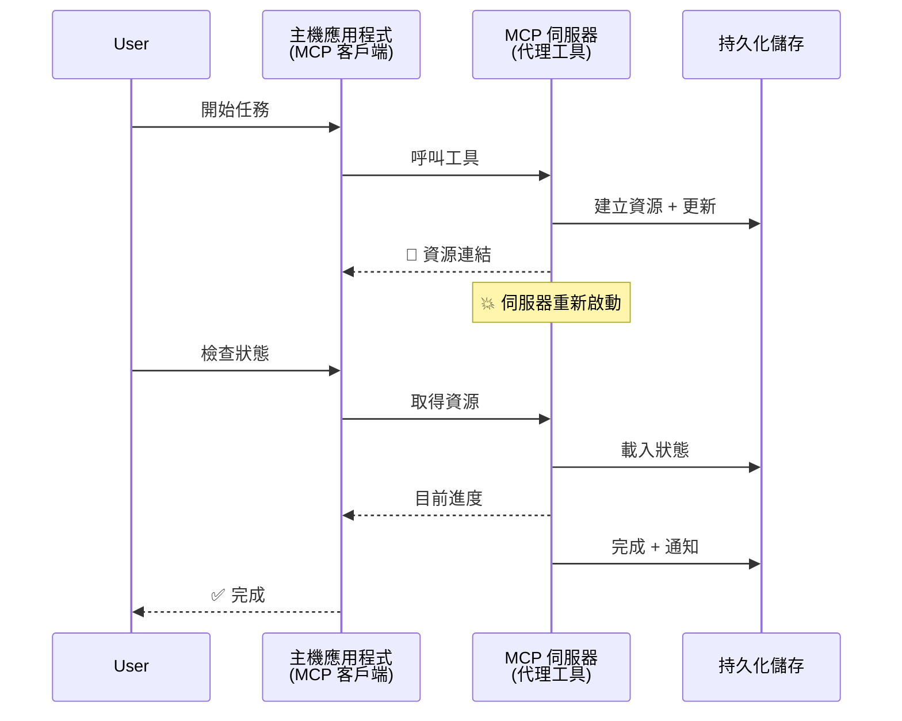
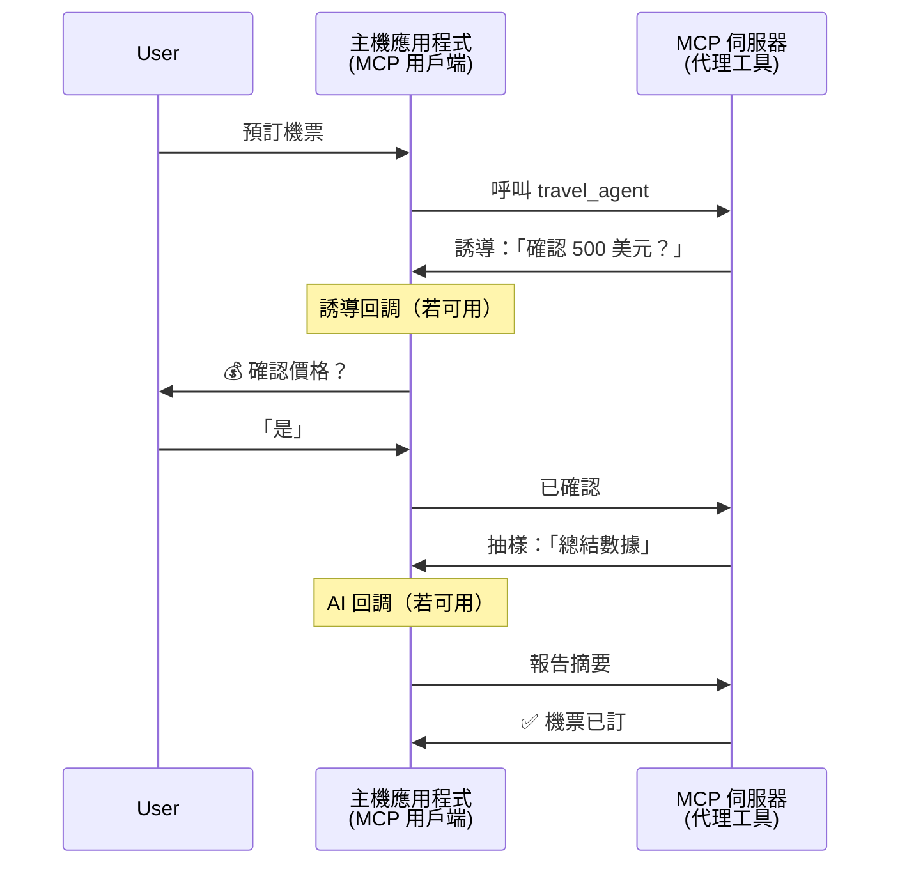
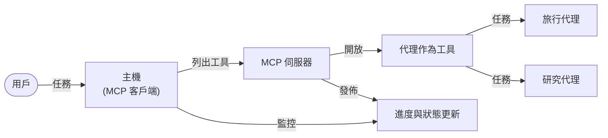

# 使用 MCP 建立代理人之間通訊系統

> 簡短摘要 - 你能在 MCP 上建立代理人對代理人通訊嗎？答案是可以！

MCP 已經遠遠超越其最初「為大型語言模型(LLM)提供上下文」的目標。最近的增強功能包括[可恢復的串流](https://modelcontextprotocol.io/docs/concepts/transports#resumability-and-redelivery)、[引導](https://modelcontextprotocol.io/specification/2025-06-18/client/elicitation)、[採樣](https://modelcontextprotocol.io/specification/2025-06-18/client/sampling)和通知（[進度](https://modelcontextprotocol.io/specification/2025-06-18/basic/utilities/progress)和[資源](https://modelcontextprotocol.io/specification/2025-06-18/schema#resourceupdatednotification)），MCP 現在提供了建構複雜代理人互通系統的堅實基礎。

## 代理人/工具的誤解

隨著越來越多開發者探索具備代理人行為的工具（可長時間運行，可能在執行中需要額外輸入等），一個常見的誤解是 MCP 不適用，主要因為早期工具範例只聚焦於簡單的請求-回應模式。

這種看法已經過時。MCP 規範在過去幾個月內大幅擴充了功能，填補了建立長時間運行代理人行為的缺口：

- <strong>串流與部分結果</strong>：執行過程中的即時進度更新
- <strong>可恢復性</strong>：客戶端可斷線後重連並繼續
- <strong>耐久性</strong>：結果可存活伺服器重啟（例如透過資源連結）
- <strong>多回合交互</strong>：透過引導與採樣，執行中可進行互動輸入

這些功能可以組合使用，以支持複雜的代理人及多代理應用，全部部署在 MCP 協議上。

為方便參考，我們稱代理人為一個在 MCP 伺服器上的「工具」。這代表存在實作 MCP 用戶端的主機應用程式，該用戶端建立與 MCP 伺服器的會話，並可呼叫該代理人。

## 什麼讓 MCP 工具成為「代理性」？

在深入實作之前，讓我們先釐清支持長時間運行代理人需要的基礎架構能力。

> 我們將代理人定義為一個能自主運作長時間的實體，能處理可能需要多次交互或根據即時反饋調整的複雜任務。

### 1. 串流與部分結果

傳統的請求-回應模式無法適用於長時間執行任務。代理人需要提供：

- 即時進度更新
- 中間結果

**MCP 支援**：資源更新通知支持串流部份結果，但這需要謹慎設計以避免與 JSON-RPC 1:1 請求/回應模型衝突。

| 功能                        | 用例                                                                                                                                                                  | MCP 支援                                                                                   |
| -------------------------- | --------------------------------------------------------------------------------------------------------------------------------------------------------------------- | ------------------------------------------------------------------------------------------- |
| 即時進度更新                | 使用者請求程式碼庫遷移任務。代理人串流進度：「10% - 分析依賴中... 25% - 轉換 TypeScript 檔案... 50% - 更新匯入中...」                                                | ✅ 進度通知                                                                                 |
| 部分結果                    | 「產生書籍」任務串流部分結果，例如：1) 故事情節概要，2) 章節列表，3) 每章完成狀態。主機可在任意階段檢查、中止或重新導向。                                        | ✅ 通知可「擴展」包含部分結果，見 PR 383, 776 的提案                                          |

<div align="center" style="font-style: italic; font-size: 0.95em; margin-bottom: 0.5em;">
<strong>圖 1：</strong> 此圖示說明 MCP 代理如何在長時間運行任務期間串流即時進度更新與部分結果給主機應用，使使用者能即時監控執行狀態。
</div>



### 2. 可恢復性

代理必須能優雅處理網絡中斷：

- 斷線後重新連接
- 從中斷點繼續（訊息重送）

**MCP 支援**：目前 MCP 的 StreamableHTTP 傳輸支援會話恢復及訊息重送，透過會話 ID 及最後事件 ID。重要的是，伺服器必須實作事件存儲，支持客戶端重連時播放事件。  
社群中有提案（PR #975）正在探索獨立傳輸層的可恢復串流。

| 功能        | 用例                                                                                                                                                        | MCP 支援                                                                 |
| ---------- | ----------------------------------------------------------------------------------------------------------------------------------------------------------- | ----------------------------------------------------------------------- |
| 可恢復性    | 客戶端在長任務中斷線，重新連接後會話恢復並重播遺漏事件，無縫繼續中斷前進度。                                                                            | ✅ StreamableHTTP 傳輸支援會話 ID、事件重播與事件存儲                    |

<div align="center" style="font-style: italic; font-size: 0.95em; margin-bottom: 0.5em;">
<strong>圖 2：</strong> 此圖展示 MCP 的 StreamableHTTP 傳輸及事件存儲如何支持無縫的會話恢復：若客戶端斷線，可重新連接並重播遺漏事件，使任務無進度損失地繼續。
</div>



### 3. 耐久性

長時間運行的代理需要持久狀態：

- 結果能存活伺服器重啟
- 狀態可帶外檢索
- 跨會話的進度追蹤

**MCP 支援**：MCP 現已支持工具調用返回資源連結類型。目前常見模式是設計一個工具，在創建資源後立刻返回資源連結。該工具可在背景持續處理任務並更新資源。客戶端可選擇輪詢該資源狀態以獲得部分或完整結果（依伺服器提供的資源更新而定）或訂閱該資源以接收更新通知。

其中一限制是輪詢資源或訂閱更新會消耗資源，且大規模時會帶來影響。社群有開放提案（含 #992）探索由伺服器調用 Webhook 或觸發器以通知客戶端/主機應用的可能性。

| 功能      | 用例                                                                                                                                        | MCP 支援                                                        |
| -------- | -------------------------------------------------------------------------------------------------------------------------------------------- | ------------------------------------------------------------- |
| 耐久性    | 伺服器在資料遷移期間崩潰，結果和進度在重啟後仍然存活，客戶端可檢查狀態並繼續使用持久資源。                                                    | ✅ 帶持久儲存與狀態通知的資源連結                               |

今天常見模式是設計一個工具創建資源並立即返回資源連結。該工具能在背景持續處理任務、發出資源通知作為進度更新或包含部分結果，並依需要更新資源內容。

<div align="center" style="font-style: italic; font-size: 0.95em; margin-bottom: 0.5em;">
<strong>圖 3：</strong> 此圖示演示 MCP 代理如何使用持久資源與狀態通知，確保長時間任務在伺服器重啟後依然存活，使客戶端即使故障後仍能檢查進度及取得結果。
</div>



### 4. 多回合交互

代理經常在執行中需要額外輸入：

- 人工澄清或批准
- AI 輔助複雜決策
- 動態參數調整

**MCP 支援**：完全支持採樣（用於 AI 輸入）和引導（用於人工輸入）。

| 功能                  | 用例                                                                                                                                               | MCP 支援                                               |
| -------------------- | -------------------------------------------------------------------------------------------------------------------------------------------------- | ----------------------------------------------------- |
| 多回合交互            | 旅遊預訂代理要求用戶確認價格，隨後請 AI 總結旅遊數據，最後完成預訂交易。                                                                         | ✅ 引導用於人工輸入，採樣用於 AI 輸入                 |

<div align="center" style="font-style: italic; font-size: 0.95em; margin-bottom: 0.5em;">
<strong>圖 4：</strong> 本圖展示 MCP 代理如何在執行中互動式引導人工輸入或請求 AI 輔助，支持如確認和動態決策等複雜多回合工作流程。
</div>



## 在 MCP 上實作長時間運行代理 - 程式碼概覽

本文附上一個[程式碼倉庫](https://github.com/victordibia/ai-tutorials/tree/main/MCP%20Agents)，其中完整實作了使用 MCP Python SDK 搭配 StreamableHTTP 傳輸，以支援會話恢復與訊息重送的長時間運行代理人。此實作展示如何組合 MCP 功能以實現複雜代理行為。

具體而言，我們實作一個伺服器，擁有兩個主要代理工具：

- <strong>旅遊代理人</strong> - 模擬旅遊預訂服務，透過引導確認價格
- <strong>研究代理人</strong> - 執行研究任務，透過採樣獲得 AI 協助摘要

兩個代理展示即時進度更新、互動確認和完全會話恢復能力。

### 主要實作概念

以下章節示範每項能力的伺服器端代理實作和用戶端主機處理流程：

#### 串流與進度更新 - 任務即時狀態

串流讓代理在長時間任務中提供即時進度更新，讓使用者隨時掌握任務狀態與中間結果。

**伺服器端實作（代理傳送進度通知）：**

```python
# 從 server/server.py - 旅行代理發送進度更新
for i, step in enumerate(steps):
    await ctx.session.send_progress_notification(
        progress_token=ctx.request_id,
        progress=i * 25,
        total=100,
        message=step,
        related_request_id=str(ctx.request_id)
    )
    await anyio.sleep(2)  # 模擬工作

# 替代方案：記錄消息以獲取詳細的逐步更新
await ctx.session.send_log_message(
    level="info",
    data=f"Processing step {current_step}/{steps} ({progress_percent}%)",
    logger="long_running_agent",
    related_request_id=ctx.request_id,
)
```

**用戶端實作（主機接收進度更新）：**

```python
# 從 client/client.py - 處理即時通知的客戶端
async def message_handler(message) -> None:
    if isinstance(message, types.ServerNotification):
        if isinstance(message.root, types.LoggingMessageNotification):
            console.print(f"📡 [dim]{message.root.params.data}[/dim]")
        elif isinstance(message.root, types.ProgressNotification):
            progress = message.root.params
            console.print(f"🔄 [yellow]{progress.message} ({progress.progress}/{progress.total})[/yellow]")

# 建立會話時註冊消息處理器
async with ClientSession(
    read_stream, write_stream,
    message_handler=message_handler
) as session:
```

#### 引導 - 請求用戶輸入

引導允許代理在執行中向用戶請求輸入，這對長時間任務的確認、澄清或批准至關重要。

**伺服器端實作（代理請求確認）：**

```python
# 從 server/server.py - 旅行社請求價格確認
elicit_result = await ctx.session.elicit(
    message=f"Please confirm the estimated price of $1200 for your trip to {destination}",
    requestedSchema=PriceConfirmationSchema.model_json_schema(),
    related_request_id=ctx.request_id,
)

if elicit_result and elicit_result.action == "accept":
    # 繼續預訂
    logger.info(f"User confirmed price: {elicit_result.content}")
elif elicit_result and elicit_result.action == "decline":
    # 取消預訂
    booking_cancelled = True
```

**用戶端實作（主機提供引導回呼）：**

```python
# 從 client/client.py - 處理客戶端引導請求
async def elicitation_callback(context, params):
    console.print(f"💬 Server is asking for confirmation:")
    console.print(f"   {params.message}")

    response = console.input("Do you accept? (y/n): ").strip().lower()

    if response in ['y', 'yes']:
        return types.ElicitResult(
            action="accept",
            content={"confirm": True, "notes": "Confirmed by user"}
        )
    else:
        return types.ElicitResult(
            action="decline",
            content={"confirm": False, "notes": "Declined by user"}
        )

# 在建立會議時註冊回呼函數
async with ClientSession(
    read_stream, write_stream,
    elicitation_callback=elicitation_callback
) as session:
```

#### 採樣 - 請求 AI 協助

採樣讓代理在執行過程中請求大型語言模型的協助，幫助複雜決策或內容生成，實現人機混合工作流程。

**伺服器端實作（代理請求 AI 協助）：**

```python
# 來自 server/server.py - 研究代理請求 AI 摘要
sampling_result = await ctx.session.create_message(
    messages=[
        SamplingMessage(
            role="user",
            content=TextContent(type="text", text=f"Please summarize the key findings for research on: {topic}")
        )
    ],
    max_tokens=100,
    related_request_id=ctx.request_id,
)

if sampling_result and sampling_result.content:
    if sampling_result.content.type == "text":
        sampling_summary = sampling_result.content.text
        logger.info(f"Received sampling summary: {sampling_summary}")
```

**用戶端實作（主機提供採樣回呼）：**

```python
# 來自 client/client.py - 處理採樣請求的客戶端
async def sampling_callback(context, params):
    message_text = params.messages[0].content.text if params.messages else 'No message'
    console.print(f"🧠 Server requested sampling: {message_text}")

    # 在實際應用中，這可以調用一個大型語言模型 API
    # 為演示目的，我們提供一個模擬回應
    mock_response = "Based on current research, MCP has evolved significantly..."

    return types.CreateMessageResult(
        role="assistant",
        content=types.TextContent(type="text", text=mock_response),
        model="interactive-client",
        stopReason="endTurn"
    )

# 建立會話時註冊回調函數
async with ClientSession(
    read_stream, write_stream,
    sampling_callback=sampling_callback,
    elicitation_callback=elicitation_callback
) as session:
```

#### 可恢復性 - 斷線後會話延續

可恢復性確保長時間代理任務能在客戶端斷線後不丟失進度，並在重連後無縫繼續。透過事件存儲和續接令牌實現。

**事件存儲實作（伺服器保存會話狀態）：**

```python
# 從 server/event_store.py - 簡單的記憶體中事件存儲
class SimpleEventStore(EventStore):
    def __init__(self):
        self._events: list[tuple[StreamId, EventId, JSONRPCMessage]] = []
        self._event_id_counter = 0

    async def store_event(self, stream_id: StreamId, message: JSONRPCMessage) -> EventId:
        """Store an event and return its ID."""
        self._event_id_counter += 1
        event_id = str(self._event_id_counter)
        self._events.append((stream_id, event_id, message))
        return event_id

    async def replay_events_after(self, last_event_id: EventId, send_callback: EventCallback) -> StreamId | None:
        """Replay events after the specified ID for resumption."""
        start_index = None
        stream_id = None
        for index, (event_stream_id, event_id, _) in enumerate(self._events):
            if event_id == last_event_id:
                start_index = index + 1
                stream_id = event_stream_id
                break

        if start_index is None:
            return None

        # 只重播會話原始串流中較後的事件。
        for event_stream_id, event_id, message in self._events[start_index:]:
            if event_stream_id != stream_id:
                continue
            await send_callback(EventMessage(message, event_id))

        return stream_id

# 從 server/server.py - 傳遞事件存儲到會話管理器
def create_server_app(event_store: Optional[EventStore] = None) -> Starlette:
    server = ResumableServer()

    # 使用事件存儲建立可續期的會話管理器
    session_manager = StreamableHTTPSessionManager(
        app=server,
        event_store=event_store,  # 事件存儲支援會話續期
        json_response=False,
        security_settings=security_settings,
    )

    return Starlette(routes=[Mount("/mcp", app=session_manager.handle_request)])

# 用法：使用事件存儲進行初始化
event_store = SimpleEventStore()
app = create_server_app(event_store)
```

**用戶端續接令牌元資料（客戶端使用儲存狀態重連）：**

```python
# 從 client/client.py - 用戶端帶有元數據的恢復
if existing_tokens and existing_tokens.get("resumption_token"):
    # 使用現有的恢復令牌繼續我們之前停止的地方
    metadata = ClientMessageMetadata(
        resumption_token=existing_tokens["resumption_token"],
    )
else:
    # 建立回調函數以在接收時保存恢復令牌
    def enhanced_callback(token: str):
        protocol_version = getattr(session, 'protocol_version', None)
        token_manager.save_tokens(session_id, token, protocol_version, command, args)

    metadata = ClientMessageMetadata(
        on_resumption_token_update=enhanced_callback,
    )

# 發送帶有恢復元數據的請求
result = await session.send_request(
    types.ClientRequest(
        types.CallToolRequest(
            method="tools/call",
            params=types.CallToolRequestParams(name=command, arguments=args)
        )
    ),
    types.CallToolResult,
    metadata=metadata,
)
```

主機應用本機維護會話 ID 與續接令牌，支持重新連接已有會話，無需丟失進度或狀態。

### 程式碼組織

<div align="center" style="font-style: italic; font-size: 0.95em; margin-bottom: 0.5em;">
<strong>圖 5：</strong> 基於 MCP 的代理系統架構
</div>



**核心檔案：**

- **`server/server.py`** - 可恢復的 MCP 伺服器，包含旅遊與研究代理，展示引導、採樣和進度更新
- **`client/client.py`** - 支援續接的互動主機應用，包含回呼處理和令牌管理
- **`server/event_store.py`** - 事件存儲實作，支持會話續接和訊息重送

## 擴展至 MCP 上的多代理通訊

上述實作可擴展成多代理系統，藉由提升主機應用的智能和範圍：

- <strong>智能任務分解</strong>：主機分析複雜使用者需求，將其分解為專屬代理的子任務
- <strong>多伺服器協調</strong>：主機同時連接多個 MCP 伺服器，各自暴露不同代理能力
- <strong>任務狀態管理</strong>：主機追蹤多個代理任務的進度，處理依賴關係與順序
- <strong>韌性與重試</strong>：主機管理失敗，實作重試邏輯，代理不可用時重導任務
- <strong>結果合成</strong>：主機將多代理輸出合成成連貫最終結果

主機從簡單用戶端演進為智能協調者，在保持相同 MCP 協議基礎下協調分散的代理能力。

## 結論

MCP 的增強功能——資源通知、引導／採樣、可恢復串流與持久資源——讓複雜代理對代理互動成為可能，同時維持協議的簡潔。

## 開始使用

準備好建立您的代理人對代理人系統了嗎？請依照以下步驟操作：

### 1. 執行示範

```bash
# 使用事件存儲啟動伺服器以便恢復
python -m server.server --port 8006

# 在另一個終端機執行互動式客戶端
python -m client.client --url http://127.0.0.1:8006/mcp
```

**互動模式下可用指令：**

- `travel_agent` - 透過引導確認價格預訂旅遊
- `research_agent` - 透過採樣獲得 AI 輔助摘要來研究主題
- `list` - 顯示所有可用工具
- `clean-tokens` - 清除續接令牌
- `help` - 顯示詳細指令說明
- `quit` - 退出用戶端

### 2. 測試續接功能

- 啟動一個長時間運行代理（例如 `travel_agent`）
- 執行中中斷客戶端（Ctrl+C）
- 重新啟動客戶端，它會自動從中斷點恢復

### 3. 探索與擴展

- <strong>探索範例</strong>：查看此 [mcp-agents](https://github.com/victordibia/ai-tutorials/tree/main/MCP%20Agents)
- <strong>加入社群</strong>：參與 GitHub 上的 MCP 討論
- <strong>實驗</strong>：從簡單長任務開始，並逐步加入串流、可恢復性和多代理協同

這展示 MCP 如何在維持工具簡潔性的同時，使代理行為更智慧。

整體來說，MCP 協議規範正在快速演進；建議讀者隨時查閱官方文件網站以獲取最新資訊 - https://modelcontextprotocol.io/introduction

---

<!-- CO-OP TRANSLATOR DISCLAIMER START -->
**免責聲明**：
本文件使用 AI 翻譯服務 [Co-op Translator](https://github.com/Azure/co-op-translator) 進行翻譯。雖然我們力求準確，但請注意，自動翻譯可能包含錯誤或不準確之處。原始文件的母語版本應被視為權威來源。對於重要資訊，建議尋求專業人工翻譯。我們不對因使用本翻譯而引起的任何誤解或曲解承擔責任。
<!-- CO-OP TRANSLATOR DISCLAIMER END -->