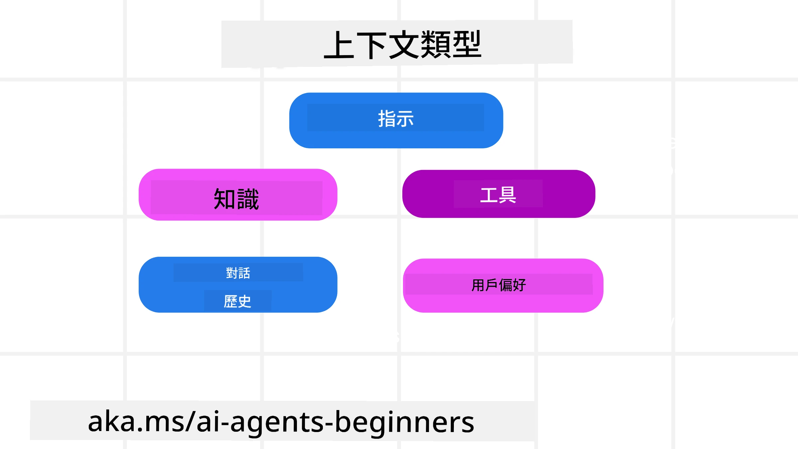
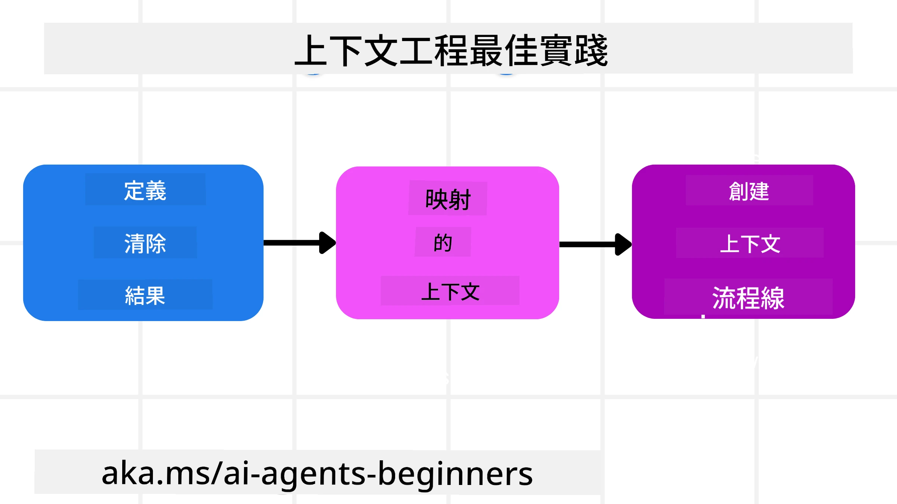

# AI 代理的上下文工程

> _(點擊上方圖片觀看本課程視頻)_

了解您正在為其構建 AI 代理的應用程式的複雜性對於打造可靠的代理非常重要。我們需要建立能有效管理資訊的 AI 代理，以解決超越提示工程的複雜需求。

在本課程中，我們將探討什麼是上下文工程以及其在構建 AI 代理中的角色。

## 簡介

本課程將涵蓋：

• <strong>什麼是上下文工程</strong> 以及為什麼它有別於提示工程。

• <strong>有效上下文工程的策略</strong>，包括如何撰寫、選擇、壓縮和隔離資訊。

• <strong>常見的上下文失敗</strong>，這些問題可能會使 AI 代理失效以及如何修復。

## 學習目標

完成本課程後，您將了解如何：

• <strong>定義上下文工程</strong> 並區分它與提示工程的差異。

• **識別大型語言模型 (LLM) 應用中的關鍵上下文元件**。

• **運用撰寫、選擇、壓縮和隔離上下文的策略**，提升代理的效能。

• <strong>辨識常見的上下文錯誤</strong>，如中毒、分心、混淆和衝突，並實施緩解技術。

## 什麼是上下文工程？

對於 AI 代理來說，上下文是驅動代理規劃採取特定行動的基礎。上下文工程是確保 AI 代理擁有完成下一步任務所需正確資訊的實踐。上下文視窗大小有限，因此作為代理建構者，我們需要打造系統與流程來管理添加、移除與壓縮上下文視窗中的資訊。

### 提示工程與上下文工程的差異

提示工程專注於一套靜態指令來有效引導 AI 代理遵循規則。上下文工程則是如何管理一套動態資訊（包括初始提示），確保 AI 代理隨著時間推移擁有所需資訊。上下文工程的主要理念是讓這個過程可重複且可靠。

### 上下文類型

重要的是要記住，上下文不僅僅是一件事。AI 代理需要的資訊可來自多種不同來源，我們必須確保代理能存取這些來源：

AI 代理可能需要管理的上下文類型包括：

• **指令：** 就像代理的「規則」— 提示、系統訊息、少量示例（展示 AI 如何執行任務）及可用工具的描述。這是提示工程與上下文工程的交匯處。

• **知識：** 包含事實、從資料庫擷取的信息，或代理累積的長期記憶。這也包括整合檢索增強生成（Retrieval Augmented Generation, RAG）系統，假如代理需要訪問不同知識庫和資料庫。

• **工具：** 代理可調用的外部函數、API 以及 MCP 伺服器定義，還包括使用這些工具後所獲得的回饋（結果）。

• **對話歷史：** 與用戶持續的對話。隨著時間推移，這些對話會變得更長更複雜，因此佔用上下文視窗空間。

• **用戶偏好：** 關於用戶喜好或偏好的資訊，隨時間累積。這類資訊可被儲存並在做出關鍵決策時調用，以協助用戶。

## 有效上下文工程策略

### 規劃策略

良好的上下文工程始於良好的規劃。以下是一種能幫助您開始思考如何運用上下文工程概念的方法：

1. <strong>定義明確結果</strong> — AI 代理要執行任務的結果應明確定義。回答「當 AI 代理完成任務後，世界將會是什麼樣子？」換言之，用戶在與 AI 代理交互後應該有什麼改變、資訊或回應。

2. <strong>繪製上下文地圖</strong> — 定義完代理結果後，您需要回答「AI 代理為完成此任務需要什麼資訊？」藉此開始繪製資訊來源的上下文地圖。

3. <strong>建立上下文管線</strong> — 當您知道資訊來源後，接著要回答「代理如何獲取這些資訊？」。此可透過多種方式實現，包括 RAG、使用 MCP 伺服器和其他工具。

### 實務策略

規劃很重要，但當資訊開始流入我們代理的上下文視窗時，我們需要實務策略加以管理：

#### 管理上下文

雖然部分資訊會自動加入上下文視窗，但上下文工程是積極管理這些資訊，以下是幾種策略：

1. **代理備忘錄 (Agent Scratchpad)**  
   允許 AI 代理在單次會話中記錄與當前任務與用戶互動相關的資訊。這應該存在上下文視窗之外，例如文件或執行時物件，代理可在本次會話中必要時檢索。

2. <strong>記憶</strong>  
   備忘錄適合管理單次會話之外的資訊。記憶讓代理能跨多次會話儲存與檢索相關資訊。包括摘要、用戶偏好及未來改進的反饋。

3. <strong>壓縮上下文</strong>  
   當上下文視窗變大而接近限制時，可使用摘要和修剪等技巧。包括只保留最相關資訊，或刪除較舊訊息。

4. <strong>多代理系統</strong>  
   建立多代理系統也是上下文工程的一種形式，因為每個代理有自己的上下文視窗。如何共享與傳遞上下文給不同代理，建構系統時需加以規劃。

5. <strong>沙盒環境</strong>  
   如果代理需要執行程式碼或處理大量文件資訊，可能會佔用大量 token 來處理結果。此時代理可使用沙盒環境執行程式碼，僅讀取結果和其他關聯資訊，而非將全部存入上下文視窗。

6. <strong>執行時狀態物件</strong>  
   透過建立資訊容器管理代理需要存取特定資訊的情境。對複雜任務而言，代理可逐步存儲各子任務結果，使上下文維持僅與特定子任務連接。

#### 檢視上下文

採用上述策略後，值得確認下一次模型調用實際收到了哪些上下文。有效的除錯問題是：

> 代理加載了過多的上下文、錯誤的上下文，還是缺少所需上下文？

您不需記錄原始提示、工具輸出或記憶內容，即可回答上述問題。在生產環境中，優先使用輕量的上下文檢視記錄，包含計數、編號、哈希和政策標籤：

- **選擇：** 跟蹤考慮過多少候選片段、工具或記憶，選擇了多少，以及其他項目被過濾的規則或分數。

- **壓縮：** 記錄來源範圍或追蹤 ID、摘要 ID、壓縮前後估計 token 數，以及原始內容是否被排除於下一次調用。

- **隔離：** 註明哪些子任務於獨立代理、會話或沙盒中執行，回傳的有限摘要，以及大型工具輸出是否保持在父代理上下文之外。

- **記憶與 RAG：** 儲存檢索文件 ID、記憶 ID、分數、選擇的 ID 及編輯狀態，而非完整檢索文本。

- **安全與隱私：** 優先使用哈希、ID、令牌桶及政策標籤，而非敏感提示文本、工具參數、結果或用戶記憶內容。

目標不是保留更多上下文，而是留下足夠證據，令開發者可判斷執行的上下文策略及是否按預期改變下一次模型調用。

### 上下文工程範例

假設我們想讓 AI 代理 **「幫我預訂巴黎之旅。」**

• 單純使用提示工程的代理可能只會回應：**「好的，您想何時去巴黎？」** 它只是處理用戶提問當下的直接問題。

• 採用本課中提及上下文工程策略的代理則會做更多。在回應前，它的系統可能會：

  ◦ <strong>查看您的行事曆</strong> 以查詢可用日期（擷取即時資料）。

  ◦ <strong>回憶過去旅遊偏好</strong>（來自長期記憶），例如您偏好的航空公司、預算，或是否偏好直飛。

  ◦ <strong>識別可用的航班與飯店預訂工具</strong>。

- 例如，其回應可能是：「嗨，[您的名字]！我看到您十月第一週有空。要我用您慣用的預算，在[偏好航空公司]尋找直飛巴黎的航班嗎？」這種更豐富且具上下文感知的回應展示出上下文工程的強大。

## 常見上下文失敗

### 上下文中毒

**定義：** 當幻覺（由 LLM 生成的錯誤資訊）或錯誤進入上下文且反覆被引用，導致代理追求不可能的目標或產生荒謬策略。

**對策：** 實施 <strong>上下文驗證</strong> 和 <strong>隔離處理</strong>。在將資訊加入長期記憶前先驗證。若偵測到潛在中毒，啟動全新上下文線程，避免不良資訊擴散。

**旅遊預訂案例：** 代理幻想「從某個小型地方機場直飛遠方國際城市」，但該機場其實並無國際航班。這不存在的航班資訊被儲存於上下文中。日後您要求預訂時，代理持續嘗試尋找此不可能航線的機票，導致反覆錯誤。

**解決方案：** 在將航班詳情加入代理工作上下文前，先使用即時 API <strong>驗證航班與路線存在性</strong>。若驗證失敗，錯誤資訊會被「隔離」且不再使用。

### 上下文分心

**定義：** 當上下文過大導致模型過於專注於累積歷史，而非其訓練所得，產生重複或無用行為。模型甚至未達視窗限制前就開始犯錯。

**對策：** 使用 <strong>上下文摘要</strong>。定期將累積資訊壓縮為更短摘要，保留重要細節，剔除冗餘歷史。幫助模型「重置」焦點。

**旅遊預訂案例：** 您長時間討論夢想旅遊目的地，甚至詳述兩年前背包旅行。當您終於要求 **「幫我找下月的廉價機票。」** 代理卻陷於舊有無關細節，反覆提問背包裝備或過去行程，忽略當前需求。

**解決方案：** 經過若干輪對話或上下文過大時，代理應 <strong>摘要最近且相關的對話片段</strong>，聚焦於您當前旅遊日期與目的地，並以此濃縮摘要作下一次 LLM 調用，棄用不相關的歷史聊天。

### 上下文混淆

**定義：** 無關上下文（通常是過多可用工具）導致模型產生不良回應或調用無關工具。小型模型尤其容易受此影響。

**對策：** 透過 RAG 技巧實現 <strong>工具負載管理</strong>。將工具描述存於向量資料庫，且只挑選該任務最相關工具。研究指出，限制工具選擇數量少於 30 項效果最佳。

**旅遊預訂案例：** 您的代理可使用數十種工具：`book_flight`、`book_hotel`、`rent_car`、`find_tours`、`currency_converter`、`weather_forecast`、`restaurant_reservations` 等。您問：「在巴黎最方便的交通方式是什麼？」因工具眾多，代理混淆並嘗試在巴黎呼叫 `book_flight`，或即使您偏好大眾運輸卻調用 `rent_car`，因工具描述可能重疊或難以分辨最佳工具。

**解決方案：** 使用 **RAG 檢索工具描述**。當詢問巴黎交通時，系統會動態檢索並僅選擇如 `rent_car` 或 `public_transport_info` 等最相關工具，提供給 LLM 一組聚焦的「工具負載」。

### 上下文衝突

**定義：** 上下文中存在相互矛盾資訊，導致推理不一致或生成不良最終回應。常見於資訊分批到達且早期錯誤假設仍存在上下文。

**對策：** 採用 <strong>上下文修剪</strong> 與 <strong>卸載</strong>。修剪意味著隨新細節加入，移除過時或矛盾資訊。卸載則讓模型擁有獨立「備忘錄」作業區，處理資訊而不干擾主上下文。
**旅遊預訂示例：** 你最初告訴你的代理人，**「我想搭經濟艙。」** 在對話稍後，你改變主意說，**「實際上，這次旅行，我們改搭商務艙。」** 如果這兩個指示都保留在上下文中，代理人可能會收到互相矛盾的搜尋結果，或對該優先考慮哪個偏好感到困惑。

**解決方案：** 實施<strong>上下文修剪</strong>。當新指示與舊指示相矛盾時，舊指示會被移除或在上下文中明確覆蓋。或者，代理人可以使用<strong>草稿本</strong>來調和衝突的偏好，然後再做決定，確保只有最終一致的指示引導其行動。

## 想了解更多關於上下文工程的問題？

加入[Microsoft Foundry Discord](https://aka.ms/ai-agents/discord)與其他學習者會面，參加辦公時間，並獲得有關你的 AI 代理人的問題解答。

---

<!-- CO-OP TRANSLATOR DISCLAIMER START -->
**免責聲明**：
本文件使用 AI 翻譯服務 [Co-op Translator](https://github.com/Azure/co-op-translator) 進行翻譯。雖然我們力求準確，但請注意，自動翻譯可能包含錯誤或不準確之處。原始文件的母語版本應被視為權威來源。對於重要資訊，建議尋求專業人工翻譯。我們不對因使用本翻譯而引起的任何誤解或曲解承擔責任。
<!-- CO-OP TRANSLATOR DISCLAIMER END -->