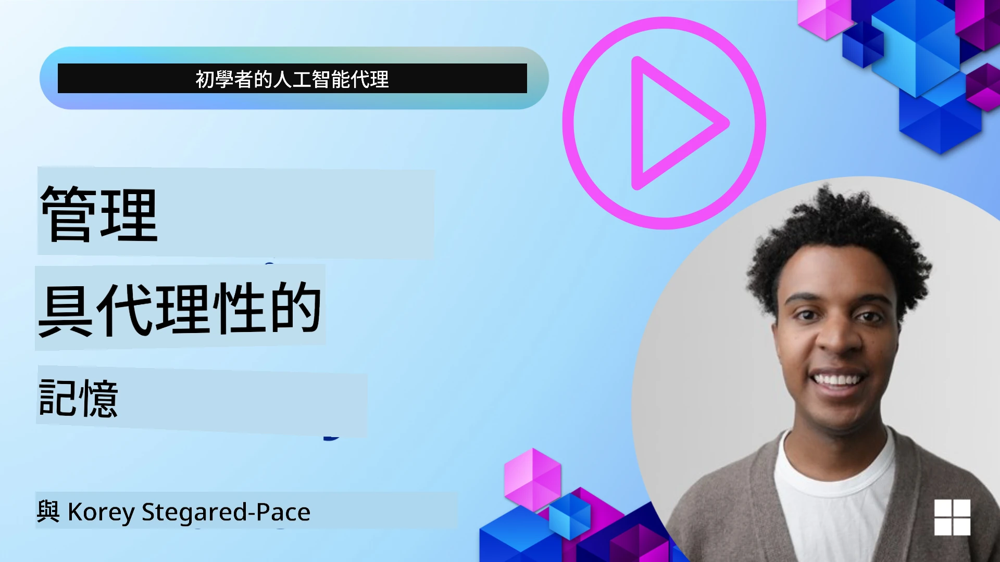

# AI 代理人的記憶 

當討論建立 AI 代理人的獨特優勢時，主要會提到兩件事：能夠呼叫工具以完成任務，以及能夠隨時間改進。記憶是建立能自我改進、為使用者創造更好體驗的代理人的基礎。

在本課程中，我們將探討 AI 代理人的記憶是什麼，以及如何管理和使用它來造福我們的應用程式。

## 介紹

本課程將涵蓋：

• **理解 AI 代理人的記憶**：記憶是什麼以及為何對代理人至關重要。

• **實作與儲存記憶**：為你的 AI 代理人新增記憶功能的實務方法，重點在短期與長期記憶。

• **讓 AI 代理人自我改進**：記憶如何使代理人從過往互動中學習並隨時間改進。

## 可用的實作

本課程包含兩個完整的筆記本教學：

• **[13-agent-memory.ipynb](./13-agent-memory.ipynb)**: Implements memory using Mem0 and Azure AI Search with Microsoft Agent Framework

• **[13-agent-memory-cognee.ipynb](./13-agent-memory-cognee.ipynb)**: Implements structured memory using Cognee, automatically building knowledge graph backed by embeddings, visualizing graph, and intelligent retrieval

## 學習目標

完成本課程後，你將了解如何：

• **分辨各種 AI 代理人的記憶類型**，包括工作記憶、短期記憶與長期記憶，以及像角色記憶和情節式記憶等專門形式。

• **使用 Microsoft Agent Framework 實作與管理 AI 代理人的短期與長期記憶**，利用像 Mem0、Cognee、Whiteboard memory 等工具，並整合 Azure AI Search。

• **理解自我改進 AI 代理人的原理**，以及健全的記憶管理系統如何促進持續學習與適應。

## 理解 AI 代理人的記憶

從核心來說，**AI 代理人的記憶指的是允許其保留與回憶資訊的機制**。這些資訊可以是對話的特定細節、使用者偏好、過去的動作，或甚至是學到的模式。

沒有記憶，AI 應用通常是無狀態的，這表示每次互動都從頭開始。這會導致重複且令人沮喪的使用者體驗，代理人會「忘記」先前的語境或偏好。

### 為何記憶很重要？

代理人的智慧與其回憶並運用過往資訊的能力息息相關。記憶使代理人能夠：

• **反思**：從過去的行動與結果中學習。

• **互動性**：在持續的對話中維持語境。

• **前瞻與反應**：根據歷史資料預測需求或做出適當回應。

• **自主**：透過調用儲存的知識更獨立地運作。

實作記憶的目標是讓代理人更**可靠且具能力**。

### 記憶類型

#### 工作記憶

可以把它想像成代理人在單一進行中的任務或思路過程中使用的便條紙。它保存下一步計算所需的即時資訊。

對於 AI 代理人，工作記憶通常抓取對話中最相關的資訊，即使完整的聊天記錄很長或被截斷。它著重於提取像需求、提案、決策與行動等關鍵要素。

**工作記憶範例**

在旅遊訂票代理中，工作記憶可能會捕捉使用者目前的需求，例如「我想預訂一趟到巴黎的行程」。此特定需求會保存在代理人的即時語境中，以指引當前互動。

#### 短期記憶

這類記憶保留資訊於單一對話或會話期間。它是當前聊天的語境，允許代理人回溯對話中的先前輪次。

**短期記憶範例**

如果使用者問：「飛往巴黎的機票大概多少？」然後接著問：「那住宿呢？」，短期記憶可確保代理人知道「那裡」在同一段對話中是指「巴黎」。

#### 長期記憶

這是跨多次對話或會話持續存在的資訊。它允許代理人記住使用者偏好、歷史互動或長期的常識。對個人化很重要。

**長期記憶範例**

長期記憶可能會儲存「Ben 喜歡滑雪和戶外活動，喜歡有山景的咖啡，並因過去受傷想避免高難度滑雪坡」。從過往互動中得知的這些資訊會影響未來的旅遊規劃建議，使其高度個人化。

#### 角色記憶

這種專門的記憶類型幫助代理人發展一致的「個性」或「角色」。它允許代理人記住關於自身或其預期角色的細節，使互動更流暢並具有焦點。

**角色記憶範例**
如果旅遊代理被設計為「滑雪專家」，角色記憶可能會強化此角色，影響其回應以符合專家的語氣與知識。

#### 工作流程/情節式記憶

此記憶儲存代理人在執行複雜任務時採取的步驟序列，包括成功與失敗。它就像記住特定的「情節」或過去經驗以從中學習。

**情節式記憶範例**

如果代理人嘗試預訂某班機但因無法取得而失敗，情節式記憶可以記錄此失敗，讓代理人在後續嘗試時能嘗試替代航班或更有資訊地告知使用者問題。

#### 實體記憶

這涉及從對話中擷取並記住特定實體（如人物、地點或事物）與事件。它允許代理人建立被討論關鍵元素的結構化理解。

**實體記憶範例**

從關於過去旅行的對話中，代理人可能會擷取「巴黎」、「艾菲爾鐵塔」和「在 Le Chat Noir 餐廳用餐」作為實體。在未來互動中，代理人可以回憶起「Le Chat Noir」並主動提出代為重新預訂的建議。

#### 結構化 RAG（檢索增強生成）

雖然 RAG 是一個更廣的技術，但「結構化 RAG」被強調為一種強大的記憶技術。它從各種來源（對話、電子郵件、影像）提取密集且結構化的資訊，並用以增強回應的精確度、召回率與速度。不同於僅仰賴語意相似度的傳統 RAG，結構化 RAG 處理資訊的內在結構。

**結構化 RAG 範例**

結構化 RAG 可以解析電子郵件中的航班細節（目的地、日期、時間、航空公司）並以結構化方式儲存。這允許精確的查詢，例如「我星期二訂的飛往巴黎的航班是什麼？」

## 實作與儲存記憶

為 AI 代理人實作記憶涉及一個系統性的「記憶管理」過程，包含產生、儲存、檢索、整合、更新，甚至「遺忘」（或刪除）資訊。檢索是其中一個特別關鍵的面向。

### 專門的記憶工具

#### Mem0

儲存與管理代理人記憶的一種方式是使用像 Mem0 這類專門工具。Mem0 作為一層持久性記憶層，使代理人能回憶相關互動、儲存使用者偏好與事實性語境，並從成功與失敗中學習。其概念是讓無狀態的代理人成為有狀態的代理人。

它透過一個**兩階段的記憶流程：擷取與更新**來運作。首先，新增到代理人執行緒的訊息會送到 Mem0 服務，該服務使用大型語言模型（LLM）來總結對話歷史並擷取新記憶。接著，由 LLM 驅動的更新階段決定是否新增、修改或刪除這些記憶，並將它們儲存在可能包含向量、圖形與鍵值資料庫的混合資料儲存中。此系統也支援各種記憶類型，並能納入圖形記憶來管理實體之間的關聯。

#### Cognee

另一個強大的方法是使用 **Cognee**，一個開源的語意記憶系統，將結構化與非結構化資料轉換為由嵌入支援、可查詢的知識圖。Cognee 提供一個**雙儲存架構**，結合向量相似度搜尋與圖形關係，使代理人不僅能理解資訊的相似性，還能理解概念之間的關聯。

它在**混合檢索**方面表現出色，融合向量相似度、圖形結構與 LLM 推理 — 從原始片段查找到具圖形意識的問答。系統維持一個會演化並成長的**活記憶**，同時保持作為一個連接圖可供查詢，支援短期會話語境與長期持久記憶。

Cognee 筆記本教學（[13-agent-memory-cognee.ipynb](./13-agent-memory-cognee.ipynb)）示範建立這個統一記憶層，並提供實務範例，說明如何攝取多樣資料來源、視覺化知識圖以及以不同搜尋策略進行查詢以配合特定代理需求。

### 使用 RAG 儲存記憶

除了像 mem0 這類專門的記憶工具之外，你也可以利用像 **Azure AI Search** 這樣強大的搜尋服務作為儲存與檢索記憶的後端，特別是用於結構化 RAG。

這讓你能以自己的資料為基礎支撐代理人的回應，確保更相關與更準確的答案。Azure AI Search 可用於儲存使用者特定的旅遊記憶、產品目錄或任何其他領域特定知識。

Azure AI Search 支援像 **Structured RAG** 這樣的功能，非常擅長從大量資料集中（如對話歷史、電子郵件，或甚至影像）提取並檢索密集、結構化的資訊。與傳統的文字分塊與嵌入方法相比，這提供了「超越人類的精確度與召回率」。

## 讓 AI 代理人自我改進

一個常見的自我改進代理人模式是引入一個**「知識代理」**。這個獨立的代理人會觀察使用者與主要代理人之間的主要對話。其角色是：

1. **識別有價值的資訊**：判斷對話中的哪些部分值得保存為一般知識或特定使用者偏好。

2. **擷取與摘要**：從對話中萃取並提煉出關鍵學習或偏好。

3. **儲存於知識庫**：將此擷取資訊持久化儲存，通常放在向量資料庫中，以便日後檢索。

4. **強化未來查詢**：當使用者發起新查詢時，知識代理會檢索相關的儲存資訊並附加到使用者的提示中，為主要代理人提供重要語境（類似於 RAG 的方式）。

### 記憶的最佳化

• **延遲管理**：為避免減慢使用者互動，可以先使用較便宜、較快速的模型來快速檢查資訊是否值得儲存或檢索，僅在必要時才調用更複雜的擷取/檢索流程。

• **知識庫維護**：對於不斷成長的知識庫，較少使用的資訊可以被移到「冷儲存」以管理成本。

## 對代理人記憶有更多問題？

加入 [Microsoft Foundry Discord](https://aka.ms/ai-agents/discord) 與其他學習者交流，參加辦公時間，並獲得你對 AI 代理人問題的解答。

---

<!-- CO-OP TRANSLATOR DISCLAIMER START -->
免責聲明：
本文件係使用 AI 翻譯服務 Co-op Translator（https://github.com/Azure/co-op-translator）翻譯而成。雖然我們努力追求準確性，但自動翻譯可能包含錯誤或不精確之處。原始語言版本應被視為具權威性的來源。對於關鍵資訊，建議採用專業人工翻譯。我們不對因使用此翻譯而導致的任何誤解或錯誤詮釋承擔任何責任。
<!-- CO-OP TRANSLATOR DISCLAIMER END -->