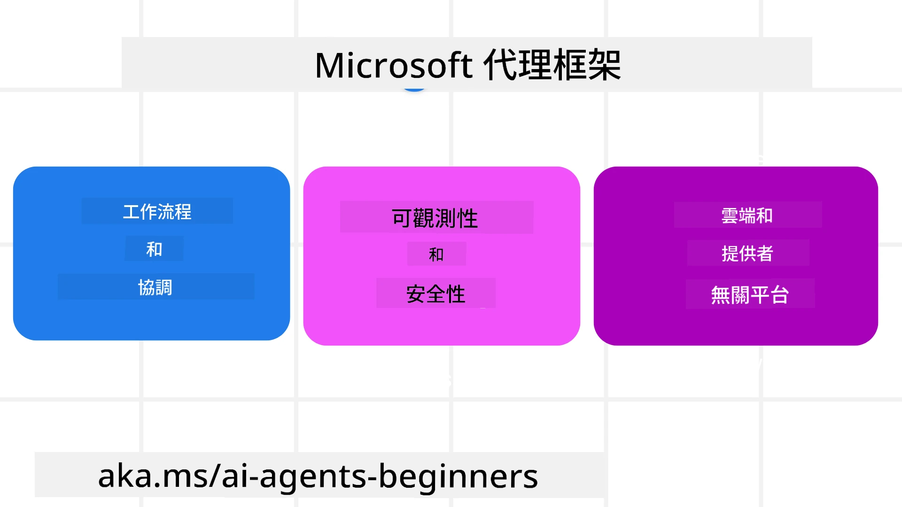
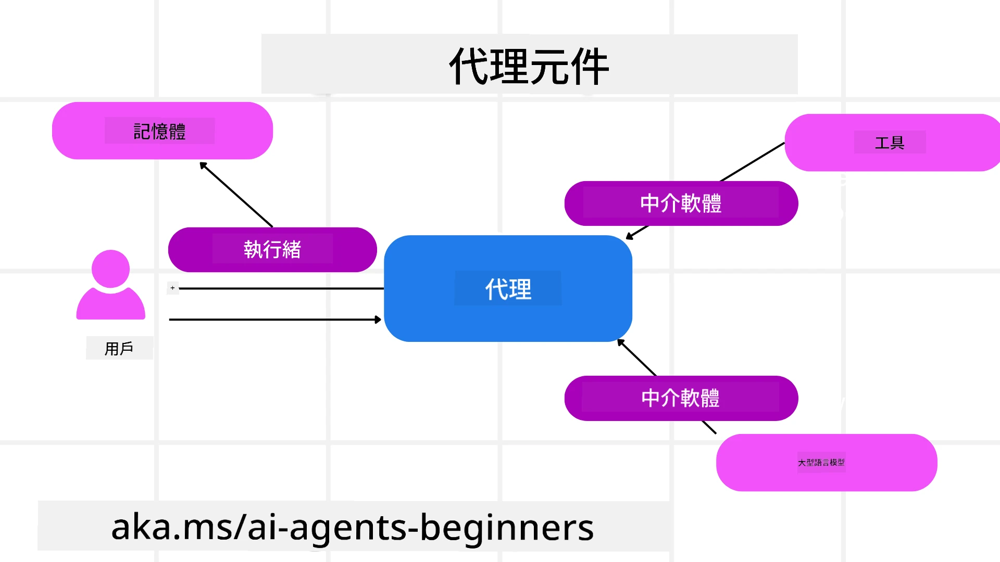

# 探索 Microsoft Agent Framework


### 介紹

本課程將涵蓋：

- 了解 Microsoft Agent Framework：主要功能和價值  
- 探索 Microsoft Agent Framework 的核心概念
- 高階 MAF 模式：工作流程、中介軟體與記憶體

## 學習目標

完成本課程後，您將會知道如何：

- 使用 Microsoft Agent Framework 建立生產就緒的 AI Agent
- 將 Microsoft Agent Framework 的核心功能應用於您的 Agentic 使用案例
- 使用包括工作流程、中介軟體和可觀察性的高階模式

## 程式碼範例 

[Microsoft Agent Framework (MAF)](https://aka.ms/ai-agents-beginners/agent-framewrok) 的程式碼範例可在本存放庫的 `xx-python-agent-framework` 和 `xx-dotnet-agent-framework` 檔案中找到。

## 了解 Microsoft Agent Framework



[Microsoft Agent Framework (MAF)](https://aka.ms/ai-agents-beginners/agent-framewrok) 是微軟用於構建 AI Agent 的統一框架。它具備靈活性，能處理生產和研究環境中各種 Agentic 使用案例，包括：

- **順序式 Agent 編排** ，適合需要逐步執行工作流程的場合。
- **併發編排** ，適合 Agent 需同時完成任務的場合。
- **群組聊天編排** ，適合多個 Agent 協同完成一項任務的場合。
- **交接編排** ，適合 Agent 在完成子任務後將任務交接給另一 Agent 的場合。
- **磁性編排** ，適合由管理 Agent 建立及修改任務清單，並協調子 Agent 完成任務的場合。

為了在生產中交付 AI Agent，MAF 亦提供以下功能：

- **觀察能力** 透過 OpenTelemetry，每個 AI Agent 的行動，包括工具調用、編排步驟、推理流程及性能監控均可透過 Microsoft Foundry 儀表板追蹤。
- **安全性** 透過在 Microsoft Foundry 原生託管 Agent，包含角色基礎存取控制、私有資料處理及內建內容安全性。
- **耐久性** Agent 線程及工作流程可暫停、恢復及錯誤復原，使	Long running process 成為可能。
- **控制權** 支援人機協作工作流程，任務可標記為需要人工審核。

Microsoft Agent Framework 也專注於互通性：

- **跨雲平台** — Agent 可在容器、本地及多種雲端環境中執行。
- **跨提供者** — Agent 可透過您偏好的 SDK 建立，包括 Azure OpenAI 與 OpenAI。
- **整合開放標準** — Agent 可使用如 Agent-to-Agent(A2A) 和 Model Context Protocol (MCP) 等協議來發現及使用其他 Agent 與工具。
- **外掛與連接器** — 可連接資料與記憶服務如 Microsoft Fabric、SharePoint、Pinecone 和 Qdrant。

現在讓我們看看這些功能如何應用於 Microsoft Agent Framework 的核心概念。

## Microsoft Agent Framework 的核心概念

### Agents



**建立 Agents**

建立 Agent 是透過定義推理服務（LLM 提供者）、一組指令讓 AI Agent 遵循，以及指定 `name`：

```python
agent = AzureOpenAIChatClient(credential=AzureCliCredential()).create_agent( instructions="You are good at recommending trips to customers based on their preferences.", name="TripRecommender" )
```

上述使用的是 `Azure OpenAI`，但 Agents 也能使用多種服務建立，包括 `Microsoft Foundry Agent Service`：

```python
AzureAIAgentClient(async_credential=credential).create_agent( name="HelperAgent", instructions="You are a helpful assistant." ) as agent
```

OpenAI 的 `Responses`、`ChatCompletion` API

```python
agent = OpenAIResponsesClient().create_agent( name="WeatherBot", instructions="You are a helpful weather assistant.", )
```

```python
agent = OpenAIChatClient().create_agent( name="HelpfulAssistant", instructions="You are a helpful assistant.", )
```

或使用 A2A 協議的遠端 Agent：

```python
agent = A2AAgent( name=agent_card.name, description=agent_card.description, agent_card=agent_card, url="https://your-a2a-agent-host" )
```

**執行 Agents**

Agent 使用 `.run` 或 `.run_stream` 方法來執行，分別適用於非串流或串流回應。

```python
result = await agent.run("What are good places to visit in Amsterdam?")
print(result.text)
```

```python
async for update in agent.run_stream("What are the good places to visit in Amsterdam?"):
    if update.text:
        print(update.text, end="", flush=True)

```

每次執行 Agent 也可以使用選項自訂參數，如 Agent 使用的 `max_tokens`、Agent 能呼叫的 `tools`，甚至用於 Agent 的 `model`。

此功能對於完成使用者任務需要特定模型或工具非常有用。

**工具**

工具可以在定義 Agent 時設定：

```python
def get_attractions( location: Annotated[str, Field(description="The location to get the top tourist attractions for")], ) -> str: """Get the top tourist attractions for a given location.""" return f"The top attractions for {location} are." 


# 直接建立 ChatAgent 時

agent = ChatAgent( chat_client=OpenAIChatClient(), instructions="You are a helpful assistant", tools=[get_attractions]

```

也可以在執行 Agent 時設定：

```python

result1 = await agent.run( "What's the best place to visit in Seattle?", tools=[get_attractions] # 此工具僅供此次運行使用 )
```

**Agent Threads**

Agent Threads 用於處理多輪對話。Threads 可以透過以下方式建立：

- 使用 `get_new_thread()`，該線程可以被保存直到後續使用
- 在執行 Agent 時自動建立線程，且該線程只存在於本次執行期間。

建立線程的程式碼如下：

```python
# 建立一個新執行緒。
thread = agent.get_new_thread() # 使用此執行緒運行代理。
response = await agent.run("Hello, I am here to help you book travel. Where would you like to go?", thread=thread)

```

之後可以將線程序列化保存以備後用：

```python
# 建立一個新執行緒。
thread = agent.get_new_thread() 

# 使用該執行緒運行代理。

response = await agent.run("Hello, how are you?", thread=thread) 

# 將執行緒序列化以便存儲。

serialized_thread = await thread.serialize() 

# 從存儲讀取後，反序列化執行緒狀態。

resumed_thread = await agent.deserialize_thread(serialized_thread)
```

**Agent 中介軟體**

Agent 透過工具和 LLM 互動以完成使用者任務。在某些情境下，我們希望在這些互動之間執行或追蹤動作。Agent 中介軟體允許我們藉由以下方式實現：

*函式中介軟體*

此中介軟體能在 Agent 與其呼叫的函式／工具之間執行動作。使用情境如你想對函式呼叫進行記錄。

以下程式中的 `next` 定義是否呼叫下一個中介軟體或實際函式。

```python
async def logging_function_middleware(
    context: FunctionInvocationContext,
    next: Callable[[FunctionInvocationContext], Awaitable[None]],
) -> None:
    """Function middleware that logs function execution."""
    # 預處理：函數執行前記錄日誌
    print(f"[Function] Calling {context.function.name}")

    # 繼續至下一個中間件或函數執行
    await next(context)

    # 後處理：函數執行後記錄日誌
    print(f"[Function] {context.function.name} completed")
```

*聊天中介軟體*

此中介軟體允許我們在 Agent 與 LLM 之間的請求中執行或記錄動作。

這包含了送往 AI 服務的 `messages` 等重要資訊。

```python
async def logging_chat_middleware(
    context: ChatContext,
    next: Callable[[ChatContext], Awaitable[None]],
) -> None:
    """Chat middleware that logs AI interactions."""
    # 預處理：AI 呼叫之前記錄日誌
    print(f"[Chat] Sending {len(context.messages)} messages to AI")

    # 繼續到下一個中介軟件或 AI 服務
    await next(context)

    # 後處理：AI 回應後記錄日誌
    print("[Chat] AI response received")

```

**Agent 記憶體**

正如在 `Agentic Memory` 課程中所述，記憶體是讓 Agent 能夠在不同上下文中運作的重要元素。MAF 提供多種記憶體類型：

*記憶體內儲存*

這是在線程中於應用執行期間儲存的記憶體。

```python
# 創建一個新執行緒。
thread = agent.get_new_thread() # 使用該執行緒運行代理。
response = await agent.run("Hello, I am here to help you book travel. Where would you like to go?", thread=thread)
```

*持久訊息*

此記憶體用於跨不同會話儲存對話歷史。定義方式是使用 `chat_message_store_factory`：

```python
from agent_framework import ChatMessageStore

# 創建自訂訊息存儲
def create_message_store():
    return ChatMessageStore()

agent = ChatAgent(
    chat_client=OpenAIChatClient(),
    instructions="You are a Travel assistant.",
    chat_message_store_factory=create_message_store
)

```

*動態記憶*

此記憶會在執行 Agents 前加入上下文。這些記憶可以儲存在外部服務，如 mem0：

```python
from agent_framework.mem0 import Mem0Provider

# 使用 Mem0 實現進階記憶體功能
memory_provider = Mem0Provider(
    api_key="your-mem0-api-key",
    user_id="user_123",
    application_id="my_app"
)

agent = ChatAgent(
    chat_client=OpenAIChatClient(),
    instructions="You are a helpful assistant with memory.",
    context_providers=memory_provider
)

```

**Agent 可觀察性**

可觀察性對於建構可靠且易維護的 agentic 系統非常重要。MAF 整合了 OpenTelemetry，提供追蹤和計量器以利更佳的可觀察性。

```python
from agent_framework.observability import get_tracer, get_meter

tracer = get_tracer()
meter = get_meter()
with tracer.start_as_current_span("my_custom_span"):
    # 做某事
    pass
counter = meter.create_counter("my_custom_counter")
counter.add(1, {"key": "value"})
```

### 工作流程

MAF 提供工作流程，即預定義的步驟以完成任務，並包含 AI Agent 作為這些步驟中的元件。

工作流程由不同元件組成，以提供更好的流程控制。工作流程還支援 **多 Agent 編排** 和 **檢查點** 以保存工作流程狀態。

工作流程的核心元件是：

**執行器**

執行器接收輸入訊息，執行指定任務，然後產生輸出訊息。這推動工作流程邁向完成較大任務。執行器可以是 AI Agent 或自訂邏輯。

**邊線**

邊線用於定義工作流程中訊息的流動。這些可以是：

*直接邊線* — 執行器間簡單一對一連接：

```python
from agent_framework import WorkflowBuilder

builder = WorkflowBuilder()
builder.add_edge(source_executor, target_executor)
builder.set_start_executor(source_executor)
workflow = builder.build()
```

*條件邊線* — 在符合特定條件後啟動。例如，當飯店房間無法提供時，執行器可以建議其他選項。

*切換案例邊線* — 根據定義條件導向不同執行器。例如，若旅客享有優先權，相關任務會透過不同工作流程處理。

*分流邊線* — 將單一訊息發送到多個目標。

*匯流邊線* — 收集不同執行器的多個訊息，然後發送到一個目標。

**事件**

為了提供更好的工作流程觀察能力，MAF 提供了執行過程中內建事件，包括：

- `WorkflowStartedEvent`  - 工作流程執行開始
- `WorkflowOutputEvent` - 工作流程產生輸出
- `WorkflowErrorEvent` - 工作流程遇到錯誤
- `ExecutorInvokeEvent`  - 執行器開始處理
- `ExecutorCompleteEvent`  - 執行器完成處理
- `RequestInfoEvent` - 發出請求

## 高階 MAF 模式

以上章節涵蓋 Microsoft Agent Framework 的關鍵概念。隨著您構建更複雜的 Agent，以下是一些值得參考的高階模式：

- **中介軟體組合**：使用函式和聊天中介軟體串聯多個中介軟體處理程序（記錄、認證、速率限制），以精細控制 Agent 行為。
- **工作流程檢查點**：使用工作流程事件和序列化來保存及恢復長時間運行的 Agent 程序。
- **動態工具選擇**：結合基於工具描述的 RAG 與 MAF 的工具註冊，針對每個查詢只呈現相關工具。
- **多 Agent 交接**：利用工作流程邊線和條件路由，編排專門 Agent 之間的任務交接。

## 程式碼範例 

Microsoft Agent Framework 的程式碼範例可在本存放庫的 `xx-python-agent-framework` 和 `xx-dotnet-agent-framework` 檔案中找到。

## 對 Microsoft Agent Framework 還有疑問嗎？

加入 [Microsoft Foundry Discord](https://aka.ms/ai-agents/discord) 與其他學習者見面，參加辦公時間並獲得 AI Agent 問題的解答。

---

<!-- CO-OP TRANSLATOR DISCLAIMER START -->
**免責聲明**：
本文件係使用人工智能翻譯服務 [Co-op Translator](https://github.com/Azure/co-op-translator) 進行翻譯。雖然我們力求準確，但請注意，自動翻譯可能包含錯誤或不準確之處。原始文件之母語版本應視為權威來源。對於重要資訊，建議採用專業人工翻譯。我們對因使用本翻譯而引起之任何誤解或曲解概不負責。
<!-- CO-OP TRANSLATOR DISCLAIMER END -->