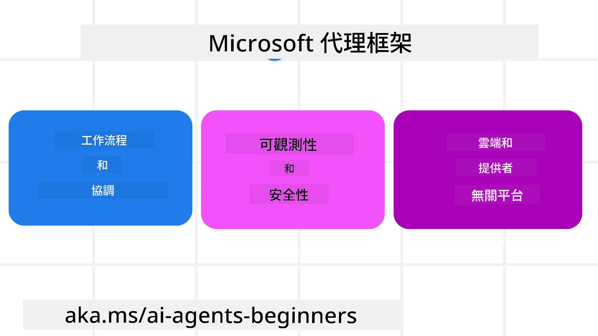
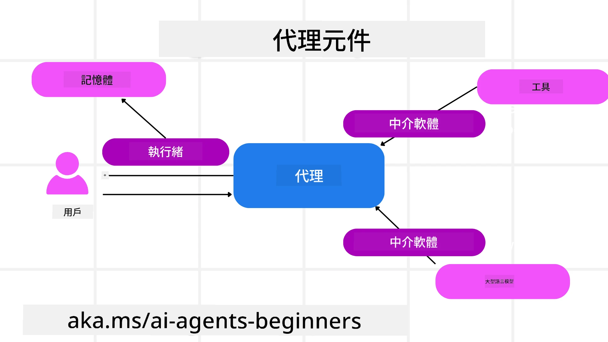

# 探索 Microsoft Agent Framework


### 簡介

本課程將涵蓋：

- 了解 Microsoft Agent Framework：主要特點與價值  
- 探索 Microsoft Agent Framework 的核心概念
- 進階 MAF 模式：工作流程、中介軟體與記憶體

## 學習目標

完成本課程後，你將懂得如何：

- 使用 Microsoft Agent Framework 建立生產就緒的 AI 代理
- 將 Microsoft Agent Framework 的核心功能應用到你的代理用例
- 使用進階模式，包括工作流程、中介軟體及可觀察性

## 程式碼範例 

[Microsoft Agent Framework (MAF)](https://learn.microsoft.com/en-us/agent-framework/overview/?wt.mc_id=youtube_26688_organicsocial_reactor&pivots=programming-language-python) 的程式碼範例可在此存放庫中的 `xx-python-agent-framework` 與 `xx-dotnet-agent-framework` 文件中找到。

## 認識 Microsoft Agent Framework



[Microsoft Agent Framework (MAF)](https://learn.microsoft.com/en-us/agent-framework/overview/?wt.mc_id=youtube_26688_organicsocial_reactor&pivots=programming-language-python) 是微軟用於構建 AI 代理的統一框架。它提供靈活性，能應對生產和研究環境中各種代理用例，包括：

- <strong>序列代理調度</strong>：適用於需要逐步工作流程的場景。
- <strong>並行調度</strong>：適用於代理同時完成任務的場景。
- <strong>群組聊天調度</strong>：適用於代理能夠協作完成同一任務的場景。
- <strong>任務交接調度</strong>：代理在完成子任務後，將任務交接給彼此。
- <strong>磁吸調度</strong>：管理代理建立並修改任務清單，協調子代理完成任務。

為了支援生產環境中的 AI 代理，MAF 也包含以下特點：

- <strong>可觀察性</strong>：使用 OpenTelemetry 追蹤 AI 代理的每個動作，包括工具調用、調度步驟、推理流程，並透過 Microsoft Foundry 儀表板進行效能監控。
- <strong>安全性</strong>：代理原生託管於 Microsoft Foundry，具有角色存取控制、私有資料處理及內建內容安全等安全機制。
- <strong>持久性</strong>：代理線程與工作流程可暫停、恢復及從錯誤中復原，支援長時間執行。
- <strong>控制權</strong>：支援人類在循環工作流程中介入，將任務標記為需人工審核。

Microsoft Agent Framework 亦著眼於互操作性：

- <strong>雲端中立</strong> - 代理可在容器、本地及多種不同的雲端上運行。
- <strong>供應商中立</strong> - 可透過你喜歡的 SDK 創建代理，包括 Azure OpenAI 與 OpenAI。
- <strong>整合開放標準</strong> - 代理可使用代理間協議 (Agent-to-Agent, A2A) 與模型上下文協議 (Model Context Protocol, MCP) 來發現並使用其他代理與工具。
- <strong>外掛與連接器</strong> - 可連接至 Microsoft Fabric、SharePoint、Pinecone 和 Qdrant 等資料和記憶服務。

現在讓我們看看這些功能如何應用於 Microsoft Agent Framework 的一些核心概念。

## Microsoft Agent Framework 的核心概念

### 代理



<strong>建立代理</strong>

建立代理是透過定義推論服務（LLM 提供者）、
一組讓 AI 代理遵循的指令，與指定一個 `name` 來完成：

```python
agent = AzureOpenAIChatClient(credential=AzureCliCredential()).create_agent( instructions="You are good at recommending trips to customers based on their preferences.", name="TripRecommender" )
```

上述範例使用 `Azure OpenAI`，但代理也可使用各種服務建立，包括 `Microsoft Foundry Agent Service`：

```python
AzureAIAgentClient(async_credential=credential).create_agent( name="HelperAgent", instructions="You are a helpful assistant." ) as agent
```

OpenAI 的 `Responses`、`ChatCompletion` API

```python
agent = OpenAIResponsesClient().create_agent( name="WeatherBot", instructions="You are a helpful weather assistant.", )
```

```python
agent = OpenAIChatClient().create_agent( name="HelpfulAssistant", instructions="You are a helpful assistant.", )
```

或是 [MiniMax](https://platform.minimaxi.com/)，提供支援大型上下文視窗（最高 204K 令牌）的 OpenAI 兼容 API：

```python
agent = OpenAIChatClient(base_url="https://api.minimax.io/v1", api_key=os.environ["MINIMAX_API_KEY"], model_id="MiniMax-M3").create_agent( name="HelpfulAssistant", instructions="You are a helpful assistant.", )
```

或是使用 A2A 協議的遠端代理：

```python
agent = A2AAgent( name=agent_card.name, description=agent_card.description, agent_card=agent_card, url="https://your-a2a-agent-host" )
```

<strong>執行代理</strong>

透過 `.run` 或 `.run_stream` 方法執行代理，分別對應非串流或串流回應。

```python
result = await agent.run("What are good places to visit in Amsterdam?")
print(result.text)
```

```python
async for update in agent.run_stream("What are the good places to visit in Amsterdam?"):
    if update.text:
        print(update.text, end="", flush=True)

```

每次代理執行時，也可以自訂參數選項，如代理使用的最大 `max_tokens`、可調用的 `tools`，甚至代理使用的 `model` 本體。

這在完成用戶任務時需要特定模型或工具的情况下非常有用。

<strong>工具</strong>

工具可以在定義代理時：

```python
def get_attractions( location: Annotated[str, Field(description="The location to get the top tourist attractions for")], ) -> str: """Get the top tourist attractions for a given location.""" return f"The top attractions for {location} are." 


# 當直接建立 ChatAgent 時

agent = ChatAgent( chat_client=OpenAIChatClient(), instructions="You are a helpful assistant", tools=[get_attractions]

```

也可以在執行代理時定義：

```python

result1 = await agent.run( "What's the best place to visit in Seattle?", tools=[get_attractions] # 只提供於此執行的工具 )
```

<strong>代理線程</strong>

代理線程用於處理多輪對話。線程可通過下列方式建立：

- 使用 `get_new_thread()`，讓線程能夠長期保存
- 執行代理時自動建立線程，且線程只在此次執行期間有效。

建立線程的程式碼如下：

```python
# 建立一個新線程。
thread = agent.get_new_thread() # 使用該線程運行代理。
response = await agent.run("Hello, I am here to help you book travel. Where would you like to go?", thread=thread)

```

你也可以序列化此線程以供之後使用：

```python
# 建立一個新執行緒。
thread = agent.get_new_thread() 

# 使用該執行緒運行代理。

response = await agent.run("Hello, how are you?", thread=thread) 

# 將執行緒序列化以便存儲。

serialized_thread = await thread.serialize() 

# 從存儲加載後反序列化執行緒狀態。

resumed_thread = await agent.deserialize_thread(serialized_thread)
```

<strong>代理中介軟體</strong>

代理透過工具與 LLM 互動以完成用戶任務。在某些情況下，我們希望在這些互動之間執行或追蹤行為。代理中介軟體可讓我們做到這點：

<em>函式中介軟體</em>

此中介軟體允許我們在代理和其呼叫的函式/工具之間執行動作。例如可能想對函式呼叫做日誌記錄時可用。

下面程式中，`next` 定義了是否呼叫下一個中介軟體或實際函式。

```python
async def logging_function_middleware(
    context: FunctionInvocationContext,
    next: Callable[[FunctionInvocationContext], Awaitable[None]],
) -> None:
    """Function middleware that logs function execution."""
    # 預處理：函數執行前記錄日誌
    print(f"[Function] Calling {context.function.name}")

    # 繼續執行下一個中介軟件或函數
    await next(context)

    # 後處理：函數執行後記錄日誌
    print(f"[Function] {context.function.name} completed")
```

<em>聊天中介軟體</em>

此中介軟體讓我們能在代理和 LLM 請求之間執行或記錄動作。

主要信息包括正被發送到 AI 服務的 `messages`。

```python
async def logging_chat_middleware(
    context: ChatContext,
    next: Callable[[ChatContext], Awaitable[None]],
) -> None:
    """Chat middleware that logs AI interactions."""
    # 預處理：呼叫 AI 前記錄日誌
    print(f"[Chat] Sending {len(context.messages)} messages to AI")

    # 繼續至下一中介軟件或 AI 服務
    await next(context)

    # 後處理：AI 回應後記錄日誌
    print("[Chat] AI response received")

```

<strong>代理記憶體</strong>

如 `Agentic Memory` 課程所述，記憶對於使代理跨上下文運作至關重要。MAF 提供多種記憶體類型：

<em>記憶體內存儲存</em>

此為應用運行期間在線程中存儲的記憶體。

```python
# 建立一個新執行緒。
thread = agent.get_new_thread() # 使用該執行緒運行代理。
response = await agent.run("Hello, I am here to help you book travel. Where would you like to go?", thread=thread)
```

<em>持久會話訊息</em>

此記憶體用於跨會話存儲對話歷史。其透過 `chat_message_store_factory` 定義：

```python
from agent_framework import ChatMessageStore

# 建立自訂訊息儲存庫
def create_message_store():
    return ChatMessageStore()

agent = ChatAgent(
    chat_client=OpenAIChatClient(),
    instructions="You are a Travel assistant.",
    chat_message_store_factory=create_message_store
)

```

<em>動態記憶體</em>

這種記憶體會在代理執行前加入上下文。這些記憶體可存放在外部服務如 mem0：

```python
from agent_framework.mem0 import Mem0Provider

# 使用 Mem0 以獲得進階記憶體功能
memory_provider = Mem0Provider(
    api_key="your-mem0-api-key",
    user_id="user_123",
    application_id="my_app"
)

agent = ChatAgent(
    chat_client=OpenAIChatClient(),
    instructions="You are a helpful assistant with memory.",
    context_providers=memory_provider
)

```

<strong>代理可觀察性</strong>

可觀察性對構建可靠且易維護的代理系統很重要。MAF 整合 OpenTelemetry 提供追蹤與計量功能以提升可觀察性。

```python
from agent_framework.observability import get_tracer, get_meter

tracer = get_tracer()
meter = get_meter()
with tracer.start_as_current_span("my_custom_span"):
    # 做某事
    pass
counter = meter.create_counter("my_custom_counter")
counter.add(1, {"key": "value"})
```

### 工作流程

MAF 提供工作流程，為完成任務的預定義步驟，包含 AI 代理作為這些步驟中的組件。

工作流程由不同組件組成，以便更好地控制流程。工作流程還支援 <strong>多代理調度</strong> 與 <strong>檢查點</strong> 以保存狀態。

工作流程的核心組件為：

<strong>執行器</strong>

執行器接收輸入消息，執行指定任務，並產生輸出消息。這推進工作流程以完成更大的任務。執行器可為 AI 代理或自訂邏輯。

<strong>邊緣</strong>

邊緣用於定義工作流程中消息的流向，可為：

<em>直接邊緣</em> - 執行器間簡單的一對一連接：

```python
from agent_framework import WorkflowBuilder

builder = WorkflowBuilder()
builder.add_edge(source_executor, target_executor)
builder.set_start_executor(source_executor)
workflow = builder.build()
```

<em>條件邊緣</em> - 當達成特定條件後啟用。例如飯店客房不可用時，執行器可建議其他選項。

<em>分支邊緣</em> - 根據定義條件將消息路由到不同執行器。例如，若旅客享有優先權，任務將透過另一工作流程處理。

<em>分散邊緣</em> - 將一則消息發送至多個目標。

<em>匯集邊緣</em> - 收集來自不同執行器的多則消息，發送至單一目標。

<strong>事件</strong>

為提升對工作流程的可觀察性，MAF 提供執行相關的內建事件，包括：

- `WorkflowStartedEvent`  - 工作流程開始執行
- `WorkflowOutputEvent` - 工作流程產生輸出
- `WorkflowErrorEvent` - 工作流程發生錯誤
- `ExecutorInvokeEvent`  - 執行器開始處理
- `ExecutorCompleteEvent`  - 執行器完成處理
- `RequestInfoEvent` - 發出請求

## 進階 MAF 模式

以上章節涵蓋了 Microsoft Agent Framework 的核心概念。當你構建更複雜的代理時，可考慮下列進階模式：

- <strong>中介軟體組合</strong>：使用函式及聊天中介軟體串接多個處理器（如記錄、認證、速率限制），以細緻控制代理行為。
- <strong>工作流程檢查點</strong>：使用工作流程事件和序列化保存及恢復長時間運行的代理進程。
- <strong>動態工具選擇</strong>：結合對工具描述的 RAG 及 MAF 的工具註冊，按查詢僅顯示相關工具。
- <strong>多代理交接</strong>：使用工作流程邊緣和條件路由，協調專門代理間的交接。

## 在 Microsoft Foundry 託管 LangChain / LangGraph 代理

Microsoft Agent Framework 是 <strong>框架互通的</strong> —— 你無需侷限於使用 MAF 撰寫的代理。如果你已用 **LangChain** 或 **LangGraph** 開發代理，可以作為 **Microsoft Foundry 託管代理** 運行，讓 Foundry 管理執行時、會話、彈性、身份及協定端點，同時你的代理邏輯依然在 LangGraph 中。

這是通過 `langchain_azure_ai.agents.hosting` 套件實現的，該套件在與 Foundry 託管代理使用相同協定上，公開已編譯的 LangGraph 資料圖。

**1. 安裝 hosting 附加套件：**

```bash
pip install -U "langchain-azure-ai[hosting]>=1.2.4" azure-identity
```

`hosting` 附加套件會安裝 Foundry 協定庫：`azure-ai-agentserver-responses`（OpenAI 兼容的 `/responses` 端點）與 `azure-ai-agentserver-invocations`（通用的 `/invocations` 端點）。

**2. 選擇一個託管協定：**

| 協定 | 託管類別 | 端點 | 使用情境 |
|----------|-----------|----------|----------|
| **Responses** | `ResponsesHostServer` | `/responses` | 若你需要 OpenAI 兼容聊天、串流、回應歷史和會話線程，這是對話代理推薦的預設選擇。 |
| **Invocations** | `InvocationsHostServer` | `/invocations` | 若你需要自訂 JSON 格式、Webhook 式端點或非對話式處理。 |

因為 **Responses API 是 Foundry 中代理式開發的主要 API**，大多數代理建議從 `ResponsesHostServer` 開始。

**3. 設定環境變量**（先執行 `az login` 以便 `DefaultAzureCredential` 驗證）：

```bash
export FOUNDRY_PROJECT_ENDPOINT="https://<resource>.services.ai.azure.com/api/projects/<project>"
export FOUNDRY_MODEL_NAME="gpt-5-mini"
```

當代理稍後作為託管代理在 Foundry 運行時，平台會自動注入 `FOUNDRY_PROJECT_ENDPOINT`。

**4. 透過 Responses 協定公開 LangGraph 代理：**

```python
import os

from azure.ai.projects import AIProjectClient
from azure.identity import DefaultAzureCredential, get_bearer_token_provider
from langchain.agents import create_agent
from langchain_openai import ChatOpenAI
from langchain_azure_ai.agents.hosting import ResponsesHostServer

_AZURE_AI_SCOPE = "https://ai.azure.com/.default"


def build_chat_model() -> ChatOpenAI:
    project_endpoint = os.environ["FOUNDRY_PROJECT_ENDPOINT"].rstrip("/")
    deployment = os.environ.get("FOUNDRY_MODEL_NAME", "gpt-5-mini")
    credential = DefaultAzureCredential()
    project = AIProjectClient(endpoint=project_endpoint, credential=credential)
    openai_client = project.get_openai_client()
    token_provider = get_bearer_token_provider(credential, _AZURE_AI_SCOPE)

    # ChatOpenAI 這裡針對 Foundry 項目中兼容 OpenAI 的 (Responses) 端點。
    return ChatOpenAI(
        model=deployment,
        base_url=str(openai_client.base_url),
        api_key=token_provider,
    )


def main() -> None:
    graph = create_agent(build_chat_model(), tools=[])
    port = int(os.environ.get("PORT", "8088"))
    ResponsesHostServer(graph).run(port=port)


if __name__ == "__main__":
    main()
```

在本地以 `python main.py` 運行，然後向 `http://localhost:8088/responses` 發送 Responses 請求。

**主要行為：**

- <strong>會話</strong>：客戶端通過傳遞 `previous_response_id` 或 `conversation` ID 來繼續會話。若你的資料圖配有 LangGraph 檢查點器，Foundry 會將會話狀態鍵結至檢查點（生產環境請使用耐久檢查點，`MemorySaver` 適合本地測試）。
- <strong>人類介入循環</strong>：如果資料圖中使用 LangGraph 的 `interrupt()`，`ResponsesHostServer` 會將待處理中斷以 Responses 的 `function_call` / `mcp_approval_request` 項目呈現，客戶端則以相應的 `function_call_output` / `mcp_approval_response` 繼續。
- **部署至 Foundry**：使用 Azure Developer CLI — 執行 `azd ext install azure.ai.agents`、`azd ai agent init -m <manifest>`、`azd ai agent run`（本地，需要 Docker），然後執行 `azd provision` 與 `azd deploy`。部署託管代理需具備 **Foundry Project Manager** 角色。

此範例可在 [code-samples/14-langchain-hosted-agent.py](../../../14-microsoft-agent-framework/code-samples/14-langchain-hosted-agent.py) 中找到可運行版本。完整教學（包含 Invocations 協定、自訂請求結構及故障排除）請參考 [作為 Foundry 託管代理主辦 LangGraph 代理](https://learn.microsoft.com/azure/foundry/how-to/develop/langchain-hosted-agents)。

## 程式碼範例 

Microsoft Agent Framework 的程式碼範例可在此存放庫中的 `xx-python-agent-framework` 與 `xx-dotnet-agent-framework` 文件中找到。

## 對 Microsoft Agent Framework 有更多疑問嗎？

加入 [Microsoft Foundry Discord](https://discord.com/invite/ATgtXmAS5D) 與其他學習者交流，參加辦公時間，並解決你的 AI 代理相關問題。
## 上一課程

[AI 代理的記憶體](../13-agent-memory/README.md)

## 下一課程

[構建電腦使用代理 (CUA)](../15-browser-use/README.md)

---

<!-- CO-OP TRANSLATOR DISCLAIMER START -->
**免責聲明**：
本文件使用 AI 翻譯服務 [Co-op Translator](https://github.com/Azure/co-op-translator) 進行翻譯。雖然我們力求準確，但請注意，自動翻譯可能包含錯誤或不準確之處。原始文件的母語版本應被視為權威來源。對於重要資訊，建議尋求專業人工翻譯。我們不對因使用本翻譯而引起的任何誤解或曲解承擔責任。
<!-- CO-OP TRANSLATOR DISCLAIMER END -->