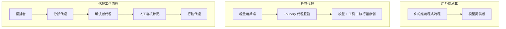
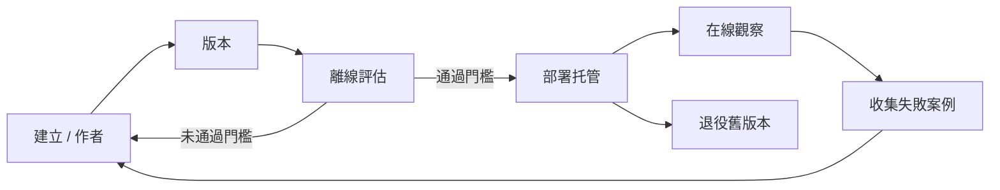
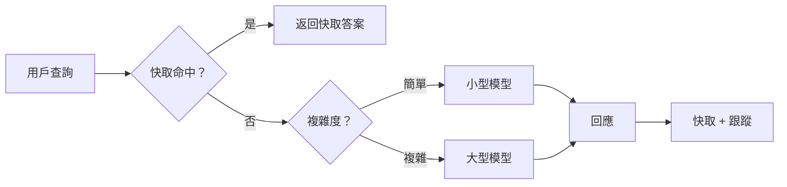

# 使用 Microsoft Foundry 部署可擴展代理


到目前為止，您已經構建了可在筆記本內、由 `az login` 和少量環境變數驅動的代理，這些代理可在您的筆記本電腦上運行。這正是學習的正確途徑。但這並非數千客戶凌晨三點依賴代理時的正確運行方式。

本課程講述「在我的機器上可用」與「在生產環境中可靠且經濟地可用」之間的差距。我們將使用 **Microsoft Foundry** 和 **Microsoft Foundry Agent Service** 來彌合這一差距，並透過構建一個擁有工具、檢索、記憶、評估和監控功能的真正客戶支持代理實現。

## 簡介

本課程將涵蓋：

- <strong>原型代理</strong> 和 <strong>部署代理</strong> 的差異，以及轉變主要涉及圍繞模型的一切原因。
- 代理的 <strong>部署模式</strong>：客戶端託管、服務託管（託管代理）及流程編排。
- Microsoft Foundry 上的 <strong>代理生命週期</strong> — 創建、版本管理、部署、評估、觀察、退役。
- <strong>擴展策略</strong>：模型路由、快取、並發及無狀態設計。
- 使用 OpenTelemetry 和 Foundry 訊跡的 <strong>可觀察性</strong>。
- 通過模型選擇、路由和評估門的 <strong>成本優化</strong>。
- <strong>企業考慮</strong>：治理、人為審批，及安全運行 MCP 伺服器於生產環境。

## 學習目標

完成本課程後，您將能夠：

- 為特定代理工作負載選擇正確的部署模式。
- 將代理部署到 Microsoft Foundry Agent Service，使其具備版本控制、治理和可觀察性。
- 為代理加裝追蹤並串接每次發佈前運行的評估管道。
- 應用模型路由與快取，以在規模上控制延遲與成本。
- 為高風險行動添加人為審批閘道，並以生產安全方式集成 MCP 伺服器。

## 先決條件

本課程假設您已完成先前課程，且熟悉：

- 使用 [Microsoft Agent Framework](../14-microsoft-agent-framework/README.md) 建立代理（第 14 課）。
- [工具使用](../04-tool-use/README.md)（第 4 課）及 [Agentic RAG](../05-agentic-rag/README.md)（第 5 課）。
- [代理記憶](../13-agent-memory/README.md)（第 13 課）及 [Agentic Protocols / MCP](../11-agentic-protocols/README.md)（第 11 課）。
- [可觀察性與評估](../10-ai-agents-production/README.md)（第 10 課）— 本課程直接建立於此之上。

您還需要：

- 一個 **Azure 訂閱** 和一個擁有至少一個部署聊天模型的 **Microsoft Foundry 專案**。
- 已認證的 **Azure CLI** (`az login`)。
- Python 3.12+ 及倉庫中 [`requirements.txt`](../../../requirements.txt) 的套件。

## 從原型到生產：實際改變的是什麼

原型代理和生產代理擁有相同的核心循環 — 推理、調用工具、回應。實際上改變的是包裹這個循環的一切。模型約佔生產代理的 20%，其餘 80% 是操作骨架。

| 關注點 | 原型 | 生產 |
| --- | --- | --- |
| <strong>託管</strong> | 運行於您的筆記本 | 作為託管服務運行，有版本和推廣控制 |
| <strong>身份認證</strong> | 您的 `az login` 令牌 | 具範圍 RBAC 的託管身份 |
| <strong>狀態</strong> | 內存中，重啟丟失 | 外部化（線程存儲、記憶服務） |
| <strong>失敗處理</strong> | 您看到回溯 | 重試、回退、死信、警報 |
| <strong>成本</strong> | 「幾分錢」 | 請求追蹤、路由、快取、預算 |
| <strong>品質</strong> | 您目測輸出 | 每次發佈前自動評估 |
| <strong>信任</strong> | 您批准每個行動 | 風險行動須政策與人為審核 |

請記住此表格。下方每節內容均映射到其中一行。

## 代理部署模式

您會使用三種模式，且經常是組合使用。

### 1. 客戶端託管代理

代理對象存在於<em>您的</em>應用程式進程中。您的程式碼直接調用模型提供者；推理循環在您的服務中運行。這是之前課程的常見做法。

- <strong>使用時機</strong> 當您需要對循環有完全控制、自定義中介軟體，或將代理嵌入現有後端時。
- <strong>權衡</strong>：您需自行管理擴展、狀態和韌性。

### 2. 託管代理（Foundry Agent Service）

代理被<em>註冊為 Microsoft Foundry 的資源</em>。Foundry 托管推理循環、存儲線程、執行內容安全與 RBAC，並使代理在 Foundry 入口網站可見。您的應用成為輕量客戶端，負責創建線程與讀取回應。

- <strong>使用時機</strong> 當您需要持久性、內建可觀察性、治理及更少的運營面。
- <strong>權衡</strong>：以受管理運行時換取較少底層控制。

### 3. 代理工作流程

多個代理（及工具）被組成圖狀，帶有明確的控制流程 — 串行步驟、分支、人為批准節點及可暫停和恢復的持久檢查點。這是 Microsoft Agent Framework <strong>工作流程</strong> 功能以部署規模應用的實例。

- <strong>使用時機</strong> 任務跨多個專業代理或中間需批准步驟時。
- <strong>權衡</strong>：更多移動部件，需編排級別的可觀察性。



## Microsoft Foundry 上的代理生命週期

部署代理不是一次性 `push`。它是一個循環，看起來很像軟件發布週期，因為它本質上就是如此。



這個核心思想來自於 [第 10 課](../10-ai-agents-production/README.md)：**離線評估是門檻，而非事後考量。** 新代理版本除非通過評估門檻，否則不會發佈。線上可觀察性將實際故障反饋至離線測試集。這就是整個循環。

## 擴展策略

擴展代理與擴展無狀態 Web API 不同，因為每個請求可能觸發多個昂貴的模型和工具調用。四項技術承擔主要負載。

**無狀態請求處理。** 不在進程記憶體中存儲每個用戶狀態。將對話線程持久化在 Foundry 線程存儲或記憶服務，使任何實例可處理任何請求。這讓您能水平擴展 — 增加實例，無需黏性會話。

**模型路由。** 並非所有請求都需最強大（及最昂貴）模型。將簡單請求 — 意圖分類、短事實回答 — 路由至小且快速的模型，並為真正推理保留大型模型。Foundry 的 **Model Router** 可為您完成此事，或您也可自行實現輕量分類器。實驗課中您會自行構建。

**回應快取。** 許多支援查詢極為相似（「我如何重設密碼？」）。快取常見問題答案，無需每次皆調用模型。即便是適度的快取命中率，也能顯著降低成本與延遲。

**並發與背壓。** 模型提供者有速率限制。控制並發量，使用帶指數退避的重試，並優雅失敗（排隊的「我們正處理中」回應勝過 500 錯誤）。



## 生產環境中的可觀察性

您無法運營看不見的系統。如第 10 課所述，Microsoft Agent Framework 原生發出 **OpenTelemetry** 跟蹤 — 每次模型調用、工具執行及編排步驟皆成為跨度。在生產環境您將這些跨度匯出至 Microsoft Foundry（或任何 OTel 相容後端），藉此您能：

- 端對端追蹤單一客戶投訴，覆蓋所有模型和工具調用。
- 隨時間監控每請求的 p50/p95 延遲與成本。
- 在錯誤率激增和成本異常發生前發出警報，避免用戶（或財務團隊）察覺。

```python
from agent_framework.observability import get_tracer

tracer = get_tracer()

with tracer.start_as_current_span("support_request") as span:
    span.set_attribute("customer.tier", "enterprise")
    span.set_attribute("routed.model", "gpt-5-nano")
    # 代理執行會自動在此範圍內跟蹤
```

屬性如 `customer.tier` 和 `routed.model` 可將繁雜的跟蹤資料轉為具體問題的答案（「企業客戶是否太常被路由到小模型？」）。

## 成本優化

生產代理的成本主要來自代幣。三個槓桿按影響力排序：

1. **合適規模模型。** 通過您的評估門檻的小模型幾乎總比通過門檻的大模型便宜。利用評估證明小模型足夠，而非出於謹慎預設使用最大模型。
2. **按複雜度路由。** 如前述 — 只為需要大型模型推理的請求支付相應成本。
3. **積極快取。** 最便宜的模型調用是您根本不需發出的調用。

評估門和成本控制是同一門紀律的兩個面向：評估告訴您<em>品質底線</em>，路由和快取則令成本盡可能靠近該底線。

## 企業部署考量

**治理。** 託管代理繼承 Foundry 的 RBAC、內容安全及審計日誌。給每個代理一個具最低權限的託管身份 — 只讀知識庫，對票務 API 有範圍訪問，不多也不少。

**人為審核。** 某些行為後果重大，不宜完全自動化 — 發退款、刪除帳號、升級法律團隊。Microsoft Agent Framework 支援 <strong>需批准</strong> 工具：代理提出行動，執行暫停，人工批准或拒絕，流程繼續。您在 [第 6 課](../06-building-trustworthy-agents/README.md) 見過原始實現；本課部署它。

**生產環境中的 MCP。** [MCP](../11-agentic-protocols/README.md) 讓代理透過標準介面使用外部工具。生產環境中，將每個 MCP 伺服器視為不受信任邊界：鎖定伺服器版本，以範圍身份運行，驗證輸出，且絕不暴露秘密給它。MCP 伺服器是依賴關係，依賴關係會被修補、審計和限流。


這三個圖 – 開發、部署、運行時 – 顯示同一代理的三個生命階段。接下來的實驗室將帶您逐步構建。

## 實作實驗室：生產就緒的客戶支持代理

開啟 [`code_samples/16-python-agent-framework.ipynb`](./code_samples/16-python-agent-framework.ipynb) 並逐步實作。您將組裝一個具備所有生產考量的 **Contoso 客戶支持代理**：

1. <strong>工具調用</strong> — 查詢訂單狀態及開啟支援票券。
2. **RAG** — 從知識庫回答政策問題（Azure AI Search，並提供記憶體回退，使筆記本可在沒有 Search 資源下運行）。
3. <strong>記憶</strong> — 記住客戶多輪對話內容。
4. <strong>模型路由</strong> — 複雜度分類器將每個請求路由到小模型或大模型。
5. <strong>回應快取</strong> — 重複問題由快取服務。
6. <strong>人為審核</strong> — 超過門檻的退款需人員簽核。
7. <strong>評估管線</strong> — 小型離線測試集評分代理並作發佈門檻。
8. <strong>可觀察性</strong> — 每次請求都有 OpenTelemetry 跟蹤。

### 詳細介紹

筆記本安排讓每個生產考量皆成自包含、可運行的部分。其核心是結合路由與快取的請求處理器：

```python
async def handle_support_request(query: str, customer_id: str) -> str:
    # 1. 盡可能從暫存提供服務。
    cached = response_cache.get(normalize(query))
    if cached:
        return cached

    # 2. 按複雜度路由以控制成本。
    model = "gpt-5-nano" if is_simple(query) else "gpt-5-mini"

    # 3. 在追蹤區間內運行代理以便觀察。
    with tracer.start_as_current_span("support_request") as span:
        span.set_attribute("routed.model", model)
        span.set_attribute("customer.id", customer_id)
        response = await support_agent.run(query, model=model)

    # 4. 快取並返回。
    response_cache.set(normalize(query), response.text)
    return response.text
```

守衛發佈的評估門如下：

```python
async def evaluation_gate(agent, test_cases, threshold: float = 0.8) -> bool:
    passed = 0
    for case in test_cases:
        result = await agent.run(case["input"])
        if score_response(result.text, case["expected"]) >= 0.8:
            passed += 1
    pass_rate = passed / len(test_cases)
    print(f"Evaluation pass rate: {pass_rate:.0%} (gate: {threshold:.0%})")
    return pass_rate >= threshold  # 只有當閘門通過時才部署
```

仔細閱讀每行 — 筆記本故意保持原始程式碼小巧，保證沒有框架調用遮蔽。

## 以 Smoke 測試驗證已部署代理

上述評估門在<em>離線</em>針對您的代理對象執行。一旦代理部署為託管代理，您還需要一個更便宜的檢查：**已部署端點是否真的在回應？**

成功部署只證明控制平面接受了定義，並不保證代理有回應。缺少依賴、模型路由錯誤或連線過期，都可能造成綠燈部署卻無回應。<strong>smoke 測試</strong>能在數秒內，在每次部署時捕獲此問題，且成本遠低於完整評估。

本倉庫提供基於 [AI Smoke Test](https://github.com/marketplace/actions/ai-smoke-test) GitHub Action 的現成 smoke 測試流程：

- <strong>清單</strong> — [`tests/lesson-16-smoke-tests.json`](../../../tests/lesson-16-smoke-tests.json) 記錄 Contoso 支持代理的提示與斷言（基於政策答案的依據、訂單查詢、主題保持及多輪對話連續性）。其他課程代理的清單同處此目錄 — 詳見 [`tests/README.md`](../tests/README.md)。
- <strong>流程</strong> — [`.github/workflows/smoke-test.yml`](../../../.github/workflows/smoke-test.yml) 透過 Azure OIDC 登入，將每條提示 POST 到代理的 Responses 端點，任一斷言失敗即使該作業失敗。

```yaml
- name: Smoke-test hosted agent
  uses: JFolberth/ai-smoketest@v1
  with:
    project_endpoint: ${{ inputs.project_endpoint }}
    agent_name: ContosoSupportAgent
    tests_file: tests/lesson-16-smoke-tests.json
```


在部署代理之後，從 **Actions** 索引標籤運行它，並提供你的 Foundry 項目端點和代理名稱。聯邦身份需要在 Foundry 項目範圍內擁有 **Azure AI User** 角色。把這些層次想像成一個金字塔：煙霧測試（是否可達且有回應？）在每次部署時執行，離線評估（是否足夠好用來發布？）在升級前執行，線上評估（在實際運行中表現如何？）持續進行。

## 知識檢測

在進入作業之前先測試你的理解程度。

**1. 大約多少比例的生產代理是「模型」，其餘的是什麼？**

<details>
<summary>答案</summary>

模型只占系統的一小部分 — 通常約為 20%。其餘是運作骨架：主機與版本管理、身份和 RBAC、外部化狀態、故障處理、成本追蹤、評估以及人類介入控制。上線生產主要是構建推理循環 <em>周邊</em> 的所有內容。
</details>

**2. 你會在什麼情況下選擇 Hosted Agent 而非客戶端主機代理？**

<details>
<summary>答案</summary>

當你想要擁有內建持久性（可持續和恢復的執行緒）、可觀察性、內容安全和 RBAC 的受管理執行環境，並願意為了降低操作面積而放棄部分底層推理循環的控制時，就會選擇 Hosted Agent。當你需要完全控制循環或將代理嵌入現有後端時，客戶端主機更為適合。
</details>

**3. 為什麼可擴展代理必須是無狀態的，且其狀態不能保存在自身進程記憶體中？**

<details>
<summary>答案</summary>

如此一來，任何實例都能處理任何請求，這就允許了無需固定會話的水平擴展。每位使用者的對話狀態被外部化到執行緒存儲或記憶服務中。如果狀態存在進程記憶體中，重新啟動時將遺失資料，且無法自由分配負載。
</details>

**4. 模型路由解決了什麼問題，且它與評估有什麼關聯？**

<details>
<summary>答案</summary>

路由將簡單請求導向小型、便宜、快速的模型，並保留大型模型處理真正的推理，以控制延遲和成本。它與評估相關，因為評估是用來<em>證明</em>小模型對一類請求已足夠好 — 沒有評估的路由就是猜測。
</details>

**5. 什麼是「評估閘門」，它在生命週期中處於什麼位置？**

<details>
<summary>答案</summary>

評估閘門對新代理版本執行一組離線測試集，若通過率未達門檻則阻止部署。它位於生命週期中「版本」與「部署」之間，使品質成為發布前的先決條件，而非發布後才檢查。
</details>

**6. 為什麼 MCP 伺服器應該被視為生產環境中的不受信任邊界？**

<details>
<summary>答案</summary>

因為它是代理調用的外部依賴。你應該固定其版本、使用封裝身份執行、驗證其輸出、設定速率限制，且絕不可向它暴露秘密 — 這些原則同樣適用於所有第三方依賴。其輸出會流入代理的推理中，因此未經驗證的信任存在安全風險。
</details>

**7. 哪一項單一改變通常對生產代理成本有最大影響，為什麼？**

<details>
<summary>答案</summary>

正確選擇模型尺寸 — 使用通過評估閘門的最小模型。成本大部分由 token 數佔據，且達到品質標準的較小模型幾乎總是比較大模型便宜。緩存和路由會進一步降低成本，但選擇合適的基礎模型是最大的首要因素。
</details>

**8. `customer.tier` 和 `routed.model` 等 span 屬性在可觀察性中扮演什麼角色？**

<details>
<summary>答案</summary>

它們將原始追蹤資料轉化為可回答的業務問題。沒有屬性時，你得到的是砌成一牆的 span；有了屬性，你可以詢問「企業客戶是否過度被路由到小模型？」或「哪個模型處理我們最慢的請求？」屬性是按照對運營重要的維度對遙測進行切片的方式。
</details>

## 作業

以課堂上的客服代理為基礎，並加強它以應對特定場景：**面向 SaaS 公司的訂閱計費支持代理。**

你的提交應該包含：

1. <strong>替換工具</strong>，改用與計費相關的工具：`get_subscription_status`、`get_invoice` 和 `issue_credit`（超過 50 美元的信用需人工審核）。
2. **新增三份 RAG 文件**，涵蓋公司的退款政策、計費週期和取消政策。
3. <strong>擴展評估集</strong> 至至少八個案例，其中至少兩個 <em>應該</em> 觸發人工審核流程，並確認你的評估閘門能正確通過或失敗。
4. <strong>新增一份成本報告</strong>：通過代理執行十次混合查詢後，列印出分別有多少請求落入小模型、大模型及由快取服務。

撰寫一段簡短段落（markdown 單元）說明你選擇了哪種模型路由規則，以及如何用真實流量驗證它。無單一正確答案 — 評估重點在於是否將生產考量連貫結合。

## 總結

本課中，你將代理從原型移至 Microsoft Foundry 生產環境：

- 上線生產主要關乎模型周圍的 <strong>運行骨架</strong> — 主機、身份、狀態、故障處理、成本、品質和信任。
- 你學習三種 <strong>部署模式</strong> — 客戶端主機、Hosted Agents 與 Agent Workflows — 與其適用時機。
- 你走過 <strong>代理生命週期</strong>，其中離線 <strong>評估作為發布閘門</strong>，線上可觀察性將故障反饋給測試集。
- 你應用 <strong>擴展策略</strong> — 無狀態設計、模型路由、快取與有界並發 — 及其與 <strong>成本優化</strong> 的關聯。
- 你連接了 <strong>企業控制</strong>：RBAC、人類介入審核及生產安全的 MCP 整合。
- 你打造了可運行代碼的 <strong>生產就緒客服代理</strong>，將所有考量一一整合。

下一課程走相反路線：不是將代理擴展到雲端，而是將它們 <em>縮小</em> 至單一開發機器，並完全本地執行。

## 補充資源

- <a href="https://learn.microsoft.com/azure/ai-foundry/what-is-azure-ai-foundry" target="_blank">Microsoft Foundry 文件</a>
- <a href="https://learn.microsoft.com/azure/ai-foundry/agents/overview" target="_blank">Microsoft Foundry 代理服務概述</a>
- <a href="https://learn.microsoft.com/en-us/agent-framework/overview/?wt.mc_id=youtube_26688_organicsocial_reactor&pivots=programming-language-python" target="_blank">Microsoft 代理框架</a>
- <a href="https://learn.microsoft.com/azure/ai-foundry/concepts/model-router" target="_blank">Microsoft Foundry 中的模型路由器</a>
- <a href="https://learn.microsoft.com/azure/search/search-what-is-azure-search" target="_blank">Azure AI 搜尋</a>
- <a href="https://opentelemetry.io/" target="_blank">OpenTelemetry</a>
- <a href="https://github.com/marketplace/actions/ai-smoke-test" target="_blank">AI 煙霧測試 GitHub Action</a>
- <a href="https://modelcontextprotocol.io/" target="_blank">模型上下文協定 (MCP)</a>

## 上一課

[建立電腦使用代理 (CUA)](../15-browser-use/README.md)

## 下一課

[建立本地 AI 代理](../17-creating-local-ai-agents/README.md)

---

<!-- CO-OP TRANSLATOR DISCLAIMER START -->
**免責聲明**：
本文件使用 AI 翻譯服務 [Co-op Translator](https://github.com/Azure/co-op-translator) 進行翻譯。雖然我們力求準確，但請注意，自動翻譯可能包含錯誤或不準確之處。原始文件的母語版本應被視為權威來源。對於重要資訊，建議尋求專業人工翻譯。我們不對因使用本翻譯而引起的任何誤解或曲解承擔責任。
<!-- CO-OP TRANSLATOR DISCLAIMER END -->