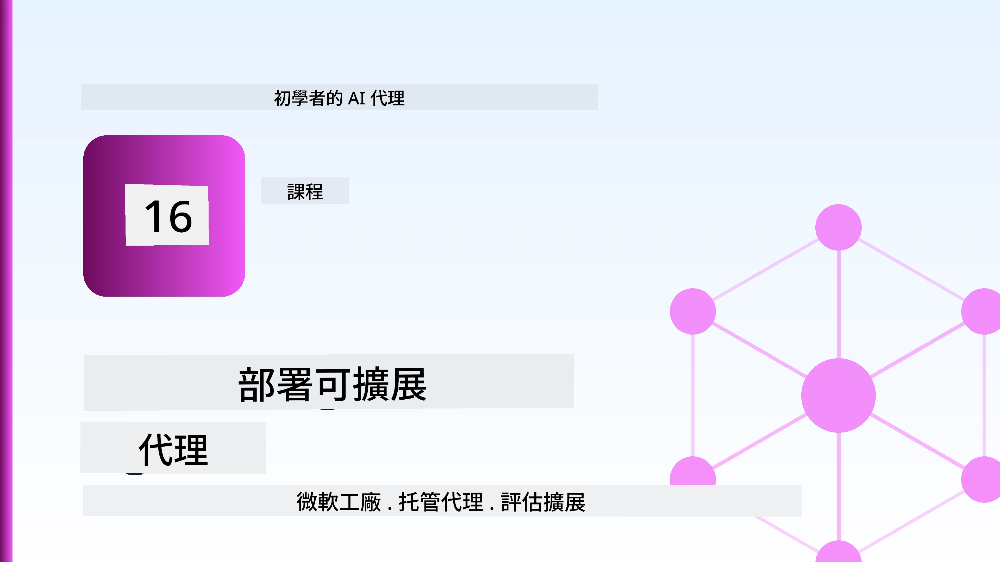
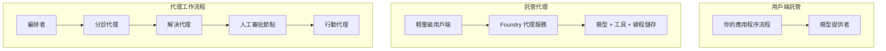
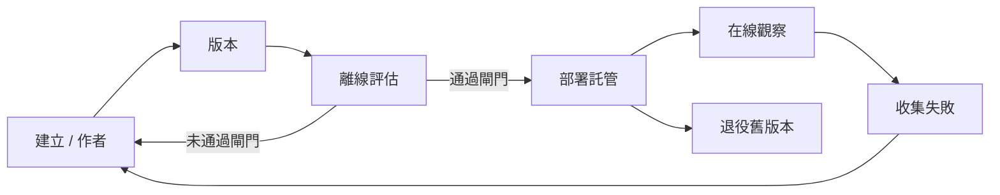
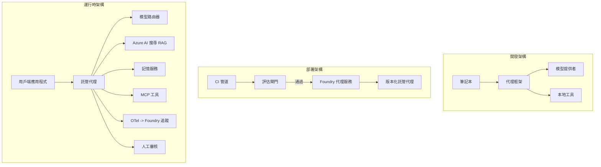

# 使用 Microsoft Foundry 部署可擴展代理



到目前為止，您已經建立了可在筆記本電腦上運行的代理，該代理透過 `az login` 和一些環境變數來驅動。這是學習的絕佳方式，但不是千千萬萬的客戶在凌晨 3 點依賴的代理運行的正確方式。

本課程講述如何從「在我的機器上可以運行」到「在生產環境中可靠且經濟地運行」之間的差距。我們使用 **Microsoft Foundry** 和 **Microsoft Foundry 代理服務** 來填補這個差距，並通過構建一個具有工具、檢索、記憶、評估和監控功能的實際客戶支援代理來實現。

## 簡介

本課將涵蓋：

- <strong>原型代理</strong> 與 <strong>部署代理</strong> 之間的差異，以及為何轉換主要是關於模型周圍的所有 <em>配套</em> 工作。
- 代理的 <strong>部署模式</strong>：用戶端託管、服務託管（託管代理），以及工作流協調。
- Microsoft Foundry 上的 <strong>代理生命周期</strong> — 建立、版本控制、部署、評估、觀察、退役。
- <strong>擴展策略</strong>：模型路由、快取、併發和無狀態設計。
- 透過 OpenTelemetry 和 Foundry 追蹤實現的 <strong>可觀察性</strong>。
- 透過模型選擇、路由和評估門實現的 <strong>成本優化</strong>。
- <strong>企業考量</strong>：治理、人類審批，以及在生產環境中安全運行 MCP 伺服器。

## 學習目標

完成本課後，您將了解如何：

- 為特定代理工作負載選擇正確的部署模式。
- 將代理部署到 Microsoft Foundry 代理服務，使其具備版本管理、治理和可觀察性。
- 為代理加入追蹤工具，並連接一個在每次發佈前運行的評估管線。
- 應用模型路由和快取，以控制延遲和成本。
- 為高風險行動加上人工審批閘道，並以生產安全的方式整合 MCP 伺服器。

## 先決條件

本課程假設您已完成前面的課程，熟悉：

- 使用 [Microsoft Agent Framework](../14-microsoft-agent-framework/README.md) 建立代理（第 14 課）。
- [工具使用](../04-tool-use/README.md)（第 4 課）與 [Agentic RAG](../05-agentic-rag/README.md)（第 5 課）。
- [代理記憶](../13-agent-memory/README.md)（第 13 課）與 [Agentic 協定 / MCP](../11-agentic-protocols/README.md)（第 11 課）。
- [可觀察性與評估](../10-ai-agents-production/README.md)（第 10 課）— 本課直接建立在此基礎上。

您還需要：

- 一個 **Azure 訂閱** 與一個至少部署了一個聊天模型的 **Microsoft Foundry 專案**。
- 已認證的 **Azure CLI**（`az login`）。
- Python 3.12+ 版本與儲存庫中的套件 [`requirements.txt`](../../../requirements.txt)。

## 從原型到生產：實際改變了什麼

原型代理與生產代理共用相同的核心迴圈—推理、呼叫工具、回應。變化的是包覆該迴圈的所有周邊部分。模型大約佔生產代理的 20%，其餘 80% 則是操作骨架。

| 關注點 | 原型 | 生產 |
| --- | --- | --- |
| <strong>託管</strong> | 在您的筆記本中運行 | 作為託管服務運行，具版本管理並逐步部署 |
| <strong>身分識別</strong> | 您的 `az login` 通行證 | 具範圍 RBAC 的受管身分識別 |
| <strong>狀態</strong> | 內存保存，重啟後消失 | 外部化（線程存儲、記憶服務） |
| <strong>故障</strong> | 您看到追蹤報告 | 重試、備援、死信隊列、警報 |
| <strong>成本</strong> | 「幾分錢」 | 每次請求追蹤，路由，快取，預算控制 |
| <strong>質量</strong> | 人工目視檢查輸出 | 每次發佈前自動評估 |
| <strong>信任</strong> | 您批准每個行動 | 風險行動採用政策+人工審核 |

請記住此表。下文各節對應表中各列。

## 代理部署模式

您會使用三種模式，經常組合搭配。

### 1. 用戶端託管代理

代理物件存在於<em>您的</em>應用程序過程中。您的程式碼直接呼叫模型提供者；推理迴圈運行在您的服務中。這是之前所有課程所做的。

- <strong>使用時機</strong>：當您需要對迴圈全面掌控、客製化中介軟體，或將代理嵌入現有後端時使用。
- <strong>折衷點</strong>：您要自行負責擴展、狀態保存與韌性。

### 2. 託管代理（Foundry 代理服務）

代理作為資源<em>註冊</em>於 Microsoft Foundry。Foundry 承擔推理迴圈，存儲線程，執行內容安全和 RBAC，並在 Foundry 入口網站中顯示代理。您的應用變成輕量客戶端，創建線程並讀取回應。

- <strong>使用時機</strong>：當您需要持久化、內建可觀察性、治理及減少運維工作面時使用。
- <strong>折衷點</strong>：以管理式運行時換取較少低階控制。

### 3. 代理工作流

多個代理（及工具）組成一個帶有明確控制流程的圖形—順序步驟、分支、人類審批節點和可暫停恢復的持久檢查點。這是 Microsoft Agent Framework **Workflows** 功能在部署規模上的應用。

- <strong>使用時機</strong>：當單一任務跨多個專精代理或中間需要審批時使用。
- <strong>折衷點</strong>：更多移動部件，需要編排層級的可觀察性。



## Microsoft Foundry 上的代理生命周期

部署代理不是一次性 `push` 操作。它是一個循環，看起來像軟件發佈週期，因為本質就是如此。



關鍵概念，繼承自[第 10 課](../10-ai-agents-production/README.md)：**離線評估是一道關卡，而非事後補充。** 除非通過您的評估門檻，否則不會發佈新版本。在線可觀察性再把實際環境故障回饋入您的離線測試集中。這即整個循環。

## 擴展策略

擴展代理不同於擴展無狀態 Web API，因為每個請求可能觸發多個昂貴模型和工具呼叫。四個技術承擔大部分負載。

**無狀態請求處理。** 不在進程內存中保存每用戶狀態。將對話線程保存在 Foundry 線程存儲或記憶服務中，以便任何實例都能處理任何請求。如此可橫向擴展—增加實例，無需黏性會話。

**模型路由。** 並非所有請求都需最高效能（最昂貴）模型。將簡單請求—意圖分類、短事實回答—導向小而快速模型，大模型保留給真正推理。Foundry 的 <strong>模型路由器</strong> 可替您實現，或您可自行實作輕量分類器。實驗室中將構建自製版本。

**回應快取。** 許多客服詢問幾乎重複（「我如何重設密碼？」）。快取常見問題答案，不用每次都呼叫模型。即使是適度快取命中率也能顯著降低成本與延遲。

**併發與背壓。** 模型提供者有限制速率。限制併發數，用指數回退重試，並優雅失敗（排隊回覆「我們正在處理」勝過 500 錯誤）。


## 生產環境觀察性

不可見即無法運作。如第 10 課所述，Microsoft Agent Framework 原生發出 **OpenTelemetry** 追蹤—每個模型呼叫、工具調用和編排步驟皆成為 span。生產環境中，您將這些 span 匯出至 Microsoft Foundry（或任何兼容 OTel 後端），以便：

- 追蹤單一客戶投訴從頭到尾橫跨每個模型與工具呼叫。
- 觀察請求的 p50/p95 延遲與成本走勢。
- 在錯誤率飆升和成本異常發生前即警告，勝過使用者（或財務團隊）先察覺。

```python
from agent_framework.observability import get_tracer

tracer = get_tracer()

with tracer.start_as_current_span("support_request") as span:
    span.set_attribute("customer.tier", "enterprise")
    span.set_attribute("routed.model", "gpt-5-nano")
    # 代理執行會在此區段內自動被追蹤
```

像 `customer.tier` 和 `routed.model` 這類屬性，將追蹤資料牆化為可回答的疑問（「企業客戶是否被過度路由到小模型？」）。

## 成本優化

生產代理成本以 token 為主。三個槓桿，按影響力排序：

1. **選擇合適大小模型。** 通過評估門檻的小模型幾乎總比通過門檻的大模型便宜。用評估來<em>證明</em>小模型足夠好，而非一開始就選最大模型保險。
2. **按複雜度路由。** 如上—只有真正需要大模型推理的請求才付出大模型費用。
3. **積極快取。** 最便宜的模型呼叫是您永遠不用呼叫的。

評估門和成本控制是同一紀律的不同面向：評估決定<em>品質底線</em>，路由與快取使您成本儘可能接近該底線。

## 企業部署考量

**治理。** 託管代理繼承 Foundry 的 RBAC、內容安全和審計日誌。為每個代理給予最少權限的受管身分識別—只讀知識庫、對工單 API 範圍存取，沒有更多。

**人類審核。** 有些操作後果太大，不宜自動化—退款、刪除帳號、升級至法務團隊。Microsoft Agent Framework 支援 <strong>需要審批的</strong> 工具：代理提出動作，執行暫停，人類批准或拒絕後工作流恢復。您在[第 6 課](../06-building-trustworthy-agents/README.md)見過這個原始功能；本課部署它。

**生產環境中的 MCP。** [MCP](../11-agentic-protocols/README.md) 讓代理透過標準介面使用外部工具。生產中，把每個 MCP 伺服器視為不受信任邊界：固定伺服器版本，使用具範圍身分執行，驗證輸出，且永不向其透露秘密。MCP 伺服器是依賴組件，依賴組件需打補丁、審計、限流。



這三個圖 — 開發、部署、運行時 — 是代理生命三個階段。接下來的實驗室將引導您構建它。

## 實作實驗室：生產級客戶支援代理

打開 [`code_samples/16-python-agent-framework.ipynb`](./code_samples/16-python-agent-framework.ipynb) 並從頭到尾完成教程。您將組裝一個 **Contoso 客戶支援代理**，其中包含所有生產考量：

1. <strong>工具呼叫</strong> — 查詢訂單狀態與開立支援票證。
2. **RAG** — 從知識庫回答政策問題（Azure AI Search，附帶記憶體降級，可在無 Search 資源情況下運行筆記本）。
3. <strong>記憶</strong> — 記住客戶對話輪次內容。
4. <strong>模型路由</strong> — 複雜度分類器將請求導向小或大模型。
5. <strong>回應快取</strong> — 重複問題從快取提供。
6. <strong>人工審批</strong> — 閾值以上退費暫停等待人類簽核。
7. <strong>評估管線</strong> — 小型離線測試集評分代理作為發佈門檻。
8. <strong>可觀察性</strong> — 每次請求周圍的 OpenTelemetry 追蹤。

### 演練

筆記本規劃為每個生產考量都是自成一體的可執行章節。核心為路由加快取的請求處理器：

```python
async def handle_support_request(query: str, customer_id: str) -> str:
    # 1. 盡可能從緩存提供服務。
    cached = response_cache.get(normalize(query))
    if cached:
        return cached

    # 2. 按複雜度路由以控制成本。
    model = "gpt-5-nano" if is_simple(query) else "gpt-5-mini"

    # 3. 在追蹤範圍內運行代理以便觀察。
    with tracer.start_as_current_span("support_request") as span:
        span.set_attribute("routed.model", model)
        span.set_attribute("customer.id", customer_id)
        response = await support_agent.run(query, model=model)

    # 4. 緩存並返回。
    response_cache.set(normalize(query), response.text)
    return response.text
```

掌控發佈的評估門如下：

```python
async def evaluation_gate(agent, test_cases, threshold: float = 0.8) -> bool:
    passed = 0
    for case in test_cases:
        result = await agent.run(case["input"])
        if score_response(result.text, case["expected"]) >= 0.8:
            passed += 1
    pass_rate = passed / len(test_cases)
    print(f"Evaluation pass rate: {pass_rate:.0%} (gate: {threshold:.0%})")
    return pass_rate >= threshold  # 只有門閘通過才會部署
```

仔細閱讀每行—筆記本有意保持原始功能小巧，無任何隱藏在框架呼叫後方的代碼。

## 透過煙霧測試驗證已部署代理

上述評估門在<em>離線</em>針對您的代理物件運行。一旦代理以託管代理方式部署，您還需要另一個更簡便的檢查：**已部署的端點是否實際回答？**

「成功部署」僅證明控制平面接收了定義，並不保證代理會回應。缺失依賴、錯誤模型路由或連線逾時，都可能使部署狀態綠燈卻無回應。<strong>煙霧測試</strong>可在秒內捕捉此狀況，每次部署都執行，成本遠低於全面評估。

本儲存庫提供一套現成的煙霧測試管線，建基於 [AI Smoke Test](https://github.com/marketplace/actions/ai-smoke-test) GitHub Action：

- <strong>目錄</strong> — [`tests/lesson-16-smoke-tests.json`](../../../tests/lesson-16-smoke-tests.json) 包含 Contoso 支援代理的提示與斷言（具根據政策的回答、訂單查詢、保持主題與多輪對話連續性）。其他課程代理的目錄亦與之並列—詳見 [`tests/README.md`](../tests/README.md)。
- <strong>工作流</strong> — [`.github/workflows/smoke-test.yml`](../../../.github/workflows/smoke-test.yml) 使用 Azure OIDC 登入並對代理的 Responses 端點 POST 每個提示，任一斷言失敗則終止工作流。

```yaml
- name: Smoke-test hosted agent
  uses: JFolberth/ai-smoketest@v1
  with:
    project_endpoint: ${{ inputs.project_endpoint }}
    agent_name: ContosoSupportAgent
    tests_file: tests/lesson-16-smoke-tests.json
```


在您的代理部署後，從 **Actions** 標籤執行它，並提供您的 Foundry 專案端點和代理名稱。聯邦身份需要在 Foundry 專案範圍內擁有 **Azure AI User** 角色。可把這些層次想像成金字塔：在每次部署時執行煙霧測試（是否可達且有回應？），在升級前執行離線評估（是否足夠好到可以發佈？），並持續執行在線評估（在真實環境中的表現如何？）。

## 知識檢測

在進行作業之前先測試您的理解。

**1. 大約有多少生產代理是「模型」，其餘的是什麼？**

<details>
<summary>答案</summary>

模型佔系統的少部分 — 通常約為 20%。其餘部分是運作骨架：託管和版本控制、身份和 RBAC、外部化狀態、故障處理、成本追蹤、評估和人機迴路控制。進入生產階段主要是建構圍繞推理迴路的所有其他部分。
</details>

**2. 何時會選擇 Hosted Agent 而非客戶端託管的代理？**

<details>
<summary>答案</summary>

當您想要一個含有內建耐久性（可持續存在且可繼續的執行緒）、可觀察性、內容安全和 RBAC 的管理型運行時，且願意為減少操作範圍而放棄推理迴路的一些低階控制時。當您需要完全控制迴路或將代理嵌入現有後端時，客戶端託管會是較佳選擇。
</details>

**3. 為什麼可擴展代理必須在其自身程序記憶體中無狀態？**

<details>
<summary>答案</summary>

如此任何實例都可以處理任何請求，這允許不需黏性會議而可橫向擴展。每個使用者的對話狀態會外部化到執行緒儲存或記憶服務。如果狀態存在於程序記憶體中，重啟時會遺失狀態，且無法自由分配負載。
</details>

**4. 模型路由解決什麼問題，且與評估有何關聯？**

<details>
<summary>答案</summary>

路由將簡單請求引導至小型、便宜且快速的模型，並保留大型模型處理真正的推理，控制延遲和成本。它與評估的關係是，評估是用來<em>證明</em>小型模型足夠應付某類請求 — 沒有評估的路由只是猜測。
</details>

**5. 什麼是「評估閘門」，它在生命週期中位於何處？**

<details>
<summary>答案</summary>

評估閘門會對新代理版本執行一組離線測試案例，除非通過率達到門檻，否則阻止部署。它位於生命週期中「版本」和「部署」之間，使品質成為發佈前的先決條件，而非發佈後才檢查。
</details>

**6. 為什麼 MCP 伺服器在生產環境中應被視為不受信任的邊界？**

<details>
<summary>答案</summary>

因為它是代理調用的外部依賴。您應鎖定其版本、使用範圍身份執行、驗證其輸出、速率限制，且絕不向其暴露機密 — 這和對任何第三方依賴的操作紀律相同。其輸出流入代理的推理中，未驗證的信任將成為安全風險。
</details>

**7. 哪個單一改變通常對生產代理的成本影響最大，為什麼？**

<details>
<summary>答案</summary>

合理選擇模型尺寸 — 使用能通過您的評估閘門的最小模型。成本主導來源是 token，且達到品質標準的小模型幾乎總是比大型模型便宜。快取和路由會進一步降低成本，但選擇合適的基底模型最有顯著影響。
</details>

**8. `customer.tier` 與 `routed.model` 等跨度屬性在可觀察性中扮演什麼角色？**

<details>
<summary>答案</summary>

它們將原始追蹤轉化為可回答的商業問題。沒有屬性時只有一堆跨度；有了屬性您可以問「企業客戶是否太常被路由到小模型？」或「哪個模型處理我們最快的請求？」屬性是按照對您的營運重要的維度切分遙測的方法。
</details>

## 作業

以實驗室的客服代理為基礎，加強其適用於特定場景：**針對 SaaS 公司的訂閱帳單客服代理。**

您的提交應包含：

1. <strong>替換工具</strong>，改用與帳單相關的工具：`get_subscription_status`、`get_invoice` 和 `issue_credit`（超過 50 美元的信用額度需人工核准）。
2. **新增三份 RAG 文件**，涵蓋公司退款政策、帳單週期與取消政策。
3. <strong>擴展評估集</strong> 至至少八個案例，包括至少兩個<em>應該</em>觸發人工核准路徑的案例，並確認評估閘門能正確通過或失敗。
4. <strong>新增一份成本報告</strong>：在通過代理執行十個混合查詢後，列印多少請求送往小模型、多少送往大模型、多少由快取服務。

寫一段短文（於 markdown cell 中）說明您選擇的模型路由規則，以及如何用真實流量驗證它。沒有單一正確答案 — 評估重點在於您是否將生產考量合理串接在一起。

## 總結

本課程中您已將代理從原型移至 Microsoft Foundry 生產環境：

- 從原型跳至生產主要是關注模型周圍的 <strong>運營骨架</strong> — 託管、身份、狀態、故障處理、成本、品質與信任。
- 您學到了三種 <strong>部署模式</strong> — 客戶端託管、Hosted Agents 以及 Agent Workflows — 及其適用時機。
- 您瀏覽了 <strong>代理生命週期</strong>，離線 <strong>評估作為釋出閘門</strong>，而在線可觀察性將故障回饋至測試集。
- 您應用了 <strong>擴展策略</strong> — 無狀態設計、模型路由、快取與有限並發 — 並橋接到 <strong>成本優化</strong>。
- 您串接了 <strong>企業控管</strong>：RBAC、人機介入核准與生產安全的 MCP 整合。
- 您建造了一個 <strong>生產就緒的客戶客服代理</strong>，將所有這些考量整合成可運行的程式碼。

下一課程行進相反路線：不是將代理擴展至雲端，而是將它們<em>縮小</em>到單一開發者機器並完全本地執行。

## 額外資源

- <a href="https://learn.microsoft.com/azure/ai-foundry/what-is-azure-ai-foundry" target="_blank">Microsoft Foundry 文件</a>
- <a href="https://learn.microsoft.com/azure/ai-foundry/agents/overview" target="_blank">Microsoft Foundry 代理服務概覽</a>
- <a href="https://learn.microsoft.com/en-us/agent-framework/overview/?wt.mc_id=youtube_26688_organicsocial_reactor&pivots=programming-language-python" target="_blank">Microsoft Agent Framework</a>
- <a href="https://learn.microsoft.com/azure/ai-foundry/concepts/model-router" target="_blank">Microsoft Foundry 中的模型路由器</a>
- <a href="https://learn.microsoft.com/azure/search/search-what-is-azure-search" target="_blank">Azure AI Search</a>
- <a href="https://opentelemetry.io/" target="_blank">OpenTelemetry</a>
- <a href="https://github.com/marketplace/actions/ai-smoke-test" target="_blank">AI Smoke Test GitHub Action</a>
- <a href="https://modelcontextprotocol.io/" target="_blank">Model Context Protocol (MCP)</a>

## 上一課

[建立電腦使用代理 (CUA)](../15-browser-use/README.md)

## 下一課

[建立本地 AI 代理](../17-creating-local-ai-agents/README.md)

---

<!-- CO-OP TRANSLATOR DISCLAIMER START -->
**免責聲明**：
本文件使用 AI 翻譯服務 [Co-op Translator](https://github.com/Azure/co-op-translator) 進行翻譯。雖然我們力求準確，但請注意，自動翻譯可能包含錯誤或不準確之處。原始文件的母語版本應被視為權威來源。對於重要資訊，建議尋求專業人工翻譯。我們不對因使用本翻譯而引起的任何誤解或曲解承擔責任。
<!-- CO-OP TRANSLATOR DISCLAIMER END -->