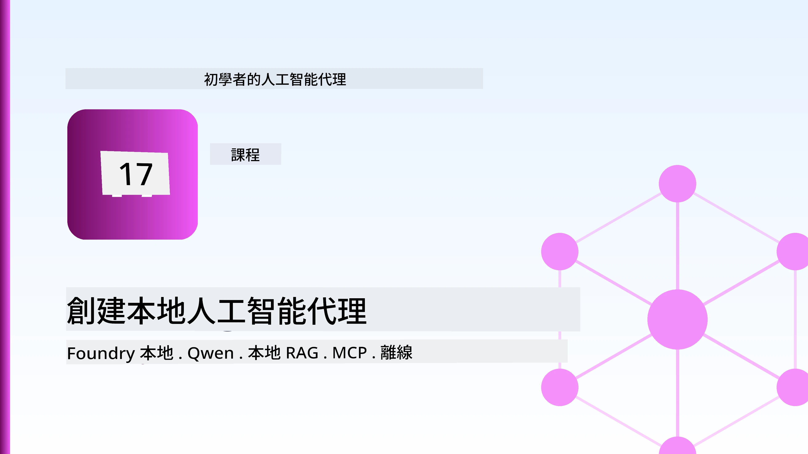
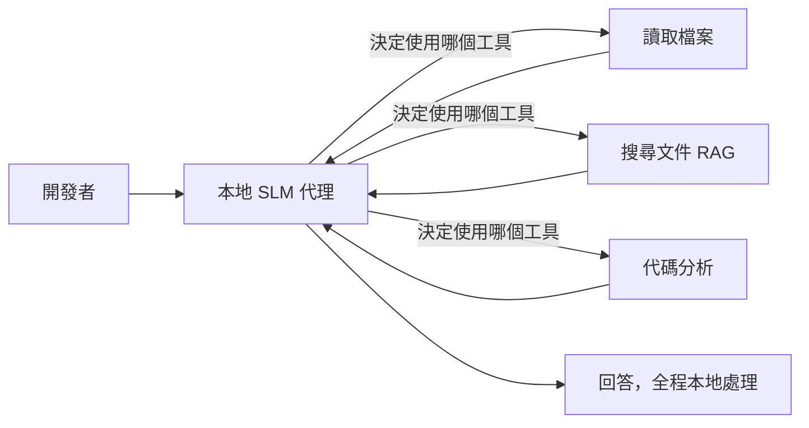
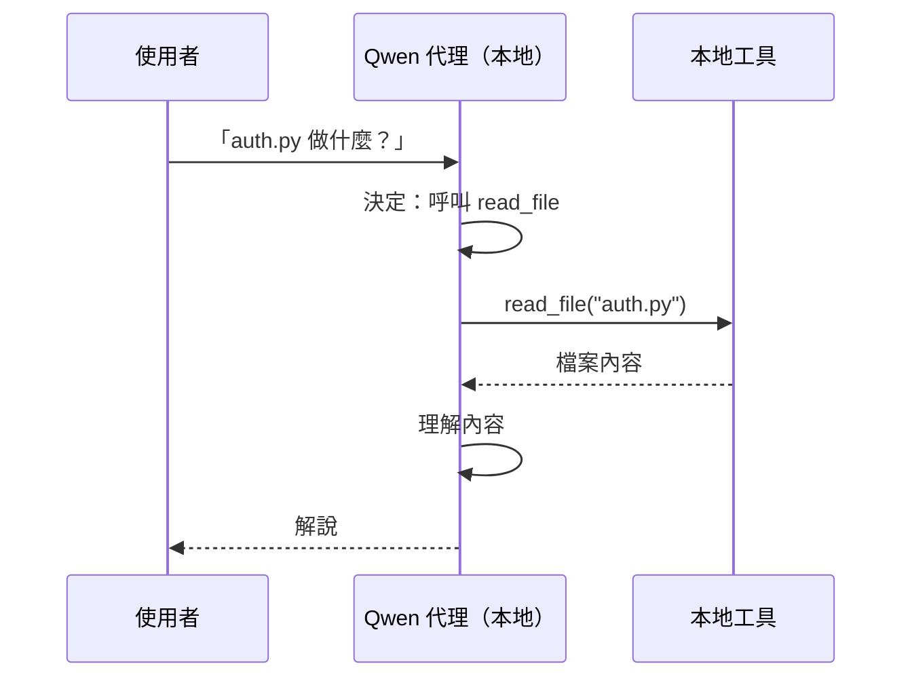
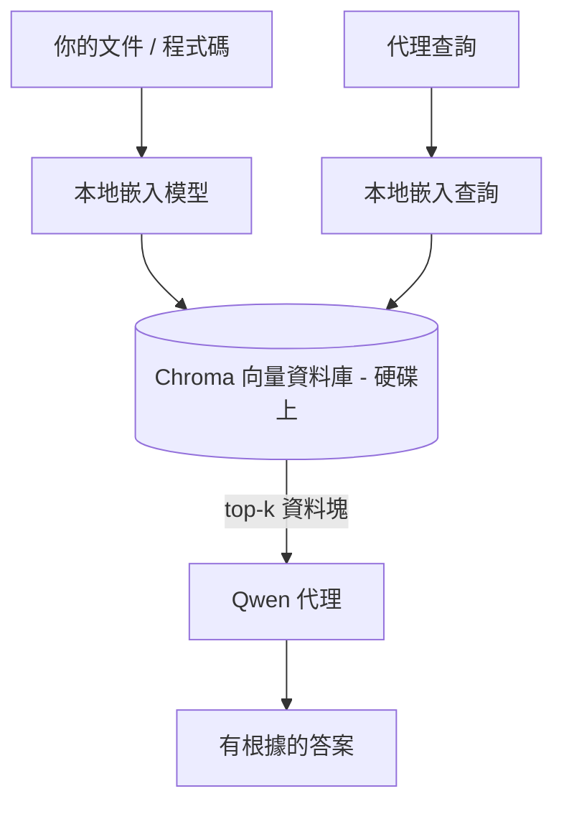
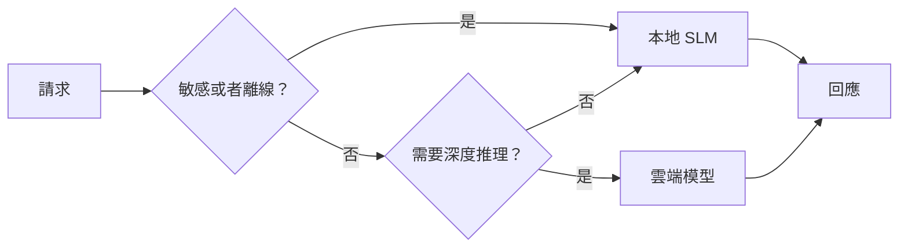

# 使用 Microsoft Foundry Local 和 Qwen 創建本地 AI 代理



上一課將代理擴展到雲端。本課則將它們帶回單機端。結束時，你將擁有一個可工作的工程助理，能推理、調用工具、閱讀你的檔案並搜尋你的文件 — **不需任何雲端推理呼叫。**

為何需要這樣做？實際工程工作中經常遇到三個理由：

- **隱私。** 代碼和文檔永遠留在機器上。沒有提示、片段或客戶資料會穿越網絡邊界。
- **成本。** 本地推理無需按 Token 計費。你可以整天迭代，只需支付電費。
- **離線。** 無論在飛機上、安全設施內或網絡中斷期間，代理都能正常工作。

關鍵是你正在用 **小型語言模型 (SLM)** 取代最先進的雲端模型，並在你的 CPU、GPU 或 NPU 上運行。本課討論如何在這種限制下構建 <em>優秀</em> 的代理，而不是假裝限制不存在。

## 簡介

本課將涵蓋：

- **小型語言模型 (SLMs)** — 它們是什麼、在哪些情境下表現優越、哪些情況不適合。
- **Microsoft Foundry Local** — 一種在裝置上下載並服務模型的運行時，通過<strong>OpenAI 相容 API</strong>提供服務。
- **Qwen 函數調用模型** — 可靠產生工具調用的 SLM，使本地<em>代理</em>（不僅是本地聊天）成為可能。
- **本地工具、本地 RAG 及本地 MCP** — 在無雲端的情況下賦予代理能力。
- <strong>混合模式</strong> — 何時保留本地，何時呼叫雲端。

## 學習目標

完成本課後，你將了解如何：

- 解釋 SLM 的權衡並挑選適合的本地代理使用案例。
- 使用 Foundry Local 本地提供 Qwen 模型，並透過 OpenAI 相容端點連接。
- 建立完全運行於工作站的工具調用代理。
- 利用本地向量資料庫（Chroma）加入本地 RAG，處理你自己的文檔。
- 將代理連接至本地 MCP 伺服器，並對混合本地與雲端設計進行推理。

## 先決條件

本課假設你已完成之前課程，且熟悉：

- [工具使用](../04-tool-use/README.md)（第4課）及 [Agentic RAG](../05-agentic-rag/README.md)（第5課）。
- [Agentic Protocols / MCP](../11-agentic-protocols/README.md)（第11課）。
- [Microsoft Agent Framework](../14-microsoft-agent-framework/README.md)（第14課）。

你還需要：

- 一台開發工作站。**8 GB 記憶體是現實最小需求**；16 GB 以上較舒適。有 GPU 或 NPU 有助益但非必須。
- 安裝 **Microsoft Foundry Local**（請參見以下設定章節）。
- Python 3.12 以上以及本儲存庫中的 [`requirements.txt`](../../../requirements.txt) 套件，另需本課的 `foundry-local-sdk`、`openai` 和 `chromadb`。

## 小型語言模型：本地工作的適合工具

頂尖的雲端模型擁有數千億參數，背靠大型數據中心。SLM 則擁有數十億參數，必須裝入你筆記型電腦的記憶體。這個差異設定了明確的期待。

**SLMs 擅長：**

- 結構化、有界的任務 — 分類、抽取、已知文檔的摘要。
- <strong>工具調用</strong> — 決定調用哪個函數及參數。
- 快速、廉價、私密地迭代你自己的資料。

**SLMs 較弱於：**

- 大範圍且開放的多跳推理。
- 廣博的世界知識（見過較少且較易忘記）。

本地代理的勝出策略是：**讓 SLM 負責指揮，讓工具負責繁重工作。** 模型不需要<em>了解</em>你的代碼庫 — 它需要知道何時呼叫 `read_file` 和 `search_docs`。這正好發揮了 SLM 的優勢。



## Microsoft Foundry Local

**Microsoft Foundry Local** 是一個輕量級運行時，在你的機器上完全下載、管理並提供模型服務。對我們最重要的功能是它暴露了一個<strong>OpenAI 兼容的 HTTP 端點</strong> — 這表示 OpenAI SDK 和 Microsoft Agent Framework 的 OpenAI 用戶端只需更改 `base_url` 後即可使用它。你建立代理時學到的一切知識均可直接套用；唯一不同的是端點從雲端變成了 `localhost`。

Foundry Local 會根據你的硬體自動選擇最適合的模型版本 — CPU 版本、CUDA/GPU 版本或 NPU 版本 — 不用你為每台機器手動優化。

### 設定

安裝 Foundry Local（請參閱你的作業系統的 [文件](https://learn.microsoft.com/azure/ai-foundry/foundry-local/)），然後確認其可用性：

```bash
# 安裝（範例；請依照你的平台文件操作）
winget install Microsoft.FoundryLocal      # Windows 作業系統
# brew 安裝 microsoft/foundrylocal/foundrylocal   # macOS

# 下載並執行 Qwen 模型，然後啟動本地服務
foundry model run qwen2.5-7b-instruct
foundry service status
```

服務啟動後，你便擁有一個本地的 OpenAI 兼容端點（通常是 `http://localhost:PORT/v1`）。筆記本使用 `foundry-local-sdk` 自動發現此端點，無需你硬編端口號。

## Qwen 函數調用：為何重要

代理唯有能夠調用工具才是真正的代理。許多 SLM 可用於聊天，但生成不可靠且格式錯誤的工具調用。**Qwen** 模型專為函數調用訓練，能一致地輸出格式良好的工具調用結構 — 這正是將本地聊天模型轉變為本地 <em>代理</em> 的關鍵。

流程是你熟悉的標準工具調用循環，僅是在裝置端運行：



## 本地 RAG

文件搜尋是本地代理的用武之地。不用指望 SLM 記住你的框架文件，你可以將文檔嵌入到<strong>本地向量資料庫</strong>，並讓代理按需檢索相關片段。

我們使用 **Chroma**，一款嵌入式向量庫，與進程一同運行，無需管理伺服器。整個流程完全本地化：本地嵌入模型 → 本地向量 → 本地檢索 → 本地 SLM。



這是第5課的 Agentic RAG 模式 — 唯一差異是每個組件均在你的機器上運行。

## 本地 MCP 伺服器

[MCP](../11-agentic-protocols/README.md) 是一種傳輸協定，而非雲端服務。MCP 伺服器可作為本地進程運行於 `stdio`，通過標準協定對你的代理暴露工具。這讓你能離線重用越來越多的 MCP 伺服器生態系 — 檔案系統存取、git 操作、資料庫查詢等。

安全狀態與雲端不同，但並非不存在：本地 MCP 伺服器以你用戶的權限運行，因此請限制其可存取範圍（例如一個專案目錄，而非整個家目錄），並將其輸出視為輸入加以驗證。

## 混合雲端與本地模式

以本地為先不代表只能靠本地。成熟系統會依敏感度與難度來分流：

| 情況 | 運行位置 |
| --- | --- |
| 敏感代碼/資料或離線 | **本地 SLM** |
| 簡單、有界任務 | **本地 SLM**（廉價、快速） |
| 困難多跳推理（非敏感資料） | <strong>雲端模型</strong> |
| 網絡中斷時全部任務 | **本地 SLM**（優雅降級） |

這與第16課的<strong>模型路由</strong>理念相符 — 不同的是，「模型」之一是你自己的機器。健壯的設計會在雲端不可用時退回本地，讓代理品質降低但不會完全失效。



## 實作實驗室：本地工程助理

打開 [`code_samples/17-local-agent-foundry-local.ipynb`](./code_samples/17-local-agent-foundry-local.ipynb) 並跟著進行。你將建立一個<strong>完全在工作站運行的本地工程助理</strong>，它能：

1. <strong>調用工具</strong> — 通過 Foundry Local 的 Qwen 函數調用。
2. <strong>執行本地檔案操作</strong> — 列出並閱讀專案目錄中的檔案。
3. <strong>分析代碼</strong> — 報告源文件的基本度量。
4. <strong>搜尋文件</strong> — 使用 Chroma 在本地文件夾中進行 RAG。
5. **使用 MCP** — 連接到本地 MCP 伺服器（如未配置則優雅跳過）。

任何時候都不使用雲端推理。

### 操作導覽

助理通過 OpenAI 兼容端點連接 Foundry Local，因此代理代碼與雲端課程近乎相同，唯獨用戶端變更：

```python
from foundry_local import FoundryLocalManager
from openai import OpenAI

# Foundry Local 發現/下載模型，並為我們提供本地端點。
manager = FoundryLocalManager(\"qwen2.5-7b-instruct\")
client = OpenAI(base_url=manager.endpoint, api_key=manager.api_key)  # api_key 是本地佔位符
```

工具是範圍限制在專案目錄的普通 Python 函數：

```python
def read_file(path: str) -> str:
    \"\"\"Read a file, but only inside the sandboxed project directory.\"\"\"
    full = (PROJECT_ROOT / path).resolve()
    if PROJECT_ROOT not in full.parents and full != PROJECT_ROOT:
        return \"Access denied: path is outside the project directory.\"
    return full.read_text(encoding=\"utf-8\")
```

注意沙箱檢查 — 即使本地，讀取任意路徑的工具也是風險。筆記本使每個工具皆限定在單一專案根目錄。

## 知識檢測

在前往作業前測試你的理解。

**1. 請列舉兩個將代理設置為本地運行而非雲端的具體理由。**

<details>
<summary>答案</summary>

任選兩項：<strong>隱私</strong>（程式碼和資料永不離機）、<strong>成本</strong>（無按 Token 推理計費）、<strong>離線能力</strong>（無網路也能用 — 無論飛機上、安全設施或網絡中斷）。隱私理由常因合規限制禁止資料外送而起。
</details>

**2. 在本地代理中，建議的 SLM 與工具間分工為何？為什麼？**

<details>
<summary>答案</summary>

讓 SLM <strong>負責指揮</strong>（決定調用哪個工具及參數），工具則 <strong>負責重活</strong>（讀檔、取文檔、計算結果）。SLM 擅長有界決策如工具選擇，但在廣泛知識與長多跳推理較弱，所以依賴工具恰好發揮強項。
</details>

**3. 為何能用 Foundry Local 重用雲端代理程式代碼？**

<details>
<summary>答案</summary>

Foundry Local 暴露了<strong>OpenAI 相容的 HTTP 端點</strong>。OpenAI SDK 和 Agent Framework 的 OpenAI 用戶端只需變更 `base_url`（並使用本地佔位 API 金鑰）即可使用。代理代碼其餘部分均不變。
</details>

**4. 為何特別使用 Qwen 函數調用模型，而非任何 SLM？**

<details>
<summary>答案</summary>

因為代理必須生成可靠且格式良好的<strong>工具調用</strong>。許多 SLM 能聊天，但會產生格式錯誤或不一致的工具調用結構。Qwen 模型經函數調用訓練，產生一致的工具調用，這讓本地聊天模型成為可工作的本地代理。
</details>

**5. 在本地 RAG 流程中，哪些組件運行在機器上？**

<details>
<summary>答案</summary>

全部組件：嵌入模型、向量資料庫（Chroma，儲存在磁碟上）、檢索步驟與 SLM。文檔本地嵌入、本地存儲、本地檢索，並由本地模型進行推理 — 沒有任何元件接觸雲端。
</details>

**6. 本地 MCP 伺服器運行於你的機器上，這是否自動代表它是安全的？你還應採取哪些預防措施？**

<details>
<summary>答案</summary>

不。因為本地 MCP 伺服器以你的用戶權限運行，可以存取你能存取的任何東西。請限制它所需的存取範圍（例如單一專案目錄，而非整個家目錄），並將其輸出視為輸入，執行驗證後再處理。
</details>

**7. 描述一個包含本地模型的合理混合路由規則。**

<details>
<summary>答案</summary>

將敏感或離線請求導向本地 SLM；將簡單有界任務導向本地 SLM 以獲得速度與成本效益；將非敏感資料上的困難多跳推理導向雲端模型；如雲端不可用則退回本地 SLM，讓代理優雅降級而非失敗。這是第16課的模型路由概念，且將本地機器視作其中一個模型。
</details>

**8. 本課本地代理的實際最低 RAM 需求是多少？更多 RAM 可帶來什麼好處？**

<details>
<summary>答案</summary>

約 **8 GB** 是現實最低需求；16 GB 以上較舒適。更多 RAM 讓你能運行更大型、能力更強的模型，並保有更多上下文於記憶體中。有 GPU 或 NPU 可加速推理，但非必要 — 當無加速器時，Foundry Local 會選擇 CPU 版本。
</details>

## 作業

擴展本地工程助理成你自行選擇一個小案子的<strong>本地文件審查員</strong>（如果願意，可使用本儲存庫中的任一課程資料夾）。

你的提交應包含：

1. 將一個真實的文件／代碼資料夾索引至 Chroma（至少五個檔案）。
2. 新增一個 `find_todos` 工具，掃描專案中的 `TODO`／`FIXME` 註解並返回其檔案與行號 — 同時保持與 `read_file` 相同的沙箱檢查。

3. <strong>向代理提出三個問題</strong>，要求它結合多個工具：一個純粹的 RAG 問題、一個需要閱讀特定文件的問題，還有一個需要尋找 TODO 的問題。
4. <strong>測量它</strong>：計時三個回答的時間，並在 markdown 單元格中記錄。評論這些延遲是否適合你預期的工作流程。

然後寫一段簡短的文字，說明<strong>哪些部分你會移到雲端，哪些會保留在本地</strong>給這個審閱者，以及原因。評估標準是本地元件是否正確串接，以及你的混合推理是否合理——而非模型質量。

## 總結

在本課程中，你建立了一個完全運行在你自己機器上的代理：

- **SLM** 以隱私、成本和離線運作換取廣度 —— 當它們<strong>編排工具</strong>而非自己承載所有知識時表現出色。
- **Foundry Local** 在裝置上提供模型，並透過與 **OpenAI 相容的端點**，讓你的雲端代理程式碼可藉由一行程式碼改動轉移。
- **Qwen 函數調用模型** 使可靠的本地工具調用成為可能，因此實現本地<em>代理</em>。
- **本地 RAG**（Chroma）及<strong>本地 MCP</strong> 讓代理具備在本機執行的能力。
- <strong>混合模式</strong> 讓你可依敏感度和難易度路由，且本地端作為優雅的後備方案。

這完成了部署階段：第 16 課將代理擴展到 Microsoft Foundry，本課將它們縮減到單一工作站。下一課將聚焦於保持已部署代理的安全。

## 其他資源

- <a href="https://learn.microsoft.com/azure/ai-foundry/foundry-local/" target="_blank">Microsoft Foundry Local 文件</a>
- <a href="https://learn.microsoft.com/azure/ai-foundry/what-is-azure-ai-foundry" target="_blank">Microsoft Foundry 文件</a>
- <a href="https://learn.microsoft.com/en-us/agent-framework/overview/?wt.mc_id=youtube_26688_organicsocial_reactor&pivots=programming-language-python" target="_blank">Microsoft Agent Framework</a>
- <a href="https://qwen.readthedocs.io/en/latest/framework/function_call.html" target="_blank">Qwen 函數調用文件</a>
- <a href="https://modelcontextprotocol.io/" target="_blank">Model Context Protocol (MCP)</a>
- <a href="https://docs.trychroma.com/" target="_blank">Chroma 向量資料庫</a>

## 上一課

[部署可擴展代理](../16-deploying-scalable-agents/README.md)

## 下一課

[保護 AI 代理](../18-securing-ai-agents/README.md)

---

<!-- CO-OP TRANSLATOR DISCLAIMER START -->
**免責聲明**：
本文件使用 AI 翻譯服務 [Co-op Translator](https://github.com/Azure/co-op-translator) 進行翻譯。雖然我們力求準確，但請注意，自動翻譯可能包含錯誤或不準確之處。原始文件的母語版本應被視為權威來源。對於重要資訊，建議尋求專業人工翻譯。我們不對因使用本翻譯而引起的任何誤解或曲解承擔責任。
<!-- CO-OP TRANSLATOR DISCLAIMER END -->