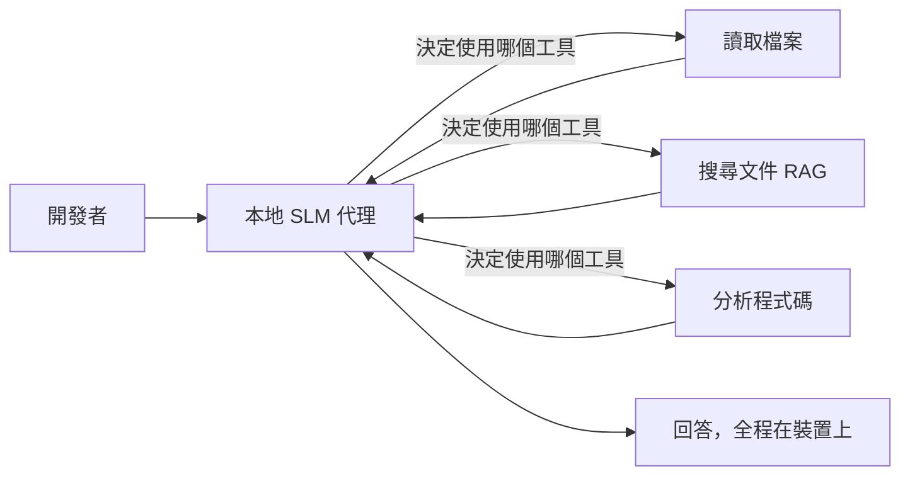
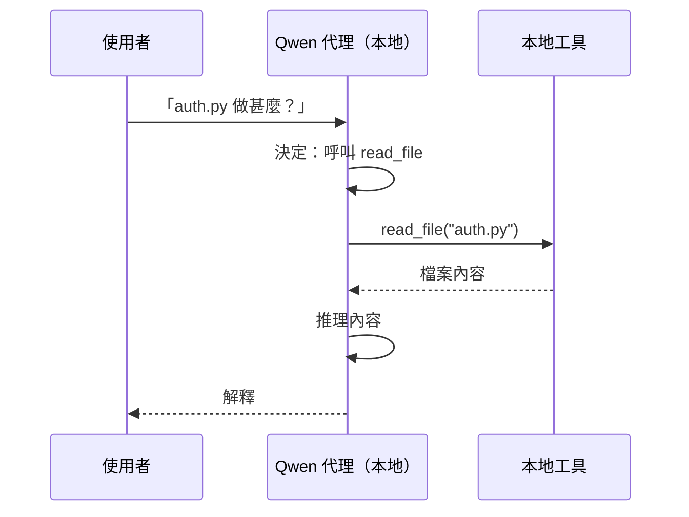
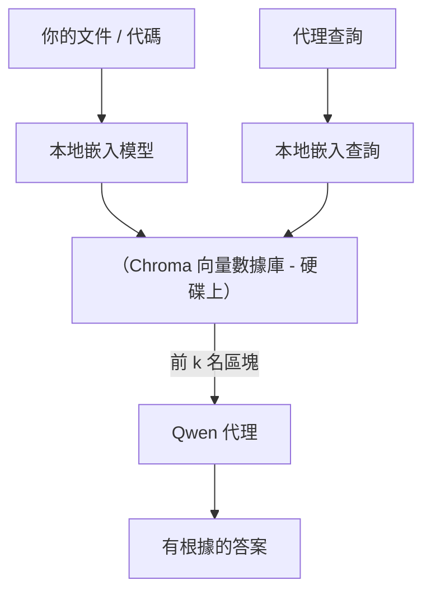
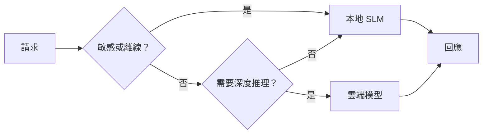

# 使用 Microsoft Foundry Local 及 Qwen 建立本地 AI 助理


上一課將助理擴展到雲端。這一課則將它們帶回到單一機器。結束時，你將擁有一個能推理、呼叫工具、閱讀你的檔案及搜尋文件的工作工程助理 — **完全不須呼叫任何雲端推論。**

為什麼你會想要這樣？以下三個在實際工程工作中常常出現的理由：

- **隱私。** 程式碼和文件永遠留在本機。沒有提示，沒有碼段，沒有客戶資料穿越網路邊界。
- **成本。** 本地推論不計每個 token 的費用。你可以全天迭代，花費僅是電費。
- **離線。** 在飛機上、在安全設施內或停電期間，助理仍可運作。

限制是你正在用一個在 CPU、GPU 或 NPU 上運行的 **小型語言模型（SLM）** 換取先進的雲端模型。本課是講如何在這個限制中建立 <em>表現良好</em> 的助理，而不是假裝這限制不存在。

## 介紹

本課程涵蓋：

- **小型語言模型（SLMs）** — 它們是什麼、擅長什麼、不擅長什麼。
- **Microsoft Foundry Local** — 一個能在裝置上下載並伺服模型的執行環境，透過 **OpenAI 相容 API** 提供存取。
- **Qwen 函數呼叫模型** — 可靠產生工具呼叫的 SLM，讓本地 <em>助理</em>（不僅是本地聊天）成為可能。
- **本地工具、本地 RAG 與本地 MCP** — 賦予助理無需雲端的能力。
- <strong>混合使用模式</strong> — 何時保留本地，何時呼叫雲端。

## 學習目標

完成本課後，你將能：

- 解釋 SLM 的權衡並選出適合的本地助理用例。
- 使用 Foundry Local 本地服務 Qwen 模型，並透過 OpenAI 相容端點連接。
- 建立完全在工作站上運行、能呼叫工具的助理。
- 使用本地向量資料庫（Chroma）為自己的文件增加本地 RAG。
- 將助理連接到本地 MCP 伺服器，並對混合本地/雲端設計進行推理。

## 先決條件

本課假設你已完成先前課程並熟悉：

- [工具使用](../04-tool-use/README.md)（第4課）和 [Agentic RAG](../05-agentic-rag/README.md)（第5課）。
- [Agentic 協定 / MCP](../11-agentic-protocols/README.md)（第11課）。
- [Microsoft Agent Framework](../14-microsoft-agent-framework/README.md)（第14課）。

你還需要：

- 一台開發工作站。**8 GB RAM 是實際最低要求**；16 GB 以上則舒適。有 GPU 或 NPU 會幫助，但非必須。
- 已安裝 **Microsoft Foundry Local**（請參考下方安裝說明）。
- Python 3.12+ 及本存放庫 [`requirements.txt`](../../../requirements.txt) 中的套件，此外本課需用到 `foundry-local-sdk`、`openai` 及 `chromadb`。

## 小型語言模型：本地工作的合適工具

先進雲端模型擁有數千億參數，後方有資料中心支撐。SLM 有幾十億參數，必須放入你筆電的 RAM 中。這差異設定了清晰期望。

**SLM 擅長：**

- 結構化、有限界任務 — 分類、提取、已知文件的摘要。
- <strong>工具呼叫</strong> — 決定呼叫哪個函數，及使用哪些參數。
- 針對自己的資料快速、便宜、私密地迭代。

**SLM 較弱：**

- 在大範圍上下文中開放式、多跳推理。
- 廣泛世界知識（見過的比較少，遺忘得較快）。

因此本地助理的致勝策略是：**讓 SLM 負責協調，工具負責重工作。** 模型不必 <em>知道</em> 你的程式碼庫，只要知道什麼時候呼叫 `read_file` 和 `search_docs`。這正好發揮 SLM 的長處。



## Microsoft Foundry Local

**Microsoft Foundry Local** 是輕量級運行時，能在你的機器上完整下載、管理及伺服模型。它對我們最重要的功能是它曝露了 **OpenAI 相容 HTTP 端點** — 意味著 OpenAI SDK 與 Microsoft Agent Framework 的 OpenAI 用戶端只需更改 `base_url` 即可使用。你學到的建構助理的知識可以直接轉用；唯一改變的是端點從雲端移到 `localhost`。

Foundry Local 還會自動為你的硬體挑選最優的模型建構版本 — CPU 版本、CUDA/GPU 版本或 NPU 版本 — 不用你為每台機器手動優化。

### 安裝

安裝 Foundry Local（參考你的作業系統的[文件](https://learn.microsoft.com/azure/ai-foundry/foundry-local/)），然後確認運作：

```bash
# 安裝（例如；請遵循您平台的文件）
winget install Microsoft.FoundryLocal      # Windows
# brew install microsoft/foundrylocal/foundrylocal   # macOS

# 下載並運行一個 Qwen 模型，然後啟動本地服務
foundry model run qwen2.5-7b-instruct
foundry service status
```

服務啟動後，你會有一個本地的 OpenAI 相容端點（通常是 `http://localhost:PORT/v1`）。筆記本用 `foundry-local-sdk` 自動發現端點，無需硬編端口。

## Qwen 函數呼叫：為何重要

助理只有能呼叫工具才能稱為助理。許多 SLM 可以聊天，但產生不可靠、格式錯誤的工具呼叫。**Qwen** 模型專為函數呼叫訓練，穩定產生格式完善的工具呼叫結構 — 這正是讓本地聊天模型變成本地 <em>助理</em> 的關鍵。

流程是你已知的標準工具呼叫迴圈，只是在裝置上運行：



## 本地 RAG

文檔檢索是本地助理發揮價值的重點。你不用指望 SLM 記住你的框架文件，你將文件嵌入 <strong>本地向量資料庫</strong>，讓助理按需檢索相關片段。

我們用 **Chroma**，一個內嵌向量存儲，運行於同一程序，不需伺服器管理。流程全本地：本地嵌入模型 → 本地向量 → 本地檢索 → 本地 SLM。



這是第5課的 Agentic RAG 模式 — 唯一差別是所有元件都在你的機器上執行。

## 本地 MCP 伺服器

[MCP](../11-agentic-protocols/README.md) 是一種傳輸協定，不是雲端服務。MCP 伺服器可以作為本地進程在 `stdio` 上運行，並通過標準協定向你的助理曝露工具。這讓你能離線重用不斷成長的 MCP 伺服器生態系 — 檔案系統存取、git 操作、資料庫查詢。

安全態勢不同於雲端，但並非不存在：本地 MCP 伺服器仍以你的用戶權限運行，因此請限定其可觸及範圍（例如只侷限於項目目錄，而非整個家目錄），並把輸出當成輸入來驗證。

## 混合雲端與本地模式

本地優先不代表只能本地。成熟系統按敏感度與難度路由：

| 情況 | 執行位置 |
| --- | --- |
| 敏感程式碼/資料，或離線 | **本地 SLM** |
| 簡單、有限任務 | **本地 SLM**（便宜、快速） |
| 於非敏感資料上需多跳複雜推理 | <strong>雲端模型</strong> |
| 故障期間的所有工作 | **本地 SLM**（優雅降級） |

這呼應了第16課的 <strong>模型路由</strong> 概念 — 不同的是其中一個「模型」現在是你自己的機器。健全設計會在雲端不可用時降級回本地，讓助理品質減少而非完全失效。



## 實作實驗：本地工程助理

開啟 [`code_samples/17-local-agent-foundry-local.ipynb`](./code_samples/17-local-agent-foundry-local.ipynb) 且逐步操作。你將打造一個 <strong>完全運行於工作站上的本地工程助理</strong> ，它能：

1. <strong>呼叫工具</strong> — 透過 Foundry Local 的 Qwen 函數呼叫功能。
2. <strong>執行本地檔案操作</strong> — 列出及讀取專案目錄的檔案。
3. <strong>分析程式碼</strong> — 報告原始檔的基本指標。
4. <strong>搜尋文件</strong> — 使用 Chroma 於文件資料夾進行本地 RAG。
5. **使用 MCP** — 連接本地 MCP 伺服器（若未配置則可優雅跳過）。

全程不使用雲端推論。

### 操作說明

助理透過 OpenAI 相容端點連到 Foundry Local，因此助理程式碼與雲端課程幾乎一樣 — 僅用戶端更換：

```python
from foundry_local import FoundryLocalManager
from openai import OpenAI

# Foundry Local 發現/下載模型並提供本地端點。
manager = FoundryLocalManager(\"qwen2.5-7b-instruct\")
client = OpenAI(base_url=manager.endpoint, api_key=manager.api_key)  # api_key 是本地佔位符
```

工具是作用域限定於專案目錄的普通 Python 函數：

```python
def read_file(path: str) -> str:
    \"\"\"Read a file, but only inside the sandboxed project directory.\"\"\"
    full = (PROJECT_ROOT / path).resolve()
    if PROJECT_ROOT not in full.parents and full != PROJECT_ROOT:
        return \"Access denied: path is outside the project directory.\"
    return full.read_text(encoding=\"utf-8\")
```

請注意沙盒檢查 — 就算是本地，能讀任意路徑的工具也是漏洞。筆記本將所有工具限定於單一專案目錄。

## 知識檢測

在進入作業前測試你的理解。

**1. 請列出兩個在本地運作助理而非雲端的具體原因。**

<details>
<summary>答案</summary>

下列任兩項：<strong>隱私</strong>（程式碼與資料永遠不離開機器）、<strong>成本</strong>（無每 token 推論費用）、以及<strong>離線能力</strong>（無網路下仍可運作 — 飛機上、安全設施或停電期間）。監管/合規約束禁止資料離機是隱私理由的常見驅動因子。
</details>

**2. 在本地助理中，SLM 與工具之間建議如何分工？為什麼？**

<details>
<summary>答案</summary>

讓 SLM **協調（orchestrate）**（決定呼叫哪個工具及帶哪些參數），讓 <strong>工具負責重工作</strong>（讀檔、檢索文件、計算結果）。SLM 擅長有界決策如工具選擇，但在廣泛知識及長距離多跳推理上較弱，因此賴工具發揮其強項。
</details>

**3. 為什麼能重用雲端助理碼於 Foundry Local？**

<details>
<summary>答案</summary>

Foundry Local 曝露了 **OpenAI 相容 HTTP 端點**。OpenAI SDK 及 Agent Framework 的 OpenAI 用戶端只需更改 `base_url`（並使用本地的假 API key）即可使用。助理程式碼其他部分不變。
</details>

**4. 為什麼選用 Qwen 函數呼叫模型，而不是一般 SLM？**

<details>
<summary>答案</summary>

因為助理必須產生可靠、格式正確的 <strong>工具呼叫</strong>。許多 SLM 能聊天，但產生格式錯誤或不一致的工具呼叫結構。Qwen 專為函數呼叫訓練，能穩定生成功能呼叫，這讓本地聊天模型變成本地 <em>助理</em>。
</details>

**5. 在本地 RAG 流程中，哪些組件運行於本機？**

<details>
<summary>答案</summary>

組件全數：嵌入模型、向量資料庫（Chroma，儲存在磁碟）、檢索步驟與 SLM。文件於本地嵌入、儲存、檢索及由本地模型推理 — 沒有元件與雲端互動。
</details>

**6. 本地 MCP 伺服器運行於你的機器，是否自動安全？你還應採取什麼預防措施？**

<details>
<summary>答案</summary>

不會。本地 MCP 伺服器以你的用戶權限運行，因此可存取你能存取的所有東西。請限制其範圍（例如限定於單一專案目錄，而非整個家目錄），並將其輸出視為輸入進行驗證後再使用。
</details>

**7. 請描述一個包含本地模型的合理混合路由規則。**

<details>
<summary>答案</summary>

對敏感或離線請求路由至本地 SLM；簡單有限任務也路由至本地 SLM 以求速度與成本優勢；非敏感資料上的困難多跳推理則路由雲端模型；若雲端不可用則退回本地 SLM，讓助理優雅降級而非失敗。這是模型路由（第16課），其中本地機器視為一個模型。
</details>

**8. 執行本課本地助理的實際最低 RAM 需求為多少？多一點 RAM 有何好處？**

<details>
<summary>答案</summary>

約 **8 GB** 是實際最低；16 GB 以上更舒適。更多 RAM 可運行更大更強的模型，並保持更多上下文於記憶中。有 GPU 或 NPU 可加速推論，但非必須 — Foundry Local 無加速卡時會選用 CPU 版本。
</details>

## 作業

擴充本地工程助理，使其成為你的選定小型專案的 <strong>本地文件審查員</strong>（若喜歡可用本存放庫的任一課程資料夾）。

你的提交應包含：

1. **將實際的文件／程式碼資料夾** 索引到 Chroma（至少五個檔案）。
2. **新增 `find_todos` 工具**，掃描專案中所有 `TODO`／`FIXME` 註解並回傳其檔案及行號 — 並保持與 `read_file` 相同的沙盒檢查。

3. <strong>問代理人三個問題</strong>，迫使它結合工具：一個純粹的 RAG 問題，一個需要閱讀特定檔案的問題，以及一個需要尋找 TODO 的問題。
4. <strong>測量它</strong>：計時三個回應的時間並在 markdown 單元格中記錄。評論延遲是否符合您預期的工作流程。

然後寫一段短文說明 **您會將哪些部分移到雲端，哪些部分保留本地**，以及原因。評估重點在於本地組件是否正確串接，以及您的混合推理是否合理——而非模型品質。

## 總結

在本課程中，您建立了一個完全運行在您自己機器上的代理人：

- **SLM** 在隱私、成本與離線操作間以廣度交換——當他們 <strong>協調工具</strong> 而非自行承載全部知識時，便能發揮優勢。
- **Foundry Local** 在裝置上以 **OpenAI 相容端點** 提供模型，因此您的雲端代理人程式碼只需一行修改即可轉移。
- **Qwen 函數調用模型** 使得可靠的本地工具調用──因此也使得本地 <em>代理人</em>─成為可能。
- **本地 RAG**（Chroma）與 **本地 MCP** 賦予代理人離開機器外的能力。
- <strong>混合模式</strong> 讓您能依敏感度與難易度路由，本地作為優雅的降級方案。

本課程完成了部署軌跡：第16課將代理人擴展到 Microsoft Foundry，本課程將它們縮減到單台工作站。下一課將著重於保持已部署代理人的安全。

## 額外資源

- <a href="https://learn.microsoft.com/azure/ai-foundry/foundry-local/" target="_blank">Microsoft Foundry Local 文件</a>
- <a href="https://learn.microsoft.com/azure/ai-foundry/what-is-azure-ai-foundry" target="_blank">Microsoft Foundry 文件</a>
- <a href="https://learn.microsoft.com/en-us/agent-framework/overview/?wt.mc_id=youtube_26688_organicsocial_reactor&pivots=programming-language-python" target="_blank">Microsoft Agent Framework</a>
- <a href="https://qwen.readthedocs.io/en/latest/framework/function_call.html" target="_blank">Qwen 函數調用文件</a>
- <a href="https://modelcontextprotocol.io/" target="_blank">模型上下文協定 (MCP)</a>
- <a href="https://docs.trychroma.com/" target="_blank">Chroma 向量資料庫</a>

## 前一課

[部署可擴展代理人](../16-deploying-scalable-agents/README.md)

## 下一課

[保障 AI 代理人安全](../18-securing-ai-agents/README.md)

---

<!-- CO-OP TRANSLATOR DISCLAIMER START -->
**免責聲明**：
本文件使用 AI 翻譯服務 [Co-op Translator](https://github.com/Azure/co-op-translator) 進行翻譯。雖然我們力求準確，但請注意，自動翻譯可能包含錯誤或不準確之處。原始文件的母語版本應被視為權威來源。對於重要資訊，建議尋求專業人工翻譯。我們不對因使用本翻譯而引起的任何誤解或曲解承擔責任。
<!-- CO-OP TRANSLATOR DISCLAIMER END -->