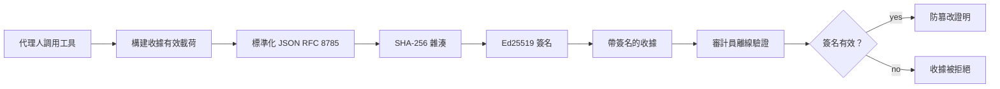
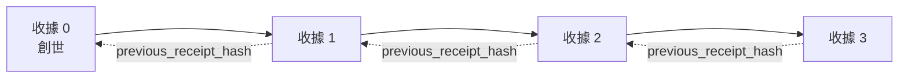

[觀看課程視頻：使用加密收執保障 AI 代理](https://youtu.be/PLACEHOLDER_VIDEO_ID)

> _(課程視頻及縮圖將由 Microsoft 內容團隊在合併後添加，符合第 14 / 15 課的模式。)_

# 使用加密收執保障 AI 代理

## 簡介

本課程將涵蓋：

- AI 代理審計軌跡為合規、除錯與信任重要的原因。
- 什麼是加密收執，以及它如何不同於未簽名的日誌行。
- 如何用純 Python 產生代理工具呼叫的簽名收執。
- 如何離線驗證收執及偵測篡改。
- 如何鏈接收執以致刪除或重新排序其中一筆會破壞整條鏈。
- 收執能證明什麼，及明確不證明什麼。

## 學習目標

完成本課程後，您將會知道如何：

- 識別促使代理行動加密來源的失效模式。
- 對標準化 JSON 載荷產生 Ed25519 簽名收執。
- 僅使用簽署者的公鑰獨立驗證收執。
- 透過重新驗證被修改的收執來偵測篡改。
- 建立收執的雜湊鏈序列並說明鏈條重要性。
- 辨明收執所證明（歸屬、完整性、排序）與不證明（行動正確性、政策正確性）之間的界限。

## 問題：您的代理審計軌跡

想像您為 Contoso Travel 部署了一個 AI 代理。該代理讀取客戶要求，呼叫航班 API 查詢選項，並代表客戶預訂座位。上個季度，該代理處理了 50,000 筆訂位。

今天來了一位稽核員。他們問一個簡單問題：「給我看您的代理做了什麼。」

您交出日誌檔案。稽核員閱讀後問更難的問題：「我怎麼知道這些日誌沒有被修改？」

這就是審計軌跡問題。當前多數代理部署依賴：

- <strong>應用程式日誌</strong>：由代理自身撰寫，任何有檔案系統存取權者可修改。
- <strong>雲端日誌服務</strong>：平台層面防篡改但需稽核員信任平台營運者。
- <strong>資料庫交易日誌</strong>：適合資料庫變更，不適用於任意工具呼叫。

這些方法皆需稽核員信任某人（您、您的雲端供應商、您的資料庫廠商），對於內部使用通常可接受，但對監管工作負載（金融、醫療、受歐盟 AI 法規約束者）則不行。

加密收執藉由讓每個代理行動可獨立驗證解決了這個問題。稽核員不需信任您，只需有您的公鑰和收執本身。

## 什麼是加密收執？

收執是一個 JSON 物件，錄製代理所做的事，並以數位簽章簽署。


  
最簡版本的收執如下：

```json
{
  "type": "agent.tool_call.v1",
  "agent_id": "contoso-travel-bot",
  "tool_name": "lookup_flights",
  "tool_args_hash": "sha256:a3f9c1...",
  "result_hash": "sha256:7b2e1d...",
  "policy_id": "contoso-travel-policy-v3",
  "timestamp": "2026-04-25T14:30:00Z",
  "sequence": 47,
  "previous_receipt_hash": "sha256:9d4e6a...",
  "signature": {
    "alg": "EdDSA",
    "sig": "c5af83...",
    "public_key": "8f3b2c..."
  }
}
```
  
三個屬性在發揮作用：

1. <strong>簽名</strong>。收執由代理閘道使用 Ed25519 私鑰簽署。任何擁有相對應公鑰者皆可離線驗證簽名。任一欄位被篡改，簽名即不成立。

2. <strong>標準化編碼</strong>。簽署前，收執以 JSON 標準化方案 (JCS, RFC 8785) 序列化。此舉確保不同實作產生相同邏輯收執時，輸出位元組完全相同。若無標準化，不同 JSON 序列化器對相同內容會產生不同簽名。

3. <strong>雜湊鏈接</strong>。`previous_receipt_hash` 欄位將每條收執串接到前一條。刪除或重新排序收執會破壞後續收執。即使繞過了單筆簽名，鏈條層級仍能見證篡改。

這些屬性合而為一，提供三種保證：

- <strong>歸屬</strong>：此金鑰簽署了此內容。
- <strong>完整性</strong>：內容自簽署後未被更改。
- <strong>排序</strong>：此收執於鏈中在該收執之後。

## 用 Python 產生收執

不需特殊函式庫即可產生收執。加密基礎構件廣泛可得，邏輯只要幾十行 Python。

`code_samples/18-signed-receipts.ipynb` 中的實作演練示範完整流程，摘要版本：

```python
import json
import hashlib
import base64
from nacl import signing
from jcs import canonicalize  # RFC 8785 規範化 JSON

def b64url_nopad(data: bytes) -> str:
    return base64.urlsafe_b64encode(data).decode("ascii").rstrip("=")

def sha256_canonical(obj) -> str:
    """SHA-256 of a Python object's JCS-canonical JSON form."""
    return f"sha256:{hashlib.sha256(canonicalize(obj)).hexdigest()}"

# 產生或載入簽署密鑰（生產環境中，存放於金鑰保管庫）
signing_key = signing.SigningKey.generate()
verify_key = signing_key.verify_key

# 建立收據內容（尚未簽署）
tool_args = {"origin": "SYD", "destination": "LAX"}
tool_result = [{"flight": "QF11", "price": 1850, "stops": 0}]

payload = {
    "type": "agent.tool_call.v1",
    "agent_id": "contoso-travel-bot",
    "tool_name": "lookup_flights",
    "tool_args_hash": sha256_canonical(tool_args),
    "result_hash": sha256_canonical(tool_result),
    "policy_id": "contoso-travel-policy-v3",
    "timestamp": "2026-04-25T14:30:00Z",
    "sequence": 0,
    "previous_receipt_hash": None,
}

# 規範化、雜湊、簽署。
canonical_bytes = canonicalize(payload)
message_hash = hashlib.sha256(canonical_bytes).digest()
signature_bytes = signing_key.sign(message_hash).signature

# 附加結構化簽署物件。
receipt = {
    **payload,
    "signature": {
        "alg": "EdDSA",
        "sig": b64url_nopad(signature_bytes),
        "public_key": b64url_nopad(bytes(verify_key)),
    },
}
```
  
這即為全部簽署流程。筆記本練習逐步帶您走過每個步驟。

## 驗證收執及偵測篡改

驗證為逆向操作：

```python
import base64
import hashlib
from nacl import signing
from nacl.exceptions import BadSignatureError
from jcs import canonicalize

def b64url_decode(s: str) -> bytes:
    padding = "=" * ((4 - len(s) % 4) % 4)
    return base64.urlsafe_b64decode(s + padding)

def verify_receipt(receipt: dict) -> bool:
    # 簽名是一個結構化的物件：{"alg", "sig", "public_key"}。
    sig_obj = receipt.get("signature")
    if not sig_obj or sig_obj.get("alg") != "EdDSA":
        return False

    # 重建實際被簽署的有效載荷（除了簽名之外的所有內容）。
    payload = {k: v for k, v in receipt.items() if k != "signature"}

    canonical_bytes = canonicalize(payload)
    message_hash = hashlib.sha256(canonical_bytes).digest()

    try:
        verify_key = signing.VerifyKey(b64url_decode(sig_obj["public_key"]))
        verify_key.verify(message_hash, b64url_decode(sig_obj["sig"]))
        return True
    except BadSignatureError:
        return False
```
  
此函數接收收執，若簽名有效回傳 `True`，否則回傳 `False`。無須網路呼叫，無服務依賴，也不需信任任何第三方。

演練中以以下步驟展示篡改偵測：

1. 產生有效收執並確認驗證通過。  
2. 修改 `tool_args_hash` 字段的一個 byte。  
3. 重新執行驗證，發現驗證失敗。

這是收執防篡改的實際演示：任何細微修改皆會破壞簽名。

## 為多步驟代理鏈接收執

單一簽名收執保護單一行動。收執鏈保護行動序列。


  
每個收執記錄前一收執的雜湊。竊賊若想在鏈中間悄悄刪除收執 2，只能：

- 修改收執 3 的 `previous_receipt_hash` 欄位（破壞收執 3 簽名），或  
- 偽造收執 3 的新簽名（需代理私鑰）。

若私鑰存於硬體金鑰保管庫且您與每份收執一同公開公鑰，則不論哪種攻擊皆難以隱藏且會被察覺。

筆記本引導您：

1. 建立三筆收執鏈。  
2. 驗證每筆收執的 `previous_receipt_hash` 是否符合前一收執的真正雜湊。  
3. 違法修改中間某筆收執並觀察鏈條於該點中斷。

此即外部稽核員可獨立驗證且不需信任您的審計軌跡建立法。

## 收執證明了什麼（不證明什麼）

本節是本課程最重要部分。收執強大但力量有限。

**收執證明三件事：**

1. <strong>歸屬</strong>：指定位金鑰簽署了特定載荷。  
2. <strong>完整性</strong>：載荷自簽署後未更動。  
3. <strong>排序</strong>：收執在雜湊鏈中於該收執之後。

**收執不證明：**

1. <strong>正確性</strong>：代理行動是否正確。無論答案正確或錯誤，收執簽署流程相同。  
2. <strong>政策遵循</strong>：`policy_id` 所稱政策是否實際評估過，或即使評估是否允許此行動。收執只記錄宣稱內容，非執行結果。  
3. <strong>超越金鑰的身份</strong>：收執表示「此金鑰簽署此內容」，不表示「這個人類授權」。將金鑰映射至個人或組織需獨立身份基建（目錄、公鑰註冊等）。  
4. <strong>輸入真實性</strong>：若代理接收到被操控的提示並依此行動，收執忠實記錄行動。收執是輸入驗證的下游，不是替代。

此界限重要因兩點：

- 清楚告訴您收執的用途：使代理行為可審核且防篡改，甚至跨組織皆然。  
- 指出您仍須的額外層級：輸入驗證（第 6 課）、政策執行（以下簡述）、身份基建（本課不涉）。

常見錯誤是誤認「有收執」即代表「被治理」。事實不然，收執是基礎，治理是您建立其上的系統。

## 生產環境參考

本課程示範的 Python 程式碼故意簡化，以便您每行都看得懂，了解細節。生產環境有兩種選擇：

1. **直接基於加密原語建構。** 上述 50 行程式碼足以應付多數用途。PyNaCl（Ed25519）及 `jcs` 套件（標準化 JSON）皆是維護良好且經過審核的函式庫。

2. **使用生產用收執函式庫。** 數個開源專案實作相同模式並增添功能（密鑰輪替、批次驗證、JWK 集合分發、策略引擎整合）：  
   - 本課收執格式遵循目前處理標準的 IETF 草案 (`draft-farley-acta-signed-receipts`)。  
   - Microsoft Agent Governance Toolkit 將收執結合 Cedar 政策決策；詳見該專案下教學 33 節的端到端範例。  
   - `protect-mcp` (npm) 與 `@veritasacta/verify` (npm) 提供 Node 平台的收執簽名及離線驗證適用函式庫，方便給 MCP 伺服器添加防篡改稽核軌跡。  
   - **[nobulex](https://github.com/arian-gogani/nobulex)** Python SDK (`pip install nobulex`) 提供同樣的 Ed25519 + JCS 簽名模式，具備 LangChain 及 CrewAI 整合，含已發布的交叉驗證測試向量及經由 [OWASP PR #2210](https://github.com/OWASP/CheatSheetSeries/pull/2210) 提供的合規對應。

自行實作與函式庫兩者選擇，有如自己寫 JWT 函式庫或使用已有函式庫：均合理，函式庫節省時間並減少審核面向，而自行撰寫強迫您理解每個原語。本課程教您自行撰寫路徑，為任何選擇奠定基礎。

## 知識測驗

在進行實作前，先測試理解。

**1. 收執用代理私鑰 Ed25519 簽署，但稽核員只有公鑰。稽核員能離線驗證收執嗎？**

<details>
<summary>答案</summary>

能。Ed25519 驗證只需公鑰與簽署位元組，無須網路呼叫與第三方服務依賴。此特性使收執在隔離、跨組織或低信任稽核環境中有用。
</details>

**2. 攻擊者修改收執的 `policy_id` 欄位，宣稱受較寬鬆的政策管轄，但簽名是對原始載荷計算的。驗證會如何？**

<details>
<summary>答案</summary>

驗證失敗。簽名是對標準化的原始載荷位元組計算；任何欄位更動都改變標準化結果，進而改變 SHA-256 雜湊值，使簽名無效。攻擊者若無私鑰，無法重新產生有效簽名。
</details>

**3. 收執為何包 `tool_args_hash` 和 `result_hash`，而非原始參數與結果？**

<details>
<summary>答案</summary>

兩點原因。第一，收執可能需被存檔或在環境中傳輸，洩漏原始內容（個人識別資訊、商業資料）有問題。雜湊保持收執體積小且內容私密；稽核員驗證雜湊對應獨立存放的實際內容。第二，雜湊大小固定；有雜湊的收執大小受限，不論輸入輸出多大。
</details>

**4. `previous_receipt_hash` 將每份收執連結至前一份。若攻擊者在鏈中間悄悄刪除一份收執，什麼失效？**

<details>
<summary>答案</summary>

後續每份收執失效。因它們的 `previous_receipt_hash` 不再匹配實際鏈（因所連結的收執已不存在或鏈接至不同前驅）。若要隱藏刪除，攻擊者得重新簽署所有後續收執，須有私鑰。
</details>

**5. 收執驗證通過，是否證明代理行動正確、合理且遵循政策？**

<details>
<summary>答案</summary>

否。有效收執證明三件事：歸屬（此金鑰簽署此內容）、完整性（內容未更動）與排序（此收執在鏈中排後）。它不證明行動正確，名列 `policy_id` 的政策是否實際評估，或代理是否遵從所有規則。收執使代理行為可審核，不必然代表正確。這是本課最重要界限。
</details>

## 實作練習

開啟 `code_samples/18-signed-receipts.ipynb` 完成四個部分：

1. <strong>第一部分</strong>：簽署首份收執並驗證。  
2. <strong>第二部分</strong>：竄改收執並觀察驗證失敗。  
3. <strong>第三部分</strong>：建立三份收執鏈並驗證鏈條完整性。  
4. <strong>第四部分</strong>：將模式應用於使用 Microsoft Agent Framework 建立的代理：將工具呼叫包裝進收執簽署，然後獨立驗證收執。
**進階挑戰 1：** 擴展收據結構，新增一個自選的欄位（例如，用於追蹤的請求 ID），更新標準簽名邏輯以包含該欄位，並確認收據仍能通過驗證的來回轉換。然後在簽名後修改該欄位，並確認驗證失敗。這將迫使你理解標準編碼的每一個位元組如何貢獻於簽名。

**進階挑戰 2：** 將你的兩張收據以 SHA-256 連結雜湊（以確定性順序串接它們的標準位元組）並將所得的摘要作為一個新欄位加到第三張收據上，再進行簽名。驗證這三張收據仍然能通過來回轉換。這即是你剛建造了一步包含證明：持有第三張收據的人可以證明前兩張存在於簽署當時，且無需揭露它們的內容。此模式即為可選披露收據在大規模中使用的模式（Merkle 承諾，RFC 6962）。

## 總結

加密收據為 AI 代理提供一條審計軌跡，具備：

- <strong>獨立可驗證性</strong>：任何持有公鑰者皆可驗證，無需依賴服務。
- <strong>防篡改</strong>：任何修改都會使簽名失效。
- <strong>可攜性</strong>：收據是一個小型 JSON 檔案，可被存檔、傳輸及於任何地方驗證。
- <strong>標準對齊</strong>：基於 Ed25519 (RFC 8032)、JCS (RFC 8785) 和 SHA-256，皆為廣泛部署的基本元件。

它們並非替代輸入驗證、政策強制或身份基礎設施，而是這些層的基礎。當你將代理部署於受監管的運行負載、多組織工作流，或任何未來審計者無法被假設信任你的環境中，收據即是你使審計軌跡誠實的手段。

最重要的帶走訊息：收據證明「誰在何時說了什麼」，但不證明所述內容為真實或正確。務必嚴守此區別。這是誠實來源系統和誤導性系統之間的差異。

## 生產檢查清單

當你準備從本課程升級到在真實環境部署簽署收據的代理時：

- [ ] **將簽名金鑰移出開發者筆電。** 使用 Azure Key Vault、AWS KMS 或硬體安全模組。簽署收據的私鑰絕不應存在版本控制或應用機器的純文字中。
- [ ] **公開驗證公鑰。** 審計者需線下驗證。標準作法是將 JWK 集合放在公開知名 URL（RFC 7517），例如 `https://your-org.example.com/.well-known/agent-keys.json`。
- [ ] **外部固定鏈頭。** 定期將最新鏈頭雜湊寫入透明度日誌（Sigstore Rekor、RFC 3161 時間戳機構，或第二個內部系統），讓外部方可確認「此鏈於此時存在」。
- [ ] **不可變存儲收據。** 附加式 Blob 儲存（Azure Storage 的不可變策略、AWS S3 物件鎖）可防止內部人員於儲存層重寫歷史。
- [ ] **決定保存期限。** 許多合規制度要求多年保存。規劃收據增長量（每張約 500 字節；一個每天產生 10K 呼叫的代理每年約產生 1.8 GB）。
- [ ] **文件說明收據不涵蓋的事項。** 收據證明歸屬性、完整性及排序。你的運行手冊應明確列出額外控管（輸入驗證、政策執行、速率限制、身份基礎設施）與收據一同構成治理態勢。

### 對保障 AI 代理安全還有更多問題？

加入 [Microsoft Foundry Discord](https://aka.ms/ai-agents/discord)，與其他學習者會面、參加問答時段，並獲得 AI 代理相關問題解答。

## 課程之外

本課程涵蓋了單一收據簽署和雜湊鏈序列。相同的基元可組合為更先進的樣式，隨著治理態勢成熟你可能會遇見：

- **選擇性揭露。** 當收據欄位獨立承諾（RFC 6962 式 Merkle 樹）時，可針對特定審計者揭露特定欄位，並證明其餘未改動，且不暴露它們。當同一收據需同時滿足完整性審計（要求全面性）及像 GDPR 的資料最小化規範（審計者只看必要部分）時此非常有用。
- **收據撤銷。** 若簽署金鑰遭竄改，需要方法標示該金鑰自某時起所簽所有收據皆不信任。標準模式為短期簽署金鑰加上已公布的撤銷清單，或含撤銷條目之透明度日誌。
- **雙方/分割簽署收據。** 有些實作將簽署負載拆為執行前（`authorization_*`）與執行後（`result_*`）兩半，獨立簽名。當授權決策與觀察結果由不同角色或時間產生尤其有效。此模式可疊加本課教的收據格式。
- **負載組合。** 收據封存的是你放入 `result_hash` 的位元組。真實負載往往比單一工具呼叫結果豐富：預決策推理（模型預測、考慮選項、證據與完整度、風險態勢、責任鏈、守門結果）皆可置入負載，由單一收據封存。這保持收據格式簡潔，同時讓負載結構可按領域演進。
- **跨實作相容性。** 多個獨立實作（Python、TypeScript、Rust、Go）針對同格式收據使用共享測試向量相互驗證。若自行打造實作，比對已公布的測試向量可確認線路相容性。
- **後量子遷移。** Ed25519 現今廣泛部署，但不抗量子攻擊。收據格式為演算法協調式：`signature.alg` 欄位可載入 `ML-DSA-65`（NIST 後量子簽名標準）以便遷移。規劃一段收據雙重簽名的過渡期。

## 相關資源

- <a href="https://datatracker.ietf.org/doc/draft-farley-acta-signed-receipts/" target="_blank">IETF 互聯網草案：用於機器對機器存取控制的簽署決策收據</a>
- <a href="https://learn.microsoft.com/azure/ai-studio/responsible-use-of-ai-overview" target="_blank">負責任 AI 概述（Azure AI）</a>
- <a href="https://datatracker.ietf.org/doc/html/rfc8032" target="_blank">RFC 8032：Edwards 曲線數位簽名算法 (EdDSA)</a>
- <a href="https://datatracker.ietf.org/doc/html/rfc8785" target="_blank">RFC 8785：JSON 標準化方案 (JCS)</a>
- <a href="https://datatracker.ietf.org/doc/html/rfc6962" target="_blank">RFC 6962：憑證透明度</a>（選擇性揭露收據使用的 Merkle 樹構造法）
- <a href="https://github.com/microsoft/agent-governance-toolkit/blob/main/docs/tutorials/33-offline-verifiable-receipts.md" target="_blank">Microsoft Agent Governance Toolkit，教學 33：離線可驗證決策收據</a>
- <a href="https://github.com/ScopeBlind/agent-governance-testvectors" target="_blank">本課程使用的收據格式跨實作相容測試向量</a>（Apache-2.0 授權）
- <a href="https://pynacl.readthedocs.io/" target="_blank">PyNaCl 文件</a>（Python 中的 Ed25519）

## 上一課

[建立電腦使用代理 (CUA)](../15-browser-use/README.md)

## 下一課

_(由課程維護者決定)_

---

<!-- CO-OP TRANSLATOR DISCLAIMER START -->
**免責聲明**：
本文件使用 AI 翻譯服務 [Co-op Translator](https://github.com/Azure/co-op-translator) 進行翻譯。雖然我們力求準確，但請注意，自動翻譯可能包含錯誤或不準確之處。原始文件的母語版本應被視為權威來源。對於重要資訊，建議尋求專業人工翻譯。我們不對因使用本翻譯而引起的任何誤解或曲解承擔責任。
<!-- CO-OP TRANSLATOR DISCLAIMER END -->