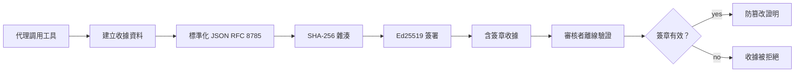
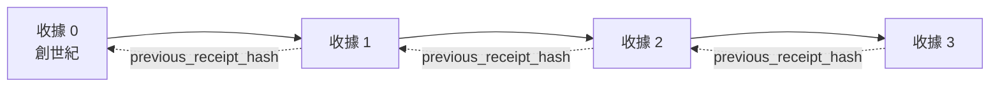

[觀看課程影片：使用密碼學收據保護 AI 代理](https://youtu.be/PLACEHOLDER_VIDEO_ID)

> _(課程影片和縮圖將由微軟內容團隊在合併後新增，符合課程第14 / 15課的模式。)_

# 使用密碼學收據保護 AI 代理

## 介紹

本課程將涵蓋：

- 為何 AI 代理的審計追蹤對合規性、除錯及信任至關重要。
- 什麼是密碼學收據以及它如何不同於未簽名的日誌行。
- 如何用純 Python 產生代理工具呼叫的簽署收據。
- 如何離線驗證收據並偵測竄改。
- 如何串連收據，使移除或重新排序任何一筆會破壞整條鏈。
- 收據所能證明的與明確無法證明的事項。

## 學習目標

完成本課程後，你將能夠：

- 辨識促使代理行動使用密碼學溯源的失敗模式。
- 根據標準 JSON 負載產生 Ed25519 簽署的收據。
- 僅使用簽署者的公鑰獨立驗證收據。
- 透過重新執行驗證對修改過的收據偵測竄改。
- 建立雜湊鏈式收據序列並解釋此鏈條的重要性。
- 辨識收據能證明的範圍（歸屬、完整性、排序）與不能證明的（行動正確性、政策合理性）之間的界線。

## 問題：代理的審計追蹤

想像你為 Contoso Travel 部署了一個 AI 代理。該代理閱讀客戶請求，呼叫航班 API 查詢選項，並代表客戶預訂座位。上季度代理處理了 50,000 筆預訂。

今天有審計員到訪。他們提出一個簡單問題：「告訴我你的代理做了什麼。」

你交出日誌檔案。審計員看了之後提出更棘手的問題：「我怎麼知道這些日誌沒有被編輯過？」

這就是審計追蹤的問題。目前多數代理部署依賴：

- <strong>應用程式日誌</strong>：代理本身撰寫，擁有檔案系統存取權限的人都可編輯。
- <strong>雲端記錄服務</strong>：平台層級可偵測竄改，但前提是審計員信任平台營運商。
- <strong>資料庫交易日誌</strong>：適合記錄資料庫變更，但不適用於任意工具呼叫。

這些方法都無法在不要求審計員信任某人（你、你的雲端供應商、你的資料庫廠商）的前提下回應問題。對內部使用，這種信任通常可接受，但對受規範工作負載（金融、醫療、任何須遵守歐盟 AI 法案者）則不然。

密碼學收據透過讓每個代理行動可獨立驗證來解決此問題。審計員不需信任你，他們只需你的公鑰和收據本身。

## 什麼是密碼學收據？

收據是一個 JSON 物件，記錄代理的行為，並使用數位簽章簽署。



一個最簡收據示例如下：

```json
{
  "type": "agent.tool_call.v1",
  "agent_id": "contoso-travel-bot",
  "tool_name": "lookup_flights",
  "tool_args_hash": "sha256:a3f9c1...",
  "result_hash": "sha256:7b2e1d...",
  "policy_id": "contoso-travel-policy-v3",
  "timestamp": "2026-04-25T14:30:00Z",
  "sequence": 47,
  "previous_receipt_hash": "sha256:9d4e6a...",
  "signature": {
    "alg": "EdDSA",
    "sig": "c5af83...",
    "public_key": "8f3b2c..."
  }
}
```

三個屬性發揮作用：

1. <strong>簽章</strong>。收據由代理閘道使用 Ed25519 私鑰簽署。任何擁有對應公鑰的人都能離線驗證簽章。任何欄位竄改都會使簽章失效。

2. <strong>標準編碼</strong>。簽章前，收據使用 JSON 標準化方案（JCS，RFC 8785）序列化。此方式確保不同實作產生相同邏輯收據會產出位元完全相同的資料。無標準化時，不同的 JSON 序列化器會產生不同簽章。

3. <strong>雜湊鏈</strong>。`previous_receipt_hash` 欄位將每筆收據串連到前一筆。移除或重新排列收據會破壞後續所有收據。即使個別簽章被繞過，竄改仍會在鏈條層級顯露。

這些屬性共同提供三大保證：

- <strong>歸屬性</strong>：此金鑰簽署了這份內容。
- <strong>完整性</strong>：自簽署後內容未被更改。
- <strong>順序性</strong>：此收據在鏈條中位於該收據之後。

## 在 Python 中產生收據

你不需要特別的函式庫來產生收據。密碼學基元廣泛可用，邏輯只需幾十行 Python。

`code_samples/18-signed-receipts.ipynb` 的實作練習會引導完整流程。以下是摘要版：

```python
import json
import hashlib
import base64
from nacl import signing
from jcs import canonicalize  # RFC 8785 標準 JSON

def b64url_nopad(data: bytes) -> str:
    return base64.urlsafe_b64encode(data).decode("ascii").rstrip("=")

def sha256_canonical(obj) -> str:
    """SHA-256 of a Python object's JCS-canonical JSON form."""
    return f"sha256:{hashlib.sha256(canonicalize(obj)).hexdigest()}"

# 產生或載入簽署金鑰（生產環境中存放於金鑰庫）
signing_key = signing.SigningKey.generate()
verify_key = signing_key.verify_key

# 建立收據載荷（尚未簽名）
tool_args = {"origin": "SYD", "destination": "LAX"}
tool_result = [{"flight": "QF11", "price": 1850, "stops": 0}]

payload = {
    "type": "agent.tool_call.v1",
    "agent_id": "contoso-travel-bot",
    "tool_name": "lookup_flights",
    "tool_args_hash": sha256_canonical(tool_args),
    "result_hash": sha256_canonical(tool_result),
    "policy_id": "contoso-travel-policy-v3",
    "timestamp": "2026-04-25T14:30:00Z",
    "sequence": 0,
    "previous_receipt_hash": None,
}

# 標準化、雜湊、簽署。
canonical_bytes = canonicalize(payload)
message_hash = hashlib.sha256(canonical_bytes).digest()
signature_bytes = signing_key.sign(message_hash).signature

# 附上結構化簽名物件。
receipt = {
    **payload,
    "signature": {
        "alg": "EdDSA",
        "sig": b64url_nopad(signature_bytes),
        "public_key": b64url_nopad(bytes(verify_key)),
    },
}
```

這就是整個簽署流程。筆記本中的練習會帶你逐步執行。

## 驗證收據與偵測竄改

驗證為反向操作：

```python
import base64
import hashlib
from nacl import signing
from nacl.exceptions import BadSignatureError
from jcs import canonicalize

def b64url_decode(s: str) -> bytes:
    padding = "=" * ((4 - len(s) % 4) % 4)
    return base64.urlsafe_b64decode(s + padding)

def verify_receipt(receipt: dict) -> bool:
    # 簽名是一個結構化物件：{"alg", "sig", "public_key"}。
    sig_obj = receipt.get("signature")
    if not sig_obj or sig_obj.get("alg") != "EdDSA":
        return False

    # 重新構建實際被簽署的有效載荷（除簽名外的所有內容）。
    payload = {k: v for k, v in receipt.items() if k != "signature"}

    canonical_bytes = canonicalize(payload)
    message_hash = hashlib.sha256(canonical_bytes).digest()

    try:
        verify_key = signing.VerifyKey(b64url_decode(sig_obj["public_key"]))
        verify_key.verify(message_hash, b64url_decode(sig_obj["sig"]))
        return True
    except BadSignatureError:
        return False
```

此函式輸入收據，簽章有效時回傳 `True`，否則回傳 `False`。無需網路呼叫、無服務依賴，也不需信任第三方。

透過筆記本演示，你可見識竄改偵測：

1. 產生有效收據，確認驗證通過。
2. 修改 `tool_args_hash` 欄位的一個位元組。
3. 再次驗證，驗證失敗。

這是實務示範，證明收據具備竄改可偵測性：任意小變動都會破壞簽章。

## 多步代理的收據鏈

單筆簽署收據保護一個行動。收據鏈則保護一系列行動。



每筆收據記錄前一筆收據的雜湊。若攻擊者想無聲刪除第 2 筆收據，需滿足：

- 修改第 3 筆收據的 `previous_receipt_hash` 欄位（破壞第 3 筆收據的簽章），或
- 偽造修改過的第 3 筆收據的新簽章（需代理私鑰）。

若私鑰保存在硬體金鑰庫，且你隨每份收據發布公鑰，兩種攻擊都不可能在未被偵測下成功。

筆記本引導你：

1. 建構三筆收據的鏈條。
2. 驗證每筆收據的 `previous_receipt_hash` 是否與前一筆收據計算出的雜湊匹配。
3. 中間一筆收據遭竄改，鏈條破裂正確現形。

這就是如何產生讓外部審計員可驗證且不需信任你的審計追蹤。

## 收據能證明（與無法證明）之事

這是本課程最重要章節。收據很強大，但其效力有界。

**收據能證明三件事：**

1. <strong>歸屬性</strong>：特定金鑰簽署了特定資料。
2. <strong>完整性</strong>：資料自簽署後未被更動。
3. <strong>順序性</strong>：此收據在雜湊鏈中位於該收據之後。

**收據無法證明：**

1. <strong>正確性</strong>：代理的行動是否正確。收據可為錯誤答案簽署，如同正確答案。
2. <strong>政策遵從</strong>：`policy_id` 指涉政策是否真的被評估，或若評估是否准許此行動。收據記錄的是聲稱，不是強制執行。
3. <strong>金鑰之外的身分</strong>：收據表示「此金鑰簽署此內容」，不代表「此人授權」。將金鑰與人或組織連結需另外的身分基礎架構（目錄、公鑰登記等）。
4. <strong>輸入真實性</strong>：若代理接到經操控的提示並執行，收據忠實記錄執行的行動。收據是輸入驗證之後的產物，不是替代品。

此界線重要因兩點：

- 它告訴你收據的用途：讓代理行為可審計且可偵測竄改，即便跨組織邊界。
- 它告訴你還需什麼額外層次：輸入驗證（第6課）、政策執行（後述）、身分基礎架構（本課未涵蓋）。

常見誤解是「有收據代表受治理」。事實非然。收據是基石，治理是你建構於其上的系統。

## 產品參考

本課程 Python 程式碼刻意精簡，讓你讀懂每行的運作。實務上，你有兩個選擇：

1. **直接使用密碼學基元。** 上述約 50 行可滿足多數用例。PyNaCl（Ed25519）與 `jcs` 套件（標準化 JSON）皆為維護良好且經審計的函式庫。

2. **使用生產級收據函式庫。** 若干開源專案提供相同模式並具額外特性（密鑰輪替、批次驗證、JWK 集分發、與政策引擎整合）：
   - 本課所用收據格式遵循 IETF 網際網路草案（`draft-farley-acta-signed-receipts`），目前處於標準制訂中。
   - 微軟代理治理工具包結合 Cedar 政策決策與收據；該套件第 33 個教學有端對端範例。
   - `protect-mcp`（npm）與 `@veritasacta/verify`（npm）為基於 Node 的收據簽署與離線驗證實作，適用於為 MCP 伺服器包裝可偵測竄改審計追蹤。

自行實作與使用函式庫的抉擇如同自寫 JWT 函式庫與用現成一樣：兩者皆合理；函式庫節省時間並降低審計範圍；自行實作可理解每個基元。本課提供自行實作路徑，讓你兩種選擇都打下基礎。

## 知識檢測

開始練習前測試你的理解。

**1. 收據由代理的 Ed25519 私鑰簽署。審計員只有公鑰。審計員可離線驗證收據嗎？**

<details>
<summary>答案</summary>

可以。Ed25519 驗證只需公鑰與被簽字節。無需網路呼叫或服務依賴。此特性使收據在孤立、跨組織或低信任審計環境中極具價值。
</details>

**2. 攻擊者修改收據中 `policy_id` 欄位，宣稱受一個較寬鬆政策管控。簽章基於原始負載。驗證時會發生什麼？**

<details>
<summary>答案</summary>

驗證會失敗。簽章針對經過標準化的原始負載計算；修改任欄位會改變標準化字節序列、SHA-256 雜湊，導致簽章失效。攻擊者需擁有私鑰才能重新簽署，但並無此私鑰。
</details>

**3. 為何收據包含 `tool_args_hash` 和 `result_hash`，而非原始參數與結果？**

<details>
<summary>答案</summary>

有兩個理由。第一，收據可能須在可能洩露原始內容（個資、商業資料）的環境中保存或傳輸。使用雜湊可使收據體積小且內容私密；審計員驗證雜湊與另存原件匹配。第二，雜湊具固定大小，不論輸入或輸出多大，收據大小都被限制。
</details>

**4. `previous_receipt_hash` 欄將每筆收據連結到前一筆。若攻擊者悄悄刪除鏈中間的收據，會造成什麼失效？**

<details>
<summary>答案</summary>

被刪除收據後的所有收據將失效。它們的 `previous_receipt_hash` 不再匹配實際連鎖（因為被引用的收據不存在，或鏈指向不同前序）。攻擊者若要隱藏刪除，必須重新簽署所有後續收據，需私鑰才行。
</details>

**5. 收據驗證通過。這是否證明代理行動正確、合理或遵守政策？**

<details>
<summary>答案</summary>

否。有效收據證明三件事：歸屬（此金鑰簽署此內容）、完整性（內容未變）、順序（此收據在該收據之後）。它不證明行動正確、`policy_id` 指定政策有被評估、或代理是否遵守所有規則。收據讓代理行為可審計，但不保證正確。這是本課最重要的界線。
</details>

## 實作練習

打開 `code_samples/18-signed-receipts.ipynb`，完成全部四個部分：

1. **第1部分**：簽署你的第一份收據並驗證。
2. **第2部分**：竄改收據並觀察驗證失敗。
3. **第3部分**：建立三份收據鏈並驗證鏈完整性。
4. **第4部分**：將此模式應用於使用微軟代理框架的代理：在工具呼叫中包裝收據簽署，接著獨立驗證收據。

**進階挑戰1:** 擴充收據結構，新增自訂欄位（例如追蹤用請求 ID），更新標準簽署邏輯包含此欄，並確認收據可成功驗證。簽章後修改欄位並確認驗證失敗。此挑戰強迫你理解標準化編碼每個位元如何影響簽章。
**挑戰進階 2：** 將你的兩張收據進行 SHA-256 雜湊（以確定性順序串接它們的正規位元組），並將所得的摘要作為新欄位嵌入第三張收據中，再對其進行簽署。驗證三張收據都仍能完整來回轉換。你剛建立了一步式包含證明：持有第三張收據的任何人都能證明前兩張存在於簽署時刻，而無需揭露其內容。這就是選擇性揭露收據在大規模下使用的模式（Merkle 承諾，RFC 6962）。

## 結論

密碼學收據給 AI 代理提供了一條：

- <strong>獨立可驗證</strong>：任何持有公鑰方都可驗證，無需依賴服務。
- <strong>防篡改</strong>：任何修改都使簽章無效。
- <strong>可攜帶</strong>：收據是小型 JSON 檔案；可任意儲存、傳輸與驗證。
- <strong>標準依循</strong>：建立於 Ed25519（RFC 8032）、JCS（RFC 8785）及 SHA-256，皆是廣泛部署的基元。

它們並非輸入驗證、政策執行或身份基礎架構的替代品，而是這些層面的基石。當你將代理部署於受管制的工作負載、多組織工作流或任何未能假設未來稽核者會信任你的情境中，收據就是你讓稽核軌跡誠實無偽的方法。

最重要的重點：收據證明誰何時說了什麼，但並不證明所述內容真實或正確。務必嚴格區分此點。這是誠實溯源系統與誤導系統的差別。

## 生產檢查清單

當你準備好從本課程升級至真實環境部署簽署收據的代理時：

- [ ] **將簽署金鑰移出開發者筆電。** 使用 Azure Key Vault、AWS KMS 或硬體安全模組。用來簽署收據的私鑰絕不可存於原始碼管理或以純文字形式存在應用主機上。
- [ ] **公開驗證用公鑰。** 稽核者離線驗證時需要。標準做法是在眾所皆知的網址設置 JWK Set（RFC 7517），例如 `https://your-org.example.com/.well-known/agent-keys.json`。
- [ ] **外部錨定鏈頭。** 定期將最新鏈頭雜湊寫入透明度日誌（Sigstore Rekor、RFC 3161 時戳權威或第二個內部系統），使外部方可確認「此鏈於此時存在」。
- [ ] **不可變存儲收據。** 附加式 Blob 儲存（Azure Storage 具不可變政策、AWS S3 Object Lock）防止內部人士在儲存層面改寫歷史。
- [ ] **決定保留期限。** 許多合規制度要求多年度保留。規劃收據成長量（每張約 500 bytes；代理每日呼叫一萬次，年間約 1.8 GB）。
- [ ] **記錄收據不涵蓋項目。** 收據證明歸屬、完整性及排序。你的操作手冊應明確列出輔助收據的其他控管（輸入驗證、政策執行、頻率限制、身份基礎架構），作為治理姿態的一部分。

### 想要進一步瞭解如何保障 AI 代理的安全嗎？

加入 [Microsoft Foundry Discord](https://aka.ms/ai-agents/discord)，和其他學習者交流，參加問答時間，並獲得 AI 代理相關問題解答。

## 課程之外

本課涵蓋單一收據簽署及雜湊鏈序列。相同基元可以組合成隨著治理姿態成熟你可能遇到的更高階模式：

- **選擇性揭露。** 當收據欄位獨立承諾（RFC 6962 風格 Merkle 樹）時，你可以向特定稽核者揭露特定欄位，並證明其他欄位未變更而不泄露它們。適用於同一收據需同時滿足全面稽核（要求完整性）與資料最小化法令如 GDPR（稽核者只看到必要的訊息）。
- **收據撤銷。** 若簽署金鑰遭駭，需要有機制標記該金鑰簽署的收據自某時起不再信任。標準做法是短期簽署金鑰加上公布的撤銷清單，或有撤銷條目之透明度日誌。
- **雙邊／分割簽章收據。** 部分實作將簽署有效荷載切分為執行前（`authorization_*`）與執行後（`result_*`）兩半，分別簽署，適用於授權決策與觀察結果由不同角色或不同行時產生。此作法是本課收據格式的加成拓展。
- **荷載組合。** 收據封印你放入 `result_hash` 的任何位元組。實務荷載常比單一工具呼叫結果豐富：包含決策前推理（模型預測、考慮選項、證據和完備性、風險姿態、責任鏈、管理結果）皆可置入荷載內，由單一收據封印。這讓收據格式保持精簡，荷載模式按領域演進。
- **跨實作符合性。** 多種語言（Python、TypeScript、Rust、Go）獨立實作同一收據格式，且對照共享測試向量交叉驗證。若自行實作，對照公開向量驗證可確認通訊相容性。
- **後量子遷移。** Ed25519 如今廣泛部署但非量子抗性。收據格式具算法靈活性：`signature.alg` 欄位可帶入 NIST 後量子簽章標準 `ML-DSA-65`，以利遷移。規劃過渡期間並行雙重簽署。

## 其他資源

- <a href="https://datatracker.ietf.org/doc/draft-farley-acta-signed-receipts/" target="_blank">IETF 網際網路草案：機器間存取控制之簽署決策收據</a>
- <a href="https://learn.microsoft.com/azure/ai-studio/responsible-use-of-ai-overview" target="_blank">負責任 AI 概覽（Azure AI）</a>
- <a href="https://datatracker.ietf.org/doc/html/rfc8032" target="_blank">RFC 8032：Edwards 曲線數位簽章演算法 (EdDSA)</a>
- <a href="https://datatracker.ietf.org/doc/html/rfc8785" target="_blank">RFC 8785：JSON 正規化方案 (JCS)</a>
- <a href="https://datatracker.ietf.org/doc/html/rfc6962" target="_blank">RFC 6962：證書透明度</a>（選擇性揭露收據使用的 Merkle 樹構造）
- <a href="https://github.com/microsoft/agent-governance-toolkit/blob/main/docs/tutorials/33-offline-verifiable-receipts.md" target="_blank">Microsoft 代理治理工具包，教學 33：離線可驗證決策收據</a>
- <a href="https://github.com/ScopeBlind/agent-governance-testvectors" target="_blank">本課收據格式跨實作符合測試向量（Apache-2.0）</a>
- <a href="https://pynacl.readthedocs.io/" target="_blank">PyNaCl 文件（Python 版 Ed25519）</a>

## 上一課

[建置電腦使用代理 (CUA)](../15-browser-use/README.md)

## 下一課

_（由課程維護者決定）_

---

<!-- CO-OP TRANSLATOR DISCLAIMER START -->
**免責聲明**：
本文件使用 AI 翻譯服務 [Co-op Translator](https://github.com/Azure/co-op-translator) 進行翻譯。雖然我們力求準確，但請注意，自動翻譯可能包含錯誤或不準確之處。原始文件的母語版本應被視為權威來源。對於重要資訊，建議尋求專業人工翻譯。我們不對因使用本翻譯而引起的任何誤解或曲解承擔責任。
<!-- CO-OP TRANSLATOR DISCLAIMER END -->