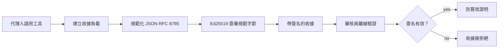
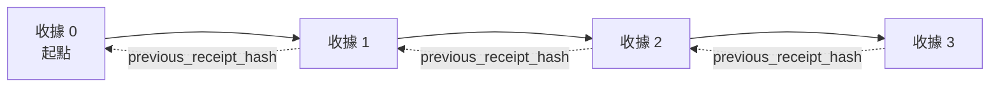

[觀看課程影片：使用加密收據保護 AI 代理](https://youtu.be/PLACEHOLDER_VIDEO_ID)

> _(課程影片與縮圖將由 Microsoft 內容團隊在合併後新增，符合第14/15課的模式。)_

# 使用加密收據保護 AI 代理

## 簡介

本課將涵蓋：

- 為什麼 AI 代理的審計軌跡對合規、除錯及信任很重要。
- 什麼是加密收據，以及它和未簽署的日誌行有何不同。
- 如何用純 Python 為代理的工具呼叫產生簽署收據。
- 如何離線驗證收據並偵測篡改。
- 如何串接收據鏈條，使刪除或重排任一收據會破壞整條鏈。
- 收據能證明什麼，以及它明確不證明什麼。

## 學習目標

完成本課後，你將能：

- 識別驅動加密溯源代理行為的失敗模式。
- 產生帶有 Ed25519 簽名的收據，內容為標準化 JSON 載荷。
- 使用僅有簽署者公鑰來獨立驗證收據。
- 透過重新驗證被修改收據發現篡改。
- 建立串接的收據雜湊鏈及說明鏈條重要性。
- 識別收據能證明的範圍（歸屬、完整性、排序）與不能證明的範圍（行為正確性、政策正當性）。

## 問題：你的代理的審計軌跡

想像你部署了一個為 Contoso Travel 服務的 AI 代理。代理讀取客戶請求，呼叫航班 API 尋找選項，並代表客戶訂座。上季度，該代理處理了 50,000 筆訂單。

今日一位稽核人員來訪。他們問一個簡單問題：「請給我看你的代理做了什麼。」

你交出日誌檔案。稽核人員再提更難問題：「我怎麼知道這些日誌沒有被編輯過？」

這就是審計軌跡問題。如今多數代理部署依賴：

- <strong>應用程式日誌</strong>：由代理自身寫入，任何有檔案系統存取權的人都可編輯。
- <strong>雲端記錄服務</strong>：平台層級防篡改，但只有在稽核人員信任平台操作商才有效。
- <strong>資料庫交易日誌</strong>：適合記錄資料庫變更，但不適用於任意工具呼叫。

這些方法都無法在不要求稽核方信任某人（你、雲端供應商或資料庫廠商）的情況下回答問題。內部使用時此種信任往往可接受，但對於受規管的工作負載（金融、醫療保健、任何受歐盟 AI 法規約束的）則不然。

加密收據透過讓每次代理行為可被獨立驗證來解決這個問題。稽核人員不必信任你，他們只需要你的公鑰和收據本身。

## 什麼是加密收據？

收據是一個 JSON 物件，記錄代理做了什麼，並附有數位簽名。


```mermaid
flowchart LR
    A[代理人調用工具] --> B[建立收據負載]
    B --> C[規範化 JSON RFC 8785]
    C --> E[Ed25519 簽署規範字節]
    E --> F[帶簽名的收據]
    F --> G[審核員離線驗證]
    G --> H{簽名有效？}
    H -- yes --> I[防篡改證明]
    H -- no --> J[收據被拒絕]
```

一份最簡收據長這樣：

```json
{
  "type": "agent.tool_call.v1",
  "agent_id": "contoso-travel-bot",
  "tool_name": "lookup_flights",
  "tool_args_hash": "sha256:a3f9c1...",
  "result_hash": "sha256:7b2e1d...",
  "policy_id": "contoso-travel-policy-v3",
  "timestamp": "2026-04-25T14:30:00Z",
  "sequence": 47,
  "previous_receipt_hash": "sha256:9d4e6a...",
  "signature": {
    "alg": "EdDSA",
    "sig": "c5af83...",
    "public_key": "8f3b2c..."
  }
}
```

有三個屬性能發揮作用：

1. <strong>簽名</strong>。收據由代理的閘道使用 Ed25519 私鑰簽署。任何擁有相對應公鑰的人都可離線驗證簽名。篡改任一欄位會使簽名失效。

2. <strong>標準化編碼</strong>。簽署前，收據會使用 JSON 標準化方案（JCS，RFC 8785）序列化。這確保兩套實作只要輸出相同邏輯收據，就會產生完全相同的位元組序列。若無標準化編碼，不同 JSON 序列化器會為相同內容產生不同簽名。

3. <strong>雜湊串接</strong>。`previous_receipt_hash` 欄位將每份收據串接到前一份。刪除或重組任何一份收據都會破壞該收據後的所有鏈條。即使各簽名被繞過，篡改行為還是在鏈路層可見。

這些屬性共同帶來三項保證：

- <strong>歸屬</strong>：此金鑰簽署此內容。
- <strong>完整性</strong>：此內容自簽署後未曾更動。
- <strong>排序</strong>：此收據在鏈中晚於某筆收據。

## 使用 Python 產生收據

你不需要特殊函式庫即可產生收據。加密基元廣泛可用，邏輯只有幾十行 Python 程式碼。

`code_samples/18-signed-receipts.ipynb` 的實作練習引導你完成完整流程。以下為摘要版本：

```python
import json
import hashlib
import base64
from nacl import signing
from jcs import canonicalize  # RFC 8785 規範 JSON

def b64url_nopad(data: bytes) -> str:
    return base64.urlsafe_b64encode(data).decode("ascii").rstrip("=")

def sha256_canonical(obj) -> str:
    """SHA-256 of a Python object's JCS-canonical JSON form."""
    return f"sha256:{hashlib.sha256(canonicalize(obj)).hexdigest()}"

# 產生或載入簽署金鑰（正式環境中，儲存在金鑰庫）
signing_key = signing.SigningKey.generate()
verify_key = signing_key.verify_key

# 建立收據載荷（尚未簽署）
tool_args = {"origin": "SYD", "destination": "LAX"}
tool_result = [{"flight": "QF11", "price": 1850, "stops": 0}]

payload = {
    "type": "agent.tool_call.v1",
    "agent_id": "contoso-travel-bot",
    "tool_name": "lookup_flights",
    "tool_args_hash": sha256_canonical(tool_args),
    "result_hash": sha256_canonical(tool_result),
    "policy_id": "contoso-travel-policy-v3",
    "timestamp": "2026-04-25T14:30:00Z",
    "sequence": 0,
    "previous_receipt_hash": None,
}

# 對 JCS 位元組直接進行規範化及簽署。PureEdDSA 內部會進行雜湊。
canonical_bytes = canonicalize(payload)
signature_bytes = signing_key.sign(canonical_bytes).signature

# 附加結構化簽名物件。
receipt = {
    **payload,
    "signature": {
        "alg": "EdDSA",
        "sig": b64url_nopad(signature_bytes),
        "public_key": b64url_nopad(bytes(verify_key)),
    },
}
```

這就是整個簽署流程。筆記本中步驟會逐一引導。

## 驗證收據與檢測篡改

驗證是相反操作：

```python
import base64
import hashlib
from nacl import signing
from nacl.exceptions import BadSignatureError
from jcs import canonicalize

def b64url_decode(s: str) -> bytes:
    padding = "=" * ((4 - len(s) % 4) % 4)
    return base64.urlsafe_b64decode(s + padding)

def verify_receipt(receipt: dict) -> bool:
    # 簽名是一個結構化對象: {"alg", "sig", "public_key"}。
    sig_obj = receipt.get("signature")
    if not sig_obj or sig_obj.get("alg") != "EdDSA":
        return False

    # 重建實際簽署的有效載荷（除簽名外的所有內容）。
    payload = {k: v for k, v in receipt.items() if k != "signature"}

    canonical_bytes = canonicalize(payload)

    try:
        verify_key = signing.VerifyKey(b64url_decode(sig_obj["public_key"]))
        verify_key.verify(canonical_bytes, b64url_decode(sig_obj["sig"]))
        return True
    except BadSignatureError:
        return False
```

此函式輸入收據並在簽名有效時回傳 `True`，否則回傳 `False`。不需網路呼叫、無服務依賴，也不需信任第三方。

要觀察篡改偵測如何運作，筆記本示範：

1. 產生有效收據並確認通過驗證。
2. 修改 `tool_args_hash` 欄位的一個位元組。
3. 重新執行驗證並發現失敗。

這是收據防篡改性質的實務示範：任何改動，無論多小，都會破壞簽名。

## 串接多步代理的收據鏈條

單一簽署收據保護一個行為。串接收據鏈保護序列行為。


```mermaid
flowchart LR
    R0[收據 0<br/>起點] --> R1[收據 1]
    R1 --> R2[收據 2]
    R2 --> R3[收據 3]
    R1 -. previous_receipt_hash .-> R0
    R2 -. previous_receipt_hash .-> R1
    R3 -. previous_receipt_hash .-> R2
```

每份收據記錄前一份收據的雜湊。要隱密刪除第2份收據，攻擊者必須：

- 修改第3份收據的 `previous_receipt_hash` 欄位（會破壞第3份收據簽名），或者
- 偽造第3份被修改收據的新簽名（需掌握代理私鑰）。

若私鑰存於硬體密鑰庫且你隨每份收據發布公鑰，這兩種攻擊均無法隱密進行。

筆記本示範：

1. 建立三份收據的鏈條。
2. 驗證每份收據的 `previous_receipt_hash` 與前一收據的真實雜湊相符。
3. 中間某筆收據遭篡改並演示鏈條正於該點斷裂。

這是建立一個外部稽核人不需信任你即可驗證的審計軌跡。

## 收據能證明什麼（及不能證明什麼）

這是本課最重要部分。收據很強大，但其能力有限。

**收據證明三件事：**

1. <strong>歸屬</strong>：特定金鑰簽署了特定載荷。
2. <strong>完整性</strong>：載荷自簽署後未被改變。
3. <strong>排序</strong>：此收據在雜湊鏈中晚於那份收據。

**收據不證明：**

1. <strong>正確性</strong>：代理的行為是否正確。錯誤答案同樣可被簽署收據支持。
2. <strong>政策合規</strong>：`policy_id` 所指政策是否實際被評估，或若評估會否允許此行為。收據紀錄的是宣稱，而非實際執行。
3. <strong>超越金鑰的身份</strong>：收據只說「此金鑰簽署此內容。」不代表「真人授權。」要將金鑰連結到人或組織，需另行身份基礎架構（如目錄、公鑰註冊等）。
4. <strong>輸入的真實性</strong>：若代理接收被操控的提示並據其行動，收據忠實記錄行為。收據處理的是輸入驗證之後，不是替代品。

這個界線重要有兩原因：

- 告訴你收據的用途：讓代理行為可被審計及防篡改，即使跨組織邊界。
- 告訴你還需要哪些額外層次：輸入驗證（第6課）、政策執行（下文簡述）、身份基礎架構（本課題外）。

常見誤解是認為「我們有收據」就代表「我們被治理」。事實不是。收據是基石。治理是你建立於基石之上的系統。

## 證明真人核可特定行動

上述第3點值得獨立討論：行為收據只說「此金鑰簽署此內容」，從不代表「真人授權」。對於高風險行為（退款、刪除、電匯），治理框架越來越要求這份缺失的聲明，且可用本課已有的基元產生。

後續筆記本 `code_samples/human-authorization-receipts.ipynb` 新增第二種收據類型 `human.approval.v1`，格式與本課收據相同（帶類型載荷，Ed25519 簽名 JCS 標準化位元組，簽名物件放簽名外）。命名核准者會在執行前簽署<strong>完整標準化行動與其摘要</strong>；代理的行動收據攜帶<strong>相同的行動摘要</strong>及 `parent_approval_ref`，即核准收據的 `receipt_hash`，同你先前建構鏈條的 `previous_receipt_hash` 慣例。一個 `verify_chain` 同時處理這兩種物件，並分別針對不同的固定金鑰註冊表（核准者金鑰與代理金鑰），程式碼路徑共用但權限機構從不衝突。

這樣帶來的性質謹慎說明：*真人核准此特定行動，代理確實執行該核准行動。* 筆記本的拒絕測試場景讓性質真實可驗，而非口頭聲稱：

- 經典集合：篡改、代理混淆、重放、雙方偽造金鑰、格式錯誤的輸入；
- <strong>過時權限</strong>：簽名仍有效但政策版本變更、核准者金鑰退出固定註冊表，或核准在執行前過期等原因導致拒絕；
- <strong>摘要置換</strong>：有效簽署的行為收據指向<em>不同</em>標準化行動的<em>真實</em>核准。

每個失敗原因都有獨特拒絕理由，令稽核人能判斷權限是否過時或執行行動是否改變。筆記本教的規則是：簽署核准本身不代表權限。只有兩張收據在執行時仍綁定同一標準化行動，權限才存在。真人核准收據是本課教育組合，非 `draft-farley-acta-signed-receipts` 所定義收據類型。

## 生產參考

本課 Python 程式碼刻意簡潔，你可以逐行理解運作。在生產環境，你有兩種選擇：

1. **直接建構在加密基元上。** 上述約 50 行程式碼已足夠多數用例。PyNaCl（Ed25519）和 `jcs`（標準化 JSON）皆為維護良好且經過審核的函式庫。

2. **使用生產級收據函式庫。** 多個開源專案實作相同模式並增添功能（金鑰輪替、批次驗證、JWK Set 分發、政策引擎整合）：
   - 簽署流程使用了獨立 IETF 草案（[`draft-farley-acta-signed-receipts`](https://datatracker.ietf.org/doc/draft-farley-acta-signed-receipts/)，第02版）定義的 JCS 和簽名範圍慣例。本課的扁平教育收據與草案中的 `{payload, signature}` 信封格式不同，且不宣稱為標準相容實作。該草案發佈了共通相容性測試集（[agent-governance-testvectors](https://github.com/ScopeBlind/agent-governance-testvectors)），用於目標其網路格式的實作。
   - Microsoft Agent Governance Toolkit 結合 Cedar 政策決策與收據；見該資源庫第33個教學範例，展示端到端實例。
   - `protect-mcp`（npm）與 `@veritasacta/verify`（npm）封裝 Node 環境的收據簽署與離線驗證功能，目標為封裝任一 MCP 伺服器以產生防篡改審計軌跡，包括持有共簽流程，其中暫停動作會產生綁定動作摘要的核准收據（桌面流程使用 WebAuthn 支援），與上文真人核准筆記本相同模式。
   - **[nobulex](https://github.com/arian-gogani/nobulex)** Python SDK (`pip install nobulex`) 提供相同 Ed25519 + JCS 簽署模式，含 LangChain 與 CrewAI 整合，且公布交叉驗證測試向量以及通過 [OWASP PR #2210](https://github.com/OWASP/CheatSheetSeries/pull/2210) 出版合規映射。

自行開發與使用函式庫的抉擇，類似於開發自己 JWT 函式庫與使用經過測試的函式庫的決定：兩者合理；函式庫節省時間並降低審核範圍；自己開發則逼你徹底理解每個基元。本課教授自己開發路徑，提供任一選擇的基礎。

## 知識檢核

在開始實作練習前測試你的理解。

**1. 收據是以代理的私鑰 Ed25519 簽署。稽核人只有公鑰。稽核人能離線驗證收據嗎？**

<details>
<summary>答案</summary>

能。Ed25519 驗證僅需公鑰與簽署位元組。無需網路呼叫、無服務依賴。這正是收據於隔離網、多組織或低信任審計環境有用的原因。
</details>

**2. 攻擊者修改收據的 `policy_id` 欄位，聲稱其受更寬鬆政策管轄。簽名是對原始載荷。驗證時會發生什麼？**

<details>
<summary>答案</summary>


驗證失敗。簽名是基於原始有效載荷的正規化字節計算的；修改任何欄位都會改變這些字節，導致簽名無效。攻擊者需要私鑰來生成一個新的有效簽名，但他們沒有。
</details>

**3. 為何收據包括 `tool_args_hash` 和 `result_hash`，而不是原始參數和結果？**

<details>
<summary>回答</summary>

有兩個原因。首先，收據可能需要在會洩漏原始內容（個人身份資訊、商業數據）成為問題的環境中存檔或傳輸。雜湊能保持收據體積小且內容私密；審核者驗證雜湊是否與分開儲存的實際內容副本相符。其次，雜湊具有固定大小；無論輸入輸出多大，收據帶有雜湊後大小都是有界的。
</details>

**4. `previous_receipt_hash` 欄位將每張收據連接到前一張。如果攻擊者靜默刪除鏈中某張收據，什麼會變得無效？**

<details>
<summary>回答</summary>

刪除這張收據後的每張收據都會無效。它們的 `previous_receipt_hash` 欄位不再符合實際鏈條（因為它們所參考的收據不存在了，或鏈條現在指向不同的前序）。為了隱藏刪除，攻擊者必須對之後的每張收據重新簽名，這需要私鑰。
</details>

**5. 一張收據驗證成功。這證明代理的行動是正確、合理，或符合法規嗎？**

<details>
<summary>回答</summary>

不。有效的收據證明三件事：歸屬（該密鑰簽署此內容）、完整性（內容未被更改）以及排序（這張收據在那張收據之後）。它不證明行動是正確的、`policy_id` 指定的政策確實有被評估，或代理有遵守所有規則。收據使代理行為可審核，但不一定正確。這是課程中最重要的界線。
</details>

## 練習作業

打開 `code_samples/18-signed-receipts.ipynb` 並完成以下四個部分：

1. <strong>第一部分</strong>：簽署你的第一份收據並驗證它。
2. <strong>第二部分</strong>：篡改收據並觀察驗證失敗。
3. <strong>第三部分</strong>：建立三張收據鏈並驗證鏈條的完整性。
4. <strong>第四部分</strong>：將此模式應用於使用 Microsoft Agent Framework 構建的代理：包裝工具調用以簽署收據，然後獨立驗證收據。

**延伸挑戰 1：** 擴展收據結構，添加你自己選擇的欄位（例如用於追蹤的請求 ID），更新正規化簽名邏輯以包含它，並確認收據仍可成功往返驗證。然後簽名後修改該欄位，確認驗證失敗。這強迫你理解正規化編碼的每一字節如何影響簽名。

**延伸挑戰 2：** 將兩張收據的正規化字節按確定性順序串接，進行 SHA-256 雜湊，並將產生的摘要作為第三張收據的一個新欄位嵌入，再簽名它。驗證三張收據仍可往返驗證。你剛建構了一種一步包含證明：持有第三張收據的任何人都能證明在簽名時前兩張收據存在，而無需公開它們內容。這是大規模可選擇披露收據（Merkle 承諾，RFC 6962）所使用的模式。

## 結論

密碼學收據為 AI 代理提供了審計軌跡，特點包括：

- <strong>獨立可驗證</strong>：任何持有公鑰方均可驗證，無需依賴服務。
- <strong>防篡改</strong>：任何修改都使簽名無效。
- <strong>可攜帶</strong>：收據是一個小型 JSON 文件；可存檔、傳輸並在任處驗證。
- <strong>標準對齊</strong>：基於 Ed25519（RFC 8032）、JCS（RFC 8785）與 SHA-256，均為廣泛部署的原語。

它們不是輸入驗證、政策執行或身份基礎設施的替代品，而是這些層級的基礎。當你將代理部署至受管制工作負載、多組織工作流程，或任何未來審核者無法假定信任你的環境，收據是你使審計軌跡誠實的方式。

最重要的重點：收據證明是誰在何時說了什麼。它們不證明所說的是真實或正確的。牢牢把握這個差別。這是誠實的來源系統與誤導系統之間的區別。

## 生產檢查清單

當你準備從本課進階到實際環境部署簽署收據的代理時：

- [ ] **將簽名密鑰移出開發者筆記本。** 使用 Azure Key Vault、AWS KMS 或硬體安全模組。用以簽署收據的私鑰絕不可存在原始碼控制或應用機器上的純文字中。
- [ ] **公開驗證公鑰。** 審核者需離線驗證。標準模式是 JWK 集合放在眾所周知的 URL（RFC 7517），例如 `https://your-org.example.com/.well-known/agent-keys.json`。
- [ ] **在外部錨定鏈條。** 定期將最新鏈頭哈希寫入公開記錄（日誌如 Sigstore Rekor、RFC 3161 時間戳機構，或第二內部系統），讓外部方能確認「此鏈條當時已存在」。
- [ ] **收據不可變存儲。** 使用僅增追加型 blob 儲存（如 Azure Storage 不可變策略、AWS S3 物件鎖定）防止內部人員在儲存層重寫歷史。
- [ ] **決定保存期限。** 許多合規要求多年保存。規劃收據成長（每張收據約 500 字節；一個每天呼叫 10K 次的代理一年產出約 1.8 GB）。
- [ ] **文件化收據不涵蓋的部分。** 收據證明歸屬、完整性與排序。你的運行手冊應明確列出哪些額外控管（輸入驗證、政策執行、速率限制、身份基礎設施）與收據一同構成治理態勢。

### 想進一步瞭解如何保護 AI 代理？

加入 [Microsoft Foundry Discord](https://aka.ms/ai-agents/discord) 與其他學習者交流，參加辦公時間，獲得你的 AI 代理疑問解答。

## 超越本課程

本課涵蓋單張收據簽署與雜湊鏈式序列。這些原語可組成你治理態勢成熟後可能遇到的多種進階模式：

- **選擇性披露。** 當收據欄位彼此獨立承諾（RFC 6962 風格 Merkle 樹），你可以向特定審核者揭露特定欄位，並證明其他欄位未變更，但不透露它們。當同一收據需同時滿足全面審計（要求完整性）與如 GDPR 這樣的數據最小化規範（要求審核者只能看到最少資訊）時非常有用。
- **收據撤銷。** 若簽名密鑰被洩露，你需要方法標記從某時間點開始該密鑰簽署的所有收據不再可信。標準模式是短期簽名密鑰加上公布的撤銷列表，或帶有撤銷條目的公開日誌。
- **雙邊／分割簽名收據。** 有些實作將簽署的有效載荷分為執行前（`authorization_*`）和執行後（`result_*`）兩部分，並各自獨立簽名，適合授權決策與觀察結果由不同行為者或不同時點產生。這可在本課程教的收據格式上加法組合。
- **有效載荷組合。** 收據封裝你放入 `result_hash` 的任何字節。現實中載荷常比單一工具調用結果更豐富：決策前推理（模型預測、考慮的選項、證據及其完整性、風險姿態、問責鏈、門檻結果）都可包含在載荷內，並由單張收據封裝。這保持收據格式簡潔，同時載荷架構可按領域演變。
- **跨實作一致性。** 多個獨立實作（Python、TypeScript、Rust、Go）針對共享測試向量互相驗證。若自行實作，對照公布向量可確保協定兼容性。
- **後量子遷移。** Ed25519 如今廣泛部署，但非量子安全。收據格式是演算法可變的：`signature.alg` 欄位可使用 `ML-DSA-65`（NIST 後量子簽名標準）以便遷移。規劃過渡期，收據雙重簽名。

## 附加資源

- <a href="https://datatracker.ietf.org/doc/draft-farley-acta-signed-receipts/" target="_blank">IETF 網際網路草案：用於機器對機器存取控制的簽署決策收據</a>
- <a href="https://learn.microsoft.com/azure/ai-studio/responsible-use-of-ai-overview" target="_blank">負責任 AI 概述 （Azure AI）</a>
- <a href="https://datatracker.ietf.org/doc/html/rfc8032" target="_blank">RFC 8032：愛德華曲線數位簽章演算法（EdDSA）</a>
- <a href="https://datatracker.ietf.org/doc/html/rfc8785" target="_blank">RFC 8785：JSON 規範化方案（JCS）</a>
- <a href="https://datatracker.ietf.org/doc/html/rfc6962" target="_blank">RFC 6962：憑證透明度</a>（選擇性披露收據用的 Merkle 樹結構）
- <a href="https://github.com/microsoft/agent-governance-toolkit/blob/main/docs/tutorials/33-offline-verifiable-receipts.md" target="_blank">Microsoft Agent Governance Toolkit，教程 33：離線驗證決策收據</a>
- <a href="https://github.com/ScopeBlind/agent-governance-testvectors" target="_blank">本課程收據格式之跨實作一致性測試向量</a>（Apache-2.0）
- <a href="https://pynacl.readthedocs.io/" target="_blank">PyNaCl 文件</a>（Python 中的 Ed25519 實作）

## 前一課程

[建立本地 AI 代理](../17-creating-local-ai-agents/README.md)

---

<!-- CO-OP TRANSLATOR DISCLAIMER START -->
**免責聲明**：
本文件使用 AI 翻譯服務 [Co-op Translator](https://github.com/Azure/co-op-translator) 進行翻譯。雖然我們力求準確，但請注意，自動翻譯可能包含錯誤或不準確之處。原始文件的母語版本應被視為權威來源。對於重要資訊，建議尋求專業人工翻譯。我們不對因使用本翻譯而引起的任何誤解或曲解承擔責任。
<!-- CO-OP TRANSLATOR DISCLAIMER END -->