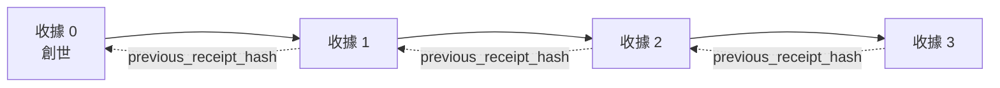

[觀看課程影片：使用密碼學收據保護 AI 代理](https://youtu.be/PLACEHOLDER_VIDEO_ID)

> _(課程影片和縮圖將由微軟內容團隊於合併後新增，符合第 14 / 15 課模式。)_

# 使用密碼學收據保護 AI 代理

## 簡介

本課程將涵蓋：

- 為什麼 AI 代理的審計軌跡對合規性、除錯及信任至關重要。
- 什麼是密碼學收據，與未簽署的日誌記錄有何不同。
- 如何用純 Python 生成代理工具調用的簽署收據。
- 如何離線驗證收據並檢測篡改。
- 如何將收據鏈結，使刪除或重排其中一個會破壞整個鏈結。
- 收據能證明什麼，以及明確不能證明什麼。

## 學習目標

完成本課後，您將能夠：

- 識別促使代理行動需要密碼學來源追蹤的失效模式。
- 生成用 Ed25519 簽署的標準 JSON 載荷收據。
- 僅使用簽章者的公鑰獨立驗證收據。
- 通過對修改過的收據重新驗證來檢測篡改。
- 建立哈希鏈結的收據序列並解釋鏈結重要性。
- 辨識收據能證明的邊界（歸屬權、完整性、排序）與不能證明的部分（行動正確性、政策合理性）。

## 問題：您的代理的審計軌跡

想像您已部署一個 Contoso Travel 的 AI 代理。該代理閱讀客戶請求，調用航班 API 查詢選項，並代表客戶訂位。上季度該代理處理了 5 萬筆訂單。

今天審計員來了。他們問了一個簡單問題：「讓我看看您的代理做了什麼。」

您交出日誌檔案。審計員看過後問了個更難的問題：「我怎麼知道這些日誌沒有被編輯？」

這就是審計軌跡問題。當今多數代理部署依賴：

- <strong>應用日誌</strong>：由代理自行寫入，有檔案系統存取權限者可編輯。
- <strong>雲端日誌服務</strong>：在平臺層面可防篡改，但前提是審計員信任該平臺營運商。
- <strong>資料庫交易日誌</strong>：適合資料庫變更，但不適用於任意工具調用。

以上皆無法在不要求審計員信任任何人（您、您的雲端供應商、資料庫廠商）的情況下回答問題。對內部使用而言，通常能接受此信任。對於受規管工作負載（金融、醫療、受歐盟 AI 法案約束的工作負載）則不然。

密碼學收據透過使每個代理行動獨立可驗證來解決此問題。審計員不需信任您，只需您的公鑰和收據本身。

## 什麼是密碼學收據？

收據是一個記錄代理所為的 JSON 物件，並附上數位簽章。


```mermaid
flowchart LR
    A[代理調用工具] --> B[建立收據負載]
    B --> C[JSON 標準化 RFC 8785]
    C --> E[Ed25519 簽署標準字節]
    E --> F[帶簽名的收據]
    F --> G[審計員離線驗證]
    G --> H{簽名有效？}
    H -- yes --> I[防篡改證明]
    H -- no --> J[收據被拒絕]
```

最簡單的收據如下：

```json
{
  "type": "agent.tool_call.v1",
  "agent_id": "contoso-travel-bot",
  "tool_name": "lookup_flights",
  "tool_args_hash": "sha256:a3f9c1...",
  "result_hash": "sha256:7b2e1d...",
  "policy_id": "contoso-travel-policy-v3",
  "timestamp": "2026-04-25T14:30:00Z",
  "sequence": 47,
  "previous_receipt_hash": "sha256:9d4e6a...",
  "signature": {
    "alg": "EdDSA",
    "sig": "c5af83...",
    "public_key": "8f3b2c..."
  }
}
```

三個屬性共同發揮作用：

1. <strong>簽章</strong>。收據由代理的閘道使用 Ed25519 私鑰簽署。任何擁有對應公鑰者都能離線驗證簽章。篡改任何欄位即使簽章無效。

2. <strong>標準化編碼</strong>。簽署前，收據使用 JSON 標準化方案（JCS，RFC 8785）序列化。這確保兩個實作產生相同邏輯收據時會輸出位元完全一致的字節。若無標準化，不同 JSON 序列化器會為相同內容生成不同簽章。

3. <strong>哈希鏈結</strong>。`previous_receipt_hash` 欄位將每個收據與前一筆串聯。刪除或調整收據順序會破壞之後所有收據鏈。即使繞過個別簽章，篡改仍能於鏈結層面被察覺。

這些屬性合力提供三項保證：

- <strong>歸屬權</strong>：此鑰匙簽署了此內容。
- <strong>完整性</strong>：內容自簽署後未曾變更。
- <strong>排序</strong>：此收據於鏈中位於該收據之後。

## 用 Python 生成收據

您不需特別函式庫即能生成收據。密碼學基元廣泛可用，邏輯僅數十行 Python 程式碼。

`code_samples/18-signed-receipts.ipynb` 中的實作練習引導您完成整個流程。以下是摘要版本：

```python
import json
import hashlib
import base64
from nacl import signing
from jcs import canonicalize  # RFC 8785 標準化 JSON

def b64url_nopad(data: bytes) -> str:
    return base64.urlsafe_b64encode(data).decode("ascii").rstrip("=")

def sha256_canonical(obj) -> str:
    """SHA-256 of a Python object's JCS-canonical JSON form."""
    return f"sha256:{hashlib.sha256(canonicalize(obj)).hexdigest()}"

# 生成或載入簽名金鑰（生產環境中，存放於金鑰庫）
signing_key = signing.SigningKey.generate()
verify_key = signing_key.verify_key

# 建立收據有效載荷（尚未簽名）
tool_args = {"origin": "SYD", "destination": "LAX"}
tool_result = [{"flight": "QF11", "price": 1850, "stops": 0}]

payload = {
    "type": "agent.tool_call.v1",
    "agent_id": "contoso-travel-bot",
    "tool_name": "lookup_flights",
    "tool_args_hash": sha256_canonical(tool_args),
    "result_hash": sha256_canonical(tool_result),
    "policy_id": "contoso-travel-policy-v3",
    "timestamp": "2026-04-25T14:30:00Z",
    "sequence": 0,
    "previous_receipt_hash": None,
}

# 對 JCS 位元組進行標準化並直接簽名。PureEdDSA 內部進行哈希處理。
canonical_bytes = canonicalize(payload)
signature_bytes = signing_key.sign(canonical_bytes).signature

# 附加結構化簽名物件。
receipt = {
    **payload,
    "signature": {
        "alg": "EdDSA",
        "sig": b64url_nopad(signature_bytes),
        "public_key": b64url_nopad(bytes(verify_key)),
    },
}
```

這即是完整的簽署管線。筆記本中的練習逐步引導每一步。

## 驗證收據並檢測篡改

驗證為相反操作：

```python
import base64
import hashlib
from nacl import signing
from nacl.exceptions import BadSignatureError
from jcs import canonicalize

def b64url_decode(s: str) -> bytes:
    padding = "=" * ((4 - len(s) % 4) % 4)
    return base64.urlsafe_b64decode(s + padding)

def verify_receipt(receipt: dict) -> bool:
    # 簽名是一個結構化物件：{"alg", "sig", "public_key"}。
    sig_obj = receipt.get("signature")
    if not sig_obj or sig_obj.get("alg") != "EdDSA":
        return False

    # 重建實際被簽署的內容（除簽名外的所有部分）。
    payload = {k: v for k, v in receipt.items() if k != "signature"}

    canonical_bytes = canonicalize(payload)

    try:
        verify_key = signing.VerifyKey(b64url_decode(sig_obj["public_key"]))
        verify_key.verify(canonical_bytes, b64url_decode(sig_obj["sig"]))
        return True
    except BadSignatureError:
        return False
```

此函式接收收據，若簽章有效回傳 `True`，否則為 `False`。無需網絡呼叫，無服務依賴，不需信任第三方。

要瞭解篡改偵測的實際操作，筆記本引導您：

1. 生成有效收據並確認驗證成功。
2. 修改 `tool_args_hash` 欄位的一個位元組。
3. 再次執行驗證並發現驗證失敗。

這實際示範收據的篡改可見性：任何修改，不論多小，都會破壞簽章。

## 為多步代理串接收據鏈

單個簽署收據保護一個行動。收據鏈保護一連串行動。


```mermaid
flowchart LR
    R0[收據 0<br/>創世] --> R1[收據 1]
    R1 --> R2[收據 2]
    R2 --> R3[收據 3]
    R1 -. previous_receipt_hash .-> R0
    R2 -. previous_receipt_hash .-> R1
    R3 -. previous_receipt_hash .-> R2
```

每個收據記錄前一筆收據的哈希。要悄無聲息地刪除收據 2，攻擊者需：

- 修改收據 3 的 `previous_receipt_hash` 欄位（會破壞收據 3 的簽章），或
- 針對修改過的收據 3 偽造新的簽章（需代理的私鑰）。

若私鑰存在硬體鑰匙庫且您隨每個收據公開公鑰，兩種攻擊皆不可行且不會不被察覺。

筆記本說明：

1. 建立三筆收據的鏈。
2. 驗證每筆收據的 `previous_receipt_hash` 符合前一筆收據的實際哈希。
3. 篡改中間一筆收據，並觀察鏈在該處斷裂。

這即是製作外部審計員可驗證且不需信任您的審計軌跡的方法。

## 收據證明什麼（與不證明什麼）

這是本課最重要部分。收據功能強大，但有限制。

**收據證明三件事：**

1. <strong>歸屬權</strong>：特定鑰匙簽署了特定載荷。
2. <strong>完整性</strong>：載荷自簽署後未變更。
3. <strong>排序</strong>：此收據在哈希鏈中位於該收據之後。

**收據不證明：**

1. <strong>正確性</strong>：代理的行動是否正確。錯誤答案可與正確答案同樣乾淨地被簽署。
2. <strong>政策遵循</strong>：`policy_id` 所指政策是否實際被評估，或若評估會否允許此行動。收據記錄的是聲明，不是執行結果。
3. <strong>超越鑰匙的身分</strong>：收據說「此鑰匙簽署此內容」，不表示「此人授權此事」。連結鑰匙與人或機構需另建身分基礎設施（目錄、公鑰登記等）。
4. <strong>輸入真實性</strong>：若代理接收被操控的提示並依此行動，收據忠實記錄行動。收據屬於輸入驗證之後，非代替驗證。

此邊界重要有兩原因：

- 它告訴您收據的實用範圍：使代理行為可審計且可見篡改，即使跨組織。
- 它告訴您還需要哪些額外層：輸入驗證（第 6 課）、政策執行（稍後簡述）和身分基礎（本課不涵蓋）。

常見誤解是以為「有收據」等於「正在治理」。並非如此。收據是基礎，治理是您建構於其上的系統。

## 證明人類批准了確切行動

上述第 3 點值得單獨成節：行動收據說「此鑰匙簽署此內容」，從不說「有人類授權此事」。高風險行動（退款、刪除、匯款）治理框架逐漸需具備精確缺失之授權聲明，而該聲明可用本課已建構的基元生成。

後續筆記本 `code_samples/human-authorization-receipts.ipynb` 新增第二種收據類型 `human.approval.v1`，用與本課收據相同外殼格式（經 Ed25519 對標準 JCS 字節簽署的類型化載荷，`signature` 物件位於簽署字節外）表示。命名的批准者在執行前簽署<strong>完整標準化行動及其摘要</strong>；代理的行動收據攜帶<strong>相同的行動摘要</strong>和 `parent_approval_ref`（批准的 `receipt_hash`，與您上面建立鏈所用 `previous_receipt_hash` 相同慣例）。單一 `verify_chain` 在<strong>不同鎖定鑰匙登記處</strong>（批准者鍵與代理鍵）下一起驗證兩個物件，代碼路徑共用但權限從未共用。

這帶來的特性，謹慎敘述為：*人類批准了此確切行動，代理執行而正是此被批准行動。* 筆記本拒絕案例使此特性真實而非口頭：

- 經典案例組合：篡改、混淆代理、中繼攻擊、雙方偽造鑰匙、畸形輸入；
- <strong>過期權限</strong>：簽章仍驗證通過但因政策版本更新、批准者鍵從鎖定登記移除或批准於執行前過期而被拒；
- <strong>摘要替代</strong>：有效簽署的行動收據指向一個綁定<em>不同</em>標準化行動的<em>真實</em>批准。

每種失敗以不同原因拒絕，讓審計員辨識是權限過期還是執行行動變更。筆記本教授的規則是：簽署批准本身非授權。只有在執行時兩收據仍綁定同一標準化行動時授權才存在。人類批准收據是本課定義的教育組合，而非 `draft-farley-acta-signed-receipts` 規範的收據類別。

## 生產參考資料

本課的 Python 程式碼故意簡潔，方便您逐行理解所有細節。生產環境中，您有兩種選擇：

1. **直接基於密碼學基元建構。** 上述 50 行已足夠多數用例。PyNaCl（Ed25519）與 `jcs` 套件（標準化 JSON）皆為維護良好且經審計的函式庫。

2. **使用生產級收據函式庫。** 幾個開源專案實作相同模式並附加額外功能（鑰匙輪替、批次驗證、JWK 集合分發、與政策引擎整合）：
   - 簽署管線使用 IETF 獨立草案中的 JCS 與簽署範圍慣例（[`draft-farley-acta-signed-receipts`](https://datatracker.ietf.org/doc/draft-farley-acta-signed-receipts/)，修訂版 02）。本課教育用扁平收據與草案 `{payload, signature}` 外殼不同，且非一致性實作。草案發佈共享一致性套件（[agent-governance-testvectors](https://github.com/ScopeBlind/agent-governance-testvectors)）供目標其線路格式的實作測試。
   - 微軟代理治理工具包將收據與 Cedar 為基礎的政策決策結合；該倉庫 Tutorial 33 有完整示範。
   - `protect-mcp`（npm）及 `@veritasacta/verify`（npm）套件提供 Node.js 實作收據簽署與離線驗證，目標「包裹」任何 MCP 服務器以製造可見篡改審計軌跡，包含暫停動作發出綁定行動摘要的批准收據的聯合簽章流程（桌面流程中具 WebAuthn 支援），與上述人類授權筆記本相同批准收據模式。
   - **[nobulex](https://github.com/arian-gogani/nobulex)** Python SDK (`pip install nobulex`) 在 Python 中提供相同 Ed25519 + JCS 簽署模式，並整合 LangChain 與 CrewAI，包含已公佈的交叉驗證測試向量與透過 [OWASP PR #2210](https://github.com/OWASP/CheatSheetSeries/pull/2210) 貢獻的合規映射。

選擇自建或使用函式庫，與挑選自行實作 JWT 函式庫或使用測試過的相似：兩者皆合理；使用函式庫節省時間並降低審計範圍；從零開始方案強迫您理解每個基元。本課採從零開始教學，使您為任一抉擇打好基礎。

## 知識檢核

進入實作練習前，先測試理解度。

**1. 收據用代理的私鑰 Ed25519 簽署。審計員只有公鑰。審計員能離線驗證收據嗎？**

<details>
<summary>答案</summary>

是。Ed25519 驗證僅需公鑰與簽署字節。無網絡呼叫，無服務依賴。此特性使收據在非聯網、多組織或低信任審計環境中有用。
</details>

**2. 攻擊者修改收據的 `policy_id` 欄位，聲稱適用於較寬鬆的政策。簽章基於原始載荷。驗證時會如何？**

<details>
<summary>答案</summary>


驗證失敗。簽名是對原始有效載荷的規範位元組計算的；修改任何欄位都會更改這些位元組，使簽名無效。攻擊者需要私鑰才能產生新的有效簽名，但他們並沒有。
</details>

**3. 為什麼收據包含 `tool_args_hash` 和 `result_hash` 而非原始參數和結果？**

<details>
<summary>答案</summary>

有兩個原因。第一，收據可能需要在洩露原始內容（個人識別信息、商業資料）有問題的環境中存檔或傳輸。雜湊確保收據大小小且內容私密；審計者驗證該雜湊是否與分開存儲的實際內容副本匹配。第二，雜湊具有固定大小；不論輸入與輸出的大小如何，包含雜湊的收據大小都受限。
</details>

**4. `previous_receipt_hash` 欄位將每個收據鏈接到其前任。如果攻擊者靜默刪除鏈中間的一份收據，什麼會變得無效？**

<details>
<summary>答案</summary>

刪除收據之後的每份收據都會變得無效。它們的 `previous_receipt_hash` 欄位將不再匹配實際鏈（因為它們引用的收據已不存在，或鏈現在指向不同的前任）。為了掩蓋刪除，攻擊者必須重新簽署所有後續收據，這需要私鑰。
</details>

**5. 如果收據驗證通過，是否證明代理的行為是正確、合理或符合政策？**

<details>
<summary>答案</summary>

不。不論收據有效代表三件事：歸屬（這個密鑰簽署了這個內容）、完整性（內容未改變）和排序（此收據在另一收據之後）。它不證明行動是正確的，不證明 `policy_id` 中指定的政策確實被評估，也不證明代理遵守了所有規則。收據讓代理行為可審計，但不保證正確。這是本課程中最重要的界限。
</details>

## 實作練習

打開 `code_samples/18-signed-receipts.ipynb` 並完成以下四個部分：

1. <strong>第一部分</strong>：簽署你的第一份收據並驗證它。
2. <strong>第二部分</strong>：篡改收據並觀察驗證失敗。
3. <strong>第三部分</strong>：建立一個三份收據的鏈並驗證鏈的完整性。
4. <strong>第四部分</strong>：將此模式應用於使用 Microsoft Agent Framework 建立的代理：為工具呼叫包裝收據簽署，然後獨立驗證收據。

**額外挑戰 1：** 擴展收據結構，添加你選擇的額外欄位（例如，用於追蹤的請求 ID），更新規範簽署邏輯以包含此欄位，並確認收據仍能通過驗證。然後在簽署後修改該欄位，確認驗證失敗。這能讓你理解規範編碼的每個位元組如何影響簽名。

**額外挑戰 2：** 將兩份收據的規範位元組做 SHA-256 雜湊（以確定性順序串接），並將結果摘要作為新欄位嵌入第三份收據，然後簽署它。驗證三份收據依然可通過全部驗證。你剛建立了一步包含證明：任何持有第三份收據的人都能證明前兩份於簽署時存在，而不必揭露其內容。這是選擇性披露收據在大規模應用中的典範（Merkle 承諾，RFC 6962）。

## 結論

密碼學收據給 AI 代理提供了這樣的審計追蹤：

- <strong>可獨立驗證</strong>：任何擁有公鑰的方均可驗證，無需依賴服務。
- <strong>防篡改明顯</strong>：任意修改都會使簽名失效。
- <strong>可攜帶</strong>：收據是小型 JSON 文件，可被存檔、傳輸與驗證於任何地點。
- <strong>符合標準</strong>：基於 Ed25519（RFC 8032）、JCS（RFC 8785）及 SHA-256，均為廣泛部署的原語。

它們並非輸入驗證、政策執行或身份架構的替代品，而是這些層面的基礎。當你將代理部署至受監管工作負載、多機構工作流程或任何無法假設未來審計者會信任你的環境時，收據是讓審計追蹤誠實的利器。

最重要的結論：收據證明是誰在何時說了什麼，但不證明內容是真實或正確。請牢牢把握此區別。這是誠實來源系統與誤導性系統的關鍵分界。

## 上線檢查清單

當你準備從本課程畢業，將收據簽署代理部署至真實環境時：

- [ ] **將簽署私鑰移出開發者筆電。** 使用 Azure Key Vault、AWS KMS 或硬體安全模組。簽署收據的私鑰絕不可存在於原始碼控管或應用機器的明文中。
- [ ] **公開驗證公鑰。** 審計者需要離線驗證。標準做法是在知名 URL 放置 JWK 集合（RFC 7517），例如 `https://your-org.example.com/.well-known/agent-keys.json`。
- [ ] **外部錨定鏈。** 定期將最新鏈頭雜湊寫入透明度日誌（Sigstore Rekor、RFC 3161 時間戳授權或第二內部系統），讓外部方可確認「該鏈於此時存在」。
- [ ] **將收據設為不可變儲存。** 附加式 Blob 儲存（Azure Storage 的不變性政策、AWS S3 對象鎖）防止內部人從儲存層改寫歷史。
- [ ] **決定保存期限。** 許多合規制度要求多年保存。規劃收據增長（每份收據約 500 字節；代理每天呼叫 10K 次約產生每年 1.8 GB）。
- [ ] **記錄收據未涵蓋內容。** 收據證明歸屬、完整性與排序。你的運維手冊應明確列出與收據並存的額外控管（輸入驗證、政策執行、速率限制、身份架構）。

### 想深入了解保護 AI 代理？

加入 [Microsoft Foundry Discord](https://aka.ms/ai-agents/discord)，與其他學習者交流，參加辦公時間，獲得 AI 代理問題的解答。

## 課程之外

本課程涵蓋單收據簽署和雜湊鏈序列。同樣的原語可組合成多個你在治理成熟過程中可能遇到的進階模式：

- **選擇性揭露。** 當收據欄位被獨立承諾（RFC 6962 樣式的 Merkel 樹）時，你可向特定審計者揭露指定欄位，證明其他欄位未變且不外露。當同一收據需同時滿足全面審計（需完整性）與數據最小化（如 GDPR，要求審計者只見必要資料）時，此法最有用。
- **收據撤銷。** 若簽署密鑰遭洩，需有方法標記自某點起該密鑰簽署的所有收據為不可信。標準方案：短期簽署密鑰加上發布撤銷清單，或帶撤銷條目的透明度日誌。
- **雙邊／拆分簽署收據。** 有些實作會將簽署有效載荷拆為執行前（`authorization_*`）與執行後（`result_*`）兩半，分別簽署，當授權決定與觀察結果由不同角色或不同時間產生時很有用。此方案可在本課程介紹的收據格式上加成。
- **載荷組合。** 收據封印你放入 `result_hash` 的任何位元組。真實載荷往往比單次工具呼叫結果更豐富：決策前推理（模型預測、考慮選項、證據與其完整性、風險狀態、責任鏈、閘門結果）可都封在載荷中，由單一收據封印。這讓收據格式保持精簡，且各領域可自由演化載荷結構。
- **跨實作相符性。** 複數獨立實作（Python、TypeScript、Rust、Go）對同一收據格式進行交叉驗證測試向量。若你打造自家實作，對照已發布的測試向量驗證通過，確保通訊協定兼容。
- **後量子遷移。** Ed25519 今日廣泛部署，但不抗量子攻擊。收據格式算法可切換：`signature.alg` 欄位可帶 `ML-DSA-65`（NIST 後量子簽名標準）以備遷移。規劃雙重簽署過渡期。

## 額外資源

- <a href="https://datatracker.ietf.org/doc/draft-farley-acta-signed-receipts/" target="_blank">IETF 網際網路草案：機器對機器存取控制的決策簽名收據</a>
- <a href="https://learn.microsoft.com/azure/ai-studio/responsible-use-of-ai-overview" target="_blank">負責任的 AI 概述（Azure AI）</a>
- <a href="https://datatracker.ietf.org/doc/html/rfc8032" target="_blank">RFC 8032：愛德華曲線數位簽署演算法（EdDSA）</a>
- <a href="https://datatracker.ietf.org/doc/html/rfc8785" target="_blank">RFC 8785：JSON 規範化方案（JCS）</a>
- <a href="https://datatracker.ietf.org/doc/html/rfc6962" target="_blank">RFC 6962：憑證透明度</a>（選擇性披露收據使用的 Merkel 樹構造）
- <a href="https://github.com/microsoft/agent-governance-toolkit/blob/main/docs/tutorials/33-offline-verifiable-receipts.md" target="_blank">Microsoft Agent Governance Toolkit 教程 33：離線驗證決策收據</a>
- <a href="https://github.com/ScopeBlind/agent-governance-testvectors" target="_blank">本課程使用收據格式的跨實作一致性測試向量</a>（Apache-2.0）
- <a href="https://pynacl.readthedocs.io/" target="_blank">PyNaCl 文件說明</a>（Python 中的 Ed25519）

## 上一課

[建立本地 AI 代理](../17-creating-local-ai-agents/README.md)

---

<!-- CO-OP TRANSLATOR DISCLAIMER START -->
**免責聲明**：
本文件使用 AI 翻譯服務 [Co-op Translator](https://github.com/Azure/co-op-translator) 進行翻譯。雖然我們力求準確，但請注意，自動翻譯可能包含錯誤或不準確之處。原始文件的母語版本應被視為權威來源。對於重要資訊，建議尋求專業人工翻譯。我們不對因使用本翻譯而引起的任何誤解或曲解承擔責任。
<!-- CO-OP TRANSLATOR DISCLAIMER END -->