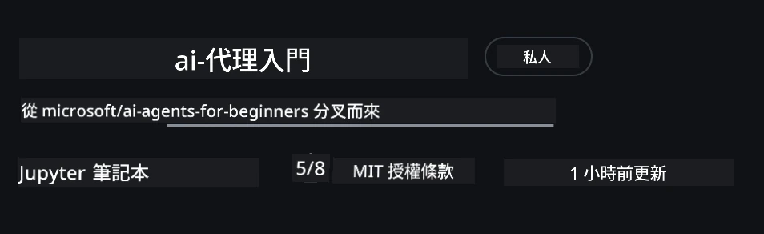
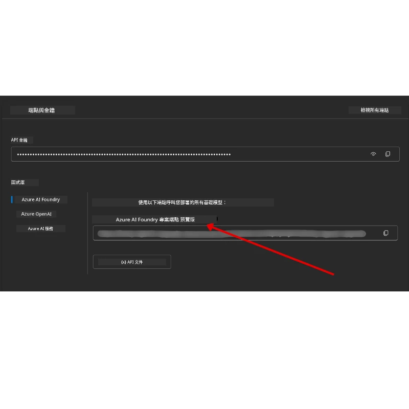

# 課程設定

## 介紹

本課將說明如何執行本課程的程式範例。

## 與其他學習者交流並獲得協助

在開始複製你的儲存庫之前，請加入 [AI Agents For Beginners Discord 頻道](https://aka.ms/ai-agents/discord) 以獲得任何設定協助、課程相關問題的解答，或與其他學習者連結。

## 複製或 Fork 此儲存庫

首先，請複製或 fork 這個 GitHub 儲存庫。這會建立你自己的課程內容版本，以便能夠執行、測試及調整程式碼！

你可以點選此連結來 <a href="https://github.com/microsoft/ai-agents-for-beginners/fork" target="_blank">派生（fork）此儲存庫</a>

你現在應該擁有本課程的個人 fork 版本，請見下圖：



### 淺層複製（建議用於工作坊 / Codespaces）

  >完整的儲存庫在下載完整歷史記錄和所有檔案時可能很大（約 ~3 GB）。如果你只參加工作坊或只需要幾個課程資料夾，淺層複製（或稀疏複製）透過截斷歷史記錄和/或跳過 blobs 來避免大多數的下載。

#### 快速淺層複製 — 最小歷史、所有檔案

Replace `<your-username>` in the below commands with your fork URL (or the upstream URL if you prefer).

To clone only the latest commit history (small download):

```bash|powershell
git clone --depth 1 https://github.com/<your-username>/ai-agents-for-beginners.git
```

To clone a specific branch:

```bash|powershell
git clone --depth 1 --branch <branch-name> https://github.com/<your-username>/ai-agents-for-beginners.git
```

#### 部分（稀疏）複製 — 最小 blobs + 只複製選取資料夾

This uses partial clone and sparse-checkout (requires Git 2.25+ and recommended modern Git with partial clone support):

```bash|powershell
git clone --depth 1 --filter=blob:none --sparse https://github.com/<your-username>/ai-agents-for-beginners.git
```

Traverse into the repo folder:

```bash|powershell
cd ai-agents-for-beginners
```

Then specify which folders you want (example below shows two folders):

```bash|powershell
git sparse-checkout set 00-course-setup 01-intro-to-ai-agents
```

After cloning and verifying the files, if you only need files and want to free space (no git history), please delete the repository metadata (💀不可逆 — 你將失去所有 Git 功能：無法提交、拉取、推送或存取歷史記錄)。

```bash
# zsh/bash
rm -rf .git
```

```powershell
# PowerShell
Remove-Item -Recurse -Force .git
```

#### 使用 GitHub Codespaces（建議以避免本機大量下載）

- 透過 [GitHub 使用者介面](https://github.com/codespaces) 為此儲存庫建立新的 Codespace。  

- 在新建立的 Codespace 的終端機中，執行上述任一淺層/稀疏複製指令，將你所需的課程資料夾帶入 Codespace 工作區。
- 選用：在 Codespaces 裡複製完成後，移除 .git 以回收額外空間（請參閱上方的移除指令）。
- 注意：如果你偏好直接在 Codespaces 中打開儲存庫（不做額外複製），請留意 Codespaces 會建構 devcontainer 環境，且可能仍會配置超出你需求的資源。在新的 Codespace 內複製淺層副本，能讓你更能掌控磁碟使用量。

#### 小撇步

- 如果你要編輯/提交，務必將複製 URL 換成你的 fork。
- 如果之後需要更多歷史或檔案，你可以抓取（fetch）它們或調整 sparse-checkout 以包含額外資料夾。

## 執行程式碼

本課程提供一系列 Jupyter 筆記本，可讓你透過實作體驗來建構 AI Agents。

範例程式使用 **Microsoft Agent Framework (MAF)** 與 `AzureAIProjectAgentProvider`，該提供者透過 **Microsoft Foundry** 連接到 **Azure AI Agent Service V2**（Responses API）。

所有 Python 筆記本檔案標示為 `*-python-agent-framework.ipynb`。

## 要求

- Python 3.12+
  - **注意**：如果你還沒安裝 Python 3.12，請務必安裝。然後使用 python3.12 建立你的虛擬環境，以確保從 requirements.txt 安裝到正確的套件版本。
  
    >範例

    建立 Python venv 目錄：

    ```bash|powershell
    python -m venv venv
    ```

    接著啟動 venv 環境：

    ```bash
    # zsh 與 bash
    source venv/bin/activate
    ```
  
    ```dos
    # Command Prompt for Windows
    venv\Scripts\activate
    ```

- .NET 10+: 對於使用 .NET 的範例程式，請安裝 [.NET 10 SDK](https://dotnet.microsoft.com/download/dotnet/10.0) 或更新版本。然後，檢查你已安裝的 .NET SDK 版本：

    ```bash|powershell
    dotnet --list-sdks
    ```

- **Azure CLI** — 需要用於驗證。從 [aka.ms/installazurecli](https://aka.ms/installazurecli) 安裝。
- **Azure Subscription** — 用於存取 Microsoft Foundry 與 Azure AI Agent Service。
- **Microsoft Foundry Project** — 需有已部署模型的專案（例如 `gpt-4o`）。請參閱下方的 [步驟 1](../../../00-course-setup)。

我們已在此儲存庫根目錄中包含 `requirements.txt` 檔案，內含所有執行範例程式所需的 Python 套件。

你可以在儲存庫根目錄的終端機中執行下列指令來安裝它們：

```bash|powershell
pip install -r requirements.txt
```

我們建議建立 Python 虛擬環境以避免衝突與問題。

## 設定 VSCode

請確保在 VSCode 中使用正確版本的 Python。


## 設定 Microsoft Foundry 與 Azure AI Agent Service

### 步驟 1：建立 Microsoft Foundry 專案

你需要一個 Azure AI Foundry 的 **hub** 與一個有已部署模型的 **project** 才能執行這些筆記本。

1. 前往 [ai.azure.com](https://ai.azure.com) 並使用你的 Azure 帳戶登入。
2. 建立一個 **hub**（或使用現有的）。參見：[Hub 資源總覽](https://learn.microsoft.com/azure/ai-foundry/concepts/ai-resources)。
3. 在 hub 中建立一個 **project**。
4. 從 **Models + Endpoints** → **Deploy model** 部署一個模型（例如 `gpt-4o`）。

### 步驟 2：取得專案端點與模型部署名稱

在 Microsoft Foundry 入口網站的專案中：

- **專案端點** — 前往 **Overview** 頁面並複製端點 URL。



- **模型部署名稱** — 前往 **Models + Endpoints**，選擇你已部署的模型，並記下 **Deployment name**（例如 `gpt-4o`）。

### 步驟 3：使用 `az login` 登入 Azure

所有筆記本使用 **`AzureCliCredential`** 進行驗證 — 無需管理 API 金鑰。這需要你透過 Azure CLI 登入。

1. **安裝 Azure CLI**（如果尚未安裝）：[aka.ms/installazurecli](https://aka.ms/installazurecli)

2. **登入**，執行：

    ```bash|powershell
    az login
    ```

    或者如果你在沒有瀏覽器的遠端/Codespace 環境中：

    ```bash|powershell
    az login --use-device-code
    ```

3. 若出現提示，**選擇你的訂閱** — 選擇包含你 Foundry 專案的訂閱。

4. **確認**你已登入：

    ```bash|powershell
    az account show
    ```

> **為什麼要 `az login`？** 筆記本使用 `azure-identity` 套件中的 `AzureCliCredential` 進行驗證。這表示你的 Azure CLI 工作階段提供憑證 — 不需在 `.env` 檔案中放 API 金鑰或祕密。這是 [安全最佳做法](https://learn.microsoft.com/azure/developer/ai/keyless-connections)。

### 步驟 4：建立你的 `.env` 檔案

複製範例檔案：

```bash
# zsh 與 bash
cp .env.example .env
```

```powershell
# PowerShell
Copy-Item .env.example .env
```

開啟 `.env` 並填入這兩個值：

```env
AZURE_AI_PROJECT_ENDPOINT=https://<your-project>.services.ai.azure.com/api/projects/<your-project-id>
AZURE_AI_MODEL_DEPLOYMENT_NAME=gpt-4o
```

| 變數 | 在哪裡找到 |
|----------|-----------------|
| `AZURE_AI_PROJECT_ENDPOINT` | Foundry 入口網站 → 你的專案 → **Overview** 頁面 |
| `AZURE_AI_MODEL_DEPLOYMENT_NAME` | Foundry 入口網站 → **Models + Endpoints** → 你已部署模型的名稱 |

大多數課程就是這樣！筆記本會自動透過你的 `az login` 工作階段進行驗證。

### 步驟 5：安裝 Python 相依套件

```bash|powershell
pip install -r requirements.txt
```

我們建議在你先前建立的虛擬環境中執行這個指令。

## 第 5 課（Agentic RAG）的額外設定

第 5 課使用 **Azure AI Search** 進行檢索增強生成（RAG）。如果你打算執行該課程，請將下列變數加入你的 `.env` 檔案：

| 變數 | 在哪裡找到 |
|----------|-----------------|
| `AZURE_SEARCH_SERVICE_ENDPOINT` | Azure 入口網站 → 你的 **Azure AI Search** 資源 → **Overview** → URL |
| `AZURE_SEARCH_API_KEY` | Azure 入口網站 → 你的 **Azure AI Search** 資源 → **Settings** → **Keys** → 主要管理金鑰 |

## 第 6 課和第 8 課（GitHub Models）的額外設定

第 6 與第 8 課的一些筆記本使用 **GitHub Models** 而非 Azure AI Foundry。如果你打算執行那些範例，請將下列變數加入你的 `.env` 檔案：

| 變數 | 在哪裡找到 |
|----------|-----------------|
| `GITHUB_TOKEN` | GitHub → **Settings** → **Developer settings** → **Personal access tokens** |
| `GITHUB_ENDPOINT` | 使用 `https://models.inference.ai.azure.com`（預設值） |
| `GITHUB_MODEL_ID` | 要使用的模型名稱（例如 `gpt-4o-mini`） |

## 第 8 課（Bing Grounding 工作流程）的額外設定

第 8 課的條件工作流程筆記本使用透過 Azure AI Foundry 的 **Bing grounding**。如果你打算執行該範例，請將此變數加入你的 `.env` 檔案：

| 變數 | 在哪裡找到 |
|----------|-----------------|
| `BING_CONNECTION_ID` | Azure AI Foundry 入口網站 → 你的專案 → **Management** → **Connected resources** → 你的 Bing 連線 → 複製連線 ID |

## 疑難排解

### macOS 的 SSL 憑證驗證錯誤

如果你使用 macOS 並遇到類似以下的錯誤：

```plaintext
ssl.SSLCertVerificationError: [SSL: CERTIFICATE_VERIFY_FAILED] certificate verify failed: self-signed certificate in certificate chain
```

這是 macOS 上 Python 的已知問題，系統的 SSL 憑證不會自動被信任。請依序嘗試下列解法：

**選項 1：執行 Python 的 Install Certificates 腳本（建議）**

```bash
# 將 3.XX 替換為您已安裝的 Python 版本（例如 3.12 或 3.13）：
/Applications/Python\ 3.XX/Install\ Certificates.command
```

**選項 2：在你的筆記本中使用 `connection_verify=False`（僅限 GitHub Models 筆記本）**

在第 6 課的筆記本（`06-building-trustworthy-agents/code_samples/06-system-message-framework.ipynb`）中，已包含一個被註解掉的解法。建立客戶端時取消註解 `connection_verify=False`：

```python
client = ChatCompletionsClient(
    endpoint=endpoint,
    credential=AzureKeyCredential(token),
    connection_verify=False,  # 若遇到憑證錯誤，停用 SSL 驗證
)
```

> **⚠️ 注意：**停用 SSL 驗證（`connection_verify=False`）會透過跳過憑證驗證而降低安全性。僅在開發環境作為暫時性替代方案使用，切勿在生產環境中使用。

**選項 3：安裝並使用 `truststore`**

```bash
pip install truststore
```

接著在筆記本或腳本的最上方（在執行任何網路呼叫之前）加入下列內容：

```python
import truststore
truststore.inject_into_ssl()
```

## 卡住了嗎？

如果你在執行此設定有任何問題，請加入我們的 <a href="https://discord.gg/kzRShWzttr" target="_blank">Azure AI 社群 Discord</a> 或到 <a href="https://github.com/microsoft/ai-agents-for-beginners/issues?WT.mc_id=academic-105485-koreyst" target="_blank">建立議題</a>。

## 下一課

你現在已準備好執行本課程的程式碼。祝你在 AI Agents 的世界中學習愉快！ 

[AI Agents 與代理使用案例入門](../01-intro-to-ai-agents/README.md)

---

<!-- CO-OP TRANSLATOR DISCLAIMER START -->
免責聲明：
本文件係使用 AI 翻譯服務 Co‑op Translator（https://github.com/Azure/co-op-translator）翻譯而成。儘管我們致力於維持翻譯準確性，仍請注意自動翻譯可能包含錯誤或不準確之處。原始文件之母語版本應被視為具權威性的來源。對於關鍵資訊，建議採用專業人工翻譯。我們不對因使用本翻譯所導致的任何誤解或誤釋負責。
<!-- CO-OP TRANSLATOR DISCLAIMER END -->