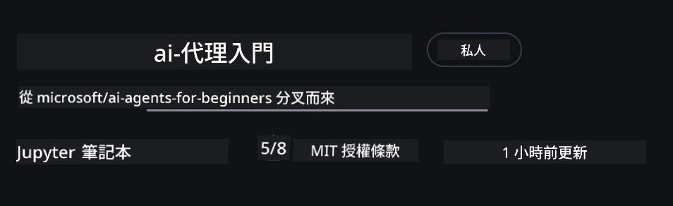
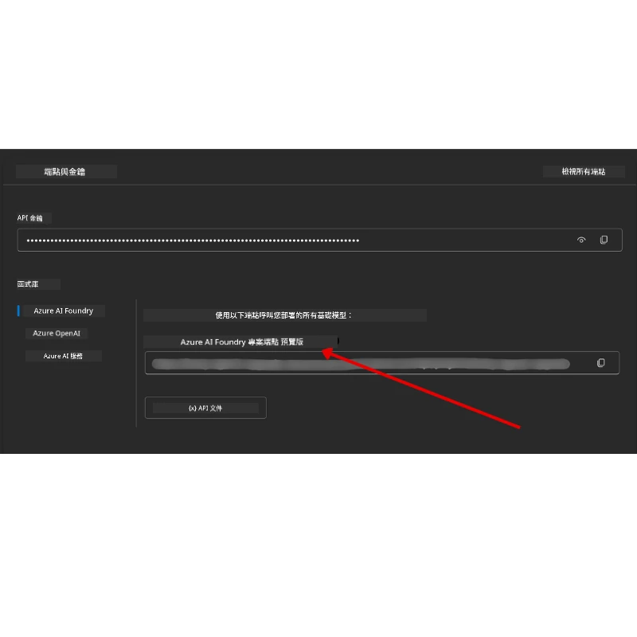

# 課程設定

## 介紹

本課程將介紹如何執行課程中的程式碼範例。

## 加入其他學員並獲得幫助

在開始複製您的存放庫之前，請加入 [AI Agents For Beginners Discord 頻道](https://aka.ms/ai-agents/discord)，以獲得有關設定的協助、課程問題解答，或與其他學員聯繫。

## 複製或 Fork 此存放庫

開始之前，請複製或 Fork GitHub 存放庫。這將建立您自己的課程材料版本，讓您能執行、測試和調整程式碼！

您可以點擊此連結 <a href="https://github.com/microsoft/ai-agents-for-beginners/fork" target="_blank">Fork 存放庫</a> 來做此操作

您現在應該擁有本課程的自有 Fork 版本，如以下連結所示：



### Shallow Clone（推薦用於工作坊 / Codespaces）

  >下載完整歷史和所有檔案時，完整存放庫可能很大（約 3 GB）。如果您只參加工作坊或只需要少數課程資料夾，淺複製（或稀疏複製）會下載更少資料。

#### 快速淺複製 — 簡短歷史，所有檔案

將下方指令中的 `<your-username>` 替換為您的 Fork URL（或如果您偏好，則替換為上游 URL）。

只複製最新提交歷史（下載量小）：

```bash
git clone --depth 1 https://github.com/<your-username>/ai-agents-for-beginners.git
```

複製特定分支：

```bash
git clone --depth 1 --branch <branch-name> https://github.com/<your-username>/ai-agents-for-beginners.git
```

#### 部分（稀疏）複製 — 最少 Blob + 僅選定資料夾

這使用部分複製與稀疏檢出（需要 Git 2.25+，建議使用支援部分複製的現代 Git）：

```bash
git clone --depth 1 --filter=blob:none --sparse https://github.com/<your-username>/ai-agents-for-beginners.git
```

進入存放庫資料夾：

```bash
cd ai-agents-for-beginners
```

指定您需要的資料夾（以下範例展示兩個資料夾）：

```bash
git sparse-checkout set 00-course-setup 01-intro-to-ai-agents
```

複製並確認檔案後，如果您只需要檔案並想釋放空間（沒有 git 歷史），請刪除存放庫元資料（💀不可逆 — 您將失去所有 Git 功能）：

```bash
# zsh/bash
rm -rf .git
```

```powershell
# PowerShell
Remove-Item -Recurse -Force .git
```

#### 使用 GitHub Codespaces（推薦避免本地大量下載）

- 透過 [GitHub UI](https://github.com/codespaces) 為此存放庫建立新的 Codespace。  

- 在新建 Codespace 的終端機中，執行上述淺複製或稀疏複製指令，僅帶入您需要的課程資料夾到 Codespace 工作區。
- 選擇性：在 Codespaces 中複製後，移除 .git 以回收空間（請參閱上述移除指令）。
- 注意：如果您喜歡直接在 Codespaces 打開存放庫（不另外複製），須注意 Codespaces 會構建 devcontainer 環境，可能仍會部署超出您需要的功能。

#### 小撇步

- 如果您想編輯或提交，務必將複製 URL 換成您的 Fork。
- 若日後需要更多歷史或檔案，可抓取或調整稀疏檢出以包含額外資料夾。

## 執行程式碼

本課程提供一系列 Jupyter 筆記本，供您動手體驗構建 AI 代理。

程式碼範例使用 **Microsoft Agent Framework (MAF)** 和 `FoundryChatClient`，後者透過 **Microsoft Foundry** 連接到 **Microsoft Foundry Agent Service V2**（Responses API）。

所有 Python 筆記本檔名均標明為 `*-python-agent-framework.ipynb`。

## 需求

- Python 3.12+
  - <strong>注意</strong>：如果您尚未安裝 Python 3.12，請先安裝。然後使用 python3.12 建立您的虛擬環境，以確保存取 requirements.txt 中的正確版本。
  
    >範例

    建立 Python 虛擬環境目錄：

    ```bash
    python -m venv venv
    ```

    然後啟動相應虛擬環境：

    ```bash
    # zsh/bash
    source venv/bin/activate
    ```
  
    ```dos
    # Command Prompt for Windows
    venv\Scripts\activate
    ```

- .NET 10+：此課程部分範例使用 .NET，請確保您安裝了 [.NET 10 SDK](https://dotnet.microsoft.com/download/dotnet/10.0) 或更新版本。並檢查您已安裝的 .NET SDK 版本：

    ```bash
    dotnet --list-sdks
    ```

- **Azure CLI** — 用於驗證身份。可從 [aka.ms/installazurecli](https://aka.ms/installazurecli) 安裝。
- **Azure 訂閱** — 以存取 Microsoft Foundry 和 Microsoft Foundry Agent Service。
- **Microsoft Foundry 專案** — 擁有已部署模型的專案（如 `gpt-5-mini`）。參見以下 [步驟 1](#步驟-1：建立-microsoft-foundry-專案)。

此存放庫根目錄附有一份 `requirements.txt`，內含執行程式碼範例所需的全部 Python 套件。

您可在終端機中於存放庫根目錄執行以下指令安裝：

```bash
pip install -r requirements.txt
```

建議您建立 Python 虛擬環境，以避免衝突及問題。

## 設定 VSCode

請確保您在 VSCode 中使用正確的 Python 版本。


## 設定 Microsoft Foundry 和 Microsoft Foundry Agent Service

### 步驟 1：建立 Microsoft Foundry 專案

您需要一個 Microsoft Foundry **hub** 和一個含部署模型的 <strong>專案</strong> 才能執行筆記本。

1. 前往 [ai.azure.com](https://ai.azure.com) 並使用您的 Azure 帳戶登入。
2. 建立一個 **hub**（或使用現有的）。詳見：[Hub 資源概覽](https://learn.microsoft.com/azure/ai-foundry/concepts/ai-resources)。
3. 在 hub 中建立一個 <strong>專案</strong>。
4. 從 **Models + Endpoints** → **Deploy model** 部署模型（例如 `gpt-5-mini`）。

### 步驟 2：取得您的專案端點與模型部署名稱

從 Microsoft Foundry 入口網站中的專案：

- <strong>專案端點</strong> — 進入 **Overview** 頁面並複製端點 URL。



- <strong>模型部署名稱</strong> — 進入 **Models + Endpoints**，選擇您部署的模型，並記下 <strong>部署名稱</strong>（例如 `gpt-5-mini`）。

### 步驟 3：使用 `az login` 登入 Azure

多數筆記本透過您的 **Azure CLI 登入** 進行驗證 — 使用 `azure-identity` 套件的 `AzureCliCredential` 或 `DefaultAzureCredential`（兩者均使用您的 `az login` 會話）— 因此不需要 API 金鑰。少數課程和選用整合會使用 API 金鑰；請檢查各課程先決條件是否需額外環境變數。此步驟需您已透過 Azure CLI 登入。

1. 若您尚未安裝 Azure CLI，請安裝： [aka.ms/installazurecli](https://aka.ms/installazurecli)

2. 執行以下指令<strong>登入</strong>：

    ```bash
    az login
    ```

    若您在無瀏覽器的遠端／Codespace 環境中：

    ```bash
    az login --use-device-code
    ```

3. 若提示，<strong>選擇您的訂閱</strong> — 選擇包含您 Foundry 專案的訂閱。

4. <strong>驗證</strong>您的登入狀態：

    ```bash
    az account show
    ```

> **為何要用 `az login`？** 筆記本使用 `azure-identity` 套件中的 `AzureCliCredential`（或同樣會使用您 Azure CLI 登入的 `DefaultAzureCredential`）來驗證。這代表您的 Azure CLI 會話提供憑證 — 不需在 `.env` 檔中使用 API 金鑰或秘密金鑰。這是 [安全最佳實踐](https://learn.microsoft.com/azure/developer/ai/keyless-connections)。

### 步驟 4：建立您的 `.env` 檔案

複製範例檔案：

```bash
# zsh/bash
cp .env.example .env
```

```powershell
# PowerShell
Copy-Item .env.example .env
```

打開 `.env` 並填入以下兩個值：

```env
AZURE_AI_PROJECT_ENDPOINT=https://<your-project>.services.ai.azure.com/api/projects/<your-project-id>
AZURE_AI_MODEL_DEPLOYMENT_NAME=gpt-5-mini
```

| 變數 | 取得位置 |
|----------|-----------------|
| `AZURE_AI_PROJECT_ENDPOINT` | Foundry 入口網站 → 您的專案 → **Overview** 頁面 |
| `AZURE_AI_MODEL_DEPLOYMENT_NAME` | Foundry 入口網站 → **Models + Endpoints** → 您部署模型的名稱 |

大多數課程就完成了！筆記本會透過您的 `az login` 會話自動驗證。

### 步驟 5：安裝 Python 依賴

```bash
pip install -r requirements.txt
```

建議在您先前建立的虛擬環境中執行此指令。

## 選用設定：Azure AI Search（第5及16課）

第 5 課（Agentic RAG）和第 16 課筆記本預設使用 <strong>記憶體內知識庫</strong> 直接運作 — 不需額外 Azure 資源。如欲連結實際 **Azure AI Search** 索引，第 16 課筆記本目前使用基於金鑰的驗證：只有當 `AZURE_SEARCH_SERVICE_ENDPOINT` 和 `AZURE_SEARCH_API_KEY` 兩者皆設置時，才會從記憶體內搜尋切換至 Azure AI Search；否則持續使用記憶體內搜尋 — 因此要對真實索引運作，必須設定管理金鑰。無金鑰（Keyless）驗證搭配 Microsoft Entra ID（RBAC）是您的正式產品程式碼推薦方案，與本課程其它部分使用的 `az login` 流程相符。

下方 RBAC 步驟適用於設定指引範例和您自己的程式碼，不會啟用第 16 課筆記本之金鑰無需驗證；第 16 課仍需端點與管理金鑰啟用 Azure AI Search。

1. **在您的搜尋服務上啟用角色存取控制（RBAC）**：

    ```bash
    az search service update --name <service-name> --resource-group <resource-group> --auth-options aadOrApiKey
    ```

2. <strong>給自己分配所需角色</strong>（建立/載入索引及查詢）：

    ```bash
    az role assignment create --assignee <your-user-or-principal-id> --role "Search Service Contributor" --scope $(az search service show -g <resource-group> -n <service-name> --query id -o tsv)
    az role assignment create --assignee <your-user-or-principal-id> --role "Search Index Data Contributor" --scope $(az search service show -g <resource-group> -n <service-name> --query id -o tsv)
    ```

3. **將端點加入 `.env` 檔案**：

| 變數 | 取得位置 |
|----------|-----------------|
| `AZURE_SEARCH_SERVICE_ENDPOINT` | Azure 入口網站 → 您的 **Azure AI Search** 資源 → **Overview** → URL |
| `AZURE_SEARCH_API_KEY` | 在第 16 課筆記本啟用 Azure AI Search 時需配合端點使用，使用基於金鑰的驗證。Azure 入口網站 → <strong>設定</strong> → <strong>金鑰</strong> → 主要管理金鑰 |

> **為什麼不用金鑰？** 管理金鑰擁有您的搜尋服務完整寫入權限，且可能經由 `.env` 檔洩漏。透過 RBAC，改由您的 `az login` 身分驗證 — 與課程筆記本採用的無金鑰 Entra ID 模式相符（使用 `AzureCliCredential` / `DefaultAzureCredential`）。詳見 [使用角色連接 Azure AI Search](https://learn.microsoft.com/azure/search/search-security-rbac)。

請參閱 [Azure AI Search 設定指南](./AzureSearch.md) 取得 Python 和 .NET 的完整索引建立範例。

## 針對直接呼叫 Azure OpenAI 的課程（第6和8課）額外設定

6、8 課的部分筆記本直接呼叫 **Azure OpenAI**（使用 **Responses API**），而非通過 Microsoft Foundry 專案。這些範例先前使用 GitHub Models，現已淘汰且不支援 Responses API。請將這些變數加入 `.env` 檔案：

| 變數 | 取得位置 |
|----------|-----------------|
| `AZURE_OPENAI_ENDPOINT` | Azure 入口網站 → 您的 **Azure OpenAI** 資源 → <strong>金鑰與端點</strong> → 端點 (如 `https://<your-resource>.openai.azure.com`) |
| `AZURE_OPENAI_DEPLOYMENT` | 您部署支持 Responses API 的模型名稱（如 `gpt-5-mini`） |
| `AZURE_OPENAI_API_KEY` | 選用 — 僅當您用基於金鑰的驗證取代 `az login` / Entra ID 時 |

> Responses API 使用穩定的 `/openai/v1/` 端點，不需 `api-version`。請使用 `az login` 登入以使用無金鑰 Entra ID 驗證。

## 替代服務提供者：MiniMax（OpenAI 兼容）

[MiniMax](https://platform.minimaxi.com/) 提供大上下文模型（最高可達 204K 代幣），並且支援 OpenAI 兼容的 API。由於 Microsoft Agent Framework 的 `OpenAIChatClient` 可以使用任何 OpenAI 兼容的端點，您可用 MiniMax 來替代使用 `OpenAIChatClient` 的課程。

請將以下變數加入 `.env` 檔案：

| 變數 | 取得位置 |
|----------|-----------------|
| `MINIMAX_API_KEY` | [MiniMax 平台](https://platform.minimaxi.com/) → API 金鑰 |
| `MINIMAX_BASE_URL` | 使用 `https://api.minimax.io/v1`（預設值） |
| `MINIMAX_MODEL_ID` | 要使用的模型名稱（例如 `MiniMax-M3`） |

<strong>範例模型</strong>：`MiniMax-M3`（推薦），`MiniMax-M2.7`，`MiniMax-M2.7-highspeed`（較快響應）。模型名稱及可用性可能會變動，且存取權限依帳戶條件決定。

使用 `OpenAIChatClient` 的程式碼範例（例如第 14 課飯店訂房工作流程）在偵測到設定 `MINIMAX_API_KEY` 時會自動使用 MiniMax 設定。


## 替代提供者：Foundry Local（裝置上執行模型）

[Foundry Local](https://foundrylocal.ai) 是一個輕量級的執行環境，可以<strong>完全在您自己的機器上</strong>下載、管理並服務語言模型，並透過相容 OpenAI 的 API 提供服務 — 無需雲端。

因為 Microsoft Agent Framework 的 `OpenAIChatClient` 可與任何相容 OpenAI 的端點一起使用，Foundry Local 是 Azure OpenAI 的本地替代方案。

**1. 安裝 Foundry Local**

```bash
# Windows 作業系統
winget install Microsoft.FoundryLocal

# macOS 系統
brew install foundrylocal
```

**2. 下載並執行模型**（這同時會啟動本地服務）：

```bash
foundry model list          # 查看可用模型
foundry model run phi-4-mini
```

**3. 安裝用於偵測本地端點的 Python SDK：**

```bash
pip install foundry-local-sdk
```

**4. 指定 Microsoft Agent Framework 使用您的本地模型：**

```python
from foundry_local import FoundryLocalManager
from agent_framework.openai import OpenAIChatClient

# 本地下載（如有需要）並提供模型服務，然後發現端點/埠口。
manager = FoundryLocalManager("phi-4-mini")

chat_client = OpenAIChatClient(
    base_url=manager.endpoint,      # 例如 http://localhost:<port>/v1
    api_key=manager.api_key,        # Foundry Local 總是「不需要」
    model_id=manager.get_model_info("phi-4-mini").id,
)

agent = chat_client.as_agent(
    name="LocalAgent",
    instructions="You are a helpful assistant running fully on-device.",
)
```

> **注意：** Foundry Local 提供一個相容 OpenAI 的 **Chat Completions** 端點。請用於本地開發與離線場景。若需要完整的 **Responses API** 功能集（有狀態對話等），請使用 Azure OpenAI 或 Microsoft Foundry 專案。

## 第 8 課額外設定（Bing Grounding 工作流程）

第 8 課中的條件工作流程筆記本使用 Microsoft Foundry 透過 **Bing grounding**。如果您打算執行該範例，請將此變數加入您的 `.env` 檔案：

| 變數 | 取得位置 |
|----------|-----------------|
| `BING_CONNECTION_ID` | Microsoft Foundry 入口網站 → 您的專案 → <strong>管理</strong> → <strong>連接資源</strong> → 您的 Bing 連線 → 複製連線 ID |

## 疑難排解

### macOS 上的 SSL 憑證驗證錯誤

如果您使用 macOS，並遇到類似以下錯誤：

```plaintext
ssl.SSLCertVerificationError: [SSL: CERTIFICATE_VERIFY_FAILED] certificate verify failed: self-signed certificate in certificate chain
```

這是 macOS 上 Python 的已知問題，系統 SSL 憑證不會自動被信任。請依序嘗試以下解決方案：

**選項 1：執行 Python 的 Install Certificates 腳本（推薦）**

```bash
# 將 3.XX 替換為您安裝的 Python 版本（例如，3.12 或 3.13）：
/Applications/Python\ 3.XX/Install\ Certificates.command
```

**選項 2：在您的筆記本中使用 `connection_verify=False`（僅適用於 GitHub Models 筆記本）**

在第 6 課筆記本（`06-building-trustworthy-agents/code_samples/06-system-message-framework.ipynb`）中，已有一段註解掉的解決方法。當您遇到憑證錯誤時，請取消註解 `connection_verify=False`：

```python
client = ChatCompletionsClient(
    endpoint=endpoint,
    credential=AzureKeyCredential(token),
    connection_verify=False,  # 如果遇到憑證錯誤，請停用 SSL 驗證
)
```

> **⚠️ 警告：** 禁用 SSL 驗證（`connection_verify=False`）會透過跳過憑證檢查來降低安全性。此做法僅適用於開發環境的臨時解決方案，絕不可用於生產環境。

**選項 3：安裝並使用 `truststore`**

```bash
pip install truststore
```

然後在您的筆記本或腳本頂端，在執行任何網路呼叫之前加入以下程式碼：

```python
import truststore
truststore.inject_into_ssl()
```

## 卡住了嗎？

如果您在設定過程中遇到任何問題，歡迎加入我們的<a href="https://discord.gg/kzRShWzttr" target="_blank">Azure AI 社群 Discord</a>，或<a href="https://github.com/microsoft/ai-agents-for-beginners/issues?WT.mc_id=academic-105485-koreyst" target="_blank">建立一個問題單</a>。

## 下一課程

您現在已準備好執行本課程程式碼。祝您在 AI 代理人的世界中學習愉快！

[AI 代理人入門及使用案例](../01-intro-to-ai-agents/README.md)

---

<!-- CO-OP TRANSLATOR DISCLAIMER START -->
**免責聲明**：
此文件已使用 AI 翻譯服務 [Co-op Translator](https://github.com/Azure/co-op-translator) 進行翻譯。雖然我們努力追求準確性，但請注意自動翻譯可能包含錯誤或不準確之處。原始文件的母語版本應視為權威來源。對於關鍵資訊，建議採用專業人工翻譯。我們不對因使用此翻譯所產生的任何誤解或誤譯承擔責任。
<!-- CO-OP TRANSLATOR DISCLAIMER END -->