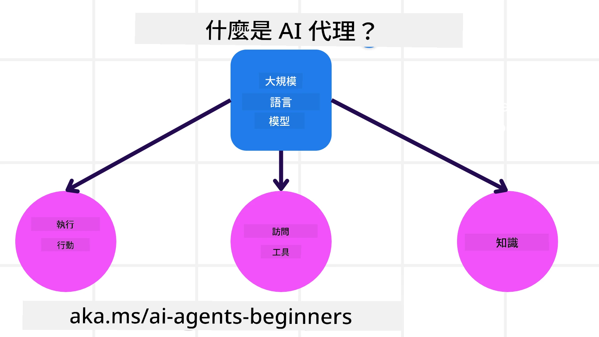
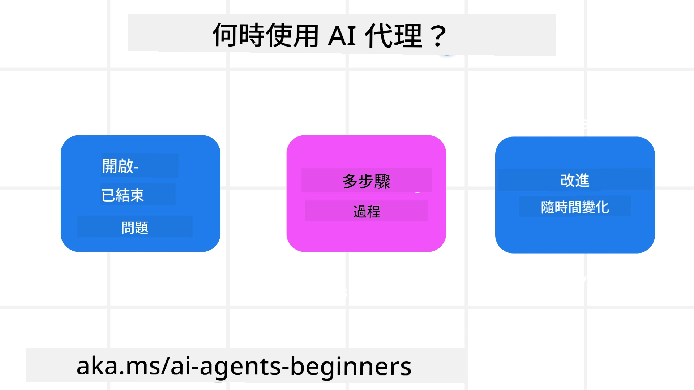

> _(點擊上方圖片以觀看本課程的影片)_

# AI 代理人與代理用例介紹

歡迎參加「AI 代理人入門」課程！本課程提供建構 AI 代理人之基本知識與應用範例。

加入 <a href="https://discord.gg/kzRShWzttr" target="_blank">Azure AI Discord 社群</a>，與其他學習者及 AI 代理人開發者交流，並提出你對本課程的任何問題。

開始本課程前，我們先更了解 AI 代理人是什麼，以及如何在我們建構的應用程式與工作流程中使用它們。

## 介紹

本課程涵蓋：

- 什麼是 AI 代理人以及不同類型的代理人有哪些？
- 哪些使用案例最適合使用 AI 代理人，以及它們如何協助我們？
- 在設計代理式解決方案時，基本的構建要素有哪些？

## 學習目標
完成本課後，你應該能夠：

- 理解 AI 代理人的概念以及它們與其他 AI 解決方案的差異。
- 有效率地應用 AI 代理人。
- 為使用者與客戶設計具生產力的代理式解決方案。

## 定義 AI 代理人與 AI 代理人的類型

### 什麼是 AI 代理人？

AI 代理人是能夠讓 **大型語言模型(LLMs)** 透過賦予 **工具存取權** 與 **知識** 來擴展其能力、從而**執行動作**的**系統**。

讓我們把此定義拆解成較小的部分：

- **系統** - 想像代理人時，不應只視為單一元件，而應視為由多個元件組成的系統。基本層級上，AI 代理人的元件包括：
  - **環境** - AI 代理人運作的定義空間。例如，若我們有一個旅遊訂票的 AI 代理人，環境就可能是該代理人用來完成任務的旅遊訂票系統。
  - **感測器** - 環境包含資訊並提供回饋。AI 代理人使用感測器來收集並解讀這些關於環境當前狀態的資訊。在旅遊訂票代理人的例子中，訂票系統可以提供像是飯店是否有空房或航班價格等資訊。
  - **執行器** - 一旦 AI 代理人接收到環境的當前狀態，針對當前任務，代理人會決定要執行何種動作以改變環境。對於旅遊訂票代理人，可能的動作是為使用者訂下一間可用的房間。

**大型語言模型** - 代理人的概念在 LLMs 出現之前就已存在。以 LLMs 建構 AI 代理人的優勢在於它們能解讀人類語言與資料。這項能力使 LLMs 能夠解讀環境資訊並擬定改變環境的計畫。

**執行動作** - 在 AI 代理人系統之外，LLMs 的行為通常侷限於根據使用者提示產生內容或資訊。在 AI 代理人系統內，LLMs 可以透過解讀使用者的請求並使用環境中可用的工具來完成任務。

**工具存取** - LLM 可存取的工具由 1) 其運作的環境以及 2) AI 代理人開發者所定義。以旅遊代理人的例子，代理人可使用的工具受限於訂票系統可用的操作，且開發者也可限制代理人只能存取航班相關工具。

**記憶 + 知識** - 在使用者與代理人的對話情境中，記憶可以是短期的。長期來看，除了環境提供的資訊外，AI 代理人也能從其他系統、服務、工具，甚至其他代理人檢索知識。在旅遊代理人的例子中，這些知識可能是儲存在客戶資料庫中、關於使用者旅遊偏好的資訊。

### 不同類型的代理人

既然我們已對 AI 代理人有了概略定義，讓我們來看看一些特定的代理人類型，以及它們如何應用於旅遊訂票的 AI 代理人。

| **代理人類型**                | **描述**                                                                                                                       | **範例**                                                                                                                                                                                                                   |
| ----------------------------- | ------------------------------------------------------------------------------------------------------------------------------------- | ----------------------------------------------------------------------------------------------------------------------------------------------------------------------------------------------------------------------------- |
| **簡單反射型代理**      | 根據預定義規則執行即時動作。                                                                                  | 旅遊代理人解讀電子郵件的上下文，並將旅遊抱怨轉交給客服。                                                                                                                          |
| **基於模型的反射型代理** | 根據世界模型及其變化執行動作。                                                              | 旅遊代理人根據可取得的歷史價格資料，優先處理價格變動顯著的路線。                                                                                                             |
| **目標導向代理**         | 透過解讀目標並決定達成目標的動作來制定計畫。                                  | 旅遊代理人會透過判斷從目前位置到目的地所需的交通安排（汽車、大眾運輸、航班）來預訂行程。                                                                                |
| **效用型代理**      | 考量偏好並以數值方式衡量取捨以決定如何達成目標。                                               | 旅遊代理人在訂票時透過權衡便利性與成本以最大化效用。                                                                                                                                          |
| **學習型代理**           | 透過回應回饋並相應地調整動作來隨時間改進。                                                        | 旅遊代理人透過使用旅後調查的客戶回饋來改善並對未來預訂做出調整。                                                                                                               |
| **階層式代理**       | 在分層系統中包含多個代理，高階代理將任務拆分成子任務，由低階代理去完成。 | 旅遊代理人取消行程時會把任務拆分為子任務（例如取消特定預訂），並由低階代理完成，然後回報給高階代理。                                     |
| **多代理系統 (MAS)** | 代理人獨立完成任務，可以是合作或競爭方式。                                                           | 合作：多個代理人各自預訂特定的旅遊服務，例如飯店、航班與娛樂。競爭：多個代理人管理並競爭共用的飯店訂房行事曆，以將顧客訂入飯店。 |

## 何時使用 AI 代理人

在先前章節中，我們使用旅遊代理人的使用情境來說明不同類型的代理人如何應用於旅遊訂票的各種情境。我們將在整個課程中持續使用此範例。

讓我們來看看最適合使用 AI 代理人的使用案例類型：

- **開放式問題** - 允許 LLM 判斷完成任務所需的步驟，因為這些步驟無法總是以硬編碼方式寫入工作流程。
- **多步驟流程** - 需要一定複雜度的任務，AI 代理人需在多個回合中使用工具或資訊，而非一次性檢索。  
- **隨時間改進** - 代理人能透過來自環境或使用者的回饋隨時間進步，從而提供更佳的效用。

我們會在「建立值得信賴的 AI 代理人」課程中介紹更多使用 AI 代理人的考量。

## 代理式解決方案基礎

### 代理開發

設計 AI 代理人系統的第一步是定義工具、動作與行為。在本課程中，我們著重使用 **Azure AI Agent Service** 來定義我們的代理人。它提供的功能包括：

- 可選擇的開放模型，例如 OpenAI、Mistral 與 Llama
- 透過供應者（如 Tripadvisor）使用授權資料
- 使用標準化的 OpenAPI 3.0 工具

### 代理式模式

與 LLM 的溝通是透過提示（prompts）。鑑於 AI 代理人的半自主性質，在環境改變後並不總是可能或必要去手動重新提示 LLM。我們使用能讓我們以更具擴充性的方式在多個步驟中提示 LLM 的 **代理式模式**。

本課程分為幾個當前流行的代理式模式。

### 代理式框架

代理式框架允許開發者透過程式碼實作代理式模式。這些框架提供範本、外掛與工具，以促進更好的 AI 代理人協作。這些優勢也能強化對 AI 代理人系統的可觀察性與除錯能力。

在本課程中，我們將探索用於建構生產就緒 AI 代理人的 Microsoft Agent Framework (MAF)。

## 範例程式碼

- Python: [代理框架](./code_samples/01-python-agent-framework.ipynb)
- .NET: [代理框架](./code_samples/01-dotnet-agent-framework.md)

## 對 AI 代理人還有更多疑問嗎？

加入 [Microsoft Foundry Discord 社群](https://aka.ms/ai-agents/discord)，與其他學習者交流、參加辦公時段，並獲得 AI 代理人相關問題的解答。

## 前一課

[課程設定](../00-course-setup/README.md)

## 下一課

[探索代理式框架](../02-explore-agentic-frameworks/README.md)

---

<!-- CO-OP TRANSLATOR DISCLAIMER START -->
**免責聲明**：
本文件已使用 AI 翻譯服務 [Co-op Translator](https://github.com/Azure/co-op-translator) 進行翻譯。雖然我們力求準確，但請注意自動翻譯可能包含錯誤或不準確之處。原始語言版本的文件應視為具權威性的來源。對於重要資訊，建議採用專業人工翻譯。我們不對因使用本翻譯所導致的任何誤解或曲解承擔責任。
<!-- CO-OP TRANSLATOR DISCLAIMER END -->