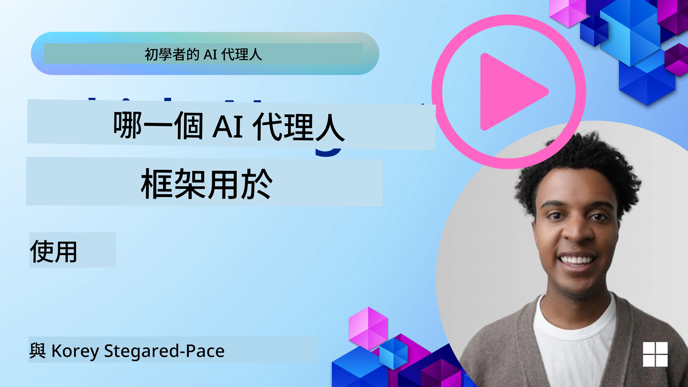

[](https://youtu.be/ODwF-EZo_O8?si=1xoy_B9RNQfrYdF7)

> _(點擊上方圖片以觀看本課程的影片)_

# 探索 AI 代理框架

AI 代理框架是設計用來簡化 AI 代理的建立、部署與管理之軟體平台。這些框架提供開發者預先建置的元件、抽象層與工具，能使開發複雜 AI 系統的流程更流暢。

這些框架透過對常見 AI 代理開發挑戰提供標準化的方法，幫助開發者專注在其應用的獨特面向，並提升系統的可擴展性、可及性與效能。

## 介紹 

本課程將涵蓋：

- 什麼是 AI 代理框架，以及它們讓開發者能達成什麼目標？
- 團隊如何利用這些框架快速建立原型、反覆迭代並改善代理的能力？
- 由微軟建立的框架與工具（<a href="https://aka.ms/ai-agents-beginners/ai-agent-service" target="_blank">Azure AI 代理服務</a> 與 <a href="https://learn.microsoft.com/azure/ai-services/openai/how-to/responses" target="_blank">Microsoft 代理框架</a>）之間有何差異？
- 我能否直接整合現有的 Azure 生態系工具，還是需要獨立解決方案？
- 什麼是 Azure AI Agent Service，以及它如何對我有幫助？

## 學習目標

本課程的目標是協助你理解：

- AI 代理框架在 AI 開發中的角色。
- 如何運用 AI 代理框架來構建智慧代理。
- AI 代理框架所啟用的關鍵能力。
- Microsoft 代理框架與 Azure AI 代理服務之間的差異。

## 什麼是 AI 代理框架，以及它們能讓開發者做什麼？

傳統的 AI 框架可以協助你將 AI 整合到應用程式中，並在以下方面提升應用程式：

- **個人化**：AI 能分析使用者行為與偏好，提供個人化的推薦、內容與體驗。
範例：像 Netflix 這類串流服務利用 AI 根據觀影歷史推薦電影與節目，提升使用者互動與滿意度。
- **自動化與效率**：AI 可自動化重複性工作、精簡工作流程並提升營運效率。
範例：客服應用使用 AI 驅動的聊天機器人來處理常見詢問，縮短回應時間並釋放真人客服處理更複雜的問題。
- **強化使用者體驗**：AI 可透過語音辨識、自然語言處理與預測文字等智慧功能提升整體使用者體驗。
範例：像 Siri 與 Google Assistant 的虛擬助理使用 AI 理解並回應語音指令，讓使用者更容易與裝置互動。

### 聽起來很棒，那為什麼我們還需要 AI 代理框架？

AI 代理框架不只是一般的 AI 框架。它們被設計來建立能與使用者、其他代理與環境互動、以達成特定目標的智慧代理。這些代理能表現出自主行為、做決策，並適應變化的條件。以下是 AI 代理框架所啟用的一些關鍵能力：

- **代理協作與協調**：支援建立多個可以共同工作、溝通與協調以解決複雜任務的 AI 代理。
- **任務自動化與管理**：提供機制以自動化多步驟工作流程、任務委派與代理間的動態任務管理。
- **情境理解與適應**：賦予代理理解情境、適應變化環境，並根據即時資訊做出決策的能力。

總結來說，代理讓你能做更多事，將自動化提升到下一個層次，並建立能從環境中適應與學習的更智慧系統。

## 如何快速建立原型、反覆迭代並改善代理的能力？

這是一個快速演進的領域，但在大多數 AI 代理框架中，有些共通要素能幫助你快速建立原型並反覆迭代，主要包括模組化元件、協作工具與即時學習。以下深入說明：

- **使用模組化元件**：AI SDK 提供預先建置的元件，如 AI 與記憶體連接器、以自然語言或程式碼外掛進行函式呼叫、提示範本等。
- **善用協作工具**：為代理設計特定角色與任務，使其能測試並優化協作工作流程。
- **即時學習**：實作反饋迴路，使代理從互動中學習並動態調整其行為。

### 使用模組化元件

像 Microsoft 代理框架 這類的 SDK 提供預建元件，如 AI 連接器、工具定義與代理管理。

**團隊如何使用這些元件**：團隊可以快速組裝這些元件以建立一個功能性原型，而不需要從零開始，從而允許快速實驗與迭代。

**實作方式**：你可以使用預建的解析器來從使用者輸入中擷取資訊，使用記憶模組來儲存與擷取資料，並使用提示生成器與使用者互動，所有這些都無需你從頭構建這些元件。

**範例程式碼**. 下面看一個如何使用 Microsoft 代理框架 與 `AzureAIProjectAgentProvider` 讓模型以工具呼叫回應使用者輸入的範例：

``` python
# 微軟代理框架 Python 範例

import asyncio
import os
from typing import Annotated

from agent_framework.azure import AzureAIProjectAgentProvider
from azure.identity import AzureCliCredential


# 定義一個範例工具函數來預訂旅行
def book_flight(date: str, location: str) -> str:
    """Book travel given location and date."""
    return f"Travel was booked to {location} on {date}"


async def main():
    provider = AzureAIProjectAgentProvider(credential=AzureCliCredential())
    agent = await provider.create_agent(
        name="travel_agent",
        instructions="Help the user book travel. Use the book_flight tool when ready.",
        tools=[book_flight],
    )

    response = await agent.run("I'd like to go to New York on January 1, 2025")
    print(response)
    # 範例輸出：您的 2025 年 1 月 1 日飛往紐約的航班已成功預訂。祝旅途愉快！✈️🗽


if __name__ == "__main__":
    asyncio.run(main())
```

你可以從此範例看到如何利用預建的解析器從使用者輸入擷取關鍵資訊，例如航班預訂請求的出發地、目的地與日期。這種模組化方法讓你可以專注在高層邏輯上。

### 利用協作工具

像 Microsoft 代理框架 這類框架促進建立能彼此協作的多個代理。

**團隊如何使用這些**：團隊可以設計具有特定角色與任務的代理，使其能測試與精進協作工作流程並提升整體系統效率。

**實作方式**：你可以建立一個代理團隊，每個代理具有專門職能，例如資料擷取、分析或決策。這些代理可以互相通訊並共享資訊，以達成共同目標，例如回答使用者查詢或完成任務。

**範例程式碼 (Microsoft Agent Framework)**：

```python
# 使用 Microsoft Agent Framework 創建多個協同工作的代理

import os
from agent_framework.azure import AzureAIProjectAgentProvider
from azure.identity import AzureCliCredential

provider = AzureAIProjectAgentProvider(credential=AzureCliCredential())

# 數據檢索代理
agent_retrieve = await provider.create_agent(
    name="dataretrieval",
    instructions="Retrieve relevant data using available tools.",
    tools=[retrieve_tool],
)

# 數據分析代理
agent_analyze = await provider.create_agent(
    name="dataanalysis",
    instructions="Analyze the retrieved data and provide insights.",
    tools=[analyze_tool],
)

# 依序執行代理處理任務
retrieval_result = await agent_retrieve.run("Retrieve sales data for Q4")
analysis_result = await agent_analyze.run(f"Analyze this data: {retrieval_result}")
print(analysis_result)
```

在前面的程式碼中，你可以看到如何建立一個涉及多個代理共同分析資料的任務。每個代理執行特定功能，任務透過協調這些代理來達成預期結果。透過建立具有專門角色的專屬代理，你可以提升任務效率與效能。

### 即時學習

進階框架提供即時情境理解與適應的能力。

**團隊如何使用這些**：團隊可以實作反饋迴路，使代理從互動中學習並動態調整其行為，導致能力的持續改進與精進。

**實作方式**：代理可以分析使用者反饋、環境資料與任務結果來更新其知識庫、調整決策演算法，並隨時間改進效能。這種反覆的學習過程使代理能適應變化的條件與使用者偏好，提升整體系統效能。

## Microsoft 代理框架 與 Azure AI 代理服務 之間有何差異？

有很多方式可以比較這些方法，但讓我們從設計、功能與目標使用情境來看幾個關鍵差異：

## Microsoft 代理框架 (MAF)

Microsoft 代理框架 提供一個精簡的 SDK，用於使用 `AzureAIProjectAgentProvider` 構建 AI 代理。它使開發者能建立利用 Azure OpenAI 模型、具備內建工具呼叫、對話管理，以及透過 Azure 身分識別提供企業級安全性的代理。

**使用情境**：建立具備工具使用、多步驟工作流程與企業整合場景的生產就緒 AI 代理。

以下是 Microsoft 代理框架 的一些重要核心概念：

- **代理 (Agents)**. 代理是透過 `AzureAIProjectAgentProvider` 建立，並以名稱、指示與工具進行設定。代理可以：
  - **處理使用者訊息** 並使用 Azure OpenAI 模型產生回應。
  - **根據對話情境自動呼叫工具**。
  - **在多次互動中維持對話狀態**。

  這裡是一個示範如何建立代理的程式碼片段：

    ```python
    import os
    from agent_framework.azure import AzureAIProjectAgentProvider
    from azure.identity import AzureCliCredential

    provider = AzureAIProjectAgentProvider(credential=AzureCliCredential())
    agent = await provider.create_agent(
        name="my_agent",
        instructions="You are a helpful assistant.",
    )

    response = await agent.run("Hello, World!")
    print(response)
    ```

- **工具 (Tools)**. 該框架支援將工具定義為代理可自動呼叫的 Python 函式。工具會在建立代理時註冊：

    ```python
    def get_weather(location: str) -> str:
        """Get the current weather for a location."""
        return f"The weather in {location} is sunny, 72\u00b0F."

    agent = await provider.create_agent(
        name="weather_agent",
        instructions="Help users check the weather.",
        tools=[get_weather],
    )
    ```

- **多代理協調 (Multi-Agent Coordination)**. 你可以建立多個具不同專長的代理並協調它們的工作：

    ```python
    planner = await provider.create_agent(
        name="planner",
        instructions="Break down complex tasks into steps.",
    )

    executor = await provider.create_agent(
        name="executor",
        instructions="Execute the planned steps using available tools.",
        tools=[execute_tool],
    )

    plan = await planner.run("Plan a trip to Paris")
    result = await executor.run(f"Execute this plan: {plan}")
    ```

- **Azure 身分整合**. 該框架使用 `AzureCliCredential`（或 `DefaultAzureCredential`）以安全、無需金鑰的方式進行驗證，免除直接管理 API 金鑰的需求。

## Azure AI 代理服務

Azure AI 代理服務 是較新的補充服務，於 Microsoft Ignite 2024 推出。它允許使用更彈性的模型來開發與部署 AI 代理，例如直接呼叫開源的 LLM，如 Llama 3、Mistral 與 Cohere。

Azure AI 代理服務 提供更強的企業安全機制與資料儲存方法，使其適合用於企業應用。

它與 Microsoft 代理框架 開箱即用地協同運作，以用於建構與部署代理。

此服務目前處於公眾預覽（Public Preview），並支援使用 Python 與 C# 來構建代理。

使用 Azure AI 代理服務 的 Python SDK，我們可以建立一個具有自訂工具的代理：

```python
import asyncio
from azure.identity import DefaultAzureCredential
from azure.ai.projects import AIProjectClient

# 定義工具函數
def get_specials() -> str:
    """Provides a list of specials from the menu."""
    return """
    Special Soup: Clam Chowder
    Special Salad: Cobb Salad
    Special Drink: Chai Tea
    """

def get_item_price(menu_item: str) -> str:
    """Provides the price of the requested menu item."""
    return "$9.99"


async def main() -> None:
    credential = DefaultAzureCredential()
    project_client = AIProjectClient.from_connection_string(
        credential=credential,
        conn_str="your-connection-string",
    )

    agent = project_client.agents.create_agent(
        model="gpt-4o-mini",
        name="Host",
        instructions="Answer questions about the menu.",
        tools=[get_specials, get_item_price],
    )

    thread = project_client.agents.create_thread()

    user_inputs = [
        "Hello",
        "What is the special soup?",
        "How much does that cost?",
        "Thank you",
    ]

    for user_input in user_inputs:
        print(f"# User: '{user_input}'")
        message = project_client.agents.create_message(
            thread_id=thread.id,
            role="user",
            content=user_input,
        )
        run = project_client.agents.create_and_process_run(
            thread_id=thread.id, agent_id=agent.id
        )
        messages = project_client.agents.list_messages(thread_id=thread.id)
        print(f"# Agent: {messages.data[0].content[0].text.value}")


if __name__ == "__main__":
    asyncio.run(main())
```

### 核心概念

Azure AI 代理服務 有以下核心概念：

- **代理 (Agent)**. Azure AI 代理服務 與 Microsoft Foundry 整合。在 AI Foundry 中，AI 代理扮演一個可用於回答問題（RAG）、執行動作或完全自動化工作流程的「智慧」微服務。它透過將生成式 AI 模型的能力與允許其存取並與真實世界資料來源互動的工具結合來達成目的。以下是一個代理的範例：

    ```python
    agent = project_client.agents.create_agent(
        model="gpt-4o-mini",
        name="my-agent",
        instructions="You are helpful agent",
        tools=code_interpreter.definitions,
        tool_resources=code_interpreter.resources,
    )
    ```

    在此範例中，使用模型 `gpt-4o-mini`、名稱 `my-agent`、以及指示 `You are helpful agent` 建立了一個代理。該代理配備了工具與資源以執行程式碼解釋任務。

- **線程與訊息 (Thread and messages)**. 線程是另一個重要概念。它代表代理與使用者之間的對話或互動。線程可用來追蹤對話進度、儲存情境資訊與管理互動的狀態。以下是一個線程的範例：

    ```python
    thread = project_client.agents.create_thread()
    message = project_client.agents.create_message(
        thread_id=thread.id,
        role="user",
        content="Could you please create a bar chart for the operating profit using the following data and provide the file to me? Company A: $1.2 million, Company B: $2.5 million, Company C: $3.0 million, Company D: $1.8 million",
    )
    
    # Ask the agent to perform work on the thread
    run = project_client.agents.create_and_process_run(thread_id=thread.id, agent_id=agent.id)
    
    # Fetch and log all messages to see the agent's response
    messages = project_client.agents.list_messages(thread_id=thread.id)
    print(f"Messages: {messages}")
    ```

    在前面的程式碼中，建立了一個線程。接著，向該線程發送了一則訊息。透過呼叫 `create_and_process_run`，代理被要求在該線程上執行工作。最後，將訊息擷取並記錄以查看代理的回應。這些訊息顯示使用者與代理之間對話的進展。也重要的是要了解，訊息可以有不同類型，例如文字、影像或檔案，這代表代理的工作可能產生例如影像或文字回應。作為開發者，你可以利用這些資訊進一步處理回應或將其呈現給使用者。

- **與 Microsoft 代理框架 整合**. Azure AI 代理服務 可與 Microsoft 代理框架 無縫合作，這代表你可以使用 `AzureAIProjectAgentProvider` 建立代理，並透過代理服務將它們部署到生產環境。

**使用情境**：Azure AI 代理服務 適合需要安全、可擴展與彈性 AI 代理部署的企業應用。

## 這些方法之間的差別是什麼？
 
確實聽起來有重疊，但在設計、功能與目標使用情境方面仍有一些關鍵差異：
 
- **Microsoft 代理框架 (MAF)**：是一個用於建立 AI 代理的生產就緒 SDK。它提供一個精簡的 API，用於建立具工具呼叫、對話管理與 Azure 身分整合的代理。
- **Azure AI 代理服務**：是一個在 Azure Foundry 中的代理平台與部署服務。它提供內建連接到像 Azure OpenAI、Azure AI Search、Bing Search 與程式碼執行等服務的功能。
 
還是不確定該選哪一種？

### 使用情境
 
讓我們透過一些常見使用情境來協助你決定：
 
> Q: I'm building production AI agent applications and want to get started quickly
>
>A: The Microsoft Agent Framework is a great choice. It provides a simple, Pythonic API via `AzureAIProjectAgentProvider` that lets you define agents with tools and instructions in just a few lines of code.
 
>Q: I need enterprise-grade deployment with Azure integrations like Search and code execution
>
> A: Azure AI Agent Service is the best fit. It's a platform service that provides built-in capabilities for multiple models, Azure AI Search, Bing Search and Azure Functions. It makes it easy to build your agents in the Foundry Portal and deploy them at scale.
 
> Q: I'm still confused, just give me one option
>
> A: Start with the Microsoft Agent Framework to build your agents, and then use Azure AI Agent Service when you need to deploy and scale them in production. This approach lets you iterate quickly on your agent logic while having a clear path to enterprise deployment.
 
Let's summarize the key differences in a table:

| Framework | Focus | Core Concepts | Use Cases |
| --- | --- | --- | --- |
| Microsoft Agent Framework | 精簡的代理 SDK，支援工具呼叫 | 代理、工具、Azure 身分識別 | 建構 AI 代理、工具使用、多步驟工作流程 |
| Azure AI Agent Service | 彈性模型、企業安全、程式碼生成功能、工具呼叫 | 模組化、協作、流程編排 | 安全、可擴展且具彈性的 AI 代理部署 |

## 我能否直接整合現有的 Azure 生態系工具，還是需要獨立解決方案？
答案是肯定的，你可以將現有的 Azure 生態系統工具直接整合到 Azure AI Agent Service，特別是因為它已被設計為能與其他 Azure 服務無縫協作。例如，你可以整合 Bing、Azure AI Search 和 Azure Functions。它也與 Microsoft Foundry 有深度整合。

The Microsoft Agent Framework also integrates with Azure services through `AzureAIProjectAgentProvider` and Azure identity, letting you call Azure services directly from your agent tools.

## 範例程式碼

- Python: [代理框架](./code_samples/02-python-agent-framework.ipynb)
- .NET: [代理框架](./code_samples/02-dotnet-agent-framework.md)

## 對 AI 代理框架有更多問題嗎？

加入 [Microsoft Foundry Discord](https://aka.ms/ai-agents/discord) 與其他學習者交流、參加辦公時段並讓你的 AI Agents 問題獲得解答。

## 參考資料

- <a href="https://techcommunity.microsoft.com/blog/azure-ai-services-blog/introducing-azure-ai-agent-service/4298357" target="_blank">Azure Agent 服務</a>
- <a href="https://learn.microsoft.com/azure/ai-services/openai/how-to/responses" target="_blank">Microsoft Agent Framework - Azure OpenAI 回應</a>
- <a href="https://learn.microsoft.com/azure/ai-services/agents/overview" target="_blank">Azure AI Agent 服務</a>

## 前一課

[AI 代理與使用案例簡介](../01-intro-to-ai-agents/README.md)

## 下一課

[理解代理式設計模式](../03-agentic-design-patterns/README.md)

---

<!-- CO-OP TRANSLATOR DISCLAIMER START -->
**免責聲明**：
本文件已使用 AI 翻譯服務 [Co-op Translator](https://github.com/Azure/co-op-translator) 進行翻譯。雖然我們力求翻譯準確，但請注意自動翻譯可能含有錯誤或不精確之處。原始文件之原文應被視為具權威性的版本。對於重要資訊，建議採用專業人工翻譯。我們不對因使用本翻譯而引起之任何誤解或誤釋負責。
<!-- CO-OP TRANSLATOR DISCLAIMER END -->