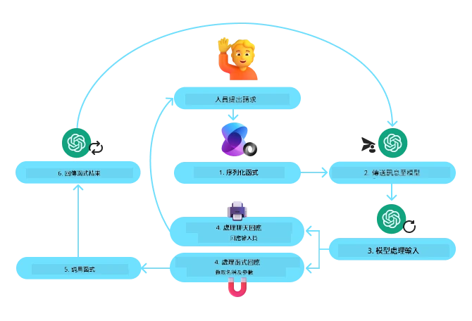
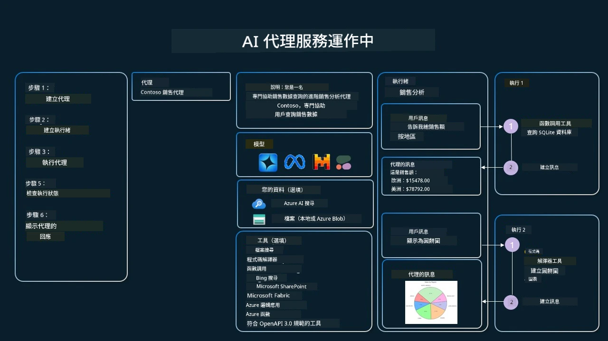

[](https://youtu.be/vieRiPRx-gI?si=cEZ8ApnT6Sus9rhn)

> _(點擊上方圖片觀看本課程影片)_

# 工具使用設計模式

工具很有趣，因為它們讓 AI 代理人具備更廣泛的能力。代理人不再只有有限的一組可執行動作，透過加入工具，代理人現在可以執行更廣泛的各種動作。在本章中，我們將探討工具使用設計模式，說明 AI 代理人如何使用特定工具來達成目標。

## 介紹

在本課程中，我們將回答以下問題：

- 什麼是工具使用設計模式？
- 它可以應用於哪些使用案例？
- 實作此設計模式需要哪些元素/構建模組？
- 使用工具使用設計模式來打造值得信賴的 AI 代理人時有哪些特別的考量？

## 學習目標

完成本課程後，您將能夠：

- 定義工具使用設計模式及其目的。
- 識別適用於工具使用設計模式的使用案例。
- 了解實作該設計模式所需的關鍵元素。
- 辨識使用此設計模式確保 AI 代理人值得信賴的考量點。

## 什麼是工具使用設計模式？

**工具使用設計模式**專注於賦予大型語言模型（LLMs）與外部工具互動的能力，以達成特定目標。工具是可由代理人執行的程式碼，用以完成某些動作。工具可以是簡單的函數，如計算機，或者是對第三方服務的 API 呼叫，例如查詢股價或天氣預報。在 AI 代理人上下文中，工具設計用於由代理人根據**模型產生的函數呼叫**來執行。

## 它可以應用於哪些使用案例？

AI 代理人可以利用工具完成複雜任務、檢索資訊或做出決策。工具使用設計模式常用於需要與外部系統動態互動的情境，例如資料庫、網路服務或程式碼解譯器。此能力適用於多種不同的使用案例，包括：

- **動態資訊檢索：**代理人能查詢外部 API 或資料庫以獲取最新資料（例如查詢 SQLite 資料庫進行資料分析，抓取股價或天氣資訊）。
- **程式碼執行與解譯：**代理人可以執行程式碼或腳本來解決數學問題、產生報告或執行模擬。
- **工作流程自動化：**透過整合排程工具、電子郵件服務或資料管線，來自動化重複或多步驟的工作流程。
- **客戶支援：**代理人可與 CRM 系統、工單平台或知識庫互動以解決用戶提問。
- **內容生成與編輯：**代理人可以使用文法檢查器、文本摘要器或內容安全評估工具來協助內容創作。

## 實作工具使用設計模式需要哪些元素/構建模組？

這些構建模組讓 AI 代理人能執行多樣任務。讓我們來看看實作工具使用設計模式的關鍵元素：

- **函數/工具結構定義（Schemas）**：詳細定義可用工具，包括函數名稱、目的、所需參數及預期輸出。這些結構定義讓 LLM 理解可用工具及如何建立有效請求。

- **函數執行邏輯**：主控何時及如何根據使用者意圖及對話上下文調用工具。可能包含規劃器模組、路由機制或條件流程，以動態決定工具使用。

- **訊息處理系統**：管理使用者輸入、LLM 回應、工具呼叫及工具輸出間的對話流程。

- **工具整合架構**：連結代理人與各種工具的基礎架構，無論是簡單函數或複雜外部服務。

- **錯誤處理與驗證**：機制用於處理工具執行失敗、驗證參數及管理非預期回應。

- **狀態管理**：追蹤會話上下文、先前工具交互及持續資料，確保多輪互動中的一致性。

接下來，我們將詳細看函數/工具呼叫。

### 函數/工具呼叫

函數呼叫是讓大型語言模型（LLMs）與工具互動的主要方式。您會常看到「函數」與「工具」可互換使用，因為「函數」（可重用程式碼區塊）正是代理人執行任務時使用的「工具」。為了讓函數代碼得以被呼叫，LLM 必須將使用者的需求與函數描述進行比對。為此，一份包含所有可用函數描述的結構定義會送給 LLM。LLM 接著會選擇最合適的函數，並回傳其名稱與引數。接著呼叫所選函數，將回應傳回 LLM，LLM 便利用這些資訊回應使用者的需求。

開發者要實作代理人的函數呼叫，需要：

1. 支援函數呼叫的 LLM 模型
2. 包含函數描述的結構定義
3. 每個函數的程式碼實作

我們用取得某城市目前時間的例子說明：

1. **初始化支援函數呼叫的 LLM：**

    並非所有模型都支援函數呼叫，因此確認您所使用的 LLM 支援此功能非常重要。<a href="https://learn.microsoft.com/azure/ai-services/openai/how-to/function-calling" target="_blank">Azure OpenAI</a> 支援函數呼叫。我們可以先啟動 Azure OpenAI 用戶端。

    ```python
    # 初始化 Azure OpenAI 用戶端
    client = AzureOpenAI(
        azure_endpoint = os.getenv("AZURE_AI_PROJECT_ENDPOINT"), 
        api_key=os.getenv("AZURE_OPENAI_API_KEY"),  
        api_version="2024-05-01-preview"
    )
    ```

2. **建立函數結構定義**：

    接著，我們會定義一個 JSON 結構，包含函數名稱、函數用途說明及函數參數名稱與說明。
    將此結構與使用者想查詢舊金山時間的請求一同傳送至先前建立的用戶端。重要的是，回傳的是**工具呼叫**，不是問題的最終答案。如前述，LLM 會回傳它為該任務挑選的函數名稱及將傳入的引數。

    ```python
    # 模型閱讀的功能說明
    tools = [
        {
            "type": "function",
            "function": {
                "name": "get_current_time",
                "description": "Get the current time in a given location",
                "parameters": {
                    "type": "object",
                    "properties": {
                        "location": {
                            "type": "string",
                            "description": "The city name, e.g. San Francisco",
                        },
                    },
                    "required": ["location"],
                },
            }
        }
    ]
    ```
   
    ```python
  
    # 初始用戶訊息
    messages = [{"role": "user", "content": "What's the current time in San Francisco"}] 
  
    # 第一次 API 呼叫：請模型使用該函數
      response = client.chat.completions.create(
          model=deployment_name,
          messages=messages,
          tools=tools,
          tool_choice="auto",
      )
  
      # 處理模型的回應
      response_message = response.choices[0].message
      messages.append(response_message)
  
      print("Model's response:")  

      print(response_message)
  
    ```

    ```bash
    Model's response:
    ChatCompletionMessage(content=None, role='assistant', function_call=None, tool_calls=[ChatCompletionMessageToolCall(id='call_pOsKdUlqvdyttYB67MOj434b', function=Function(arguments='{"location":"San Francisco"}', name='get_current_time'), type='function')])
    ```
  
3. **執行任務所需的函數碼：**

    現在 LLM 已選出需執行的函數，執行任務的程式碼需被實作與呼叫。
    我們可以使用 Python 實作獲取目前時間的程式碼。也需要撰寫從 response_message 中擷取函數名稱與引數的程式碼，以取得最終結果。

    ```python
      def get_current_time(location):
        """Get the current time for a given location"""
        print(f"get_current_time called with location: {location}")  
        location_lower = location.lower()
        
        for key, timezone in TIMEZONE_DATA.items():
            if key in location_lower:
                print(f"Timezone found for {key}")  
                current_time = datetime.now(ZoneInfo(timezone)).strftime("%I:%M %p")
                return json.dumps({
                    "location": location,
                    "current_time": current_time
                })
      
        print(f"No timezone data found for {location_lower}")  
        return json.dumps({"location": location, "current_time": "unknown"})
    ```

     ```python
     # 處理函式呼叫
      if response_message.tool_calls:
          for tool_call in response_message.tool_calls:
              if tool_call.function.name == "get_current_time":
     
                  function_args = json.loads(tool_call.function.arguments)
     
                  time_response = get_current_time(
                      location=function_args.get("location")
                  )
     
                  messages.append({
                      "tool_call_id": tool_call.id,
                      "role": "tool",
                      "name": "get_current_time",
                      "content": time_response,
                  })
      else:
          print("No tool calls were made by the model.")  
  
      # 第二次 API 呼叫：從模型獲取最終回應
      final_response = client.chat.completions.create(
          model=deployment_name,
          messages=messages,
      )
  
      return final_response.choices[0].message.content
     ```

     ```bash
      get_current_time called with location: San Francisco
      Timezone found for san francisco
      The current time in San Francisco is 09:24 AM.
     ```

函數呼叫是大部分（若非全部）代理人工具使用設計的核心，但自行從頭實作有時頗具挑戰。
如我們在[第二課](../../../02-explore-agentic-frameworks)所學，代理框架為我們提供了現成的組件來實作工具使用。

## 使用代理框架的工具使用範例

以下為您展示使用不同代理框架實作工具使用設計模式的示例：

### Microsoft 代理框架

<a href="https://learn.microsoft.com/azure/ai-services/agents/overview" target="_blank">Microsoft 代理框架</a> 是一個開源 AI 框架用於建立 AI 代理人。它讓使用函數呼叫變得簡單，您只需用 `@tool` 裝飾器定義 Python 函數作為工具。框架會處理模型與程式碼間的雙向通訊。它也可藉由 `AzureAIProjectAgentProvider` 提供預建的工具，像是檔案搜尋與程式碼解譯器。

以下圖示說明用 Microsoft 代理框架的函數呼叫流程：



在 Microsoft 代理框架中，工具定義為帶裝飾器的函數。我們可將先前看到的 `get_current_time` 函數透過 `@tool` 裝飾器轉成工具。框架會自動序列化函數及其參數，建立發送給 LLM 的結構定義。

```python
from agent_framework import tool
from agent_framework.azure import AzureAIProjectAgentProvider
from azure.identity import AzureCliCredential

@tool
def get_current_time(location: str) -> str:
    """Get the current time for a given location"""
    ...

# 建立客戶端
provider = AzureAIProjectAgentProvider(credential=AzureCliCredential())

# 建立代理並使用工具執行
agent = await provider.create_agent(name="TimeAgent", instructions="Use available tools to answer questions.", tools=get_current_time)
response = await agent.run("What time is it?")
```
  
### Azure AI 代理服務

<a href="https://learn.microsoft.com/azure/ai-services/agents/overview" target="_blank">Azure AI 代理服務</a> 是較新的代理框架，旨在讓開發者安全地建置、部署與擴充高品質且可擴展的 AI 代理人，無需管理底層計算與儲存資源。它特別適合企業應用，因為它是完全托管服務並具有企業級安全性。

與直接使用 LLM API 比較，Azure AI 代理服務的優勢包括：

- 自動化工具呼叫 — 無需解析工具呼叫、執行工具並處理回應，這些都在伺服器端完成
- 安全管理資料 — 不需自行管理對話狀態，可依賴執行緒儲存所需資訊
- 內建工具 — 可與您的資料來源互動，如 Bing、Azure AI 搜尋及 Azure Functions。

Azure AI 代理服務的工具分為兩種：

1. 知識工具：
    - <a href="https://learn.microsoft.com/azure/ai-services/agents/how-to/tools/bing-grounding?tabs=python&pivots=overview" target="_blank">結合 Bing 搜尋</a>
    - <a href="https://learn.microsoft.com/azure/ai-services/agents/how-to/tools/file-search?tabs=python&pivots=overview" target="_blank">檔案搜尋</a>
    - <a href="https://learn.microsoft.com/azure/ai-services/agents/how-to/tools/azure-ai-search?tabs=azurecli%2Cpython&pivots=overview-azure-ai-search" target="_blank">Azure AI 搜尋</a>

2. 動作工具：
    - <a href="https://learn.microsoft.com/azure/ai-services/agents/how-to/tools/function-calling?tabs=python&pivots=overview" target="_blank">函數呼叫</a>
    - <a href="https://learn.microsoft.com/azure/ai-services/agents/how-to/tools/code-interpreter?tabs=python&pivots=overview" target="_blank">程式碼解譯器</a>
    - <a href="https://learn.microsoft.com/azure/ai-services/agents/how-to/tools/openapi-spec?tabs=python&pivots=overview" target="_blank">OpenAPI 定義工具</a>
    - <a href="https://learn.microsoft.com/azure/ai-services/agents/how-to/tools/azure-functions?pivots=overview" target="_blank">Azure Functions</a>

代理服務使我們能將這些工具組成 `toolset` 一起使用。也使用 `threads` 追蹤特定對話的訊息歷史。

設想您是 Contoso 公司的銷售代理，想開發一個能回答您銷售數據問題的會話代理。

下圖示意如何利用 Azure AI 代理服務分析銷售數據：



要使用這些工具，我們可以建立客戶端並定義一個工具或工具組。實踐上，我們可以使用下述 Python 程式碼。LLM 能查看工具組並視使用者請求，決定是呼叫使用者自訂函數 `fetch_sales_data_using_sqlite_query`，還是預建的程式碼解譯器。

```python 
import os
from azure.ai.projects import AIProjectClient
from azure.identity import DefaultAzureCredential
from fetch_sales_data_functions import fetch_sales_data_using_sqlite_query # fetch_sales_data_using_sqlite_query 函數，可以在 fetch_sales_data_functions.py 檔案中找到。
from azure.ai.projects.models import ToolSet, FunctionTool, CodeInterpreterTool

project_client = AIProjectClient.from_connection_string(
    credential=DefaultAzureCredential(),
    conn_str=os.environ["PROJECT_CONNECTION_STRING"],
)

# 初始化工具組
toolset = ToolSet()

# 使用 fetch_sales_data_using_sqlite_query 函數初始化函數調用代理，並將其添加到工具組中
fetch_data_function = FunctionTool(fetch_sales_data_using_sqlite_query)
toolset.add(fetch_data_function)

# 初始化程式碼解讀器工具並將其添加到工具組中。
code_interpreter = code_interpreter = CodeInterpreterTool()
toolset.add(code_interpreter)

agent = project_client.agents.create_agent(
    model="gpt-4o-mini", name="my-agent", instructions="You are helpful agent", 
    toolset=toolset
)
```

## 使用工具使用設計模式打造值得信賴的 AI 代理人有哪些特別考量？

由 LLM 動態生成的 SQL 常見擔憂是安全性，特別是 SQL 注入或惡意行為（例如刪除或破壞資料庫）的風險。這些擔憂是合理的，但可藉由正確設定資料庫存取權限有效降低風險。對大多數資料庫而言，此設定為只讀模式。對 PostgreSQL 或 Azure SQL 等資料庫服務，應給予應用程式唯讀（SELECT）角色。

在安全環境中執行應用程式可進一步強化保護。在企業場景中，資料通常會從作業系統抽取並轉換至只讀資料庫或資料倉儲，並具備易於使用者的結構定義。此做法確保資料安全、效能與可用性最佳化，且應用程式僅具備受限的只讀存取權。

## 範例程式碼

- Python: [Agent Framework](./code_samples/04-python-agent-framework.ipynb)
- .NET: [Agent Framework](./code_samples/04-dotnet-agent-framework.md)

## 對工具使用設計模式有更多疑問？

加入 [Microsoft Foundry Discord](https://aka.ms/ai-agents/discord) 與其他學習者交流，參加辦公時間並取得 AI 代理人相關問題的解答。

## 其他資源

- <a href="https://microsoft.github.io/build-your-first-agent-with-azure-ai-agent-service-workshop/" target="_blank">Azure AI 代理服務工作坊</a>
- <a href="https://github.com/Azure-Samples/contoso-creative-writer/tree/main/docs/workshop" target="_blank">Contoso 創意寫手多代理工作坊</a>
- <a href="https://learn.microsoft.com/azure/ai-services/agents/overview" target="_blank">Microsoft 代理框架概述</a>

## 上一課

[瞭解代理設計模式](../03-agentic-design-patterns/README.md)

## 下一課
[Agentic RAG](../05-agentic-rag/README.md)

---

<!-- CO-OP TRANSLATOR DISCLAIMER START -->
**免責聲明**：
本文件經由 AI 翻譯服務 [Co-op Translator](https://github.com/Azure/co-op-translator) 進行翻譯。雖然我們力求準確，但請注意，自動翻譯可能包含錯誤或不準確之處。原始文件之母語版本應視為權威來源。對於重要資訊，建議尋求專業人工翻譯。我們不對因使用本翻譯內容而產生的任何誤解或誤釋承擔責任。
<!-- CO-OP TRANSLATOR DISCLAIMER END -->