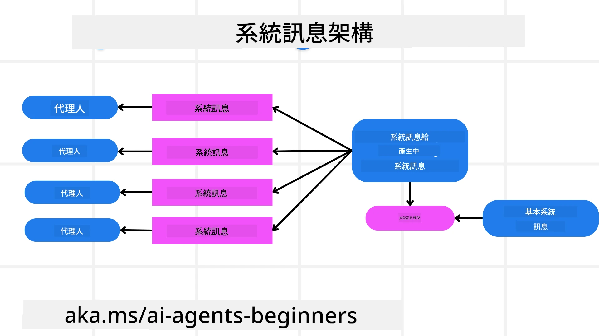
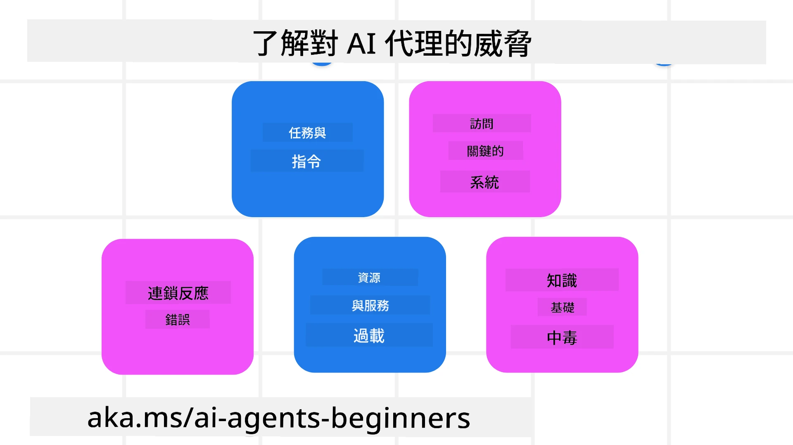
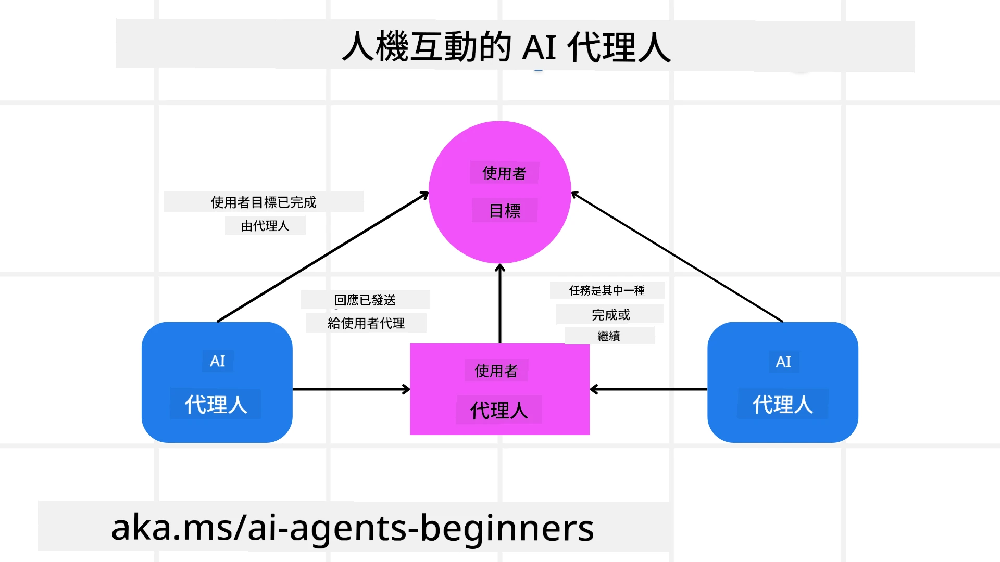

[](https://youtu.be/iZKkMEGBCUQ?si=Q-kEbcyHUMPoHp8L)

> _(點擊上方圖片以觀看本課程的影片)_

# 建立可信賴的 AI 代理人

## 介紹

本課程將涵蓋：

- 如何建立和部署安全且有效的 AI 代理人
- 開發 AI 代理人時的重要安全考量
- 開發 AI 代理人時如何維護資料與使用者隱私

## 學習目標

完成本課程後，您將能夠：

- 辨識並降低建立 AI 代理人時的風險
- 實施安全措施以確保資料和存取權限得到妥善管理
- 建立維護資料隱私且提供良好用戶體驗的 AI 代理人

## 安全性

我們先來看看如何建立安全的代理應用程式。安全性意味著 AI 代理能按設計正常運作。作為代理應用程式的開發者，我們擁有方法和工具，能最大化安全性：

### 建立系統訊息框架

如果您曾使用大型語言模型（LLMs）開發 AI 應用程式，就知道設計穩健系統提示或系統訊息的重要性。這些提示建立了 LLM 與使用者及資料互動的元規則、指示和指南。

對 AI 代理人而言，系統提示更為重要，因為 AI 代理人需要非常具體的指示來完成我們為其設計的任務。

為了創造可擴展的系統提示，我們可以利用系統訊息框架，為應用程式中的一個或多個代理建立系統提示：



#### 第一步：建立元系統訊息

元提示將被 LLM 用來生成我們建立的代理系統提示。我們將它設計為模板，以便在需要時高效建立多個代理。

以下是我們會給 LLM 的元系統訊息範例：

```plaintext
You are an expert at creating AI agent assistants. 
You will be provided a company name, role, responsibilities and other
information that you will use to provide a system prompt for.
To create the system prompt, be descriptive as possible and provide a structure that a system using an LLM can better understand the role and responsibilities of the AI assistant. 
```

#### 第二步：建立基本提示

接著建立一個基本提示，描述 AI 代理。您應該包含代理的角色、代理將完成的任務，以及代理的其他任何責任。

以下是範例：

```plaintext
You are a travel agent for Contoso Travel that is great at booking flights for customers. To help customers you can perform the following tasks: lookup available flights, book flights, ask for preferences in seating and times for flights, cancel any previously booked flights and alert customers on any delays or cancellations of flights.  
```

#### 第三步：向 LLM 提供基本系統訊息

現在我們可以透過提供元系統訊息作為系統訊息，結合基本系統訊息，來優化這個系統訊息。

這將產生一個更適合指導 AI 代理的系統訊息：

```markdown
**Company Name:** Contoso Travel  
**Role:** Travel Agent Assistant

**Objective:**  
You are an AI-powered travel agent assistant for Contoso Travel, specializing in booking flights and providing exceptional customer service. Your main goal is to assist customers in finding, booking, and managing their flights, all while ensuring that their preferences and needs are met efficiently.

**Key Responsibilities:**

1. **Flight Lookup:**
    
    - Assist customers in searching for available flights based on their specified destination, dates, and any other relevant preferences.
    - Provide a list of options, including flight times, airlines, layovers, and pricing.
2. **Flight Booking:**
    
    - Facilitate the booking of flights for customers, ensuring that all details are correctly entered into the system.
    - Confirm bookings and provide customers with their itinerary, including confirmation numbers and any other pertinent information.
3. **Customer Preference Inquiry:**
    
    - Actively ask customers for their preferences regarding seating (e.g., aisle, window, extra legroom) and preferred times for flights (e.g., morning, afternoon, evening).
    - Record these preferences for future reference and tailor suggestions accordingly.
4. **Flight Cancellation:**
    
    - Assist customers in canceling previously booked flights if needed, following company policies and procedures.
    - Notify customers of any necessary refunds or additional steps that may be required for cancellations.
5. **Flight Monitoring:**
    
    - Monitor the status of booked flights and alert customers in real-time about any delays, cancellations, or changes to their flight schedule.
    - Provide updates through preferred communication channels (e.g., email, SMS) as needed.

**Tone and Style:**

- Maintain a friendly, professional, and approachable demeanor in all interactions with customers.
- Ensure that all communication is clear, informative, and tailored to the customer's specific needs and inquiries.

**User Interaction Instructions:**

- Respond to customer queries promptly and accurately.
- Use a conversational style while ensuring professionalism.
- Prioritize customer satisfaction by being attentive, empathetic, and proactive in all assistance provided.

**Additional Notes:**

- Stay updated on any changes to airline policies, travel restrictions, and other relevant information that could impact flight bookings and customer experience.
- Use clear and concise language to explain options and processes, avoiding jargon where possible for better customer understanding.

This AI assistant is designed to streamline the flight booking process for customers of Contoso Travel, ensuring that all their travel needs are met efficiently and effectively.

```

#### 第四步：反覆修正與改進

系統訊息框架的價值在於能讓您更輕鬆地擴展多代理的系統訊息建立、並隨時間改善系統訊息。初次建立的系統訊息很少能完全適用於您的全部使用情境。能夠透過變更基本系統訊息並透過系統執行來做小幅的調整和改進，讓您比較並評估結果。

## 理解威脅

要建立可信賴的 AI 代理人，了解並減輕對 AI 代理人的風險和威脅非常重要。我們來看看部分針對 AI 代理人的不同威脅，以及您如何更好地規劃與準備。



### 任務與指示

**描述：** 攻擊者嘗試透過提示或操控輸入來更改 AI 代理的指示或目標。

**緩解措施：** 執行驗證檢查與輸入過濾，檢測潛在危險提示，避免其被 AI 代理處理。由於這類攻擊通常需要頻繁與代理互動，限制對話回合數是另一種防範這類攻擊的方法。

### 存取關鍵系統

**描述：** 若 AI 代理能存取存有敏感資料的系統與服務，攻擊者可能破壞代理與這些服務之間的通訊。這些攻擊可以是直接侵入或透過代理間接獲取系統資訊。

**緩解措施：** AI 代理應依照需要存取原則，減少不必要的系統存取，以防範此類攻擊。代理與系統間的通訊也應確保安全。實施身份驗證與存取控制是保護此資訊的另一途徑。

### 資源與服務過載

**描述：** AI 代理可使用不同工具與服務完成任務。攻擊者可利用此功能，透過 AI 代理發送大量請求來攻擊服務，可能導致系統故障或高額費用。

**緩解措施：** 實施政策限制 AI 代理向服務發送請求的數量。限制對 AI 代理的對話回合數和請求量也是防範此類攻擊的方法。

### 知識庫中毒

**描述：** 這類攻擊並非直接針對 AI 代理，而是針對代理使用的知識庫和其他服務。攻擊可能破壞 AI 代理的資料來源，導致回應使用者時產生偏頗或非預期的回答。

**緩解措施：** 定期檢驗 AI 代理在工作流程中使用的資料。確保該資料的存取受保護，僅由信任的人員更動，以避免此類攻擊。

### 連鎖錯誤

**描述：** AI 代理使用多種工具與服務完成任務。攻擊者引起的錯誤可能導致 AI 代理連接的其他系統故障，使攻擊更加廣泛且更難排查。

**緩解措施：** 避免方法之一是讓 AI 代理於受限環境中運行，如在 Docker 容器中執行，以阻止系統直接被攻擊。建立失敗回退機制和錯誤重試邏輯，當部分系統回傳錯誤時，也是防止系統擴大故障的方式。

## 人工監督（Human-in-the-Loop）

另一種建立可信賴 AI 代理系統的有效方法是使用人工監督。此流程允許使用者在代理運行期間提供回饋。使用者實際上扮演多代理系統中的代理，透過批准或終止運行流程來干預。



以下是一段使用 Microsoft Agent Framework 的程式碼片段，展示此概念的實作方式：

```python
import os
from agent_framework.azure import AzureAIProjectAgentProvider
from azure.identity import AzureCliCredential

# 建立具有人類審核程序的提供者
provider = AzureAIProjectAgentProvider(
    credential=AzureCliCredential(),
)

# 建立具有人類審核步驟的代理人
response = provider.create_response(
    input="Write a 4-line poem about the ocean.",
    instructions="You are a helpful assistant. Ask for user approval before finalizing.",
)

# 使用者可以審查並批准回應
print(response.output_text)
user_input = input("Do you approve? (APPROVE/REJECT): ")
if user_input == "APPROVE":
    print("Response approved.")
else:
    print("Response rejected. Revising...")
```

## 結語

建立可信賴的 AI 代理人需要謹慎設計、強健的安全措施及持續迭代。藉由實施結構化的元提示系統、了解潛在威脅並採取緩解策略，開發者可以打造既安全又有效的 AI 代理人。此外，結合人工監督方法確保 AI 代理人持續符合使用者需求，同時降低風險。隨著 AI 持續演進，積極維護安全、隱私及倫理考量，是促進 AI 驅動系統信賴與可靠的關鍵。

### 想了解更多關於建立可信賴 AI 代理人的問題嗎？

加入 [Microsoft Foundry Discord](https://aka.ms/ai-agents/discord)，與其他學習者交流，參加辦公時間並獲取您的 AI 代理人疑問解答。

## 額外資源

- <a href="https://learn.microsoft.com/azure/ai-studio/responsible-use-of-ai-overview" target="_blank">負責任的 AI 概述</a>
- <a href="https://learn.microsoft.com/azure/ai-studio/concepts/evaluation-approach-gen-ai" target="_blank">生成式 AI 模型與 AI 應用的評估</a>
- <a href="https://learn.microsoft.com/azure/ai-services/openai/concepts/system-message?context=%2Fazure%2Fai-studio%2Fcontext%2Fcontext&tabs=top-techniques" target="_blank">安全系統訊息</a>
- <a href="https://blogs.microsoft.com/wp-content/uploads/prod/sites/5/2022/06/Microsoft-RAI-Impact-Assessment-Template.pdf?culture=en-us&country=us" target="_blank">風險評估範本</a>

## 上一課

[Agentic RAG](../05-agentic-rag/README.md)

## 下一課

[規劃設計模式](../07-planning-design/README.md)

---

<!-- CO-OP TRANSLATOR DISCLAIMER START -->
**免責聲明**：  
本文件使用 AI 翻譯服務 [Co-op Translator](https://github.com/Azure/co-op-translator) 進行翻譯。儘管我們力求準確，請注意自動翻譯可能包含錯誤或不準確之處。文件的原始語言版本應視為權威來源。對於關鍵資訊，建議尋求專業人工翻譯。我們對因使用本翻譯內容所導致的任何誤解或誤讀不承擔任何責任。
<!-- CO-OP TRANSLATOR DISCLAIMER END -->