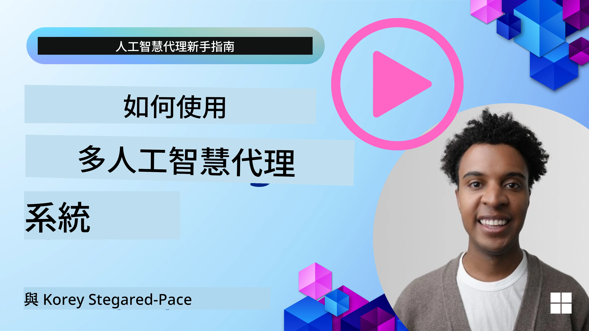
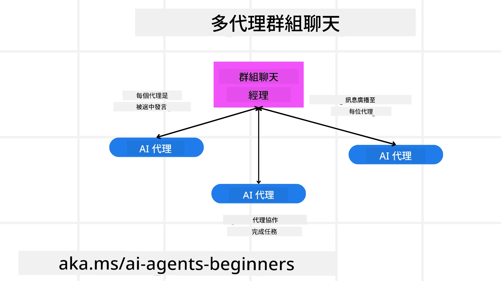
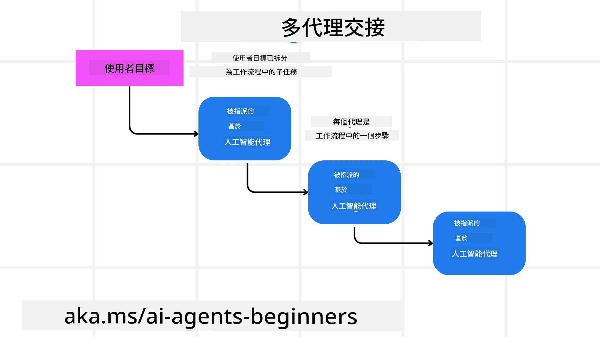
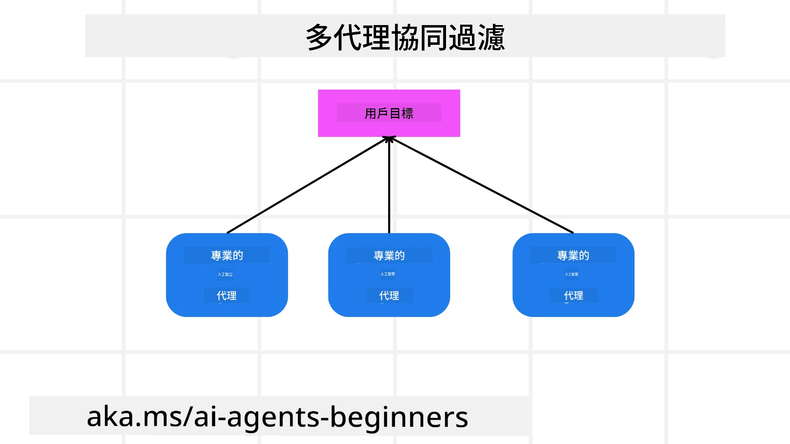

> _(點擊上方圖片觀看本課影片)_

# 多智能體設計模式

當你開始著手處理一個涉及多智能體的專案時，就需要考慮多智能體設計模式。然而，什麼時候切換到多智能體以及其優點可能不會立即顯而易見。

## 簡介

在本課中，我們將回答以下問題：

- 多智能體適用於哪些情境？
- 使用多智能體相較於單一智能體執行多個任務有哪些優點？
- 實作多智能體設計模式的構成要素有哪些？
- 我們如何掌握多個智能體彼此互動的過程？

## 學習目標

完成本課後，你應該能夠：

- 識別多智能體適用的情境
- 認識使用多智能體相較於單一智能體的優勢
- 理解實作多智能體設計模式的構成要素

更大的視野是什麼？

*多智能體是一種設計模式，讓多個智能體協同合作達成共同目標*。

這個模式廣泛應用於各個領域，包括機器人、自治系統和分散式計算。

## 多智能體適用的情境

哪些情境適合使用多智能體？答案是，有許多情境中使用多智能體有其優勢，特別是在以下幾種情況：

- **龐大工作量**：龐大的工作可拆解成更小的任務，分配給不同智能體，讓工作能並行處理並更快速完成。如大型資料處理任務的例子。
- **複雜任務**：複雜的任務像龐大工作量一樣，可拆成較小子任務，由專精不同面向的智能體分工執行。例如在自主車輛案例中，不同智能體負責導航、障礙物偵測和車輛間通訊。
- **多元專業**：不同智能體具備多元專業知識，更能有效處理任務的各個面向，比單一智能體更勝任。例如在醫療領域中，智能體可分別處理診斷、治療計劃及病患監控。

## 使用多智能體相較於單一智能體的優點

單一智能體系統在簡單任務中運作良好，但在較複雜任務時，運用多智能體系統能提供多項優勢：

- **專精化**：每個智能體可專精於特定任務。單一智能體缺乏專精，可能會在面對複雜任務時感到困惑，例如可能執行非其最佳適合的工作。
- **可擴展性**：透過增加更多智能體，比單一智能體負荷過重更容易擴展系統。
- **容錯性**：若其中一個智能體故障，其他智能體仍可持續運作，保障系統穩定性。

舉個例子，我們為用戶訂製旅行行程。單一智能體系統必須處理訂機票、訂旅館和租車等所有流程。為了實現，智能體需具備多項工具，系統將變得龐大且難以維護與擴展。多智能體系統則可拆分為專門負責訂機票、訂旅館及租車的不同智能體，使系統更模組化、易於維護與擴展。

類似於一個由夫妻倆經營的旅遊社與一個加盟連鎖旅遊社相比較。前者由單一智能體負責所有訂票流程，後者則由不同智能體負責各項不同的旅遊事務。

## 多智能體設計模式的構成要素

在實作多智能體設計模式前，你需要了解構成此模式的要素。

以訂製旅行行程為例，構成要素包括：

- **智能體間通訊**：負責訂機票、訂旅館與租車的智能體需要溝通並共享用戶偏好及限制資訊。你需決定通訊協議和方式。具體來說，訂機票的智能體需和訂旅館的智能體溝通，確保旅館訂於同一天數。意味著智能體必須共享用戶的旅行日期資訊，你需要決定*哪些智能體共享資訊、如何共享*。
- **協調機制**：智能體間必須協調行動，確保滿足用戶偏好和限制。例如，若用戶喜好旅館靠近機場，但租車僅能在機場取車，訂旅館智能體須與訂租車智能體協調，使偏好與限制都得到落實。你需決定*智能體如何協調行動*。
- **智能體架構**：智能體內部需有結構用來決策並從與用戶的互動中學習。如訂機票的智能體需要架構來決定推薦哪些航班，這意味你必須決定*智能體如何做決策並學習與用戶的互動*。例如，訂機票智能體可利用機器學習模型，根據用戶過去偏好推薦適合航班。
- **多智能體互動可見性**：你必須掌握多個智能體彼此如何互動。因此你需要具備記錄和監控工具、視覺化工具及效能指標以追蹤智能體活動與互動。
- **多智能體模式**：實作多智能體系統有不同模式，如集中式、分散式及混合架構。需要選擇最適合的模式。
- **人為介入**：大多數情況下會有人類介入，你需要設定智能體何時需請求人工干預。舉例而言，智能體可能需要在用戶要求特定飯店或航班未被推薦時，或預訂前需用戶確認等時機請求介入。

## 多智能體互動可見性

你必須掌握多智能體彼此互動情況。這對調試、優化及確保系統總體效益至關重要。為達成此目標，你需要具備追蹤智能體活動與互動的工具與方法，可能包含記錄與監控工具、視覺化工具及效能指標。

以訂製旅行行程為例，你可以有一個儀表板顯示各智能體狀態、用戶偏好與限制，以及智能體間的互動。該儀表板展示用戶旅行日期、航班智能體推薦航班、旅館智能體推薦飯店及租車智能體推薦車輛。藉此清楚瞭解智能體如何互動，並判斷用戶偏好和限制是否被符合。

讓我們更詳盡探討這些面向。

- **記錄與監控工具**：希望記錄智能體的每項行動。記錄條目可存下執行該行動的智能體、行動內容、時間及結果。此資訊可供調試、優化等用途。
- **視覺化工具**：視覺化工具能讓你直覺地看到智能體間互動。例如可有一張圖展現資訊流經智能體的情況，有助於找出系統瓶頸、不效率及其他問題。
- **效能指標**：效能指標可追蹤多智能體系統效能，例如完成任務所需時間、每單位時間完成的任務數量，以及智能體推薦的準確度等。此些資訊有助找出可改善處並優化系統。

## 多智能體設計模式

讓我們深入一些具體模式以便建立多智能體應用。以下是幾個值得考慮的有趣模式：

### 群組聊天

此模式適合建立多智能體間能互相通訊的群組聊天室。典型應用包括團隊協作、客戶支援與社交網路。

在此模式中，每個智能體代表群組聊天室中的一位用戶，訊息透過通訊協議在智能體之間交換。智能體能發送訊息至群組、接收群組訊息並回覆其他智能體訊息。

此模式可用集中式架構實作，即所有訊息經由中央伺服器轉發，或採用分散式架構，訊息直接交換。

### 任務交接

此模式適合建立多智能體能相互交接任務的應用。

典型應用場景包括客戶支援、任務管理和工作流程自動化。

在此模式中，每個智能體代表一個任務或流程中的一個步驟，依事先定義的規則將任務交接給其他智能體。

### 協同過濾

此模式適用於多智能體協同為用戶提供推薦的系統。

多智能體合作的原因在於每個智能體擁有不同專長，可以多面向貢獻推薦過程。

舉例來說，使用者想找股票市場中最佳的買進標的推薦。

- **產業專家**：有一個智能體是特定產業專家。
- **技術分析**：另一個智能體專精技術分析。
- **基本面分析**：還有另一個智能體專精基本面分析。多個智能體合作能為使用者提供更全面的建議。

## 情境：退款流程

考慮一個客戶想申請產品退款的情境，這會涉及相當多智能體，但我們將分成專門針對此流程的智能體與可用於其他流程的一般智能體。

**退款流程專用智能體**：

以下是可能參與退款流程的智能體：

- **客戶智能體**：代表客戶並負責啟動退款流程。
- **賣家智能體**：代表賣家並負責處理退款。
- **付款智能體**：代表付款流程並負責退款給客戶。
- **解決方案智能體**：負責處理退款流程中出現的問題。
- **合規智能體**：確保退款流程符合法規和政策。

**一般智能體**：

這些智能體可用於業務的其他部分。

- **運送智能體**：負責將產品寄回給賣家，既可用於退款流程也可用於其他購買的運送。
- **回饋智能體**：負責收集客戶回饋，回饋可在任何時間取得，不限於退款期間。
- **升級智能體**：負責將問題升級至更高層級支援。此智能體可用於需升級問題的任何流程。
- **通知智能體**：負責在退款流程的各階段向客戶發送通知。
- **分析智能體**：負責分析與退款流程相關的數據。
- **稽核智能體**：負責稽核退款流程以確保正確執行。
- **報告智能體**：負責產生退款流程的報告。
- **知識智能體**：維護與退款流程相關的知識庫，也可包含其他業務領域知識。
- **安全智能體**：確保退款流程的安全。
- **品質智能體**：確保退款流程的品質。

以上列出相當多既專門針對退款流程，也包括可用於其他業務部分一般智能體。希望能幫助你了解如何選擇多智能體系統中使用的智能體。

## 作業

設計一個客戶支援流程的多智能體系統。識別流程中涉及的智能體、其角色與職責，以及它們之間的互動。請考慮既有專屬於客戶支援流程的智能體，也有可用於業務其他部分的一般智能體。
> 在閱讀以下解決方案前先思考一下，你可能需要的代理比你想像的還多。

> TIP：考慮客戶支援流程的不同階段，也要考慮系統所需的代理。

## 解決方案

[Solution](./solution/solution.md)

## 知識檢核

問題：何時該考慮使用多代理？

- [ ] A1：當你有小工作量且任務簡單時。
- [ ] A2：當你有大工作量時。
- [ ] A3：當你有簡單任務時。

[Solution quiz](./solution/solution-quiz.md)

## 總結

在本課程中，我們探討了多代理設計模式，包括多代理適用的情境、使用多代理相較於單一代理的優勢、實作多代理設計模式的組成要素，以及如何了解多個代理彼此交互的情況。

### 對多代理設計模式還有更多問題嗎？

加入 [Microsoft Foundry Discord](https://aka.ms/ai-agents/discord) 與其他學習者交流，參加開放時間並獲得 AI 代理相關問題的解答。

## 額外資源

- <a href="https://learn.microsoft.com/azure/ai-services/agents/overview" target="_blank">Microsoft Agent Framework 文件</a>
- <a href="https://www.analyticsvidhya.com/blog/2024/10/agentic-design-patterns/" target="_blank">代理設計模式（Agentic design patterns）</a>

## 上一課

[規劃設計](../07-planning-design/README.md)

## 下一課

[AI 代理中的元認知](../09-metacognition/README.md)

---

<!-- CO-OP TRANSLATOR DISCLAIMER START -->
**免責聲明**：  
本文件係使用 AI 翻譯服務 [Co-op Translator](https://github.com/Azure/co-op-translator) 進行翻譯。雖然我們致力於準確性，但請注意，自動翻譯可能包含錯誤或不準確之處。原文文件的母語版本應視為權威來源。對於重要資訊，建議尋求專業人工翻譯。我們不對因使用本翻譯而導致的任何誤解或誤讀負責。
<!-- CO-OP TRANSLATOR DISCLAIMER END -->